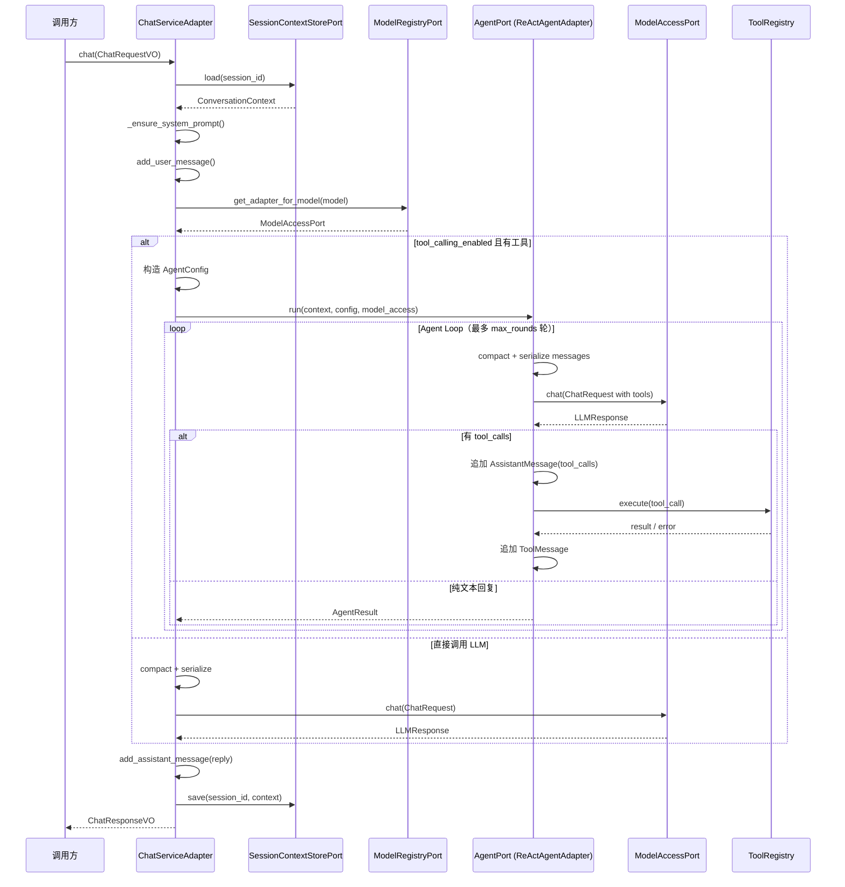
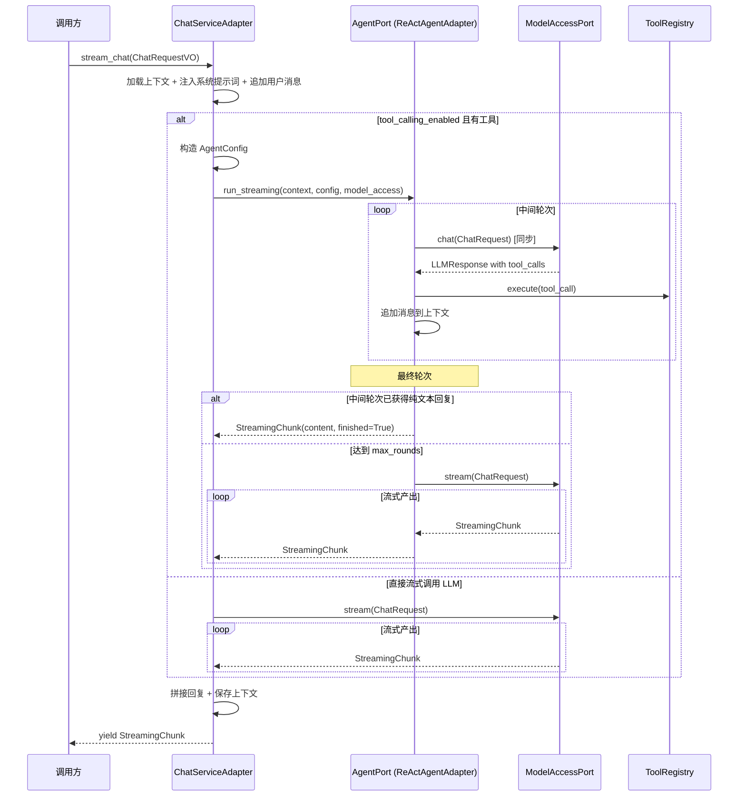

# Design Document: Agent 抽象层

## Overview

将 `ChatServiceAdapter` 中内嵌的 Agent Loop 逻辑（`_run_agent_loop` 和 `_run_agent_loop_streaming`）抽取为独立的 Agent 抽象层。在领域层 `domain/agent/` 中定义 `AgentPort` Protocol、`AgentConfig` 和 `AgentResult` 值对象；在基础设施层 `infrastructure/agent/` 中实现 `ReActAgentAdapter`；最终将 `ChatServiceAdapter` 转变为纯编排层，通过 `AgentPort` 委托 Agent Loop 执行。

本次重构是纯粹的结构性重构，不改变任何外部可观测行为。重构后的系统在相同输入下产生完全相同的输出，包括同步对话的 `ChatResponseVO`、流式对话的 `StreamingChunk` 序列、上下文持久化内容和工具异常处理行为。

### 设计决策

1. **AgentConfig 作为每次调用的配置快照**：`AgentConfig` 封装单次 Agent 执行所需的全部配置（system_prompt、tool_schemas、model、max_rounds），由 `ChatServiceAdapter` 在每次请求时构造并传入 `AgentPort.run()`。这使得 Agent 实例可以是无状态的 Singleton，不同请求可以使用不同的配置。
2. **ReActAgentAdapter 持有 ToolRegistry 和 ContextCompactionPort**：这两个依赖是 Agent 执行循环的核心基础设施，在 Agent 生命周期内不变，因此通过构造函数注入而非每次调用传入。
3. **消息序列化逻辑迁移到 ReActAgentAdapter**：`_serialize_messages` 静态方法从 `ChatServiceAdapter` 迁移到 `ReActAgentAdapter`，因为消息序列化是 Agent Loop 内部的实现细节，不属于编排层职责。
4. **AgentPort.run() 接收 ModelAccessPort 而非 ModelRegistryPort**：Agent 不需要关心模型路由逻辑，编排层（ChatServiceAdapter）负责根据请求解析出具体的 `ModelAccessPort` 实例后传入 Agent。
5. **ChatServiceAdapter 保留 tool_calling_enabled 判断**：是否启用 Agent 是编排层的决策，Agent 本身不需要知道这个开关。当 `tool_calling_enabled=False` 时，编排层直接调用 LLM，不经过 AgentPort。

## Architecture

```mermaid
graph TD
    subgraph domain["领域层 (domain/agent/)"]
        AgentPort["AgentPort Protocol<br/>run(), run_streaming()"]
        AgentConfig["AgentConfig (frozen dataclass)<br/>system_prompt, tool_schemas,<br/>model, max_rounds"]
        AgentResult["AgentResult (frozen dataclass)<br/>content, model, usage, latency_ms"]
        ToolRegistry["ToolRegistry"]
        ToolABC["Tool ABC"]
    end

    subgraph domain_chat["领域层 (domain/chat/)"]
        ChatServicePort["ChatServicePort Protocol"]
        CompactionPort["ContextCompactionPort Protocol"]
        SessionStore["SessionContextStorePort Protocol"]
        Context["ConversationContext"]
    end

    subgraph domain_model["领域层 (domain/model_access/)"]
        ModelAccessPort["ModelAccessPort Protocol"]
        ModelRegistryPort["ModelRegistryPort Protocol"]
    end

    subgraph infra_agent["基础设施层 (infrastructure/agent/)"]
        ReActAdapter["ReActAgentAdapter<br/>实现 AgentPort"]
    end

    subgraph infra_chat["基础设施层 (infrastructure/chat/)"]
        ChatAdapter["ChatServiceAdapter<br/>实现 ChatServicePort<br/>（编排层）"]
    end

    ReActAdapter -->|实现| AgentPort
    ReActAdapter -->|依赖| ToolRegistry
    ReActAdapter -->|依赖| CompactionPort
    ReActAdapter -->|调用| ModelAccessPort
    ReActAdapter -->|修改| Context

    ChatAdapter -->|实现| ChatServicePort
    ChatAdapter -->|委托| AgentPort
    ChatAdapter -->|依赖| SessionStore
    ChatAdapter -->|依赖| ModelRegistryPort
    ChatAdapter -->|依赖| CompactionPort
```



### 调用流程（同步模式）



### 调用流程（流式模式）



## Components and Interfaces

### AgentConfig 值对象

```python
# domain/agent/value_objects.py

@dataclass(frozen=True)
class AgentConfig:
    """Agent 执行配置值对象。

    封装单次 Agent 执行所需的全部配置参数，由编排层在每次请求时构造。
    使用 frozen dataclass 确保不可变性。

    Attributes:
        system_prompt: 系统提示词
        tool_schemas: 工具 schema 列表，格式为 OpenAI function calling schema
        model: 可选的模型名称，None 时使用默认模型
        max_rounds: Agent Loop 最大迭代轮次，必须 > 0
    """
    system_prompt: str
    tool_schemas: list[dict[str, Any]]
    model: str | None
    max_rounds: int

    def __post_init__(self) -> None:
        if self.max_rounds <= 0:
            raise ValueError(f"max_rounds 必须大于 0，当前值: {self.max_rounds}")
```

### AgentResult 值对象

```python
# domain/agent/value_objects.py

@dataclass(frozen=True)
class AgentResult:
    """Agent 同步执行结果值对象。

    封装 Agent 执行完成后的返回数据。

    Attributes:
        content: 最终回复文本内容
        model: 实际使用的模型名称
        usage: 所有轮次累计的 token 用量
        latency_ms: 最后一轮的请求延迟（毫秒）
    """
    content: str
    model: str
    usage: dict[str, int] = field(default_factory=dict)
    latency_ms: float = 0.0
```

### AgentPort Protocol

```python
# domain/agent/ports.py

class AgentPort(Protocol):
    """Agent 端口协议。

    定义"接收任务、自主执行、返回结果"的统一接口。
    支持同步和流式两种执行模式。

    实现者负责执行 Agent Loop（推理→行动→观察循环），
    并在执行过程中原地修改传入的 ConversationContext。
    """

    async def run(
        self,
        context: ConversationContext,
        config: AgentConfig,
        model_access: ModelAccessPort,
    ) -> AgentResult:
        """同步执行 Agent Loop。

        循环调用 LLM 并执行工具，直到获得纯文本回复或达到最大轮次。
        执行过程中原地修改 context（追加 AssistantMessage 和 ToolMessage）。

        Args:
            context: 对话上下文，会被原地修改
            config: Agent 执行配置
            model_access: 模型访问端口实例

        Returns:
            AgentResult，包含最终回复和累计 token 用量
        """
        ...

    def run_streaming(
        self,
        context: ConversationContext,
        config: AgentConfig,
        model_access: ModelAccessPort,
    ) -> AsyncIterator[StreamingChunk]:
        """流式执行 Agent Loop。

        中间轮次使用同步调用执行工具，最终轮次以流式方式产出分片。
        执行过程中原地修改 context（追加 AssistantMessage 和 ToolMessage）。

        Args:
            context: 对话上下文，会被原地修改
            config: Agent 执行配置
            model_access: 模型访问端口实例

        Yields:
            StreamingChunk 分片
        """
        ...
```

### ReActAgentAdapter

```python
# infrastructure/agent/react_agent_adapter.py

class ReActAgentAdapter:
    """ReAct 模式 Agent 适配器，实现 AgentPort 协议。

    封装"推理→行动→观察"循环逻辑，从 ChatServiceAdapter 中提取。
    持有 ToolRegistry 和 ContextCompactionPort 作为长期依赖。

    Attributes:
        _tool_registry: 工具注册表
        _compaction: 上下文压缩端口
    """

    def __init__(
        self,
        tool_registry: ToolRegistry,
        compaction: ContextCompactionPort,
    ) -> None: ...

    @staticmethod
    def _serialize_messages(messages: list[BaseMessage]) -> list[dict[str, Any]]:
        """将 BaseMessage 列表序列化为 LLM API 所需的字典列表。

        从 ChatServiceAdapter._serialize_messages 迁移而来，逻辑完全一致。
        """
        ...

    async def run(
        self,
        context: ConversationContext,
        config: AgentConfig,
        model_access: ModelAccessPort,
    ) -> AgentResult:
        """同步 Agent Loop，等价于原 ChatServiceAdapter._run_agent_loop。"""
        ...

    async def run_streaming(
        self,
        context: ConversationContext,
        config: AgentConfig,
        model_access: ModelAccessPort,
    ) -> AsyncIterator[StreamingChunk]:
        """流式 Agent Loop，等价于原 ChatServiceAdapter._run_agent_loop_streaming。"""
        ...
```

### ChatServiceAdapter 重构后的构造函数

```python
# infrastructure/chat/chat_service_adapter.py

class ChatServiceAdapter(ChatServicePort):
    def __init__(
        self,
        session_store: SessionContextStorePort,
        model_registry: ModelRegistryPort,
        system_prompt: str,
        compaction: ContextCompactionPort,
        agent: AgentPort,
        tool_calling_enabled: bool,
    ) -> None:
        """重构后的构造函数。

        移除了 tool_registry 和 max_tool_rounds 参数，
        新增 agent 参数（AgentPort 实例）。
        tool_schemas 和 max_rounds 在每次请求时通过 AgentConfig 传入 Agent。
        """
        ...
```

### 依赖关系

| 组件 | 依赖 | 说明 |
|------|------|------|
| AgentConfig | 无 | 纯值对象 |
| AgentResult | 无 | 纯值对象 |
| AgentPort | AgentConfig, AgentResult, ConversationContext, ModelAccessPort, StreamingChunk | Protocol 定义 |
| ReActAgentAdapter | ToolRegistry, ContextCompactionPort | 构造函数注入 |
| ChatServiceAdapter | AgentPort, SessionContextStorePort, ModelRegistryPort, ContextCompactionPort | 构造函数注入 |

## Data Models

### AgentConfig 字段定义

| 字段 | 类型 | 必填 | 默认值 | 约束 | 说明 |
|------|------|------|--------|------|------|
| system_prompt | str | 是 | - | - | 系统提示词 |
| tool_schemas | list[dict[str, Any]] | 是 | - | - | 工具 schema 列表 |
| model | str \| None | 是 | - | - | 模型名称，None 使用默认 |
| max_rounds | int | 是 | - | > 0 | 最大迭代轮次 |

### AgentResult 字段定义

| 字段 | 类型 | 必填 | 默认值 | 说明 |
|------|------|------|--------|------|
| content | str | 是 | - | 最终回复文本 |
| model | str | 是 | - | 实际使用的模型名称 |
| usage | dict[str, int] | 否 | {} | 累计 token 用量 |
| latency_ms | float | 否 | 0.0 | 最后一轮延迟（毫秒） |

### ChatServiceAdapter 构造函数参数变更

| 参数 | 重构前 | 重构后 | 说明 |
|------|--------|--------|------|
| session_store | ✅ | ✅ | 不变 |
| model_registry | ✅ | ✅ | 不变 |
| system_prompt | ✅ | ✅ | 不变 |
| compaction | ✅ | ✅ | 不变（直接 LLM 调用路径仍需要） |
| tool_registry | ✅ | ❌ | 移除，转移到 ReActAgentAdapter |
| max_tool_rounds | ✅ | ❌ | 移除，通过 AgentConfig.max_rounds 传入 |
| tool_calling_enabled | ✅ | ✅ | 不变 |
| agent | ❌ | ✅ | 新增，AgentPort 实例 |


## Correctness Properties

*A property is a characteristic or behavior that should hold true across all valid executions of a system — essentially, a formal statement about what the system should do. Properties serve as the bridge between human-readable specifications and machine-verifiable correctness guarantees.*

### Property 1: Value object construction and immutability

*For any* valid system_prompt (str), tool_schemas (list[dict]), model (str | None), and max_rounds (int > 0), constructing an `AgentConfig` should succeed and all field values should be preserved. *For any* valid content (str), model (str), usage (dict[str, int]), and latency_ms (float), constructing an `AgentResult` should succeed and all field values should be preserved. Both types should be frozen: attempting to reassign any attribute should raise `FrozenInstanceError`.

**Validates: Requirements 1.1, 3.1**

### Property 2: AgentConfig max_rounds validation

*For any* integer max_rounds <= 0, constructing an `AgentConfig` should raise `ValueError`. *For any* integer max_rounds > 0, construction should succeed.

**Validates: Requirements 1.2**

### Property 3: Message serialization correctness

*For any* list of `BaseMessage` objects (including `AssistantMessage` with tool_calls and `ToolMessage` with tool_call_id), `ReActAgentAdapter._serialize_messages()` should produce output identical to the original `ChatServiceAdapter._serialize_messages()` for the same input.

**Validates: Requirements 4.7**

### Property 4: Token usage accumulation

*For any* sequence of `LLMResponse` objects returned across multiple Agent Loop rounds (where intermediate rounds contain tool_calls and the final round does not), the `AgentResult.usage` returned by `ReActAgentAdapter.run()` should equal the element-wise sum of all individual `LLMResponse.usage` dictionaries.

**Validates: Requirements 4.6**

### Property 5: Tool exception handling in Agent Loop

*For any* tool that raises an exception during execution within the Agent Loop, the `ReActAgentAdapter` should catch the exception and append a `ToolMessage` to the `ConversationContext` whose `content` equals `str(exception)`, and the loop should continue to the next iteration.

**Validates: Requirements 4.5, 7.4**

### Property 6: Agent run behavioral equivalence

*For any* `ConversationContext`, `AgentConfig`, and mock `ModelAccessPort` that returns a predetermined sequence of `LLMResponse` objects, `ReActAgentAdapter.run()` should produce an `AgentResult` whose `content` and `model` fields match the final `LLMResponse`, and the `ConversationContext` should contain the same sequence of `AssistantMessage` and `ToolMessage` entries as the original `ChatServiceAdapter._run_agent_loop` would have produced.

**Validates: Requirements 4.3, 2.5, 7.1**

### Property 7: Agent run_streaming behavioral equivalence

*For any* `ConversationContext`, `AgentConfig`, and mock `ModelAccessPort` that returns a predetermined sequence of responses, `ReActAgentAdapter.run_streaming()` should yield the same `StreamingChunk` sequence as the original `ChatServiceAdapter._run_agent_loop_streaming` would have produced, and the `ConversationContext` should contain the same messages.

**Validates: Requirements 4.4, 7.2**

### Property 8: ChatServiceAdapter delegation routing

*For any* `ChatRequestVO`, when `tool_calling_enabled` is `True` and the `AgentPort` has non-empty tool schemas, `ChatServiceAdapter.chat()` should delegate to `AgentPort.run()` and `stream_chat()` should delegate to `AgentPort.run_streaming()`. When `tool_calling_enabled` is `False`, the `AgentPort` should not be invoked, and the LLM should be called directly.

**Validates: Requirements 5.2, 5.3, 5.4**

## Error Handling

本次重构不引入新的错误类型或错误处理路径。所有错误处理行为与重构前保持一致：

### AgentConfig 构造校验

| 条件 | 异常 | 说明 |
|------|------|------|
| max_rounds <= 0 | ValueError | 在 `__post_init__` 中校验 |

### ReActAgentAdapter Agent Loop 错误处理

| 场景 | 处理方式 | 说明 |
|------|---------|------|
| 工具执行抛出异常 | 捕获异常，将 `str(e)` 作为 ToolMessage content 追加到上下文 | 与原 `_run_agent_loop` 行为一致 |
| LLM 调用失败 | 异常向上传播（ModelAccessError 等） | 不捕获，由编排层处理 |
| 达到 max_rounds 上限 | 返回最后一轮的 LLM 响应 | 不抛异常，正常返回 |

### ChatServiceAdapter 编排层错误处理

| 场景 | 处理方式 | 说明 |
|------|---------|------|
| 上下文加载失败 | 异常向上传播 | 不变 |
| 模型路由失败 | ModelAccessError 向上传播 | 不变 |
| AgentPort.run() 异常 | 向上传播 | 新增路径，但行为等价于原 _run_agent_loop 异常传播 |
| 上下文保存失败 | 异常向上传播 | 不变 |

## Testing Strategy

### 测试框架与库

- **属性测试**：Hypothesis（项目已使用）
- **单元测试**：pytest + pytest-asyncio
- **Mock**：unittest.mock（AsyncMock 用于异步方法）

### 测试文件位置

| 测试类型 | 文件路径 |
|---------|---------|
| 值对象属性测试 | `test/domain/agent/test_agent_value_objects_property.py` |
| 值对象单元测试 | `test/domain/agent/test_agent_value_objects_unit.py` |
| ReActAgentAdapter 属性测试 | `test/infrastructure/agent/test_react_agent_adapter_property.py` |
| ReActAgentAdapter 单元测试 | `test/infrastructure/agent/test_react_agent_adapter_unit.py` |
| ChatServiceAdapter 重构测试 | `test/infrastructure/chat/test_chat_service_adapter_refactor_property.py` |

### 属性测试（Property-Based Tests）

使用 Hypothesis 库，每个属性测试运行至少 100 次迭代。每个测试通过注释标注对应的设计属性。

**Hypothesis 策略设计**：
- AgentConfig 策略：生成随机 system_prompt（`st.text()`）、tool_schemas（`st.lists(st.fixed_dictionaries(...))`）、model（`st.none() | st.text(min_size=1)`）、max_rounds（`st.integers(min_value=1, max_value=100)`）
- AgentResult 策略：生成随机 content、model、usage（`st.dictionaries(st.text(), st.integers())`）、latency_ms（`st.floats(min_value=0)`）
- BaseMessage 列表策略：生成随机的 SystemMessage、UserMessage、AssistantMessage（含/不含 tool_calls）、ToolMessage 组合
- LLMResponse 序列策略：生成多轮响应序列，中间轮次含 tool_calls，最终轮次不含
- ChatRequestVO 策略：生成随机 session_id、message、model

**属性测试清单**：

| 属性测试 | 对应 Property | 标签 |
|---------|--------------|------|
| `test_value_object_construction_and_immutability` | Property 1 | Feature: agent-abstraction-layer, Property 1: Value object construction and immutability |
| `test_agent_config_max_rounds_validation` | Property 2 | Feature: agent-abstraction-layer, Property 2: AgentConfig max_rounds validation |
| `test_message_serialization_correctness` | Property 3 | Feature: agent-abstraction-layer, Property 3: Message serialization correctness |
| `test_token_usage_accumulation` | Property 4 | Feature: agent-abstraction-layer, Property 4: Token usage accumulation |
| `test_tool_exception_handling` | Property 5 | Feature: agent-abstraction-layer, Property 5: Tool exception handling in Agent Loop |
| `test_agent_run_behavioral_equivalence` | Property 6 | Feature: agent-abstraction-layer, Property 6: Agent run behavioral equivalence |
| `test_agent_run_streaming_equivalence` | Property 7 | Feature: agent-abstraction-layer, Property 7: Agent run_streaming behavioral equivalence |
| `test_chat_service_delegation_routing` | Property 8 | Feature: agent-abstraction-layer, Property 8: ChatServiceAdapter delegation routing |

### 单元测试（Unit Tests）

单元测试覆盖具体示例和边界情况，与属性测试互补：

| 测试场景 | 说明 |
|----------|------|
| AgentConfig 基本构造 | 验证各字段赋值正确 |
| AgentConfig max_rounds=0 | 验证抛出 ValueError |
| AgentConfig max_rounds=-1 | 验证抛出 ValueError |
| AgentResult 基本构造 | 验证各字段赋值正确，默认值正确 |
| AgentPort Protocol 结构 | 验证 ReActAgentAdapter 满足 AgentPort Protocol |
| ReActAgentAdapter 单轮无工具调用 | LLM 直接返回文本，验证 AgentResult 正确 |
| ReActAgentAdapter 多轮工具调用 | 模拟 2 轮工具调用 + 1 轮文本回复，验证上下文消息序列 |
| ReActAgentAdapter 达到 max_rounds | 验证达到上限时返回最后一轮响应 |
| ReActAgentAdapter 工具异常 | 模拟工具抛出异常，验证 ToolMessage content 为异常信息 |
| ChatServiceAdapter 委托 AgentPort | tool_calling_enabled=True 时验证 AgentPort.run() 被调用 |
| ChatServiceAdapter 直接调用 LLM | tool_calling_enabled=False 时验证 AgentPort 未被调用 |
| ChatServiceAdapter 上下文保存完整性 | 验证保存的上下文包含 system + user + assistant 消息 |

### 测试配置

```python
@settings(max_examples=100, deadline=5000)
```

每个属性测试必须由单个 Hypothesis `@given` 测试实现，标注对应的 Property 编号。Agent Loop 相关的属性测试因涉及异步 mock 和多轮交互，deadline 设置为 5000ms。
