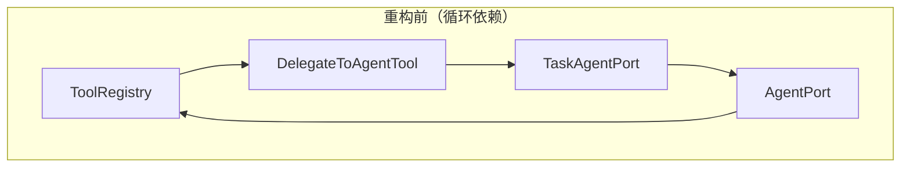
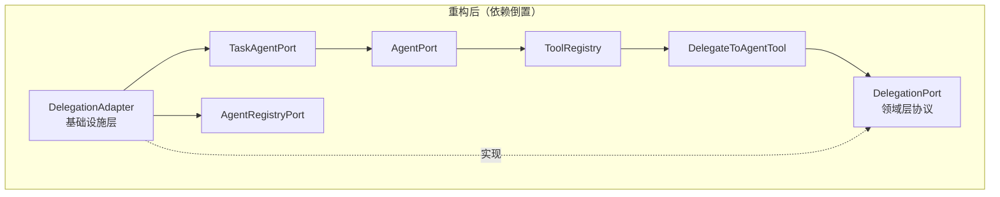

# Design Document: Agent Delegation Decoupling

## Overview

本设计文档描述如何通过引入领域层 `DelegationPort` 协议来消除 Agent 委派机制中的循环依赖链。

当前依赖链为：
```
ToolRegistry → DelegateToAgentTool → TaskAgentPort → AgentPort → ToolRegistry
```

`DelegateToAgentTool` 直接依赖 `TaskAgentPort`，而 `TaskAgentPort` 的实现 `TaskAgentAdapter` 又依赖 `AgentPort`，`AgentPort` 的实现 `ReActAgentAdapter` 依赖 `ToolRegistry`，形成闭环。当前通过 `container_config.py` 中的 lambda 延迟解析（`lambda: container.resolve(TaskAgentPort)`）和 `DelegateToAgentTool` 构造函数中的 `Union[TaskAgentPort, Callable[[], Awaitable[TaskAgentPort]]]` 类型签名来缓解，但这只是运行时 workaround，缺乏架构层面的约束。

重构方案：在 `domain/agent/ports.py` 中新增 `DelegationPort` 协议，定义纯粹的委派能力抽象。`DelegateToAgentTool` 仅依赖 `DelegationPort`，不再感知 `TaskAgentPort`。基础设施层新增 `DelegationAdapter` 桥接 `DelegationPort` → `TaskAgentPort`，在容器配置中按正确顺序注册，从而在架构层面彻底打断循环。

重构后依赖链：
```
ToolRegistry → DelegateToAgentTool → DelegationPort ← DelegationAdapter → TaskAgentPort → AgentPort → ToolRegistry
```

`DelegationPort` 作为领域层抽象，将依赖链从闭环变为开链，`DelegateToAgentTool` 和 `TaskAgentPort` 之间不再有直接或间接的依赖关系。

## Architecture

### 依赖关系变更

重构前后的依赖关系对比：





### 分层归属

| 组件 | 层 | 变更类型 |
|------|------|----------|
| `DelegationPort` | domain/agent | 新增 |
| `DelegationResult` | domain/agent | 新增 |
| `DelegationAdapter` | infrastructure/agent | 新增 |
| `DelegateToAgentTool` | infrastructure/agent | 修改 |
| `container_config.py` | application | 修改 |

### 设计决策

1. **DelegationPort 放在 `domain/agent/ports.py`**：与 `AgentPort`、`AgentRegistryPort` 同模块，保持领域端口的集中管理。委派是 Agent 领域的核心能力之一，归属 agent 子域合理。

2. **DelegationResult 作为独立值对象**：不复用 `TaskResult`，因为 `DelegationPort` 的调用方（`DelegateToAgentTool`）只需要知道结果内容和成功/失败状态，不需要 `TaskResult` 中的 `trace`、`usage`、`model` 等执行细节。这也避免了领域层端口返回值携带过多基础设施语义。

3. **DelegationAdapter 承担 Agent 查找和 Task 构造职责**：将原本在 `DelegateToAgentTool` 中的 Agent 查找和 Task 构造逻辑下沉到 `DelegationAdapter`，使 `DelegateToAgentTool` 只负责深度校验和调用 `DelegationPort.delegate()`。但 `DelegateToAgentTool` 仍保留 `AgentRegistryPort` 依赖，用于生成动态工具描述（已注册 Agent 列表）。

4. **容器中直接注入，不再使用 lazy factory**：`DelegationAdapter` 的构造参数为 `AgentRegistryPort` 和 `TaskAgentPort`，均为直接实例引用。容器注册顺序确保这两个依赖在 `DelegationPort` 工厂执行时已可用。

## Components and Interfaces

### DelegationPort（新增 - 领域层）

```python
# domain/agent/ports.py 中新增

class DelegationPort(Protocol):
    """委派能力端口协议。"""

    async def delegate(
        self,
        agent_name: str,
        task_goal: str,
        input_data: dict[str, Any] | None = None,
        delegation_depth: int = 0,
        max_delegation_depth: int = 3,
    ) -> DelegationResult:
        """将子任务委派给指定命名 Agent 执行。"""
        ...
```

关键设计点：
- `delegation_depth` 和 `max_delegation_depth` 由调用方传入，`DelegationPort` 本身不维护深度状态
- 返回 `DelegationResult` 而非 `TaskResult`，保持领域层的简洁性
- `input_data` 可选，默认 `None`

### DelegationResult（新增 - 领域层）

```python
# domain/agent/value_objects.py 中新增

@dataclass(frozen=True)
class DelegationResult:
    """委派结果值对象。"""
    content: str
    success: bool
```

### DelegationAdapter（新增 - 基础设施层）

```python
# infrastructure/agent/delegation_adapter.py

class DelegationAdapter:
    """DelegationPort 适配器，桥接 AgentRegistryPort 和 TaskAgentPort。"""

    def __init__(
        self,
        agent_registry: AgentRegistryPort,
        task_agent: TaskAgentPort,
    ) -> None: ...

    async def delegate(
        self,
        agent_name: str,
        task_goal: str,
        input_data: dict[str, Any] | None = None,
        delegation_depth: int = 0,
        max_delegation_depth: int = 3,
    ) -> DelegationResult: ...
```

内部流程：
1. 通过 `AgentRegistryPort.get(agent_name)` 查找目标 Agent 配置
2. 未找到时抛出 `AgentNotFoundError`
3. 构造 `Task(goal=task_goal, input_data=input_data or {}, tool_names=config.tool_names, model=config.model, delegation_depth=delegation_depth, session_id=None)`
4. 调用 `TaskAgentPort.execute(task)` 执行
5. 将 `TaskResult` 转换为 `DelegationResult(content=result.content, success=result.status == TaskStatus.SUCCESS)`

### DelegateToAgentTool（修改 - 基础设施层）

变更点：
- 构造函数：`task_agent` 参数替换为 `delegation: DelegationPort`
- 移除 `_task_agent_or_factory`、`_resolved_task_agent`、`_get_task_agent()` 
- `execute()` 方法：深度校验后直接调用 `self._delegation.delegate(agent_name, task_goal, input_data, next_depth, self._max_delegation_depth)`
- 保留 `_agent_registry` 用于动态描述生成
- 不再导入 `TaskAgentPort`、`Task`、`TaskStatus`

### container_config.py（修改 - 应用层）

变更点：
- 新增 `DelegationPort` → `DelegationAdapter` 绑定
- `_create_tool_registry` 中解析 `DelegationPort` 而非使用 lambda 延迟解析 `TaskAgentPort`
- 注册顺序调整：`DelegationPort` 注册在 `TaskAgentPort` 之后、`ToolRegistry` 之前

## Data Models

### 新增值对象

```python
@dataclass(frozen=True)
class DelegationResult:
    """委派结果值对象。

    封装委派执行的结果内容和成功/失败状态。
    使用 frozen dataclass 确保不可变性。

    Attributes:
        content: 结果内容（成功时为 Agent 回复，失败时为错误信息）
        success: 执行是否成功
    """
    content: str
    success: bool
```

### 现有值对象（无变更）

- `Task`：保持不变，`DelegationAdapter` 内部构造
- `TaskResult`：保持不变，`DelegationAdapter` 内部消费并转换为 `DelegationResult`
- `NamedAgentConfig`：保持不变，`DelegationAdapter` 通过 `AgentRegistryPort` 获取
- `AgentConfig`、`AgentResult`：保持不变，不受本次重构影响


## Correctness Properties

*A property is a characteristic or behavior that should hold true across all valid executions of a system — essentially, a formal statement about what the system should do. Properties serve as the bridge between human-readable specifications and machine-verifiable correctness guarantees.*

### Property 1: DelegationResult 构造 round-trip 与不可变性

*For any* content string and success boolean, constructing a `DelegationResult(content=c, success=s)` should yield an object where `result.content == c` and `result.success == s`, and any attempt to mutate the object's attributes should raise `FrozenInstanceError`.

**Validates: Requirements 2.1, 2.2**

### Property 2: DelegationAdapter 正确转换 TaskResult 为 DelegationResult

*For any* registered agent name, valid task goal, optional input data, and any `TaskResult` returned by `TaskAgentPort.execute()`，`DelegationAdapter.delegate()` should return a `DelegationResult` where `result.content == task_result.content` and `result.success == (task_result.status == TaskStatus.SUCCESS)`.

**Validates: Requirements 3.3, 7.4**

### Property 3: DelegationAdapter 对未注册 Agent 抛出 AgentNotFoundError

*For any* agent name that is not registered in `AgentRegistryPort`, calling `DelegationAdapter.delegate()` should raise `AgentNotFoundError` with the correct `agent_name` attribute.

**Validates: Requirements 3.4**

### Property 4: DelegateToAgentTool execute 行为（深度校验 + 成功/失败路由）

*For any* `current_delegation_depth` and `max_delegation_depth` where `current_delegation_depth + 1 > max_delegation_depth`, calling `DelegateToAgentTool.execute()` should raise `DelegationDepthExceededError`. *For any* valid depth (where `current_delegation_depth + 1 <= max_delegation_depth`) and any `DelegationResult` returned by `DelegationPort.delegate()`, if `result.success` is True then `execute()` should return `result.content`; if `result.success` is False then `execute()` should return a string containing the agent name and `result.content`.

**Validates: Requirements 4.3, 7.1, 7.2, 7.4**

### Property 5: DelegateToAgentTool description 包含所有已注册 Agent 名称

*For any* non-empty set of registered agent names in `AgentRegistryPort`, the `DelegateToAgentTool.description` property should contain every agent name in the set. When the set is empty, the description should indicate no available agents.

**Validates: Requirements 4.4, 7.5**

## Error Handling

### 异常传播策略

| 异常 | 抛出位置 | 处理方式 |
|------|----------|----------|
| `AgentNotFoundError` | `DelegationAdapter.delegate()` | 由 `DelegateToAgentTool.execute()` 向上传播，ReAct Agent Loop 捕获后作为 ToolMessage 回传 LLM |
| `DelegationDepthExceededError` | `DelegateToAgentTool.execute()` | 同上，由 Agent Loop 捕获 |
| `TaskAgentPort.execute()` 内部异常 | `DelegationAdapter.delegate()` | `TaskAgentAdapter` 内部已捕获所有异常并转换为 `TaskResult(status=FAILED)`，`DelegationAdapter` 将其映射为 `DelegationResult(success=False)` |

### 错误码

- `AgentNotFoundError`: 60010（保持不变）
- `DelegationDepthExceededError`: 60011（保持不变）

### 边界条件

- `input_data` 为 `None` 时，`DelegationAdapter` 传递空字典 `{}` 给 `Task` 构造函数
- `delegation_depth` 为 0 且 `max_delegation_depth` 为 0 时，任何委派都会触发深度超限（`0 + 1 > 0`）

## Testing Strategy

### 测试框架

- 单元测试：`pytest` + `pytest-asyncio`
- 属性测试：`hypothesis`（项目已使用，见 `.hypothesis/` 目录和现有 `*_property.py` 测试文件）

### 属性测试（Property-Based Testing）

每个属性测试最少运行 100 次迭代。测试文件命名遵循项目现有模式：`*_properties.py`。

| 属性 | 测试文件 | 标签 |
|------|----------|------|
| Property 1 | `test/domain/agent/test_delegation_result_properties.py` | Feature: agent-delegation-decoupling, Property 1: DelegationResult round-trip and immutability |
| Property 2 | `test/infrastructure/agent/test_delegation_adapter_properties.py` | Feature: agent-delegation-decoupling, Property 2: DelegationAdapter TaskResult to DelegationResult transformation |
| Property 3 | `test/infrastructure/agent/test_delegation_adapter_properties.py` | Feature: agent-delegation-decoupling, Property 3: DelegationAdapter raises AgentNotFoundError for unregistered agents |
| Property 4 | `test/infrastructure/agent/test_delegate_tool_delegation_properties.py` | Feature: agent-delegation-decoupling, Property 4: DelegateToAgentTool execute depth gating and result routing |
| Property 5 | `test/infrastructure/agent/test_delegate_tool_delegation_properties.py` | Feature: agent-delegation-decoupling, Property 5: DelegateToAgentTool description includes registered agent names |

### 单元测试

覆盖属性测试不适合的场景：

- `DelegationPort` 协议结构验证（SMOKE）
- `DelegationAdapter` 协议一致性验证（SMOKE）
- `DelegateToAgentTool` 接口稳定性（name、parameters 不变）
- 模块导入依赖方向验证（SMOKE）
- 容器配置集成验证（INTEGRATION）

### 测试文件规划

```
test/
├── domain/agent/
│   └── test_delegation_result_properties.py    # Property 1
├── infrastructure/agent/
│   ├── test_delegation_adapter_properties.py   # Property 2, 3
│   └── test_delegate_tool_delegation_properties.py  # Property 4, 5
```
