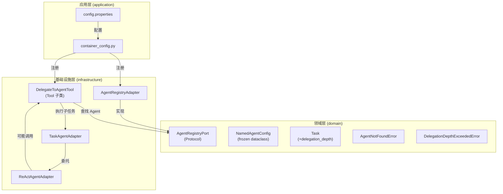
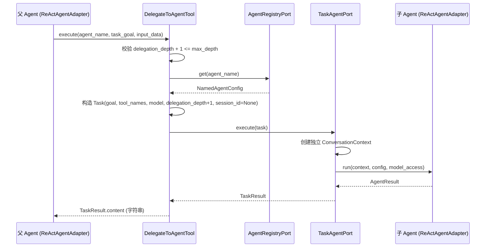

# Design Document: Agent 间通信机制

## Overview

本设计为系统引入 Agent 间通信（Inter-Agent Communication）能力，使多个命名 Agent 实例能够通过工具调用机制相互委派任务。核心思路是将"委派"建模为一个普通的 Tool（`DelegateToAgentTool`），复用现有的 Agent Loop + TaskAgentPort 执行链路，无需修改 ReActAgentAdapter 或 AgentPort 协议。

### 设计决策与理由

1. **委派即工具调用**：将 Agent 间委派建模为 Tool，而非引入新的编排协议。LLM 通过 function calling 自主决定何时委派、委派给谁，与现有工具调用流程完全一致。
2. **复用 TaskAgentPort**：DelegateToAgentTool 内部调用 `TaskAgentPort.execute(task)`，复用已有的 Task → ConversationContext → AgentConfig → AgentPort.run() 执行链路，避免重复实现 Agent Loop。
3. **AgentRegistry 类比 ToolRegistry**：采用与 ToolRegistry 相同的注册表模式管理命名 Agent 配置，保持架构一致性。
4. **递归深度限制**：通过 Task 值对象携带 `delegation_depth`，在 DelegateToAgentTool 执行前校验深度，防止 A→B→A 无限循环。
5. **上下文隔离**：子 Agent 使用独立的 ConversationContext（session_id=None），不继承父 Agent 对话历史，确保执行环境干净。

## Architecture

### 整体架构图



### 委派执行数据流



## Components and Interfaces

### 1. AgentRegistryPort（领域层端口）

**文件路径**: `epsilon-boot/src/domain/agent/ports.py`（追加）

```python
class AgentRegistryPort(Protocol):
    """Agent 注册表端口协议。

    定义命名 Agent 配置的注册、查找和列举能力。
    类似 ToolRegistry 管理 Tool 实例的模式。
    """

    def register(self, config: NamedAgentConfig) -> None:
        """注册一个命名 Agent 配置。"""
        ...

    def get(self, name: str) -> NamedAgentConfig | None:
        """按名称查找已注册的命名 Agent 配置，未找到返回 None。"""
        ...

    def has(self, name: str) -> bool:
        """判断指定名称的 Agent 是否已注册。"""
        ...

    def list_names(self) -> list[str]:
        """返回所有已注册 Agent 的名称列表。"""
        ...
```

### 2. NamedAgentConfig（领域层值对象）

**文件路径**: `epsilon-boot/src/domain/agent/value_objects.py`（追加）

```python
@dataclass(frozen=True)
class NamedAgentConfig:
    """命名 Agent 配置值对象。

    封装一个命名 Agent 的完整定义，包括名称、描述、系统提示词、
    可用工具子集和模型选择。

    Attributes:
        name: Agent 唯一标识名称，不可为空或纯空白
        description: Agent 职责和能力描述，不可为空或纯空白
        system_prompt: 系统提示词
        tool_names: 可用工具名称子集，None 表示使用全量工具
        model: 使用的模型名称，None 表示使用系统默认模型
    """

    name: str
    description: str
    system_prompt: str
    tool_names: frozenset[str] | None = None
    model: str | None = None

    def __post_init__(self) -> None:
        if not self.name or not self.name.strip():
            raise ValueError("name 不能为空或纯空白字符")
        if not self.description or not self.description.strip():
            raise ValueError("description 不能为空或纯空白字符")
```

### 3. Task 值对象扩展

**文件路径**: `epsilon-boot/src/domain/task/value_objects.py`（修改）

在现有 Task 类中新增 `delegation_depth` 字段：

```python
@dataclass(frozen=True)
class Task:
    goal: str
    input_data: dict[str, Any] = field(default_factory=dict)
    constraints: list[str] = field(default_factory=list)
    output_format: str | None = None
    model: str | None = None
    session_id: str | None = None
    tool_names: frozenset[str] | None = None
    delegation_depth: int = 0  # 新增字段

    def __post_init__(self) -> None:
        if not self.goal or not self.goal.strip():
            raise ValueError("goal 不能为空或纯空白字符")
        if self.delegation_depth < 0:
            raise ValueError(f"delegation_depth 不能为负数，当前值: {self.delegation_depth}")
```

### 4. Agent 异常类型

**文件路径**: `epsilon-boot/src/domain/agent/exceptions.py`（追加）

```python
class AgentNotFoundError(BizException):
    """Agent 未找到异常。

    当在 AgentRegistry 中查找不存在的 Agent 名称时抛出。

    Attributes:
        agent_name: 未找到的 Agent 名称
    """

    def __init__(self, agent_name: str, registered_names: list[str]) -> None:
        registered_list = ", ".join(registered_names) if registered_names else "(空)"
        message = f"Agent '{agent_name}' 未找到，当前已注册: [{registered_list}]"
        super().__init__(code=60010, message=message)
        self.agent_name = agent_name


class DelegationDepthExceededError(BizException):
    """委派深度超限异常。

    当 delegation_depth 达到 max_delegation_depth 时抛出。

    Attributes:
        current_depth: 当前委派深度
        max_depth: 最大允许深度
    """

    def __init__(self, current_depth: int, max_depth: int, target_agent: str) -> None:
        message = (
            f"委派深度超限: 当前深度 {current_depth}，最大深度 {max_depth}，"
            f"目标 Agent '{target_agent}'"
        )
        super().__init__(code=60011, message=message)
        self.current_depth = current_depth
        self.max_depth = max_depth
```

### 5. AgentRegistryAdapter（基础设施层实现）

**文件路径**: `epsilon-boot/src/infrastructure/agent/agent_registry_adapter.py`（新建）

```python
class AgentRegistryAdapter:
    """Agent 注册表适配器，实现 AgentRegistryPort 协议。

    使用内部字典管理命名 Agent 配置，支持注册、查找和列举。
    同名 Agent 重复注册时覆盖。
    """

    def __init__(self) -> None:
        self._agents: dict[str, NamedAgentConfig] = {}

    def register(self, config: NamedAgentConfig) -> None:
        self._agents[config.name] = config

    def get(self, name: str) -> NamedAgentConfig | None:
        return self._agents.get(name)

    def has(self, name: str) -> bool:
        return name in self._agents

    def list_names(self) -> list[str]:
        return list(self._agents.keys())
```

### 6. DelegateToAgentTool（基础设施层工具）

**文件路径**: `epsilon-boot/src/infrastructure/agent/delegate_to_agent_tool.py`（新建）

```python
class DelegateToAgentTool(Tool):
    """Agent 委派工具，继承 Tool ABC。

    允许当前 Agent 将子任务委派给其他命名 Agent 执行。
    通过 AgentRegistryPort 查找目标 Agent，构造 Task 调用 TaskAgentPort.execute()。

    Attributes:
        _agent_registry: Agent 注册表端口
        _task_agent: 面向任务的 Agent 端口
        _current_delegation_depth: 当前 Agent 执行所处的委派深度
        _max_delegation_depth: 最大允许委派深度
    """

    def __init__(
        self,
        agent_registry: AgentRegistryPort,
        task_agent: TaskAgentPort,
        current_delegation_depth: int = 0,
        max_delegation_depth: int = 3,
    ) -> None: ...

    @property
    def name(self) -> str:
        return "delegate_to_agent"

    @property
    def description(self) -> str:
        return "将子任务委派给指定的命名 Agent 执行。..."

    @property
    def parameters(self) -> dict[str, Any]:
        return {
            "type": "object",
            "properties": {
                "agent_name": {"type": "string", "description": "目标 Agent 名称"},
                "task_goal": {"type": "string", "description": "子任务目标描述"},
                "input_data": {"type": "object", "description": "可选的结构化输入数据"},
            },
            "required": ["agent_name", "task_goal"],
        }

    async def execute(self, **kwargs: Any) -> str:
        """执行委派逻辑。

        流程：
        1. 校验 delegation_depth + 1 <= max_delegation_depth
        2. 从 AgentRegistryPort 查找目标 NamedAgentConfig
        3. 构造 Task(goal, tool_names, model, delegation_depth+1, session_id=None)
        4. 调用 TaskAgentPort.execute(task)
        5. 返回 TaskResult.content 或错误信息
        """
        ...
```

### 7. DI 容器注册

**文件路径**: `epsilon-boot/src/application/container_config.py`（修改）

在 `configure_container()` 中新增：

```python
# ── Agent Registry ──
container.register(AgentRegistryPort, _create_agent_registry, Scope.SINGLETON)

# 在 _create_tool_registry() 中条件注册 DelegateToAgentTool
```

### 8. 配置项

**文件路径**: `epsilon-boot/config.properties`（追加）

```properties
# Agent 间委派最大递归深度，<=0 时回退为默认值 3
AGENT_MAX_DELEGATION_DEPTH=3
# 是否启用 Agent 委派工具，false 时 ToolRegistry 中不注册 delegate_to_agent
AGENT_DELEGATE_TOOL_ENABLED=true
```


## Data Models

### NamedAgentConfig 值对象

```
NamedAgentConfig (frozen dataclass)
├── name: str                          # Agent 唯一标识名称
├── description: str                   # Agent 职责和能力描述
├── system_prompt: str                 # 系统提示词
├── tool_names: frozenset[str] | None  # 可用工具子集，None=全量
└── model: str | None                  # 模型名称，None=默认
```

**约束**：
- `name` 不可为空或纯空白字符（`__post_init__` 校验）
- `description` 不可为空或纯空白字符（`__post_init__` 校验）
- `frozen=True` 确保不可变性，可安全用作字典键

### Task 值对象（扩展后）

```
Task (frozen dataclass)
├── goal: str                          # 任务目标描述
├── input_data: dict[str, Any]         # 输入数据，默认 {}
├── constraints: list[str]             # 约束条件，默认 []
├── output_format: str | None          # 期望输出格式
├── model: str | None                  # 模型名称
├── session_id: str | None             # 会话标识
├── tool_names: frozenset[str] | None  # 工具名称子集
└── delegation_depth: int              # 委派深度，默认 0（新增）
```

**新增约束**：
- `delegation_depth` 默认值为 0，表示根 Agent 执行
- `delegation_depth < 0` 时 `__post_init__` 抛出 `ValueError`

### AgentRegistryAdapter 内部存储

```
AgentRegistryAdapter
└── _agents: dict[str, NamedAgentConfig]  # name → config 映射
```

### 异常类型层次

```
BizException (common/exceptions.py)
├── ToolExecutionError (60001)
│   ├── ToolNotFoundError (60002)
│   ├── ToolParameterValidationError (60003)
│   └── ToolPermissionDeniedError (60004)
├── AgentNotFoundError (60010)          # 新增
└── DelegationDepthExceededError (60011) # 新增
```

**注意**：`AgentNotFoundError` 和 `DelegationDepthExceededError` 直接继承 `BizException`，而非 `ToolExecutionError`。这是因为它们代表的是 Agent 编排层面的错误，而非工具执行层面的错误。DelegateToAgentTool 在 `execute()` 方法中抛出这些异常时，Tool 基类的 `run()` 方法会将其包装为 `ToolExecutionError`，确保 Agent Loop 能正确处理。

### 配置项模型

| 配置项 | 类型 | 默认值 | 说明 |
|--------|------|--------|------|
| `AGENT_MAX_DELEGATION_DEPTH` | int | 3 | 最大委派深度，<=0 回退为 3 |
| `AGENT_DELEGATE_TOOL_ENABLED` | bool | true | 是否启用委派工具 |


## Correctness Properties

*A property is a characteristic or behavior that should hold true across all valid executions of a system—essentially, a formal statement about what the system should do. Properties serve as the bridge between human-readable specifications and machine-verifiable correctness guarantees.*

### Property 1: NamedAgentConfig 空白字段校验

*For any* string composed entirely of whitespace (including empty string), constructing a `NamedAgentConfig` with that string as `name` or `description` should raise `ValueError`，且使用非空白 name 和 description 的构造应成功。

**Validates: Requirements 2.7, 2.8**

### Property 2: AgentRegistry register/get/has 一致性

*For any* sequence of `NamedAgentConfig` instances registered into an `AgentRegistryAdapter`，对于任意名称 `n`：
- 若 `n` 曾被注册，则 `get(n)` 返回最后一次注册的 config，且 `has(n)` 返回 `True`
- 若 `n` 从未被注册，则 `get(n)` 返回 `None`，且 `has(n)` 返回 `False`

**Validates: Requirements 3.2, 3.3, 3.4, 3.5**

### Property 3: AgentRegistry list_names 完整性

*For any* set of `NamedAgentConfig` instances registered into an `AgentRegistryAdapter`，`list_names()` 返回的名称集合应等于所有已注册 config 的 name 集合（同名覆盖后的去重集合）。

**Validates: Requirements 3.6**

### Property 4: Task 负数 delegation_depth 校验

*For any* negative integer `d`，构造 `Task(goal="test", delegation_depth=d)` 应抛出 `ValueError`。

**Validates: Requirements 4.3**

### Property 5: 异常消息包含标识信息

*For any* `agent_name` 和 `registered_names` 列表，`AgentNotFoundError(agent_name, registered_names)` 的 message 应包含 `agent_name` 和所有 `registered_names` 中的名称。*For any* `current_depth`、`max_depth` 和 `target_agent`，`DelegationDepthExceededError(current_depth, max_depth, target_agent)` 的 message 应包含这三个值的字符串表示。

**Validates: Requirements 5.3, 5.6**

### Property 6: DelegateToAgentTool 未注册 Agent 抛出 AgentNotFoundError

*For any* `agent_name` 不在 `AgentRegistryPort` 中，调用 `DelegateToAgentTool.execute(agent_name=agent_name, task_goal=...)` 应抛出 `AgentNotFoundError`，且异常的 `agent_name` 属性等于传入的名称。

**Validates: Requirements 6.6**

### Property 7: DelegateToAgentTool 正确构造 Task

*For any* 已注册的 `NamedAgentConfig` 和任意 `current_delegation_depth`（在限制范围内），`DelegateToAgentTool.execute()` 构造的 Task 应满足：
- `task.tool_names` 等于 `NamedAgentConfig.tool_names`
- `task.model` 等于 `NamedAgentConfig.model`
- `task.delegation_depth` 等于 `current_delegation_depth + 1`
- `task.session_id` 为 `None`

**Validates: Requirements 6.7, 6.8, 8.1**

### Property 8: DelegateToAgentTool 返回值映射

*For any* `TaskResult`，当 `status` 为 `SUCCESS` 时，`DelegateToAgentTool.execute()` 返回 `TaskResult.content`；当 `status` 为 `FAILED` 时，返回包含错误信息的字符串。

**Validates: Requirements 6.9, 6.10**

### Property 9: DelegateToAgentTool 深度超限抛出 DelegationDepthExceededError

*For any* `current_delegation_depth` 和 `max_delegation_depth`，当 `current_delegation_depth + 1 > max_delegation_depth` 时，`DelegateToAgentTool.execute()` 应抛出 `DelegationDepthExceededError`，且异常包含正确的 `current_depth` 和 `max_depth`。

**Validates: Requirements 7.2**

### Property 10: 非正 max_delegation_depth 回退默认值

*For any* 非正整数（<= 0）作为 `AGENT_MAX_DELEGATION_DEPTH` 配置值，系统应回退使用默认值 3。

**Validates: Requirements 10.2**

## Error Handling

### 错误场景与处理策略

| 错误场景 | 异常类型 | 错误码 | 处理策略 |
|----------|----------|--------|----------|
| 目标 Agent 未注册 | `AgentNotFoundError` | 60010 | DelegateToAgentTool.execute() 抛出，Tool.run() 包装为 ToolExecutionError，Agent Loop 将错误信息回传 LLM |
| 委派深度超限 | `DelegationDepthExceededError` | 60011 | DelegateToAgentTool.execute() 抛出并记录 WARNING 日志，Tool.run() 包装为 ToolExecutionError，Agent Loop 将错误信息回传 LLM |
| 子 Agent 执行失败 | TaskResult.status=FAILED | - | DelegateToAgentTool 返回包含错误信息的字符串，父 Agent Loop 继续运行，LLM 决定后续处理 |
| NamedAgentConfig 字段校验失败 | `ValueError` | - | 在注册阶段（应用启动时）抛出，阻止无效配置进入系统 |
| Task delegation_depth 为负数 | `ValueError` | - | 在 Task 构造时抛出，属于编程错误，不应在正常运行时发生 |

### 错误传播链路

```mermaid
graph LR
    A[DelegateToAgentTool.execute] -->|抛出 AgentNotFoundError / DelegationDepthExceededError| B[Tool.run]
    B -->|包装为 ToolExecutionError| C[ReActAgentAdapter]
    C -->|捕获异常，str(e) 作为 ToolMessage| D[LLM]
    D -->|决定重试/放弃/换策略| E[继续 Agent Loop]
```

关键设计：所有 DelegateToAgentTool 的错误最终都被 Agent Loop 捕获并转化为 ToolMessage 回传给 LLM，不会中断父 Agent 的执行。这与现有工具错误处理模式完全一致。

## Testing Strategy

### 测试框架与工具

- **单元测试**: pytest
- **属性测试**: Hypothesis（项目已使用）
- **Mock**: unittest.mock（用于隔离 TaskAgentPort 等依赖）

### 属性测试配置

- 每个属性测试最少运行 100 次迭代（`@settings(max_examples=100)`）
- 每个属性测试必须通过注释引用设计文档中的 Property 编号
- 标签格式: `Feature: agent-inter-communication, Property {number}: {property_text}`

### 测试文件结构

```
test/
├── domain/
│   └── agent/
│       ├── test_named_agent_config_properties.py    # Property 1
│       └── test_agent_exceptions_properties.py      # Property 5
├── infrastructure/
│   └── agent/
│       ├── test_agent_registry_properties.py        # Property 2, 3
│       └── test_delegate_tool_properties.py         # Property 6, 7, 8, 9
└── domain/
    └── task/
        └── test_task_delegation_depth_properties.py # Property 4
```

### 属性测试与单元测试分工

**属性测试（Hypothesis）**：
- Property 1: 生成随机空白字符串，验证 NamedAgentConfig 校验
- Property 2: 生成随机 NamedAgentConfig 序列，验证 register/get/has 一致性
- Property 3: 生成随机 NamedAgentConfig 集合，验证 list_names 完整性
- Property 4: 生成随机负整数，验证 Task delegation_depth 校验
- Property 5: 生成随机异常参数，验证 message 包含标识信息
- Property 6: 生成随机未注册名称，验证 AgentNotFoundError 抛出
- Property 7: 生成随机 NamedAgentConfig 和 depth，验证 Task 构造正确性
- Property 8: 生成随机 TaskResult，验证返回值映射
- Property 9: 生成随机 depth 组合（current+1 > max），验证深度超限
- Property 10: 生成随机非正整数，验证配置回退

每个属性测试必须由单个 `@given` 装饰的测试函数实现，标签格式：
```python
# Feature: agent-inter-communication, Property 1: NamedAgentConfig 空白字段校验
```

**单元测试（pytest）**：
- DelegateToAgentTool.name 为 "delegate_to_agent"（Requirements 6.2）
- DelegateToAgentTool.parameters schema 结构正确（Requirements 6.3, 6.4）
- Task delegation_depth 默认值为 0（Requirements 4.2）
- AgentNotFoundError 错误码为 60010（Requirements 5.1）
- DelegationDepthExceededError 错误码为 60011（Requirements 5.4）
- AGENT_DELEGATE_TOOL_ENABLED=false 时不注册工具（Requirements 10.4）
- DI 容器正确注册 AgentRegistryPort（Requirements 9.1, 9.2）
