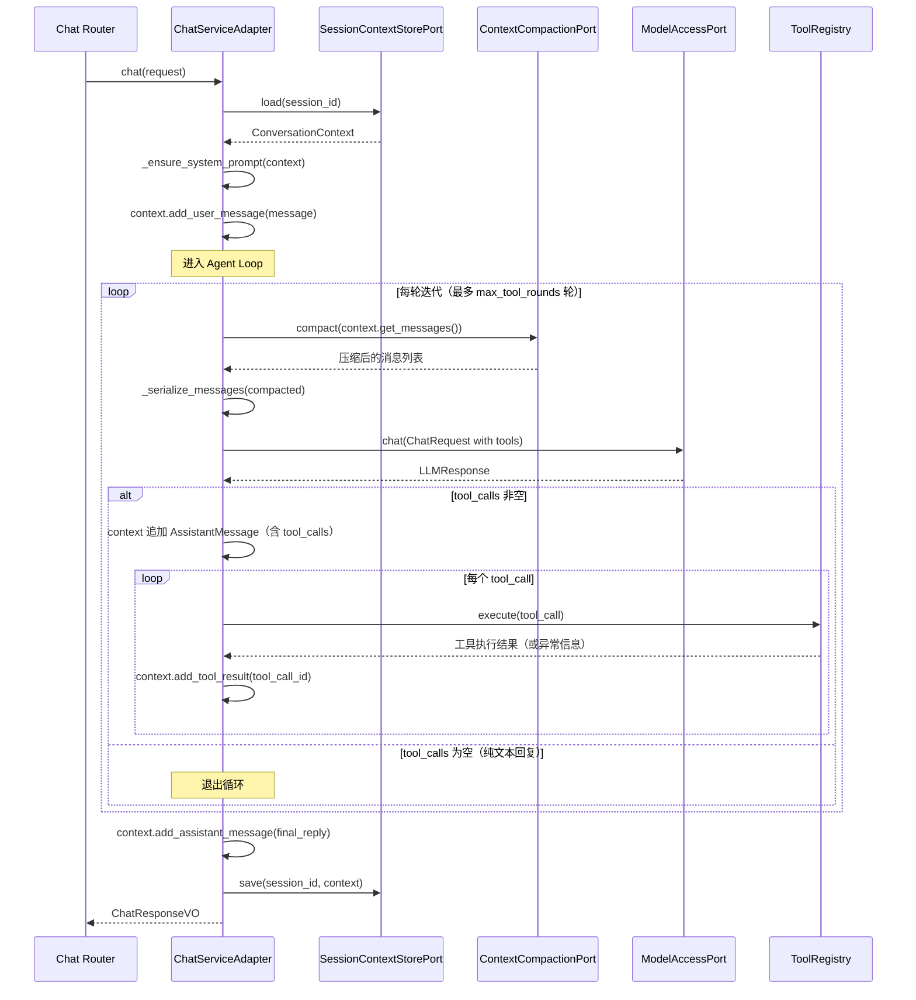
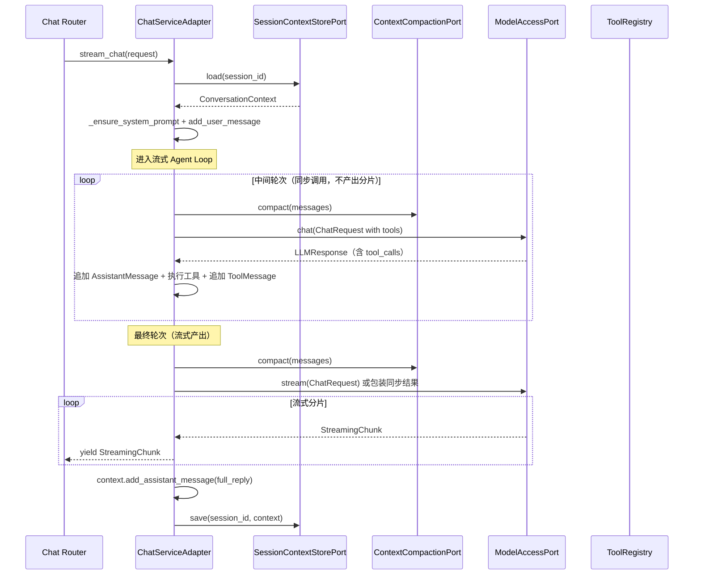

# 技术设计文档：Agent Loop / Function Calling

## 概述

本设计在现有聊天服务中引入 Agent Loop（工具调用循环）能力。当 LLM 返回 `tool_calls` 时，系统自动执行对应工具、将结果回传给 LLM，循环往复直到 LLM 返回纯文本回复或达到最大迭代次数。

项目已具备以下基础设施：
- `Tool` / `ToolRegistry` 抽象体系（`domain/agent/tools.py`）
- `ToolCallRequest` 值对象（`domain/model_access/value_objects.py`）
- `ChatRequest.tools` 字段和 `LLMResponse.tool_calls` 字段
- `OpenAICompatibleAdapter` 中的 tool_calls 解析逻辑

本次设计在此基础上补齐以下能力：
1. **消息模型扩展**：AssistantMessage 新增 `tool_calls` 字段，ToolMessage 新增 `tool_call_id` 字段
2. **消息序列化适配**：`_serialize_messages()` 支持 OpenAI function calling 协议格式
3. **DI 容器注册**：ToolRegistry 通过 DI 容器统一管理
4. **Agent Loop 配置**：通过 `config.properties` 控制循环行为
5. **Agent Loop 编排**：在 `ChatServiceAdapter` 中实现同步和流式两种模式的工具调用循环

### 设计决策

1. **Agent Loop 在 ChatServiceAdapter 中实现**：Agent Loop 是对话编排的一部分，属于基础设施层的协调逻辑，而非领域层的业务规则。将其放在 `ChatServiceAdapter` 中与现有的对话编排流程（加载上下文 → 压缩 → 调用模型 → 保存）自然融合。

2. **工具执行异常不中断循环**：当工具执行抛出异常时，将异常信息作为 ToolMessage 的 content 回传给 LLM，由 LLM 自主决定后续处理（重试、换工具、直接回复）。这符合 Agent 的自主决策理念。

3. **流式模式中间轮次使用同步调用**：中间轮次（LLM 返回 tool_calls）不需要流式输出，使用同步 `chat()` 调用更简洁高效。仅在最终轮次（LLM 返回纯文本）或达到最大轮次时使用流式调用产出分片。

4. **保存完整未压缩上下文**：Agent Loop 过程中产生的所有 AssistantMessage（含 tool_calls）和 ToolMessage 都保存到 SessionContextStorePort，确保对话历史完整性，后续对话可引用工具调用历史。

5. **序列化格式区分存储与传输**：`to_dict()` / `from_dict()` 用于持久化存储（Redis），采用扁平结构；`_serialize_messages()` 用于发送给 LLM API，采用 OpenAI 嵌套结构（`tool_calls[].function.{name, arguments}`）。两者职责分离，互不影响。

6. **ToolRegistry 以 Singleton 注册**：全局共享同一实例，避免重复创建工具对象。通过 DI 容器注入 ChatServiceAdapter，保持依赖方向正确。

## 架构

### 分层架构图

```mermaid
graph TB
    subgraph Application["应用层 (application/)"]
        CC[container_config.py<br/>DI 注册<br/>ToolRegistry Singleton<br/>ChatServiceAdapter 组装]
    end

    subgraph Domain["领域层 (domain/)"]
        subgraph DomainChat["chat/"]
            CTX[ConversationContext<br/>消息容器<br/>add_tool_result&#40;tool_call_id&#41;]
            AM[AssistantMessage<br/>+ tool_calls: list‹ToolCallRequest›]
            TM[ToolMessage<br/>+ tool_call_id: str]
            CSP[ChatServicePort<br/>Protocol]
            CCP[ContextCompactionPort<br/>Protocol]
            SCS[SessionContextStorePort<br/>Protocol]
        end
        subgraph DomainAgent["agent/"]
            TR[ToolRegistry<br/>register / execute / get_schemas]
            TOOL[Tool ABC<br/>name / description / parameters / execute]
        end
        subgraph DomainModel["model_access/"]
            MAP[ModelAccessPort<br/>chat / stream]
            TCR[ToolCallRequest<br/>id / name / arguments]
            LR[LLMResponse<br/>+ tool_calls]
            CR[ChatRequest<br/>+ tools]
        end
    end

    subgraph Infrastructure["基础设施层 (infrastructure/)"]
        CSA[ChatServiceAdapter<br/>_run_agent_loop<br/>_run_agent_loop_streaming<br/>_serialize_messages]
        CFG[ChatConfig<br/>max_tool_rounds<br/>tool_calling_enabled]
        SWA[SlidingWindowCompactionAdapter]
        TOOLS[具体工具实现<br/>ReadFileTool / WriteFileTool<br/>EditFileTool / ListDirTool]
    end

    CSA -->|注入| MAP
    CSA -->|注入| TR
    CSA -->|注入| CCP
    CSA -->|注入| SCS
    CSA -->|使用| CTX
    CSA -->|使用| AM
    CSA -->|使用| TM
    CSA -.->|实现| CSP
    SWA -.->|实现| CCP
    TOOLS -.->|继承| TOOL
    TOOLS -->|注册到| TR
    CC -->|绑定| CSP
    CC -->|绑定| TR
    CSA -->|读取| CFG
```



### Agent Loop 同步模式时序图



### Agent Loop 流式模式时序图



## 组件与接口

### 1. AssistantMessage 扩展（领域层）

位置：`domain/chat/context.py`


```python
@dataclass
class AssistantMessage(BaseMessage):
    """AI 助手回复消息，可选携带 tool_calls。"""

    tool_calls: list[ToolCallRequest] = field(default_factory=list)

    @property
    def role(self) -> str:
        return "assistant"

    def to_dict(self) -> dict[str, Any]:
        """tool_calls 非空时包含该键，为空时不包含（向后兼容）。"""
        data = super().to_dict()
        if self.tool_calls:
            data["tool_calls"] = [
                {"id": tc.id, "name": tc.name, "arguments": tc.arguments}
                for tc in self.tool_calls
            ]
        return data
```

变更点：
- 新增 `tool_calls: list[ToolCallRequest]` 字段，默认空列表
- `to_dict()` 仅在 `tool_calls` 非空时输出该键
- `from_dict()` 在 role 为 "assistant" 时解析 `tool_calls`，缺失时设为空列表

### 2. ToolMessage 扩展（领域层）

位置：`domain/chat/context.py`

```python
@dataclass
class ToolMessage(BaseMessage):
    """工具调用结果消息，携带 tool_call_id 关联调用请求。"""

    tool_name: str
    tool_call_id: str = ""

    @property
    def role(self) -> str:
        return "tool"

    def to_dict(self) -> dict[str, Any]:
        data = super().to_dict()
        data["tool_name"] = self.tool_name
        data["tool_call_id"] = self.tool_call_id
        return data
```

变更点：
- 新增 `tool_call_id: str` 字段，默认空字符串（向后兼容）
- `to_dict()` 始终输出 `tool_call_id`
- `from_dict()` 在 role 为 "tool" 时读取 `tool_call_id`，缺失时设为空字符串

### 3. ConversationContext.add_tool_result 更新

```python
def add_tool_result(self, tool_name: str, result: str, tool_call_id: str = "") -> None:
    """添加工具调用结果消息，支持 tool_call_id 关联。"""
    self._messages.append(
        ToolMessage(content=result, tool_name=tool_name, tool_call_id=tool_call_id)
    )
```

### 4. 消息序列化适配（基础设施层）

位置：`infrastructure/chat/chat_service_adapter.py`

```python
@staticmethod
def _serialize_messages(messages: list[BaseMessage]) -> list[dict[str, Any]]:
    """将 BaseMessage 列表序列化为 OpenAI Chat Completions API 格式。

    序列化规则：
    - AssistantMessage 携带 tool_calls：输出 role、content、tool_calls（嵌套 function 结构）
    - ToolMessage：输出 role、content、tool_call_id
    - 其他消息：仅输出 role、content
    """
    result: list[dict[str, Any]] = []
    for m in messages:
        if isinstance(m, AssistantMessage) and m.tool_calls:
            result.append({
                "role": m.role,
                "content": m.content,
                "tool_calls": [
                    {
                        "id": tc.id,
                        "type": "function",
                        "function": {"name": tc.name, "arguments": tc.arguments},
                    }
                    for tc in m.tool_calls
                ],
            })
        elif isinstance(m, ToolMessage):
            result.append({
                "role": m.role,
                "content": m.content,
                "tool_call_id": m.tool_call_id,
            })
        else:
            result.append({"role": m.role, "content": m.content})
    return result
```

### 5. ChatConfig 扩展（基础设施层）

位置：`infrastructure/chat/chat_config.py`

```python
class ChatConfig(PropertiesBaseSettings):
    model_config = SettingsConfigDict(env_prefix="CHAT_")

    system_prompt: str = "你是一个有用的 AI 助手。"
    max_messages: int = 50
    max_tool_rounds: int = 10          # CHAT_MAX_TOOL_ROUNDS
    tool_calling_enabled: bool = True   # CHAT_TOOL_CALLING_ENABLED

    @model_validator(mode="before")
    @classmethod
    def _clamp_max_tool_rounds(cls, values):
        """max_tool_rounds ≤ 0 时回退为默认值 10。"""
        raw = values.get("max_tool_rounds")
        if raw is not None:
            try:
                if int(raw) <= 0:
                    values["max_tool_rounds"] = 10
            except (TypeError, ValueError):
                pass
        return values
```

### 6. ChatServiceAdapter Agent Loop 编排（基础设施层）

位置：`infrastructure/chat/chat_service_adapter.py`

```python
class ChatServiceAdapter(ChatServicePort):
    def __init__(
        self,
        session_store: SessionContextStorePort,
        model_access: ModelAccessPort,
        system_prompt: str,
        compaction: ContextCompactionPort,
        tool_registry: ToolRegistry,
        max_tool_rounds: int,
        tool_calling_enabled: bool,
    ) -> None: ...

    async def _run_agent_loop(
        self, context: ConversationContext, model: str | None
    ) -> LLMResponse:
        """同步 Agent Loop：循环调用 LLM → 执行工具 → 回传结果，直到纯文本回复。"""
        ...

    async def _run_agent_loop_streaming(
        self, context: ConversationContext, model: str | None
    ) -> AsyncIterator[StreamingChunk]:
        """流式 Agent Loop：中间轮次同步调用，最终轮次流式产出。"""
        ...
```

### 7. ToolRegistry DI 注册（应用层）

位置：`application/container_config.py`

```python
def _create_tool_registry() -> ToolRegistry:
    """创建 ToolRegistry 并注册所有可用工具。"""
    from infrastructure.tools.filesystem import ReadFileTool, WriteFileTool, EditFileTool
    registry = ToolRegistry()
    for tool_cls in (ReadFileTool, WriteFileTool, EditFileTool):
        registry.register(tool_cls())
    # ... 注册其他工具
    logger.info("ToolRegistry 初始化完成，共注册 %d 个工具: %s", ...)
    return registry

# configure_container() 中：
container.register(ToolRegistry, _create_tool_registry, Scope.SINGLETON)
```

## 数据模型

### AssistantMessage 序列化格式

**存储格式**（`to_dict()` → Redis 持久化）：
```json
{
  "role": "assistant",
  "content": "我来帮你读取文件内容。",
  "tool_calls": [
    {"id": "call_abc123", "name": "read_file", "arguments": "{\"path\": \"/tmp/test.txt\"}"}
  ]
}
```

**传输格式**（`_serialize_messages()` → OpenAI API）：
```json
{
  "role": "assistant",
  "content": "我来帮你读取文件内容。",
  "tool_calls": [
    {
      "id": "call_abc123",
      "type": "function",
      "function": {"name": "read_file", "arguments": "{\"path\": \"/tmp/test.txt\"}"}
    }
  ]
}
```

### ToolMessage 序列化格式

**存储格式**（`to_dict()` → Redis 持久化）：
```json
{
  "role": "tool",
  "content": "文件内容：Hello World",
  "tool_name": "read_file",
  "tool_call_id": "call_abc123"
}
```

**传输格式**（`_serialize_messages()` → OpenAI API）：
```json
{
  "role": "tool",
  "content": "文件内容：Hello World",
  "tool_call_id": "call_abc123"
}
```

### Agent Loop 配置项

| 配置项 | 配置文件键 | 类型 | 默认值 | 说明 |
|--------|-----------|------|--------|------|
| max_tool_rounds | `CHAT_MAX_TOOL_ROUNDS` | int | 10 | Agent Loop 最大迭代轮次，≤0 时回退为 10 |
| tool_calling_enabled | `CHAT_TOOL_CALLING_ENABLED` | bool | true | 是否启用 function calling |

### Agent Loop 单轮迭代数据流

```
用户消息 → [压缩上下文] → [序列化消息 + tools schema] → LLM
                                                          ↓
                                                    LLMResponse
                                                          ↓
                                              tool_calls 非空？
                                              ├─ 是：追加 AssistantMessage(tool_calls)
                                              │       → 执行每个工具
                                              │       → 追加 ToolMessage(tool_call_id)
                                              │       → 下一轮迭代
                                              └─ 否：追加 AssistantMessage(content)
                                                      → 保存上下文 → 返回
```


## 正确性属性（Correctness Properties）

*属性（Property）是在系统所有有效执行中都应成立的特征或行为——本质上是对系统应做什么的形式化陈述。属性是人类可读规格说明与机器可验证正确性保证之间的桥梁。*

### Property 1: AssistantMessage 往返一致性

*For any* 携带随机 `tool_calls`（包括空列表和非空列表）的 AssistantMessage 对象，执行 `to_dict()` 后再 `BaseMessage.from_dict()` 应产生与原始对象等价的 AssistantMessage，即 `content`、`tool_calls` 列表长度及每个 ToolCallRequest 的 `id`、`name`、`arguments` 均相等。此外，当 `tool_calls` 为空时 `to_dict()` 输出不包含 `tool_calls` 键，当 `tool_calls` 非空时输出包含该键。

**Validates: Requirements 1.2, 1.3, 1.4, 1.5, 1.6**

### Property 2: ToolMessage 往返一致性

*For any* 携带随机 `tool_call_id` 的 ToolMessage 对象，执行 `to_dict()` 后再 `BaseMessage.from_dict()` 应产生与原始对象等价的 ToolMessage，即 `content`、`tool_name`、`tool_call_id` 均相等。此外，对于不包含 `tool_call_id` 键的旧格式字典，`from_dict()` 应将 `tool_call_id` 设为空字符串。

**Validates: Requirements 2.2, 2.3, 2.4, 2.5**

### Property 3: 消息序列化符合 OpenAI API 格式

*For any* 包含各类消息（SystemMessage、UserMessage、携带/不携带 tool_calls 的 AssistantMessage、ToolMessage）的列表，`_serialize_messages()` 的输出应满足：(a) 携带 tool_calls 的 AssistantMessage 序列化为包含 `role`、`content`、`tool_calls` 的字典，其中每个 tool_call 包含 `id`、`type`（值为 "function"）和 `function`（含 `name`、`arguments`）；(b) ToolMessage 序列化为包含 `role`（值为 "tool"）、`content`、`tool_call_id` 的字典；(c) 其他消息序列化为仅包含 `role` 和 `content` 的字典。

**Validates: Requirements 3.1, 3.2, 3.3, 3.4, 3.5**

### Property 4: max_tool_rounds 非正整数回退

*For any* 非正整数（0 或负数）作为 `CHAT_MAX_TOOL_ROUNDS` 配置值，ChatConfig 应将 `max_tool_rounds` 回退为默认值 10。

**Validates: Requirements 5.5**

### Property 5: ConversationContext 含 Agent Loop 消息的往返一致性

*For any* 包含 AssistantMessage（含随机 tool_calls）和 ToolMessage（含随机 tool_call_id）的 ConversationContext 对象，执行 `to_dict()` 后再 `ConversationContext.from_dict()` 应产生与原始对象消息列表等价的 ConversationContext，包括所有 `tool_calls` 和 `tool_call_id` 字段的正确还原。

**Validates: Requirements 8.2, 8.4**

### Property 6: 滑动窗口压缩将 ToolMessage 视为非 system 消息

*For any* 包含 ToolMessage 的消息列表和任意正整数 `max_messages`，`SlidingWindowCompactionAdapter(max_messages).compact(messages)` 应将 ToolMessage 视为非 system 消息参与压缩，即 ToolMessage 不会出现在 system 消息组中，而是与 user/assistant 消息一起受 `max_messages` 限制。

**Validates: Requirements 8.3**

## 错误处理

### 1. 工具执行异常

当 `ToolRegistry.execute()` 抛出异常（`ToolNotFoundError`、`ToolParameterValidationError`、`ToolExecutionError` 或其他 `Exception`）时，Agent Loop 捕获异常并将 `str(e)` 作为 ToolMessage 的 `content` 回传给 LLM。循环不中断，由 LLM 自主决定后续处理。

### 2. Agent Loop 达到最大轮次

当循环达到 `max_tool_rounds` 时，停止迭代并返回最后一轮 LLM 的响应内容。不抛出异常，不记录错误级别日志（仅 info 级别记录轮次信息）。

### 3. tool_calling_enabled 为 false

当 `tool_calling_enabled` 为 `false` 时，`ChatServiceAdapter` 不向 LLM 传递 `tools` 参数，退化为普通对话模式。不影响已注册的 ToolRegistry 实例。

### 4. ToolRegistry 无已注册工具

当 `ToolRegistry.get_schemas()` 返回空列表时，即使 `tool_calling_enabled` 为 `true`，也退化为普通对话模式（不传递空的 tools 列表给 LLM）。

### 5. 旧格式数据反序列化

- AssistantMessage：旧格式字典（无 `tool_calls` 键）反序列化时 `tool_calls` 设为空列表
- ToolMessage：旧格式字典（无 `tool_call_id` 键）反序列化时 `tool_call_id` 设为空字符串
- 不抛出异常，确保向后兼容已持久化的会话数据

### 6. LLM 返回 tool_calls 但 content 为空

OpenAI API 中，当 LLM 返回 tool_calls 时 content 可能为 `None` 或空字符串。AssistantMessage 的 `content` 字段接受空字符串，序列化时原样传递。

## 测试策略

### 属性测试（Property-Based Testing）

使用项目已有的 `hypothesis` 库进行属性测试。每个正确性属性对应一个属性测试，最少运行 100 次迭代（`@settings(max_examples=100)`）。

每个属性测试必须通过注释标注对应的设计属性：
- 格式：`# Feature: agent-loop-function-calling, Property {number}: {property_text}`

属性测试文件：
- `test/domain/chat/test_agent_loop_message_properties.py`（Property 1-2, 5）
- `test/infrastructure/chat/test_serialize_messages_properties.py`（Property 3）
- `test/infrastructure/chat/test_chat_config_properties.py`（Property 4）
- `test/domain/chat/test_compaction_properties.py`（Property 6，扩展现有测试）

| 属性 | 测试描述 | 生成器 |
|------|---------|--------|
| Property 1 | AssistantMessage 往返一致性 | 随机 content + 随机 list[ToolCallRequest]（含空列表） |
| Property 2 | ToolMessage 往返一致性 | 随机 content + 随机 tool_name + 随机 tool_call_id |
| Property 3 | _serialize_messages 格式符合 OpenAI API | 随机 BaseMessage 子类列表（混合各类型） |
| Property 4 | max_tool_rounds 非正整数回退 | 随机非正整数（0 和负数） |
| Property 5 | ConversationContext 含 Agent Loop 消息往返一致性 | 随机消息列表（含 AssistantMessage with tool_calls + ToolMessage with tool_call_id） |
| Property 6 | ToolMessage 在滑动窗口压缩中视为非 system 消息 | 随机消息列表（含 ToolMessage）+ 随机正整数 max_messages |

### 单元测试

单元测试聚焦于具体示例、集成点和边界条件：

1. **Agent Loop 同步模式**（`test/infrastructure/chat/test_agent_loop.py`）：
   - Mock ModelAccessPort 返回含 tool_calls 的 LLMResponse，验证循环执行
   - Mock ToolRegistry.execute 返回工具结果，验证 ToolMessage 正确追加
   - 验证达到 max_tool_rounds 时停止
   - 验证工具执行异常时异常信息回传给 LLM
   - 验证 tool_calling_enabled=false 时不传 tools
   - 验证累计 token 用量正确

2. **Agent Loop 流式模式**（`test/infrastructure/chat/test_agent_loop_streaming.py`）：
   - 验证中间轮次不产出流式分片
   - 验证最终轮次正确产出 StreamingChunk
   - 验证达到 max_tool_rounds 时停止并流式产出

3. **DI 容器注册**（`test/application/test_container_config.py`）：
   - 验证 `_create_tool_registry()` 返回包含预期工具的 ToolRegistry
   - 验证 ToolRegistry 以 Singleton 作用域注册

4. **配置校验**（`test/infrastructure/chat/test_chat_config.py`）：
   - 验证 max_tool_rounds ≤ 0 时回退为 10
   - 验证 tool_calling_enabled 默认为 true

### 测试配置

- 属性测试库：`hypothesis`（项目已有依赖）
- 每个属性测试最少 100 次迭代
- 每个正确性属性由单个 `@given` 装饰的测试函数实现
- 测试运行命令：`cd epsilon-boot && uv run pytest test/ -v`
