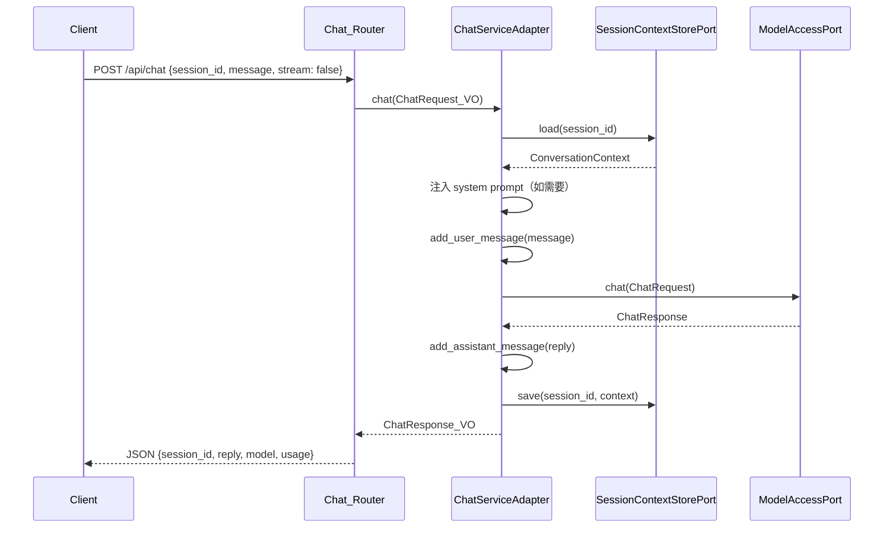
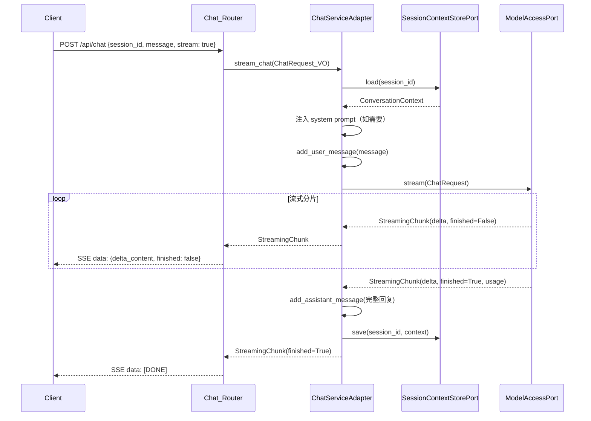

# 技术设计文档：聊天对话接口（Chat Conversation API）

## 概述

本设计为系统新增聊天对话 HTTP 接口，支持同步响应和流式响应（SSE）两种模式。设计遵循项目现有的 DDD 分层架构和六边形架构原则，复用已有的 `ConversationContext`、`SessionContextStorePort`（Redis 实现）和 `ModelAccessPort`（多提供商路由）组件。

核心流程：用户通过 HTTP POST 发送聊天消息 → Chat_Router 接收请求 → Chat_Service 编排对话流程（加载上下文 → 追加消息 → 调用模型 → 保存上下文）→ 返回同步 JSON 或 SSE 流式响应。

### 设计决策

1. **Chat_Service 放在 infrastructure 层而非 domain 层**：Chat_Service 是一个编排服务，协调 SessionContextStorePort 和 ModelAccessPort 两个端口完成对话流程。领域层定义 Chat_Service_Port（Protocol），infrastructure 层提供具体实现 ChatServiceAdapter，保持六边形架构一致性。
2. **值对象定义在 domain/conversation 模块**：ChatRequest_VO 和 ChatResponse_VO 属于对话限界上下文的值对象，与已有的 ConversationContext、Message 放在同一模块。
3. **SSE 使用 sse-starlette 库**：项目已依赖 `sse-starlette>=2.0.0`，直接使用 `EventSourceResponse` 实现 SSE 推送。
4. **系统提示词通过 config.properties 配置**：遵循项目现有的 `PropertiesBaseSettings` 配置模式，新增 `CHAT_` 前缀的配置项。

## 架构

### 分层架构图

```mermaid
graph TB
    subgraph Application["应用层 (application/)"]
        CR[Chat_Router<br/>POST /api/chat<br/>DELETE /api/chat/sessions/{id}]
        CC[container_config.py<br/>DI 注册]
        SA[server_app.py<br/>路由挂载]
    end

    subgraph Domain["领域层 (domain/conversation/)"]
        CSP[Chat_Service_Port<br/>Protocol]
        VO[ChatRequest_VO / ChatResponse_VO<br/>值对象]
        CTX[ConversationContext<br/>已有]
        SCS[SessionContextStorePort<br/>已有]
    end

    subgraph DomainMA["领域层 (domain/model_access/)"]
        MAP[ModelAccessPort<br/>已有]
    end

    subgraph Infrastructure["基础设施层 (infrastructure/)"]
        CSA[ChatServiceAdapter<br/>Chat_Service 实现]
        RSA[RedisSessionContextAdapter<br/>已有]
        MRA[ModelRouterAdapter<br/>已有]
    end

    subgraph Common["公共层 (common/)"]
        CFG[ChatConfig<br/>系统提示词配置]
    end

    CR -->|依赖注入| CSP
    CR -->|使用| VO
    CSA -.->|实现| CSP
    CSA -->|使用| SCS
    CSA -->|使用| MAP
    CSA -->|使用| CTX
    CSA -->|使用| VO
    CSA -->|读取| CFG
    CC -->|注册| CSP
    SA -->|挂载| CR
```

### 同步对话时序图



### 流式对话时序图



## 组件与接口

### 1. ChatRequest_VO（值对象）

位置：`domain/conversation/value_objects.py`

```python
@dataclass(frozen=True)
class ChatRequest_VO:
    session_id: str       # 会话标识，非空
    message: str          # 用户消息，非空且非纯空白
    stream: bool = False  # 是否流式响应
```

- 使用 `__post_init__` 进行字段验证：session_id 非空、message 非空且非纯空白字符
- frozen=True 保证不可变性

### 2. ChatResponse_VO（值对象）

位置：`domain/conversation/value_objects.py`

```python
@dataclass(frozen=True)
class ChatResponse_VO:
    session_id: str              # 会话标识
    reply: str                   # 模型回复内容
    model: str                   # 实际使用的模型名称
    usage: dict[str, int]        # token 用量 {prompt_tokens, completion_tokens, total_tokens}
```

### 3. Chat_Service_Port（端口接口）

位置：`domain/conversation/ports.py`（追加到现有文件）

```python
class Chat_Service_Port(Protocol):
    async def chat(self, request: ChatRequest_VO) -> ChatResponse_VO: ...
    async def stream_chat(self, request: ChatRequest_VO) -> AsyncIterator[StreamingChunk]: ...
    async def clear_session(self, session_id: str) -> None: ...
```

### 4. ChatServiceAdapter（基础设施实现）

位置：`infrastructure/chat/chat_service_adapter.py`

构造依赖：
- `session_store: SessionContextStorePort`
- `model_access: ModelAccessPort`
- `system_prompt: str`（从 ChatConfig 读取）

核心方法：
- `chat()`: 加载上下文 → 注入 system prompt → 追加用户消息 → 调用 model_access.chat() → 追加助手回复 → 保存上下文 → 返回 ChatResponse_VO
- `stream_chat()`: 加载上下文 → 注入 system prompt → 追加用户消息 → 调用 model_access.stream() → 逐个 yield StreamingChunk → 最后一个分片时拼接完整回复并保存上下文
- `clear_session()`: 调用 session_store.delete(session_id)
- `_ensure_system_prompt()`: 私有方法，检查 ConversationContext 中是否已有 system 消息，若无则添加

### 5. Chat_Router（应用层路由）

位置：`application/routers/chat.py`

端点：
- `POST /api/chat`：根据 request body 中的 `stream` 字段分发到同步或流式处理
- `DELETE /api/chat/sessions/{session_id}`：清除会话

依赖注入模式（与 health router 一致）：
```python
@router.post("/api/chat")
async def chat(
    request: ChatRequestBody,  # Pydantic BaseModel，用于 FastAPI 请求体解析
    service: Chat_Service_Port = Depends(inject(Chat_Service_Port)),
) -> ...:
```

SSE 响应使用 `sse-starlette` 的 `EventSourceResponse`。

### 6. ChatConfig（配置）

位置：`infrastructure/chat/chat_config.py`

```python
class ChatConfig(PropertiesBaseSettings):
    model_config = SettingsConfigDict(env_prefix="CHAT_")
    system_prompt: str = "你是一个有用的 AI 助手。"
```

配置项在 `config.properties` 中添加：
```properties
CHAT_SYSTEM_PROMPT=你是一个有用的 AI 助手。
```

### 7. DI 注册与路由挂载

- `container_config.py`：新增 `Chat_Service_Port → ChatServiceAdapter` 绑定，工厂函数通过容器解析 `SessionContextStorePort` 和 `ModelAccessPort`
- `routers/__init__.py`：导出 `chat_router`
- `server_app.py`：`app.include_router(chat_router)`

## 数据模型

### 请求/响应 HTTP 模型

Chat_Router 使用 Pydantic BaseModel 定义 HTTP 请求体和响应体，与领域层值对象分离：

```python
# application/routers/chat.py 内部定义

class ChatRequestBody(BaseModel):
    """HTTP 请求体模型，用于 FastAPI 自动校验和文档生成。"""
    session_id: str
    message: str
    stream: bool = False

class ChatResponseBody(BaseModel):
    """同步聊天 HTTP 响应体。"""
    code: int = 0
    session_id: str
    reply: str
    model: str
    usage: dict[str, int]
```

### SSE 事件数据格式

```json
// 流式分片
{"delta_content": "你好", "finished": false}

// 结束标记
[DONE]
```

### 领域值对象与 HTTP 模型的映射

| HTTP 层 | 领域层 | 方向 |
|---------|--------|------|
| ChatRequestBody | ChatRequest_VO | Router → Service（Router 负责转换） |
| ChatResponseBody | ChatResponse_VO | Service → Router（Router 负责转换） |
| SSE JSON data | StreamingChunk | Service → Router（Router 负责序列化） |

### 已有数据模型复用

| 模型 | 位置 | 用途 |
|------|------|------|
| ConversationContext | domain/conversation/context.py | 管理对话消息列表，支持序列化/反序列化 |
| Message | domain/conversation/context.py | 单条对话消息（role, content, tool_name, metadata） |
| ChatRequest | domain/model_access/value_objects.py | ModelAccessPort 的请求参数 |
| ChatResponse | domain/model_access/value_objects.py | ModelAccessPort 的同步响应 |
| StreamingChunk | domain/model_access/value_objects.py | ModelAccessPort 的流式响应分片 |


## 正确性属性（Correctness Properties）

*属性（Property）是一种在系统所有有效执行中都应成立的特征或行为——本质上是对系统应做什么的形式化陈述。属性是人类可读规格说明与机器可验证正确性保证之间的桥梁。*

### Property 1: 空白消息拒绝

*For any* 仅由空白字符组成的字符串（包括空字符串、空格、制表符、换行符等），构造 ChatRequest_VO 时 SHALL 抛出 ValueError，且不产生有效的值对象实例。

**Validates: Requirements 1.3, 1.4**

### Property 2: ConversationContext 序列化往返一致性

*For any* 有效的 ConversationContext 对象（包含任意数量的 system、user、assistant、tool 消息），执行 `ConversationContext.from_dict(context.to_dict())` SHALL 产生与原始对象等价的 ConversationContext（消息列表内容和 max_messages 相同）。

**Validates: Requirements 10.1**

### Property 3: 同步对话后消息数量恰好增加 2

*For any* 有效的 ChatRequest_VO 和任意初始 ConversationContext，执行 chat() 成功后，ConversationContext 的 message_count SHALL 恰好比调用前增加 2（1 条 user 消息 + 1 条 assistant 回复）。

**Validates: Requirements 10.2, 3.2, 3.4**

### Property 4: 窗口裁剪保留 system 消息

*For any* ConversationContext（包含任意数量的 system 和非 system 消息），调用 get_messages() 后，返回的消息列表 SHALL 满足：(a) 所有 system 消息均被保留，(b) 非 system 消息数量不超过 max_messages。

**Validates: Requirements 10.3**

### Property 5: 系统提示词注入幂等性

*For any* ConversationContext 和任意系统提示词字符串，执行 _ensure_system_prompt() 后：(a) 若原始上下文无 system 消息，则恰好新增一条 system 消息且内容等于配置的提示词；(b) 若原始上下文已有 system 消息，则 system 消息数量不变。对结果再次执行 _ensure_system_prompt() SHALL 不改变任何内容（幂等性）。

**Validates: Requirements 8.2, 8.3**

### Property 6: 流式分片拼接等于保存的助手回复

*For any* 有效的流式聊天请求，stream_chat() 产出的所有 StreamingChunk 的 delta_content 拼接结果 SHALL 等于最终保存到 ConversationContext 中的 assistant 消息内容。

**Validates: Requirements 4.4, 4.5**

### Property 7: SSE 序列化格式正确性

*For any* StreamingChunk 对象，将其序列化为 SSE 事件的 data 字段后，该字段 SHALL 是合法的 JSON 字符串，且解析后包含 `delta_content`（字符串类型）和 `finished`（布尔类型）两个字段。

**Validates: Requirements 6.2, 6.4**

### Property 8: 同步响应字段完整性

*For any* 有效的同步聊天请求，chat() 返回的 ChatResponse_VO SHALL 包含非空的 session_id（与请求一致）、reply、model 字段，以及包含 token 用量信息的 usage 字典。

**Validates: Requirements 3.5**

### Property 9: 无效请求返回 400

*For any* 缺少必填字段或字段值不合法的 HTTP 请求体（如缺少 session_id、message 为空等），POST /api/chat 端点 SHALL 返回 HTTP 400 状态码。

**Validates: Requirements 5.4**

## 错误处理

### 异常传播策略

| 异常类型 | 来源 | 处理方式 |
|---------|------|---------|
| `ValueError` | ChatRequest_VO 验证 | 由 FastAPI 的 `RequestValidationError` 处理器捕获，返回 HTTP 400 |
| `ModelAccessError` | ModelAccessPort 调用 | Chat_Service 不捕获，向上传播到全局异常处理器（BizException handler），返回业务错误码 |
| `ModelTimeoutError` | ModelAccessPort 超时 | 同上，code=50002 |
| `ModelRateLimitError` | ModelAccessPort 限流 | 同上，code=50003 |
| `RedisError` | SessionContextStorePort | 向上传播到全局异常处理器，返回 HTTP 500 |
| 未知异常 | 任意 | 全局兜底处理器捕获，返回 HTTP 500 |

### SSE 流式错误处理

流式响应中发生异常时：
1. Chat_Service 的 `stream_chat()` 生成器停止 yield
2. 异常向上传播到 `EventSourceResponse`
3. SSE 连接中断，客户端感知到连接关闭

### 统一响应格式

所有错误响应遵循项目现有的统一格式：
```json
{"code": <错误码>, "message": "<错误描述>"}
```

## 测试策略

### 双轨测试方法

本功能采用单元测试 + 属性测试（Property-Based Testing）双轨并行的测试策略：

- **单元测试（pytest）**：验证具体示例、边界条件、错误处理和集成点
- **属性测试（hypothesis）**：验证跨所有输入的通用属性，每个属性至少运行 100 次迭代

项目已依赖 `hypothesis>=6.82.0`，无需额外安装。

### 属性测试配置

- 库：`hypothesis`（已在 pyproject.toml 中声明）
- 每个属性测试最少 100 次迭代：`@settings(max_examples=100)`
- 每个属性测试必须通过注释引用设计文档中的属性编号
- 标签格式：`# Feature: chat-conversation-api, Property {N}: {property_text}`

### 测试文件组织

```
test/
├── domain/conversation/
│   ├── test_chat_value_objects.py          # ChatRequest_VO / ChatResponse_VO 单元测试 + 属性测试
│   └── test_conversation_context_props.py  # ConversationContext 属性测试（往返、裁剪）
├── infrastructure/chat/
│   └── test_chat_service_adapter.py        # ChatServiceAdapter 单元测试 + 属性测试
└── application/routers/
    └── test_chat_router.py                 # Chat_Router 集成测试（httpx.AsyncClient + TestClient）
```

### 单元测试覆盖

| 测试目标 | 测试内容 |
|---------|---------|
| ChatRequest_VO | 有效构造、空 message 拒绝、空 session_id 拒绝、stream 默认值 |
| ChatResponse_VO | 有效构造、字段访问 |
| ChatServiceAdapter.chat() | 正常流程（mock Store + Model）、ModelAccessError 传播 |
| ChatServiceAdapter.stream_chat() | 正常流程、中途异常传播、分片拼接 |
| ChatServiceAdapter.clear_session() | 正常删除 |
| ChatServiceAdapter._ensure_system_prompt() | 无 system 消息时注入、已有时不重复 |
| Chat_Router POST /api/chat | 同步请求 200、流式请求 SSE、参数校验 400 |
| Chat_Router DELETE | 正常 200、响应格式 |

### 属性测试覆盖

每个设计文档中的 Property 对应一个属性测试：

| Property | 测试文件 | 生成器策略 |
|----------|---------|-----------|
| Property 1: 空白消息拒绝 | test_chat_value_objects.py | `st.text(alphabet=st.characters(whitespace_categories=("Zs", "Zl", "Zp", "Cc")))` 生成纯空白字符串 |
| Property 2: 序列化往返 | test_conversation_context_props.py | 生成随机 ConversationContext（随机消息列表、随机 max_messages） |
| Property 3: 消息数量 +2 | test_chat_service_adapter.py | 生成随机 ChatRequest_VO + 随机初始 ConversationContext，mock Model 返回随机回复 |
| Property 4: 窗口裁剪 | test_conversation_context_props.py | 生成随机 ConversationContext（消息数量从 0 到 200），随机 max_messages |
| Property 5: 提示词幂等 | test_chat_service_adapter.py | 生成随机 ConversationContext + 随机 system_prompt 字符串 |
| Property 6: 分片拼接 | test_chat_service_adapter.py | 生成随机 StreamingChunk 列表，mock Model stream 返回 |
| Property 7: SSE 格式 | test_chat_router.py | 生成随机 StreamingChunk 对象 |
| Property 8: 响应完整性 | test_chat_service_adapter.py | 生成随机 ChatRequest_VO，mock Model 返回随机 ChatResponse |
| Property 9: 无效请求 400 | test_chat_router.py | 生成缺少字段或字段值非法的请求体 |
