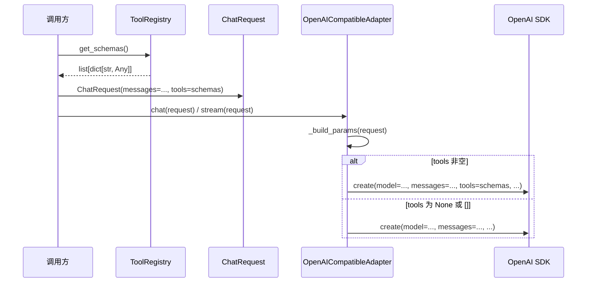

# Design Document: ChatRequest tools 字段

## Overview

为 `ChatRequest` 值对象新增可选的 `tools` 字段，使调用方能够将工具 schema 列表（如 `ToolRegistry.get_schemas()` 的返回值）传递给 LLM，让模型感知可用工具并发起 `tool_calls`。同时修改 `OpenAICompatibleAdapter._build_params()` 方法，在 `tools` 非空时将其包含在 SDK 调用参数中。

### 设计决策

1. **字段类型 `list[dict[str, Any]] | None`**：与 `ToolRegistry.get_schemas()` 返回类型完全一致，无需额外转换。`None` 表示不传递工具信息（向后兼容），空列表 `[]` 视为"无工具"，不传递给 SDK（避免部分模型对空 tools 数组报错）。
2. **不在 `__post_init__` 中校验 tools 内部结构**：tools 的 schema 格式由 `Tool.to_schema()` 保证，ChatRequest 作为值对象只负责传输，不承担 schema 校验职责。这与现有 `messages` 字段仅校验 `role`/`content` 存在性的策略一致。
3. **`None` 和 `[]` 均不传递 `tools` 参数**：OpenAI SDK 在收到空 tools 数组时行为因模型而异，统一不传递可避免兼容性问题。判断条件为 `if request.tools`（Python 中 `None` 和 `[]` 均为 falsy）。
4. **字段位置**：`tools` 放在 `extra_params` 之前，因为它是一个明确的 OpenAI API 参数，不应混入 `extra_params` 的通用扩展机制中。

## Architecture

```mermaid
graph LR
    subgraph 调用方
        App["应用层代码"]
        TR["ToolRegistry"]
    end

    subgraph domain["领域层"]
        CR["ChatRequest<br/>+ tools: list[dict] | None"]
    end

    subgraph infrastructure["基础设施层"]
        OCA["OpenAICompatibleAdapter<br/>_build_params()"]
    end

    subgraph external["外部"]
        SDK["OpenAI SDK<br/>chat.completions.create()"]
    end

    TR -->|get_schemas()| App
    App -->|构造 ChatRequest<br/>tools=schemas| CR
    CR -->|传入| OCA
    OCA -->|tools 非空时<br/>params['tools'] = tools| SDK
```

### 数据流



## Components and Interfaces

### ChatRequest 变更

```python
@dataclass(frozen=True)
class ChatRequest:
    messages: list[dict[str, Any]]
    model: str | None = None
    temperature: float | None = None
    max_tokens: int | None = None
    system: str | None = None
    provider: str | None = None
    thinking: ThinkingConfig | None = None
    tools: list[dict[str, Any]] | None = None      # 新增
    extra_params: dict[str, Any] | None = None
```

`tools` 字段放在 `thinking` 之后、`extra_params` 之前。`__post_init__` 无需新增校验逻辑。

### OpenAICompatibleAdapter._build_params() 变更

在现有 `_build_params` 方法的 `extra_params` 处理之前，新增：

```python
if request.tools:
    params["tools"] = request.tools
```

条件 `if request.tools` 同时排除 `None` 和 `[]`。

### ToolRegistry.get_schemas() — 无变更

`get_schemas()` 已返回 `list[dict[str, Any]]`，与 `ChatRequest.tools` 类型完全匹配，无需修改。

## Data Models

### ChatRequest 字段定义

| 字段 | 类型 | 默认值 | 说明 |
|------|------|--------|------|
| tools | `list[dict[str, Any]] \| None` | `None` | 工具 schema 列表，格式为 OpenAI function calling schema |

### tools 元素格式（由 Tool.to_schema() 生成）

```json
{
  "type": "function",
  "function": {
    "name": "read_file",
    "description": "读取文件内容",
    "parameters": {
      "type": "object",
      "properties": { ... },
      "required": [ ... ]
    }
  }
}
```

### _build_params 返回值变更

| 条件 | params 中是否包含 "tools" |
|------|--------------------------|
| `tools` 为 `None` | 否 |
| `tools` 为 `[]` | 否 |
| `tools` 为非空列表 | 是，值为该列表 |


## Correctness Properties

*A property is a characteristic or behavior that should hold true across all valid executions of a system — essentially, a formal statement about what the system should do. Properties serve as the bridge between human-readable specifications and machine-verifiable correctness guarantees.*

### Property 1: Tools field preservation

*For any* valid tools value (None, a non-empty list of tool schema dicts, or an empty list), constructing a `ChatRequest` with that tools value should succeed, and the resulting object's `tools` attribute should be equal to the input value.

**Validates: Requirements 1.1, 1.2, 1.3, 1.4**

### Property 2: _build_params includes tools if and only if truthy

*For any* `ChatRequest` with a valid `tools` value, `_build_params()` should include a `"tools"` key in the returned dict if and only if `request.tools` is truthy (non-None and non-empty). When included, the value should be identical to `request.tools`.

**Validates: Requirements 2.1, 2.2, 2.3**

### Property 3: Frozen immutability of tools field

*For any* `ChatRequest` instance with `tools` set to any value, attempting to reassign the `tools` attribute should raise `FrozenInstanceError` (or `dataclasses.FrozenInstanceError`), preserving the frozen dataclass contract.

**Validates: Requirements 1.5**

### Property 4: ToolRegistry.get_schemas() to ChatRequest.tools compatibility

*For any* `ToolRegistry` containing zero or more registered tools, the return value of `get_schemas()` should be directly passable to `ChatRequest(messages=..., tools=registry.get_schemas())` without error, and the resulting `tools` field should equal the `get_schemas()` output.

**Validates: Requirements 3.1, 3.2**

## Error Handling

本次变更不引入新的错误场景。`tools` 字段为可选参数，不进行内部结构校验：

| 场景 | 处理方式 |
|------|---------|
| `tools=None`（默认） | 正常构造，`_build_params` 不传递 `tools` |
| `tools=[]` | 正常构造，`_build_params` 不传递 `tools` |
| `tools` 为非空列表 | 正常构造，`_build_params` 传递 `tools` |

现有的 `__post_init__` 校验（messages 非空、temperature 范围、max_tokens 正数）不受影响。`tools` 字段的 schema 格式正确性由 `Tool.to_schema()` 在上游保证，ChatRequest 不承担此校验职责。

## Testing Strategy

### 测试框架与库

- **属性测试**：Hypothesis（项目已使用）
- **单元测试**：pytest + pytest-asyncio
- **测试文件位置**：
  - 属性测试：`epsilon-boot/test/domain/model_access/test_chat_request_tools_property.py`
  - 单元测试：`epsilon-boot/test/domain/model_access/test_chat_request_tools_unit.py`

### 属性测试（Property-Based Tests）

使用 Hypothesis 库，每个属性测试运行至少 100 次迭代。每个测试通过注释标注对应的设计属性。

**Hypothesis 策略设计**：
- tools schema 策略：生成随机的 `list[dict[str, Any]]`，模拟 `Tool.to_schema()` 输出格式（包含 `type`、`function.name`、`function.description`、`function.parameters`）
- None/空列表策略：`st.none() | st.just([])`
- messages 策略：生成至少包含一条 `{"role": "user", "content": "..."}` 的列表

| 属性测试 | 对应 Property | 标签 |
|---------|--------------|------|
| `test_tools_field_preservation` | Property 1 | Feature: chat-request-tools-field, Property 1: Tools field preservation |
| `test_build_params_tools_inclusion` | Property 2 | Feature: chat-request-tools-field, Property 2: _build_params includes tools if and only if truthy |
| `test_frozen_immutability` | Property 3 | Feature: chat-request-tools-field, Property 3: Frozen immutability of tools field |
| `test_tool_registry_compatibility` | Property 4 | Feature: chat-request-tools-field, Property 4: ToolRegistry.get_schemas() to ChatRequest.tools compatibility |

### 单元测试（Unit Tests）

单元测试覆盖具体示例和边界情况，与属性测试互补：

| 测试场景 | 说明 |
|----------|------|
| 默认值为 None | 不传 tools 时，`request.tools is None` |
| 空列表保留 | `tools=[]` 时，`request.tools == []` |
| 非空列表保留 | 传入具体 schema 列表时值一致 |
| _build_params 不含 tools（None） | tools=None 时返回的 dict 无 "tools" 键 |
| _build_params 不含 tools（空列表） | tools=[] 时返回的 dict 无 "tools" 键 |
| _build_params 含 tools | tools 非空时返回的 dict 含 "tools" 键且值正确 |
| 向后兼容 | 不传 tools 的 ChatRequest 行为与变更前一致 |

### 测试配置

```python
@settings(max_examples=100, deadline=2000)
```

每个属性测试必须由单个 Hypothesis `@given` 测试实现，标注对应的 Property 编号。
