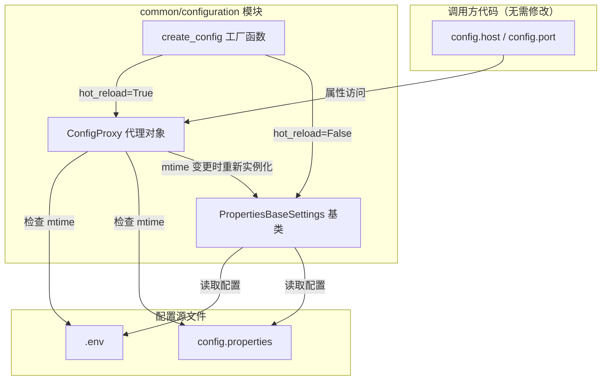
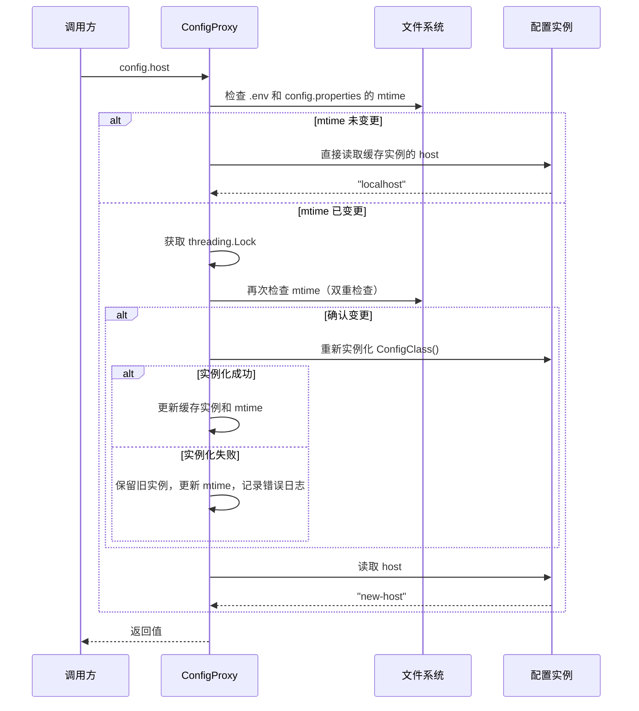

# 技术设计文档：配置热更新（Config Hot Reload）

## 概述

本设计为项目配置管理机制增加热更新能力。核心思路是引入代理模式（Proxy Pattern）：通过 `ConfigProxy` 代理类包装真实配置实例，在属性访问时检查配置源文件的 `mtime`（最后修改时间），若文件已变更则重新实例化底层配置对象。对于不需要热更新的配置类（`hot_reload=False`），工厂函数直接返回普通实例，零额外开销。

设计目标：
- 对调用方完全透明，现有 `config.field_name` 访问模式无需修改
- 基于文件 mtime 的轻量级变更检测，避免轮询或文件监听的复杂性
- 线程安全，适配 FastAPI 异步环境
- 刷新失败时保留旧配置，保证服务稳定性

## 架构

### 整体架构



### 工作流程



### 双重检查锁定（Double-Checked Locking）

ConfigProxy 采用双重检查锁定模式减少锁竞争：

1. 锁外快速路径：检查 mtime，未变更时直接返回缓存值（无锁开销）
2. 锁内慢速路径：仅在检测到 mtime 变更时获取锁，再次确认后执行刷新

这确保了高频读取场景下的性能，同时保证并发刷新的安全性。

## 组件与接口

### 1. PropertiesBaseSettings 基类扩展

在现有基类上新增 `hot_reload` 类变量：

```python
class PropertiesBaseSettings(BaseSettings):
    """项目配置基类。新增 hot_reload 类变量控制是否启用热更新。"""
    
    hot_reload: ClassVar[bool] = False
    
    model_config = SettingsConfigDict(
        env_file=str(_ENV_FILE),
        env_file_encoding="utf-8",
        extra="ignore",
        frozen=True,
    )
    # ... 其余不变
```

`hot_reload` 使用 `ClassVar[bool]` 声明，不参与 pydantic 的字段校验和序列化，仅作为类级元数据。

### 2. ConfigProxy 代理类

```python
class ConfigProxy(Generic[T]):
    """配置代理对象，透明转发属性访问并支持基于 mtime 的热更新。
    
    通过 __getattr__ 将属性访问转发到内部缓存的真实配置实例。
    每次属性访问时检查配置源文件的 mtime，若文件变更则重新实例化。
    使用双重检查锁定保证线程安全。
    """
    
    def __init__(self, config_class: type[T]) -> None: ...
    def __getattr__(self, name: str) -> Any: ...
    def __setattr__(self, name: str, value: Any) -> None: ...
    def __repr__(self) -> str: ...
    def __str__(self) -> str: ...
    def __class_getitem__(cls, item: type) -> type: ...
    
    # 内部方法
    def _get_current_mtimes(self) -> dict[str, float]: ...
    def _mtimes_changed(self) -> bool: ...
    def _refresh(self) -> None: ...
```

关键设计决策：

- 使用 `object.__setattr__` 在 `__init__` 中设置内部属性（`_config_class`、`_instance`、`_lock`、`_mtimes`），避免触发自定义的 `__setattr__`
- `__setattr__` 对非内部属性抛出 `AttributeError`，保持 `frozen=True` 语义
- 通过 `__class__` 属性伪装实现 `isinstance` 检查支持

### 3. create_config 工厂函数

```python
def create_config(config_class: type[T]) -> T:
    """配置工厂函数，根据 hot_reload 标志创建配置实例。
    
    Args:
        config_class: PropertiesBaseSettings 的子类。
        
    Returns:
        hot_reload=True 时返回 ConfigProxy 代理对象，
        hot_reload=False 时返回配置类的直接实例。
    """
```

类型标注返回 `T`，使调用方获得正确的类型提示，IDE 自动补全不受影响。

### 4. 模块导出

`common/configuration/__init__.py` 新增导出：

```python
from .config_proxy import ConfigProxy, create_config

__all__ = [
    "PropertiesBaseSettings",
    "PropertiesFileSettingsSource", 
    "ConfigurationError",
    "ConfigProxy",
    "create_config",
]
```

### 5. 配置类迁移示例

以 RedisConfig 为例，迁移前后对比：

```python
# 迁移前
redis_config = RedisConfig()

# 迁移后（启用热更新）
class RedisConfig(PropertiesBaseSettings):
    hot_reload: ClassVar[bool] = True  # 新增
    model_config = SettingsConfigDict(env_prefix="REDIS_")
    host: str = "localhost"
    port: int = 6379
    # ...

redis_config = create_config(RedisConfig)

# 迁移后（不启用热更新，行为完全一致）
redis_config = create_config(RedisConfig)  # hot_reload 默认 False，直接返回实例
```

## 数据模型

### ConfigProxy 内部状态

| 属性 | 类型 | 说明 |
|------|------|------|
| `_config_class` | `type[T]` | 配置类引用，用于重新实例化 |
| `_instance` | `T` | 当前缓存的配置实例 |
| `_lock` | `threading.Lock` | 线程安全锁 |
| `_mtimes` | `dict[str, float]` | 配置源文件路径到 mtime 的映射 |
| `_source_files` | `list[str]` | 需要监控的配置源文件路径列表 |

### 配置源文件

ConfigProxy 监控的文件列表固定为：
- `.env` 文件路径（通过 `_find_file(".env")` 获取）
- `config.properties` 文件路径（通过 `_find_file("config.properties")` 获取）

### mtime 映射结构

```python
{
    "/path/to/.env": 1718000000.0,
    "/path/to/config.properties": 1718000100.0,
}
```

文件不存在或读取失败时，mtime 值为 `0.0`。


## 正确性属性（Correctness Properties）

*正确性属性是系统在所有合法执行路径上都应保持为真的特征或行为——本质上是对系统行为的形式化陈述。属性是连接人类可读规格说明与机器可验证正确性保证之间的桥梁。*

以下属性基于需求文档中的验收标准推导而来，经过冗余消除和合并后，保留了 7 个独立的可测试属性。

### Property 1: 工厂函数路由正确性

*For any* `PropertiesBaseSettings` 子类，若其 `hot_reload` 为 `True`，则 `create_config` 返回的对象应为 `ConfigProxy` 实例；若其 `hot_reload` 为 `False`，则返回的对象应为该配置类的直接实例（非 `ConfigProxy`）。

**Validates: Requirements 1.2, 1.3, 5.2, 5.3, 6.1**

### Property 2: 属性访问透明转发

*For any* 通过 `create_config` 创建的 `ConfigProxy` 代理对象，以及该配置类的任意字段名，通过代理访问该字段的返回值应与直接实例化配置类后访问同一字段的返回值完全相等。

**Validates: Requirements 2.1, 2.2, 6.2, 7.1**

### Property 3: 代理身份等价性

*For any* 通过 `create_config` 创建的 `ConfigProxy` 代理对象，`isinstance(proxy, ConfigClass)` 应返回 `True`，且 `repr(proxy)` 应等于 `repr(direct_instance)`，`str(proxy)` 应等于 `str(direct_instance)`。

**Validates: Requirements 2.3, 2.4**

### Property 4: 不可变语义

*For any* `ConfigProxy` 代理对象和任意属性名，对代理执行属性赋值操作应抛出 `AttributeError`，且代理内部状态不发生变化。

**Validates: Requirements 2.5, 2.6**

### Property 5: 基于 mtime 的配置刷新

*For any* `ConfigProxy` 代理对象，若配置源文件的 mtime 未发生变化，则多次属性访问应返回同一缓存实例的值（对象身份不变）；若配置源文件被修改（mtime 变化）且文件内容合法，则下一次属性访问应返回基于新文件内容实例化的配置值。

**Validates: Requirements 3.2, 3.3**

### Property 6: 刷新失败保留旧配置

*For any* `ConfigProxy` 代理对象，若配置源文件被修改为非法内容（导致实例化失败），则代理应继续返回刷新前的旧配置值，不抛出异常。

**Validates: Requirements 8.1**

### Property 7: 失败后 mtime 更新防止重复刷新

*For any* `ConfigProxy` 代理对象，若一次刷新因配置文件格式错误而失败，则在文件未再次修改的情况下，后续属性访问不应再次尝试重新实例化配置对象。

**Validates: Requirements 8.3**

## 错误处理

### 配置文件不存在

- `_find_file` 找不到文件时返回兜底路径
- `_get_current_mtimes` 对不存在的文件返回 mtime `0.0`
- 配置类依赖 pydantic-settings 的默认值机制，文件不存在不影响启动

### mtime 读取失败

- `os.path.getmtime` 抛出 `OSError` 时，捕获异常并将 mtime 设为 `0.0`
- 记录 `warning` 级别日志，包含文件路径和异常信息
- 不影响正常的属性访问流程

### 配置刷新失败

- `ConfigClass()` 实例化抛出任何异常时（如 `ValidationError`），捕获异常
- 保留当前 `_instance` 不变，调用方继续使用旧配置
- 记录 `error` 级别日志，包含配置类名称和完整异常堆栈
- 更新 `_mtimes` 为当前文件的 mtime 值，避免后续每次访问都重复尝试失败的刷新
- 仅当文件再次被修改（mtime 再次变化）时才会重新尝试刷新

### 属性赋值

- `ConfigProxy.__setattr__` 对非内部属性（不以 `_` 开头的内部管理属性）抛出 `AttributeError`
- 错误消息明确说明配置对象不可变

## 测试策略

### 测试框架

- 单元测试：`pytest`（项目已有）
- 属性测试：`hypothesis`（项目已有，`pyproject.toml` 中已声明 `hypothesis>=6.82.0`）
- 测试文件位置：`epsilon-boot/test/common/configuration/`

### 单元测试

单元测试覆盖具体示例、边界情况和错误条件：

1. `PropertiesBaseSettings` 默认 `hot_reload` 为 `False`（需求 1.1）
2. `ConfigProxy` 在配置文件不存在时正常工作（需求 3.4，边界情况）
3. `ConfigProxy` 在 mtime 读取 `OSError` 时记录警告日志（需求 3.5，边界情况）
4. 多线程并发刷新仅执行一次实例化（需求 4.2，并发测试）
5. 刷新失败时记录错误日志（需求 8.2）
6. `isinstance(proxy, ConfigClass)` 返回 `True`（需求 2.3，具体示例）

### 属性测试

每个正确性属性对应一个 `hypothesis` 属性测试，最少运行 100 次迭代：

1. **Feature: config-hot-reload, Property 1: 工厂函数路由正确性**
   - 生成随机的 `hot_reload` 布尔值和配置类，验证返回类型
   
2. **Feature: config-hot-reload, Property 2: 属性访问透明转发**
   - 生成随机配置字段值，验证代理访问与直接访问结果一致
   
3. **Feature: config-hot-reload, Property 3: 代理身份等价性**
   - 生成随机配置字段值，验证 `isinstance`、`repr`、`str` 等价性
   
4. **Feature: config-hot-reload, Property 4: 不可变语义**
   - 生成随机属性名和值，验证赋值操作抛出 `AttributeError`
   
5. **Feature: config-hot-reload, Property 5: 基于 mtime 的配置刷新**
   - 生成随机配置值，写入临时文件，修改文件后验证代理返回新值
   
6. **Feature: config-hot-reload, Property 6: 刷新失败保留旧配置**
   - 生成随机合法配置，然后写入非法内容，验证代理仍返回旧值
   
7. **Feature: config-hot-reload, Property 7: 失败后 mtime 更新防止重复刷新**
   - 生成随机配置，触发失败刷新后，验证后续访问不再尝试实例化

### 属性测试配置

```python
from hypothesis import settings, given

@settings(max_examples=100)
@given(...)
def test_property_xxx(...):
    # Feature: config-hot-reload, Property N: <property_text>
    ...
```

### 测试辅助

- 使用 `tmp_path` fixture 创建临时配置文件，避免污染真实配置
- 使用 `monkeypatch` 替换 `_ENV_FILE` 和 `_PROPERTIES_FILE` 路径
- 使用 `hypothesis.strategies` 生成随机字符串、整数、布尔值作为配置字段值
