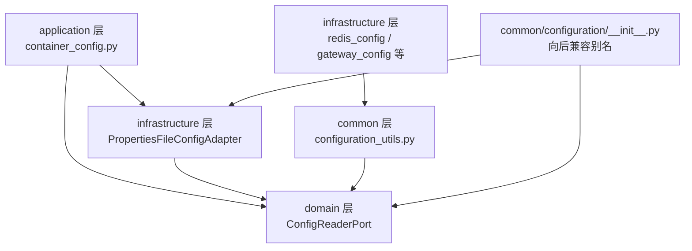

# 技术设计文档：配置读取领域抽象

## 概述

本设计将当前位于 `common/configuration/` 的配置读取功能重构为符合 DDD 六边形架构的分层设计。核心思路：

1. 在 `domain/configuration/` 定义 `ConfigReaderPort`（Protocol）和 `ConfigurationError` 异常
2. 将现有 `ConfigReader` 实现迁移到 `infrastructure/configuration/` 作为 `PropertiesFileConfigAdapter`
3. 修改 `configuration_utils.py` 中的 Value 描述符和 `configuration_properties` 装饰器，使其依赖 `ConfigReaderPort` 而非具体实现
4. 在 DI 容器中注册 `ConfigReaderPort → PropertiesFileConfigAdapter` 绑定
5. 通过 `common/configuration/__init__.py` 保持向后兼容的导出路径

设计决策要点：
- `ConfigReaderPort` 使用 Python `Protocol`（结构化子类型），与项目中 `HealthCheckPort` 等已有模式一致
- `PropertiesFileConfigAdapter` 保留现有 `ConfigReader` 的全部功能（Properties 解析、环境变量覆盖、自动重载、线程安全读写锁、多文件单例管理）
- `configuration_utils.py` 保留在 `common/` 层，因为它是跨层共享的工具，但内部依赖从具体类改为 Protocol 接口
- 向后兼容通过 `common/configuration/__init__.py` 中的别名导出实现，现有 `from common.configuration import ConfigReader` 等路径不变

## 架构

### 分层结构

```
domain/configuration/
├── __init__.py
├── ports.py          # ConfigReaderPort (Protocol)
└── exceptions.py     # ConfigurationError

infrastructure/configuration/
├── __init__.py
└── properties_file_config_adapter.py  # PropertiesFileConfigAdapter

common/configuration/
├── __init__.py              # 向后兼容导出（ConfigReader 别名等）
├── config_reader.py         # 保留为空壳/别名模块（向后兼容）
└── configuration_utils.py   # Value 描述符 + configuration_properties 装饰器
```

### 依赖方向



依赖方向遵循六边形架构原则：
- `infrastructure → domain`：Adapter 实现 Port 接口
- `common/configuration_utils → domain`：工具层依赖抽象接口
- `application → domain + infrastructure`：应用层负责组装绑定
- 领域层不依赖任何外部模块

## 组件与接口

### ConfigReaderPort（领域端口）

位于 `domain/configuration/ports.py`，使用 `typing.Protocol` 定义：

```python
class ConfigReaderPort(Protocol):
    def get(self, key: str, default: str | None = None) -> str | None: ...
    def get_required(self, key: str) -> str: ...
    def get_int(self, key: str, default: int | None = None) -> int | None: ...
    def get_float(self, key: str, default: float | None = None) -> float | None: ...
    def get_bool(self, key: str, default: bool | None = None) -> bool | None: ...
    def get_list(self, key: str, separator: str = ",", default: list | None = None) -> list | None: ...
    def get_all(self) -> dict[str, str]: ...
    def get_by_prefix(self, prefix: str) -> dict[str, str]: ...
    def has(self, key: str) -> bool: ...
```

设计决策：
- 仅使用 Python 标准库类型（`str`, `int`, `float`, `bool`, `list`, `dict`），不引入第三方类型
- 方法签名与现有 `ConfigReader` 完全一致，确保 `PropertiesFileConfigAdapter` 天然满足 Protocol
- `get_list` 保留 `separator` 参数以支持自定义分隔符

### ConfigurationError（领域异常）

位于 `domain/configuration/exceptions.py`：

```python
class ConfigurationError(Exception):
    """配置相关的领域异常。"""
    pass
```

从 `common/configuration/config_reader.py` 迁移到领域层，供 Port 和 Adapter 共同引用。

### PropertiesFileConfigAdapter（基础设施适配器）

位于 `infrastructure/configuration/properties_file_config_adapter.py`：

- 将现有 `ConfigReader` 类重命名为 `PropertiesFileConfigAdapter`
- 导入并使用 `domain.configuration.exceptions.ConfigurationError` 替代本地定义
- 保留全部现有功能：
  - Java Properties 格式解析（`=` 和 `:` 分隔符、注释行、空行忽略）
  - 环境变量覆盖（键名大写，`.` 和 `-` 替换为 `_`）
  - 自动重新加载（基于文件修改时间检测）
  - 线程安全读写锁（`readerwriterlock.RWLockFair`）
  - 多配置文件单例管理（`get_instance` / `reset_instances`）
- 保留 `config_path` 属性、`set_auto_reload`、`reload` 等辅助方法
- 保留模块级便捷函数 `get_config_reader()` 和 `get_config()`

### configuration_utils 改造

`common/configuration/configuration_utils.py` 的改造：

1. 将 `from .config_reader import ConfigReader` 改为 `from domain.configuration.ports import ConfigReaderPort`
2. `_reader` 类型从 `ConfigReader | None` 改为 `ConfigReaderPort | None`
3. `init_config_data_source` 参数类型改为 `ConfigReaderPort`
4. `_get_config_reader` 的 fallback 逻辑：当 `_reader` 为 None 时，通过 DI 容器 `container.resolve(ConfigReaderPort)` 获取实例（同步场景下使用 `_singletons` 直接访问，因为配置读取器在容器启动前已注册）

### 向后兼容导出

`common/configuration/__init__.py` 改造：

```python
from domain.configuration.exceptions import ConfigurationError
from domain.configuration.ports import ConfigReaderPort
from infrastructure.configuration.properties_file_config_adapter import (
    PropertiesFileConfigAdapter,
    get_config_reader,
    get_config,
)
from .configuration_utils import init_config_data_source, configuration_properties, Value

# 向后兼容别名
ConfigReader = PropertiesFileConfigAdapter

__all__ = [
    "ConfigReader",
    "ConfigReaderPort",
    "ConfigurationError",
    "PropertiesFileConfigAdapter",
    "init_config_data_source",
    "configuration_properties",
    "Value",
    "get_config_reader",
    "get_config",
]
```

`common/__init__.py` 同步更新，继续导出所有公开符号。

### DI 容器注册

在 `application/container_config.py` 的 `configure_container()` 中，在其他 Port 绑定之前注册：

```python
from domain.configuration.ports import ConfigReaderPort
from infrastructure.configuration.properties_file_config_adapter import (
    PropertiesFileConfigAdapter,
)

def configure_container() -> None:
    # ConfigReaderPort 必须最先注册，其他配置类依赖它
    container.register(
        ConfigReaderPort,
        lambda: PropertiesFileConfigAdapter.get_instance(),
        Scope.SINGLETON,
    )
    # ... 其余注册 ...
```

## 数据模型

本次重构不引入新的数据模型。核心数据结构保持不变：

- 配置存储：`dict[str, str]`（键值对字典，由 `PropertiesFileConfigAdapter._properties` 持有）
- 单例缓存：`dict[str, PropertiesFileConfigAdapter]`（类变量 `_instances`，按配置文件绝对路径索引）
- 文件修改时间：`float | None`（`_last_modified`，用于自动重载检测）

配置文件格式（Java Properties）：
```
# 注释行
key=value
key:value
prefix.sub_key=sub_value
```

## 正确性属性

*正确性属性是指在系统所有有效执行中都应成立的特征或行为——本质上是对系统应做什么的形式化陈述。属性是人类可读规格说明与机器可验证正确性保证之间的桥梁。*

### 属性 1：配置读写往返一致性

*对于任意*有效的配置键值对（键为非空字符串，不含 `=`、`:`、`#`、`!` 等特殊前缀字符；值为任意字符串），将其写入 Properties 格式文件后，通过 `PropertiesFileConfigAdapter` 读取，应返回与写入值一致的结果。

**验证需求：6.3**

### 属性 2：环境变量优先级

*对于任意*配置键，当对应的环境变量存在时（键名转大写，`.` 和 `-` 替换为 `_`），`get` 方法应返回环境变量的值而非配置文件中的值。

**验证需求：2.6**

### 属性 3：自动重载一致性

*对于任意*配置键值对，当自动重载开启且配置文件内容已被修改时，下一次读取操作应返回修改后的新值。

**验证需求：2.5**

## 错误处理

### ConfigurationError 异常层次

`ConfigurationError` 作为领域异常，覆盖以下错误场景：

| 场景 | 触发条件 | 行为 |
|------|---------|------|
| 配置文件不存在 | 指定路径的文件不存在 | 不抛异常，创建空配置 |
| 配置文件无法读取 | 文件存在但权限不足、编码错误等 | 抛出 `ConfigurationError` |
| 必需配置缺失 | `get_required` 找不到键 | 抛出 `ConfigurationError` |
| 类型转换失败 | `get_int`/`get_float`/`get_bool` 值格式无效 | 抛出 `ConfigurationError` |

### DI 容器解析失败

当 `configuration_utils._get_config_reader()` 通过 DI 容器获取 `ConfigReaderPort` 失败时（容器未启动或未注册），应 fallback 到 `PropertiesFileConfigAdapter.get_instance()` 直接创建实例，确保在容器未初始化的场景（如单元测试、脚本）下仍可正常工作。

## 测试策略

### 双轨测试方法

本特性采用单元测试 + 属性测试的双轨策略：

- **单元测试**：验证具体示例、边界情况和错误条件
- **属性测试**：验证跨所有输入的通用属性

### 属性测试配置

- 使用 **Hypothesis** 库（项目已有依赖）
- 每个属性测试最少运行 **100 次迭代**
- 每个属性测试必须通过注释引用设计文档中的属性编号
- 标签格式：`Feature: config-reader-domain-abstraction, Property {number}: {property_text}`

### 单元测试范围

现有测试文件 `test/infrastructure/configuration/config_reader_test.py` 需更新导入路径，验证：
- `PropertiesFileConfigAdapter` 的所有方法（字符串读取、类型转换、前缀查询、单例管理）
- 自动重载功能
- 环境变量覆盖
- 边界情况（空文件、文件不存在、空值、空白处理）
- Protocol 一致性（`PropertiesFileConfigAdapter` 满足 `ConfigReaderPort`）
- 向后兼容导出（`from common.configuration import ConfigReader` 等路径可用）
- DI 容器注册（`ConfigReaderPort` 解析返回正确实例）

### 属性测试范围

现有测试文件 `test/infrastructure/configuration/config_reader_property_test.py` 需更新导入路径，并新增：

1. **Feature: config-reader-domain-abstraction, Property 1: 配置读写往返一致性**
   - 生成随机有效键值对，写入临时 Properties 文件，通过 Adapter 读取验证一致性
2. **Feature: config-reader-domain-abstraction, Property 2: 环境变量优先级**
   - 生成随机键值对，同时设置文件值和环境变量值，验证 `get` 返回环境变量值
3. **Feature: config-reader-domain-abstraction, Property 3: 自动重载一致性**
   - 生成随机键值对，写入文件后修改，验证下次读取返回新值

现有的并发读取属性测试保持不变，仅更新导入路径。

