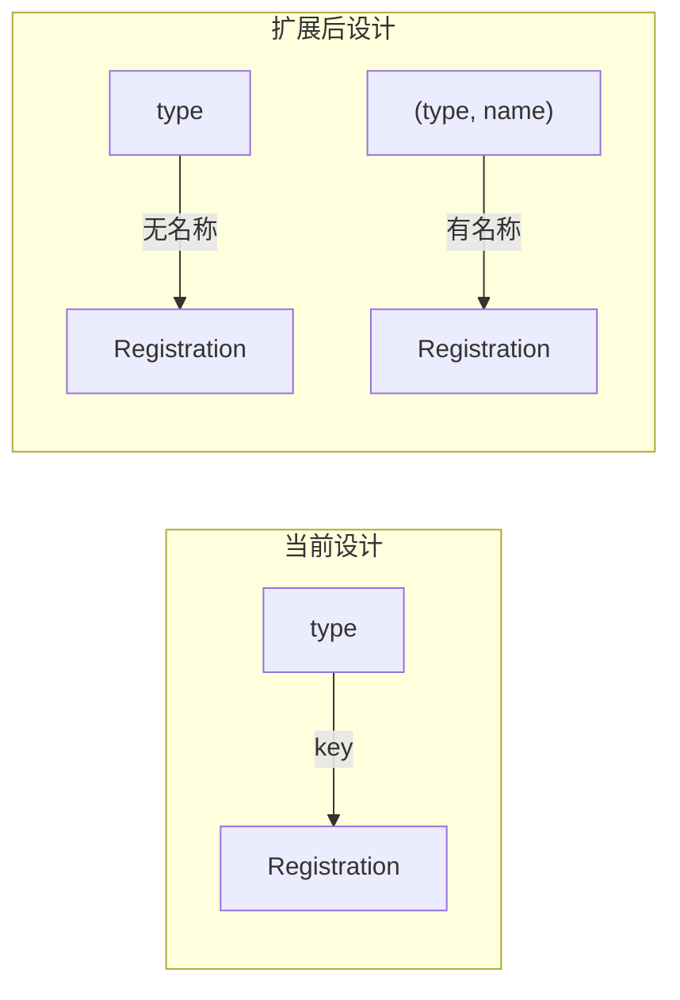
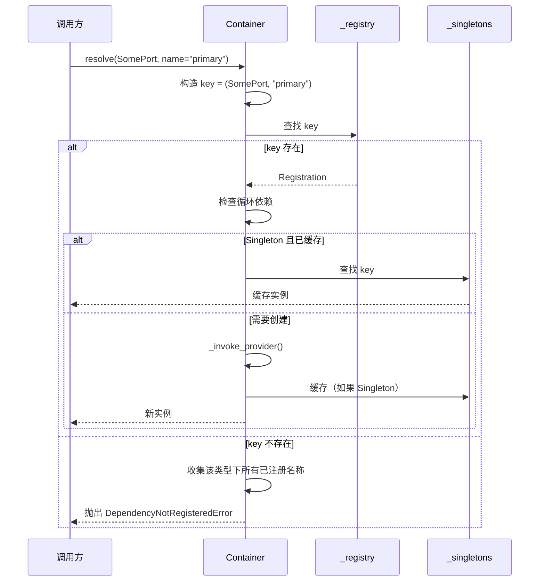
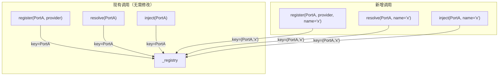

# 技术设计文档：容器命名依赖（Container Named Dependency）

## 概述

本设计为 DI 容器（`common.container.Container`）增加按名称解析依赖的能力。核心思路是将注册表的键从单一的 `type` 扩展为 `type | tuple[type, str]`（即 `RegistryKey`），使同一个 Port 接口可以注册多个不同名称的 Adapter 实现。

当前容器的 `_registry` 和 `_singletons` 均以 `type` 为键，一个类型只能对应一个 Registration。扩展后，`register()` 和 `resolve()` 新增可选的 `name: str | None = None` 参数：

- `name=None`（默认）：键为纯 `type`，行为与现有实现完全一致
- `name="xxx"`：键为 `(type, "xxx")` 元组，与纯类型注册互不干扰

设计目标：
- 100% 向后兼容，所有现有代码无需修改
- 最小化改动范围，仅修改 `container.py`、`container_errors.py` 和 `container_models.py`
- 保持现有的循环依赖检测、Singleton/Transient Scope、异步 Provider 等能力
- 错误信息包含名称上下文，便于调试

## 架构

### 注册表键结构



### 解析流程



### 向后兼容性



## 组件与接口

### 1. RegistryKey 类型别名（container_models.py）

```python
RegistryKey = type | tuple[type, str]
"""注册表键类型。纯 type 表示无名称注册，(type, str) 表示命名注册。"""
```

新增辅助函数用于构造键：

```python
def make_registry_key(abstract_type: type, name: str | None = None) -> RegistryKey:
    """根据类型和可选名称构造注册表键。"""
    if name is None:
        return abstract_type
    return (abstract_type, name)
```

### 2. Container 类修改（container.py）

内部数据结构的键类型从 `type` 扩展为 `RegistryKey`：

```python
class Container:
    def __init__(self) -> None:
        self._registry: dict[RegistryKey, Registration] = {}
        self._singletons: dict[RegistryKey, Any] = {}
        self._resolving: set[RegistryKey] = set()
        # ... 其余不变
```

API 签名变更（均为新增可选参数，向后兼容）：

```python
def register(
    self,
    abstract_type: type,
    provider: Callable[..., Any],
    scope: Scope = Scope.SINGLETON,
    *,
    name: str | None = None,
) -> None: ...

async def resolve(
    self, abstract_type: Type[T], *, name: str | None = None
) -> T: ...

def get_dependency(
    self, abstract_type: Type[T], *, name: str | None = None
) -> Callable[..., Any]: ...
```

`name` 参数使用 keyword-only（`*` 之后）设计，避免与现有位置参数冲突。`register()` 中 `name` 也放在 `*` 之后，确保 `register(PortA, provider, Scope.SINGLETON)` 的现有调用不受影响。

### 3. inject 函数修改（container.py）

```python
def inject(
    abstract_type: Type[T], *, name: str | None = None
) -> Callable[..., Any]:
    """FastAPI Depends 快捷方式，支持按名称解析。"""
    return container.get_dependency(abstract_type, name=name)
```

### 4. DependencyNotRegisteredError 增强（container_errors.py）

```python
class DependencyNotRegisteredError(ContainerError):
    """解析未注册的依赖时抛出。"""
    def __init__(
        self,
        abstract_type: type,
        registered_types: list[type],
        *,
        name: str | None = None,
        registered_names: list[str] | None = None,
    ):
        self.abstract_type = abstract_type
        self.registered_types = registered_types
        self.name = name
        self.registered_names = registered_names
        # 构造错误消息...
```

当 `name` 不为 None 时，错误消息格式：
```
Type 'SomePort' with name 'xxx' is not registered. 
Registered names for 'SomePort': ['primary', 'secondary']
```

当 `name` 为 None 时，保持现有错误消息格式不变。

### 5. 使用示例

```python
# container_config.py 中注册多个 OpenAI Provider
container.register(OpenAIProviderPort, _create_primary_provider, name="primary")
container.register(OpenAIProviderPort, _create_secondary_provider, name="secondary")

# 同时保留无名称注册（作为默认）
container.register(OpenAIProviderPort, _create_default_provider)

# FastAPI 路由中使用
@router.post("/chat")
async def chat(
    default_provider: OpenAIProviderPort = Depends(inject(OpenAIProviderPort)),
    primary: OpenAIProviderPort = Depends(inject(OpenAIProviderPort, name="primary")),
):
    ...
```

## 数据模型

### RegistryKey 类型

| 形式 | 类型 | 说明 |
|------|------|------|
| 无名称 | `type` | 纯类型键，如 `SessionContextStorePort` |
| 有名称 | `tuple[type, str]` | 类型+名称元组，如 `(OpenAIProviderPort, "primary")` |

### _registry 结构示例

```python
{
    SessionContextStorePort: Registration(provider=..., scope=SINGLETON, is_async=False),
    OpenAIProviderPort: Registration(provider=_create_default, scope=SINGLETON, is_async=False),
    (OpenAIProviderPort, "primary"): Registration(provider=_create_primary, scope=SINGLETON, is_async=True),
    (OpenAIProviderPort, "secondary"): Registration(provider=_create_secondary, scope=SINGLETON, is_async=True),
}
```

### _singletons 结构示例

```python
{
    SessionContextStorePort: <RedisSessionStore instance>,
    (OpenAIProviderPort, "primary"): <PrimaryOpenAIProvider instance>,
}
```

### 辅助函数：收集已注册名称

`resolve()` 在抛出 `DependencyNotRegisteredError` 时，需要遍历 `_registry` 收集该类型下所有已注册的名称：

```python
def _get_registered_names(self, abstract_type: type) -> list[str]:
    """收集指定类型下所有已注册的名称。"""
    names = []
    for key in self._registry:
        if isinstance(key, tuple) and key[0] is abstract_type:
            names.append(key[1])
    return names
```


## 正确性属性（Correctness Properties）

*正确性属性是系统在所有合法执行路径上都应保持为真的特征或行为——本质上是对系统行为的形式化陈述。属性是连接人类可读规格说明与机器可验证正确性保证之间的桥梁。*

以下属性基于需求文档中的验收标准推导而来，经过冗余消除和合并后，保留了 7 个独立的可测试属性。

### Property 1: 无名称注册/解析往返（向后兼容）

*For any* 类型和 Provider，当以无名称方式注册后，以无名称方式解析应返回该 Provider 创建的实例，且注册表中的键为纯类型。

**Validates: Requirements 1.1, 2.1, 4.1, 4.2**

### Property 2: 命名注册/解析往返

*For any* 类型、名称和 Provider，当以 `(type, name)` 方式注册后，以相同的 `(type, name)` 方式解析应返回该 Provider 创建的实例。

**Validates: Requirements 1.2, 2.2**

### Property 3: 注册独立性

*For any* 类型，当该类型同时存在无名称注册和多个不同名称的注册时，每个注册应独立存在，解析任一注册不影响其他注册的结果，且每个注册返回各自 Provider 创建的不同实例。

**Validates: Requirements 1.4, 1.5**

### Property 4: 重复命名注册覆盖

*For any* 类型和名称，当以相同的 `(type, name)` 组合注册两次时，第二次注册应覆盖第一次，后续解析应返回第二个 Provider 创建的实例。

**Validates: Requirements 1.3**

### Property 5: 命名依赖的 Scope 行为

*For any* 命名依赖，若以 Singleton Scope 注册，则多次解析应返回同一个对象实例（`is` 相等）；若以 Transient Scope 注册，则每次解析应返回不同的对象实例（`is not` 相等）。

**Validates: Requirements 2.4, 2.5**

### Property 6: 未注册命名依赖的错误信息质量

*For any* 类型和一组已注册的名称，当尝试解析一个未注册的名称时，抛出的 `DependencyNotRegisteredError` 的错误消息应同时包含请求的类型名称、请求的依赖名称，以及该类型下所有已注册的名称列表。

**Validates: Requirements 2.3, 5.1, 5.2**

### Property 7: FastAPI 集成层正确传递名称

*For any* 类型和可选名称，`get_dependency(type, name=name)` 返回的异步函数调用后应等价于直接调用 `resolve(type, name=name)` 的结果；`inject(type, name=name)` 应等价于 `container.get_dependency(type, name=name)`。

**Validates: Requirements 3.1, 3.2, 3.3, 3.4, 4.3, 4.4**

## 错误处理

### 未注册的命名依赖

- `resolve(SomePort, name="xxx")` 在 `_registry` 中找不到 `(SomePort, "xxx")` 键时，抛出 `DependencyNotRegisteredError`
- 错误消息包含类型名称和依赖名称：`Type 'SomePort' with name 'xxx' is not registered.`
- 错误消息列出该类型下所有已注册的名称：`Registered names for 'SomePort': ['primary', 'secondary']`
- 如果该类型没有任何命名注册，提示信息说明无已注册名称

### 未注册的无名称依赖（向后兼容）

- `resolve(SomePort)` 在 `_registry` 中找不到 `SomePort` 键时，行为与当前完全一致
- 错误消息格式不变：`Type 'SomePort' is not registered. Registered types: [...]`

### 循环依赖检测

- 循环依赖检测扩展到支持 `RegistryKey`（`type | tuple[type, str]`）
- `_resolving` 集合存储的是 `RegistryKey` 而非纯 `type`
- 命名依赖和无名称依赖的循环链路独立检测，互不干扰
- `CircularDependencyError` 的链路信息中，命名依赖显示为 `TypeName(name)` 格式

### Provider 执行失败

- 命名依赖的 Provider 执行失败时，`ProviderError` 的错误消息中包含类型名称
- 行为与现有无名称依赖的 Provider 失败处理一致

## 测试策略

### 测试框架

- 单元测试：`pytest` + `pytest-asyncio`（项目已有）
- 属性测试：`hypothesis`（项目已有，`pyproject.toml` 中已声明 `hypothesis>=6.82.0`）
- 测试文件位置：`epsilon-boot/test/common/test_container_named.py`

### 双重测试方法

- 单元测试：验证具体示例、边界情况和错误条件
- 属性测试：验证所有输入上的通用属性
- 两者互补，单元测试捕获具体 bug，属性测试验证通用正确性

### 单元测试

单元测试覆盖具体示例、边界情况和错误条件：

1. 循环依赖检测对命名依赖生效（需求 2.6，具体示例）
2. 异步资源生命周期管理不受命名依赖影响（需求 4.5，集成测试）
3. 异步 Provider 与命名依赖配合正常工作（边界情况）
4. 空字符串名称作为合法名称处理（边界情况）

### 属性测试

每个正确性属性对应一个 `hypothesis` 属性测试，最少运行 100 次迭代。每个正确性属性由单个属性测试实现。

1. **Feature: container-named-dependency, Property 1: 无名称注册/解析往返**
   - 生成随机 Protocol 类和 Provider，注册后解析，验证返回实例正确

2. **Feature: container-named-dependency, Property 2: 命名注册/解析往返**
   - 生成随机类型、名称字符串和 Provider，注册后解析，验证返回实例正确

3. **Feature: container-named-dependency, Property 3: 注册独立性**
   - 生成随机类型和多个不同名称，分别注册不同 Provider，验证各自解析结果独立

4. **Feature: container-named-dependency, Property 4: 重复命名注册覆盖**
   - 生成随机类型和名称，注册两次不同 Provider，验证解析返回第二个 Provider 的实例

5. **Feature: container-named-dependency, Property 5: 命名依赖的 Scope 行为**
   - 生成随机类型、名称和 Scope，注册后多次解析，验证 Singleton 返回同一实例、Transient 返回不同实例

6. **Feature: container-named-dependency, Property 6: 未注册命名依赖的错误信息质量**
   - 生成随机类型和一组已注册名称，尝试解析未注册名称，验证错误消息包含所有必要信息

7. **Feature: container-named-dependency, Property 7: FastAPI 集成层正确传递名称**
   - 生成随机类型和可选名称，验证 `get_dependency` 和 `inject` 返回的函数与直接 `resolve` 结果一致

### 属性测试配置

```python
from hypothesis import settings, given, strategies as st

@settings(max_examples=100)
@given(name=st.text(min_size=1, max_size=20))
async def test_property_named_resolve_round_trip(name: str):
    # Feature: container-named-dependency, Property 2: 命名注册/解析往返
    ...
```

### 测试辅助

- 每个测试用例创建新的 `Container()` 实例，避免测试间状态污染
- 使用 `type()` 动态创建 Protocol 类作为 `abstract_type`，避免类型冲突
- 使用 `hypothesis.strategies.text` 生成随机名称字符串
- 使用 `hypothesis.strategies.sampled_from([Scope.SINGLETON, Scope.TRANSIENT])` 生成随机 Scope
