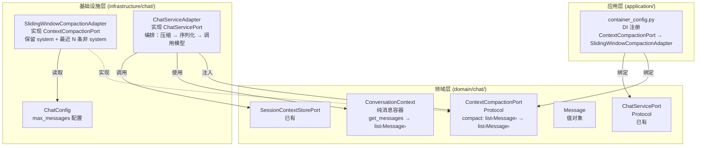
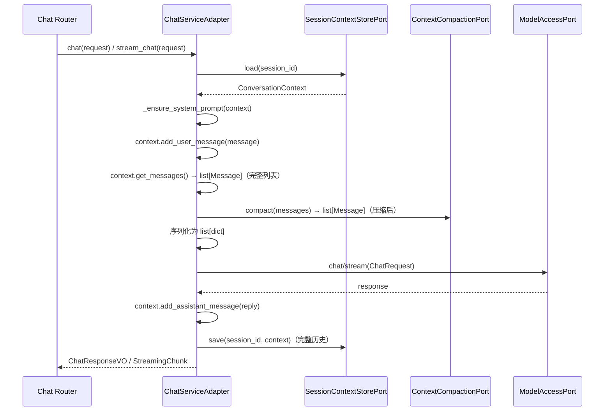

# 技术设计文档：上下文压缩策略（Context Compaction Strategy）

## 概述

本设计将 `ConversationContext.get_messages()` 中内嵌的滑动窗口裁剪逻辑抽取为独立的上下文压缩策略，遵循六边形架构的 Port/Adapter 模式。

当前 `ConversationContext` 同时承担了消息存储和消息裁剪两项职责，违反了单一职责原则。裁剪逻辑硬编码在 `get_messages()` 方法中，无法在不修改领域层代码的情况下替换压缩策略。此外，`get_messages()` 直接返回 `list[dict[str, str]]`，将序列化职责也混入了上下文对象。

重构后：
- `ConversationContext` 回归纯粹的消息容器，`get_messages()` 返回完整的 `list[Message]`
- 领域层新增 `ContextCompactionPort`（Protocol），定义压缩操作的标准接口
- 基础设施层提供 `SlidingWindowCompactionAdapter`，复现当前的滑动窗口裁剪行为
- `ChatServiceAdapter` 在调用模型前通过 `ContextCompactionPort` 执行压缩，并负责将 `Message` 序列化为 `dict`
- DI 容器管理 Port → Adapter 绑定，支持通过配置切换策略

### 设计决策

1. **压缩端口定义在 `domain/chat/ports.py`**：`ContextCompactionPort` 属于会话管理限界上下文的领域端口，与 `SessionContextStorePort`、`ChatServicePort` 放在同一模块，保持领域边界一致性。

2. **`get_messages()` 返回 `list[Message]` 而非 `list[dict]`**：将序列化职责从 `ConversationContext` 移至 `ChatServiceAdapter`，使值对象保持纯粹。`ChatServiceAdapter` 作为编排层，负责在调用 `ModelAccessPort` 前将 `Message` 转换为 `dict` 格式。

3. **压缩在 `ChatServiceAdapter` 中执行而非 `ConversationContext` 中**：压缩是编排层的关注点（何时压缩、用什么策略），不应由值对象承担。这也使得完整的消息历史始终保存到 `SessionContextStorePort`，确保对话历史完整性。

4. **`SlidingWindowCompactionAdapter` 从 `ChatConfig` 读取 `max_messages`**：复用现有的配置机制，在 `ChatConfig` 中新增 `max_messages` 字段（默认值 50），与重构前行为一致。

5. **向后兼容 `from_dict`**：`ConversationContext.from_dict()` 兼容包含和不包含 `max_messages` 字段的字典数据，确保已持久化的会话数据可正常加载。

## 架构

### 分层架构图



### 调用时序图



## 组件与接口

### 1. ContextCompactionPort（领域层端口）

位置：`domain/chat/ports.py`

```python
class ContextCompactionPort(Protocol):
    """上下文压缩端口。

    定义将完整消息列表压缩为适合发送给模型的消息列表的标准操作。
    由基础设施层提供具体的压缩策略实现。
    """

    def compact(self, messages: list["Message"]) -> list["Message"]:
        """压缩消息列表。

        Args:
            messages: 完整的消息列表

        Returns:
            压缩后的消息列表，保证返回的 Message 对象与输入中的对应对象引用相同或内容等价
        """
        ...
```

### 2. SlidingWindowCompactionAdapter（基础设施层适配器）

位置：`infrastructure/chat/sliding_window_compaction_adapter.py`

```python
class SlidingWindowCompactionAdapter:
    """滑动窗口压缩适配器，实现 ContextCompactionPort。

    保留所有 system 消息和最近 max_messages 条非 system 消息，
    复现重构前 ConversationContext.get_messages() 的裁剪行为。
    """

    def __init__(self, max_messages: int = 50) -> None: ...
    def compact(self, messages: list[Message]) -> list[Message]: ...
```

### 3. ConversationContext 变更

位置：`domain/chat/context.py`

变更点：
- 移除 `_max_messages` 属性和构造参数
- `get_messages()` 返回 `list[Message]`（不再返回 `list[dict]`，不再执行裁剪）
- `to_dict()` 不再包含 `max_messages` 字段
- `from_dict()` 兼容包含和不包含 `max_messages` 的字典数据

### 4. ChatServiceAdapter 变更

位置：`infrastructure/chat/chat_service_adapter.py`

变更点：
- 构造函数新增 `compaction: ContextCompactionPort` 参数
- `chat()` 和 `stream_chat()` 在构建 `ChatRequest` 前调用 `compaction.compact()`
- 新增 `_serialize_messages()` 静态方法，将 `list[Message]` 转换为 `list[dict[str, str]]`
- `_ensure_system_prompt()` 适配 `get_messages()` 返回 `list[Message]` 的变更

### 5. ChatConfig 变更

位置：`infrastructure/chat/chat_config.py`

变更点：
- 新增 `max_messages: int = 50` 配置字段，对应 `CHAT_MAX_MESSAGES` 环境变量

### 6. DI 容器注册变更

位置：`application/container_config.py`

变更点：
- 新增 `_create_compaction_adapter()` 工厂函数
- 注册 `ContextCompactionPort → SlidingWindowCompactionAdapter` 绑定
- `_create_chat_service()` 从容器解析 `ContextCompactionPort` 并注入 `ChatServiceAdapter`

## 数据模型

### Message（已有，无变更）

```python
@dataclass
class Message:
    role: str          # "system" | "user" | "assistant" | "tool"
    content: str
    tool_name: str | None = None
    metadata: dict[str, Any] = field(default_factory=dict)
```

### ConversationContext 序列化格式变更

重构前 `to_dict()` 输出：
```json
{
  "max_messages": 50,
  "messages": [{"role": "system", "content": "..."}]
}
```

重构后 `to_dict()` 输出：
```json
{
  "messages": [{"role": "system", "content": "..."}]
}
```

`from_dict()` 兼容两种格式：接收到包含 `max_messages` 的旧数据时，忽略该字段。

### ChatRequest（已有，无变更）

`ChatRequest.messages` 类型为 `list[dict[str, str]]`，由 `ChatServiceAdapter` 负责将 `list[Message]` 序列化为此格式。


## 正确性属性（Correctness Properties）

*属性（Property）是在系统所有有效执行中都应成立的特征或行为——本质上是对系统应做什么的形式化陈述。属性是人类可读规格说明与机器可验证正确性保证之间的桥梁。*

### Property 1: compact 输出是输入的子集

*For any* 消息列表 `messages` 和任意 `ContextCompactionPort` 实现，`compact(messages)` 返回的每个 `Message` 对象都应在输入列表中存在引用相同或内容等价的对象，且返回列表长度不超过输入列表长度。

**Validates: Requirements 1.3**

### Property 2: get_messages 返回完整的 Message 列表

*For any* 添加到 `ConversationContext` 的消息序列（包含任意数量的 system、user、assistant、tool 消息），`get_messages()` 应返回包含所有已添加消息的 `list[Message]`，长度等于添加的消息总数，且每个元素都是 `Message` 实例。

**Validates: Requirements 2.1, 2.3**

### Property 3: ConversationContext 序列化往返一致性

*For any* 有效的 `ConversationContext` 对象，执行 `to_dict()` 后再 `from_dict()` 应产生与原始对象消息列表等价的 `ConversationContext`，且 `to_dict()` 输出不包含 `max_messages` 键。此外，对于包含 `max_messages` 字段的旧格式字典，`from_dict()` 也应正常工作并忽略该字段。

**Validates: Requirements 2.4, 2.5, 2.6**

### Property 4: 滑动窗口压缩保留所有 system 消息并裁剪非 system 消息

*For any* 消息列表和任意正整数 `max_messages`，`SlidingWindowCompactionAdapter(max_messages).compact(messages)` 应满足：(a) 输入中的所有 system 消息都出现在输出中；(b) 输出中的非 system 消息数量不超过 `max_messages`；(c) 当输入的非 system 消息数量超过 `max_messages` 时，输出中的非 system 消息是输入中最后 `max_messages` 条非 system 消息；(d) 输出中 system 消息在前、非 system 消息在后。

**Validates: Requirements 3.3, 3.4, 3.5**

### Property 5: Message 序列化为模型调用格式

*For any* 有效的 `Message` 对象，将其序列化为模型调用格式后，结果字典应恰好包含 `role` 和 `content` 两个键，且值分别等于 `Message.role` 和 `Message.content`。

**Validates: Requirements 6.1, 6.2, 6.3**

### Property 6: 重构后行为等价性

*For any* 消息列表（包含任意数量的 system、user、assistant、tool 消息）和任意正整数 `max_messages`，新流程（`SlidingWindowCompactionAdapter(max_messages).compact(messages)` 后序列化为 `list[dict]`）的输出应与旧流程（`ConversationContext(max_messages).get_messages()` 在重构前的行为）的输出完全一致。

**Validates: Requirements 7.1**

## 错误处理

### 1. compact 接收空列表

当 `compact()` 接收空的 `list[Message]` 时，直接返回空列表 `[]`，不抛出异常。这是边界条件的正常处理。

### 2. from_dict 兼容旧格式

当 `from_dict()` 接收包含 `max_messages` 字段的旧格式字典时，忽略该字段，正常构建 `ConversationContext`。不抛出异常，不记录警告。

### 3. max_messages 配置值校验

`SlidingWindowCompactionAdapter` 的 `max_messages` 参数应为正整数。若配置值 ≤ 0，应在构造时抛出 `ValueError`，提供明确的错误信息。

### 4. _ensure_system_prompt 适配

`_ensure_system_prompt` 方法适配 `get_messages()` 返回 `list[Message]` 后，通过检查 `Message.role` 属性（而非字典键）判断是否存在 system 消息。逻辑不变，仅访问方式变更。

## 测试策略

### 属性测试（Property-Based Testing）

使用项目已有的 `hypothesis` 库（`>=6.82.0`）进行属性测试。每个正确性属性对应一个属性测试，最少运行 100 次迭代。

每个属性测试必须通过注释标注对应的设计属性：
- 格式：`# Feature: context-compaction-strategy, Property {number}: {property_text}`

属性测试文件：`test/domain/chat/test_compaction_properties.py`

| 属性 | 测试描述 | 生成器 |
|------|---------|--------|
| Property 1 | compact 输出是输入子集 | 随机 Message 列表（混合 system/user/assistant/tool 角色） |
| Property 2 | get_messages 返回完整列表 | 随机消息序列（随机角色和内容） |
| Property 3 | ConversationContext 往返一致性 | 随机 ConversationContext（随机消息列表），含/不含 max_messages 的字典 |
| Property 4 | 滑动窗口压缩行为 | 随机 Message 列表 + 随机正整数 max_messages |
| Property 5 | Message 序列化格式 | 随机 Message 对象（随机 role/content/tool_name/metadata） |
| Property 6 | 行为等价性 | 随机 Message 列表 + 随机正整数 max_messages |

### 单元测试

单元测试文件：`test/domain/chat/test_compaction_unit.py`

单元测试聚焦于具体示例和边界条件：

1. **边界条件**：
   - compact 接收空列表返回空列表（Requirements 1.4）
   - 仅包含 system 消息的列表原样返回（Requirements 3.6）
   - 非 system 消息数量为 0 时仅返回 system 消息（Requirements 7.3）
   - tool 消息被视为非 system 消息参与裁剪（Requirements 7.4）

2. **集成测试**（使用 mock）：
   - ChatServiceAdapter.chat() 调用 compact 后将压缩结果传给 ModelAccessPort（Requirements 4.2, 4.4）
   - ChatServiceAdapter.stream_chat() 调用 compact 后将压缩结果传给 ModelAccessPort（Requirements 4.3, 4.4）
   - ChatServiceAdapter 保存完整历史到 SessionContextStorePort（Requirements 4.5）

3. **配置测试**：
   - SlidingWindowCompactionAdapter 默认 max_messages 为 50（Requirements 5.3）
   - 配置指定不同 max_messages 值时使用配置值（Requirements 5.4）
   - max_messages ≤ 0 时抛出 ValueError

4. **DI 容器测试**：
   - 容器能解析 ContextCompactionPort 并返回 SlidingWindowCompactionAdapter 实例（Requirements 5.1, 5.2）

### 测试配置

- 属性测试：每个属性最少 100 次迭代（`@settings(max_examples=100)`）
- 测试运行命令：`cd epsilon-boot && uv run pytest test/domain/chat/test_compaction_properties.py test/domain/chat/test_compaction_unit.py -v`
- 每个属性测试必须由单个 `@given` 装饰的测试函数实现
