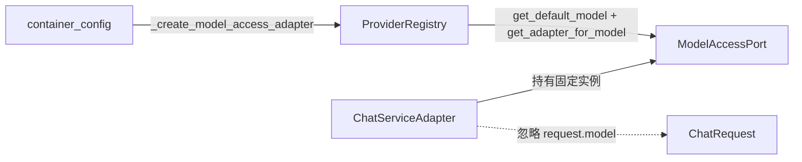
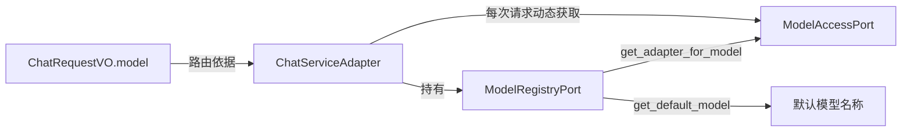

# 设计文档：动态模型路由

## 概述

当前 `ChatServiceAdapter` 在 DI 容器初始化时通过 `_create_model_access_adapter()` 获取默认模型对应的固定 `ModelAccessPort` 实例，该实例在整个应用生命周期内不变。即使 `ChatRequestVO` 携带了 `model` 字段，`ChatServiceAdapter` 也无法将请求路由到不同的模型适配器。

本设计的核心变更是：将 `ChatServiceAdapter` 的依赖从固定的 `ModelAccessPort` 实例改为 `ModelRegistryPort` 实例。每次对话请求处理时，根据 `ChatRequestVO.model` 字段动态调用 `ModelRegistryPort.get_adapter_for_model()` 获取对应的适配器，实现请求级别的模型路由。

变更范围小且集中：仅涉及 `ChatServiceAdapter` 的构造函数签名和内部模型获取逻辑，以及 `container_config.py` 中的依赖注入配置。不需要新增领域层端口或值对象，完全复用现有的 `ModelRegistryPort` 和 `ProviderRegistry` 基础设施。

## 架构

### 当前架构（变更前）



容器初始化时，`_create_model_access_adapter()` 通过 `ProviderRegistry` 获取默认模型的适配器，将其作为固定的 `ModelAccessPort` 注入 `ChatServiceAdapter`。请求中的 `model` 参数虽然会传递到 `ChatRequest`，但 `OpenAICompatibleAdapter._build_params()` 中 `request.model or self._config.default_model` 的逻辑仅在同一适配器内部选择模型名称，无法跨提供商路由。

### 目标架构（变更后）



`ChatServiceAdapter` 持有 `ModelRegistryPort`（即 `ProviderRegistry`），在每次 `chat()` / `stream_chat()` 调用时：
1. 从 `ChatRequestVO.model` 获取目标模型名称（为 None 时回退到 `ModelRegistryPort.get_default_model()`）
2. 调用 `ModelRegistryPort.get_adapter_for_model(model_name)` 获取对应的 `ModelAccessPort` 实例
3. 使用该实例执行 LLM 调用

### 设计决策

1. **直接注入 `ModelRegistryPort` 而非引入新的 `ModelRouter` 抽象**：`ModelRegistryPort` 已经提供了 `get_adapter_for_model()` 和 `get_default_model()` 两个方法，完全满足动态路由需求。引入额外的 `ModelRouter` 层会增加不必要的复杂度。

2. **在 `ChatServiceAdapter` 内部封装模型解析逻辑**：新增一个私有方法 `_resolve_model_access(model: str | None) -> tuple[ModelAccessPort, str]`，集中处理"有 model 参数 → 直接路由"和"无 model 参数 → 使用默认模型"两种情况，避免在 `chat()`、`stream_chat()`、`_run_agent_loop()`、`_run_agent_loop_streaming()` 四个方法中重复路由逻辑。

3. **保留 `ModelAccessPort` 在容器中的注册**：其他消费者（如未来的独立模型调用场景）可能仍需要直接获取默认模型的适配器，因此 `container.register(ModelAccessPort, ...)` 保持不变。

## 组件与接口

### 变更组件

#### 1. ChatServiceAdapter（基础设施层）

**文件**：`epsilon-boot/src/infrastructure/chat/chat_service_adapter.py`

**构造函数变更**：

```python
# 变更前
def __init__(
    self,
    session_store: SessionContextStorePort,
    model_access: ModelAccessPort,       # 固定适配器
    system_prompt: str,
    compaction: ContextCompactionPort,
    tool_registry: ToolRegistry,
    max_tool_rounds: int,
    tool_calling_enabled: bool,
) -> None:

# 变更后
def __init__(
    self,
    session_store: SessionContextStorePort,
    model_registry: ModelRegistryPort,   # 注册中心
    system_prompt: str,
    compaction: ContextCompactionPort,
    tool_registry: ToolRegistry,
    max_tool_rounds: int,
    tool_calling_enabled: bool,
) -> None:
```

**新增私有方法**：

```python
def _resolve_model_access(self, model: str | None) -> tuple[ModelAccessPort, str]:
    """根据请求中的 model 参数解析对应的模型适配器。

    Args:
        model: 请求指定的模型名称，为 None 时使用默认模型。

    Returns:
        (适配器实例, 实际使用的模型名称) 元组。

    Raises:
        ModelAccessError: 模型未注册或无可用提供商。
    """
```

**内部调用变更**：

- `chat()` 方法：在调用 LLM 前通过 `_resolve_model_access(request.model)` 获取适配器
- `stream_chat()` 方法：同上
- `_run_agent_loop()` 方法：接收 `ModelAccessPort` 参数而非内部使用 `self._model_access`
- `_run_agent_loop_streaming()` 方法：同上

#### 2. container_config.py（应用层）

**文件**：`epsilon-boot/src/application/container_config.py`

**变更**：`_create_chat_service()` 中注入 `ModelRegistryPort` 替代 `ModelAccessPort`。

```python
# 变更前
model_access = await container.resolve(ModelAccessPort)
return ChatServiceAdapter(
    session_store=session_store,
    model_access=model_access,
    ...
)

# 变更后
model_registry = await container.resolve(ModelRegistryPort)
return ChatServiceAdapter(
    session_store=session_store,
    model_registry=model_registry,
    ...
)
```

### 不变组件

- **ModelRegistryPort**（领域层端口）：接口不变，已有 `get_adapter_for_model()` 和 `get_default_model()`
- **ProviderRegistry**（基础设施层）：实现不变，Round-Robin 负载均衡逻辑完全复用
- **ChatRequestVO**（领域层值对象）：已有 `model: str | None` 字段，无需修改
- **ChatRequest**（模型接入值对象）：已有 `model: str | None` 字段，无需修改
- **ModelAccessPort**（领域层端口）：接口不变
- **容器中 ModelAccessPort 的注册**：保留，供其他消费者使用

## 数据模型

本设计不引入新的数据模型或值对象。所有现有数据模型保持不变：

- `ChatRequestVO`：已包含 `model: str | None` 字段
- `ChatRequest`：已包含 `model: str | None` 字段
- `ChatResponseVO`：已包含 `model: str` 字段，用于反映实际使用的模型
- `LLMResponse`：已包含 `model: str` 字段
- `ModelInfo`：不受影响

数据流变更仅在运行时路由层面：`ChatRequestVO.model` → `_resolve_model_access()` → `ModelRegistryPort.get_adapter_for_model()` → 动态获取 `ModelAccessPort` 实例。


## 正确性属性（Correctness Properties）

*属性（Property）是指在系统所有合法执行路径中都应成立的特征或行为——本质上是对系统应做什么的形式化陈述。属性是连接人类可读规格说明与机器可验证正确性保证之间的桥梁。*

以下属性从需求验收标准中提炼而来，经过冗余消除后保留了 6 个独立属性。

### Property 1: 指定模型的动态路由

*For any* 携带有效 `model` 字段的 `ChatRequestVO`，无论是同步对话（`chat()`）还是流式对话（`stream_chat()`），`ChatServiceAdapter` 都应通过 `ModelRegistryPort.get_adapter_for_model(model)` 获取对应的 `ModelAccessPort` 实例，并使用该实例执行 LLM 调用。

**Validates: Requirements 1.2, 2.1, 3.1, 4.1**

### Property 2: 未指定模型时回退到默认模型

*For any* `model` 字段为 `None` 的 `ChatRequestVO`，无论是同步对话还是流式对话，`ChatServiceAdapter` 都应先通过 `ModelRegistryPort.get_default_model()` 获取默认模型名称，再通过 `ModelRegistryPort.get_adapter_for_model()` 获取对应的适配器实例执行 LLM 调用。

**Validates: Requirements 2.2, 3.2, 4.2**

### Property 3: 未注册模型的错误传播

*For any* `model` 字段指定了未在 `ProviderRegistry` 中注册的模型名称的 `ChatRequestVO`，`ChatServiceAdapter` 应抛出 `ModelAccessError` 异常，且异常详情中包含请求的模型名称和可用模型列表。

**Validates: Requirements 2.3**

### Property 4: 响应中的模型名称准确性

*For any* 成功完成的同步对话请求，返回的 `ChatResponseVO.model` 字段应与 LLM 实际返回的 `LLMResponse.model` 一致，反映实际使用的模型名称。

**Validates: Requirements 3.3**

### Property 5: Agent Loop 中适配器一致性

*For any* 启用 function calling 的 Agent Loop 执行（无论同步模式还是流式模式），所有轮次的 LLM 调用都应使用同一个由请求 `model` 参数解析得到的 `ModelAccessPort` 实例，不应在轮次间切换适配器。

**Validates: Requirements 5.1, 5.2**

### Property 6: Round-Robin 负载均衡保持

*For any* 由多个提供商注册的模型，通过 `ChatServiceAdapter` 发起的连续请求应遵循 `ProviderRegistry` 的 Round-Robin 负载均衡策略，在提供商之间均匀分布。

**Validates: Requirements 7.1**

## 错误处理

### 错误场景与处理策略

| 错误场景 | 触发条件 | 处理方式 | 异常类型 |
|---------|---------|---------|---------|
| 模型未注册 | `ChatRequestVO.model` 指定的模型不在注册中心 | `ProviderRegistry.get_adapter_for_model()` 抛出异常，`ChatServiceAdapter` 向上传播 | `ModelAccessError` |
| 无可用模型 | `model=None` 且注册中心无任何模型 | `ProviderRegistry.get_default_model()` 抛出异常，`ChatServiceAdapter` 向上传播 | `NoAvailableModelError` |
| 提供商不可用 | 选中的提供商适配器已被移除 | `ProviderRegistry` 内部清理并重试（现有逻辑），失败时抛出异常 | `ModelAccessError` |
| LLM 调用失败 | 超时、限流、连接失败等 | 由 `OpenAICompatibleAdapter` 处理并映射为领域异常（现有逻辑不变） | `ModelTimeoutError` / `ModelRateLimitError` / `ModelConnectionError` |

### 设计要点

1. **`_resolve_model_access()` 方法是唯一的路由入口**：所有模型解析错误都在此方法中触发，调用方（`chat()`、`stream_chat()`）无需额外处理路由错误。

2. **异常传播链保持不变**：`ModelAccessError` 及其子类的异常传播路径与当前一致，由应用层的全局异常处理器统一处理。

3. **不引入新的异常类型**：所有错误场景均可通过现有异常类型覆盖。

## 测试策略

### 双重测试方法

本特性采用单元测试 + 属性测试的双重测试策略：

- **单元测试**：验证具体示例、边界条件和错误场景
- **属性测试**：验证跨所有输入的通用属性

### 属性测试配置

- **测试库**：Hypothesis（项目已使用）
- **每个属性测试最少运行 100 次迭代**
- **每个属性测试必须通过注释引用设计文档中的属性编号**
- **标签格式**：`Feature: dynamic-model-routing, Property {number}: {property_text}`
- **每个正确性属性由单个属性测试实现**

### 单元测试覆盖

1. **构造函数测试**：验证 `ChatServiceAdapter` 接受 `ModelRegistryPort` 参数（Requirements 1.1）
2. **容器配置测试**：验证 `_create_chat_service()` 注入 `ModelRegistryPort`（Requirements 6.1, 6.2, 6.3）
3. **边界条件**：空模型名称（`model=""`）的处理

### 属性测试覆盖

| 属性编号 | 测试描述 | 生成策略 |
|---------|---------|---------|
| Property 1 | 指定模型的动态路由 | 生成随机模型名称，注册到 mock registry，验证路由正确性 |
| Property 2 | 未指定模型时回退到默认模型 | 生成 `model=None` 的请求，验证使用默认模型 |
| Property 3 | 未注册模型的错误传播 | 生成不在注册中心的随机模型名称，验证抛出 `ModelAccessError` |
| Property 4 | 响应中的模型名称准确性 | 生成随机模型名称和对应的 mock 响应，验证 `ChatResponseVO.model` 一致 |
| Property 5 | Agent Loop 中适配器一致性 | 生成多轮工具调用场景，验证所有轮次使用同一适配器 |
| Property 6 | Round-Robin 负载均衡保持 | 注册多个提供商到同一模型，连续请求验证轮询分布 |
