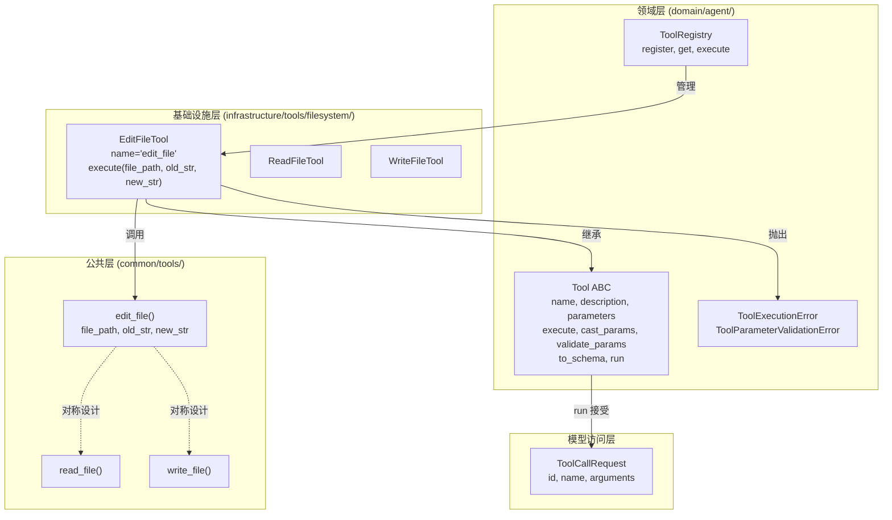
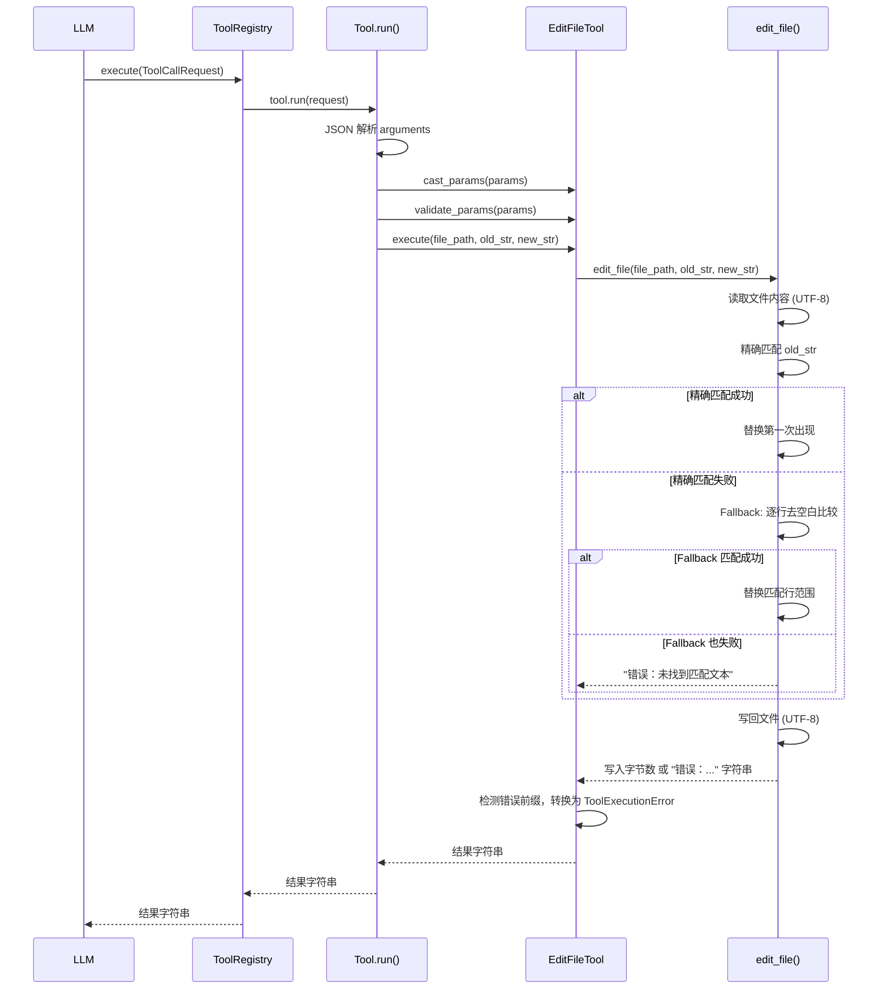

# Design Document: EditFileTool

## Overview

EditFileTool 是一个继承自 `Tool` 抽象基类的具体工具实现，为 LLM Agent 提供文件内容编辑能力（文本替换）。该工具位于基础设施层 `infrastructure/tools/filesystem/edit_file_tool.py`，遵循 DDD 六边形架构：领域层 `Tool` ABC 定义端口接口，EditFileTool 作为适配器实现。

工具底层在 `common/tools/common_tools.py` 中新增 `edit_file()` 工具函数，与已有的 `read_file()` 和 `write_file()` 形成对称设计。EditFileTool 将 `edit_file()` 适配为 Tool 接口规范，支持通过指定 `old_str` 和 `new_str` 来替换文件中第一次出现的目标文本，并在精确匹配失败时自动尝试忽略空白差异的回退匹配策略。

### 设计决策

1. **复用 common 层函数而非在 Tool 中直接实现**：与 ReadFileTool/WriteFileTool 保持一致的分层模式，`edit_file()` 处理文件读写和匹配逻辑，EditFileTool 仅做参数传递和错误转换。
2. **仅替换第一次出现**：避免 LLM 意外修改文件中多处相同文本，降低破坏性编辑风险。若需替换多处，LLM 可多次调用。
3. **两阶段匹配策略（Exact → Fallback）**：LLM 生成的代码片段常有缩进偏差，先尝试精确匹配保证准确性，失败后自动回退到忽略行首尾空白的逐行比较，提高匹配成功率。Fallback 匹配时替换文件中的原始行（保留原始缩进之外的结构），写入 `new_str` 作为替换内容。
4. **错误约定与 read_file/write_file 一致**：成功返回字节数（int），失败返回 `"错误："` 前缀字符串，权限不足抛出 `PermissionError`。
5. **description 和 parameters 使用英文**：遵循用户要求，工具的 `description` 属性和 `parameters` 中的 `description` 字段使用英文，代码 docstring 保持中文。

## Architecture



### 调用流程



### edit_file() 匹配流程

```mermaid
flowchart TD
    A[接收 file_path, old_str, new_str] --> B{old_str 为空?}
    B -->|是| C[返回 "错误：old_str 不能为空"]
    B -->|否| D{文件存在?}
    D -->|否| E[返回 "错误：文件不存在"]
    D -->|是| F{路径是目录?}
    F -->|是| G[返回 "错误：路径是目录而非文件"]
    F -->|否| H[读取文件内容 UTF-8]
    H --> I{精确匹配 old_str?}
    I -->|是| J[替换第一次出现的 old_str 为 new_str]
    I -->|否| K[Fallback: 逐行 strip 比较]
    K --> L{Fallback 匹配成功?}
    L -->|否| M[返回 "错误：未找到匹配文本"]
    L -->|是| N[替换匹配行范围为 new_str]
    J --> O[写回文件 UTF-8]
    N --> O
    O --> P[返回写入字节数 int]
```

## Components and Interfaces

### edit_file() 工具函数

```python
def edit_file(file_path: str, old_str: str, new_str: str) -> int | str:
    """将文件中第一次出现的 old_str 替换为 new_str。

    匹配策略：
    1. 精确匹配：在文件内容中查找 old_str 的精确出现
    2. 回退匹配：若精确匹配失败，将 old_str 和文件内容按行分割，
       每行去除前导和尾随空白后逐行比较，找到第一个匹配位置

    Args:
        file_path: 目标文件路径。
        old_str: 要被替换的原始文本片段，不能为空字符串。
        new_str: 用于替换的新文本片段，可以为空（等效于删除）。

    Returns:
        成功时返回写入的字节数（int）。
        失败时返回以 "错误：" 开头的错误描述字符串。

    Raises:
        PermissionError: 读写权限不足时抛出。
    """
```

### EditFileTool 类

```python
class EditFileTool(Tool):
    """文件内容编辑工具，支持文本替换和回退匹配。

    作为基础设施层适配器，将公共层的 edit_file() 函数适配为 Tool 抽象接口。
    可注册到 ToolRegistry 供 LLM Agent 调用。

    错误处理策略：
        - edit_file() 返回以 "错误：" 开头的字符串 → 转换为 ToolExecutionError
        - PermissionError → 转换为 ToolExecutionError
    """

    @property
    def name(self) -> str:
        """返回 'edit_file'。"""

    @property
    def description(self) -> str:
        """返回英文功能描述。"""

    @property
    def parameters(self) -> dict[str, Any]:
        """返回 JSON Schema 参数定义（英文描述）。"""

    async def execute(self, **kwargs: Any) -> str:
        """执行文件编辑操作。

        流程：
        1. 从 kwargs 提取 file_path、old_str、new_str
        2. 调用 edit_file(file_path, old_str, new_str)
        3. 若捕获 PermissionError，转换为 ToolExecutionError
        4. 若返回值为字符串且以 "错误：" 开头，转换为 ToolExecutionError
        5. 成功时返回包含写入字节数的结果字符串
        """
```

### 参数 Schema

```json
{
  "type": "object",
  "properties": {
    "file_path": {
      "type": "string",
      "description": "The file path to edit"
    },
    "old_str": {
      "type": "string",
      "description": "The text to find and replace (first occurrence only)"
    },
    "new_str": {
      "type": "string",
      "description": "The replacement text (use empty string to delete)"
    }
  },
  "required": ["file_path", "old_str", "new_str"]
}
```

### 依赖关系

| 组件 | 依赖 | 说明 |
|------|------|------|
| edit_file() | pathlib.Path | 文件路径操作和读写 |
| EditFileTool | Tool ABC | 继承抽象基类 |
| EditFileTool | edit_file() | 复用文件编辑逻辑 |
| EditFileTool | ToolExecutionError | 错误转换目标异常 |

## Data Models

### 参数模型

| 参数 | 类型 | 必填 | 默认值 | 约束 | 说明 |
|------|------|------|--------|------|------|
| file_path | string | 是 | - | 非空 | 目标文件路径 |
| old_str | string | 是 | - | 非空 | 要被替换的文本片段 |
| new_str | string | 是 | - | 可为空 | 替换后的新文本 |

### Fallback 匹配算法

```
输入：file_content（文件全文）、old_str（待匹配文本）
输出：匹配的起始行索引和结束行索引，或 None

1. file_lines = file_content 按行分割
2. old_lines = old_str 按行分割
3. stripped_old = [line.strip() for line in old_lines]
4. 对 file_lines 中每个起始位置 i（0 <= i <= len(file_lines) - len(old_lines)）：
   a. 取 file_lines[i : i + len(old_lines)]
   b. 将每行 strip() 后与 stripped_old 逐行比较
   c. 若全部匹配，返回 (i, i + len(old_lines) - 1)
5. 未找到匹配，返回 None
```

### 返回值格式

成功时返回结果字符串，格式：`"成功编辑文件 {file_path}，共 {bytes} 字节"`

## Correctness Properties

*A property is a characteristic or behavior that should hold true across all valid executions of a system — essentially, a formal statement about what the system should do. Properties serve as the bridge between human-readable specifications and machine-verifiable correctness guarantees.*

### Property 1: Delegation consistency

*For any* valid file containing `old_str`, calling `EditFileTool.execute(file_path, old_str, new_str)` should produce the same file content as calling `edit_file(file_path, old_str, new_str)` directly. Additionally, when `edit_file` returns an integer byte count, `execute` should return a success string containing that byte count; when `edit_file` returns an error string, `execute` should raise `ToolExecutionError`.

This property verifies that EditFileTool correctly delegates to the underlying `edit_file()` utility without introducing distortion, mirroring the ReadFileTool delegation pattern.

**Validates: Requirements 3.1, 3.3**

### Property 2: Edit-then-read round trip

*For any* file content containing `old_str` (at least once) and any `new_str`, after calling `edit_file(file_path, old_str, new_str)`, reading the file back with `read_file(file_path)` should return content that contains `new_str` and does not contain the first occurrence of `old_str` at its original position.

This is a round-trip property: write (edit) then read should reflect the edit.

**Validates: Requirements 1.2, 7.1**

### Property 3: Self-replacement idempotence

*For any* file content and any `old_str` present in the file, calling `edit_file(file_path, old_str, old_str)` should produce a file whose content is byte-for-byte identical to the original file.

This is an idempotence property: `f(f(x)) == f(x)` where the operation is "replace X with X".

**Validates: Requirements 7.2**

### Property 4: Only-first-occurrence replacement

*For any* file content containing `old_str` at least twice, and any `new_str` different from `old_str`, after calling `edit_file(file_path, old_str, new_str)`, the resulting file should still contain `old_str` (the second and subsequent occurrences remain). The count of `old_str` in the result should be exactly one less than in the original (when occurrences don't overlap and `new_str` doesn't contain `old_str`).

**Validates: Requirements 1.3, 5.4**

### Property 5: Fallback matching succeeds on whitespace differences

*For any* file content and any `old_str` that matches a contiguous block of lines in the file after stripping leading and trailing whitespace from each line (but does not match exactly), `edit_file` should still succeed and return an integer byte count.

This property validates the two-stage matching strategy: exact match fails, fallback match succeeds.

**Validates: Requirements 1.4, 1.5, 3.2, 5.1, 5.2**

### Property 6: Non-existent file raises error

*For any* file path that does not exist on the filesystem, calling `EditFileTool.execute(file_path, old_str, new_str)` should raise `ToolExecutionError`, and the error message should contain the file path string.

**Validates: Requirements 1.6, 4.1**

### Property 7: No-match raises error

*For any* file content and any `old_str` that is not present in the file (neither by exact match nor by fallback match), calling `EditFileTool.execute(file_path, old_str, new_str)` should raise `ToolExecutionError`.

**Validates: Requirements 1.8, 4.3**

### Property 8: Missing required params raises validation error

*For any* subset of `{file_path, old_str, new_str}` that is missing at least one required parameter, calling `Tool.run()` with a `ToolCallRequest` containing only that subset should raise `ToolParameterValidationError`.

**Validates: Requirements 6.3**

## Error Handling

EditFileTool 的错误处理分为两层，与 ReadFileTool/WriteFileTool 保持一致的模式：

### 1. edit_file() 工具函数层

`edit_file()` 通过返回值类型区分成功与失败，与 `write_file()` 保持一致：

| 条件 | 返回值 | 说明 |
|------|--------|------|
| old_str 为空字符串 | `"错误：old_str 不能为空"` | 前置校验 |
| 文件不存在 | `"错误：文件不存在 - {file_path}"` | 与 read_file 一致 |
| 路径是目录 | `"错误：路径是目录而非文件 - {file_path}"` | 与 write_file 一致 |
| 精确匹配和回退匹配均失败 | `"错误：未找到匹配的文本"` | 包含 old_str 摘要 |
| 权限不足 | 抛出 `PermissionError` | 与 read_file/write_file 一致 |
| 成功 | 写入字节数（int） | 与 write_file 一致 |

### 2. EditFileTool 适配层（execute 方法）

将 `edit_file()` 的返回值和异常统一转换为 `ToolExecutionError`：

| edit_file 行为 | EditFileTool 处理 |
|----------------|-------------------|
| 返回以 `"错误："` 开头的字符串 | 抛出 `ToolExecutionError(message=原始错误信息)` |
| 抛出 `PermissionError` | 捕获并抛出 `ToolExecutionError(message="权限不足，无法编辑文件: {file_path}")` |
| 返回 int（字节数） | 返回 `"成功编辑文件 {file_path}，共 {bytes} 字节"` |

### 3. Tool.run() 流水线层

`Tool.run()` 基类方法已处理：
- JSON 解析失败 → `ToolParameterValidationError`
- 类型不匹配 → `ToolParameterValidationError`
- 必填参数缺失 → `ToolParameterValidationError`
- execute 中未捕获的异常 → 包装为 `ToolExecutionError`

## Testing Strategy

### 测试框架与工具

- **单元测试**: pytest + pytest-asyncio
- **属性测试**: Hypothesis（项目已使用）
- **测试位置**: `epsilon-boot/test/infrastructure/tools/filesystem/`

### 属性测试（Property-Based Tests）

使用 Hypothesis 库，每个属性测试运行至少 100 次迭代。每个测试通过注释标注对应的设计属性。

**Hypothesis 策略设计**：
- 文件内容策略：生成随机行数（1~100 行）、随机内容的文本（使用 `tmp_path` 或 `tempfile`）
- old_str 策略：从生成的文件内容中随机选取连续行作为 old_str，确保匹配存在
- new_str 策略：`st.text()` 生成随机替换文本
- 不存在文件路径策略：基于 `tempfile.TemporaryDirectory` 生成不存在的路径
- 空白变异策略：对 old_str 的每行添加随机前导/尾随空白，用于测试 Fallback 匹配
- 不匹配 old_str 策略：生成保证不在文件中出现的随机文本（如 UUID）

**属性测试清单**：

| 属性 | 标签 | 说明 |
|------|------|------|
| Property 1 | Feature: edit-file-tool, Property 1: Delegation consistency | 验证 execute 效果与 edit_file() 一致 |
| Property 2 | Feature: edit-file-tool, Property 2: Edit-then-read round trip | 验证编辑后读取包含 new_str |
| Property 3 | Feature: edit-file-tool, Property 3: Self-replacement idempotence | 验证 old_str→old_str 不改变文件 |
| Property 4 | Feature: edit-file-tool, Property 4: Only-first-occurrence replacement | 验证仅替换第一次出现 |
| Property 5 | Feature: edit-file-tool, Property 5: Fallback matching succeeds on whitespace differences | 验证空白差异时回退匹配成功 |
| Property 6 | Feature: edit-file-tool, Property 6: Non-existent file raises error | 验证不存在文件抛出 ToolExecutionError |
| Property 7 | Feature: edit-file-tool, Property 7: No-match raises error | 验证无匹配时抛出 ToolExecutionError |
| Property 8 | Feature: edit-file-tool, Property 8: Missing required params raises validation error | 验证缺少必填参数抛出 ToolParameterValidationError |

### 单元测试（Unit Tests）

单元测试覆盖具体示例和边界情况，与属性测试互补：

| 测试场景 | 说明 |
|----------|------|
| 基本定义验证 | name == "edit_file"、description 为非空英文、parameters schema 结构正确 |
| to_schema 格式 | 返回 OpenAI function calling 格式，name 为 "edit_file" |
| parameters 英文描述 | 所有 parameter description 字段为英文 |
| ToolRegistry 集成 | register 后通过 ToolCallRequest 调用成功 |
| 目录路径错误 | 传入目录路径时抛出 ToolExecutionError |
| 权限不足错误 | 无写入权限时抛出 ToolExecutionError |
| old_str 为空字符串 | 抛出 ToolExecutionError |
| new_str 为空字符串 | 成功删除 old_str 对应文本 |
| 多次出现仅替换第一次 | 具体示例验证 |
| Fallback 匹配具体示例 | 缩进不同但内容相同时匹配成功 |
| UTF-8 非 ASCII 内容 | 中文/emoji 等内容的编辑正确性 |
| 模块导出 | `from infrastructure.tools.filesystem import EditFileTool` 可用 |

### 测试配置

```python
@settings(max_examples=100, deadline=2000)
```

每个属性测试以独立函数命名，方法以 `test_` 前缀命名，遵循项目现有的 Hypothesis 测试模式（参考 `test_read_file_tool_property.py`）。

每个属性测试必须由单个 property-based test 实现，通过注释引用设计文档中的属性编号。
