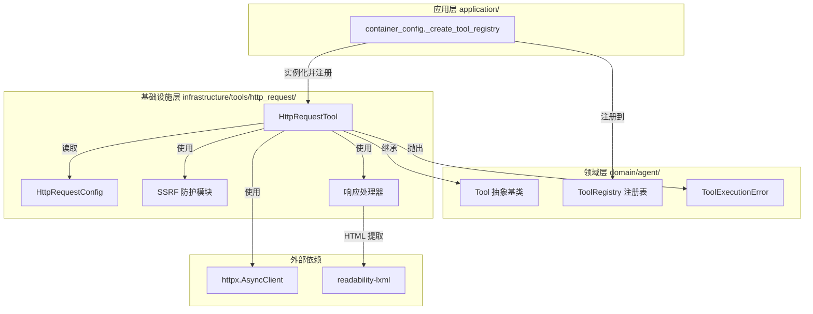
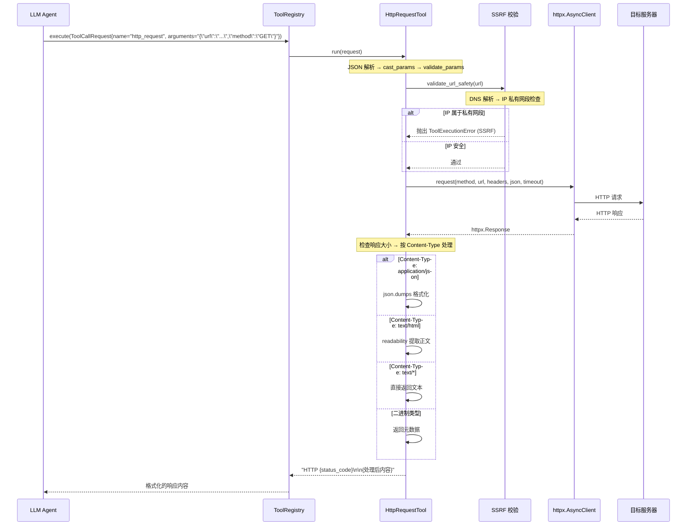

# 设计文档：HTTP Request Tool

## 概述

本设计为 LLM Agent 提供通用 HTTP 请求能力，基于 `httpx.AsyncClient`（项目已有依赖）实现。HttpRequestTool 作为基础设施层的 Tool 适配器，继承 `domain/agent/tools.py` 中的 `Tool` 抽象基类，支持 GET/POST/PUT/DELETE/PATCH 全部 HTTP 方法，根据响应 Content-Type 自动切换处理策略（JSON 直接返回、HTML 使用 readability-lxml 提取正文、二进制返回元数据）。

与 WebSearchTool 互补：WebSearchTool 搜索返回摘要列表，HttpRequestTool 可获取具体 URL 的详细内容或调用外部 API。

工具内置 SSRF 基础防护，在发起请求前对目标 URL 进行 DNS 解析并校验解析后的 IP 是否属于私有网段，防止 Agent 被诱导访问内部服务。

设计遵循项目 DDD 架构规范：
- 领域层（`Tool` 基类、`ToolExecutionError`）定义接口和异常
- 基础设施层（`HttpRequestTool`、`HttpRequestConfig`）提供具体实现
- 应用层（`container_config.py`）负责工具注册编排
- 配置通过 `config.properties` + `PropertiesBaseSettings` 统一管理

## 架构



### 设计决策

1. **httpx.AsyncClient 实例管理**：在 `HttpRequestTool.__init__` 中创建独立的 `httpx.AsyncClient` 实例，不复用 `GatewayClient` 的连接池。原因：GatewayClient 绑定了内部网关的 `base_url`，而 HttpRequestTool 需要访问任意外部 URL；两者的超时、重试策略也不同。HttpRequestTool 不配置 `base_url`，每次请求使用完整 URL。

2. **SSRF 防护实现方式**：采用 DNS 解析后 IP 校验的方案。在发起 HTTP 请求前，使用 `socket.getaddrinfo()` 对目标主机名进行 DNS 解析，获取 IP 地址后通过 `ipaddress` 标准库判断是否属于私有网段。将 SSRF 校验逻辑封装为独立函数 `validate_url_safety()`，便于单元测试和复用。

3. **响应内容处理策略**：根据 `Content-Type` 头分派处理逻辑，封装为独立函数 `process_response()`：
   - `application/json`：`json.dumps(response.json(), ensure_ascii=False, indent=2)` 格式化输出
   - `text/html`：使用 `readability.Document(html).summary()` 提取正文，再用简单的标签清理去除残留 HTML 标签
   - 其他文本类型（`text/*`）：直接返回 `response.text`
   - 二进制类型：返回元数据字符串（状态码、Content-Type、Content-Length）

4. **响应大小控制**：使用 `httpx` 的流式读取（`response.aread()`）获取响应体后检查大小，超过 `max_response_size` 时截断并附加提示。不使用流式分块读取以保持实现简洁。

5. **单工具模式**：通过 `method` 参数区分 HTTP 方法，而非为每个方法创建独立工具。减少 LLM 的工具选择负担，一个 `http_request` 工具覆盖所有场景。

6. **配置模块独立性**：`HttpRequestConfig` 作为独立配置类放在 `infrastructure/tools/http_request/` 包内，使用 `HTTP_REQUEST_` 前缀从 `config.properties` 加载配置，遵循 `TavilyConfig`、`RedisConfig` 的既有模式。

## 组件与接口

### 1. HttpRequestConfig（配置类）

**位置**：`infrastructure/tools/http_request/http_request_config.py`

继承 `PropertiesBaseSettings`，从 `config.properties` 加载 `HTTP_REQUEST_` 前缀的配置项。

```python
class HttpRequestConfig(PropertiesBaseSettings):
    model_config = SettingsConfigDict(env_prefix="HTTP_REQUEST_")

    timeout: int = 30
    max_response_size: int = 51200  # 50KB
    enabled: bool = True
```

**接口**：
- `timeout: int` — 默认请求超时秒数，对应 `HTTP_REQUEST_TIMEOUT`，默认 30
- `max_response_size: int` — 响应体大小上限（字节），对应 `HTTP_REQUEST_MAX_RESPONSE_SIZE`，默认 51200
- `enabled: bool` — 工具启用开关，对应 `HTTP_REQUEST_ENABLED`，默认 True

### 2. HttpRequestTool（工具实现）

**位置**：`infrastructure/tools/http_request/http_request_tool.py`

继承 `Tool` 抽象基类，封装 httpx 异步 HTTP 请求和响应处理。

```python
class HttpRequestTool(Tool):
    def __init__(self, timeout: int = 30, max_response_size: int = 51200): ...

    @property
    def name(self) -> str:          # 返回 "http_request"
    @property
    def description(self) -> str:   # 返回工具功能描述
    @property
    def parameters(self) -> dict:   # JSON Schema 参数定义

    async def execute(self, **kwargs) -> str:  # 执行 HTTP 请求并返回处理后的响应
```

**构造参数**：
- `timeout: int` — 默认请求超时秒数，当 `execute` 未传 `timeout` 时使用
- `max_response_size: int` — 响应体大小上限（字节），超过时截断

**parameters JSON Schema**：
```json
{
  "type": "object",
  "properties": {
    "url": {
      "type": "string",
      "description": "请求目标 URL，必须以 http:// 或 https:// 开头"
    },
    "method": {
      "type": "string",
      "description": "HTTP 方法，可选值: GET, POST, PUT, DELETE, PATCH，默认 GET",
      "enum": ["GET", "POST", "PUT", "DELETE", "PATCH"]
    },
    "headers": {
      "type": "object",
      "description": "自定义请求头"
    },
    "body": {
      "type": "string",
      "description": "请求体 JSON 字符串，用于 POST/PUT/PATCH 请求"
    },
    "timeout": {
      "type": "integer",
      "description": "单次请求超时秒数"
    }
  },
  "required": ["url"]
}
```

**execute 流程**：
1. 从 kwargs 提取参数：`url`（必填）、`method`（默认 "GET"）、`headers`、`body`、`timeout`
2. 调用 `validate_url_safety(url)` 进行 SSRF 校验
3. 如果有 `body`，解析为 JSON dict 作为请求的 `json` 参数
4. 使用 `httpx.AsyncClient` 发起异步请求
5. 检查响应体大小，超限则截断
6. 根据 Content-Type 调用 `process_response()` 处理响应内容
7. 返回包含状态码和处理后内容的格式化字符串
8. 异常时包装为 `ToolExecutionError` 抛出

**返回格式示例**（JSON 响应）：
```
HTTP 200 OK

{
  "id": 1,
  "name": "example"
}
```

**返回格式示例**（HTML 响应）：
```
HTTP 200 OK

这是网页正文内容，已去除导航栏、广告等噪音元素...
```

**返回格式示例**（二进制响应）：
```
HTTP 200 OK

[二进制内容] Content-Type: image/png, Content-Length: 102400 bytes
```

### 3. SSRF 防护函数

**位置**：`infrastructure/tools/http_request/http_request_tool.py`（模块级函数）

```python
import ipaddress
import socket
from urllib.parse import urlparse

# 私有网段列表
_PRIVATE_NETWORKS = [
    ipaddress.ip_network("127.0.0.0/8"),
    ipaddress.ip_network("10.0.0.0/8"),
    ipaddress.ip_network("172.16.0.0/12"),
    ipaddress.ip_network("192.168.0.0/16"),
    ipaddress.ip_network("169.254.0.0/16"),
    ipaddress.ip_network("::1/128"),
]

def validate_url_safety(url: str) -> None:
    """校验 URL 安全性，防止 SSRF 攻击。

    解析 URL 主机名，进行 DNS 解析获取 IP 地址，
    检查 IP 是否属于私有网段。

    Raises:
        ToolExecutionError: URL 指向私有 IP 或 DNS 解析失败。
    """
```

### 4. 响应处理函数

**位置**：`infrastructure/tools/http_request/http_request_tool.py`（模块级函数）

```python
def process_response(response: httpx.Response, max_size: int) -> str:
    """根据 Content-Type 处理 HTTP 响应内容。

    - application/json: 格式化 JSON
    - text/html: readability-lxml 提取正文
    - text/*: 直接返回文本
    - 其他: 返回元数据

    超过 max_size 时截断并附加提示。
    """
```

### 5. 包导出（__init__.py）

**位置**：`infrastructure/tools/http_request/__init__.py`

```python
from .http_request_tool import HttpRequestTool

__all__ = ["HttpRequestTool"]
```

### 6. 工具注册（container_config.py 修改）

在 `_create_tool_registry()` 函数中，WebSearchTool 条件注册之后添加 HttpRequestTool 的条件注册逻辑：

```python
# 条件注册 HttpRequestTool（HTTP 请求工具）
try:
    from infrastructure.tools.http_request.http_request_config import http_request_config
    if http_request_config.enabled:
        from infrastructure.tools.http_request import HttpRequestTool
        registry.register(HttpRequestTool(
            timeout=http_request_config.timeout,
            max_response_size=http_request_config.max_response_size,
        ))
    else:
        logger.info("HTTP_REQUEST_ENABLED=false，跳过 HttpRequestTool 注册")
except ImportError:
    logger.debug("HttpRequestTool 不可用，跳过注册")
```

### 7. 配置项（config.properties 新增）

```properties
# -------------------------------------------
# HTTP 请求工具配置
# -------------------------------------------
HTTP_REQUEST_TIMEOUT=30
HTTP_REQUEST_MAX_RESPONSE_SIZE=51200
HTTP_REQUEST_ENABLED=true
```

## 数据模型

本功能不引入新的领域实体或值对象。数据流如下：



**httpx.Response 关键属性**（响应处理使用）：
- `status_code: int` — HTTP 状态码
- `headers: Headers` — 响应头（用于读取 Content-Type、Content-Length）
- `text: str` — 响应体文本
- `content: bytes` — 响应体原始字节
- `json() -> Any` — 解析 JSON 响应体


## 正确性属性（Correctness Properties）

*属性（Property）是指在系统所有合法执行路径中都应成立的特征或行为——本质上是对系统应做什么的形式化陈述。属性是连接人类可读规格说明与机器可验证正确性保证之间的桥梁。*

以下属性基于需求文档中的验收标准推导而来。经过冗余消除后，将多个相关验收标准合并为具有独立验证价值的属性：
- 需求 1.1/1.2/1.3 合并为 Property 1（配置读取正确性）
- 需求 1.4/5.2/5.3 合并为 Property 2（条件注册正确性）
- 需求 3.1/3.2 合并为 Property 3（SSRF 防护）
- 需求 4.1/4.2/4.3/4.4/4.6 合并为 Property 4（响应内容处理分派）
- 需求 4.5 独立为 Property 5（响应截断），因其与 Content-Type 分派正交
- 需求 2.6 独立为 Property 6（异常包装）

### Property 1: 配置读取正确性

*对于任意*有效的 `HTTP_REQUEST_TIMEOUT` 整数值、`HTTP_REQUEST_MAX_RESPONSE_SIZE` 整数值和 `HTTP_REQUEST_ENABLED` 布尔值，通过 `HttpRequestConfig` 读取后，`timeout`、`max_response_size` 和 `enabled` 字段应与写入 config.properties 的值一致。当配置项未设置时，默认值应分别为 30、51200 和 True。

**Validates: Requirements 1.1, 1.2, 1.3**

### Property 2: 条件注册正确性

*对于任意*布尔值的 `enabled` 配置，当 `enabled` 为 True 时，ToolRegistry 中应包含名为 `"http_request"` 的工具；当 `enabled` 为 False 时，ToolRegistry 中不应包含 `"http_request"` 工具，且其他已注册工具（如 filesystem 工具、web_search 工具）不受影响。

**Validates: Requirements 1.4, 5.2, 5.3**

### Property 3: SSRF 私有 IP 拒绝

*对于任意*解析后 IP 地址属于私有网段（127.0.0.0/8、10.0.0.0/8、172.16.0.0/12、192.168.0.0/16、169.254.0.0/16、::1/128）的 URL，`validate_url_safety()` 应抛出 `ToolExecutionError`，且错误信息中包含 "SSRF" 关键词和被拒绝的 IP 地址。

**Validates: Requirements 3.1, 3.2**

### Property 4: 响应内容 Content-Type 分派

*对于任意* HTTP 响应，处理后的输出应满足以下规则：
- 当 Content-Type 为 `application/json` 时，输出应包含格式化的 JSON 文本
- 当 Content-Type 为 `text/html` 时，输出应包含 readability 提取的正文内容（不含 HTML 标签噪音）
- 当 Content-Type 为其他 `text/*` 类型时，输出应包含原始文本内容
- 当 Content-Type 为二进制类型时，输出应包含 Content-Type 和 Content-Length 元数据
- 无论何种 Content-Type，输出均应包含 HTTP 状态码信息

**Validates: Requirements 4.1, 4.2, 4.3, 4.4, 4.6**

### Property 5: 响应体截断

*对于任意*响应体大小超过 `max_response_size` 的响应，处理后的输出长度应不超过 `max_response_size` 加上截断提示的长度，且输出末尾应包含 `"[响应已截断，原始大小: XXX bytes]"` 格式的提示信息，其中 XXX 为原始响应体的实际字节数。

**Validates: Requirements 4.5**

### Property 6: 异常包装正确性

*对于任意* httpx 请求过程中抛出的异常（网络超时、连接失败、DNS 解析失败等），HttpRequestTool 应将其包装为 `ToolExecutionError`，且错误信息中包含原始异常的描述文本，`tool_name` 字段为 `"http_request"`。

**Validates: Requirements 2.6**

## 错误处理

| 错误场景 | 处理方式 | 异常类型 |
|---------|---------|---------|
| `HTTP_REQUEST_ENABLED` 为 false | 注册阶段记录日志，跳过注册 | 无异常，静默跳过 |
| `url` 参数缺失 | `Tool.run()` 流水线中 `validate_params` 检测到必填参数缺失 | `ToolParameterValidationError` |
| `url` 参数类型错误 | `Tool.run()` 流水线中 `validate_params` 检测到类型不匹配 | `ToolParameterValidationError` |
| `method` 参数值不在允许范围 | `execute` 中校验 method 值 | `ToolExecutionError` |
| `body` JSON 字符串解析失败 | `execute` 中捕获 `json.JSONDecodeError` | `ToolExecutionError` |
| URL 指向私有 IP（SSRF） | `validate_url_safety()` 检测到私有 IP | `ToolExecutionError`（含 "SSRF" 关键词） |
| DNS 解析失败 | `validate_url_safety()` 中 `socket.getaddrinfo` 失败 | `ToolExecutionError`（含主机名） |
| HTTP 请求超时 | `execute` 捕获 `httpx.TimeoutException` | `ToolExecutionError` |
| HTTP 连接失败 | `execute` 捕获 `httpx.ConnectError` | `ToolExecutionError` |
| HTTP 响应状态码 4xx/5xx | 正常返回，状态码包含在输出中供 Agent 判断 | 无异常 |
| 响应体超过大小上限 | 截断内容并附加提示信息 | 无异常 |
| readability-lxml 提取失败 | 回退为返回原始 HTML 文本（截断后） | 无异常 |
| JSON 解析 `request.arguments` 失败 | `Tool.run()` 流水线中捕获 `JSONDecodeError` | `ToolParameterValidationError` |

错误处理策略与现有工具（如 `WebSearchTool`、`ReadFileTool`）保持一致：
- 参数校验错误由 `Tool` 基类的 `run()` 方法统一处理
- SSRF 校验错误在 `execute()` 中由 `validate_url_safety()` 抛出
- 业务执行错误在 `execute()` 中捕获并包装为 `ToolExecutionError`
- 所有异常最终由 Agent Loop 捕获并回传给 LLM

## 测试策略

### 测试框架

- 单元测试：`pytest` + `pytest-asyncio`
- 属性测试：`hypothesis`（已在 `pyproject.toml` dev 依赖中）
- Mock：`unittest.mock`（标准库）

### 属性测试（Property-Based Testing）

每个属性测试至少运行 100 次迭代，使用 Hypothesis 生成随机输入。每个正确性属性由一个属性测试实现。

| 属性 | 测试描述 | 生成策略 |
|-----|---------|---------|
| Property 1 | 生成随机 timeout、max_response_size、enabled 值，验证 HttpRequestConfig 读取一致性和默认值 | `st.integers(min_value=1, max_value=300)` + `st.integers(min_value=1024, max_value=1048576)` + `st.booleans()` |
| Property 2 | 生成随机 enabled 布尔值，验证注册表中工具存在性与其他工具不受影响 | `st.booleans()` |
| Property 3 | 从各私有网段生成随机 IP 地址，Mock DNS 解析返回该 IP，验证 validate_url_safety 拒绝并包含 "SSRF" 和 IP | `st.sampled_from(_PRIVATE_NETWORKS)` + 网段内随机 IP |
| Property 4 | 生成随机 Content-Type 和对应内容（JSON dict / HTML 字符串 / 纯文本 / 二进制），Mock httpx 响应，验证输出格式符合分派规则且包含状态码 | `st.sampled_from(["application/json", "text/html", "text/plain", "image/png"])` + 对应内容策略 |
| Property 5 | 生成随机 max_response_size 和超过该大小的响应体，验证截断行为和提示信息格式 | `st.integers(min_value=100, max_value=10000)` + `st.text(min_size=...)` |
| Property 6 | 生成随机异常类型和消息，Mock httpx 抛出异常，验证包装后的 ToolExecutionError 保留原始信息 | `st.sampled_from([httpx.TimeoutException, httpx.ConnectError, ...])` + `st.text()` |

每个属性测试须包含注释标签：
```python
# Feature: http-request-tool, Property 1: 配置读取正确性
# Feature: http-request-tool, Property 2: 条件注册正确性
# Feature: http-request-tool, Property 3: SSRF 私有 IP 拒绝
# Feature: http-request-tool, Property 4: 响应内容 Content-Type 分派
# Feature: http-request-tool, Property 5: 响应体截断
# Feature: http-request-tool, Property 6: 异常包装正确性
```

### 单元测试

单元测试聚焦于具体示例和边界情况，与属性测试互补：

- **HttpRequestTool 接口合规**：验证继承 `Tool`、`name` 返回 `"http_request"`、`parameters` schema 结构正确（验收标准 2.1, 2.2, 2.3）
- **独立 httpx 实例**：验证构造时创建的 AsyncClient 不是 GatewayClient 实例（验收标准 2.5）
- **DNS 解析失败处理**：Mock `socket.getaddrinfo` 抛出异常，验证错误信息包含主机名（验收标准 3.3，边界情况）
- **空 JSON 响应处理**：Mock 返回空 JSON `{}`，验证正常格式化
- **readability 提取失败回退**：Mock readability 抛出异常，验证回退为原始 HTML
- **method 参数默认值**：不传 `method` 时默认使用 GET
- **body 参数 JSON 解析失败**：传入非法 JSON 字符串，验证抛出 ToolExecutionError

### 测试文件位置

```
test/
  infrastructure/
    tools/
      http_request/
        __init__.py
        test_http_request_tool.py       # 单元测试 + 属性测试
        test_http_request_config.py     # 配置类测试
```
