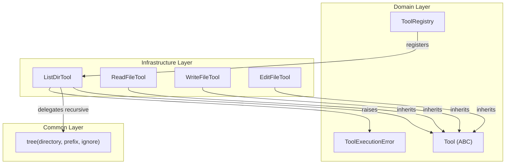

# Design Document: ListDirTool

## Overview

ListDirTool 是一个目录内容列举工具，继承自 `Tool` 抽象基类，为 LLM Agent 提供目录结构浏览能力。它作为基础设施层适配器，将公共层已有的 `tree()` 函数（递归模式）和内联实现的浅层列举逻辑（非递归模式）适配为标准 Tool 接口。

核心设计决策：
- **复用 `tree()` 函数**：递归模式直接委托给 `common/tools/common_tools.py` 中的 `tree()`，传入扩展后的 `IGNORE_DIRS` 集合作为 `ignore` 参数
- **内联非递归模式**：`tree()` 不支持非递归，因此在 `execute()` 中内联实现浅层列举，复用相同的排序规则（目录优先、大小写不敏感字母序）和噪声过滤逻辑
- **模块级 `IGNORE_DIRS`**：定义为 `frozenset`，包含 12 个常见噪声目录名，递归和非递归模式共用

## Architecture



ListDirTool 遵循与 ReadFileTool、WriteFileTool、EditFileTool 相同的适配器模式：
1. 继承 `Tool` ABC，实现 `name`、`description`、`parameters`、`execute`
2. 在 `execute()` 中委托给公共层函数（递归模式）或内联实现（非递归模式）
3. 将公共层的错误字符串（"错误：" 前缀）和 `PermissionError` 统一转换为 `ToolExecutionError`

## Components and Interfaces

### ListDirTool 类

文件位置：`epsilon-boot/src/infrastructure/tools/filesystem/list_dir_tool.py`

```python
# 模块级常量
IGNORE_DIRS: frozenset[str] = frozenset({
    ".git", "node_modules", "__pycache__", ".venv",
    ".idea", ".hypothesis", ".mypy_cache", ".pytest_cache",
    ".tox", ".eggs", ".svn", ".hg",
})

class ListDirTool(Tool):
    # Properties
    name -> "list_dir"
    description -> 目录内容列举功能描述
    parameters -> JSON Schema (directory_path: required string, recursive: optional boolean default true)

    # Methods
    async execute(**kwargs) -> str
```

### execute() 流程

```mermaid
flowchart TD
    A[接收 directory_path, recursive] --> B{Path 存在?}
    B -->|否| C[raise ToolExecutionError: 路径不存在]
    B -->|是| D{是目录?}
    D -->|否| E[raise ToolExecutionError: 不是目录]
    D -->|是| F{recursive?}
    F -->|true| G[调用 tree&#40;Path, ignore=IGNORE_DIRS&#41;]
    G --> H{结果以 '错误：' 开头?}
    H -->|是| I[raise ToolExecutionError]
    H -->|否| J[返回结果]
    F -->|false| K[内联浅层列举]
    K --> L[iterdir + 过滤 IGNORE_DIRS + 排序]
    L --> M[格式化 ├──/└── 输出]
    M --> J
```



### 非递归模式内联实现

非递归模式需要在 `execute()` 中内联实现，因为 `tree()` 不支持深度限制。实现逻辑：

1. `Path(directory_path).iterdir()` 获取直接子项
2. 过滤：排除 `entry.name in IGNORE_DIRS` 的条目
3. 排序：`sorted(entries, key=lambda p: (p.is_file(), p.name.lower()))`（与 `tree()` 一致：目录优先，大小写不敏感）
4. 格式化：最后一项用 `└── `，其余用 `├── `
5. `PermissionError` 捕获并转换为 `ToolExecutionError`

### 与现有工具的一致性

| 属性 | ReadFileTool | WriteFileTool | EditFileTool | ListDirTool |
|------|-------------|---------------|-------------|-------------|
| 公共层函数 | `read_file()` | `write_file()` | `edit_file()` | `tree()` |
| 错误字符串检测 | `startswith("错误：")` | `startswith("错误：")` | `startswith("错误：")` | `startswith("错误：")` |
| PermissionError | 捕获→ToolExecutionError | 捕获→ToolExecutionError | 捕获→ToolExecutionError | 捕获→ToolExecutionError |
| 前置校验 | offset/limit >= 1 | 无 | 无 | Path 存在 + 是目录 |

## Data Models

### 参数 JSON Schema

```json
{
    "type": "object",
    "properties": {
        "directory_path": {
            "type": "string",
            "description": "要列举的目标目录路径"
        },
        "recursive": {
            "type": "boolean",
            "description": "是否递归展示嵌套子目录结构（默认 true）",
            "default": true
        }
    },
    "required": ["directory_path"]
}
```

### IGNORE_DIRS 常量

```python
IGNORE_DIRS: frozenset[str] = frozenset({
    ".git", "node_modules", "__pycache__", ".venv",
    ".idea", ".hypothesis", ".mypy_cache", ".pytest_cache",
    ".tox", ".eggs", ".svn", ".hg",
})
```

### 输出格式

递归模式（委托 `tree()`）：
```
├── src
│   ├── main.py
│   └── utils.py
└── README.md
```

非递归模式（内联实现）：
```
├── src
├── tests
└── README.md
```


## Correctness Properties

*A property is a characteristic or behavior that should hold true across all valid executions of a system—essentially, a formal statement about what the system should do. Properties serve as the bridge between human-readable specifications and machine-verifiable correctness guarantees.*

### Property 1: Delegation consistency

*For any* valid directory structure, when `recursive` is true (or omitted), `ListDirTool.execute(directory_path=dir, recursive=True)` should produce output identical to calling `tree(Path(dir), ignore=IGNORE_DIRS)` directly.

**Validates: Requirements 1.1, 1.2, 5.2**

### Property 2: Idempotence

*For any* valid directory and any value of `recursive`, calling `ListDirTool.execute()` twice with the same parameters on an unchanged directory should produce identical results.

**Validates: Requirements 5.1**

### Property 3: Non-recursive shallow listing

*For any* directory containing immediate children (files and/or subdirectories), when `recursive` is false, the output should contain exactly the names of the immediate non-ignored children, each on a separate line prefixed with a tree connector (`├──` or `└──`), and no names from deeper levels should appear.

**Validates: Requirements 1.3, 4.1**

### Property 4: Noise filtering

*For any* directory structure containing noise-named subdirectories (from `IGNORE_DIRS`), none of those noise directory names should appear in the output, regardless of whether `recursive` is true or false.

**Validates: Requirements 1.4, 4.2**

### Property 5: Error propagation for invalid paths

*For any* path that either does not exist or points to a file (not a directory), `ListDirTool.execute()` should raise a `ToolExecutionError` whose message contains the path string.

**Validates: Requirements 3.1, 3.2, 3.4**

## Error Handling

| 场景 | 检测方式 | 处理 |
|------|---------|------|
| `directory_path` 不存在 | `Path.exists()` 返回 `False` | `raise ToolExecutionError(message=f"目录不存在: {directory_path}", tool_name="list_dir")` |
| `directory_path` 是文件 | `Path.is_dir()` 返回 `False` | `raise ToolExecutionError(message=f"路径不是目录: {directory_path}", tool_name="list_dir")` |
| `PermissionError` | `try/except PermissionError` | `raise ToolExecutionError(message=f"权限不足，无法访问目录: {directory_path}", tool_name="list_dir")` |
| `tree()` 返回错误字符串 | `result.startswith("错误：")` | `raise ToolExecutionError(message=result, tool_name="list_dir")` |

前置校验策略：在调用 `tree()` 或执行内联列举之前，先检查路径存在性和目录性。这样可以在递归和非递归两种模式下提供一致的错误行为，避免依赖 `tree()` 的错误字符串返回机制。

## Testing Strategy

### 测试框架与库

- **属性测试**：Hypothesis（已在项目中使用）
- **单元测试**：pytest + pytest-asyncio
- **测试文件位置**：`epsilon-boot/test/infrastructure/tools/filesystem/test_list_dir_tool_property.py`

### 属性测试（Property-Based Tests）

每个 Correctness Property 对应一个属性测试，使用 `@settings(max_examples=100, deadline=2000)` 配置。

测试策略：
- 使用 `tempfile.TemporaryDirectory()` 创建临时目录结构
- 使用 Hypothesis 策略生成随机目录名、文件名、嵌套深度
- 每个测试标注对应的 Property 编号

| 属性测试 | 对应 Property | 标签 |
|---------|--------------|------|
| `test_delegation_consistency` | Property 1 | Feature: list-dir-tool, Property 1: Delegation consistency |
| `test_idempotence` | Property 2 | Feature: list-dir-tool, Property 2: Idempotence |
| `test_non_recursive_shallow_listing` | Property 3 | Feature: list-dir-tool, Property 3: Non-recursive shallow listing |
| `test_noise_filtering` | Property 4 | Feature: list-dir-tool, Property 4: Noise filtering |
| `test_error_propagation` | Property 5 | Feature: list-dir-tool, Property 5: Error propagation for invalid paths |

### 单元测试（Unit Tests）

单元测试覆盖具体示例和边界情况，与属性测试互补：

- **Tool 接口合规性**：验证 `isinstance(ListDirTool(), Tool)`、`name == "list_dir"`、`parameters` schema 结构正确
- **ToolRegistry 集成**：注册后可通过 `ToolRegistry.execute()` 调用
- **PermissionError 处理**：使用 mock 或受限目录验证权限错误转换
- **纯噪声目录**：目录仅含 IGNORE_DIRS 中的子目录时，输出为空或无条目
- **空目录**：空目录返回空字符串
- **非递归排序**：验证目录优先、大小写不敏感字母序

### 属性测试要求

- 每个 Correctness Property 必须由单个属性测试实现
- 每个测试最少运行 100 次迭代
- 每个测试必须以注释标注对应的设计文档 Property
- 标签格式：`Feature: list-dir-tool, Property {number}: {property_text}`
