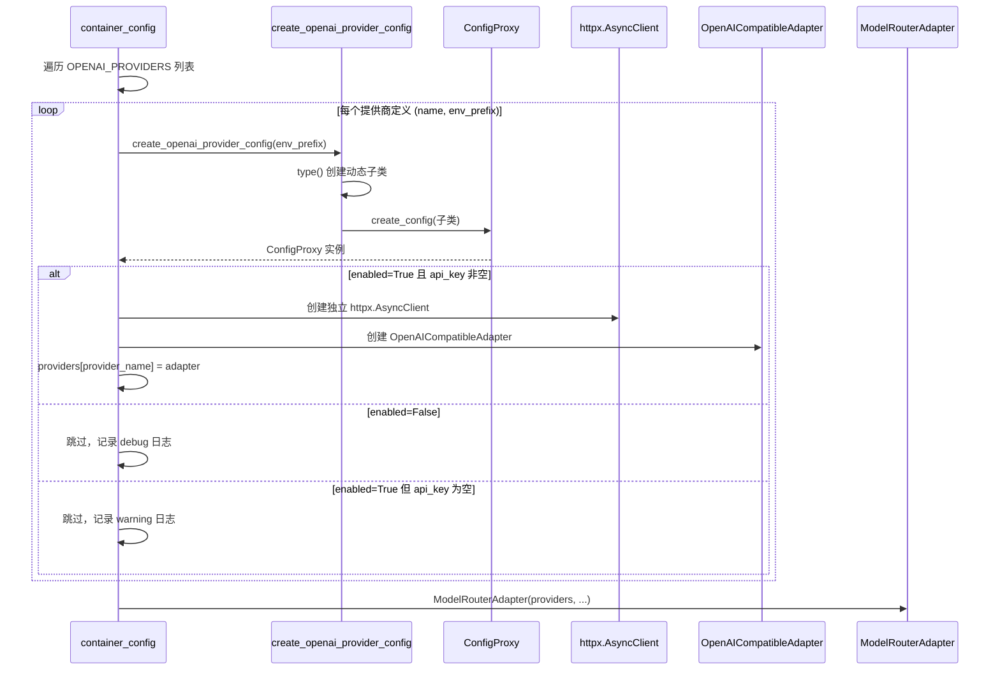
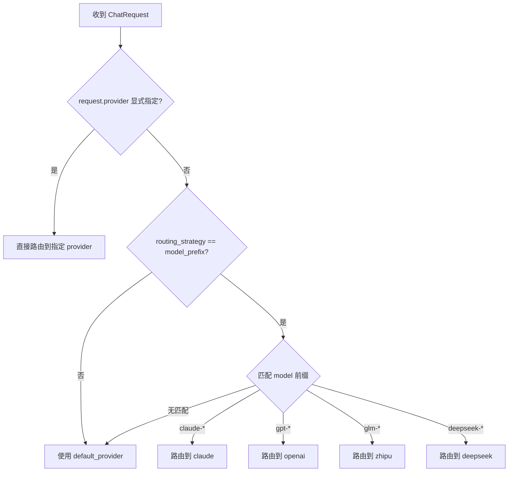

# 技术设计文档：多 OpenAI 兼容提供商支持（Multi OpenAI Provider）

## 概述

本设计将 `OpenAIProviderConfig` 从固定 `env_prefix` 的模块级单例转变为可复用的模板类，支持通过不同的 `env_prefix` 动态创建多个独立配置实例。核心技术挑战在于 pydantic-settings 的 `SettingsConfigDict(env_prefix=...)` 是类级属性，无法在实例化时动态修改。

解决方案：提供一个工厂函数 `create_openai_provider_config(env_prefix)`，内部通过 `type()` 动态创建 `OpenAIProviderConfig` 的子类，每个子类携带不同的 `model_config`（含不同 `env_prefix`），再通过 `create_config()` 创建支持热更新的代理实例。

设计目标：
- 支持同时注册多个 OpenAI 兼容提供商（智谱 AI、OpenAI、DeepSeek 等）
- 每个提供商拥有独立的配置、HTTP 客户端和适配器实例
- 完全向后兼容现有 `MODEL_OPENAI_` 前缀配置
- 保留热更新能力，运行时修改配置文件后自动感知变更
- 路由器无缝支持多个 OpenAI 兼容提供商的路由

## 架构

### 整体架构

```mermaid
graph TB
    subgraph "config.properties"
        CP1["MODEL_ZHIPU_*"]
        CP2["MODEL_OPENAI_*"]
        CP3["MODEL_DEEPSEEK_*"]
    end

    subgraph "common/configuration"
        Factory["create_openai_provider_config(env_prefix)"]
        CC["create_config() 工厂函数"]
        Proxy["ConfigProxy 热更新代理"]
    end

    subgraph "infrastructure/model_access"
        OPC["OpenAIProviderConfig 模板类"]
        Sub1["动态子类 (MODEL_ZHIPU_)"]
        Sub2["动态子类 (MODEL_OPENAI_)"]
        Sub3["动态子类 (MODEL_DEEPSEEK_)"]
    end

    subgraph "application/container_config"
        Registry["OPENAI_PROVIDERS 注册列表"]
        Init["_init_model_client() 循环初始化"]
        Adapters["providers: dict[str, ModelAccessPort]"]
    end

    subgraph "Router"
        RA["ModelRouterAdapter"]
        SP["_select_provider() 路由策略"]
    end

    Registry --> Factory
    Factory -->|type() 动态创建子类| Sub1
    Factory -->|type() 动态创建子类| Sub2
    Factory -->|type() 动态创建子类| Sub3
    Sub1 --> CC --> Proxy
    Sub2 --> CC --> Proxy
    Sub3 --> CC --> Proxy
    CP1 --> Sub1
    CP2 --> Sub2
    CP3 --> Sub3
    OPC -.->|继承| Sub1
    OPC -.->|继承| Sub2
    OPC -.->|继承| Sub3
    Init --> Adapters
    Adapters --> RA
    SP -->|model_prefix 策略| Adapters
```

### 初始化流程




### 路由器模型前缀匹配（改进后）



## 组件与接口

### 1. OpenAIProviderConfig 模板类（重构后）

移除模块级单例和硬编码 `env_prefix`，保留为纯模板类：

```python
# infrastructure/model_access/openai_config.py

class OpenAIProviderConfig(PropertiesBaseSettings):
    """OpenAI 兼容提供商配置模板类。
    
    不再直接实例化，而是通过 create_openai_provider_config() 工厂函数
    创建携带特定 env_prefix 的动态子类实例。
    
    保留所有配置字段及默认值不变。
    """
    hot_reload: ClassVar[bool] = True

    # 注意：不再设置 env_prefix，由工厂函数动态注入
    enabled: bool = True
    provider_name: str = "openai"
    api_base: str = "https://api.openai.com/v1"
    api_key: str = ""
    default_model: str = "gpt-4"
    temperature: float = 0.7
    max_tokens: int = 4096
    timeout: int = 30
    max_retries: int = 2
    max_connections: int = 100
    max_keepalive_connections: int = 20


def create_openai_provider_config(env_prefix: str) -> OpenAIProviderConfig:
    """根据指定的 env_prefix 创建 OpenAIProviderConfig 实例。
    
    内部通过 type() 动态创建子类，注入不同的 model_config，
    再通过 create_config() 创建支持热更新的代理实例。
    
    Args:
        env_prefix: 环境变量前缀，如 "MODEL_ZHIPU_"、"MODEL_OPENAI_"
        
    Returns:
        带热更新能力的 OpenAIProviderConfig 实例（实际为 ConfigProxy）
    """
```

### 2. 动态子类创建机制

核心技术方案——通过 `type()` 动态创建子类解决 pydantic-settings 的类级 `env_prefix` 限制：

```python
def create_openai_provider_config(env_prefix: str) -> OpenAIProviderConfig:
    # 动态创建子类，携带特定的 env_prefix
    dynamic_class = type(
        f"OpenAIProviderConfig_{env_prefix.strip('_')}",  # 类名如 OpenAIProviderConfig_MODEL_ZHIPU
        (OpenAIProviderConfig,),
        {
            "model_config": SettingsConfigDict(
                env_prefix=env_prefix,
                env_file=str(_ENV_FILE),
                env_file_encoding="utf-8",
                extra="ignore",
                frozen=True,
            ),
        },
    )
    return create_config(dynamic_class)
```

关键设计决策：
- 使用 `type()` 而非 `__init_subclass__` 或元类，因为 pydantic-settings 的 `model_config` 必须在类定义时确定
- 动态子类继承 `OpenAIProviderConfig` 的所有字段定义和默认值
- `model_config` 必须包含完整的 `SettingsConfigDict`（含 `env_file`、`frozen` 等），因为子类的 `model_config` 会完全覆盖父类的
- `create_config()` 检测到 `hot_reload=True`（继承自父类）后返回 `ConfigProxy`

### 3. 提供商注册列表（container_config.py）

在 `container_config.py` 中定义提供商注册列表，声明式配置所有 OpenAI 兼容提供商：

```python
# 提供商注册列表：(注册名称, env_prefix)
# 注册名称用于 provider_name 的兜底值和日志标识
OPENAI_PROVIDERS: list[tuple[str, str]] = [
    ("zhipu", "MODEL_ZHIPU_"),
    ("openai", "MODEL_OPENAI_"),
    ("deepseek", "MODEL_DEEPSEEK_"),
]
```

设计决策：
- 使用简单的元组列表而非复杂的注册表类，保持最小化
- `env_prefix` 决定从哪些配置项读取值
- 提供商的实际注册名称由配置中的 `provider_name` 字段决定（而非列表中的名称），列表中的名称仅用于日志

### 4. _init_model_client() 重构

从单一提供商初始化改为循环初始化多个提供商：

```python
# 模块级变量：提供商名称 → httpx.AsyncClient
_openai_http_clients: dict[str, httpx.AsyncClient] = {}
# 模块级变量：提供商名称 → ConfigProxy
_openai_configs: dict[str, OpenAIProviderConfig] = {}

async def _init_model_client() -> None:
    """初始化所有启用的模型 HTTP 客户端。
    
    遍历 OPENAI_PROVIDERS 列表，为每个启用且配置有效的提供商
    创建独立的 httpx.AsyncClient。
    """
    for registry_name, env_prefix in OPENAI_PROVIDERS:
        config = create_openai_provider_config(env_prefix)
        
        if not config.enabled:
            logger.debug("OpenAI 兼容提供商 %s 未启用，跳过", registry_name)
            continue
            
        if not config.api_key:
            logger.warning(
                "OpenAI 兼容提供商 %s 已启用但 api_key 为空，跳过初始化",
                registry_name,
            )
            continue
        
        try:
            client = httpx.AsyncClient(
                limits=httpx.Limits(
                    max_connections=config.max_connections,
                    max_keepalive_connections=config.max_keepalive_connections,
                ),
                timeout=httpx.Timeout(config.timeout),
            )
            provider_name = config.provider_name
            _openai_http_clients[provider_name] = client
            _openai_configs[provider_name] = config
            
            logger.info(
                "OpenAI compatible HTTP client initialized: provider=%s, base=%s, model=%s",
                provider_name, config.api_base, config.default_model,
            )
        except Exception:
            logger.error(
                "创建提供商 %s 的 HTTP 客户端失败，继续初始化其他提供商",
                registry_name, exc_info=True,
            )
    
    # Claude 客户端初始化保持不变...
```

### 5. _create_model_access_adapter() 重构

```python
def _create_model_access_adapter() -> ModelAccessPort:
    providers: dict[str, ModelAccessPort] = {}
    
    # 注册所有 OpenAI 兼容提供商
    for provider_name, client in _openai_http_clients.items():
        config = _openai_configs[provider_name]
        providers[provider_name] = OpenAICompatibleAdapter(
            client=client,
            api_base=config.api_base,
            api_key=config.api_key,
            default_model=config.default_model,
            default_temperature=config.temperature,
            default_max_tokens=config.max_tokens,
            timeout=config.timeout,
        )
        logger.info("OpenAI compatible provider registered: name=%s", provider_name)
    
    # Claude 适配器注册保持不变...
    
    return ModelRouterAdapter(
        providers=providers,
        routing_strategy=router_config.routing_strategy,
        default_provider=router_config.default_provider,
    )
```

### 6. _cleanup_model_client() 重构

```python
async def _cleanup_model_client() -> None:
    """关闭所有模型 HTTP 客户端。"""
    for provider_name, client in _openai_http_clients.items():
        await client.aclose()
        logger.info("OpenAI compatible HTTP client closed: provider=%s", provider_name)
    _openai_http_clients.clear()
    _openai_configs.clear()
    
    # Claude 客户端清理保持不变...
```

### 7. 路由器适配（router_adapter.py）

路由器本身无需修改核心逻辑。`_select_provider()` 中的 model_prefix 匹配已经支持多提供商查找。需要新增 `deepseek-` 前缀的匹配规则：

```python
# 在 _select_provider 的 model_prefix 策略中新增：
elif request.model.startswith("deepseek-"):
    if "deepseek" in self._providers:
        return "deepseek"
    logger.warning(
        "Model name suggests DeepSeek (%s) but DeepSeek provider not available, "
        "falling back to default",
        request.model,
    )
```

## 数据模型

### 提供商注册列表结构

```python
OPENAI_PROVIDERS: list[tuple[str, str]] = [
    # (注册名称, env_prefix)
    ("zhipu", "MODEL_ZHIPU_"),
    ("openai", "MODEL_OPENAI_"),
    ("deepseek", "MODEL_DEEPSEEK_"),
]
```

### 模块级状态变量

| 变量 | 类型 | 说明 |
|------|------|------|
| `_openai_http_clients` | `dict[str, httpx.AsyncClient]` | 提供商名称 → HTTP 客户端映射 |
| `_openai_configs` | `dict[str, OpenAIProviderConfig]` | 提供商名称 → 配置代理映射 |
| `_claude_http_client` | `httpx.AsyncClient \| None` | Claude HTTP 客户端（保持不变） |

### OpenAIProviderConfig 字段（不变）

| 字段 | 类型 | 默认值 | 说明 |
|------|------|--------|------|
| `enabled` | `bool` | `True` | 是否启用 |
| `provider_name` | `str` | `"openai"` | 提供商注册名称 |
| `api_base` | `str` | `"https://api.openai.com/v1"` | API 端点 |
| `api_key` | `str` | `""` | API 密钥 |
| `default_model` | `str` | `"gpt-4"` | 默认模型 |
| `temperature` | `float` | `0.7` | 温度参数 |
| `max_tokens` | `int` | `4096` | 最大 token 数 |
| `timeout` | `int` | `30` | 超时时间（秒） |
| `max_retries` | `int` | `2` | 最大重试次数 |
| `max_connections` | `int` | `100` | 连接池最大连接数 |
| `max_keepalive_connections` | `int` | `20` | 连接池最大保活连接数 |

### config.properties 多提供商配置示例

```properties
# 模型路由配置
MODEL_ROUTER_DEFAULT_PROVIDER=zhipu
MODEL_ROUTER_ROUTING_STRATEGY=model_prefix

# 智谱 AI（使用 MODEL_ZHIPU_ 前缀）
MODEL_ZHIPU_ENABLED=true
MODEL_ZHIPU_PROVIDER_NAME=zhipu
MODEL_ZHIPU_API_BASE=https://open.bigmodel.cn/api/paas/v4
MODEL_ZHIPU_API_KEY=your-zhipu-api-key
MODEL_ZHIPU_DEFAULT_MODEL=glm-4
MODEL_ZHIPU_TEMPERATURE=0.7
MODEL_ZHIPU_MAX_TOKENS=4096
MODEL_ZHIPU_TIMEOUT=30

# OpenAI 官方（使用 MODEL_OPENAI_ 前缀，向后兼容）
MODEL_OPENAI_ENABLED=true
MODEL_OPENAI_PROVIDER_NAME=openai
MODEL_OPENAI_API_BASE=https://api.openai.com/v1
MODEL_OPENAI_API_KEY=your-openai-api-key
MODEL_OPENAI_DEFAULT_MODEL=gpt-4
MODEL_OPENAI_TEMPERATURE=0.7
MODEL_OPENAI_MAX_TOKENS=4096
MODEL_OPENAI_TIMEOUT=30

# DeepSeek（使用 MODEL_DEEPSEEK_ 前缀）
MODEL_DEEPSEEK_ENABLED=false
MODEL_DEEPSEEK_PROVIDER_NAME=deepseek
MODEL_DEEPSEEK_API_BASE=https://api.deepseek.com/v1
MODEL_DEEPSEEK_API_KEY=
MODEL_DEEPSEEK_DEFAULT_MODEL=deepseek-chat
MODEL_DEEPSEEK_TEMPERATURE=0.7
MODEL_DEEPSEEK_MAX_TOKENS=4096
MODEL_DEEPSEEK_TIMEOUT=30

# Claude 提供商配置（保持不变）
MODEL_CLAUDE_ENABLED=false
MODEL_CLAUDE_API_BASE=https://api.anthropic.com
MODEL_CLAUDE_API_KEY=
MODEL_CLAUDE_DEFAULT_MODEL=claude-3-5-sonnet-20241022
```

### 向后兼容映射

现有 `MODEL_OPENAI_` 前缀配置继续生效。当前配置文件中 `MODEL_OPENAI_PROVIDER_NAME=zhipu` 的场景：

- 注册列表中 `("openai", "MODEL_OPENAI_")` 条目会读取现有配置
- `provider_name` 字段值为 `zhipu`，因此注册到 `providers["zhipu"]`
- 路由器的 `default_provider=zhipu` 和 `glm-` 前缀匹配均正常工作
- 行为与重构前完全一致

迁移到新前缀时，只需：
1. 在 config.properties 中添加 `MODEL_ZHIPU_*` 配置段
2. 将 `MODEL_OPENAI_*` 改回真正的 OpenAI 配置（或禁用）


## 正确性属性（Correctness Properties）

*正确性属性是系统在所有合法执行路径上都应保持为真的特征或行为——本质上是对系统行为的形式化陈述。属性是连接人类可读规格说明与机器可验证正确性保证之间的桥梁。*

以下属性基于需求文档中的验收标准推导而来，经过冗余消除和合并后，保留了 7 个独立的可测试属性。

### Property 1: 模板类字段完整性

*For any* `OpenAIProviderConfig` 的字段名，该字段在模板类中的默认值应与原始定义一致，且 `hot_reload` 类变量应为 `True`。通过 `create_openai_provider_config` 创建的动态子类实例也应保留所有字段及其默认值。

**Validates: Requirements 1.1, 7.1**

### Property 2: 配置隔离性

*For any* 两个不同的 `env_prefix` 值和对应的配置内容，通过 `create_openai_provider_config` 分别创建的两个实例应各自读取自己前缀的配置值，互不干扰。修改一个前缀的配置不应影响另一个前缀实例的值。

**Validates: Requirements 1.3, 1.4, 3.1, 3.2**

### Property 3: 提供商过滤逻辑

*For any* 提供商配置，当且仅当 `enabled=True` 且 `api_key` 非空时，该提供商应被初始化（创建 HTTP 客户端和适配器）。`enabled=False` 或 `api_key` 为空的提供商不应出现在最终的 Provider Registry 中。

**Validates: Requirements 2.3, 2.4, 2.5, 5.1**

### Property 4: 显式路由正确性

*For any* 已注册的提供商名称，当 `ChatRequest.provider` 显式指定该名称时，`ModelRouterAdapter._select_provider` 应返回该名称。当指定的名称不在已注册列表中时，应抛出 `ModelAccessError`。

**Validates: Requirements 4.2**

### Property 5: 模型前缀路由正确性

*For any* 模型名称，当路由策略为 `model_prefix` 且模型名称以已知前缀开头（如 `claude-`、`gpt-`、`glm-`、`deepseek-`）时，`_select_provider` 应返回对应的提供商名称（前提是该提供商已注册）。

**Validates: Requirements 4.3**

### Property 6: 客户端生命周期完整性

*For any* 已初始化的 HTTP 客户端集合，调用 `_cleanup_model_client` 后，所有客户端应被关闭，且客户端字典应被清空。

**Validates: Requirements 5.2**

### Property 7: 动态子类热更新

*For any* 通过 `create_openai_provider_config` 创建的配置实例，当对应的配置源文件被修改后，下一次属性访问应返回基于新文件内容的配置值（与 `ConfigProxy` 的热更新机制一致）。

**Validates: Requirements 7.2**

## 错误处理

### 提供商初始化失败

- 单个提供商的 HTTP 客户端创建失败时，捕获异常并记录 `error` 级别日志（含完整堆栈）
- 继续初始化其他提供商，保证部分可用
- 失败的提供商不会出现在 `_openai_http_clients` 和 `_openai_configs` 中

### api_key 为空

- `enabled=True` 但 `api_key` 为空时，记录 `warning` 级别日志
- 跳过该提供商的初始化，不创建 HTTP 客户端和适配器
- 不抛出异常，不影响其他提供商

### 路由失败

- 显式指定的 `provider` 不在已注册列表中时，抛出 `ModelAccessError`，包含可用提供商列表
- model_prefix 策略匹配到的提供商未注册时，记录 `warning` 日志并回退到默认提供商
- 默认提供商未注册时，抛出 `ModelAccessError`

### 配置热更新失败

- 动态子类的 `ConfigProxy` 刷新失败时，保留旧配置实例（继承自 `ConfigProxy` 的现有行为）
- 记录 `error` 级别日志，更新 mtime 防止重复刷新

### 客户端清理失败

- 单个客户端 `aclose()` 失败时，捕获异常并记录日志
- 继续清理其他客户端，确保资源尽可能释放

## 测试策略

### 测试框架

- 单元测试：`pytest`（项目已有）
- 属性测试：`hypothesis`（项目已有，`pyproject.toml` 中已声明 `hypothesis>=6.82.0`）
- 测试文件位置：`epsilon-boot/test/infrastructure/model_access/`

### 单元测试

单元测试覆盖具体示例、边界情况和集成点：

1. 向后兼容：使用现有 `MODEL_OPENAI_` 配置文件，验证单提供商场景行为一致（需求 6.1, 6.2, 6.3）
2. 容器初始化集成：验证 `_init_model_client` 正确遍历注册列表并创建实例（需求 2.2）
3. HTTP 客户端创建失败时继续初始化其他提供商（需求 5.3，边界情况）
4. `enabled=True` 但 `api_key` 为空时记录警告日志（需求 2.5，边界情况）
5. `deepseek-` 前缀路由到 deepseek 提供商（需求 4.3，新增前缀示例）
6. 路由器注册表包含多个 OpenAI 兼容提供商和 Claude 提供商（需求 4.1）

### 属性测试

每个正确性属性对应一个 `hypothesis` 属性测试，最少运行 100 次迭代：

1. **Feature: multi-openai-provider, Property 1: 模板类字段完整性**
   - 生成随机 env_prefix 字符串，验证动态子类保留所有字段和默认值

2. **Feature: multi-openai-provider, Property 2: 配置隔离性**
   - 生成两组随机配置值和不同的 env_prefix，写入临时 config.properties，验证两个实例各自读取正确的值

3. **Feature: multi-openai-provider, Property 3: 提供商过滤逻辑**
   - 生成随机的 enabled/api_key 组合列表，验证只有 enabled=True 且 api_key 非空的提供商被初始化

4. **Feature: multi-openai-provider, Property 4: 显式路由正确性**
   - 生成随机的提供商名称集合和请求 provider 值，验证路由结果

5. **Feature: multi-openai-provider, Property 5: 模型前缀路由正确性**
   - 生成随机的模型名称（带已知前缀），验证路由到正确的提供商

6. **Feature: multi-openai-provider, Property 6: 客户端生命周期完整性**
   - 生成随机数量的 mock 客户端，验证 cleanup 后全部关闭且字典清空

7. **Feature: multi-openai-provider, Property 7: 动态子类热更新**
   - 生成随机配置值，创建动态子类实例，修改临时配置文件，验证属性访问返回新值

### 属性测试配置

```python
from hypothesis import settings, given

@settings(max_examples=100)
@given(...)
def test_property_xxx(...):
    # Feature: multi-openai-provider, Property N: <property_text>
    ...
```

### 测试辅助

- 使用 `tmp_path` fixture 创建临时 config.properties 文件，避免污染真实配置
- 使用 `monkeypatch` 替换 `_ENV_FILE` 和 `_PROPERTIES_FILE` 路径指向临时文件
- 使用 `hypothesis.strategies` 生成随机字符串（env_prefix）、布尔值（enabled）、整数（端口等）
- 对 `httpx.AsyncClient` 使用 mock 对象验证创建和关闭调用
