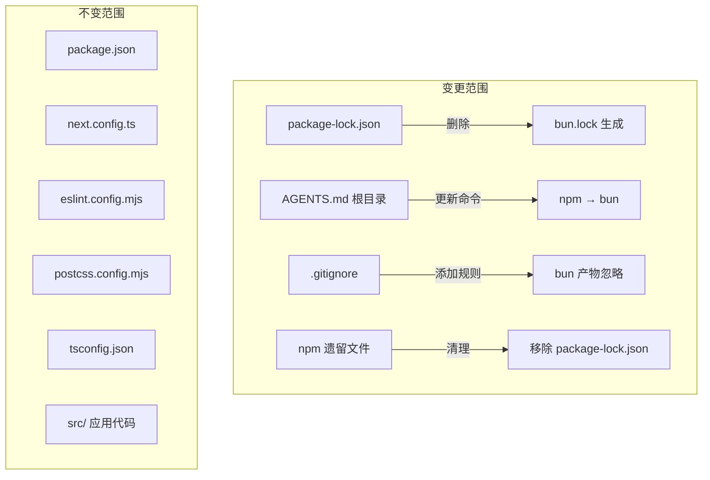

# 设计文档：npm 到 bun 迁移

## 概述

本设计文档描述将前端项目 `epsilon-client/` 的包管理器从 npm 迁移到 bun 的技术方案。这是一次配置层面的迁移，不涉及应用代码的架构变更。

迁移的核心动机是利用 bun 的高性能包管理能力（安装速度显著快于 npm），同时保持与现有 Next.js 16 + React 19 技术栈的完全兼容。

### 关键设计决策

1. **仅替换包管理器，不替换运行时**：项目继续使用 Node.js 运行 Next.js，bun 仅作为包管理器使用（`bun install` 替代 `npm install`）。这是因为 Next.js 16 的生产运行时对 bun runtime 的支持尚未完全成熟，而 bun 作为包管理器已经稳定可靠。
2. **保留 package.json 不变**：bun 完全复用 npm 的 `package.json` 格式，无需修改。
3. **锁文件格式切换**：从 `package-lock.json`（JSON 格式）切换到 `bun.lock`（bun 原生文本格式），后者需提交到版本控制。
4. **文档同步更新**：所有引用 npm 命令的文档需同步更新为 bun 命令。

## 架构

本次迁移不涉及应用架构变更。变更范围限定在项目配置和文档层面：



### 迁移步骤顺序

1. 删除 `package-lock.json`
2. 执行 `bun install` 生成 `bun.lock` 和 `node_modules/`
3. 更新根目录 `AGENTS.md` 中的前端命令
4. 更新 `epsilon-client/.gitignore` 添加 bun 相关规则
5. 验证 `bun run build`、`bun run lint`、`bun run dev` 正常工作
6. 清理残留的 npm 产物

## 组件与接口

本次迁移涉及的文件组件及其变更说明：

### 1. 锁文件替换

| 组件 | 操作 | 说明 |
|------|------|------|
| `epsilon-client/package-lock.json` | 删除 | npm 锁文件，迁移后不再需要 |
| `epsilon-client/bun.lock` | 新增 | 由 `bun install` 自动生成，需提交到 git |

### 2. 文档更新

| 组件 | 操作 | 说明 |
|------|------|------|
| `AGENTS.md`（根目录） | 修改 | 前端命令从 npm 替换为 bun |

具体命令映射：

| 原命令 | 新命令 |
|--------|--------|
| `cd epsilon-client && npm install` | `cd epsilon-client && bun install` |
| `cd epsilon-client && npm run dev` | `cd epsilon-client && bun run dev` |
| `cd epsilon-client && npm run lint` | `cd epsilon-client && bun run lint` |

### 3. .gitignore 更新

| 组件 | 操作 | 说明 |
|------|------|------|
| `epsilon-client/.gitignore` | 修改 | 添加 bun 调试日志忽略规则 |

新增规则：
```
# bun
bun-debug.log*
```

保留现有的 `npm-debug.log*` 规则作为历史兼容项。不添加 `bun.lock` 到忽略列表（锁文件需要版本控制）。

### 4. 兼容性验证

验证项目在 bun 包管理器下的完整工作流：

| 验证项 | 命令 | 预期结果 |
|--------|------|----------|
| 依赖安装 | `bun install` | 成功安装所有依赖，包括 next 16.2.0、react 19.2.4、lightningcss、tailwindcss v4 等 |
| 生产构建 | `bun run build` | Next.js 构建成功，无错误 |
| 代码检查 | `bun run lint` | ESLint 正常运行 |
| 开发服务器 | `bun run dev` | Next.js dev server 启动，rewrites 代理正常 |

### 5. 潜在兼容性风险点

- **lightningcss**：原生二进制依赖，bun 需要正确解析平台特定的 optional dependencies。bun 已支持此特性。
- **babel-plugin-react-compiler**：React 编译器插件，通过 `next.config.ts` 的 `reactCompiler: true` 启用，与包管理器无关。
- **@tailwindcss/postcss v4**：PostCSS 插件，通过 `postcss.config.mjs` 配置，与包管理器无关。
- **eslint 9 + eslint-config-next**：ESLint flat config 格式，与包管理器无关。

## 数据模型

本次迁移不涉及应用数据模型变更。唯一的"数据"变更是锁文件格式：

### 锁文件格式对比

**npm package-lock.json**（JSON 格式）：
- 存储完整的依赖树和精确版本
- 包含 `integrity` 哈希校验
- 文件体积较大

**bun bun.lock**（bun 原生文本格式）：
- 存储依赖解析结果和精确版本
- 使用 bun 自有的紧凑格式
- 文件体积更小，解析更快
- 需提交到版本控制以确保团队一致性


## 正确性属性

*属性（Property）是指在系统所有合法执行中都应成立的特征或行为——本质上是对系统应做什么的形式化陈述。属性是人类可读规格说明与机器可验证正确性保证之间的桥梁。*

本次迁移主要是配置变更，大部分验收标准属于特定的文件状态检查（示例测试），而非跨输入空间的通用属性。以下是从需求中提取的可测试属性：

### 属性 1：package.json 内容不变性

*对于任意* 合法的 `package.json` 文件，执行 `bun install` 后，`package.json` 的内容应与执行前完全一致（bun 不应修改 package.json）。

**验证需求：需求 1.3**

### 属性 2：后端命令不变性

*对于* `AGENTS.md` 中的所有后端相关命令行（包含 `uv` 的行），迁移更新后这些行的内容应与更新前完全一致。即文档更新操作仅影响前端命令，不影响后端命令。

**验证需求：需求 2.4**

## 错误处理

本次迁移的错误场景及处理策略：

### 1. bun install 失败

- **原因**：网络问题、平台不支持的原生依赖、bun 版本过低
- **处理**：检查 bun 版本（建议 >= 1.1），确认网络连通性，检查 lightningcss 等原生依赖的平台兼容性
- **回退方案**：保留 `package-lock.json` 的 git 历史，必要时可通过 `git checkout` 恢复并回退到 npm

### 2. bun run build 失败

- **原因**：依赖解析差异导致模块找不到、原生模块加载失败
- **处理**：对比 `bun install` 和 `npm install` 生成的 `node_modules/` 差异，检查是否有依赖缺失
- **回退方案**：删除 `bun.lock` 和 `node_modules/`，恢复 `package-lock.json`，执行 `npm install`

### 3. 团队成员误用 npm

- **原因**：习惯性执行 `npm install`，生成 `package-lock.json`
- **处理**：`bun.lock` 与 `package-lock.json` 共存不影响 bun 正常工作，但建议：
  - 在 `AGENTS.md` 中明确标注使用 bun
  - 可选：添加 `preinstall` 脚本检测包管理器（但本次迁移不强制要求）

### 4. .gitignore 规则冲突

- **原因**：误将 `bun.lock` 添加到忽略列表
- **处理**：验证 `bun.lock` 不在 `.gitignore` 中，确保锁文件被版本控制追踪

## 测试策略

### 测试方法

由于本次迁移是配置变更而非代码逻辑变更，测试策略以验证性检查为主：

### 单元测试（示例测试）

针对迁移后的文件状态进行具体验证：

1. **锁文件状态**：验证 `bun.lock` 存在且 `package-lock.json` 不存在（验证需求 1.1、1.2、5.1）
2. **AGENTS.md 命令更新**：验证前端命令已从 npm 替换为 bun（验证需求 2.1、2.2、2.3）
3. **.gitignore 规则**：验证包含 `bun-debug.log*` 规则且不忽略 `bun.lock`（验证需求 3.1、3.3）
4. **.npmrc 清理**：验证 `.npmrc` 文件不存在（验证需求 5.2）

### 属性测试

使用属性测试库验证迁移操作的通用正确性：

1. **属性 1 - package.json 不变性**：生成随机的 package.json 内容变体，验证 bun install 不修改文件内容
   - 标签：**Feature: npm-to-bun-migration, Property 1: package.json 内容不变性**
   - 最少 100 次迭代

2. **属性 2 - 后端命令不变性**：生成包含随机后端命令的 AGENTS.md 内容，执行前端命令替换后验证后端命令行不变
   - 标签：**Feature: npm-to-bun-migration, Property 2: 后端命令不变性**
   - 最少 100 次迭代

### 属性测试库选择

- 前端项目当前无测试框架，属性测试可使用 **fast-check**（TypeScript/JavaScript 属性测试库）
- 或者在后端测试中使用已有的 **hypothesis**（Python 属性测试库）编写验证脚本
- 每个正确性属性必须由单个属性测试实现
- 每个属性测试配置最少 100 次迭代

### 手动验证清单

以下验收标准需要手动验证（涉及实际运行时行为）：

- [ ] `bun install` 成功安装所有依赖（需求 4.1）
- [ ] `bun run build` 成功完成生产构建（需求 4.2）
- [ ] `bun run lint` 成功运行 ESLint（需求 4.3）
- [ ] `bun run dev` 成功启动开发服务器，rewrites 代理正常（需求 4.4）
- [ ] 误执行 `npm install` 不影响 bun 正常工作（需求 5.3）
