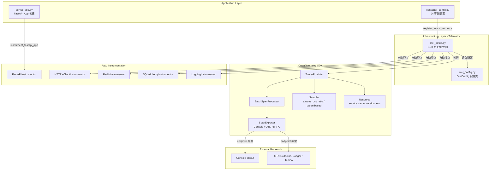
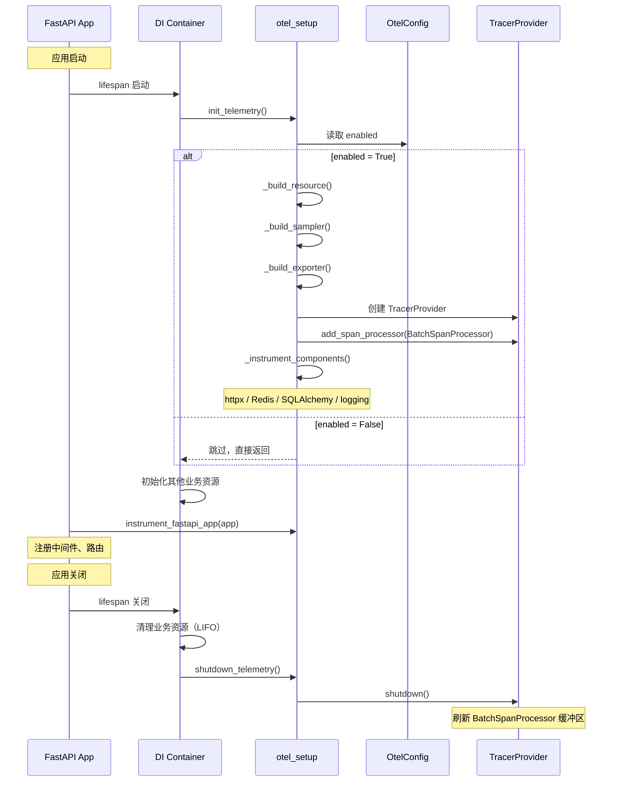

# 设计文档：OpenTelemetry 链路追踪

## 概述

本设计为项目引入 OpenTelemetry 分布式链路追踪能力，覆盖 HTTP 请求、数据库操作、Redis 访问、外部 HTTP 调用和日志关联等关键路径。

整体架构遵循项目 DDD 分层规范：
- **配置层**（`infrastructure/telemetry/otel_config.py`）：基于 `pydantic-settings` 的 `OtelConfig` 类，从 `OTEL_` 前缀环境变量加载配置
- **初始化层**（`infrastructure/telemetry/otel_setup.py`）：负责 TracerProvider、SpanExporter、Sampler 的创建，以及各组件的自动埋点
- **集成层**（`application/container_config.py` + `application/server_app.py`）：通过 DI 容器的 lifespan 机制管理 OTel 生命周期，FastAPI 埋点在 app 创建后、中间件注册前执行

设计目标：
1. **零侵入**：业务代码无需修改，所有埋点通过 auto-instrumentation 自动完成
2. **零开销**：`enabled=False` 时不初始化任何 OTel 组件，不引入运行时开销
3. **容错隔离**：各组件埋点独立执行，单个失败不影响其他组件和应用启动
4. **灵活配置**：通过环境变量控制启用状态、采样策略、导出目标和各组件开关

## 架构

### 整体架构图



### 生命周期时序图




## 组件与接口

### 1. OtelConfig（配置类）

**文件**：`infrastructure/telemetry/otel_config.py`

基于 `PropertiesBaseSettings` 的配置类，通过 `create_config` 工厂函数创建全局实例。所有配置项从 `OTEL_` 前缀的环境变量加载。

```python
class OtelConfig(PropertiesBaseSettings):
    model_config = SettingsConfigDict(env_prefix="OTEL_")

    enabled: bool = False
    service_name: str = "epsilon-boot"
    service_version: str = "0.1.0"
    environment: str = "development"
    exporter_endpoint: str = ""
    exporter_insecure: bool = True
    traces_sampler: str = "parentbased_traceidratio"
    traces_sampler_arg: float = 1.0
    log_correlation: bool = True
    instrument_fastapi: bool = True
    instrument_httpx: bool = True
    instrument_redis: bool = True
    instrument_sqlalchemy: bool = True
```

**设计决策**：
- 使用 `create_config(OtelConfig)` 创建实例，与项目其他配置类保持一致
- `enabled` 默认 `False`，确保未显式启用时零开销
- `exporter_endpoint` 为空时自动降级为 ConsoleSpanExporter，简化本地开发

### 2. otel_setup 模块（SDK 初始化/关闭）

**文件**：`infrastructure/telemetry/otel_setup.py`

提供以下核心函数：

| 函数 | 职责 | 调用时机 |
|------|------|----------|
| `init_telemetry()` | 初始化 TracerProvider、注册 SpanProcessor、执行自动埋点 | DI 容器 lifespan 启动阶段 |
| `shutdown_telemetry()` | 调用 TracerProvider.shutdown() 刷新缓冲区 | DI 容器 lifespan 关闭阶段 |
| `instrument_fastapi_app(app)` | 对 FastAPI 实例执行自动埋点 | server_app.py 中 app 创建后 |
| `_build_resource()` | 构建包含服务元数据的 Resource | init_telemetry 内部 |
| `_build_sampler()` | 根据配置选择采样策略 | init_telemetry 内部 |
| `_build_exporter()` | 根据 endpoint 选择 Console 或 OTLP 导出器 | init_telemetry 内部 |
| `_instrument_components()` | 对 httpx/Redis/SQLAlchemy/logging 执行自动埋点 | init_telemetry 内部 |

**设计决策**：
- `instrument_fastapi_app` 独立于 `_instrument_components`，因为 FastAPI 埋点需要 app 实例
- 使用模块级 `_tracer_provider` 变量持有引用，`shutdown_telemetry` 中释放
- 各组件埋点用独立的 try/except 包裹，失败记录 warning 日志并继续

### 3. DI 容器集成

**文件**：`application/container_config.py`

```python
def configure_container() -> None:
    # Telemetry 最先注册，确保后续资源初始化也能被追踪
    container.register_async_resource("telemetry", init_telemetry, shutdown_telemetry)
    # ... 其他资源
```

**设计决策**：
- Telemetry 作为第一个异步资源注册，保证初始化顺序最先
- 容器 LIFO 清理机制保证 Telemetry 最后关闭，业务资源清理过程中的 span 也能被导出

### 4. FastAPI 集成

**文件**：`application/server_app.py`

```python
app = FastAPI(lifespan=container.lifespan)
instrument_fastapi_app(app)  # 在中间件注册前执行
app.add_middleware(RequestLoggingMiddleware)
```

**设计决策**：
- FastAPI 埋点在中间件注册前执行，确保 OTel 的 span 覆盖所有请求处理流程
- `instrument_fastapi_app` 内部检查 `enabled` 和 `instrument_fastapi` 开关，未启用时直接返回

### 5. 采样器构建逻辑

`_build_sampler()` 根据 `traces_sampler` 配置值选择采样策略：

| 配置值 | 采样器类型 | 说明 |
|--------|-----------|------|
| `always_on` | `ALWAYS_ON` | 全量采样 |
| `always_off` | `ALWAYS_OFF` | 关闭采样 |
| `traceidratio` | `TraceIdRatioBased(ratio)` | 按比例采样 |
| 其他（含 `parentbased_traceidratio`） | `ParentBasedTraceIdRatio(ratio)` | 基于父 span 的比例采样（默认） |

**设计决策**：
- 未匹配的配置值默认使用 `parentbased_traceidratio`，避免配置错误导致无采样
- `traces_sampler_arg` 默认 `1.0`（100%），开发环境全量采样

### 6. 导出器构建逻辑

`_build_exporter()` 根据 `exporter_endpoint` 选择导出器：

| 条件 | 导出器 | 协议 |
|------|--------|------|
| `exporter_endpoint` 为空 | `ConsoleSpanExporter` | stdout |
| `exporter_endpoint` 非空 | `OTLPSpanExporter` | gRPC |

**设计决策**：
- OTLP 导出器使用延迟导入（`from ... import OTLPSpanExporter`），避免未配置时加载 gRPC 依赖
- `exporter_insecure` 控制 TLS，本地开发默认 `True`


## 数据模型

### OtelConfig 配置字段

| 字段名 | 类型 | 默认值 | 环境变量 | 说明 |
|--------|------|--------|----------|------|
| `enabled` | `bool` | `False` | `OTEL_ENABLED` | OTel 整体开关 |
| `service_name` | `str` | `"epsilon-boot"` | `OTEL_SERVICE_NAME` | 服务标识名 |
| `service_version` | `str` | `"0.1.0"` | `OTEL_SERVICE_VERSION` | 服务版本号 |
| `environment` | `str` | `"development"` | `OTEL_ENVIRONMENT` | 部署环境 |
| `exporter_endpoint` | `str` | `""` | `OTEL_EXPORTER_ENDPOINT` | OTLP 导出端点 |
| `exporter_insecure` | `bool` | `True` | `OTEL_EXPORTER_INSECURE` | gRPC 非安全模式 |
| `traces_sampler` | `str` | `"parentbased_traceidratio"` | `OTEL_TRACES_SAMPLER` | 采样策略 |
| `traces_sampler_arg` | `float` | `1.0` | `OTEL_TRACES_SAMPLER_ARG` | 采样比例 |
| `log_correlation` | `bool` | `True` | `OTEL_LOG_CORRELATION` | 日志关联开关 |
| `instrument_fastapi` | `bool` | `True` | `OTEL_INSTRUMENT_FASTAPI` | FastAPI 埋点开关 |
| `instrument_httpx` | `bool` | `True` | `OTEL_INSTRUMENT_HTTPX` | httpx 埋点开关 |
| `instrument_redis` | `bool` | `True` | `OTEL_INSTRUMENT_REDIS` | Redis 埋点开关 |
| `instrument_sqlalchemy` | `bool` | `True` | `OTEL_INSTRUMENT_SQLALCHEMY` | SQLAlchemy 埋点开关 |

### Resource 元数据

TracerProvider 初始化时创建的 Resource 包含以下属性：

| 属性键 | 来源 | 说明 |
|--------|------|------|
| `service.name` | `otel_config.service_name` | 服务名称 |
| `service.version` | `otel_config.service_version` | 服务版本 |
| `deployment.environment` | `otel_config.environment` | 部署环境 |

### 采样器配置映射

| `traces_sampler` 值 | SDK 采样器 | `traces_sampler_arg` 用途 |
|---------------------|-----------|--------------------------|
| `"always_on"` | `ALWAYS_ON` | 忽略 |
| `"always_off"` | `ALWAYS_OFF` | 忽略 |
| `"traceidratio"` | `TraceIdRatioBased` | 采样比例 (0.0~1.0) |
| `"parentbased_traceidratio"` | `ParentBasedTraceIdRatio` | 根采样比例 (0.0~1.0) |

### 日志格式扩展

启用 `log_correlation` 后，日志格式中可使用以下占位符：

| 占位符 | 说明 | OTel 未启用时的值 |
|--------|------|-------------------|
| `%(otelTraceID)s` | 当前请求的 trace ID | 空字符串或 `0` |
| `%(otelSpanID)s` | 当前 span ID | 空字符串或 `0` |


## 正确性属性（Correctness Properties）

*正确性属性是指在系统所有合法执行路径中都应成立的特征或行为——本质上是对系统应做什么的形式化陈述。属性是连接人类可读规格说明与机器可验证正确性保证之间的桥梁。*

### Property 1: 配置环境变量加载往返一致性

*对于任意* 合法的配置字段名和对应的字符串值，将其设置为 `OTEL_` 前缀的环境变量后创建 `OtelConfig` 实例，读取该字段的值应与设置的值（经类型转换后）一致。

**Validates: Requirements 1.1**

### Property 2: Resource 包含配置的服务元数据

*对于任意* `service_name`、`service_version` 和 `environment` 字符串值，`_build_resource()` 构建的 Resource 应包含 `service.name`、`service.version` 和 `deployment.environment` 属性，且值分别等于配置中的对应字段。

**Validates: Requirements 2.3**

### Property 3: 采样器选择映射正确性

*对于任意* 已知的采样器名称（`"always_on"`、`"always_off"`、`"traceidratio"`、`"parentbased_traceidratio"`）和任意合法的采样比例值（0.0 ~ 1.0），`_build_sampler()` 应返回与该名称对应的正确采样器类型实例。

**Validates: Requirements 3.1, 3.2, 3.3, 3.4**

### Property 4: 未知采样器名称默认回退

*对于任意* 不属于已知采样器名称集合（`"always_on"`、`"always_off"`、`"traceidratio"`、`"parentbased_traceidratio"`）的字符串，`_build_sampler()` 应返回 `ParentBasedTraceIdRatio` 实例。

**Validates: Requirements 3.5**

### Property 5: 非空 endpoint 产生 OTLP 导出器

*对于任意* 非空的 `exporter_endpoint` 字符串和任意 `exporter_insecure` 布尔值，`_build_exporter()` 应返回 `OTLPSpanExporter` 实例，且其 endpoint 和 insecure 配置与输入一致。

**Validates: Requirements 4.2, 4.3**

### Property 6: 组件埋点故障隔离

*对于任意* 组件子集（httpx、Redis、SQLAlchemy、logging 中的任意组合），若该子集中的组件在埋点过程中抛出异常，则不在该子集中的其他组件仍应被正常埋点。

**Validates: Requirements 10.2, 5.4, 6.3, 7.3, 8.3, 9.4**


## 错误处理

### 组件埋点异常

每个组件的自动埋点操作都包裹在独立的 `try/except` 块中：

```python
if otel_config.instrument_httpx:
    try:
        HTTPXClientInstrumentor().instrument()
    except Exception:
        logger.warning("httpx 自动埋点失败，跳过", exc_info=True)
```

**策略**：
- 捕获所有异常（`Exception`），不限制异常类型
- 记录包含完整堆栈的 `warning` 级别日志（`exc_info=True`）
- 继续执行后续组件的埋点，不中断启动流程
- FastAPI 埋点（`instrument_fastapi_app`）同样遵循此策略

### TracerProvider 初始化异常

`init_telemetry()` 作为 DI 容器的异步资源，初始化失败时由容器的 fail-fast 机制处理：
- 容器会逆序回滚已成功初始化的资源
- 重新抛出异常，阻止应用启动
- 这是预期行为：如果 TracerProvider 创建失败（如 SDK 版本不兼容），应阻止启动而非静默忽略

### TracerProvider 关闭异常

`shutdown_telemetry()` 中 `_tracer_provider.shutdown()` 可能抛出异常：
- 由容器的 best-effort 清理机制处理
- 记录异常日志但继续清理其他资源
- 确保不因 OTel 关闭失败而影响其他资源的释放

### 配置加载异常

`OtelConfig` 基于 `pydantic-settings`，配置值类型不匹配时会在实例化阶段抛出 `ValidationError`：
- 例如 `OTEL_ENABLED=abc`（非布尔值）或 `OTEL_TRACES_SAMPLER_ARG=xyz`（非浮点数）
- 异常在应用启动时立即暴露，避免运行时出现意外行为

## 测试策略

### 属性测试（Property-Based Testing）

使用 `hypothesis` 库实现属性测试，每个属性测试至少运行 100 次迭代。

每个测试用注释标注对应的设计属性：

```python
# Feature: opentelemetry-tracing, Property 1: 配置环境变量加载往返一致性
@given(st.text(min_size=1, max_size=50))
def test_config_env_var_round_trip(value: str):
    ...
```

属性测试覆盖：

| 属性 | 测试内容 | 生成策略 |
|------|----------|----------|
| Property 1 | 环境变量 → OtelConfig 字段值往返 | 随机字符串/布尔/浮点值 |
| Property 2 | Resource 包含配置元数据 | 随机 service_name/version/environment |
| Property 3 | 采样器名称 → 采样器类型映射 | 已知名称 × 随机比例 [0.0, 1.0] |
| Property 4 | 未知名称默认回退 | 排除已知名称的随机字符串 |
| Property 5 | 非空 endpoint → OTLP 导出器 | 随机非空字符串 × 随机布尔值 |
| Property 6 | 组件埋点故障隔离 | 随机选择失败组件子集 |

### 单元测试

单元测试覆盖属性测试不适合的具体场景：

| 测试场景 | 验证内容 | 对应需求 |
|----------|----------|----------|
| 默认配置值 | 所有字段的默认值正确 | 1.2 ~ 1.9 |
| enabled=False 跳过初始化 | init_telemetry 不创建 TracerProvider | 2.2, 11.1, 11.2 |
| enabled=True 完成初始化 | TracerProvider 被创建并设为全局 | 2.1 |
| BatchSpanProcessor 使用 | TracerProvider 使用 BatchSpanProcessor | 2.4 |
| shutdown 刷新缓冲区 | shutdown_telemetry 调用 provider.shutdown() | 2.5 |
| 空 endpoint 使用 Console | _build_exporter 返回 ConsoleSpanExporter | 4.1 |
| FastAPI 埋点条件 | enabled + instrument_fastapi 双开关控制 | 5.1 |
| 各组件埋点条件 | 各 instrument_* 开关独立控制 | 6.1, 7.1, 8.1, 9.1 |
| 容器注册顺序 | telemetry 是第一个注册的异步资源 | 2.6, 2.7 |
| OTel 未启用时日志默认值 | otelTraceID/otelSpanID 为空或 0 | 9.3 |

### 测试配置

- 属性测试库：`hypothesis`（已在 `pyproject.toml` 中声明）
- 测试框架：`pytest` + `pytest-asyncio`
- 每个属性测试最少 100 次迭代（`@settings(max_examples=100)`）
- 测试文件位置：`test/infrastructure/telemetry/`
- 使用 `monkeypatch` 设置环境变量，避免污染测试环境
- 使用 `unittest.mock.patch` 模拟各 Instrumentor 的行为

