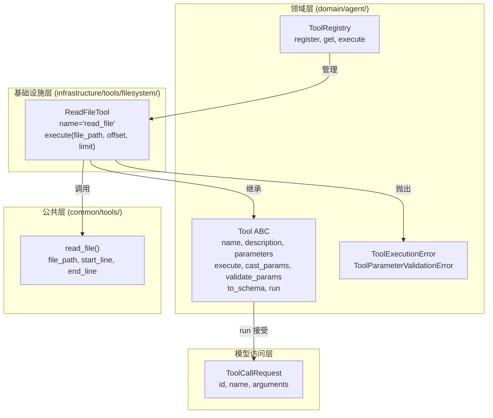
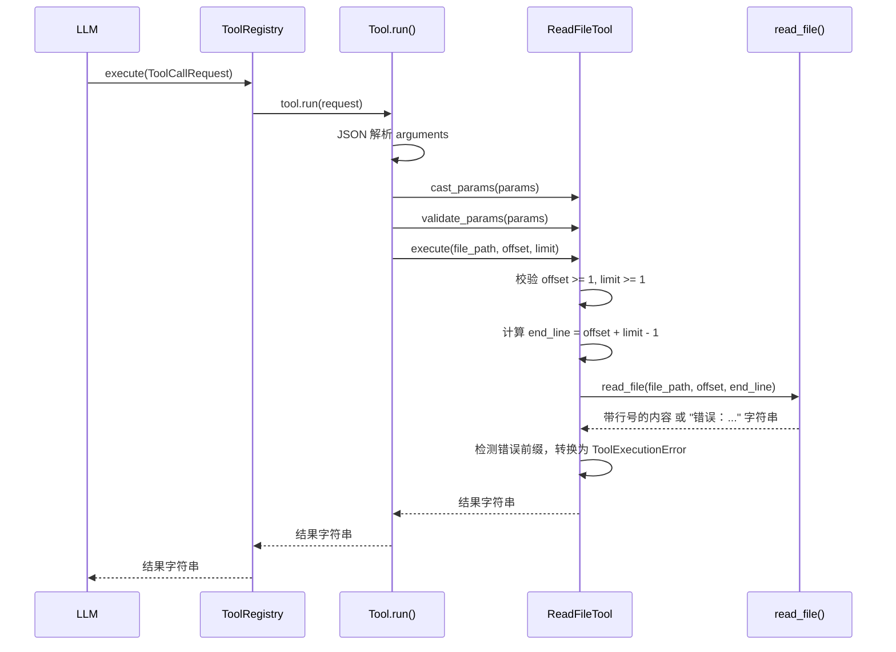

# Design Document: ReadFileTool

## Overview

ReadFileTool 是一个继承自 `Tool` 抽象基类的具体工具实现，为 LLM Agent 提供文件内容读取能力。该工具位于基础设施层 `infrastructure/tools/filesystem/read_file_tool.py`，遵循 DDD 六边形架构：领域层 `Tool` ABC 定义端口接口，ReadFileTool 作为适配器实现。

工具底层复用 `common/tools/common_tools.py` 中已有的 `read_file()` 函数，将其适配为 Tool 接口规范。支持通过 `offset`（起始行号）和 `limit`（读取行数）参数对大文件进行分页读取，返回带行号前缀的文件内容。

### 设计决策

1. **复用 `read_file()` 而非重新实现**：`common_tools.read_file()` 已处理文件读取、行号格式化、编码检测等逻辑，ReadFileTool 仅需做参数适配（offset/limit → start_line/end_line）和错误转换（字符串错误 → ToolExecutionError）。
2. **offset/limit 而非 start_line/end_line**：对 LLM 更友好的分页语义，offset 表示"从第几行开始"，limit 表示"读多少行"，避免 LLM 需要计算 end_line。
3. **错误检测策略**：`read_file()` 返回以 `"错误："` 开头的字符串表示失败，ReadFileTool 检测此前缀并转换为 `ToolExecutionError`，保持 Tool 流水线的异常语义一致。

## Architecture



### 调用流程



## Components and Interfaces

### ReadFileTool 类

```python
class ReadFileTool(Tool):
    """文件内容读取工具，支持分页读取。"""

    @property
    def name(self) -> str:
        """返回 'read_file'。"""

    @property
    def description(self) -> str:
        """返回中文功能描述。"""

    @property
    def parameters(self) -> dict[str, Any]:
        """返回 JSON Schema 参数定义。"""

    async def execute(self, file_path: str, offset: int = 1, limit: int = 200) -> str:
        """执行文件读取。

        1. 校验 offset >= 1 且 limit >= 1
        2. 计算 end_line = offset + limit - 1
        3. 调用 read_file(file_path, offset, end_line)
        4. 检测返回值是否以 "错误：" 开头
        5. 若是错误则抛出 ToolExecutionError，否则返回内容
        """
```

### 参数 Schema

```json
{
  "type": "object",
  "properties": {
    "file_path": {
      "type": "string",
      "description": "要读取的文件路径"
    },
    "offset": {
      "type": "integer",
      "description": "起始行号（从 1 开始），默认为 1",
      "default": 1
    },
    "limit": {
      "type": "integer",
      "description": "最多读取的行数，默认为 200",
      "default": 200
    }
  },
  "required": ["file_path"]
}
```

### 依赖关系

| 组件 | 依赖 | 说明 |
|------|------|------|
| ReadFileTool | Tool ABC | 继承抽象基类 |
| ReadFileTool | read_file() | 复用文件读取逻辑 |
| ReadFileTool | ToolExecutionError | 错误转换目标异常 |

## Data Models

### 参数模型

| 参数 | 类型 | 必填 | 默认值 | 约束 | 说明 |
|------|------|------|--------|------|------|
| file_path | string | 是 | - | 非空 | 文件路径 |
| offset | integer | 否 | 1 | >= 1 | 起始行号 |
| limit | integer | 否 | 200 | >= 1 | 最多读取行数 |

### offset/limit 到 start_line/end_line 的映射

```
start_line = offset
end_line = offset + limit - 1
```

示例：`offset=5, limit=10` → `start_line=5, end_line=14`（读取第 5~14 行，共 10 行）

### 返回值格式

成功时返回带行号前缀的文件内容字符串，格式与 `read_file()` 一致：

```
   1 | first line content
   2 | second line content
   3 | third line content
```


## Correctness Properties

*A property is a characteristic or behavior that should hold true across all valid executions of a system — essentially, a formal statement about what the system should do. Properties serve as the bridge between human-readable specifications and machine-verifiable correctness guarantees.*

### Property 1: Delegation consistency

*For any* valid file path, any offset >= 1, and any limit >= 1, the output of `ReadFileTool.execute(file_path, offset, limit)` should be identical to `read_file(file_path, start_line=offset, end_line=offset + limit - 1)`.

This property verifies that ReadFileTool correctly delegates to the underlying `read_file()` utility with proper parameter mapping. Since `read_file()` already handles line numbering, encoding, and range selection, this property ensures the adapter layer introduces no distortion.

**Validates: Requirements 2.2, 2.3, 2.4, 2.5**

### Property 2: Invalid parameter rejection

*For any* integer offset < 1 or any integer limit < 1, calling `ReadFileTool.execute()` should raise `ToolExecutionError`. The error message should indicate which parameter is invalid.

**Validates: Requirements 4.1, 4.2**

### Property 3: Read idempotence

*For any* valid file path, any offset >= 1, and any limit >= 1, calling `ReadFileTool.execute(file_path, offset, limit)` twice consecutively on the same unmodified file should return identical results.

**Validates: Requirements 6.1**

### Property 4: Pagination consistency

*For any* valid file and any page size (limit) >= 1, reading the file page by page (offset=1, offset=1+limit, offset=1+2*limit, ...) and concatenating the results (joined by newline) should produce the same content as reading the entire file in one call with a sufficiently large limit.

**Validates: Requirements 6.2**

### Property 5: Non-existent file raises error

*For any* file path that does not exist on the filesystem, calling `ReadFileTool.execute(file_path)` should raise `ToolExecutionError`, and the error message should contain the file path string.

**Validates: Requirements 3.1**

## Error Handling

ReadFileTool 的错误处理分为两层：

### 1. 参数校验层（execute 方法入口）

在调用 `read_file()` 之前，`execute` 方法先校验 offset 和 limit 的合法性：

| 条件 | 异常 | 错误信息 |
|------|------|----------|
| offset < 1 | ToolExecutionError | "offset 必须大于等于 1，当前值: {offset}" |
| limit < 1 | ToolExecutionError | "limit 必须大于等于 1，当前值: {limit}" |

### 2. 文件读取层（read_file 返回值检测）

`read_file()` 函数通过返回以 `"错误："` 开头的字符串来表示失败。ReadFileTool 检测此前缀并转换为 `ToolExecutionError`：

| read_file 返回值前缀 | 对应场景 | ToolExecutionError 信息 |
|----------------------|----------|------------------------|
| `"错误：文件不存在"` | 文件不存在 | 原始错误信息 |
| `"错误：路径不是文件"` | 路径是目录 | 原始错误信息 |
| `"错误：无法以文本方式读取"` | 二进制文件 | 原始错误信息 |

### 3. Tool.run() 流水线层

`Tool.run()` 基类方法已处理：
- JSON 解析失败 → `ToolParameterValidationError`
- 类型不匹配 → `ToolParameterValidationError`
- 必填参数缺失 → `ToolParameterValidationError`
- execute 中未捕获的异常 → 包装为 `ToolExecutionError`

### 权限错误处理

`read_file()` 函数中 `Path.read_text()` 可能抛出 `PermissionError`，但当前 `read_file()` 未捕获此异常。ReadFileTool 的 `execute` 方法应捕获 `PermissionError` 并转换为 `ToolExecutionError`，错误信息说明权限不足。

## Testing Strategy

### 测试框架与工具

- **单元测试**: pytest + pytest-asyncio
- **属性测试**: Hypothesis（项目已使用）
- **测试位置**: `epsilon-boot/test/infrastructure/tools/filesystem/`

### 属性测试（Property-Based Tests）

使用 Hypothesis 库，每个属性测试运行至少 100 次迭代。每个测试通过注释标注对应的设计属性。

**Hypothesis 策略设计**：
- 文件内容策略：生成随机行数（1~500 行）、随机内容的文本文件（使用 `tmp_path` fixture）
- offset 策略：`st.integers(min_value=1, max_value=文件行数)`
- limit 策略：`st.integers(min_value=1, max_value=500)`
- 无效参数策略：`st.integers(max_value=0)` 用于 offset < 1 和 limit < 1
- 文件路径策略：基于 `tmp_path` 生成不存在的路径

**属性测试清单**：

| 属性 | 标签 | 说明 |
|------|------|------|
| Property 1 | Feature: read-file-tool, Property 1: Delegation consistency | 验证 execute 输出与 read_file() 一致 |
| Property 2 | Feature: read-file-tool, Property 2: Invalid parameter rejection | 验证无效 offset/limit 抛出 ToolExecutionError |
| Property 3 | Feature: read-file-tool, Property 3: Read idempotence | 验证相同参数两次调用结果一致 |
| Property 4 | Feature: read-file-tool, Property 4: Pagination consistency | 验证分页拼接等于全量读取 |
| Property 5 | Feature: read-file-tool, Property 5: Non-existent file raises error | 验证不存在文件抛出 ToolExecutionError |

### 单元测试（Unit Tests）

单元测试覆盖具体示例和边界情况，与属性测试互补：

| 测试场景 | 说明 |
|----------|------|
| 基本定义验证 | name == "read_file"、description 非空中文、parameters schema 结构正确 |
| to_schema 格式 | 返回 OpenAI function calling 格式，name 为 "read_file" |
| 默认参数 | 仅传 file_path 时使用 offset=1, limit=200 |
| ToolRegistry 集成 | register 后通过 ToolCallRequest 调用成功 |
| 目录路径错误 | 传入目录路径时抛出 ToolExecutionError |
| 二进制文件错误 | 传入二进制文件时抛出 ToolExecutionError |
| 权限不足错误 | 无读取权限时抛出 ToolExecutionError |
| offset 超出文件行数 | 返回空内容（read_file 的行为） |

### 测试配置

```python
@settings(max_examples=100, deadline=2000)
```

每个属性测试类以 `Test` 前缀命名，方法以 `test_` 前缀命名，遵循项目现有的 Hypothesis 测试模式（参考 `test_database_event_store_adapter_property.py`）。
