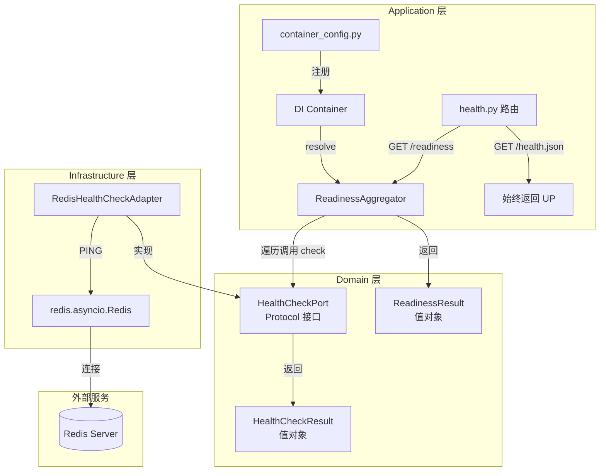

# 技术设计文档：Readiness Probe（就绪探针）

## 概述

本设计为 epsilon-boot 应用新增 Readiness Probe 能力。当前应用仅有 `/health.json` 存活探针（始终返回 `{"status": "UP"}`），无法反映外部依赖（如 Redis）的实际可用性。

本设计在现有 DDD 分层架构上扩展：
- **Domain 层**：定义 `HealthCheckPort`（Protocol）声明健康检查抽象能力，定义 `HealthCheckResult` 值对象表示检查结果，实现 `ReadinessAggregator` 聚合多个检查结果
- **Infrastructure 层**：实现 `RedisHealthCheckAdapter`，通过 Redis `PING` 命令检测连通性
- **Application 层**：在 `health.py` 路由中新增 `GET /readiness` 端点，通过 DI 容器获取聚合器并执行检查
- **Common 层**：复用现有 DI 容器和配置机制

### 设计决策

| 决策 | 选择 | 理由 |
|------|------|------|
| 聚合器位置 | Domain 层 | 聚合逻辑是纯业务规则（全 UP → UP，任一 DOWN → DOWN），不依赖基础设施 |
| 多检查实例注入 | 注册工厂函数返回 `ReadinessAggregator` | 容器不支持同类型多绑定，通过工厂函数在内部组装检查列表，保持容器 API 不变 |
| 超时控制 | Redis 客户端 `socket_timeout` + `asyncio.wait_for` | 双重保障：客户端级超时防止底层阻塞，应用级超时确保 3 秒内返回 |
| 响应格式 | `{"status": "UP/DOWN", "checks": {"redis": {"status": "UP/DOWN", "reason": "..."}}}` | 与 Spring Boot Actuator 风格一致，运维友好 |
| 现有端点 | 不修改 `/health.json` | 保持向后兼容，存活探针与就绪探针职责分离 |

## 架构

### 分层架构图



### 依赖方向

```
Application → Domain（ReadinessAggregator, HealthCheckPort）
Infrastructure → Domain（实现 HealthCheckPort）
Application → Infrastructure（container_config 中组装 Adapter）
```

Domain 层不依赖 Infrastructure 层和 Application 层，依赖方向严格单向。

## 组件与接口

### 1. Domain 层：HealthCheckResult 值对象

文件路径：`src/domain/health/value_objects.py`（新建）

```python
"""健康检查领域值对象。

定义健康检查结果的不可变数据结构。
"""

from dataclasses import dataclass
from enum import Enum


class HealthStatus(Enum):
    """健康状态枚举。"""
    UP = "UP"
    DOWN = "DOWN"


@dataclass(frozen=True)
class HealthCheckResult:
    """单个依赖的健康检查结果。

    Attributes:
        name: 依赖名称，如 "redis"
        status: 健康状态，UP 或 DOWN
        reason: 失败原因，仅在 status 为 DOWN 时有值
    """
    name: str
    status: HealthStatus
    reason: str | None = None

    def to_dict(self) -> dict:
        """序列化为字典，用于 HTTP 响应构建。"""
        result: dict = {"status": self.status.value}
        if self.reason is not None:
            result["reason"] = self.reason
        return result


@dataclass(frozen=True)
class ReadinessResult:
    """就绪探针聚合结果。

    Attributes:
        status: 整体健康状态
        checks: 各依赖的逐项检查结果
    """
    status: HealthStatus
    checks: tuple[HealthCheckResult, ...]

    def to_dict(self) -> dict:
        """序列化为 HTTP 响应体格式。"""
        return {
            "status": self.status.value,
            "checks": {
                check.name: check.to_dict() for check in self.checks
            },
        }
```

设计说明：
- 使用 `frozen=True` 保证不可变性，与现有 `value_objects.py` 风格一致
- `ReadinessResult.checks` 使用 `tuple` 而非 `list`，强化不可变语义
- `to_dict()` 方法定义在 Domain 层，仅使用标准库类型

### 2. Domain 层：HealthCheckPort

文件路径：`src/domain/health/ports.py`（新建）

```python
"""健康检查领域端口定义。

定义健康检查的抽象接口，由 Infrastructure 层实现。
"""

from typing import Protocol

from domain.health.value_objects import HealthCheckResult


class HealthCheckPort(Protocol):
    """健康检查端口接口。

    每个实现对应一个外部依赖的连通性检测。
    """

    async def check(self) -> HealthCheckResult:
        """执行健康检查并返回结果。

        Returns:
            包含依赖名称、状态和可选失败原因的检查结果
        """
        ...
```

设计说明：
- 使用 `Protocol` 定义，与现有 `DocumentParserPort`、`SessionContextStorePort` 风格一致
- 异步方法，适配 Redis 等需要异步 I/O 的检查场景
- 返回 `HealthCheckResult` 值对象，而非原始字典

### 3. Domain 层：ReadinessAggregator

文件路径：`src/domain/health/aggregator.py`（新建）

```python
"""就绪状态聚合器。

负责汇总所有 HealthCheckPort 的检查结果并生成最终就绪状态。
"""

from domain.health.ports import HealthCheckPort
from domain.health.value_objects import HealthCheckResult, HealthStatus, ReadinessResult


class ReadinessAggregator:
    """就绪状态聚合器。

    接收一组 HealthCheckPort 实例，依次执行检查并聚合结果。
    所有检查均为 UP 时整体为 UP，任一为 DOWN 时整体为 DOWN。
    """

    def __init__(self, checks: list[HealthCheckPort]) -> None:
        """初始化聚合器。

        Args:
            checks: 健康检查端口实例列表
        """
        self._checks = checks

    async def check_readiness(self) -> ReadinessResult:
        """执行所有健康检查并聚合结果。

        Returns:
            包含整体状态和逐项检查结果的 ReadinessResult
        """
        results: list[HealthCheckResult] = []
        for check in self._checks:
            result = await check.check()
            results.append(result)

        overall = HealthStatus.UP
        if any(r.status == HealthStatus.DOWN for r in results):
            overall = HealthStatus.DOWN

        return ReadinessResult(status=overall, checks=tuple(results))
```

设计说明：
- 纯领域逻辑，不依赖任何基础设施
- 顺序执行检查（而非并发），简化错误处理，且健康检查数量通常很少
- 即使某个检查为 DOWN，仍继续执行剩余检查，确保返回完整的逐项结果

### 4. Infrastructure 层：RedisHealthCheckAdapter

文件路径：`src/infrastructure/health/redis_health_check_adapter.py`（新建）

```python
"""Redis 健康检查适配器。

实现 HealthCheckPort，通过 Redis PING 命令检测连通性。
"""

import asyncio
import logging

import redis.asyncio as aioredis

from domain.health.value_objects import HealthCheckResult, HealthStatus

logger = logging.getLogger(__name__)

# Redis 健康检查超时时间（秒）
_CHECK_TIMEOUT_SECONDS = 3


class RedisHealthCheckAdapter:
    """Redis 健康检查适配器。

    通过执行 Redis PING 命令检测 Redis 服务的连通性。
    检查超时时间为 3 秒，超时后返回 DOWN 状态。
    """

    def __init__(self, redis_client: aioredis.Redis) -> None:
        """初始化适配器。

        Args:
            redis_client: 已初始化的 Redis 异步客户端
        """
        self._redis = redis_client

    async def check(self) -> HealthCheckResult:
        """执行 Redis PING 检查。

        Returns:
            Redis 连通性检查结果，name 固定为 "redis"
        """
        try:
            await asyncio.wait_for(
                self._redis.ping(),
                timeout=_CHECK_TIMEOUT_SECONDS,
            )
            return HealthCheckResult(name="redis", status=HealthStatus.UP)
        except asyncio.TimeoutError:
            reason = f"Redis PING 超时（>{_CHECK_TIMEOUT_SECONDS}s）"
            logger.warning(reason)
            return HealthCheckResult(
                name="redis", status=HealthStatus.DOWN, reason=reason
            )
        except aioredis.RedisError as e:
            reason = f"Redis 连接异常: {e}"
            logger.warning(reason)
            return HealthCheckResult(
                name="redis", status=HealthStatus.DOWN, reason=str(e)
            )
        except Exception as e:
            reason = f"Redis 健康检查未知异常: {e}"
            logger.error(reason)
            return HealthCheckResult(
                name="redis", status=HealthStatus.DOWN, reason=str(e)
            )
```

设计说明：
- 使用 `asyncio.wait_for` 包裹 `PING` 调用，确保 3 秒内返回
- 所有异常均被捕获并转化为 `DOWN` 状态，健康检查本身不应抛出异常
- `name` 固定为 `"redis"`，与响应体中的 `checks` 字段对应

### 5. Application 层：路由扩展

文件路径：`src/application/routers/health.py`（修改现有文件）

```python
from fastapi import APIRouter, Depends
from fastapi.responses import JSONResponse

from src.common.container import inject
from src.domain.health.aggregator import ReadinessAggregator
from src.domain.health.value_objects import HealthStatus

router = APIRouter(tags=["health"])


@router.get("/health.json")
async def health_check() -> dict[str, str]:
    """Logan 平台健康检查接口（存活探针，保持不变）。"""
    return {"status": "UP"}


@router.get("/readiness")
async def readiness_check(
    aggregator: ReadinessAggregator = Depends(inject(ReadinessAggregator)),
) -> JSONResponse:
    """就绪探针接口。

    通过 ReadinessAggregator 检查所有外部依赖的连通性，
    返回整体就绪状态和逐项检查结果。
    """
    result = await aggregator.check_readiness()
    status_code = 200 if result.status == HealthStatus.UP else 503
    return JSONResponse(content=result.to_dict(), status_code=status_code)
```

### 6. Application 层：容器配置扩展

文件路径：`src/application/container_config.py`（修改现有文件）

在 `configure_container()` 中新增注册：

```python
from src.domain.health.aggregator import ReadinessAggregator

def _create_readiness_aggregator() -> ReadinessAggregator:
    """创建就绪状态聚合器（依赖已初始化的 Redis 客户端）。"""
    from src.infrastructure.health.redis_health_check_adapter import (
        RedisHealthCheckAdapter,
    )
    redis_check = RedisHealthCheckAdapter(redis_client=_redis_client)  # type: ignore[arg-type]
    return ReadinessAggregator(checks=[redis_check])

def configure_container() -> None:
    # ... 现有注册 ...

    # ── Readiness Probe ──
    container.register(ReadinessAggregator, _create_readiness_aggregator, Scope.SINGLETON)
```

设计说明：
- 将 `ReadinessAggregator` 作为注册类型，工厂函数内部组装检查列表
- 未来新增检查（如数据库）只需在工厂函数中添加新的 Adapter 实例
- 复用已有的 `_redis_client` 模块级变量，无需额外的 Redis 连接

## 数据模型

### HTTP 响应格式

#### 就绪（HTTP 200）

```json
{
  "status": "UP",
  "checks": {
    "redis": {
      "status": "UP"
    }
  }
}
```

#### 未就绪（HTTP 503）

```json
{
  "status": "DOWN",
  "checks": {
    "redis": {
      "status": "DOWN",
      "reason": "Redis 连接异常: Connection refused"
    }
  }
}
```

### 值对象字段说明

#### HealthCheckResult

| 字段 | 类型 | 必填 | 说明 |
|------|------|------|------|
| name | str | 是 | 依赖名称，如 "redis" |
| status | HealthStatus | 是 | UP 或 DOWN |
| reason | str \| None | 否 | 失败原因，仅 DOWN 时有值 |

#### ReadinessResult

| 字段 | 类型 | 必填 | 说明 |
|------|------|------|------|
| status | HealthStatus | 是 | 整体状态：全 UP 则 UP，任一 DOWN 则 DOWN |
| checks | tuple[HealthCheckResult, ...] | 是 | 各依赖的逐项检查结果 |


## 正确性属性

*属性（Property）是指在系统所有有效执行中都应成立的特征或行为——本质上是对系统应做什么的形式化陈述。属性是人类可读规格说明与机器可验证正确性保证之间的桥梁。*

### Property 1: 聚合状态等价于全部 UP

*For any* 一组 `HealthCheckResult`，`ReadinessAggregator` 返回的整体状态为 `UP` 当且仅当列表中所有检查结果的状态均为 `UP`。等价地，只要存在任意一个 `DOWN`，整体状态即为 `DOWN`。

**Validates: Requirements 1.2, 1.3, 4.2, 4.3**

### Property 2: 聚合结果包含所有检查项

*For any* 一组 `HealthCheckPort` 实例（数量 ≥ 0），`ReadinessAggregator.check_readiness()` 返回的 `ReadinessResult.checks` 元组长度应等于输入的检查实例数量，且每个检查的 `name` 都出现在结果中。

**Validates: Requirements 1.4, 4.1, 4.4**

### Property 3: HealthCheckResult 序列化包含必要字段

*For any* `HealthCheckResult`，调用 `to_dict()` 后：若 `status` 为 `DOWN` 且 `reason` 不为 `None`，则返回的字典必须包含 `"reason"` 键；若 `status` 为 `UP`，则返回的字典不包含 `"reason"` 键。所有情况下都必须包含 `"status"` 键。

**Validates: Requirements 1.4, 1.5**

### Property 4: ReadinessResult 序列化往返一致性

*For any* 有效的 `ReadinessResult` 对象，调用 `to_dict()` 后，返回字典的 `"status"` 字段应等于原始对象的 `status.value`，`"checks"` 字段的键集合应等于所有检查结果的 `name` 集合。

**Validates: Requirements 1.2, 1.3, 1.4**

### Property 5: Redis 异常产生 DOWN 结果并携带原因

*For any* Redis 异常（`RedisError` 的任意子类或 `TimeoutError`），`RedisHealthCheckAdapter.check()` 应返回 `status=DOWN` 的 `HealthCheckResult`，且 `reason` 字段不为 `None`。

**Validates: Requirements 3.3, 3.4**

### Property 6: 存活探针始终返回 UP

*For any* 应用状态（无论外部依赖是否可用），`GET /health.json` 始终返回 `{"status": "UP"}`，HTTP 状态码为 200。

**Validates: Requirements 6.1, 6.2**

## 错误处理

### 错误场景与处理策略

| 错误场景 | 处理策略 | 对应需求 |
|----------|----------|----------|
| Redis PING 超时 | `asyncio.wait_for` 3 秒超时，返回 `DOWN` + 超时原因 | 3.4 |
| Redis 连接异常（`RedisError`） | 捕获异常，返回 `DOWN` + 异常信息 | 3.3 |
| Redis 检查未知异常 | 捕获 `Exception`，返回 `DOWN` + 异常信息，记录 error 日志 | 3.3 |
| 无已注册的健康检查 | 聚合器返回 `UP`（空列表，无 DOWN） | 4.2 |
| DI 容器解析失败 | FastAPI 返回 500，由全局异常处理器处理 | 5.3 |

### 日志规范

- Redis PING 超时：`logger.warning("Redis PING 超时（>3s）")`
- Redis 连接异常：`logger.warning("Redis 连接异常: {e}")`
- 未知异常：`logger.error("Redis 健康检查未知异常: {e}")`

## 测试策略

### 测试框架

- **单元测试**：`pytest` + `pytest-asyncio`
- **属性测试**：`hypothesis`（项目 `pyproject.toml` 已包含 `hypothesis>=6.82.0`）
- **Redis Mock**：使用 `fakeredis[aioredis]` 模拟 Redis，或使用 `unittest.mock.AsyncMock` 模拟 `HealthCheckPort`

### 属性测试（Property-Based Tests）

每个属性测试至少运行 100 次迭代，使用 Hypothesis 生成随机输入。每个正确性属性对应一个属性测试。

| 属性 | 测试文件 | 生成策略 |
|------|----------|----------|
| Property 1: 聚合状态等价 | `test/domain/health/test_aggregator_property.py` | 生成随机长度的 `HealthCheckResult` 列表，status 随机为 UP/DOWN |
| Property 2: 聚合结果完整性 | 同上 | 生成随机数量的 mock `HealthCheckPort`，验证结果长度和 name 集合 |
| Property 3: 序列化字段正确性 | `test/domain/health/test_value_objects_property.py` | 生成随机 `HealthCheckResult`（随机 name、status、reason） |
| Property 4: ReadinessResult 序列化 | 同上 | 生成随机 `ReadinessResult`（随机 status + 随机 checks 列表） |
| Property 5: Redis 异常处理 | `test/infrastructure/health/test_redis_health_check_property.py` | 生成随机异常消息字符串，mock Redis 客户端抛出异常 |
| Property 6: 存活探针不变性 | `test/application/routers/test_health_property.py` | 使用 FastAPI TestClient，多次请求验证始终返回 UP |

每个属性测试必须包含注释标记，格式：
```python
# Feature: readiness-probe, Property 1: 聚合状态等价于全部 UP
```

### 单元测试（Unit Tests）

单元测试聚焦于具体示例和边界情况，避免与属性测试重复覆盖：

| 测试场景 | 测试文件 |
|----------|----------|
| Redis PING 成功返回 UP | `test/infrastructure/health/test_redis_health_check.py` |
| Redis PING 超时返回 DOWN（3 秒内） | 同上 |
| 空检查列表聚合返回 UP | `test/domain/health/test_aggregator.py` |
| GET /readiness 返回 200（全部 UP） | `test/application/routers/test_health.py` |
| GET /readiness 返回 503（存在 DOWN） | 同上 |
| GET /health.json 保持不变 | 同上 |

### 测试目录结构

```
test/
├── domain/
│   └── health/
│       ├── __init__.py
│       ├── test_aggregator.py                # 聚合器单元测试
│       ├── test_aggregator_property.py       # 聚合器属性测试
│       └── test_value_objects_property.py    # 值对象属性测试
├── infrastructure/
│   └── health/
│       ├── __init__.py
│       ├── test_redis_health_check.py        # Redis 适配器单元测试
│       └── test_redis_health_check_property.py  # Redis 适配器属性测试
└── application/
    └── routers/
        ├── __init__.py
        ├── test_health.py                    # 路由单元测试
        └── test_health_property.py           # 路由属性测试
```
