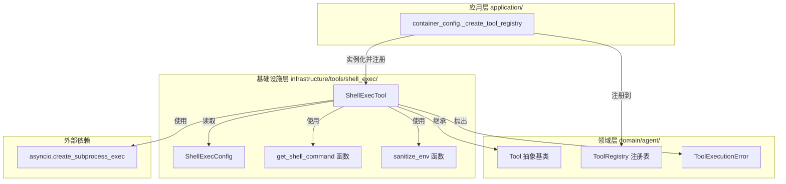
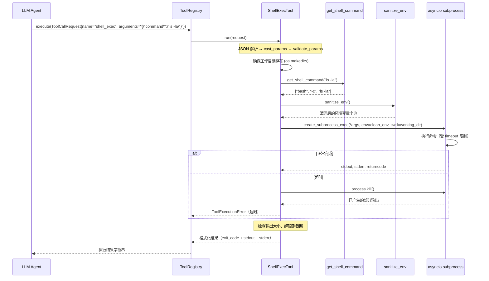

# 设计文档：Shell Exec Tool

## 概述

本设计为 LLM Agent 提供受控的 Shell 命令执行能力，基于 Python 标准库 `asyncio.create_subprocess_exec` 实现异步子进程执行。ShellExecTool 作为基础设施层的 Tool 适配器，继承 `domain/agent/tools.py` 中的 `Tool` 抽象基类，支持任意 Shell 命令的执行并捕获 stdout/stderr 输出。

与 HttpRequestTool 互补：HttpRequestTool 通过 HTTP 协议访问外部 API 和网页，ShellExecTool 则提供本地操作系统级别的命令执行能力，适用于文件处理、系统信息查询、脚本运行等场景。

工具内置多层安全防护机制：
- **执行超时限制**：可配置超时（默认 30 秒），超时后通过 `process.kill()` 终止子进程（跨平台兼容）
- **环境变量清理**：移除包含敏感关键词（KEY、SECRET、PASSWORD、TOKEN、CREDENTIAL）的环境变量，保留平台特定的系统必要变量
- **工作目录隔离**：所有命令在系统临时目录下的 `agent_exec/` 子目录中执行，与项目源码目录隔离
- **输出大小限制**：stdout/stderr 合并输出超过配置上限时截断并附加提示

工具支持跨平台运行，运行时通过 `sys.platform` 自动检测操作系统：
- Linux/macOS → `bash -c <command>`
- Windows → `powershell -Command <command>`

### 设计决策与理由

1. **asyncio.create_subprocess_exec 而非 subprocess.run**：项目整体基于 asyncio 异步架构，使用异步子进程避免阻塞事件循环。使用 `exec` 而非 `shell` 变体，显式传递 shell 路径和参数，更安全且便于控制。
2. **环境变量清理而非白名单**：采用"复制 + 移除敏感项 + 保留系统必要项"的策略。纯白名单模式可能遗漏命令运行所需的环境变量导致执行失败；黑名单 + 保留列表在安全性和可用性之间取得平衡。
3. **工作目录隔离使用 tempfile.gettempdir()**：跨平台获取系统临时目录，不依赖特定路径。在临时目录下创建 `agent_exec/` 子目录，既隔离了项目文件，又提供了可预测的工作空间。
4. **Shell 选择逻辑封装为独立函数**：`get_shell_command(command)` 返回平台对应的可执行参数列表，便于单元测试和复用，不依赖实际子进程创建。
5. **环境变量清理逻辑封装为独立函数**：`sanitize_env()` 返回清理后的环境变量字典，便于独立测试，不依赖子进程执行。
6. **配置模块独立性**：`ShellExecConfig` 作为独立配置类放在 `infrastructure/tools/shell_exec/` 包内，使用 `SHELL_EXEC_` 前缀，遵循 `HttpRequestConfig` 的既有模式。
7. **条件注册模式**：与 HttpRequestTool 一致，通过 `SHELL_EXEC_ENABLED` 配置项控制是否注册到 ToolRegistry，默认 false（安全优先）。

## 架构



### 执行数据流



## 组件与接口

### 1. ShellExecConfig（配置类）

**位置**：`infrastructure/tools/shell_exec/shell_exec_config.py`

继承 `PropertiesBaseSettings`，从 `config.properties` 加载 `SHELL_EXEC_` 前缀的配置项。

```python
class ShellExecConfig(PropertiesBaseSettings):
    model_config = SettingsConfigDict(env_prefix="SHELL_EXEC_")

    timeout: int = 30
    max_output_size: int = 51200  # 50KB
    enabled: bool = False
    working_dir: str = ""  # 空字符串时使用默认值
```

**接口**：
- `timeout: int` — 默认命令执行超时秒数，对应 `SHELL_EXEC_TIMEOUT`，默认 30
- `max_output_size: int` — stdout/stderr 合并输出大小上限（字节），对应 `SHELL_EXEC_MAX_OUTPUT_SIZE`，默认 51200
- `enabled: bool` — 工具启用开关，对应 `SHELL_EXEC_ENABLED`，默认 False（安全优先）
- `working_dir: str` — 工作目录路径，对应 `SHELL_EXEC_WORKING_DIR`，默认空字符串（运行时回退为 `os.path.join(tempfile.gettempdir(), "agent_exec")`）

**设计说明**：`working_dir` 默认值为空字符串而非直接调用 `tempfile.gettempdir()`，因为 pydantic-settings 的默认值在类定义时求值，而 `tempfile.gettempdir()` 的结果应在运行时确定。ShellExecTool 构造时检测空字符串并回退为运行时默认路径。

### 2. ShellExecTool（工具实现）

**位置**：`infrastructure/tools/shell_exec/shell_exec_tool.py`

继承 `Tool` 抽象基类，封装 asyncio 异步子进程执行。

```python
class ShellExecTool(Tool):
    def __init__(
        self,
        timeout: int = 30,
        max_output_size: int = 51200,
        working_dir: str | None = None,
    ): ...

    @property
    def name(self) -> str:          # 返回 "shell_exec"
    @property
    def description(self) -> str:   # 返回工具功能描述
    @property
    def parameters(self) -> dict:   # JSON Schema 参数定义

    async def execute(self, **kwargs) -> str:  # 执行 Shell 命令并返回结果
```

**构造参数**：
- `timeout: int` — 默认命令执行超时秒数，当 `execute` 未传 `timeout` 时使用
- `max_output_size: int` — stdout/stderr 合并输出大小上限（字节），超过时截断
- `working_dir: str | None` — 默认工作目录路径，None 时使用 `os.path.join(tempfile.gettempdir(), "agent_exec")`

**parameters JSON Schema**：
```json
{
  "type": "object",
  "properties": {
    "command": {
      "type": "string",
      "description": "待执行的 Shell 命令字符串"
    },
    "timeout": {
      "type": "integer",
      "description": "单次执行超时秒数，默认取自配置"
    },
    "working_dir": {
      "type": "string",
      "description": "工作目录路径，默认取自配置"
    }
  },
  "required": ["command"]
}
```

**execute 流程**：
1. 从 kwargs 提取参数：`command`（必填）、`timeout`（可选）、`working_dir`（可选）
2. 确保工作目录存在（`os.makedirs(working_dir, exist_ok=True)`）
3. 调用 `get_shell_command(command)` 获取平台对应的可执行参数列表
4. 调用 `sanitize_env()` 获取清理后的环境变量字典
5. 使用 `asyncio.create_subprocess_exec(*args, stdout=PIPE, stderr=PIPE, env=clean_env, cwd=working_dir)` 创建子进程
6. 使用 `asyncio.wait_for(process.communicate(), timeout=timeout)` 等待执行完成
7. 超时时捕获 `asyncio.TimeoutError`，调用 `process.kill()` 终止子进程，收集已产生的输出，抛出 `ToolExecutionError`
8. 合并 stdout + stderr，检查大小，超限则截断并附加提示
9. 返回格式化结果字符串
10. 其他异常包装为 `ToolExecutionError` 抛出

**返回格式**：
```
Exit Code: 0

[stdout]
total 8
drwxr-xr-x  2 user user 4096 Jan  1 00:00 .
drwxr-xr-x 10 user user 4096 Jan  1 00:00 ..

[stderr]
(无)
```

### 3. Shell 选择函数

**位置**：`infrastructure/tools/shell_exec/shell_exec_tool.py`（模块级函数）

```python
import sys

def get_shell_command(command: str) -> list[str]:
    """根据运行时操作系统选择 shell 执行方式。

    Args:
        command: 待执行的 Shell 命令字符串。

    Returns:
        适用于当前平台的可执行参数列表。
        Linux/macOS: ["bash", "-c", command]
        Windows: ["powershell", "-Command", command]
    """
    if sys.platform == "win32":
        return ["powershell", "-Command", command]
    return ["bash", "-c", command]
```

### 4. 环境变量清理函数

**位置**：`infrastructure/tools/shell_exec/shell_exec_tool.py`（模块级函数）

```python
import os
import sys

# 敏感关键词列表（不区分大小写匹配）
_SENSITIVE_KEYWORDS: list[str] = ["KEY", "SECRET", "PASSWORD", "TOKEN", "CREDENTIAL"]

# 平台特定的保留环境变量列表
_UNIX_PRESERVED_VARS: set[str] = {"PATH", "HOME", "LANG", "USER", "SHELL", "TERM"}
_WIN_PRESERVED_VARS: set[str] = {"Path", "USERPROFILE", "USERNAME", "SystemRoot", "TEMP", "TMP", "PATHEXT", "COMSPEC"}


def sanitize_env() -> dict[str, str]:
    """创建清理后的环境变量副本。

    复制当前进程环境变量，移除名称中包含敏感关键词的变量，
    但保留平台特定的系统必要变量。

    Returns:
        清理后的环境变量字典。
    """
    preserved = _WIN_PRESERVED_VARS if sys.platform == "win32" else _UNIX_PRESERVED_VARS
    clean_env: dict[str, str] = {}

    for name, value in os.environ.items():
        # 保留列表中的变量直接保留
        if name in preserved:
            clean_env[name] = value
            continue
        # 检查是否包含敏感关键词（不区分大小写）
        name_upper = name.upper()
        if any(kw in name_upper for kw in _SENSITIVE_KEYWORDS):
            continue
        clean_env[name] = value

    return clean_env
```

### 5. 包导出（__init__.py）

**位置**：`infrastructure/tools/shell_exec/__init__.py`

```python
from .shell_exec_tool import ShellExecTool

__all__ = ["ShellExecTool"]
```

### 6. 工具注册（container_config.py 修改）

在 `_create_tool_registry()` 函数中，HttpRequestTool 条件注册之后添加 ShellExecTool 的条件注册逻辑：

```python
# 条件注册 ShellExecTool（Shell 命令执行工具）
try:
    from infrastructure.tools.shell_exec.shell_exec_config import shell_exec_config
    if shell_exec_config.enabled:
        from infrastructure.tools.shell_exec import ShellExecTool
        registry.register(ShellExecTool(
            timeout=shell_exec_config.timeout,
            max_output_size=shell_exec_config.max_output_size,
            working_dir=shell_exec_config.working_dir or None,
        ))
    else:
        logger.info("SHELL_EXEC_ENABLED=false，跳过 ShellExecTool 注册")
except ImportError:
    logger.debug("ShellExecTool 不可用，跳过注册")
```

### 7. 配置项（config.properties 新增）

```properties
# -------------------------------------------
# Shell 命令执行工具配置
# -------------------------------------------
SHELL_EXEC_TIMEOUT=30
SHELL_EXEC_MAX_OUTPUT_SIZE=51200
SHELL_EXEC_ENABLED=false
```

## 数据模型

本功能不引入新的领域实体或值对象。核心数据流如下：

### 输入参数模型

| 参数 | 类型 | 必填 | 默认值 | 说明 |
|------|------|------|--------|------|
| `command` | string | 是 | - | 待执行的 Shell 命令字符串 |
| `timeout` | integer | 否 | 配置值（30） | 单次执行超时秒数 |
| `working_dir` | string | 否 | 配置值（临时目录/agent_exec） | 工作目录路径 |

### 输出结果格式

```
Exit Code: {returncode}

[stdout]
{stdout_content}

[stderr]
{stderr_content}
```

当输出被截断时，在末尾附加：
```
[输出已截断，原始大小: XXX bytes]
```

### 配置项模型

| 配置项 | 类型 | 默认值 | 说明 |
|--------|------|--------|------|
| `SHELL_EXEC_TIMEOUT` | int | 30 | 命令执行超时秒数 |
| `SHELL_EXEC_MAX_OUTPUT_SIZE` | int | 51200 | stdout/stderr 合并输出大小上限（字节） |
| `SHELL_EXEC_ENABLED` | bool | false | 工具启用开关 |
| `SHELL_EXEC_WORKING_DIR` | str | ""（运行时回退为临时目录/agent_exec） | 工作目录路径 |

### 环境变量清理模型

**敏感关键词**（不区分大小写匹配）：
- KEY、SECRET、PASSWORD、TOKEN、CREDENTIAL

**平台保留变量**：

| 平台 | 保留变量 |
|------|----------|
| Linux/macOS | PATH, HOME, LANG, USER, SHELL, TERM |
| Windows | Path, USERPROFILE, USERNAME, SystemRoot, TEMP, TMP, PATHEXT, COMSPEC |

### 异常类型

ShellExecTool 不引入新的异常类型，复用现有的 `ToolExecutionError`（错误码 60001）。所有异常场景（超时、权限不足、shell 不可用等）均包装为 `ToolExecutionError` 抛出，由 Agent Loop 统一处理。


## 正确性属性（Correctness Properties）

*属性（Property）是指在系统所有合法执行路径中都应成立的特征或行为——本质上是对系统应做什么的形式化陈述。属性是连接人类可读规格说明与机器可验证正确性保证之间的桥梁。*

以下属性基于需求文档中的验收标准推导而来。经过冗余消除后，将多个相关验收标准合并为具有独立验证价值的属性：
- 需求 1.1/1.2/1.3/1.4 合并为 Property 1（配置读取正确性）
- 需求 1.5/7.2/7.3 合并为 Property 2（条件注册正确性）
- 需求 2.4 独立为 Property 3（Shell 选择正确性）
- 需求 4.1/4.2/4.3 合并为 Property 4（环境变量清理正确性）
- 需求 6.1 独立为 Property 5（输出截断正确性）
- 需求 6.2 独立为 Property 6（结果格式正确性）
- 需求 2.7 独立为 Property 7（异常包装正确性）
- 需求 3.1/3.2 合并为 Property 8（超时终止正确性）

### Property 1: 配置读取正确性

*对于任意*有效的 `SHELL_EXEC_TIMEOUT` 整数值、`SHELL_EXEC_MAX_OUTPUT_SIZE` 整数值、`SHELL_EXEC_ENABLED` 布尔值和 `SHELL_EXEC_WORKING_DIR` 字符串值，通过 `ShellExecConfig` 读取后，`timeout`、`max_output_size`、`enabled` 和 `working_dir` 字段应与写入 config.properties 的值一致。当配置项未设置时，默认值应分别为 30、51200、False 和空字符串。

**Validates: Requirements 1.1, 1.2, 1.3, 1.4**

### Property 2: 条件注册正确性

*对于任意*布尔值的 `enabled` 配置，当 `enabled` 为 True 时，ToolRegistry 中应包含名为 `"shell_exec"` 的工具；当 `enabled` 为 False 时，ToolRegistry 中不应包含 `"shell_exec"` 工具，且其他已注册工具（如 filesystem 工具、http_request 工具）不受影响。

**Validates: Requirements 1.5, 7.2, 7.3**

### Property 3: Shell 选择正确性

*对于任意*非空命令字符串 `command`，`get_shell_command(command)` 在 Linux/macOS 平台应返回 `["bash", "-c", command]`，在 Windows 平台应返回 `["powershell", "-Command", command]`。返回列表的最后一个元素应始终等于原始 `command` 字符串（命令内容不被修改）。

**Validates: Requirements 2.4**

### Property 4: 环境变量清理正确性

*对于任意*环境变量集合，`sanitize_env()` 返回的字典应满足：
- 名称中包含敏感关键词（KEY、SECRET、PASSWORD、TOKEN、CREDENTIAL，不区分大小写）且不在平台保留列表中的变量被移除
- 平台保留列表中的变量（Linux/macOS: PATH、HOME、LANG、USER、SHELL、TERM；Windows: Path、USERPROFILE、USERNAME、SystemRoot、TEMP、TMP、PATHEXT、COMSPEC）始终保留，即使其名称包含敏感关键词
- 不包含敏感关键词的非保留变量也被保留

**Validates: Requirements 4.1, 4.2, 4.3**

### Property 5: 输出截断正确性

*对于任意* `max_output_size` 正整数和任意 stdout/stderr 内容，当合并输出的 UTF-8 编码大小超过 `max_output_size` 时，截断后的输出编码大小应不超过 `max_output_size` 加上截断提示的长度，且输出末尾应包含 `"[输出已截断，原始大小: XXX bytes]"` 格式的提示信息，其中 XXX 为原始合并输出的实际字节数。当合并输出未超过上限时，输出内容应保持不变。

**Validates: Requirements 6.1**

### Property 6: 结果格式正确性

*对于任意*退出码（整数）、stdout 内容和 stderr 内容，格式化后的结果字符串应包含 `"Exit Code: {退出码}"` 标记、`"[stdout]"` 标记和 `"[stderr]"` 标记，且 stdout 和 stderr 的内容分别出现在对应标记之后。

**Validates: Requirements 6.2**

### Property 7: 异常包装正确性

*对于任意*子进程执行过程中抛出的异常（子进程创建失败、权限不足、shell 不可用等），ShellExecTool 应将其包装为 `ToolExecutionError`，且错误信息中包含原始异常的描述文本，`tool_name` 字段为 `"shell_exec"`。

**Validates: Requirements 2.7**

### Property 8: 超时终止正确性

*对于任意*正整数超时值 `timeout`，当子进程执行时间超过 `timeout` 秒时，ShellExecTool 应终止子进程并抛出 `ToolExecutionError`，且错误信息中包含超时秒数的字符串表示。

**Validates: Requirements 3.1, 3.2**

## 错误处理

| 错误场景 | 处理方式 | 异常类型 |
|---------|---------|---------|
| `SHELL_EXEC_ENABLED` 为 false | 注册阶段记录日志，跳过注册 | 无异常，静默跳过 |
| `command` 参数缺失 | `Tool.run()` 流水线中 `validate_params` 检测到必填参数缺失 | `ToolParameterValidationError` |
| `command` 参数类型错误 | `Tool.run()` 流水线中 `validate_params` 检测到类型不匹配 | `ToolParameterValidationError` |
| JSON 解析 `request.arguments` 失败 | `Tool.run()` 流水线中捕获 `JSONDecodeError` | `ToolParameterValidationError` |
| 子进程执行超时 | 捕获 `asyncio.TimeoutError`，调用 `process.kill()` 终止子进程，收集已产生输出 | `ToolExecutionError`（含超时秒数和命令摘要） |
| 子进程创建失败（shell 不可用） | `execute` 捕获 `FileNotFoundError` 或 `OSError` | `ToolExecutionError`（含原始异常描述） |
| 权限不足 | `execute` 捕获 `PermissionError` | `ToolExecutionError`（含原始异常描述） |
| 工作目录创建失败 | `execute` 捕获 `OSError` | `ToolExecutionError`（含原始异常描述） |
| 命令执行返回非零退出码 | 正常返回，退出码包含在输出中供 Agent 判断 | 无异常 |
| 输出超过大小上限 | 截断内容并附加提示信息 | 无异常 |

错误处理策略与现有工具（如 `HttpRequestTool`、`WebSearchTool`）保持一致：
- 参数校验错误由 `Tool` 基类的 `run()` 方法统一处理
- 业务执行错误在 `execute()` 中捕获并包装为 `ToolExecutionError`
- 所有异常最终由 Agent Loop 捕获并转化为 ToolMessage 回传给 LLM，不会中断 Agent 执行

### 错误传播链路


## 测试策略

### 测试框架

- 单元测试：`pytest` + `pytest-asyncio`
- 属性测试：`hypothesis`（已在 `pyproject.toml` dev 依赖中）
- Mock：`unittest.mock`（标准库，用于隔离 asyncio subprocess 等依赖）

### 属性测试配置

- 每个属性测试最少运行 100 次迭代（`@settings(max_examples=100)`）
- 每个属性测试必须通过注释引用设计文档中的 Property 编号
- 标签格式：`Feature: shell-exec-tool, Property {number}: {property_text}`
- 每个正确性属性由单个 `@given` 装饰的测试函数实现

### 属性测试（Hypothesis）

| 属性 | 测试描述 | 生成策略 |
|-----|---------|---------|
| Property 1 | 生成随机 timeout、max_output_size、enabled、working_dir 值，验证 ShellExecConfig 读取一致性和默认值 | `st.integers(1, 300)` + `st.integers(1024, 1048576)` + `st.booleans()` + `st.text(min_size=1, max_size=50)` |
| Property 2 | 生成随机 enabled 布尔值，验证注册表中工具存在性与其他工具不受影响 | `st.booleans()` |
| Property 3 | 生成随机非空命令字符串，Mock `sys.platform`，验证 get_shell_command 返回正确的参数列表 | `st.text(min_size=1, max_size=200)` + `st.sampled_from(["linux", "darwin", "win32"])` |
| Property 4 | 生成随机环境变量名值对（含敏感/非敏感/保留变量），Mock `os.environ` 和 `sys.platform`，验证清理结果 | `st.dictionaries(st.text(min_size=1, max_size=30), st.text(max_size=50))` |
| Property 5 | 生成随机 max_output_size 和超过/未超过该大小的输出内容，验证截断行为和提示信息 | `st.integers(100, 10000)` + `st.text(min_size=0, max_size=20000)` |
| Property 6 | 生成随机退出码、stdout、stderr 内容，验证格式化结果包含所有必要标记 | `st.integers(-128, 255)` + `st.text(max_size=500)` × 2 |
| Property 7 | 生成随机异常类型和消息，Mock subprocess 抛出异常，验证包装后的 ToolExecutionError 保留原始信息 | `st.sampled_from([OSError, FileNotFoundError, PermissionError])` + `st.text(min_size=1)` |
| Property 8 | 使用小超时值和 Mock 的长时间运行子进程，验证超时后抛出 ToolExecutionError 且消息包含超时秒数 | `st.integers(1, 5)` |

### 单元测试（pytest）

单元测试聚焦于具体示例和边界情况，与属性测试互补：

- **ShellExecTool 接口合规**：验证继承 `Tool`、`name` 返回 `"shell_exec"`、`parameters` schema 结构正确（需求 2.1, 2.2, 2.3）
- **工作目录自动创建**：使用临时目录验证不存在的目录被自动创建（需求 2.6, 5.2）
- **工作目录参数覆盖**：验证 execute 的 working_dir 参数覆盖默认值（需求 5.3）
- **超时后 process.kill() 调用**：Mock subprocess，验证超时时 kill() 被调用（需求 3.3）
- **默认配置值**：验证未设置配置项时的默认值（timeout=30, max_output_size=51200, enabled=false）
- **SHELL_EXEC_ENABLED=false 时跳过注册**：验证注册逻辑的日志输出和跳过行为（需求 7.3）
- **空命令处理**：验证空字符串命令的参数校验行为

### 测试文件位置

```
test/
  infrastructure/
    tools/
      shell_exec/
        __init__.py
        test_shell_exec_tool.py         # 单元测试 + 属性测试（Property 3, 5, 6, 7, 8）
        test_shell_exec_config.py       # 配置类测试（Property 1, 2）
        test_sanitize_env.py            # 环境变量清理测试（Property 4）
```
