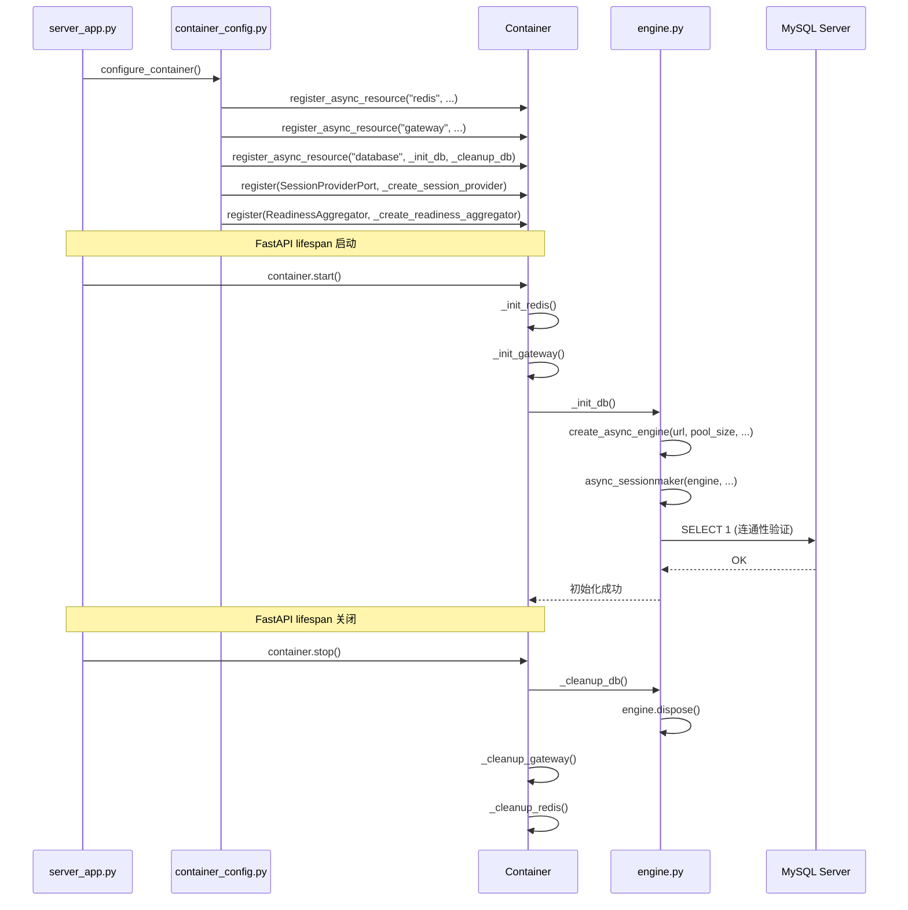

# Design Document: SQLAlchemy Async Integration

## Overview

本设计在现有 DDD 六边形架构中引入 SQLAlchemy 2.0 AsyncIO 作为 MySQL 数据库访问层。核心思路是复用项目已有的基础设施模式（`@configuration_properties` 配置绑定、`Container.register_async_resource` 生命周期管理、`HealthCheckPort` 健康检查协议），将数据库引擎、会话工厂、会话提供器和健康检查适配器按照与 Redis 集成完全一致的模式接入。

关键设计决策：
- 连接字符串使用 `mysql+aiomysql://` 方案，与 aiomysql 异步驱动配合
- 会话工厂配置 `expire_on_commit=False`，避免异步上下文中的延迟加载问题
- Session_Provider 采用异步上下文管理器模式，自动管理事务提交/回滚
- 数据库引擎生命周期通过 DI 容器的 `register_async_resource` 管理，确保 fail-fast 和优雅关闭

## Architecture

### 分层架构

```
┌─────────────────────────────────────────────────────┐
│  Application Layer (application/)                    │
│  ┌───────────────────────────────────────────────┐  │
│  │ container_config.py                            │  │
│  │  - register_async_resource("database", ...)    │  │
│  │  - register(SessionProviderPort, ...)          │  │
│  │  - register(ReadinessAggregator, ...)          │  │
│  └───────────────────────────────────────────────┘  │
├─────────────────────────────────────────────────────┤
│  Domain Layer (domain/)                              │
│  ┌──────────────────┐  ┌─────────────────────────┐  │
│  │ SessionProviderPort│  │ HealthCheckPort         │  │
│  │ (Protocol)        │  │ (Protocol, 已有)         │  │
│  └──────────────────┘  └─────────────────────────┘  │
├─────────────────────────────────────────────────────┤
│  Infrastructure Layer (infrastructure/)              │
│  ┌──────────────────────────────────────────────┐   │
│  │ database/                                     │   │
│  │  ├── database_config.py  (@configuration_     │   │
│  │  │                        properties)         │   │
│  │  ├── engine.py           (引擎 + 会话工厂)    │   │
│  │  ├── session_provider.py (异步上下文管理器)    │   │
│  │  └── base.py             (DeclarativeBase)    │   │
│  ├──────────────────────────────────────────────┤   │
│  │ health/                                       │   │
│  │  └── mysql_health_check_adapter.py            │   │
│  └──────────────────────────────────────────────┘   │
└─────────────────────────────────────────────────────┘
```

### 初始化时序



## Components and Interfaces

### 1. DatabaseConfig（配置类）

位置：`infrastructure/database/database_config.py`

```python
@configuration_properties(prefix="db")
class DatabaseConfig:
    host: str = "localhost"
    port: int = 3306
    username: str = "root"
    password: str = ""
    database: str = ""
    pool_size: int = 5
    max_overflow: int = 10
    pool_recycle: int = 3600
    echo: bool = False
    health_check_timeout: int = 3
```

与 `RedisConfig` 模式完全一致，通过 `@configuration_properties(prefix="db")` 装饰器绑定 `config.properties` 中的 `db.*` 配置项。每次属性访问实时读取，支持配置热刷新。

### 2. 引擎与会话工厂（engine.py）

位置：`infrastructure/database/engine.py`

提供模块级函数：
- `create_db_engine(config: DatabaseConfig) -> AsyncEngine`：根据配置创建异步引擎
- `create_session_factory(engine: AsyncEngine) -> async_sessionmaker[AsyncSession]`：创建会话工厂

模块级变量持有引擎和会话工厂实例，供 `container_config.py` 中的初始化/清理回调使用。

### 3. SessionProviderPort（领域端口）

位置：`domain/database/ports.py`

```python
class SessionProviderPort(Protocol):
    @asynccontextmanager
    async def session(self) -> AsyncIterator[AsyncSession]:
        ...
```

领域层定义的抽象接口，Repository Adapter 通过此端口获取数据库会话，不直接依赖 SQLAlchemy。

### 4. SessionProviderAdapter（基础设施适配器）

位置：`infrastructure/database/session_provider.py`

实现 `SessionProviderPort`，内部持有 `async_sessionmaker` 引用。`session()` 方法作为异步上下文管理器：
- 进入时：创建 `AsyncSession`
- 正常退出：`await session.commit()`
- 异常退出：`await session.rollback()`，重新抛出异常
- 最终：`await session.close()`

### 5. Base（ORM 基类）

位置：`infrastructure/database/base.py`

```python
class Base(DeclarativeBase):
    pass
```

所有 ORM 映射模型继承此基类，支持 SQLAlchemy 2.0 的 `Mapped` / `mapped_column` 类型注解风格。

### 6. MysqlHealthCheckAdapter（健康检查适配器）

位置：`infrastructure/health/mysql_health_check_adapter.py`

与 `RedisHealthCheckAdapter` 模式一致：
- 实现 `HealthCheckPort` 协议
- 通过 `AsyncSession` 执行 `SELECT 1` 验证连通性
- 使用 `asyncio.wait_for` 包裹超时控制
- 超时时长从 `DatabaseConfig.health_check_timeout` 动态读取
- 所有异常捕获并转化为 `HealthCheckResult(status=DOWN, reason=...)`

### 7. container_config.py 集成

在现有 `configure_container()` 中新增：
- `register_async_resource("database", _init_db, _cleanup_db)`：在 Redis 和 Gateway 之后注册
- `register(SessionProviderPort, _create_session_provider)`：Port → Adapter 绑定
- 更新 `_create_readiness_aggregator()`：将 `MysqlHealthCheckAdapter` 加入检查列表

## Data Models

### 配置项映射

| 配置键 | 类型 | 默认值 | 说明 |
|--------|------|--------|------|
| `db.host` | str | `"localhost"` | MySQL 服务地址 |
| `db.port` | int | `3306` | MySQL 服务端口 |
| `db.username` | str | `"root"` | 数据库用户名 |
| `db.password` | str | `""` | 数据库密码 |
| `db.database` | str | `""` | 数据库名称 |
| `db.pool_size` | int | `5` | 连接池大小 |
| `db.max_overflow` | int | `10` | 连接池最大溢出数 |
| `db.pool_recycle` | int | `3600` | 连接回收时间（秒） |
| `db.echo` | bool | `false` | 是否输出 SQL 日志 |
| `db.health_check_timeout` | int | `3` | 健康检查超时（秒） |

### 连接字符串格式

```
mysql+aiomysql://{username}:{password}@{host}:{port}/{database}
```

### SQLAlchemy 引擎参数映射

| DatabaseConfig 字段 | create_async_engine 参数 |
|---------------------|------------------------|
| pool_size | pool_size |
| max_overflow | max_overflow |
| pool_recycle | pool_recycle |
| echo | echo |

### ORM 基类

```python
from sqlalchemy.orm import DeclarativeBase, Mapped, mapped_column

class Base(DeclarativeBase):
    pass

# 使用示例（未来业务模型）
class SomeModel(Base):
    __tablename__ = "some_table"
    id: Mapped[int] = mapped_column(primary_key=True)
    name: Mapped[str] = mapped_column(String(100))
```


## Correctness Properties

*A property is a characteristic or behavior that should hold true across all valid executions of a system—essentially, a formal statement about what the system should do. Properties serve as the bridge between human-readable specifications and machine-verifiable correctness guarantees.*

### Property 1: 配置绑定 round-trip

*For any* valid `config.properties` 文件内容，其中包含 `db.host`、`db.port`、`db.username`、`db.password`、`db.database`、`db.pool_size`、`db.max_overflow`、`db.pool_recycle`、`db.echo` 配置项，通过 `DatabaseConfig` 实例访问对应字段时，应返回与配置文件中写入的值一致的结果（经过类型转换后）。

**Validates: Requirements 1.1**

### Property 2: 引擎创建参数正确性

*For any* 有效的 DatabaseConfig（随机 host、port、username、password、database、pool_size、max_overflow、pool_recycle、echo），引擎创建函数生成的连接字符串应符合 `mysql+aiomysql://{username}:{password}@{host}:{port}/{database}` 格式，且 pool_size、max_overflow、pool_recycle、echo 参数应被正确传递给 `create_async_engine`。

**Validates: Requirements 2.1, 2.2**

### Property 3: 初始化失败异常传播

*For any* 数据库连接异常（连接拒绝、认证失败、网络超时等），数据库初始化回调应将异常向上传播而非静默吞掉，以触发 DI 容器的 fail-fast 回滚机制。

**Validates: Requirements 3.3**

### Property 4: 会话正常退出自动提交

*For any* 通过 Session_Provider 获取的 AsyncSession，当上下文管理器正常退出（无异常）时，session.commit() 应被调用，且 session.close() 应被调用。

**Validates: Requirements 4.1, 4.2**

### Property 5: 会话异常退出自动回滚

*For any* 通过 Session_Provider 获取的 AsyncSession，当上下文管理器内抛出任意异常时，session.rollback() 应被调用，session.close() 应被调用，且原始异常应被重新抛出。

**Validates: Requirements 4.1, 4.3**

### Property 6: 健康检查成功返回 UP

*For any* 成功执行 `SELECT 1` 的数据库连接，MysqlHealthCheckAdapter.check() 应返回 `HealthCheckResult(name="mysql", status=HealthStatus.UP)`。

**Validates: Requirements 6.1, 6.3**

### Property 7: 健康检查异常返回 DOWN 并携带原因

*For any* 数据库异常（包括超时、连接错误、通用异常），MysqlHealthCheckAdapter.check() 应返回 `HealthCheckResult(name="mysql", status=HealthStatus.DOWN, reason=<非空描述>)`，且健康检查本身不应抛出异常。

**Validates: Requirements 6.1, 6.4, 6.5**

## Error Handling

### 引擎初始化阶段

| 错误场景 | 处理方式 |
|---------|---------|
| 数据库连接拒绝 | `_init_db` 回调抛出异常 → Container fail-fast 回滚已初始化资源 → 应用启动失败 |
| 认证失败 | 同上 |
| `SELECT 1` 超时 | 同上 |
| 配置项缺失/格式错误 | `@configuration_properties` 返回默认值，不会导致启动失败 |

### 会话使用阶段

| 错误场景 | 处理方式 |
|---------|---------|
| 业务代码异常 | Session_Provider 自动 rollback → 重新抛出异常 → 由 FastAPI 异常处理器处理 |
| 数据库连接断开 | SQLAlchemy 连接池自动重连（pool_pre_ping 或 pool_recycle 机制） |
| 事务死锁 | 数据库层面超时后抛出异常 → Session_Provider rollback → 上层处理 |

### 健康检查阶段

| 错误场景 | 处理方式 |
|---------|---------|
| `SELECT 1` 超时 | 返回 `HealthCheckResult(status=DOWN, reason="超时描述")` |
| 连接异常 | 返回 `HealthCheckResult(status=DOWN, reason="异常描述")` |
| 未知异常 | 捕获所有 Exception，返回 DOWN，健康检查不抛出异常 |

### 关闭阶段

| 错误场景 | 处理方式 |
|---------|---------|
| `engine.dispose()` 失败 | Container best-effort 语义，记录日志后继续清理其他资源 |

## Testing Strategy

### 属性测试（Property-Based Testing）

使用 **Hypothesis** 库（项目已有依赖），每个属性测试至少运行 100 次迭代。

每个测试用 comment 标注对应的设计属性：
```
# Feature: sqlalchemy-async-integration, Property {N}: {property_text}
```

属性测试覆盖：
- Property 1: 生成随机配置键值对，写入临时 config.properties，验证 DatabaseConfig 读取一致性
- Property 2: 生成随机 host/port/username/password/database/pool 参数，mock `create_async_engine`，验证 URL 格式和参数传递
- Property 3: 生成随机数据库异常，验证初始化回调传播异常
- Property 4: mock AsyncSession，正常退出时验证 commit + close 被调用
- Property 5: 生成随机异常，mock AsyncSession，验证 rollback + close + 异常重抛
- Property 6: mock 成功的 SELECT 1，验证返回 UP
- Property 7: 生成随机异常（超时、连接错误、通用异常），验证返回 DOWN + 非空 reason + 不抛出异常

### 单元测试（Unit Testing）

单元测试聚焦于具体示例和边界情况：
- DatabaseConfig 默认值验证（Requirement 1.2）
- `expire_on_commit=False` 配置验证（Requirement 2.3）
- `SELECT 1` 连通性验证调用确认（Requirement 3.2）
- `engine.dispose()` 清理调用确认（Requirement 3.4）
- Base 继承自 DeclarativeBase 验证（Requirement 5.1）
- Base 支持 Mapped/mapped_column 验证（Requirement 5.3）
- MysqlHealthCheckAdapter 通过 AsyncSession 执行 SELECT 1 验证（Requirement 6.2）

### 测试文件组织

```
test/
├── infrastructure/
│   ├── database/
│   │   ├── test_database_config.py          # 配置默认值单元测试
│   │   ├── test_database_config_property.py # Property 1
│   │   ├── test_engine.py                   # 引擎创建单元测试
│   │   ├── test_engine_property.py          # Property 2, 3
│   │   ├── test_session_provider.py         # 会话提供器单元测试
│   │   ├── test_session_provider_property.py# Property 4, 5
│   │   └── test_base.py                     # ORM 基类单元测试
│   └── health/
│       ├── test_mysql_health_check.py           # MySQL 健康检查单元测试
│       └── test_mysql_health_check_property.py  # Property 6, 7
```
