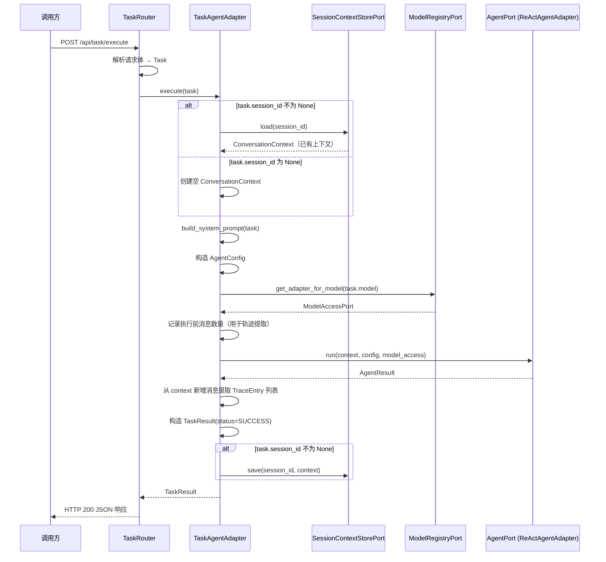
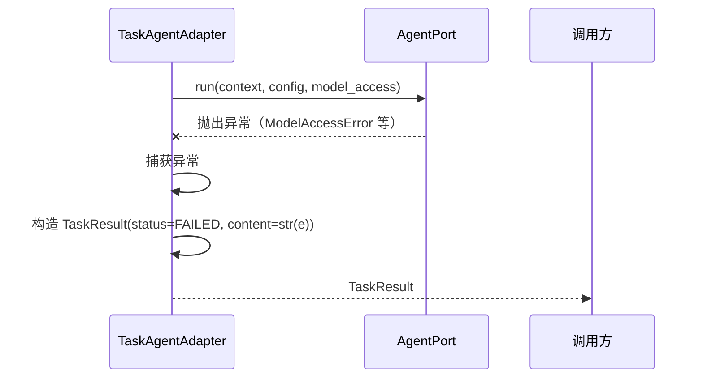

# Design Document: 面向任务的 Agent 入口重构

## Overview

将当前面向"对话"的 Agent 入口模型扩展为面向"任务"的模型。在领域层 `domain/task/` 中定义 `Task`、`TaskResult`、`TaskStatus`、`TraceEntry` 值对象和 `TaskAgentPort` 端口协议；在基础设施层 `infrastructure/task/` 中实现 `TaskAgentAdapter`，将 `Task` 转换为 `ConversationContext` + `AgentConfig` 后委托现有 `AgentPort` 执行；在应用层 `application/routers/task.py` 中新增 `POST /api/task/execute` 端点。

现有的面向对话的 `ChatServicePort` / `ChatRequestVO` 路径保持不变，两套入口并行存在。`TaskAgentAdapter` 复用已有的 `AgentPort`、`ToolRegistry`、`ModelRegistryPort`、`SessionContextStorePort` 和 `ContextCompactionPort`，不重复实现 Agent Loop。

### 设计决策

1. **TaskAgentAdapter 委托 AgentPort 而非直接调用 LLM**：`TaskAgentAdapter` 不包含 Agent Loop 逻辑，而是将 `Task` 转换为 `AgentConfig` + `ConversationContext` 后委托 `AgentPort.run()` 执行。这样复用了 `ReActAgentAdapter` 中已有的推理→行动→观察循环，避免重复实现。
2. **系统提示词生成为纯函数**：`Task` 到系统提示词的转换逻辑实现为 `TaskAgentAdapter` 的静态方法 `build_system_prompt`，是确定性的纯函数，便于单独测试。相同的 `Task` 输入始终产生相同的系统提示词输出。
3. **session_id 可选**：当 `Task.session_id` 不为 None 时，通过 `SessionContextStorePort` 加载已有上下文并在执行后保存；为 None 时创建空上下文，执行后不保存。这使得 Task 既可以作为无状态的一次性任务执行，也可以关联到已有对话上下文。
4. **异常捕获转换为 FAILED 状态**：`TaskAgentAdapter.execute()` 捕获 `AgentPort.run()` 抛出的所有异常，将异常信息作为 `TaskResult.content`，`status` 设为 `TaskStatus.FAILED`。调用方无需处理异常，通过 `TaskResult.status` 判断执行结果。
5. **执行轨迹从 ConversationContext 提取**：Agent Loop 执行过程中会向 `ConversationContext` 追加 `AssistantMessage`（含 tool_calls）和 `ToolMessage`。`TaskAgentAdapter` 在执行完成后遍历上下文中新增的消息，将工具调用和结果转换为 `TraceEntry` 列表。
6. **配置项 `TASK_AGENT_MAX_ROUNDS` 写入 `config.properties`**：遵循项目配置规范，新增配置项写入 `config.properties`，默认值为 10。

## Architecture

```mermaid
graph TD
    subgraph app["应用层 (application/)"]
        TaskRouter["task.py<br/>POST /api/task/execute"]
    end

    subgraph domain_task["领域层 (domain/task/)"]
        Task["Task (frozen dataclass)<br/>goal, input_data, constraints,<br/>output_format, model, session_id"]
        TaskResult["TaskResult (frozen dataclass)<br/>content, status, model,<br/>usage, trace, latency_ms"]
        TaskStatus["TaskStatus (Enum)<br/>SUCCESS, FAILED,<br/>HUMAN_INTERVENTION_REQUIRED"]
        TraceEntry["TraceEntry (frozen dataclass)<br/>step, action, detail, timestamp_ms"]
        TaskAgentPort["TaskAgentPort Protocol<br/>execute(task) → TaskResult"]
    end

    subgraph domain_agent["领域层 (domain/agent/)"]
        AgentPort["AgentPort Protocol"]
        ToolRegistry["ToolRegistry"]
        AgentConfig["AgentConfig"]
        AgentResult["AgentResult"]
    end

    subgraph domain_chat["领域层 (domain/chat/)"]
        SessionStore["SessionContextStorePort"]
        CompactionPort["ContextCompactionPort"]
        Context["ConversationContext"]
    end

    subgraph domain_model["领域层 (domain/model_access/)"]
        ModelRegistryPort["ModelRegistryPort"]
    end

    subgraph infra_task["基础设施层 (infrastructure/task/)"]
        TaskAgentAdapter["TaskAgentAdapter<br/>实现 TaskAgentPort"]
    end

    TaskRouter -->|注入| TaskAgentPort
    TaskRouter -->|构造| Task
    TaskRouter -->|返回| TaskResult

    TaskAgentAdapter -->|实现| TaskAgentPort
    TaskAgentAdapter -->|构造| AgentConfig
    TaskAgentAdapter -->|委托| AgentPort
    TaskAgentAdapter -->|依赖| ToolRegistry
    TaskAgentAdapter -->|依赖| ModelRegistryPort
    TaskAgentAdapter -->|依赖| SessionStore
    TaskAgentAdapter -->|读写| Context
    TaskAgentAdapter -->|转换| AgentResult
    TaskAgentAdapter -->|生成| TaskResult
```



### 调用流程



### 异常处理流程



## Components and Interfaces

### TaskStatus 枚举

```python
# domain/task/value_objects.py

class TaskStatus(Enum):
    """任务执行状态枚举。

    定义 Agent 执行任务后的三种可能状态，调用方根据状态进行分支处理。

    Members:
        SUCCESS: 任务执行成功，content 包含执行结果
        FAILED: 任务执行失败，content 包含错误信息
        HUMAN_INTERVENTION_REQUIRED: 需要人工介入，content 包含原因说明
    """
    SUCCESS = "success"
    FAILED = "failed"
    HUMAN_INTERVENTION_REQUIRED = "human_intervention_required"
```

### Task 值对象

```python
# domain/task/value_objects.py

@dataclass(frozen=True)
class Task:
    """任务值对象。

    封装一次 Agent 执行的完整任务定义，包含目标描述、输入数据、约束条件和期望输出格式。
    使用 frozen dataclass 确保不可变性。

    Attributes:
        goal: 任务目标描述，不可为空或纯空白字符
        input_data: 输入数据字典，默认空字典
        constraints: 约束条件列表，默认空列表
        output_format: 期望输出格式描述，默认 None
        model: 可选模型名称，默认 None（使用系统默认模型）
        session_id: 可选会话标识，默认 None（不关联对话上下文）
    """
    goal: str
    input_data: dict[str, Any] = field(default_factory=dict)
    constraints: list[str] = field(default_factory=list)
    output_format: str | None = None
    model: str | None = None
    session_id: str | None = None

    def __post_init__(self) -> None:
        if not self.goal or not self.goal.strip():
            raise ValueError("goal 不能为空或纯空白字符")
```

### TraceEntry 值对象

```python
# domain/task/value_objects.py

@dataclass(frozen=True)
class TraceEntry:
    """执行轨迹条目值对象。

    记录 Agent 执行过程中的单步操作，用于事后审查执行轨迹和排查问题。

    Attributes:
        step: 步骤序号，从 1 开始
        action: 操作类型，如 "tool_call"、"tool_result"、"llm_response"
        detail: 操作详情描述
        timestamp_ms: 时间戳（毫秒）
    """
    step: int
    action: str
    detail: str
    timestamp_ms: float
```

### TaskResult 值对象

```python
# domain/task/value_objects.py

@dataclass(frozen=True)
class TaskResult:
    """任务执行结果值对象。

    封装 Agent 执行任务后的结构化结果，包含执行状态、执行轨迹和 token 用量。

    Attributes:
        content: 执行结果内容（成功时为 Agent 回复，失败时为错误信息）
        status: 执行状态枚举
        model: 实际使用的模型名称
        usage: token 用量，默认空字典
        trace: 执行轨迹列表，默认空列表
        latency_ms: 总执行耗时（毫秒），默认 0.0
    """
    content: str
    status: TaskStatus
    model: str
    usage: dict[str, int] = field(default_factory=dict)
    trace: list[TraceEntry] = field(default_factory=list)
    latency_ms: float = 0.0
```

### TaskAgentPort 端口协议

```python
# domain/task/ports.py

class TaskAgentPort(Protocol):
    """面向任务的 Agent 端口协议。

    定义"接收 Task、自主执行、返回 TaskResult"的统一接口。
    支持有 session_id（关联已有对话上下文）和无 session_id（一次性任务）两种场景。
    """

    async def execute(self, task: Task) -> TaskResult:
        """执行任务。

        将 Task 转换为 Agent 可执行的格式，委托 AgentPort 执行 Agent Loop，
        将 AgentResult 转换为 TaskResult 返回。

        Args:
            task: 任务值对象

        Returns:
            TaskResult，包含执行结果、状态和执行轨迹
        """
        ...
```

### TaskAgentAdapter 适配器

```python
# infrastructure/task/task_agent_adapter.py

class TaskAgentAdapter:
    """面向任务的 Agent 适配器，实现 TaskAgentPort 协议。

    将 Task 转换为 ConversationContext + AgentConfig，委托现有 AgentPort 执行，
    将 AgentResult 转换为 TaskResult。复用已有的 Agent Loop 基础设施。

    Attributes:
        _agent: AgentPort 实例，委托执行 Agent Loop
        _tool_registry: 工具注册表，获取工具 schema
        _model_registry: 模型注册中心，解析 ModelAccessPort
        _compaction: 上下文压缩端口（传递给 AgentConfig 使用）
        _session_store: 会话上下文存储端口，加载/保存对话上下文
        _max_rounds: Agent Loop 最大迭代轮次
    """

    def __init__(
        self,
        agent: AgentPort,
        tool_registry: ToolRegistry,
        model_registry: ModelRegistryPort,
        compaction: ContextCompactionPort,
        session_store: SessionContextStorePort,
        max_rounds: int = 10,
    ) -> None: ...

    @staticmethod
    def build_system_prompt(task: Task) -> str:
        """根据 Task 构造系统提示词（纯函数）。

        将 Task 的结构化字段转换为清晰的系统提示词文本。
        相同的 Task 输入始终产生相同的输出。

        生成规则：
        - goal 作为核心指令部分
        - input_data 非空时序列化为 JSON 嵌入"输入数据"段落
        - constraints 非空时作为编号列表嵌入"约束条件"段落
        - output_format 不为 None 时嵌入"期望输出格式"段落

        Args:
            task: 任务值对象

        Returns:
            生成的系统提示词字符串
        """
        ...

    def _extract_trace(
        self, messages: list[BaseMessage], start_index: int
    ) -> list[TraceEntry]:
        """从 ConversationContext 新增消息中提取执行轨迹。

        遍历 start_index 之后的消息，将 AssistantMessage 中的 tool_calls
        转换为 action="tool_call" 的 TraceEntry，将 ToolMessage 转换为
        action="tool_result" 的 TraceEntry。

        Args:
            messages: 完整消息列表
            start_index: 执行前的消息数量，用于定位新增消息

        Returns:
            TraceEntry 列表
        """
        ...

    async def execute(self, task: Task) -> TaskResult:
        """执行任务。

        完整流程：
        1. 根据 session_id 加载或创建 ConversationContext
        2. 调用 build_system_prompt 生成系统提示词
        3. 从 ToolRegistry 获取工具 schema，构造 AgentConfig
        4. 通过 ModelRegistryPort 解析 ModelAccessPort
        5. 记录执行前消息数量
        6. 委托 AgentPort.run() 执行
        7. 从上下文新增消息提取执行轨迹
        8. 将 AgentResult 转换为 TaskResult(status=SUCCESS)
        9. 若有 session_id，保存更新后的上下文

        异常处理：捕获 AgentPort.run() 的所有异常，
        转换为 TaskResult(status=FAILED, content=str(e))。

        Args:
            task: 任务值对象

        Returns:
            TaskResult
        """
        ...
```

### TaskRouter API 端点

```python
# application/routers/task.py

class TaskExecuteRequestBody(BaseModel):
    """任务执行请求体。

    Attributes:
        goal: 任务目标描述，必填
        input_data: 输入数据字典，可选，默认空字典
        constraints: 约束条件列表，可选，默认空列表
        output_format: 期望输出格式，可选
        model: 模型名称，可选
        session_id: 会话标识，可选
    """
    goal: str
    input_data: dict[str, Any] = {}
    constraints: list[str] = []
    output_format: str | None = None
    model: str | None = None
    session_id: str | None = None


class TraceEntryBody(BaseModel):
    """执行轨迹条目响应体。"""
    step: int
    action: str
    detail: str
    timestamp_ms: float


class TaskExecuteResponseBody(BaseModel):
    """任务执行响应体。

    Attributes:
        code: 业务状态码，0 表示成功
        content: 执行结果内容
        status: 执行状态枚举值
        model: 实际使用的模型
        usage: token 用量
        trace: 执行轨迹
        latency_ms: 总耗时
    """
    code: int = 0
    content: str
    status: str
    model: str
    usage: dict[str, int]
    trace: list[TraceEntryBody]
    latency_ms: float


@router.post("/api/task/execute")
async def execute_task(
    request: TaskExecuteRequestBody,
    service: TaskAgentPort = Depends(inject(TaskAgentPort)),
) -> TaskExecuteResponseBody | JSONResponse:
    """任务执行端点。

    将 HTTP 请求体转换为 Task 值对象，通过 DI 容器注入 TaskAgentPort，
    调用 execute 方法并将 TaskResult 转换为 HTTP 响应返回。

    Task 构造时 goal 校验失败返回 HTTP 400。
    """
    ...
```

### 依赖关系

| 组件 | 依赖 | 说明 |
|------|------|------|
| Task, TaskResult, TaskStatus, TraceEntry | 无 | 纯值对象 |
| TaskAgentPort | Task, TaskResult | Protocol 定义 |
| TaskAgentAdapter | AgentPort, ToolRegistry, ModelRegistryPort, ContextCompactionPort, SessionContextStorePort | 构造函数注入 |
| TaskRouter | TaskAgentPort | DI 容器注入 |

### DI 容器注册

```python
# application/container_config.py 新增

async def _create_task_agent() -> "TaskAgentPort":
    agent = await container.resolve(AgentPort)
    tool_registry = await container.resolve(ToolRegistry)
    model_registry = await container.resolve(ModelRegistryPort)
    compaction = await container.resolve(ContextCompactionPort)
    session_store = await container.resolve(SessionContextStorePort)
    # 从 config.properties 读取 TASK_AGENT_MAX_ROUNDS，默认 10
    max_rounds = int(os.getenv("TASK_AGENT_MAX_ROUNDS", "10"))
    return TaskAgentAdapter(
        agent=agent,
        tool_registry=tool_registry,
        model_registry=model_registry,
        compaction=compaction,
        session_store=session_store,
        max_rounds=max_rounds,
    )

# configure_container() 中新增：
container.register(TaskAgentPort, _create_task_agent, Scope.SINGLETON)
```

## Data Models

### TaskStatus 枚举成员

| 成员 | 值 | 说明 |
|------|------|------|
| SUCCESS | "success" | 任务执行成功 |
| FAILED | "failed" | 任务执行失败 |
| HUMAN_INTERVENTION_REQUIRED | "human_intervention_required" | 需要人工介入 |

### Task 字段定义

| 字段 | 类型 | 必填 | 默认值 | 约束 | 说明 |
|------|------|------|--------|------|------|
| goal | str | 是 | - | 非空且非纯空白 | 任务目标描述 |
| input_data | dict[str, Any] | 否 | {} | - | 输入数据 |
| constraints | list[str] | 否 | [] | - | 约束条件列表 |
| output_format | str \| None | 否 | None | - | 期望输出格式 |
| model | str \| None | 否 | None | - | 模型名称 |
| session_id | str \| None | 否 | None | - | 会话标识 |

### TraceEntry 字段定义

| 字段 | 类型 | 必填 | 默认值 | 说明 |
|------|------|------|--------|------|
| step | int | 是 | - | 步骤序号 |
| action | str | 是 | - | 操作类型 |
| detail | str | 是 | - | 操作详情 |
| timestamp_ms | float | 是 | - | 时间戳（毫秒） |

### TaskResult 字段定义

| 字段 | 类型 | 必填 | 默认值 | 说明 |
|------|------|------|--------|------|
| content | str | 是 | - | 执行结果内容 |
| status | TaskStatus | 是 | - | 执行状态 |
| model | str | 是 | - | 实际使用的模型名称 |
| usage | dict[str, int] | 否 | {} | token 用量 |
| trace | list[TraceEntry] | 否 | [] | 执行轨迹 |
| latency_ms | float | 否 | 0.0 | 总执行耗时（毫秒） |

### API 请求体字段

| 字段 | 类型 | 必填 | 默认值 | 说明 |
|------|------|------|--------|------|
| goal | str | 是 | - | 任务目标描述 |
| input_data | dict | 否 | {} | 输入数据 |
| constraints | list[str] | 否 | [] | 约束条件 |
| output_format | str | 否 | None | 期望输出格式 |
| model | str | 否 | None | 模型名称 |
| session_id | str | 否 | None | 会话标识 |

### API 响应体字段

| 字段 | 类型 | 说明 |
|------|------|------|
| code | int | 业务状态码，0 表示成功 |
| content | str | 执行结果内容 |
| status | str | 执行状态枚举值 |
| model | str | 实际使用的模型 |
| usage | dict[str, int] | token 用量 |
| trace | list[TraceEntryBody] | 执行轨迹 |
| latency_ms | float | 总耗时（毫秒） |

### 配置项

| 配置项 | 位置 | 默认值 | 说明 |
|--------|------|--------|------|
| TASK_AGENT_MAX_ROUNDS | config.properties | 10 | Task Agent Loop 最大迭代轮次 |


## Correctness Properties

*A property is a characteristic or behavior that should hold true across all valid executions of a system — essentially, a formal statement about what the system should do. Properties serve as the bridge between human-readable specifications and machine-verifiable correctness guarantees.*

### Property 1: Value object construction and immutability

*For any* valid goal (non-empty, non-whitespace str), input_data (dict), constraints (list[str]), output_format (str | None), model (str | None), session_id (str | None), constructing a `Task` should succeed and all field values should be preserved. *For any* valid step (int), action (str), detail (str), timestamp_ms (float), constructing a `TraceEntry` should succeed and all field values should be preserved. *For any* valid content (str), status (TaskStatus), model (str), usage (dict[str, int]), trace (list[TraceEntry]), latency_ms (float), constructing a `TaskResult` should succeed and all field values should be preserved. All three types should be frozen: attempting to reassign any attribute should raise `FrozenInstanceError`.

**Validates: Requirements 2.1, 3.1, 4.1**

### Property 2: Task goal whitespace validation

*For any* string composed entirely of whitespace characters (including the empty string), constructing a `Task` with that string as `goal` should raise `ValueError`. *For any* string containing at least one non-whitespace character, construction should succeed.

**Validates: Requirements 2.2**

### Property 3: System prompt generation correctness and determinism

*For any* `Task`, calling `TaskAgentAdapter.build_system_prompt(task)` should produce a string that contains `task.goal`. When `task.input_data` is non-empty, the result should contain the JSON serialization of `input_data`. When `task.constraints` is non-empty, the result should contain every constraint string. When `task.output_format` is not None, the result should contain `output_format`. Calling `build_system_prompt` twice with the same `Task` should produce identical results.

**Validates: Requirements 9.1, 9.2, 9.3, 9.4, 9.5**

### Property 4: Session context load/save routing

*For any* `Task` with `session_id` not None, `TaskAgentAdapter.execute()` should call `SessionContextStorePort.load(session_id)` before execution and `SessionContextStorePort.save(session_id, context)` after execution. *For any* `Task` with `session_id` equal to None, `SessionContextStorePort.load` and `SessionContextStorePort.save` should not be called.

**Validates: Requirements 5.4, 6.4, 6.5**

### Property 5: Successful execution produces SUCCESS result

*For any* `Task` and mock `AgentPort` that returns an `AgentResult`, `TaskAgentAdapter.execute()` should return a `TaskResult` with `status == TaskStatus.SUCCESS`, `content` matching `AgentResult.content`, `model` matching `AgentResult.model`, and `usage` matching `AgentResult.usage`.

**Validates: Requirements 6.3, 6.6**

### Property 6: Exception handling produces FAILED result

*For any* `Task` and mock `AgentPort` that raises an exception, `TaskAgentAdapter.execute()` should return a `TaskResult` with `status == TaskStatus.FAILED` and `content` equal to `str(exception)`, without propagating the exception to the caller.

**Validates: Requirements 6.7**

### Property 7: Trace extraction from context messages

*For any* sequence of `AssistantMessage` (with tool_calls) and `ToolMessage` appended to `ConversationContext` during Agent Loop execution, `TaskAgentAdapter._extract_trace()` should produce a `TraceEntry` list where each tool_call in an `AssistantMessage` maps to a `TraceEntry` with `action="tool_call"` and each `ToolMessage` maps to a `TraceEntry` with `action="tool_result"`, with step numbers monotonically increasing from 1.

**Validates: Requirements 6.8**

## Error Handling

### Task 构造校验

| 条件 | 异常 | 说明 |
|------|------|------|
| goal 为空或纯空白 | ValueError | 在 `__post_init__` 中校验 |

### TaskAgentAdapter.execute() 错误处理

| 场景 | 处理方式 | 说明 |
|------|---------|------|
| AgentPort.run() 抛出异常 | 捕获异常，返回 TaskResult(status=FAILED, content=str(e)) | 不向上传播 |
| ModelRegistryPort 模型路由失败 | 被上层 try/except 捕获，转为 FAILED | ModelAccessError 等 |
| SessionContextStorePort 加载/保存失败 | 异常向上传播 | 基础设施异常，不在 execute 内捕获 |

### API 端点错误处理

| 场景 | HTTP 状态码 | 说明 |
|------|------------|------|
| Task 构造 goal 校验失败 | 400 | 返回 `{"code": 400, "message": "goal 不能为空或纯空白字符"}` |
| TaskAgentPort.execute() 正常返回 FAILED | 200 | 业务层面的失败，通过 status 字段表达 |
| 未预期的服务端异常 | 500 | 由全局异常处理器捕获 |

## Testing Strategy

### 测试框架与库

- **属性测试**：Hypothesis（项目已使用）
- **单元测试**：pytest + pytest-asyncio
- **Mock**：unittest.mock（AsyncMock 用于异步方法）

### 测试文件位置

| 测试类型 | 文件路径 |
|---------|---------|
| 值对象属性测试 | `test/domain/task/test_task_value_objects_property.py` |
| 值对象单元测试 | `test/domain/task/test_task_value_objects_unit.py` |
| TaskAgentAdapter 属性测试 | `test/infrastructure/task/test_task_agent_adapter_property.py` |
| TaskAgentAdapter 单元测试 | `test/infrastructure/task/test_task_agent_adapter_unit.py` |

### 属性测试（Property-Based Tests）

使用 Hypothesis 库，每个属性测试运行至少 100 次迭代。每个测试通过注释标注对应的设计属性。

**Hypothesis 策略设计**：
- Task 策略：生成随机 goal（`st.text(min_size=1).filter(lambda s: s.strip())`）、input_data（`st.dictionaries(st.text(), st.text())`）、constraints（`st.lists(st.text())`）、output_format（`st.none() | st.text()`）、model（`st.none() | st.text(min_size=1)`）、session_id（`st.none() | st.text(min_size=1)`）
- TraceEntry 策略：生成随机 step（`st.integers(min_value=1)`）、action（`st.sampled_from(["tool_call", "tool_result", "llm_response"])`）、detail（`st.text()`）、timestamp_ms（`st.floats(min_value=0, allow_nan=False, allow_infinity=False)`）
- TaskResult 策略：生成随机 content、status（`st.sampled_from(TaskStatus)`）、model、usage、trace、latency_ms
- 纯空白字符串策略：`st.text(alphabet=st.sampled_from([' ', '\t', '\n', '\r'])).filter(lambda s: len(s) == 0 or s.strip() == '')`

**属性测试清单**：

| 属性测试 | 对应 Property | 标签 |
|---------|--------------|------|
| `test_value_object_construction_and_immutability` | Property 1 | Feature: task-oriented-agent, Property 1: Value object construction and immutability |
| `test_task_goal_whitespace_validation` | Property 2 | Feature: task-oriented-agent, Property 2: Task goal whitespace validation |
| `test_system_prompt_generation_correctness` | Property 3 | Feature: task-oriented-agent, Property 3: System prompt generation correctness and determinism |
| `test_session_context_load_save_routing` | Property 4 | Feature: task-oriented-agent, Property 4: Session context load/save routing |
| `test_successful_execution_produces_success` | Property 5 | Feature: task-oriented-agent, Property 5: Successful execution produces SUCCESS result |
| `test_exception_handling_produces_failed` | Property 6 | Feature: task-oriented-agent, Property 6: Exception handling produces FAILED result |
| `test_trace_extraction_from_context` | Property 7 | Feature: task-oriented-agent, Property 7: Trace extraction from context messages |

### 单元测试（Unit Tests）

单元测试覆盖具体示例和边界情况，与属性测试互补：

| 测试场景 | 说明 |
|----------|------|
| TaskStatus 枚举成员和值 | 验证三个成员及其字符串值 |
| Task 基本构造 | 验证各字段赋值正确，默认值正确 |
| Task goal="" | 验证抛出 ValueError |
| Task goal="   " | 验证抛出 ValueError |
| TraceEntry 基本构造 | 验证各字段赋值正确 |
| TaskResult 基本构造 | 验证各字段赋值正确，默认值正确 |
| TaskAgentPort Protocol 结构 | 验证 TaskAgentAdapter 满足 TaskAgentPort Protocol |
| TaskAgentAdapter 无 session_id 执行 | 模拟 AgentPort.run() 返回成功，验证不调用 save |
| TaskAgentAdapter 有 session_id 执行 | 模拟 AgentPort.run() 返回成功，验证调用 load 和 save |
| TaskAgentAdapter 异常处理 | 模拟 AgentPort.run() 抛出异常，验证返回 FAILED |
| TaskAgentAdapter 轨迹提取 | 模拟含 tool_calls 的上下文，验证 TraceEntry 列表正确 |
| build_system_prompt 仅 goal | 验证只包含 goal 段落 |
| build_system_prompt 全字段 | 验证包含所有段落 |
| API 端点 goal 校验失败 | 验证返回 HTTP 400 |

### 测试配置

```python
@settings(max_examples=100, deadline=5000)
```

每个属性测试必须由单个 Hypothesis `@given` 测试实现，标注对应的 Property 编号。TaskAgentAdapter 相关的属性测试因涉及异步 mock，deadline 设置为 5000ms。
