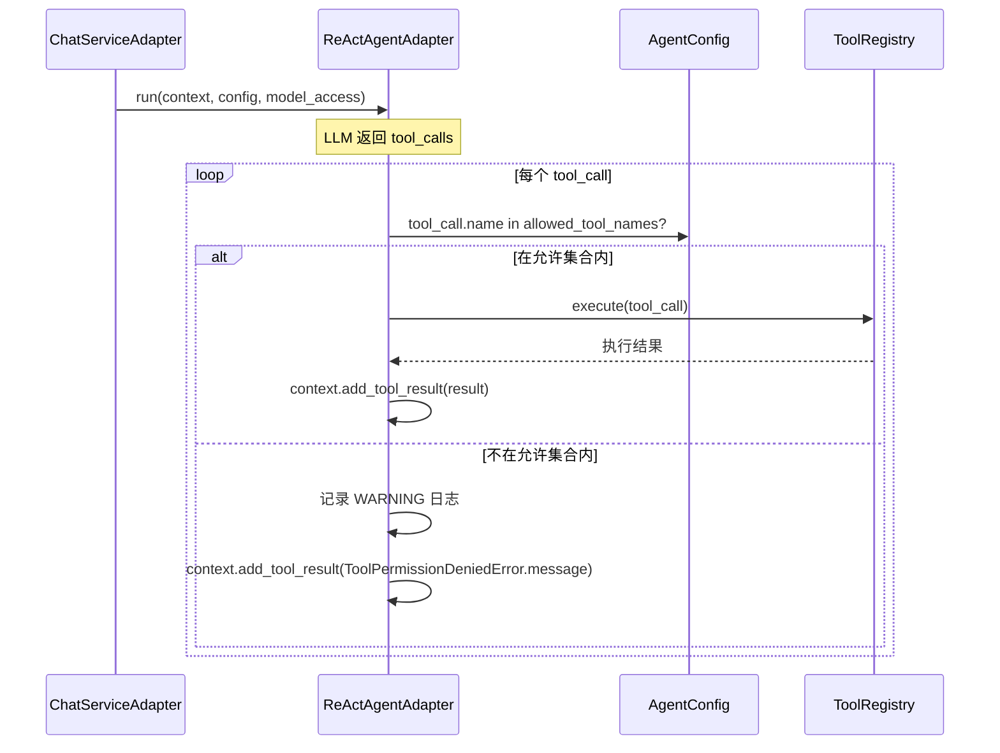
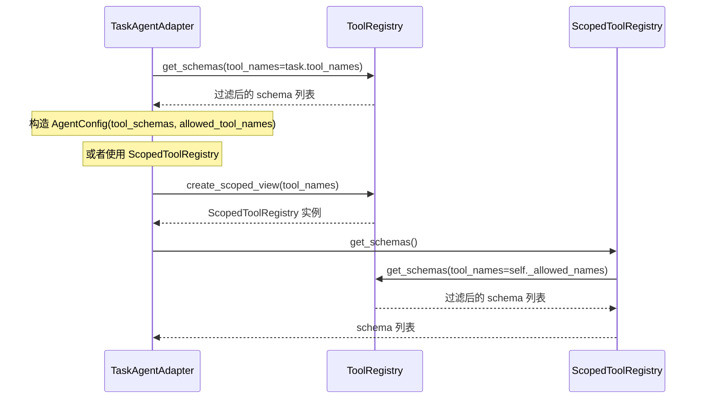

# 技术设计文档：工具作用域与权限校验

## 概述

本设计为 ToolRegistry 增加工具作用域（Scoped View）和执行层权限校验功能，解决当前系统中 LLM 幻觉调用未授权工具的安全隐患。

当前系统中，ToolRegistry 以单例模式管理所有已注册工具。`AgentConfig.tool_schemas` 控制 LLM 能"看到"哪些工具（schema 层面），但 `ReActAgentAdapter` 在执行工具时直接调用 `self._tool_registry.execute(tool_call)`，未校验 `tool_call.name` 是否在当前 `AgentConfig` 允许的工具集合内。这意味着 LLM 若幻觉出一个不在 schema 里的工具名，ToolRegistry 仍然会执行它。

本次设计通过以下手段解决该问题：

1. **ToolRegistry.get_schemas() 支持按名称子集过滤**：新增可选参数 `tool_names: set[str] | None`，为 None 时返回全量 schema（向后兼容），非空时仅返回指定工具的 schema。
2. **ScopedToolRegistry 作用域视图**：ToolRegistry 新增 `create_scoped_view(tool_names)` 工厂方法，返回轻量包装器，仅暴露指定工具子集的 `get_schemas()` 和 `execute()` 接口，不持有独立工具存储。
3. **ToolPermissionDeniedError 异常**：新增错误码 60004 的异常类型，区分"工具不存在"（60002）和"工具未授权"（60004）两种错误场景。
4. **AgentConfig.allowed_tool_names 字段**：新增 `frozenset[str]` 字段，显式声明允许的工具名称集合，支持自动从 `tool_schemas` 提取默认值。
5. **ReActAgentAdapter 执行前权限校验**：在调用 `ToolRegistry.execute()` 之前校验 `tool_call.name` 是否在 `AgentConfig.allowed_tool_names` 中，拒绝未授权调用。
6. **TaskAgentAdapter 支持工具子集**：根据 `Task.tool_names` 字段获取工具子集 schema，而非始终获取全量。
7. **Task 值对象扩展**：新增 `tool_names: frozenset[str] | None` 字段，支持任务级别控制可用工具范围。

### 设计决策

1. **ScopedToolRegistry 采用组合而非继承**：ScopedToolRegistry 持有对底层 ToolRegistry 的引用和允许的工具名称 frozenset，通过委托模式实现 `get_schemas()` 和 `execute()`。不继承 ToolRegistry 是因为 ScopedToolRegistry 不应暴露 `register()`、`unregister()` 等修改方法。

2. **ScopedToolRegistry 采用创建时快照语义**：创建 ScopedToolRegistry 时传入的 `tool_names` 是不可变的 frozenset，后续底层 ToolRegistry 注册新工具不会影响已创建的 ScopedToolRegistry 的作用域。这确保了 Agent 执行期间工具集合的稳定性。

3. **权限校验在 ReActAgentAdapter 而非 ToolRegistry 中执行**：权限校验是 Agent 执行层的安全策略，不属于 ToolRegistry 的核心职责。ToolRegistry 负责"工具是否存在"，ReActAgentAdapter 负责"工具是否被允许"。这保持了单一职责原则。

4. **AgentConfig.allowed_tool_names 支持自动提取默认值**：使用 `__post_init__` 从 `tool_schemas` 中提取工具名称作为默认值，减少调用方的样板代码。显式传入时使用传入值，提供灵活性。

5. **权限拒绝不中断 Agent Loop**：与工具执行异常处理一致，将 ToolPermissionDeniedError 的错误信息作为 ToolMessage 回传给 LLM，由 LLM 自主决定后续处理。这避免了因 LLM 幻觉导致整个对话中断。

6. **ChatServiceAdapter 依赖 AgentConfig 自动提取**：ChatServiceAdapter 构造 AgentConfig 时不需要显式传递 `allowed_tool_names`，依赖 AgentConfig 的自动提取默认值即可，保持编排层代码简洁。

## 架构

### 分层架构图

```mermaid
graph TB
    subgraph Application["应用层 (application/)"]
        CC[container_config.py<br/>DI 注册<br/>ToolRegistry Singleton]
    end

    subgraph Domain["领域层 (domain/)"]
        subgraph DomainAgent["agent/"]
            TR[ToolRegistry<br/>get_schemas&#40;tool_names?&#41;<br/>create_scoped_view&#40;&#41;<br/>execute&#40;&#41;]
            STR[ScopedToolRegistry<br/>get_schemas&#40;&#41;<br/>execute&#40;&#41;]
            EX[exceptions.py<br/>ToolPermissionDeniedError<br/>code=60004]
            AC[AgentConfig<br/>+ allowed_tool_names: frozenset]
        end
        subgraph DomainTask["task/"]
            TASK[Task<br/>+ tool_names: frozenset | None]
        end
    end

    subgraph Infrastructure["基础设施层 (infrastructure/)"]
        RAA[ReActAgentAdapter<br/>权限校验 → execute]
        TAA[TaskAgentAdapter<br/>get_schemas&#40;tool_names&#41;]
        CSA[ChatServiceAdapter<br/>构造 AgentConfig]
    end

    STR -->|委托| TR
    STR -->|抛出| EX
    RAA -->|校验| AC
    RAA -->|执行| TR
    RAA -->|抛出| EX
    TAA -->|过滤| TR
    TAA -->|读取| TASK
    CSA -->|构造| AC
    CC -->|注册| TR
```

### 权限校验时序图（ReActAgentAdapter.run 单轮）



### ScopedToolRegistry 创建与使用时序图



## 组件与接口

### 1. ToolRegistry.get_schemas() 扩展（领域层）

位置：`domain/agent/tools.py`

```python
def get_schemas(self, tool_names: set[str] | None = None) -> list[dict[str, Any]]:
    """返回已注册工具的 schema 列表，支持按名称子集过滤。

    当 tool_names 为 None 时，返回所有已注册工具的 schema 列表（向后兼容）。
    当 tool_names 为非空 set 时，仅返回名称在 tool_names 中的工具 schema。
    当 tool_names 为空 set 时，返回空列表。
    tool_names 中包含未注册的工具名称时，静默忽略。

    Args:
        tool_names: 可选的工具名称集合，为 None 时返回全量 schema。

    Returns:
        符合条件的工具 OpenAI function calling 格式 schema 列表。
    """
    if tool_names is None:
        return [tool.to_schema() for tool in self._tools.values()]
    return [
        tool.to_schema()
        for name, tool in self._tools.items()
        if name in tool_names
    ]
```

变更点：
- 新增可选参数 `tool_names: set[str] | None = None`
- None 时保持原有行为（向后兼容）
- 非空 set 时按名称过滤
- 空 set 时返回空列表

### 2. ScopedToolRegistry（领域层）

位置：`domain/agent/tools.py`

```python
class ScopedToolRegistry:
    """工具作用域视图。

    ToolRegistry 的轻量包装器，仅暴露指定工具子集的 get_schemas() 和 execute() 接口。
    不持有独立的工具存储，通过委托底层 ToolRegistry 实现功能。
    创建时快照语义：后续底层 ToolRegistry 注册新工具不影响已创建视图的作用域。

    Attributes:
        _registry: 底层 ToolRegistry 实例的引用
        _allowed_names: 允许的工具名称集合（frozenset，不可变）
    """

    def __init__(self, registry: ToolRegistry, tool_names: frozenset[str]) -> None:
        """初始化工具作用域视图。

        Args:
            registry: 底层 ToolRegistry 实例
            tool_names: 允许的工具名称集合
        """
        self._registry = registry
        self._allowed_names = tool_names

    def get_schemas(self) -> list[dict[str, Any]]:
        """返回作用域内工具的 schema 列表。

        委托底层 ToolRegistry.get_schemas(tool_names=self._allowed_names) 实现。

        Returns:
            作用域内工具的 OpenAI function calling 格式 schema 列表。
        """
        return self._registry.get_schemas(tool_names=self._allowed_names)

    async def execute(self, request: ToolCallRequest) -> str:
        """执行工具调用请求，仅允许作用域内的工具。

        先校验 request.name 是否在允许的工具名称集合内，
        不在则抛出 ToolPermissionDeniedError；在则委托底层 ToolRegistry 执行。

        Args:
            request: LLM 返回的工具调用请求。

        Returns:
            工具执行结果字符串。

        Raises:
            ToolPermissionDeniedError: 请求的工具不在作用域内。
            ToolNotFoundError: 工具在作用域内但未在注册表中（理论上不应发生）。
        """
        if request.name not in self._allowed_names:
            raise ToolPermissionDeniedError(
                tool_name=request.name,
                allowed_tools=self._allowed_names,
            )
        return await self._registry.execute(request)
```

### 3. ToolRegistry.create_scoped_view() 工厂方法

位置：`domain/agent/tools.py`

```python
def create_scoped_view(self, tool_names: frozenset[str]) -> ScopedToolRegistry:
    """创建工具作用域视图。

    返回一个 ScopedToolRegistry 实例，仅暴露 tool_names 指定的工具子集。
    创建时快照语义：后续注册新工具不影响已创建视图的作用域。

    Args:
        tool_names: 允许的工具名称集合。

    Returns:
        ScopedToolRegistry 实例。
    """
    return ScopedToolRegistry(registry=self, tool_names=tool_names)
```

### 4. ToolPermissionDeniedError 异常（领域层）

位置：`domain/agent/exceptions.py`

```python
class ToolPermissionDeniedError(ToolExecutionError):
    """工具权限拒绝异常。

    当请求的工具名称不在当前允许的工具集合内时抛出。
    用于区分"工具不存在"（ToolNotFoundError, 60002）和
    "工具未授权"（ToolPermissionDeniedError, 60004）两种错误场景。

    Attributes:
        tool_name: 被拒绝的工具名称
        allowed_tools: 当前允许的工具名称集合
    """

    def __init__(self, tool_name: str, allowed_tools: frozenset[str]) -> None:
        """初始化工具权限拒绝异常。

        Args:
            tool_name: 被拒绝的工具名称
            allowed_tools: 当前允许的工具名称集合
        """
        allowed_list = ", ".join(sorted(allowed_tools)) if allowed_tools else "(空)"
        message = f"工具 {tool_name} 未授权，当前允许的工具: [{allowed_list}]"
        super().__init__(
            message=message,
            tool_name=tool_name,
            code=60004,
        )
        self.allowed_tools = allowed_tools
```

### 5. AgentConfig.allowed_tool_names 扩展（领域层）

位置：`domain/agent/value_objects.py`

```python
@dataclass(frozen=True)
class AgentConfig:
    """Agent 执行配置值对象。

    封装单次 Agent 执行所需的全部配置参数，由编排层在每次请求时构造。
    使用 frozen dataclass 确保不可变性。

    Attributes:
        system_prompt: 系统提示词
        tool_schemas: 工具 schema 列表，格式为 OpenAI function calling schema
        model: 可选的模型名称，None 时使用默认模型
        max_rounds: Agent Loop 最大迭代轮次，必须 > 0
        allowed_tool_names: 允许调用的工具名称集合，默认从 tool_schemas 自动提取
    """

    system_prompt: str
    tool_schemas: list[dict[str, Any]]
    model: str | None
    max_rounds: int
    allowed_tool_names: frozenset[str] = field(default=frozenset())

    def __post_init__(self) -> None:
        """校验配置参数的合法性，自动提取 allowed_tool_names 默认值。

        当 allowed_tool_names 为空 frozenset 且 tool_schemas 非空时，
        从 tool_schemas 中自动提取工具名称。

        Raises:
            ValueError: 当 max_rounds 小于等于 0 时抛出
        """
        if self.max_rounds <= 0:
            raise ValueError(f"max_rounds 必须大于 0，当前值: {self.max_rounds}")

        # 自动提取默认值：当 allowed_tool_names 为空且 tool_schemas 非空时
        if not self.allowed_tool_names and self.tool_schemas:
            names = frozenset(
                schema["function"]["name"]
                for schema in self.tool_schemas
                if "function" in schema and "name" in schema["function"]
            )
            # frozen dataclass 需要使用 object.__setattr__
            object.__setattr__(self, "allowed_tool_names", names)
```

### 6. ReActAgentAdapter 权限校验（基础设施层）

位置：`infrastructure/agent/react_agent_adapter.py`

变更点：在 `run()` 和 `run_streaming()` 的工具执行循环中，增加权限校验逻辑。

```python
# 在 run() 方法的工具执行循环中：
for tool_call in response.tool_calls:
    # 权限校验
    if tool_call.name not in config.allowed_tool_names:
        error = ToolPermissionDeniedError(
            tool_name=tool_call.name,
            allowed_tools=config.allowed_tool_names,
        )
        logger.warning(
            "工具调用被拒绝: %s，允许的工具: %s",
            tool_call.name,
            sorted(config.allowed_tool_names),
        )
        result = str(error)
    else:
        try:
            result = await self._tool_registry.execute(tool_call)
        except Exception as e:
            result = str(e)
    context.add_tool_result(
        tool_name=tool_call.name,
        result=result,
        tool_call_id=tool_call.id,
    )
```

同样的校验逻辑应用于 `run_streaming()` 方法。

### 7. TaskAgentAdapter 工具子集支持（基础设施层）

位置：`infrastructure/task/task_agent_adapter.py`

变更点：在 `execute()` 方法中，根据 `task.tool_names` 获取工具子集 schema。

```python
# 在 execute() 方法中：
# 4. 获取工具 schema，支持工具子集
if task.tool_names is not None:
    tool_schemas = self._tool_registry.get_schemas(tool_names=task.tool_names)
else:
    tool_schemas = self._tool_registry.get_schemas()

model_name = task.model or self._model_registry.get_default_model()
config = AgentConfig(
    system_prompt=system_prompt,
    tool_schemas=tool_schemas,
    model=model_name,
    max_rounds=self._max_rounds,
    # allowed_tool_names 由 AgentConfig.__post_init__ 自动从 tool_schemas 提取
)
```

### 8. Task 值对象扩展（领域层）

位置：`domain/task/value_objects.py`

```python
@dataclass(frozen=True)
class Task:
    """任务值对象。

    封装一次 Agent 执行的完整任务定义。

    Attributes:
        goal: 任务目标描述，不可为空或纯空白字符
        input_data: 输入数据字典，默认空字典
        constraints: 约束条件列表，默认空列表
        output_format: 期望输出格式描述，默认 None
        model: 可选模型名称，默认 None（使用系统默认模型）
        session_id: 可选会话标识，默认 None（不关联对话上下文）
        tool_names: 可选工具名称子集，默认 None（使用全量工具）
    """

    goal: str
    input_data: dict[str, Any] = field(default_factory=dict)
    constraints: list[str] = field(default_factory=list)
    output_format: str | None = None
    model: str | None = None
    session_id: str | None = None
    tool_names: frozenset[str] | None = None
```

### 依赖关系

| 组件 | 依赖 | 变更类型 |
|------|------|---------|
| ToolRegistry | 无 | 修改（get_schemas 新增参数、新增 create_scoped_view） |
| ScopedToolRegistry | ToolRegistry, ToolPermissionDeniedError | 新增 |
| ToolPermissionDeniedError | ToolExecutionError | 新增 |
| AgentConfig | 无 | 修改（新增 allowed_tool_names 字段） |
| ReActAgentAdapter | AgentConfig, ToolPermissionDeniedError | 修改（新增权限校验） |
| ChatServiceAdapter | AgentConfig | 无变更（依赖自动提取默认值） |
| TaskAgentAdapter | ToolRegistry, Task | 修改（支持工具子集） |
| Task | 无 | 修改（新增 tool_names 字段） |

## 数据模型

### AgentConfig 字段定义（变更后）

| 字段 | 类型 | 必填 | 默认值 | 约束 | 说明 |
|------|------|------|--------|------|------|
| system_prompt | str | 是 | - | - | 系统提示词 |
| tool_schemas | list[dict[str, Any]] | 是 | - | - | 工具 schema 列表 |
| model | str \| None | 是 | - | - | 模型名称，None 使用默认 |
| max_rounds | int | 是 | - | > 0 | 最大迭代轮次 |
| allowed_tool_names | frozenset[str] | 否 | frozenset() | 自动提取 | 允许调用的工具名称集合 |

### Task 字段定义（变更后）

| 字段 | 类型 | 必填 | 默认值 | 说明 |
|------|------|------|--------|------|
| goal | str | 是 | - | 任务目标描述 |
| input_data | dict[str, Any] | 否 | {} | 输入数据 |
| constraints | list[str] | 否 | [] | 约束条件 |
| output_format | str \| None | 否 | None | 期望输出格式 |
| model | str \| None | 否 | None | 模型名称 |
| session_id | str \| None | 否 | None | 会话标识 |
| tool_names | frozenset[str] \| None | 否 | None | 工具名称子集，None 表示全量 |

### ToolPermissionDeniedError 属性

| 属性 | 类型 | 说明 |
|------|------|------|
| code | int | 固定值 60004 |
| message | str | 包含被拒绝工具名和允许工具列表的描述信息 |
| tool_name | str | 被拒绝的工具名称 |
| allowed_tools | frozenset[str] | 当前允许的工具名称集合 |

### ScopedToolRegistry 内部状态

| 属性 | 类型 | 说明 |
|------|------|------|
| _registry | ToolRegistry | 底层 ToolRegistry 实例引用 |
| _allowed_names | frozenset[str] | 允许的工具名称集合（创建时快照） |


## 正确性属性（Correctness Properties）

*属性（Property）是在系统所有有效执行中都应成立的特征或行为——本质上是对系统应做什么的形式化陈述。属性是人类可读规格说明与机器可验证正确性保证之间的桥梁。*

### Property 1: get_schemas 按名称子集过滤

*For any* ToolRegistry（包含任意数量的已注册工具）和任意 `tool_names` 参数（None 或 set[str]），`get_schemas(tool_names)` 返回的 schema 列表应满足：当 `tool_names` 为 None 时，返回所有已注册工具的 schema；当 `tool_names` 为 set[str] 时，返回的 schema 列表中每个 schema 的 `function.name` 都在 `tool_names` 中，且所有在 `tool_names` 中且已注册的工具都出现在返回列表中。

**Validates: Requirements 1.1, 1.2, 1.3, 1.4**

### Property 2: ScopedToolRegistry get_schemas 作用域隔离与快照语义

*For any* ToolRegistry 和任意工具名称子集 `tool_names`，通过 `create_scoped_view(tool_names)` 创建的 ScopedToolRegistry 的 `get_schemas()` 应仅返回 `tool_names` 中已注册工具的 schema。此外，创建 ScopedToolRegistry 后向底层 ToolRegistry 注册新工具，ScopedToolRegistry 的 `get_schemas()` 返回结果不应包含新注册的工具（快照语义）。

**Validates: Requirements 2.3, 2.7**

### Property 3: ScopedToolRegistry execute 权限控制

*For any* ScopedToolRegistry 和任意 ToolCallRequest，当 `request.name` 在作用域内时，`execute(request)` 应委托底层 ToolRegistry 执行并返回结果；当 `request.name` 不在作用域内时，`execute(request)` 应抛出 `ToolPermissionDeniedError`，且异常的 `tool_name` 等于 `request.name`，`allowed_tools` 等于作用域的工具名称集合。

**Validates: Requirements 2.4, 2.5**

### Property 4: ToolPermissionDeniedError 构造完整性

*For any* 工具名称字符串 `tool_name` 和任意 `frozenset[str]` 类型的 `allowed_tools`，构造 `ToolPermissionDeniedError(tool_name, allowed_tools)` 后，异常实例的 `tool_name` 属性应等于传入的 `tool_name`，`allowed_tools` 属性应等于传入的 `allowed_tools`，`code` 应为 60004，且 `message` 字符串应同时包含 `tool_name` 和 `allowed_tools` 中每个工具名称。

**Validates: Requirements 3.2, 3.3, 3.4**

### Property 5: AgentConfig allowed_tool_names 自动提取

*For any* 非空 `tool_schemas` 列表（每个 schema 包含 `function.name`），当构造 AgentConfig 时不显式传入 `allowed_tool_names`，`AgentConfig.allowed_tool_names` 应等于从 `tool_schemas` 中提取的所有 `function.name` 组成的 frozenset。

**Validates: Requirements 4.2, 4.3**

### Property 6: AgentConfig allowed_tool_names 显式覆盖

*For any* `tool_schemas` 列表和任意显式传入的 `allowed_tool_names`（frozenset[str]），当构造 AgentConfig 时显式传入 `allowed_tool_names`，`AgentConfig.allowed_tool_names` 应等于显式传入的值，不执行自动提取。

**Validates: Requirements 4.4, 4.5**

### Property 7: ReActAgentAdapter 权限校验

*For any* AgentConfig（含 `allowed_tool_names`）和 LLM 返回的 tool_call 列表，ReActAgentAdapter 在执行工具时应满足：当 `tool_call.name` 在 `allowed_tool_names` 中时，工具被正常执行；当 `tool_call.name` 不在 `allowed_tool_names` 中时，工具不被执行，且上下文中追加的 ToolMessage 的 content 包含 `ToolPermissionDeniedError` 的错误信息。此行为在 `run()` 和 `run_streaming()` 两种模式下一致。

**Validates: Requirements 5.1, 5.2, 5.3, 5.4**

### Property 8: TaskAgentAdapter 工具子集路由

*For any* Task 值对象和 ToolRegistry，当 `task.tool_names` 不为 None 时，TaskAgentAdapter 构造的 AgentConfig 的 `tool_schemas` 应仅包含 `task.tool_names` 中已注册工具的 schema；当 `task.tool_names` 为 None 时，AgentConfig 的 `tool_schemas` 应包含全量工具 schema。

**Validates: Requirements 7.1, 7.2**

## 错误处理

### 1. 工具权限拒绝（新增）

当 `tool_call.name` 不在 `AgentConfig.allowed_tool_names` 中时：

| 场景 | 处理方式 | 说明 |
|------|---------|------|
| ReActAgentAdapter 权限校验拒绝 | 将 ToolPermissionDeniedError 的 message 作为 ToolMessage content 追加到上下文，Agent Loop 继续 | 与工具执行异常处理一致，不中断循环 |
| ScopedToolRegistry.execute 拒绝 | 抛出 ToolPermissionDeniedError（code=60004） | 由调用方决定处理方式 |

### 2. 工具不存在 vs 工具未授权

| 异常类型 | 错误码 | 触发条件 | 说明 |
|---------|--------|---------|------|
| ToolNotFoundError | 60002 | 工具名称未在 ToolRegistry 中注册 | 已有异常，不变 |
| ToolPermissionDeniedError | 60004 | 工具名称不在当前允许的工具集合内 | 新增异常 |

两者都继承自 `ToolExecutionError`（60001），调用方可统一捕获 `ToolExecutionError` 处理所有工具相关异常。

### 3. AgentConfig 构造校验

| 条件 | 异常 | 说明 |
|------|------|------|
| max_rounds <= 0 | ValueError | 已有校验，不变 |
| allowed_tool_names 为空且 tool_schemas 为空 | 不抛异常 | 合法场景，表示无工具可用 |
| tool_schemas 中 schema 格式不含 function.name | 静默跳过 | 自动提取时跳过格式不符的 schema |

### 4. 向后兼容

| 场景 | 处理方式 |
|------|---------|
| 现有代码调用 `get_schemas()` 不传参数 | tool_names 默认 None，返回全量 schema，行为不变 |
| 现有代码构造 AgentConfig 不传 allowed_tool_names | 自动从 tool_schemas 提取，行为等价于当前（所有 schema 中的工具都允许） |
| 现有代码构造 Task 不传 tool_names | 默认 None，TaskAgentAdapter 获取全量 schema，行为不变 |

## 测试策略

### 测试框架与库

- **属性测试**：Hypothesis（项目已使用）
- **单元测试**：pytest + pytest-asyncio
- **Mock**：unittest.mock（AsyncMock 用于异步方法）

### 属性测试（Property-Based Tests）

使用 Hypothesis 库，每个属性测试运行至少 100 次迭代（`@settings(max_examples=100)`）。每个测试通过注释标注对应的设计属性。每个正确性属性由单个 `@given` 装饰的测试函数实现。

**Hypothesis 策略设计**：

- **Tool 策略**：生成随机 name（`st.text(alphabet=string.ascii_lowercase, min_size=1, max_size=10)`）和 description，构造 Mock Tool 实例
- **ToolRegistry 策略**：生成随机数量的 Mock Tool 并注册到 ToolRegistry
- **tool_names 策略**：从已注册工具名称中随机选取子集，或生成包含未注册名称的集合
- **tool_schemas 策略**：生成符合 OpenAI function calling 格式的 schema 列表
- **AgentConfig 策略**：生成随机 system_prompt、tool_schemas、model、max_rounds、allowed_tool_names
- **ToolCallRequest 策略**：生成随机 id、name、arguments

**属性测试清单**：

| 属性测试 | 对应 Property | 测试文件 | 标签 |
|---------|--------------|---------|------|
| `test_get_schemas_filtering` | Property 1 | `test/domain/agent/test_tool_scope_properties.py` | Feature: tool-scope-permission, Property 1: get_schemas 按名称子集过滤 |
| `test_scoped_registry_get_schemas_snapshot` | Property 2 | `test/domain/agent/test_tool_scope_properties.py` | Feature: tool-scope-permission, Property 2: ScopedToolRegistry get_schemas 作用域隔离与快照语义 |
| `test_scoped_registry_execute_permission` | Property 3 | `test/domain/agent/test_tool_scope_properties.py` | Feature: tool-scope-permission, Property 3: ScopedToolRegistry execute 权限控制 |
| `test_permission_denied_error_construction` | Property 4 | `test/domain/agent/test_tool_scope_properties.py` | Feature: tool-scope-permission, Property 4: ToolPermissionDeniedError 构造完整性 |
| `test_agent_config_auto_extraction` | Property 5 | `test/domain/agent/test_tool_scope_properties.py` | Feature: tool-scope-permission, Property 5: AgentConfig allowed_tool_names 自动提取 |
| `test_agent_config_explicit_override` | Property 6 | `test/domain/agent/test_tool_scope_properties.py` | Feature: tool-scope-permission, Property 6: AgentConfig allowed_tool_names 显式覆盖 |
| `test_react_agent_permission_check` | Property 7 | `test/infrastructure/agent/test_react_agent_permission_properties.py` | Feature: tool-scope-permission, Property 7: ReActAgentAdapter 权限校验 |
| `test_task_agent_tool_subset_routing` | Property 8 | `test/infrastructure/task/test_task_agent_tool_subset_properties.py` | Feature: tool-scope-permission, Property 8: TaskAgentAdapter 工具子集路由 |

### 单元测试（Unit Tests）

单元测试覆盖具体示例、边界条件和集成点，与属性测试互补：

| 测试场景 | 测试文件 | 说明 |
|----------|---------|------|
| ToolPermissionDeniedError 继承自 ToolExecutionError | `test/domain/agent/test_tool_scope_unit.py` | 验证 isinstance 和 code=60004 |
| ScopedToolRegistry 创建返回正确类型 | `test/domain/agent/test_tool_scope_unit.py` | 验证 create_scoped_view 返回 ScopedToolRegistry |
| Task 默认 tool_names 为 None | `test/domain/task/test_task_value_objects_unit.py` | 验证向后兼容 |
| ReActAgentAdapter 权限拒绝记录 WARNING 日志 | `test/infrastructure/agent/test_react_agent_permission_unit.py` | 验证日志级别和内容 |
| ChatServiceAdapter 构造 AgentConfig 不传 allowed_tool_names | `test/infrastructure/chat/test_chat_service_adapter_unit.py` | 验证依赖自动提取 |
| get_schemas 空 set 返回空列表 | `test/domain/agent/test_tool_scope_unit.py` | 边界条件 |
| get_schemas 全部未注册名称返回空列表 | `test/domain/agent/test_tool_scope_unit.py` | 边界条件 |

### 测试配置

```python
@settings(max_examples=100, deadline=5000)
```

- 属性测试库：`hypothesis`（项目已有依赖）
- 每个属性测试最少 100 次迭代
- 每个正确性属性由单个 `@given` 装饰的测试函数实现
- Agent Loop 相关属性测试因涉及异步 mock，deadline 设置为 5000ms
- 测试运行命令：`cd epsilon-boot && uv run pytest test/ -v`
