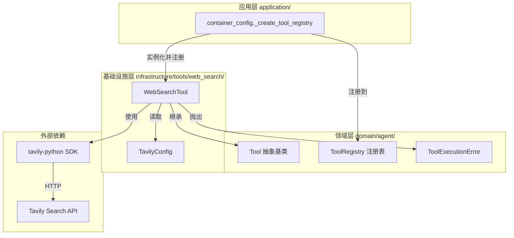
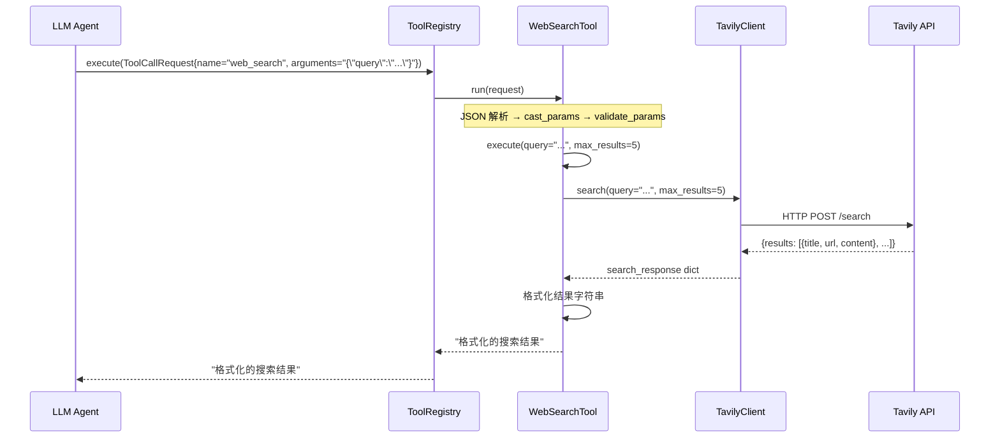

# 设计文档：Web Search Tool

## 概述

本设计为 LLM Agent 提供 Web 搜索能力，基于 Tavily Python SDK（`tavily-python`）实现。WebSearchTool 作为基础设施层的 Tool 适配器，继承 `domain/agent/tools.py` 中的 `Tool` 抽象基类，封装 Tavily API 调用逻辑，注册到 `ToolRegistry` 供 Agent 在对话中调用。

设计遵循项目 DDD 架构规范：
- 领域层（`Tool` 基类、`ToolExecutionError`）定义接口和异常
- 基础设施层（`WebSearchTool`、`TavilyConfig`）提供具体实现
- 应用层（`container_config.py`）负责工具注册编排
- 配置通过 `config.properties` + `PropertiesBaseSettings` 统一管理

## 架构



### 设计决策

1. **TavilyClient 实例化时机**：在 `WebSearchTool.__init__` 中创建 `TavilyClient` 实例，而非每次 `execute` 时创建。因为 `TavilyClient` 是轻量级 HTTP 客户端，复用实例可避免重复初始化开销。

2. **同步 vs 异步调用**：Tavily Python SDK 的 `search()` 方法是同步的。由于 `Tool.execute()` 是 async 方法，WebSearchTool 将直接在 async 方法中调用同步的 `TavilyClient.search()`。Tavily SDK 内部使用 `requests` 库，单次搜索耗时通常在 1-3 秒，在当前 Agent Loop 串行执行工具的场景下可接受。如果未来需要更高并发，可考虑使用 `asyncio.to_thread()` 包装。

3. **配置模块独立性**：`TavilyConfig` 作为独立配置类放在 `infrastructure/tools/web_search/` 包内，遵循现有 `RedisConfig`、`ChatConfig` 的模式，使用 `TAVILY_` 前缀从 `config.properties` 加载配置。

4. **条件注册策略**：在 `_create_tool_registry()` 中检查 `TAVILY_API_KEY` 是否有效，无效时跳过注册并记录日志，不影响其他工具。这与现有 `ListDirTool` 和 `DelegateToAgentTool` 的条件注册模式一致。

## 组件与接口

### 1. TavilyConfig（配置类）

**位置**：`infrastructure/tools/web_search/tavily_config.py`

继承 `PropertiesBaseSettings`，从 `config.properties` 加载 `TAVILY_` 前缀的配置项。

```python
class TavilyConfig(PropertiesBaseSettings):
    model_config = SettingsConfigDict(env_prefix="TAVILY_")

    api_key: str = ""
    search_max_results: int = 5
```

**接口**：
- `api_key: str` — Tavily API 密钥，对应 `TAVILY_API_KEY`
- `search_max_results: int` — 默认最大返回结果数，对应 `TAVILY_SEARCH_MAX_RESULTS`，默认 5

### 2. WebSearchTool（工具实现）

**位置**：`infrastructure/tools/web_search/web_search_tool.py`

继承 `Tool` 抽象基类，封装 Tavily 搜索调用。

```python
class WebSearchTool(Tool):
    def __init__(self, api_key: str, default_max_results: int = 5): ...

    @property
    def name(self) -> str:          # 返回 "web_search"
    @property
    def description(self) -> str:   # 返回工具功能描述
    @property
    def parameters(self) -> dict:   # JSON Schema 参数定义

    async def execute(self, **kwargs) -> str:  # 执行搜索并返回格式化结果
```

**构造参数**：
- `api_key: str` — Tavily API 密钥，传递给 `TavilyClient`
- `default_max_results: int` — 默认最大结果数，当 `execute` 未传 `max_results` 时使用

**parameters JSON Schema**：
```json
{
  "type": "object",
  "properties": {
    "query": {
      "type": "string",
      "description": "搜索关键词"
    },
    "max_results": {
      "type": "integer",
      "description": "最大返回结果数"
    }
  },
  "required": ["query"]
}
```

**execute 流程**：
1. 从 kwargs 提取 `query`（必填）和 `max_results`（可选，默认取 `default_max_results`）
2. 调用 `TavilyClient.search(query=query, max_results=max_results)`
3. 从返回的 `results` 列表中提取每条结果的 `title`、`url`、`content`
4. 格式化为可读字符串，各结果之间用 `---` 分隔
5. 异常时包装为 `ToolExecutionError` 抛出

**返回格式示例**：
```
[1] 标题文本
URL: https://example.com/page
摘要: 这是搜索结果的内容摘要...
---
[2] 另一个标题
URL: https://example.com/other
摘要: 另一条结果的内容摘要...
```

### 3. 包导出（__init__.py）

**位置**：`infrastructure/tools/web_search/__init__.py`

```python
from .web_search_tool import WebSearchTool

__all__ = ["WebSearchTool"]
```

### 4. 工具注册（container_config.py 修改）

在 `_create_tool_registry()` 函数中，filesystem 工具注册之后添加 WebSearchTool 的条件注册逻辑：

```python
# 条件注册 WebSearchTool
try:
    from infrastructure.tools.web_search.tavily_config import tavily_config
    if tavily_config.api_key:
        from infrastructure.tools.web_search import WebSearchTool
        registry.register(WebSearchTool(
            api_key=tavily_config.api_key,
            default_max_results=tavily_config.search_max_results,
        ))
    else:
        logger.warning("TAVILY_API_KEY 未配置，跳过 WebSearchTool 注册")
except ImportError:
    logger.debug("WebSearchTool 不可用，跳过注册")
```

### 5. 配置项（config.properties 新增）

```properties
# -------------------------------------------
# Tavily Web 搜索配置
# -------------------------------------------
TAVILY_API_KEY=
TAVILY_SEARCH_MAX_RESULTS=5
```

## 数据模型

本功能不引入新的领域实体或值对象。数据流如下：



**Tavily SDK 返回数据结构**（关键字段）：
```python
{
    "results": [
        {
            "title": str,      # 结果标题
            "url": str,        # 结果链接
            "content": str,    # 内容摘要
            "score": float,    # 相关性评分
        },
        ...
    ]
}
```

WebSearchTool 仅使用 `title`、`url`、`content` 三个字段进行格式化输出。


## 正确性属性（Correctness Properties）

*属性（Property）是指在系统所有合法执行路径中都应成立的特征或行为——本质上是对系统应做什么的形式化陈述。属性是连接人类可读规格说明与机器可验证正确性保证之间的桥梁。*

以下属性基于需求文档中的验收标准推导而来，经过冗余消除后保留具有独立验证价值的属性。

### Property 1: 配置读取正确性

*对于任意*有效的 `TAVILY_API_KEY` 字符串和 `TAVILY_SEARCH_MAX_RESULTS` 整数值，通过 `TavilyConfig` 读取后，`api_key` 和 `search_max_results` 字段应与写入 config.properties 的值一致。当 `TAVILY_SEARCH_MAX_RESULTS` 未设置时，默认值应为 5。

**Validates: Requirements 1.1, 1.2**

### Property 2: 条件注册正确性

*对于任意* API 密钥字符串，当密钥为非空字符串时，ToolRegistry 中应包含名为 `"web_search"` 的工具；当密钥为空字符串或未设置时，ToolRegistry 中不应包含 `"web_search"` 工具，且其他已注册工具（如 filesystem 工具）不受影响。

**Validates: Requirements 1.3, 3.2, 3.3**

### Property 3: 搜索结果格式化完整性

*对于任意*包含 `title`、`url`、`content` 字段的搜索结果列表，WebSearchTool 的格式化输出应包含每条结果的标题、URL 和内容摘要，且各结果之间使用分隔符区分。

**Validates: Requirements 2.4, 2.5**

### Property 4: 异常包装正确性

*对于任意* TavilyClient 调用过程中抛出的异常，WebSearchTool 应将其包装为 `ToolExecutionError`，且错误信息中包含原始异常的描述文本。

**Validates: Requirements 2.6**

## 错误处理

| 错误场景 | 处理方式 | 异常类型 |
|---------|---------|---------|
| `TAVILY_API_KEY` 为空或未设置 | 注册阶段记录警告日志，跳过注册 | 无异常，静默跳过 |
| `query` 参数缺失 | `Tool.run()` 流水线中 `validate_params` 检测到必填参数缺失 | `ToolParameterValidationError` |
| `query` 参数类型错误 | `Tool.run()` 流水线中 `validate_params` 检测到类型不匹配 | `ToolParameterValidationError` |
| Tavily API 网络超时/连接失败 | `execute` 捕获异常，包装为 `ToolExecutionError` | `ToolExecutionError` |
| Tavily API 返回错误（如 401 认证失败） | `execute` 捕获异常，包装为 `ToolExecutionError` | `ToolExecutionError` |
| Tavily API 返回空结果 | 正常返回空结果提示字符串，如 "未找到相关搜索结果" | 无异常 |
| JSON 解析 `request.arguments` 失败 | `Tool.run()` 流水线中捕获 `JSONDecodeError` | `ToolParameterValidationError` |

错误处理策略与现有工具（如 `ReadFileTool`）保持一致：
- 参数校验错误由 `Tool` 基类的 `run()` 方法统一处理
- 业务执行错误在 `execute()` 中捕获并包装为 `ToolExecutionError`
- 所有异常最终由 Agent Loop 捕获并回传给 LLM

## 测试策略

### 测试框架

- 单元测试：`pytest` + `pytest-asyncio`
- 属性测试：`hypothesis`（已在 `pyproject.toml` dev 依赖中）
- Mock：`unittest.mock`（标准库）

### 属性测试（Property-Based Testing）

每个属性测试至少运行 100 次迭代，使用 Hypothesis 生成随机输入。

| 属性 | 测试描述 | 生成策略 |
|-----|---------|---------|
| Property 1 | 生成随机 api_key 和 max_results，验证 TavilyConfig 读取一致性 | `st.text()` + `st.integers(min_value=1, max_value=20)` |
| Property 2 | 生成随机 api_key（含空字符串），验证注册表中工具存在性 | `st.text()` 含空字符串 |
| Property 3 | 生成随机搜索结果列表（含随机 title/url/content），验证格式化输出完整性 | `st.lists(st.fixed_dictionaries({...}))` |
| Property 4 | 生成随机异常类型和消息，验证包装后的 ToolExecutionError 保留原始信息 | `st.text()` 生成异常消息 |

每个属性测试须包含注释标签：
```python
# Feature: web-search-tool, Property 1: 配置读取正确性
# Feature: web-search-tool, Property 2: 条件注册正确性
# Feature: web-search-tool, Property 3: 搜索结果格式化完整性
# Feature: web-search-tool, Property 4: 异常包装正确性
```

### 单元测试

单元测试聚焦于具体示例和边界情况，与属性测试互补：

- **WebSearchTool 接口合规**：验证继承 `Tool`、`name` 返回 `"web_search"`、`parameters` schema 结构正确（验收标准 2.1, 2.2, 2.3）
- **空结果处理**：Mock TavilyClient 返回空 results 列表，验证返回 "未找到相关搜索结果"
- **max_results 默认值**：不传 `max_results` 时使用配置默认值

### 测试文件位置

```
test/
  infrastructure/
    tools/
      web_search/
        test_web_search_tool.py          # 单元测试 + 属性测试
        test_tavily_config.py            # 配置类测试
```
