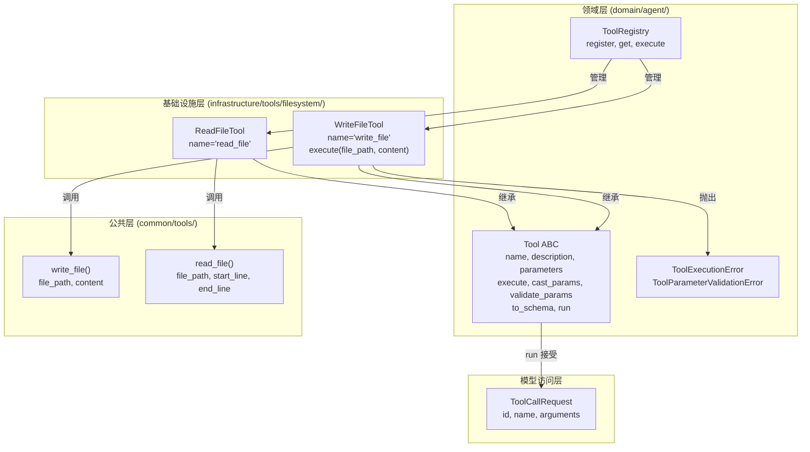
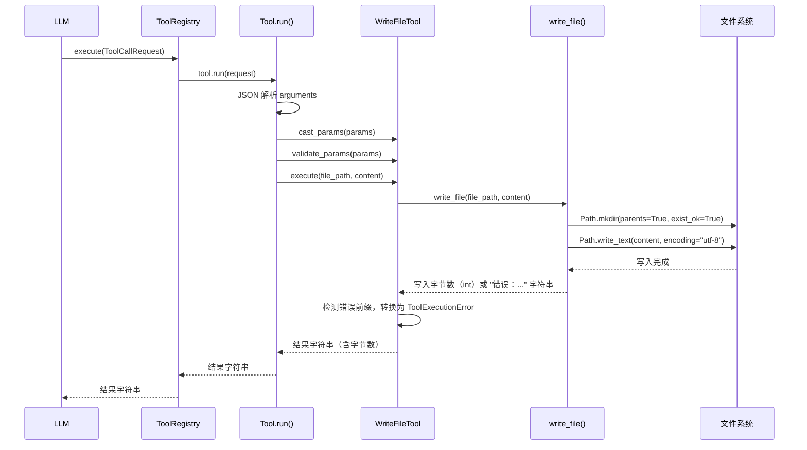
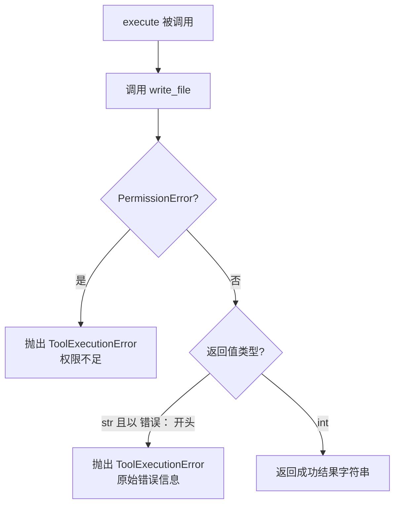

# Design Document: WriteFileTool

## Overview

WriteFileTool 是一个继承自 `Tool` 抽象基类的具体工具实现，为 LLM Agent 提供文件内容写入能力。该工具位于基础设施层 `infrastructure/tools/filesystem/write_file_tool.py`，遵循 DDD 六边形架构：领域层 `Tool` ABC 定义端口接口，WriteFileTool 作为适配器实现。

工具底层需在 `common/tools/common_tools.py` 中新增 `write_file()` 工具函数（与已有的 `read_file()` 对称），WriteFileTool 仅需做参数透传和错误转换（字符串错误 → ToolExecutionError），将其适配为符合 Tool 接口规范的标准工具实现。

### 设计决策

1. **新增 `write_file()` 而非在 WriteFileTool 中直接实现**：与 `read_file()` 保持对称设计，文件操作逻辑统一放在 common 层，基础设施层仅做适配。未来其他工具也可复用 `write_file()`。
2. **返回写入字节数而非写入内容**：写入操作的结果反馈应简洁，字节数足以让 LLM 确认写入成功，避免回传大量内容浪费 token。
3. **自动创建父目录**：LLM Agent 创建文件时通常不会先创建目录，`write_file()` 使用 `Path.mkdir(parents=True, exist_ok=True)` 自动处理，减少工具调用次数。
4. **错误检测策略**：与 `read_file()` 一致，`write_file()` 返回以 `"错误："` 开头的字符串表示失败（如路径是目录），WriteFileTool 检测此前缀并转换为 `ToolExecutionError`。成功时返回整数（字节数），通过 `isinstance(result, int)` 区分成功与失败。
5. **file_path 和 content 均为必填参数**：写入操作必须明确指定目标路径和内容，不设默认值。

## Architecture



### 调用流程



## Components and Interfaces

### write_file 工具函数

```python
def write_file(file_path: str, content: str) -> int | str:
    """将内容写入指定文件，自动创建父目录。

    Args:
        file_path: 目标文件路径。
        content: 要写入的文本内容。

    Returns:
        成功时返回写入的字节数（int）。
        失败时返回以 "错误：" 开头的错误描述字符串。

    Raises:
        PermissionError: 写入权限不足时抛出。
    """
```

实现逻辑：
1. `path = Path(file_path)`
2. 检查 `path.is_dir()`，若是目录则返回 `"错误：路径是目录而非文件 - {file_path}"`
3. `path.parent.mkdir(parents=True, exist_ok=True)` 自动创建父目录
4. `path.write_text(content, encoding="utf-8")` 写入内容（返回字节数）
5. 返回写入字节数

### WriteFileTool 类

```python
class WriteFileTool(Tool):
    """文件内容写入工具，支持自动创建父目录。"""

    @property
    def name(self) -> str:
        """返回 'write_file'。"""

    @property
    def description(self) -> str:
        """返回中文功能描述。"""

    @property
    def parameters(self) -> dict[str, Any]:
        """返回 JSON Schema 参数定义。"""

    async def execute(self, file_path: str, content: str) -> str:
        """执行文件写入。

        1. 调用 write_file(file_path, content)
        2. 若返回值为字符串且以 "错误：" 开头，转换为 ToolExecutionError
        3. 若捕获 PermissionError，转换为 ToolExecutionError
        4. 成功时返回包含写入字节数的结果字符串
        """
```

### 参数 Schema

```json
{
  "type": "object",
  "properties": {
    "file_path": {
      "type": "string",
      "description": "要写入的目标文件路径"
    },
    "content": {
      "type": "string",
      "description": "要写入文件的文本内容"
    }
  },
  "required": ["file_path", "content"]
}
```

### 依赖关系

| 组件 | 依赖 | 说明 |
|------|------|------|
| WriteFileTool | Tool ABC | 继承抽象基类 |
| WriteFileTool | write_file() | 复用文件写入逻辑 |
| WriteFileTool | ToolExecutionError | 错误转换目标异常 |
| write_file() | pathlib.Path | 文件系统操作 |

## Data Models

### 参数模型

| 参数 | 类型 | 必填 | 默认值 | 约束 | 说明 |
|------|------|------|--------|------|------|
| file_path | string | 是 | - | 非空 | 目标文件路径 |
| content | string | 是 | - | 无 | 要写入的文本内容（可为空字符串） |

### 返回值格式

`write_file()` 函数返回值为联合类型 `int | str`：
- 成功：返回 `int`，表示写入的字节数
- 失败：返回 `str`，以 `"错误："` 开头的错误描述

`WriteFileTool.execute()` 返回值始终为 `str`：
- 成功：`"成功写入文件 {file_path}，共 {bytes_written} 字节"`
- 失败：抛出 `ToolExecutionError`

### write_file 与 read_file 对称设计

| 维度 | read_file | write_file |
|------|-----------|------------|
| 位置 | common/tools/common_tools.py | common/tools/common_tools.py |
| 参数 | file_path, start_line, end_line | file_path, content |
| 成功返回 | str（带行号的内容） | int（写入字节数） |
| 失败返回 | str（"错误：..."） | str（"错误：..."） |
| 权限异常 | 抛出 PermissionError | 抛出 PermissionError |


## Correctness Properties

*A property is a characteristic or behavior that should hold true across all valid executions of a system — essentially, a formal statement about what the system should do. Properties serve as the bridge between human-readable specifications and machine-verifiable correctness guarantees.*

### Property 1: Write-read round trip

*For any* valid file path and any text content string, writing the content via `WriteFileTool.execute(file_path, content)` and then reading the file back via `read_file(file_path)` should produce content equivalent to the original (after stripping line number prefixes). This ensures write and read are consistent inverses.

**Validates: Requirements 1.3, 1.4, 1.5, 3.1, 3.3, 6.1**

### Property 2: Write idempotence

*For any* valid file path and any text content string, calling `WriteFileTool.execute(file_path, content)` twice consecutively on the same file should produce the same file content. Reading the file after the first write and after the second write should return identical results.

**Validates: Requirements 6.2**

### Property 3: Parent directory auto-creation

*For any* file path whose parent directories do not exist, calling `WriteFileTool.execute(file_path, content)` should succeed (not raise an exception), and the file should exist at the specified path after the call. All intermediate parent directories should be created automatically.

**Validates: Requirements 1.2, 3.2**

### Property 4: Directory path rejection

*For any* file path that points to an existing directory (not a file), calling `WriteFileTool.execute(file_path, content)` should raise `ToolExecutionError`, and the error message should contain the path information.

**Validates: Requirements 1.7, 4.1, 4.3**

### Property 5: Byte count correctness

*For any* valid file path and any text content string, the integer byte count returned by `write_file(file_path, content)` should equal `len(content.encode("utf-8"))`. This ensures the reported byte count accurately reflects the UTF-8 encoded size of the written content.

**Validates: Requirements 1.6, 3.4**

## Error Handling

WriteFileTool 的错误处理分为两层，与 ReadFileTool 保持一致的模式：

### 1. 文件写入层（write_file 返回值检测）

`write_file()` 函数通过返回以 `"错误："` 开头的字符串来表示失败。WriteFileTool 检测此前缀并转换为 `ToolExecutionError`：

| write_file 返回值 | 对应场景 | ToolExecutionError 信息 |
|-------------------|----------|------------------------|
| `"错误：路径是目录而非文件 - {path}"` | file_path 指向已存在的目录 | 原始错误信息 |

### 2. 权限错误处理

`write_file()` 中 `Path.write_text()` 或 `Path.mkdir()` 可能抛出 `PermissionError`。WriteFileTool 的 `execute` 方法捕获 `PermissionError` 并转换为 `ToolExecutionError`，错误信息说明权限不足：

| 异常 | 对应场景 | ToolExecutionError 信息 |
|------|----------|------------------------|
| PermissionError | 目录创建或文件写入权限不足 | `"权限不足，无法写入文件: {file_path}"` |

### 3. Tool.run() 流水线层

`Tool.run()` 基类方法已处理：
- JSON 解析失败 → `ToolParameterValidationError`
- 类型不匹配 → `ToolParameterValidationError`
- 必填参数缺失（file_path 或 content）→ `ToolParameterValidationError`
- execute 中未捕获的异常 → 包装为 `ToolExecutionError`

### 错误处理流程



## Testing Strategy

### 测试框架与工具

- **单元测试**: pytest + pytest-asyncio
- **属性测试**: Hypothesis（项目已使用）
- **测试位置**: `epsilon-boot/test/infrastructure/tools/filesystem/`

### 属性测试（Property-Based Tests）

使用 Hypothesis 库，每个属性测试运行至少 100 次迭代。每个测试通过注释标注对应的设计属性。每个 correctness property 由单个属性测试实现。

**Hypothesis 策略设计**：
- 文件内容策略：生成随机文本内容（含多行、空行、Unicode 字符），使用 `st.text()` 生成
- 文件路径策略：基于 `tmp_path` 生成随机文件名和嵌套目录路径
- 目录路径策略：在 `tmp_path` 下创建随机目录名用于目录拒绝测试

**测试配置**：

```python
@settings(max_examples=100, deadline=2000)
```

**属性测试清单**：

| 属性 | 标签 | 说明 |
|------|------|------|
| Property 1 | Feature: write-file-tool, Property 1: Write-read round trip | 写入后读回内容一致 |
| Property 2 | Feature: write-file-tool, Property 2: Write idempotence | 相同内容写两次结果一致 |
| Property 3 | Feature: write-file-tool, Property 3: Parent directory auto-creation | 自动创建父目录后写入成功 |
| Property 4 | Feature: write-file-tool, Property 4: Directory path rejection | 目录路径抛出 ToolExecutionError |
| Property 5 | Feature: write-file-tool, Property 5: Byte count correctness | 返回字节数等于 UTF-8 编码长度 |

### 单元测试（Unit Tests）

单元测试覆盖具体示例和边界情况，与属性测试互补。避免编写过多单元测试，属性测试已覆盖大量输入场景。

| 测试场景 | 说明 |
|----------|------|
| 基本定义验证 | name == "write_file"、description 非空中文、parameters schema 结构正确 |
| to_schema 格式 | 返回 OpenAI function calling 格式，name 为 "write_file" |
| 必填参数校验 | file_path 和 content 均在 required 列表中 |
| ToolRegistry 集成 | register 后通过 ToolCallRequest 调用成功 |
| 空内容写入 | content 为空字符串时创建空文件（0 字节） |
| 权限不足错误 | 无写入权限时抛出 ToolExecutionError |
| 缺少参数错误 | 缺少 file_path 或 content 时抛出 ToolParameterValidationError |

### 测试文件组织

```
test/infrastructure/tools/filesystem/
├── test_write_file_tool_property.py    # 属性测试（5 个属性）
├── test_write_file_tool.py             # 单元测试
├── test_read_file_tool_property.py     # 已有：ReadFileTool 属性测试
└── test_read_file_tool.py              # 已有：ReadFileTool 单元测试
```
