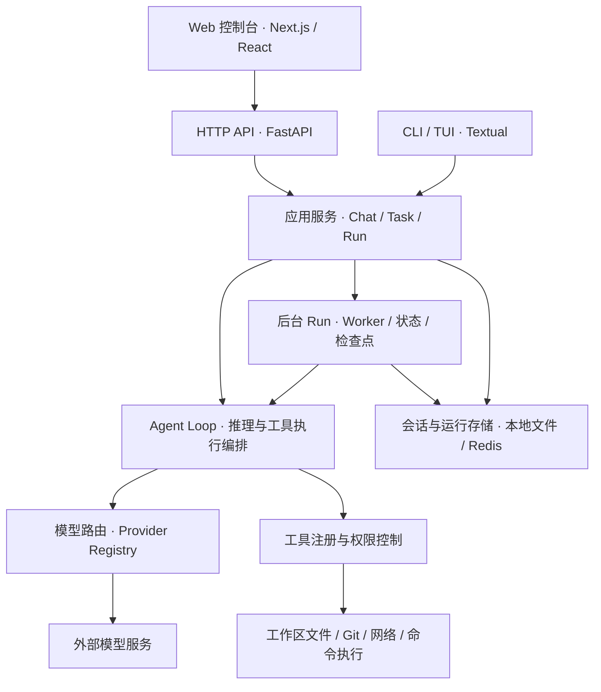

# Epsilon

一个面向开源交流与学习的自研 AI Agent 工作台。

## 一、项目介绍

Epsilon 围绕「让大模型通过工具完成任务」这一目标，探索通用 Agent 的设计与工程实现。项目将模型接入、Agent 执行循环、工具调用、上下文管理和后台任务运行整合在一起，提供 Web 控制台与 CLI / TUI 交互入口。

本项目的自研重点是 Agent 的执行与编排机制，包括 ReAct 循环、任务状态管理、工具权限、Agent 委派和运行过程观测。大模型能力通过外部模型服务接入。希望通过开放代码与设计文档，和对 Agent 感兴趣的开发者一起学习、交流、验证想法。

### 主要功能

| 能力 | 说明 |
| --- | --- |
| 对话与任务执行 | 支持多轮对话、SSE 流式输出，以及以目标为输入的任务执行。 |
| 自研 Agent Loop | 按「模型推理 → 工具调用 → 结果回填」循环推进，结合上下文、轮次和预算策略控制执行。 |
| 多模型接入 | 接入 OpenAI 兼容的模型服务，按模型名称路由；同一模型存在多个提供商时支持轮询分发。 |
| 工具调用 | 提供文件操作、代码检索、Git 操作、网络搜索与抓取、HTTP 请求、Shell / Python 执行等能力，按配置和权限开放。 |
| 多 Agent 协作 | 支持命名 Agent、工具子集隔离与任务委派，结合工作流阶段和角色配置组织执行。 |
| 后台长任务 | 通过 Run 管理排队、运行、暂停、继续、取消和审批恢复，记录事件、检查点与执行结果。 |
| 会话与运行记录 | 提供本地文件和 Redis 存储适配，保存会话上下文及后台任务状态。 |
| 执行可观测性 | 展示任务状态、工具执行轨迹、Token 用量和运行事件，并提供日志、Prometheus 指标与 OpenTelemetry 接入。 |

项目仍在持续迭代。检查点恢复具有明确的恢复边界，不保证外部工具副作用恰好执行一次；角色能力强化、子 Run 等能力受配置开关控制。具体行为与启用条件请参阅[项目总览](docs/project-overview.md)和[配置说明](docs/configuration.md)。

## 二、结构设计

### 整体架构

项目采用前后端分离结构：`epsilon-client` 提供 Web 交互与执行状态展示，`epsilon-boot` 承载 Agent 核心逻辑、HTTP API 和终端入口。Web 请求通过 Next.js rewrites 转发到 FastAPI；CLI / TUI 复用后端应用服务。



### 后端分层

后端采用 **DDD + 六边形架构（Ports & Adapters）**，将核心规则与外部实现分离，通过自建 DI 容器统一装配依赖。

| 层次 | 目录 | 职责 |
| --- | --- | --- |
| 应用层 | `epsilon-boot/src/application/` | HTTP / CLI 入口、聊天与任务用例、后台 Run 协调、依赖装配和生命周期管理。 |
| 领域层 | `epsilon-boot/src/domain/` | Agent Loop、领域对象、执行策略、状态机，以及模型、工具、会话、工作区等 Port 接口。 |
| 基础设施层 | `epsilon-boot/src/infrastructure/` | 模型调用、工具执行、存储、后台 Worker、可观测性等 Adapter 实现。 |
| 共享内核 | `epsilon-boot/src/common/` | DI 容器、配置管理、公共异常与通用能力。 |

领域层通过 Port 描述所需能力，不直接依赖 FastAPI、模型 SDK 或存储实现。应用层组织用例，基础设施层实现外部能力；组合根负责绑定 Port 与 Adapter。这样的结构便于替换模型和存储、扩展工具，也便于独立测试执行规则。

### 核心执行流程

1. **接收目标**：用户通过 Web、HTTP API 或终端提交对话消息或任务目标。
2. **准备上下文**：应用服务加载会话，组装提示词、模型配置及当前 Agent 可用的工具。
3. **推进执行**：Agent Loop 调用模型，执行获准的工具，将结果回填上下文，继续下一轮或返回结果。
4. **管理长任务**：后台任务由 Worker 领取执行，通过 Run 状态、事件与检查点支持进度查询、继续和受限恢复。
5. **呈现结果**：返回文本、任务结果与执行记录；Web 控制台分别展示聊天、任务和后台 Run 的状态。

### 目录结构

```text
epsilon/
├── epsilon-boot/                 # Python Agent 后端
│   ├── main.py                   # 服务启动入口
│   ├── config.properties         # 主配置文件
│   ├── src/
│   │   ├── application/          # 应用服务与入口
│   │   ├── domain/               # 领域模型、策略与 Port
│   │   ├── infrastructure/       # 外部能力与 Adapter
│   │   └── common/               # 共享内核
│   ├── prompts/                  # 提示词资产
│   └── test/                     # 后端测试
├── epsilon-client/               # Next.js + React + TypeScript 前端
│   └── src/
│       ├── app/                  # 页面、布局与样式
│       ├── components/           # Chat / Task / Run 组件
│       ├── hooks/                # 聊天与运行状态管理
│       └── lib/                  # API 封装与数据契约
├── docs/                         # 架构、接口、配置、开发与运维文档
│   ├── steering/                 # 项目开发规范
│   ├── adr/                      # 架构决策记录
│   └── spec/                     # 功能需求、设计与任务拆分
├── agents/                       # 辅助项目开发的 Agent 角色说明
├── scripts/                      # 辅助脚本与评估工具
├── tests/                        # 根级测试与辅助验证
└── LICENSE                       # Apache License 2.0
```

进一步了解实现或参与开发，可从[架构说明](docs/architecture.md)、[前端说明](docs/frontend.md)、[接口文档](docs/api.md)、[工具系统](docs/tools.md)和[开发指南](docs/development.md)开始。开发前请阅读[项目规范](docs/steering/README.md)。

## 三、开源声明

本项目基于 **Apache License 2.0** 开源，完整条款见 [LICENSE](LICENSE)。使用、修改与分发请遵循该许可证；项目所使用的第三方依赖遵循各自的许可证。

Epsilon 以开源交流、学习研究和自研 Agent 实践为出发点，欢迎通过 Issue 交流问题与思路，通过 Pull Request 贡献代码、文档和测试。

项目按许可证约定以「现状」提供，不附带任何明示或默示担保。模型服务与其他外部服务需自行配置，其使用受相应服务条款约束。
