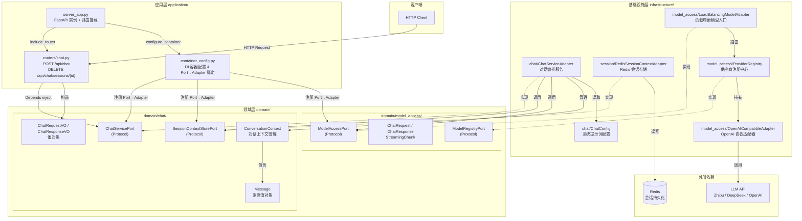
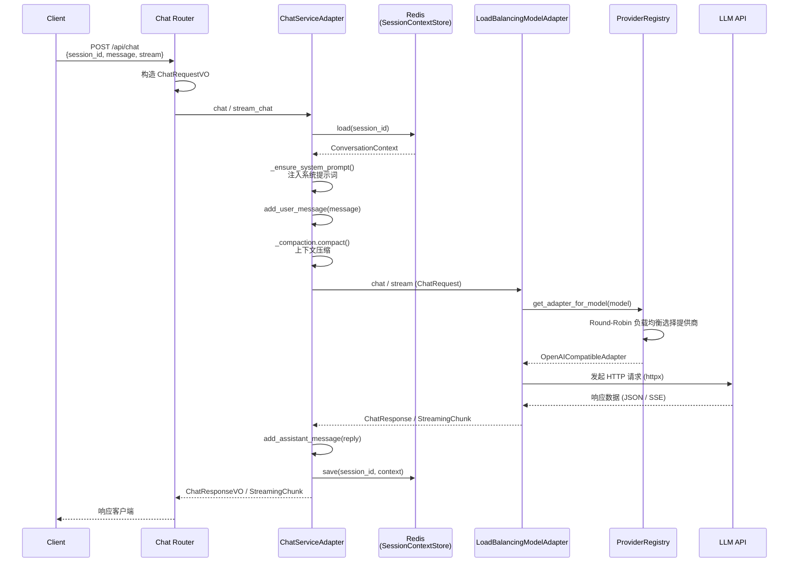
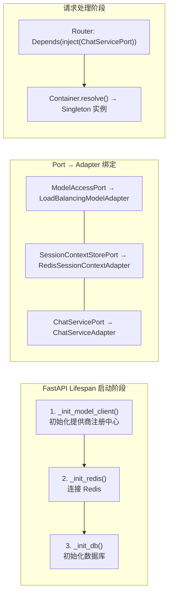
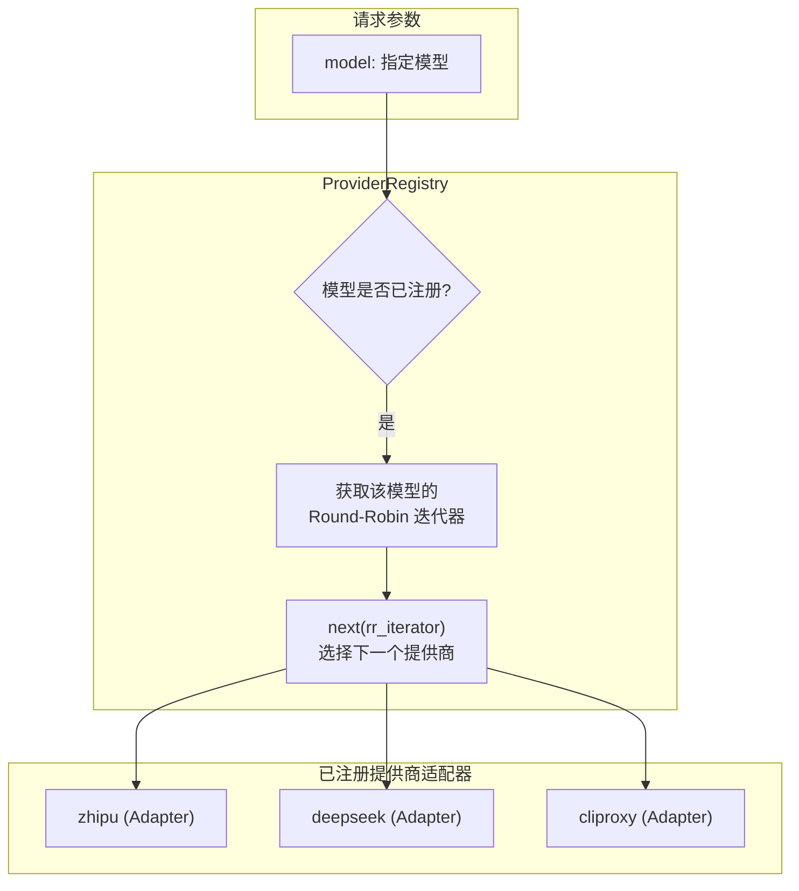
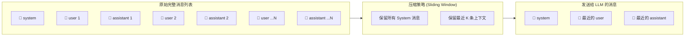

# Chat 功能架构全景

## 1. DDD 分层架构总览

## 2. 对话请求流程

## 3. 依赖注入与生命周期管理

## 4. 负载均衡路由策略

## 5. 上下文压缩策略 (Context Compaction)

---

以上架构图展示了 Chat 功能的核心实现细节：

- **基于端口/适配器模式**: 确保了领域逻辑与底层 LLM 提供商、存储介质的完全解耦。
- **负载均衡**: 通过 `ProviderRegistry` 实现了生产级的多供应商轮询调度。
- **上下文管理**: 结合滑动窗口压缩与 Redis 持久化，兼顾了 LLM Token 成本与对话历史完整性。
