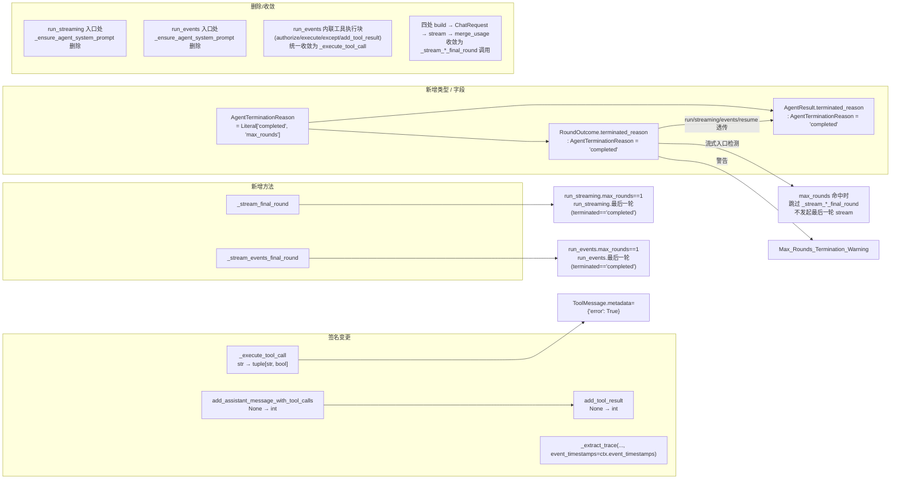
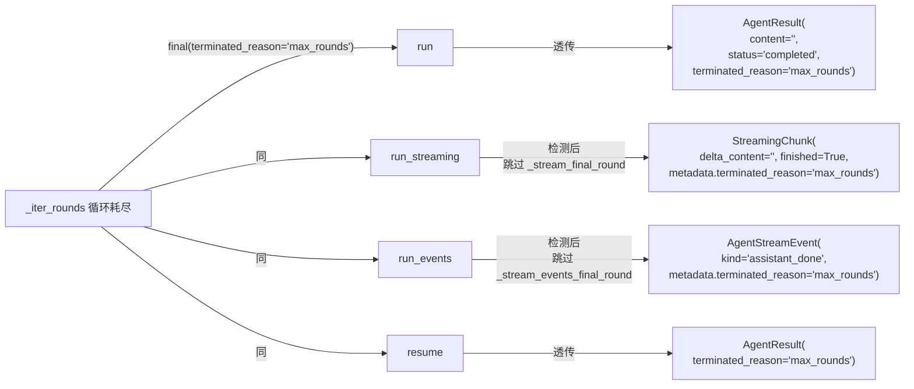
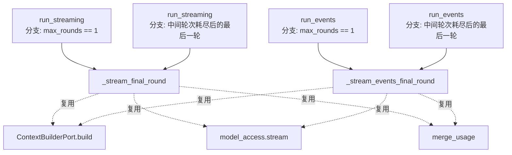

# 设计文档：Agent Adapter Refactor v2（三入口轮次复用收口与领域字段升级）

## 概述

本期是 v1（`docs/spec/agent-adapter-refactor/`）落地后的第二轮内部质量重构，仅触及 `infrastructure/agent/react_agent_adapter.py`、`infrastructure/task/task_agent_adapter.py`、`infrastructure/chat/chat_service_adapter.py` 与 `domain/chat/context.py`、`domain/agent/value_objects.py`，不引入新 Port、不调整 HTTP/SSE 契约、不调整审批语义、不新增配置键、不调整模型路由，前端代码不变。核心思路是：

1. 把 `system_prompt` 注入收口为 `_iter_rounds` 单一调用点，三入口入口处的 `_ensure_agent_system_prompt` 全部删除；`max_rounds == 1` 分支显式注入并加注释（覆盖需求 1）。
2. 抽取 `_stream_final_round` / `_stream_events_final_round` 两个私有方法，替代 4 处近似复制的"最后一轮 build → ChatRequest → stream → usage 合并"逻辑（覆盖需求 2）。
3. `_execute_tool_call` 改为返回 `(result: str, is_error: bool)`，`run_events` 在外侧根据 `is_error` 选择 `tool_result` / `tool_error` 事件 kind；`ToolMessage.metadata` 在工具失败时写入 `{"error": True}`，让事件流与 LLM 上下文对齐失败状态（覆盖需求 3）。
4. `ConversationContext.add_assistant_message_with_tool_calls` 与 `add_tool_result` 返回类型由 `None` 改为 `int`（新追加消息的索引），消除 `context.message_count - 1` 的隐式索引依赖（覆盖需求 4）。
5. `event_timestamps: dict[int, int]` 与 `session_id: str | None` 升级为 `ConversationContext` 的正式可选字段，参与 `to_dict` / `from_dict` 序列化并保持向后兼容；删除全部 `setattr` / `getattr` 用法（覆盖需求 5）。
6. HITL resume 路径下 `event_timestamps` 通过 `ApprovalInterrupt.context_snapshot = context.to_dict()` 自然回环（覆盖需求 6）。
7. `assistant_delta` 注释明确"累加片段，可能整段也可能分块"语义（A 路线，仅文档化，覆盖需求 7）。
8. **`max_rounds` 命中暴露而非补救**（业内共识方案）：新增 `AgentTerminationReason = Literal["completed", "max_rounds"]` 类型别名；`AgentResult` 与 `RoundOutcome` 各新增可选字段 `terminated_reason: AgentTerminationReason = "completed"`；`_iter_rounds` 在循环耗尽且最后一轮 `tool_calls` 时**不**追加任何模型调用，改为产出 `RoundOutcome(kind="final", terminated_reason="max_rounds", ...)` 并记录 `Max_Rounds_Termination_Warning`；`run` / `run_streaming` / `run_events` / `resume` 四入口透传该 reason 到 `AgentResult.terminated_reason`，由调用方决策续跑或终止。该方案对齐 OpenAI Assistants（`incomplete_details.reason`）、LangGraph（`GraphRecursionError`）、CrewAI（`max_iter` failed）等业内主流 Agent 框架的"暴露超限信号、不做内部补救"共识（覆盖需求 8）。

本设计严格遵循 [docs/steering/ddd-architecture.md](../../steering/ddd-architecture.md)（领域字段仅使用 Python 标准库类型；`Final_Round_Stream_Helper` 与 `_iter_rounds` 仍位于 `infrastructure/agent/`，不向 `domain/` 反向暴露）、[docs/steering/code-documentation.md](../../steering/code-documentation.md)（所有新增/修改的公开符号配中文 docstring）、[docs/steering/config-source.md](../../steering/config-source.md)（不新增配置）、[docs/steering/uv-package-manager.md](../../steering/uv-package-manager.md)（不调整依赖）。

#### 设计决策

| 决策 | 选定方案 | 理由 |
| --- | --- | --- |
| 工具执行返回形态（需求 3） | (b) 路线：`_execute_tool_call(...) -> tuple[str, bool]`，由 `run_events` 在外侧根据 `is_error` 选择事件 kind | 保持 `_execute_tool_call` 单一执行职责；事件 yield 留在生成器入口，与 v1 `_iter_rounds`「推进者只产出 outcome、不直接发事件」的设计风格一致；不需要把 `event_emitter` 异步回调耦合进工具执行流水线 |
| `assistant_delta` 语义（需求 7） | A 路线：仅在 `domain/agent/value_objects.py` 与 `docs/agent.md` 文档化"累加片段"语义，不引入额外 `model_access.stream(...)` 调用 | 与现有 `run_events` 中间轮次产出整段文本的行为兼容；不增加模型调用次数；前端按累加渲染即可 |
| `max_rounds` 命中处理（需求 8） | 暴露 `terminated_reason` 信号，不做"recovery chat"补救：`AgentTerminationReason` 类型 + `AgentResult.terminated_reason` 字段 + `RoundOutcome.terminated_reason` 字段 + `Max_Rounds_Termination_Warning` 警告日志；流式入口在检测到 `terminated_reason="max_rounds"` 时跳过 `_stream_*_final_round`、不发起最后一轮 stream | 业内共识方案（OpenAI Assistants / LangGraph / CrewAI / AutoGPT 均不做内部补救），把"轮数超限"信号原样暴露给调用方。前期讨论的"额外 chat 回灌"会掩盖超限信号、阻碍长跑续跑、叠加额外推理成本，已根据用户反馈撤销 |
| `event_timestamps` / `session_id` 升级（需求 5） | 升级为正式可选字段，`to_dict` 默认值省略（紧凑序列化），`from_dict` 缺失视为默认值 | 满足 NFR-4 向后兼容；老快照（仅含 `messages`）反序列化后再 `to_dict` 仍只输出 `messages`，不污染存储格式 |
| `to_dict` 紧凑策略 | `event_timestamps` 为空 dict 时省略；`session_id` 为 `None` 时省略；二者非默认值时分别附带 | 与既有 `BaseMessage.to_dict` 在 `metadata` 为空时省略的策略一致；避免每条 ConversationContext 都额外携带两个空键，减小 redis / 文件持久化体积 |
| `event_timestamps` JSON 键类型 | `from_dict` 时把 JSON 反序列化得到的 `dict[str, int]` 显式 `int(k) → v` 还原为 `dict[int, int]` | JSON 不支持 int 键，`json.dumps({1: 1000})` 会自动 stringify 成 `{"1": 1000}`；反向还原避免 `_extract_trace` 在用 `int` 索引查表时全部 miss |
| `add_*` 返回类型由 `None` → `int`（需求 4） | 仅修改 `add_assistant_message_with_tool_calls` 与 `add_tool_result`；`add_assistant_message` / `add_user_message` / `add_system_message` 不动 | 后三者不在打戳路径上；新返回值是 PEP 484 兼容的"加宽返回类型"，已有忽略返回值的 caller 不受影响（mypy / pyright 不会报错） |
| HITL resume 时间戳回环（需求 6） | 利用 `ApprovalInterrupt.context_snapshot = context.to_dict()` 自然携带 `event_timestamps`；不引入额外字段 | `to_dict` / `from_dict` 已是双向兼容的回环；resume 还原后 `event_timestamps` 正式字段自动恢复，无需 `ApprovalInterrupt` 增加并行字段 |

## 架构

### v2 顶层方法变更图



### 单轮推进序列（v2 在循环耗尽分支按 last kind 决策 terminated_reason）

```mermaid
sequenceDiagram
    participant Caller as run / run_streaming / run_events
    participant Iter as _iter_rounds
    participant Ctx as ConversationContext
    participant Model as ModelAccessPort
    Caller->>Iter: __aiter__()
    Iter->>Ctx: _ensure_agent_system_prompt（首轮前唯一注入点）
    loop 每轮 round_num ∈ [start_round, effective_terminal]
        Iter->>Model: chat()
        alt no tool_calls
            Iter-->>Caller: yield final(response, terminated_reason='completed'); return
        else has tool_calls (no approval)
            Iter->>Ctx: add_assistant_message_with_tool_calls -> idx
            Iter-->>Caller: yield tool_calls
            Caller->>Caller: 逐工具 _execute_tool_call(ctx, tc, cfg)
        else approval
            Iter->>Ctx: add_assistant_message_with_tool_calls -> idx
            Iter-->>Caller: yield approval; return
        end
    end
    note over Iter: 循环耗尽，按 last kind 决策 terminated_reason
    alt last kind == 'tool_calls' 且 ctx 末尾是 ToolMessage
        Iter->>Iter: logger.warning(Max_Rounds_Termination_Warning)
        Iter-->>Caller: yield final(response=last_response, terminated_reason='max_rounds')
    else last kind == 'text'/'tool_calls(无 ToolMessage)'
        Iter-->>Caller: yield final(response=last_response, terminated_reason='completed')
    end
```

### `max_rounds` 命中时四个入口的 `terminated_reason` 透传



### `_stream_*_final_round` 收敛 4 处复制的调用关系



### 包/目录结构（仅列变更点）

```
epsilon-boot/src/
├── domain/
│   ├── agent/
│   │   └── value_objects.py             # 新增 AgentTerminationReason 类型别名；
│                                        # AgentResult 新增 terminated_reason 字段（默认 'completed'）；
│                                        # AgentStreamEventKind 注释更新（assistant_delta 累加语义）
│   └── chat/
│       └── context.py                   # 升级 event_timestamps / session_id 为正式字段；
│                                        # add_assistant_message_with_tool_calls / add_tool_result 返回 int；
│                                        # to_dict / from_dict 紧凑双向兼容
├── infrastructure/
│   ├── agent/
│   │   ├── round_outcome.py             # RoundOutcome 新增 terminated_reason 字段（默认 'completed'）
│   │   └── react_agent_adapter.py       # 删除 run_streaming/run_events 入口处的 _ensure_agent_system_prompt；
│                                        # 新增 _stream_final_round / _stream_events_final_round；
│                                        # _execute_tool_call 返回 (str, bool)；
│                                        # _iter_rounds 循环耗尽分支按 last kind 决策 terminated_reason 并发警告；
│                                        # 四个入口透传 terminated_reason 到 AgentResult / StreamingChunk.metadata / AgentStreamEvent.metadata；
│                                        # _stamp_event 改为写 ctx.event_timestamps；
│                                        # 删除所有 message_count - 1 表达式
│   ├── chat/
│   │   └── chat_service_adapter.py      # 4 处 setattr → ctx.session_id = ... 直接赋值
│   └── task/
│       └── task_agent_adapter.py        # _extract_trace 读取改为 ctx.event_timestamps（不再 getattr）；
│                                        # 透传 result.terminated_reason 到 TaskResult.metadata（如适用）
├── docs/
│   └── agent.md                         # 同步 assistant_delta 累加语义说明 + terminated_reason 暴露说明
└── ...
```

## 组件与接口

### 1. `ReActAgentAdapter._iter_rounds`（修改循环耗尽分支语义，签名不增参数）

- 位置：`epsilon-boot/src/infrastructure/agent/react_agent_adapter.py`，类内私有方法。
- 变更：循环耗尽分支按 last kind 决策 `terminated_reason` 并产出对应 `RoundOutcome`；当最后一轮为 `tool_calls` 且工具已写回时记录 `Max_Rounds_Termination_Warning` 警告。**不**新增 `final_round_recovery` 参数（不再做内部回灌补救），签名与 v1 保持一致。
- 完整签名（与 v1 一致）：

```python
async def _iter_rounds(
    self,
    context: ConversationContext,
    config: AgentConfig,
    model_access: ModelAccessPort,
    *,
    start_round: int = 1,
    initial_usage: dict[str, int] | None = None,
    terminal_round: int | None = None,
) -> AsyncIterator[RoundOutcome]:
    """统一的轮次推进异步生成器（v2）。

    覆盖 ``run`` / ``run_streaming`` / ``run_events`` / ``resume`` 四个入口的
    单轮推进语义。生成器的产出顺序由 ``RoundOutcome.kind`` 表达。

    本方法在首次进入循环之前以 ``Single_System_Prompt_Injection_Site`` 语义
    幂等注入 ``config.system_prompt``，是除 "``max_rounds == 1`` 分支显式注入"
    之外**唯一**的生产代码注入点（v2 收口）。

    循环耗尽（已达 ``effective_terminal`` 仍未自然终止）时按最后一轮的
    模型响应决策 ``RoundOutcome.terminated_reason``：

    - 若最后一轮 ``last_response.tool_calls`` 非空且 ``ConversationContext`` 末尾
      是 ``ToolMessage``（即外部 caller 已执行完工具仍未跳出循环），yield
      ``RoundOutcome(kind="final", terminated_reason="max_rounds", ...)``，
      并在 yield 前记录 ``Max_Rounds_Termination_Warning`` 警告。
    - 其他情形（如 ``last_response.tool_calls`` 为空、或 ``ToolMessage`` 缺失）
      yield ``RoundOutcome(kind="final", terminated_reason="completed", ...)``。

    本方法**不**追加任何额外的 ``model_access.chat(...)`` 或
    ``model_access.stream(...)`` 调用——业内主流 Agent 框架（OpenAI Assistants
    `incomplete` 状态、LangGraph `GraphRecursionError`、CrewAI `max_iter` failed）
    的共识是：把"轮数超限"信号原样暴露给调用方，由顶层编排决策续跑或终止，
    不在 Agent 内部做"recovery chat"补救。

    Args:
        context: 对话上下文，原地修改。
        config: Agent 执行配置。
        model_access: 模型访问端口。
        start_round: 起始轮次号。
        initial_usage: 起始累计用量。
        terminal_round: 循环结束轮次（含），默认 ``None`` 即为
            ``config.max_rounds``。``run_streaming`` / ``run_events`` 传入
            ``config.max_rounds - 1`` 把最后一轮交给 ``Final_Round_Stream_Helper``。

    Yields:
        每轮的 ``RoundOutcome``。
    """
```

循环耗尽分支实现要点（伪代码）：

```python
# 循环耗尽：已达 effective_terminal 仍未自然终止（自然终止指 yield text/approval 后 return）
if last_response is None:
    # 极端边界：terminal_round=0 等情况下未发生任何 chat()，按 completed 兜底
    return

messages = context.get_messages()
last_kind_is_pending_tool_calls = (
    bool(last_response.tool_calls)
    and bool(messages)
    and isinstance(messages[-1], ToolMessage)
)

if last_kind_is_pending_tool_calls:
    # max_rounds 命中：模型仍想调工具但已无更多轮次预算
    logger.warning(
        "Agent Loop 达到 max_rounds 仍存在未消费 tool_calls",
        extra={
            "round_num": effective_terminal,
            "tool_call_count": len(last_response.tool_calls),
        },
    )
    yield RoundOutcome(
        kind="final",
        round_num=effective_terminal,
        response=last_response,
        total_usage=dict(total_usage),
        terminated_reason="max_rounds",
    )
    return

# 其他循环耗尽分支：保持 completed
yield RoundOutcome(
    kind="final",
    round_num=effective_terminal,
    response=last_response,
    total_usage=dict(total_usage),
    terminated_reason="completed",
)
```

> 边界一：`text` kind 与 `approval` kind 在循环体内已自行 `yield ... return`，不进入循环耗尽分支，`terminated_reason` 字段保持 `RoundOutcome` 的默认值 `"completed"`（仅在 `kind="final"` 下有意义，`text` / `approval` / `tool_calls` 不消费该字段）。
>
> 边界二：`run_streaming` / `run_events` 已通过 `terminal_round=config.max_rounds - 1` 把最后一轮交给 `_stream_*_final_round`。当中间 `max_rounds - 1` 轮全部为 `tool_calls` 时，`_iter_rounds` 循环耗尽分支会产出 `terminated_reason="max_rounds"`；流式入口（详见组件 11）检测到该信号后**跳过** `_stream_*_final_round`，**不**发起最后一轮 `model_access.stream(...)`，直接产出 `metadata.terminated_reason="max_rounds"` 的终止分片。这保证流式入口在命中超限时模型调用次数严格等于 `max_rounds - 1` 次 `chat()`，不再追加 `stream()`。
>
> 边界三：`resume` 入口在循环耗尽且最后一轮 tool_calls 时同样产出 `terminated_reason="max_rounds"`，由 `resume` 的 `AgentResult` 构造路径透传。

### 2. `_stream_final_round`（新增）

- 位置：`react_agent_adapter.py`，`ReActAgentAdapter` 类内私有方法。
- 职责：封装 `run_streaming` 的"最后一轮 build → ChatRequest → stream → 合并 usage → 产出 finished 分片"完整逻辑；`max_rounds == 1` 分支与中间轮次耗尽后的最后一轮**复用同一方法**。
- 完整签名：

```python
async def _stream_final_round(
    self,
    context: ConversationContext,
    config: AgentConfig,
    model_access: ModelAccessPort,
    base_usage: dict[str, int],
) -> AsyncIterator[StreamingChunk]:
    """``run_streaming`` 最后一轮流式调用辅助方法（``Final_Round_Stream_Helper``）。

    封装"build → ChatRequest → stream → 合并 usage → 产出 finished 分片"
    的完整逻辑，替代 ``run_streaming`` 在 ``max_rounds == 1`` 分支与中间
    轮次耗尽后两处的近似复制实现。

    内部步骤：

    1. 通过 ``self._context_builder.build(...)`` 构建当前 ``context`` 的
       序列化消息；累加其 ``usage`` 到 ``base_usage`` 副本得到 ``total_usage``。
    2. 用 ``builder_result.serialized_messages`` / ``config.model`` /
       ``config.tool_schemas`` 组装 ``ChatRequest``。
    3. 调用 ``model_access.stream(chat_request)``，逐分片产出：
       - ``chunk.finished`` 时合并 ``total_usage | (chunk.usage or {})`` 后产出
         ``StreamingChunk(delta_content, finished=True, usage=合并后, metadata=chunk.metadata)``；
       - 否则原样产出 ``chunk``。

    模型调用次数：本方法触发 **1 次** ``model_access.stream(...)``，
    与 NFR-1 ``run_streaming`` 在 ``max_rounds == N`` 时 N-1 次 chat + 1 次
    stream、``max_rounds == 1`` 时 1 次 stream 的不变量一致。

    Args:
        context: 对话上下文（仅读取，不修改）。
        config: Agent 执行配置。
        model_access: 模型访问端口。
        base_usage: 进入最后一轮前的累计 token 用量。``max_rounds == 1`` 分支
            传入空 dict 或 ``{}``；中间轮次耗尽分支传入 ``outcome.total_usage``。

    Yields:
        ``StreamingChunk``，与 v1 行为完全一致。
    """
```

### 3. `_stream_events_final_round`（新增）

- 位置：`react_agent_adapter.py`，`ReActAgentAdapter` 类内私有方法。
- 职责：封装 `run_events` 的"最后一轮 build → ChatRequest → stream → 产出 assistant_delta + assistant_done"完整逻辑。
- 完整签名：

```python
async def _stream_events_final_round(
    self,
    context: ConversationContext,
    config: AgentConfig,
    model_access: ModelAccessPort,
    base_usage: dict[str, int],
    round_num: int,
) -> AsyncIterator[AgentStreamEvent]:
    """``run_events`` 最后一轮流式调用辅助方法（``Final_Round_Stream_Helper``）。

    封装"build → ChatRequest → stream → 产出 assistant_delta +
    assistant_done"的完整逻辑，替代 ``run_events`` 在 ``max_rounds == 1``
    分支与中间轮次耗尽后两处的近似复制实现。

    内部步骤：

    1. 通过 ``self._context_builder.build(...)`` 构建序列化消息；累加 usage 至
       ``total_usage = merge_usage(base_usage, builder_result.usage)``。
    2. 组装 ``ChatRequest``（同 ``_stream_final_round``）。
    3. 调用 ``model_access.stream(chat_request)``，逐分片：
       - 若 ``chunk.delta_content`` 非空，yield ``AgentStreamEvent(kind="assistant_delta", content=chunk.delta_content)``；
       - 若 ``chunk.finished``，yield
         ``AgentStreamEvent(kind="assistant_done", usage=merge_usage(total_usage, chunk.usage or {}), metadata={"round": round_num})``。

    本方法**不**产出 ``status`` 事件——``round_num`` 对应的 ``status`` 由调用
    方在进入最后一轮前自行 yield，避免 ``max_rounds == 1`` 与"中间轮次耗尽"
    两路径在 status 事件时序上分裂。

    Args:
        context: 对话上下文（仅读取，不修改）。
        config: Agent 执行配置。
        model_access: 模型访问端口。
        base_usage: 进入最后一轮前的累计 token 用量。
        round_num: 最后一轮的轮次号；``max_rounds == 1`` 时为 1，中间轮次
            耗尽分支为 ``config.max_rounds``。用于 ``assistant_done.metadata``
            的 ``round`` 字段。

    Yields:
        ``AgentStreamEvent``，与 v1 行为完全一致。
    """
```

#### 3.1 复用收敛点

| v1 复制位置 | v2 替换为 |
| --- | --- |
| `run_streaming` 中 `max_rounds == 1` 分支（约 715-736 行） | `async for chunk in self._stream_final_round(context, config, model_access, base_usage={}): yield chunk` |
| `run_streaming` 中"中间轮次耗尽"分支（约 774-794 行） | `async for chunk in self._stream_final_round(context, config, model_access, base_usage=last_usage): yield chunk` |
| `run_events` 中 `max_rounds == 1` 分支（约 808-837 行） | 先 `yield AgentStreamEvent(kind="status", ..., metadata={"round": 1})`，再 `async for ev in self._stream_events_final_round(context, config, model_access, base_usage={}, round_num=1): yield ev` |
| `run_events` 中"中间轮次耗尽"分支（约 942-970 行） | 先 yield 最终轮次的 `status` 事件，再 `async for ev in self._stream_events_final_round(context, config, model_access, base_usage=last_usage, round_num=config.max_rounds): yield ev` |

四处累计约 80 行复制代码收敛到 `_stream_final_round` / `_stream_events_final_round` 两个方法的实现内部。

### 4. `_execute_tool_call`（签名变更：返回元组，需求 3 = (b) 路线）

- 位置：`react_agent_adapter.py`，`ReActAgentAdapter` 类内私有方法。
- 变更：返回类型由 `str` 改为 `tuple[str, bool]`；失败分支在 `add_tool_result` 之前/之后立刻设置 `ToolMessage.metadata = {"error": True}`。
- 完整签名：

```python
async def _execute_tool_call(
    self,
    context: ConversationContext,
    tool_call: ToolCallRequest,
    config: AgentConfig,
) -> tuple[str, bool]:
    """执行单个工具调用并追加 ``ToolMessage``，返回 ``(result, is_error)``。

    工具异常（含 ``ToolPermissionDeniedError`` 与运行期异常）按现状作为
    ``ToolMessage`` 内容回灌给 LLM，让模型据此自我纠正；同时通过
    ``_log_tool_failure`` 输出 warning 级日志，确保线上工具失败可观测。

    本方法在工具失败时把 ``ToolMessage.metadata`` 中的 ``error`` 键设为
    ``True``，使事件流（``run_events``）与 LLM 上下文（``ToolMessage.to_dict()``
    输出）都能识别失败状态。成功时**不**写入 ``error`` 键，``ToolMessage.metadata``
    保持空 dict，``to_dict()`` 输出沿用既有"非空 metadata 才输出"语义，
    成功消息的序列化形态不含 ``metadata`` 键。

    Args:
        context: 对话上下文，原地修改。
        tool_call: 待执行的工具调用请求。
        config: Agent 执行配置。

    Returns:
        ``(result, is_error)``：

        - ``result``：工具结果字符串；成功时为工具实际返回内容，失败时为
          ``str(exc)``。该值同时被回灌为 ``ToolMessage.content``。
        - ``is_error``：当且仅当工具执行抛出异常（含
          ``ToolPermissionDeniedError`` 与运行期 ``Exception``）时为 ``True``。
    """
    is_error = False
    try:
        self._ensure_tool_authorized(tool_call, config)
        result = await self._tool_registry.execute(tool_call)
    except ToolPermissionDeniedError as exc:
        self._log_tool_failure(tool_call, exc, "permission_denied")
        result = str(exc)
        is_error = True
    except Exception as exc:
        self._log_tool_failure(tool_call, exc, "execution_error")
        result = str(exc)
        is_error = True
    msg_index = context.add_tool_result(
        tool_name=tool_call.name,
        result=result,
        tool_call_id=tool_call.id,
    )
    if is_error:
        # 写入失败标记；通过 ConversationContext 公开 API 获取索引后回填 metadata。
        # 当前 ToolMessage 通过 add_tool_result 已构造，需就地访问消息回填 metadata
        # （既不破坏 _messages 封装，又避免另开 ToolMessage 构造路径）。
        msg = context.get_messages()[msg_index]
        assert isinstance(msg, ToolMessage)
        msg.metadata["error"] = True
    self._stamp_event(context, msg_index)
    return result, is_error
```

> 关于 `metadata` 写入路径：`get_messages()` 当前返回 `list(self._messages)` 的浅拷贝，但元素本体仍是同一引用，因此对 `msg.metadata` 的就地写入会反映到 `_messages` 中存储的同一 `ToolMessage` 实例（等价于直接索引 `_messages`，但走的是公开访问器）。这一行为保持与 v1 在 `ToolMessage.metadata` 是可变 `dict` 字段的语义一致。

#### 4.1 `_execute_tool_call` 调用面影响

| 调用点 | v1 | v2 |
| --- | --- | --- |
| `run` 主循环（`tool_calls` outcome） | `await self._execute_tool_call(...)` 忽略返回值 | `await self._execute_tool_call(...)` 仍可忽略返回值（兼容） |
| `_apply_approval_decisions` 中 `approve` / `edit` 分支 | 同上 | 同上 |
| `run_streaming` 中 `tool_calls` outcome | 同上 | 同上 |
| `run_events` 中内联工具执行块 | **绕过** `_execute_tool_call`，自行实现 | **删除整段内联实现**，改为 `result, is_error = await self._execute_tool_call(context, tool_call, config)`，再根据 `is_error` 选择 `tool_result` / `tool_error` 事件 kind 与日志 |

`run_events` 替换后伪代码（替代原 870-912 行的内联块）：

```python
yield AgentStreamEvent(
    kind="tool_start",
    tool_name=tool_call.name,
    tool_call_id=tool_call.id,
    arguments=tool_call.arguments,
    metadata={"round": outcome.round_num},
)
result, is_error = await self._execute_tool_call(context, tool_call, config)
yield AgentStreamEvent(
    kind="tool_error" if is_error else "tool_result",
    content=result,
    tool_name=tool_call.name,
    tool_call_id=tool_call.id,
    arguments=tool_call.arguments,
    metadata={"round": outcome.round_num},
)
# 注意：不再在外层调用 add_tool_result / _stamp_event，
# 二者已由 _execute_tool_call 内部完成。
```

### 5. `ConversationContext` 字段升级与 API 返回值修改（需求 4 + 需求 5）

- 位置：`epsilon-boot/src/domain/chat/context.py`。
- 变更：

```python
class ConversationContext:
    """对话上下文值对象。

    管理对话消息列表，作为纯粹的消息容器。仅负责消息的存储、访问和
    序列化/反序列化，不包含任何裁剪或压缩逻辑。

    Attributes:
        _messages: 内部消息列表。
        event_timestamps: 事件时间戳索引，``message_index → 事件发生时刻
            毫秒整数``。由 ``ReActAgentAdapter._stamp_event`` 在事件实际
            发生时写入，供 ``TaskAgentAdapter._extract_trace`` 读取真实
            时刻；参与 ``to_dict`` / ``from_dict`` 序列化（默认值即空 dict
            时序列化输出**省略**该键以保持紧凑），HITL resume 路径下
            通过 ``ApprovalInterrupt.context_snapshot`` 自然回环恢复。
        session_id: 该上下文所属的会话 ID。``ChatServiceAdapter`` 在
            ``chat`` / ``stream_chat`` / ``stream_chat_events`` /
            ``resume_approval`` 入口设置，供 ``ReActAgentAdapter._save_interrupt``
            读取。可选字段，默认 ``None``；为 ``None`` 时序列化输出省略。
    """

    def __init__(self) -> None:
        """初始化对话上下文。"""
        self._messages: list[BaseMessage] = []
        self.event_timestamps: dict[int, int] = {}
        self.session_id: str | None = None

    def add_assistant_message_with_tool_calls(
        self,
        content: str,
        tool_calls: list[ToolCallRequest],
    ) -> int:
        """追加一条携带工具调用的助手消息，返回新消息索引。

        Returns:
            新追加消息在 ``_messages`` 中的索引（即追加后 ``len(_messages) - 1``）。
            供调用方（典型为 ``ReActAgentAdapter._record_assistant_with_tool_calls``）
            打戳事件时间戳使用，避免依赖 ``message_count - 1`` 的隐式约定。
        """
        self._messages.append(
            AssistantMessage(content=content, tool_calls=list(tool_calls))
        )
        return len(self._messages) - 1

    def add_tool_result(
        self, tool_name: str, result: str, tool_call_id: str = "",
    ) -> int:
        """添加工具调用结果消息，返回新消息索引。

        Returns:
            新追加消息在 ``_messages`` 中的索引（即追加后 ``len(_messages) - 1``）。
            供 ``ReActAgentAdapter._execute_tool_call`` 回填 ``error=True`` 标记
            与 ``_stamp_event`` 打戳使用。
        """
        self._messages.append(
            ToolMessage(content=result, tool_name=tool_name, tool_call_id=tool_call_id)
        )
        return len(self._messages) - 1

    def to_dict(self) -> dict[str, Any]:
        """序列化为字典（紧凑策略）。

        默认仅输出 ``messages``；当 ``event_timestamps`` 非空时附加同名键
        （JSON 友好：键被自动 stringify 为 ``str``，``from_dict`` 还原时
        显式 ``int(k) → v`` 还原回 ``dict[int, int]``）；当 ``session_id``
        非 ``None`` 时附加 ``session_id``。

        紧凑策略保证：旧格式数据通过 ``from_dict`` 反序列化后立即再
        ``to_dict`` 时输出与原数据等价（仅含 ``messages``），不会因新增
        字段为默认值而引入"伪写入"，与 NFR-4 向后兼容序列化要求一致。

        Returns:
            紧凑序列化字典。
        """
        data: dict[str, Any] = {"messages": [m.to_dict() for m in self._messages]}
        if self.event_timestamps:
            data["event_timestamps"] = dict(self.event_timestamps)
        if self.session_id is not None:
            data["session_id"] = self.session_id
        return data

    @classmethod
    def from_dict(cls, data: dict[str, Any]) -> "ConversationContext":
        """从字典反序列化创建实例（向后兼容）。

        - 不含 ``event_timestamps`` 字段视为空 dict；含该字段时由于 JSON 不支持
          int 键，反序列化得到的 dict 键可能为 ``str``，本方法显式
          ``int(k): v`` 还原为 ``dict[int, int]``。
        - 不含 ``session_id`` 字段视为 ``None``；含该字段且值为 ``null``
          时同样视为 ``None``。
        - 兼容 v1 旧格式（仅含 ``messages``，可能含被忽略的 ``max_messages``）。

        Args:
            data: 反序列化输入字典。

        Returns:
            ``ConversationContext`` 实例。
        """
        ctx = cls()
        ctx._messages = [BaseMessage.from_dict(m) for m in data.get("messages", [])]
        raw_ts = data.get("event_timestamps")
        if isinstance(raw_ts, dict):
            ctx.event_timestamps = {int(k): int(v) for k, v in raw_ts.items()}
        ctx.session_id = data.get("session_id")
        return ctx
```

#### 5.1 `add_*` 返回类型变更影响面

| 调用点（生产代码） | 处理 |
| --- | --- |
| `react_agent_adapter.py:_record_assistant_with_tool_calls`（v1 是 `add_assistant_message_with_tool_calls(...) + msg_index = context.message_count - 1`） | v2 改为 `msg_index = context.add_assistant_message_with_tool_calls(...)`；删除 `message_count - 1` |
| `react_agent_adapter.py:_execute_tool_call`（v1 在 `add_tool_result` 之后 `_stamp_event(context, context.message_count - 1)`） | v2 改为 `msg_index = context.add_tool_result(...)`；后续 `_stamp_event(context, msg_index)` 与失败标记 `metadata["error"] = True` 都基于该索引 |
| `react_agent_adapter.py:_apply_approval_decisions` 的 `reject` 分支（v1 是 `add_tool_result(...) + _stamp_event(context, context.message_count - 1)`） | v2 改为 `msg_index = context.add_tool_result(...); self._stamp_event(context, msg_index)` |
| `run_events` 内联工具执行块的 `add_tool_result + _stamp_event(... message_count - 1)` | 整段被 `_execute_tool_call` 替换，自然消除 |

`add_assistant_message` / `add_user_message` / `add_system_message` 不在本期改造范围内（不在打戳路径上，需求 4.3 明确 SHALL 保持 `None`）。

### 6. `_stamp_event`（修改：写入正式字段）

```python
@staticmethod
def _stamp_event(context: ConversationContext, message_index: int) -> None:
    """记录指定消息索引对应事件的发生时刻（毫秒整数）。

    v2 直接写入 ``context.event_timestamps`` 正式字段，不再通过
    ``setattr(context, "_event_timestamps", ...)`` 隐式挂载，亦不再使用
    ``getattr`` 懒创建空 dict——``ConversationContext.__init__`` 已保证
    该字段在所有实例上以空 dict 形态存在。

    Args:
        context: 对话上下文，原地修改 ``event_timestamps`` 索引。
        message_index: 待打戳的消息在 ``context.get_messages()`` 中的索引。
    """
    context.event_timestamps[message_index] = int(time.time() * 1000)
```

### 7. `ChatServiceAdapter` 4 处赋值改造（需求 5.8）

`epsilon-boot/src/infrastructure/chat/chat_service_adapter.py:197 / 294 / 362 / 423` 4 处：

| v1 | v2 |
| --- | --- |
| `setattr(context, "session_id", request.session_id)` | `context.session_id = request.session_id` |

`_save_interrupt` 中 `context.session_id if hasattr(context, "session_id") else ""` 也应同步简化为 `context.session_id or ""`（`session_id` 已是 `Optional[str]` 正式字段，`hasattr` 检查变为冗余）。

### 8. `TaskAgentAdapter._extract_trace` 与执行入口改造（需求 5.7）

```python
# task_agent_adapter.py: execute() 第 269 行附近
event_timestamps = context.event_timestamps  # 不再 getattr
trace = self._extract_trace(
    context.get_messages(),
    pre_message_count,
    event_timestamps=event_timestamps,
)
```

`_extract_trace` 参数 `event_timestamps: dict[int, int] | None = None` 与函数体保持不变（语义完全一致：`stamps = event_timestamps or {}`）。

### 9. 三入口的 `system_prompt` 注入收口（需求 1）

| 入口 | v1 | v2 |
| --- | --- | --- |
| `run` | 仅在 `_iter_rounds` 入口注入 | 不变 |
| `run_streaming.max_rounds == 1` 分支 | 入口处 `_ensure_agent_system_prompt` + 进入 `if config.max_rounds == 1` 分支不再注入 | **入口处 `_ensure_agent_system_prompt` 删除**；`max_rounds == 1` 分支显式调用 `_ensure_agent_system_prompt(context, config)` 并加注释 |
| `run_streaming` 中间轮次耗尽分支 | 入口处 `_ensure_agent_system_prompt` + `_iter_rounds` 入口注入（两层重复） | 入口处删除；由 `_iter_rounds` 内单一注入完成 |
| `run_events.max_rounds == 1` 分支 | 入口处 `_ensure_agent_system_prompt` + 进入 `if config.max_rounds == 1` 分支不再注入 | **入口处 `_ensure_agent_system_prompt` 删除**；`max_rounds == 1` 分支显式调用并加注释 |
| `run_events` 中间轮次耗尽分支 | 入口处 `_ensure_agent_system_prompt` + `_iter_rounds` 入口注入（两层重复） | 入口处删除；由 `_iter_rounds` 内单一注入完成 |
| `resume` | 不调用 `_ensure_agent_system_prompt`（context 由 snapshot 还原，已含 system） | 不变 |

`max_rounds == 1` 分支注入注释模板：

```python
if config.max_rounds == 1:
    # 该分支不进 _iter_rounds，需独立保证 system_prompt 幂等注入
    # （Single_System_Prompt_Injection_Site 例外：唯一不经 _iter_rounds 的注入点）
    self._ensure_agent_system_prompt(context, config)
    async for chunk in self._stream_final_round(context, config, model_access, base_usage={}):
        yield chunk
    return
```

落地后 `grep -n "_ensure_agent_system_prompt" src/infrastructure/agent/react_agent_adapter.py` 在生产代码路径中只出现 2 处（`max_rounds == 1` 分支两处：`run_streaming` 与 `run_events` 各 1 处） + `_iter_rounds` 入口 1 处，共 3 处调用 + 1 处定义；不含定义时 3 处。需求 1.5 措辞"只出现 2 处"对应"`max_rounds == 1` 分支与 `_iter_rounds` 入口"两类位置；本设计实际为 3 处调用，因为 `run_streaming` 与 `run_events` 各自有自己的 `max_rounds == 1` 分支。在落地校验时将该 grep 验证调整为按位置类型计数（2 类位置）而非文件出现次数。

### 10. `assistant_delta` 累加语义文档化（需求 7）

#### 10.1 `domain/agent/value_objects.py` 注释修订

```python
AgentStreamEventKind = Literal[
    "status",
    "assistant_delta",      # 累加文本片段：可能为整段（中间轮次直接命中纯文本回复时）
                            # 也可能为分块（最后一轮 stream 真分片）。
                            # 客户端必须按累加方式渲染，不要假设每个 assistant_delta
                            # 都是单字符或固定长度的"分片"。
    "assistant_done",
    ...
]
```

#### 10.2 `docs/agent.md` 同步说明

在描述 `run_events` 输出格式的小节后追加：

> `assistant_delta` 事件的 `content` 字段语义为"累加文本片段"。当中间轮次模型直接返回纯文本回复时，单个 `assistant_delta` 可能携带整段文本；当最后一轮通过 `model_access.stream(...)` 真流式产出时，多个 `assistant_delta` 串接才是完整文本。客户端应按累加方式渲染，不要把每个 `assistant_delta` 视为固定长度的分片。该行为是合规的，不需要前端改动。

#### 10.3 不引入额外 stream 调用

`run_events` 中间轮次 `text` kind 的产出仍然为：

```python
if outcome.kind == "text":
    if outcome.response.content:
        yield AgentStreamEvent(kind="assistant_delta", content=outcome.response.content)
    yield AgentStreamEvent(kind="assistant_done", usage=outcome.total_usage,
                           metadata={"round": outcome.round_num})
    return
```

不引入 `model_access.stream(...)` 模拟分片调用（NFR-1 模型调用次数不变）。

### 11. `AgentTerminationReason` 类型别名 + `AgentResult.terminated_reason` 字段（需求 8.1-8.3）

#### 11.1 `domain/agent/value_objects.py` 新增类型别名

```python
AgentTerminationReason = Literal["completed", "max_rounds"]
"""Agent 运行终止原因。

刻画"为何停止"，与 :data:`AgentRunStatus`（``"completed"`` /
``"approval_required"``）正交：``status="approval_required"`` 时
``terminated_reason`` 保持 ``"completed"``（HITL 中断不属于"轮数超限"）。

取值：

- ``"completed"``：模型自然给出最终回复，或工具调用循环正常收尾。
- ``"max_rounds"``：循环达到 ``config.max_rounds`` 上限时最后一轮仍返回
  ``tool_calls``、工具已被执行但模型尚未对工具结果给出最终回复。调用方
  （顶层编排 / 自主续跑循环）应据此决策续跑或终止。
"""
```

#### 11.2 `AgentResult` 新增字段

```python
@dataclass(frozen=True)
class AgentResult:
    """Agent 同步执行结果值对象。

    Attributes:
        content: 最终回复文本内容。``terminated_reason="max_rounds"`` 时
            通常为空字符串（最后一轮 tool_calls 响应的 ``content`` 通常为空）。
        model: 实际使用的模型名称
        usage: 所有轮次累计的 token 用量
        latency_ms: 最后一轮的请求延迟（毫秒）
        status: Agent 运行状态，默认 completed 以兼容既有构造
        approval: 审批中断载荷；仅在 status 为 approval_required 时使用
        terminated_reason: Agent 运行终止原因，默认 ``"completed"``。
            ``"max_rounds"`` 表示循环达到 ``config.max_rounds`` 上限时
            最后一轮仍返回 ``tool_calls``、工具已被执行但模型尚未对
            工具结果给出最终回复。该字段与 ``status`` 正交：
            ``status="approval_required"`` 时 ``terminated_reason``
            保持 ``"completed"``（HITL 中断由 ``status`` 单独表达）。
    """

    content: str
    model: str
    usage: dict[str, int] = field(default_factory=dict)
    latency_ms: float = 0.0
    status: AgentRunStatus = "completed"
    approval: ApprovalRequiredPayload | None = None
    terminated_reason: AgentTerminationReason = "completed"
```

> 由于 `AgentResult` 是 `frozen=True` 的 dataclass，新字段必须以"末尾追加 + 带默认值"的形式加入，确保既有构造调用（无论是位置参数还是 kwargs）不受影响。

#### 11.3 `RoundOutcome` 新增字段（`infrastructure/agent/round_outcome.py`）

```python
@dataclass(frozen=True)
class RoundOutcome:
    kind: RoundOutcomeKind
    round_num: int
    response: LLMResponse
    total_usage: dict[str, int]
    tool_calls: tuple[ToolCallRequest, ...] = ()
    approval: ApprovalRequiredPayload | None = None
    assistant_message_index: int | None = None
    terminated_reason: AgentTerminationReason = "completed"
    """终止原因。仅在 ``kind == "final"`` 时具有非默认值；
    ``"text"`` / ``"tool_calls"`` / ``"approval"`` kind 下保持 ``"completed"``，
    本字段不被消费方读取。供 ``_iter_rounds`` 在循环耗尽分支按 last kind
    区分两种 ``"final"`` 形态：自然耗尽 vs ``max_rounds`` 命中。"""
```

`RoundOutcomeKind` 取值集合保持 `{"text", "tool_calls", "approval", "final"}` 不变；本期不引入 `"max_rounds"` 这种新 kind——`max_rounds` 命中通过 `kind="final"` + `terminated_reason="max_rounds"` 的组合表达，避免破坏既有 kind 分支表的穷举语义。

### 12. 四入口透传 `terminated_reason`（需求 8.9-8.10）

四个入口在消费 `_iter_rounds` 产出的 `kind="final"` 时，把 `outcome.terminated_reason` 透传到对外形态。

#### 12.1 `run` 入口（最简）

```python
async for outcome in self._iter_rounds(...):
    if outcome.kind == "approval":
        return AgentResult(
            content="", model=config.model, usage=outcome.total_usage,
            status="approval_required", approval=outcome.approval,
            terminated_reason="completed",  # HITL 中断不属于轮数超限
        )
    # ... 处理 tool_calls：执行工具，继续 anext
    if outcome.kind == "final" or outcome.kind == "text":
        return AgentResult(
            content=outcome.response.content,
            model=config.model,
            usage=outcome.total_usage,
            latency_ms=outcome.response.latency_ms,
            status="completed",
            terminated_reason=outcome.terminated_reason,
        )
```

> 当 `terminated_reason="max_rounds"` 时：`outcome.response` 是最后一轮 tool_calls 的响应，其 `content` 通常为空字符串；`AgentResult.content == ""`；`AgentResult.usage` 等于循环体内累计 usage（不包含任何"补救调用"）。

#### 12.2 `run_streaming` 入口（流式跳过补救）

```python
async for outcome in self._iter_rounds(..., terminal_round=config.max_rounds - 1):
    if outcome.kind == "approval":
        # 流式入口的 approval 处理已存在，按既有路径产出 StreamingChunk + return
        ...
        return
    if outcome.kind == "tool_calls":
        # 心跳/工具进度分片由现有路径产出
        for tc in outcome.tool_calls:
            await self._execute_tool_call(context, tc, config)
        continue
    if outcome.kind == "text":
        # 中间轮次纯文本，已自然终止
        yield StreamingChunk(
            delta_content=outcome.response.content,
            finished=True,
            usage=outcome.total_usage,
            metadata={},
        )
        return
    if outcome.kind == "final":
        if outcome.terminated_reason == "max_rounds":
            # max_rounds 命中：跳过 _stream_final_round，不发起最后一轮 stream
            yield StreamingChunk(
                delta_content="",
                finished=True,
                usage=outcome.total_usage,
                metadata={"terminated_reason": "max_rounds"},
            )
            return
        # 正常路径：进入最后一轮真流式产出
        async for chunk in self._stream_final_round(
            context, config, model_access, base_usage=outcome.total_usage,
        ):
            yield chunk
        return

# max_rounds == 1 分支不进入循环，直接进入 _stream_final_round
```

#### 12.3 `run_events` 入口（流式事件流跳过补救）

```python
async for outcome in self._iter_rounds(..., terminal_round=config.max_rounds - 1):
    # status / tool_start / tool_result / tool_error / approval 等事件按既有路径
    ...
    if outcome.kind == "final":
        yield AgentStreamEvent(
            kind="status", content="round-final",
            metadata={"round": outcome.round_num},
        )
        if outcome.terminated_reason == "max_rounds":
            yield AgentStreamEvent(
                kind="assistant_done",
                usage=outcome.total_usage,
                metadata={
                    "round": outcome.round_num,
                    "terminated_reason": "max_rounds",
                },
            )
            return
        # 正常路径：进入最后一轮真流式事件产出
        async for ev in self._stream_events_final_round(
            context, config, model_access,
            base_usage=outcome.total_usage,
            round_num=outcome.round_num,
        ):
            yield ev
        return
```

#### 12.4 `resume` 入口（与 `run` 语义对齐）

```python
async for outcome in self._iter_rounds(..., start_round=interrupt.round_num + 1):
    # ... 同 run
    if outcome.kind == "final" or outcome.kind == "text":
        return AgentResult(
            content=outcome.response.content,
            model=config.model,
            usage=outcome.total_usage,
            status="completed",
            terminated_reason=outcome.terminated_reason,
        )
```

> 透传一致性：四个入口对 `outcome.terminated_reason="max_rounds"` 的处理在"是否再发起模型调用"上保持一致——**全部不发起**。`run` / `resume` 直接构造 `AgentResult.terminated_reason="max_rounds"`；`run_streaming` 直接产出 `StreamingChunk(metadata.terminated_reason="max_rounds", finished=True)`；`run_events` 直接产出 `AgentStreamEvent(kind="assistant_done", metadata.terminated_reason="max_rounds")` + return。

## 数据模型

本期不引入新的领域值对象、不调整持久化模型、不新增配置键。增量仅限：

| 模型 | 变更 | 位置 |
| --- | --- | --- |
| `ConversationContext.event_timestamps` | 新增正式字段 `dict[int, int]`，默认 `{}`；参与 `to_dict` / `from_dict`（紧凑序列化：默认值省略） | `domain/chat/context.py` |
| `ConversationContext.session_id` | 新增正式字段 `str \| None`，默认 `None`；参与 `to_dict` / `from_dict`（紧凑序列化：默认值省略） | `domain/chat/context.py` |
| `ConversationContext.add_assistant_message_with_tool_calls` 返回类型 | `None` → `int` | 同上 |
| `ConversationContext.add_tool_result` 返回类型 | `None` → `int` | 同上 |
| `ConversationContext.to_dict` | 紧凑策略：默认值省略 | 同上 |
| `ConversationContext.from_dict` | 向后兼容三种旧格式：(a) 仅含 `messages`；(b) 不含 `event_timestamps`；(c) 不含 `session_id` | 同上 |
| `AgentStreamEventKind` 注释 | `assistant_delta` 累加语义文档化（注释修订，取值集合不变） | `domain/agent/value_objects.py` |
| `AgentTerminationReason` 类型别名 | 新增 `Literal["completed", "max_rounds"]`（带中文 docstring） | `domain/agent/value_objects.py` |
| `AgentResult.terminated_reason` 字段 | 新增 `AgentTerminationReason` 字段，默认 `"completed"`，末尾追加，不破坏既有构造 | `domain/agent/value_objects.py` |
| `RoundOutcome.terminated_reason` 字段 | 新增 `AgentTerminationReason` 字段，默认 `"completed"`，仅在 `kind="final"` 时具有非默认值 | `infrastructure/agent/round_outcome.py` |
| `_iter_rounds` 循环耗尽分支 | 不新增参数；按 last kind 决策 `terminated_reason` 并产出 `RoundOutcome(kind="final", terminated_reason=...)`；`tool_calls` + `ToolMessage` 写回时记录 `Max_Rounds_Termination_Warning` | `infrastructure/agent/react_agent_adapter.py` |
| 四入口对 `terminated_reason` 透传 | `run` / `resume` 透传到 `AgentResult.terminated_reason`；`run_streaming` 透传到 `StreamingChunk.metadata.terminated_reason` 并跳过 `_stream_final_round`；`run_events` 透传到 `AgentStreamEvent.metadata.terminated_reason` 并跳过 `_stream_events_final_round` | 同上 |
| `_execute_tool_call` 返回类型 | `str` → `tuple[str, bool]` | 同上 |
| `_stream_final_round` / `_stream_events_final_round` | 新增私有方法 | 同上 |
| `ToolMessage.metadata` 写入策略 | 失败时 `{"error": True}`；成功时保持空 dict（不写键） | 通过 `_execute_tool_call` 间接写入；`ToolMessage` 字段集合不变 |

### 序列化形态示例

新格式（`session_id` 与 `event_timestamps` 均非默认值）：

```json
{
  "messages": [
    {"role": "system", "content": "..."},
    {"role": "user", "content": "..."},
    {"role": "assistant", "content": "", "tool_calls": [{"id": "...", "name": "...", "arguments": "{...}"}]},
    {"role": "tool", "content": "...", "tool_name": "...", "tool_call_id": "..."}
  ],
  "event_timestamps": {"2": 1717304200123, "3": 1717304200456},
  "session_id": "sess-xyz"
}
```

旧格式（v1 持久化数据，仍兼容）：

```json
{"messages": [...]}
```

工具失败时 `ToolMessage.to_dict()`：

```json
{"role": "tool", "content": "...", "tool_name": "...", "tool_call_id": "...", "metadata": {"error": true}}
```

工具成功时 `ToolMessage.to_dict()`（仍不含 `metadata` 键）：

```json
{"role": "tool", "content": "...", "tool_name": "...", "tool_call_id": "..."}
```

## 事务与并发边界

本期改动**不涉及任何持久化写操作**。所有内存修改（`ConversationContext` 的字段写入、`event_timestamps` 索引、`ToolMessage.metadata` 失败标记、`AgentResult.terminated_reason` 字段构造）仍由调用方在原有位置触发 `SessionContextStorePort.save(...)` / `ApprovalStateStorePort.save(...)` 写入。`max_rounds` 命中分支**不引入任何额外的模型调用**（这是 v2 相对前期讨论稿的关键修正——业内共识方案不在 Agent 内部做"recovery chat"），调用线程与既有 `_iter_rounds` 推进保持一致。

并发口径：

- 单次 `run` / `run_streaming` / `run_events` / `resume` 调用是单协程顺序执行；
- 同一 `session_id` 的并发请求由 `SessionContextStorePort` 的实现层保证一致性，本期不变更；
- `ConversationContext.event_timestamps` 与 `session_id` 字段与实例同生命周期，不跨请求共享；HITL resume 路径下通过 `to_dict()` 持久化 → `from_dict()` 还原回环传递，无并发覆盖风险（HITL 中断与恢复天然串行）。

> 因本期无新增数据库写入与多数据源协同，不展开事务传播 / 回滚规则。

## 正确性属性

### Property 1（system_prompt 注入幂等且单源化）

任意一次 `run` / `run_streaming` / `run_events` 调用，无论中间路径如何，`system_prompt` 注入只在 `_iter_rounds` 入口或 `max_rounds == 1` 分支显式注入处发生一次；当 `context.get_messages()` 中已存在任何 `role == "system"` 的消息或 `config.system_prompt` 为空时，该调用为 no-op。重复调用 `_ensure_agent_system_prompt(context, config)` 不会让 SystemMessage 数量增加。

验证需求：1.1, 1.2, 1.3, 1.4, 1.5

### Property 2（`_stream_*_final_round` 抽取后模型调用次数与 v1 一致）

对任意 `(config.max_rounds, 中间轮次行为)` 组合：

- `run_streaming`：模型调用次数 = `max(0, config.max_rounds - 1)` 次 `chat()` + 1 次 `stream()`；当 `max_rounds == 1` 时仅 1 次 `stream()`。
- `run_events`：同 `run_streaming`。

`_stream_final_round` / `_stream_events_final_round` 内部共触发 1 次 `model_access.stream(...)`，与 NFR-1 的不变量一致。

验证需求：2.1, 2.2, 2.3, 2.4, 2.5, 2.6, 2.7, 2.8, 2.9

### Property 3（HITL resume 时间戳回环）

设中断前 `_stamp_event(context, k) → context.event_timestamps[k] = t1`；经 `ApprovalInterrupt.context_snapshot = context.to_dict()` 持久化后，`approval_interrupt_from_dict(...).context_snapshot` 通过 `ConversationContext.from_dict(...)` 还原得到的新 context 满足 `new_ctx.event_timestamps[k] == t1`；resume 后 `_extract_trace(...)` 读取 `Trace_Entry.timestamp_ms == t1`（毫秒整数，等于中断前时刻而非 resume 时刻）。

验证需求：6.1, 6.2, 6.3, 6.4, 6.5

### Property 4（`max_rounds` 命中时通过 `terminated_reason` 暴露超限信号、不发起补救调用）

对任意 `config.max_rounds == N`、最后一轮模型仍返回 tool_calls 且工具已执行的输入：

**`run` 入口**：
- `model_access.chat()` 被调用**严格 N 次**（与 v1 完全一致，**不**追加任何 recovery chat）；
- `AgentResult.terminated_reason == "max_rounds"`；
- `AgentResult.status == "completed"`（不属于 `approval_required`）；
- `AgentResult.content == last_response.content`（最后一轮 tool_calls 响应的 `content`，通常为空字符串）；
- `AgentResult.usage` 等于循环体内累计 usage（不含任何额外调用）。

**`run_streaming` 入口**：
- `model_access.chat()` 被调用**严格 N 次**（中间 N 轮全部 tool_calls，因 `terminal_round=N-1` 故循环体执行 N-1 次 chat，循环耗尽产出 `terminated_reason="max_rounds"`，但等等——`terminal_round=N-1` 只跑了 N-1 轮 chat，最后一轮本应由 `_stream_final_round` 发起 1 次 stream；`max_rounds` 命中时跳过该 stream，所以 chat 次数 = N-1，stream 次数 = 0；总模型调用 = N-1）；
- `model_access.stream()` 被调用 **0 次**（跳过 `_stream_final_round`）；
- 最后一个 `StreamingChunk.finished == True`，`metadata["terminated_reason"] == "max_rounds"`；
- 总 `usage` = 循环体内累计 usage（不含任何额外调用）。

> 修正口径：v2 的 `run_streaming` / `run_events` 已通过 `terminal_round=config.max_rounds - 1` 把最后一轮交给 `_stream_*_final_round`，所以"中间轮次"实际只跑 `N - 1` 次 `chat()`。当中间 `N - 1` 轮全部 tool_calls 时进入循环耗尽分支，最后一轮本应由 stream 兜底；`max_rounds` 命中时跳过 stream，因此流式入口的"命中超限模型调用次数"等于 `max_rounds - 1` 次 `chat()` + 0 次 `stream()`。

**`run_events` 入口**：
- 与 `run_streaming` 相同的模型调用次数；
- 最后一个 `AgentStreamEvent.kind == "assistant_done"`，`metadata["terminated_reason"] == "max_rounds"`；
- `_stream_events_final_round` 被调用 **0 次**。

**`resume` 入口**：
- 从 `interrupt.round_num + 1` 起跑，模型调用次数与 v1 一致；命中循环耗尽时同 `run`，产出 `AgentResult.terminated_reason == "max_rounds"`，不追加任何调用。

**全部入口共有约束**：
- 至少存在 1 条 `Max_Rounds_Termination_Warning` warning 日志，`extra` 含 `round_num`（等于 `effective_terminal`，对 `run` 为 N，对 `run_streaming` / `run_events` 为 `N - 1`）与 `tool_call_count == len(last_response.tool_calls)`，且日志内容不包含 `tool_call.arguments` 完整文本（NFR-7）；
- 当最后一轮 `kind == "text"`（无 tool_calls）时 `terminated_reason == "completed"`、不记录该 warning；
- 当最后一轮 `kind == "approval"` 时 `AgentResult.status == "approval_required"`、`terminated_reason == "completed"`、不记录该 warning。

验证需求：8.1, 8.2, 8.3, 8.4, 8.5, 8.6, 8.7, 8.8, 8.9, 8.10, 8.11

### Property 5（`ToolMessage` 失败标记一致性）

对任意工具调用：

- 工具执行抛出 `ToolPermissionDeniedError` → 对应 `ToolMessage.metadata == {"error": True}`，`ToolMessage.to_dict()` 输出含 `metadata: {"error": true}`；同时输出 1 条 `_log_tool_failure` warning 日志，`reason="permission_denied"`。
- 工具执行抛出 `Exception`（非 `ToolPermissionDeniedError`）→ 同上，`reason="execution_error"`。
- 工具执行成功 → `ToolMessage.metadata == {}`（空 dict），`ToolMessage.to_dict()` 输出**不含** `metadata` 键。
- `run` / `run_streaming` / `run_events` 三入口对同一工具失败的 `ToolMessage` 序列化形态完全一致；`run_events` 同时产出 `kind="tool_error"` 事件。

验证需求：3.4, 3.5, 3.6, 3.7, 3.8, 3.9

### Property 6（`add_*` 返回索引正确性）

对任意 `ConversationContext` 实例：

- `idx = ctx.add_assistant_message_with_tool_calls(content, tool_calls)` ⇒ `idx == ctx.message_count - 1` 且 `ctx.get_messages()[idx]` 与本次追加的 `AssistantMessage(content, tool_calls)` 等价；
- `idx = ctx.add_tool_result(name, result, tcid)` ⇒ `idx == ctx.message_count - 1` 且 `ctx.get_messages()[idx]` 与本次追加的 `ToolMessage(content=result, tool_name=name, tool_call_id=tcid)` 等价；
- 连续 N 次混合追加调用产生的索引序列严格单调递增 1（`idx_i == start + i`）。

验证需求：4.1, 4.2, 4.4, 4.5, 4.6

### Property 7（`event_timestamps` / `session_id` 序列化双向兼容）

对任意 `ConversationContext` 实例 `ctx`：`ConversationContext.from_dict(ctx.to_dict()) == ctx`（在 `messages` 列表 / `event_timestamps` / `session_id` 三字段上等价）；当 `ctx` 这两个字段均为默认值时，`ctx.to_dict()` 输出 `keys() == {"messages"}`；当 `data` 为 v1 旧格式（仅含 `messages`，可能含被忽略的 `max_messages`）时，`ConversationContext.from_dict(data)` 还原结果 `ctx` 满足 `ctx.event_timestamps == {}` 且 `ctx.session_id is None`，再 `ctx.to_dict()` 输出与原 `data` 在 `messages` 字段上等价（不引入伪写入字段）。

验证需求：5.1, 5.2, 5.3, 5.4, 5.5, 5.10

### Property 8（`_event_timestamps` / `setattr` / `getattr` 静态零）

落地后整个 `epsilon-boot/src/` 生产代码同时满足：

- `grep -rn 'setattr(context,' src/` 零结果；
- `grep -rn 'getattr(context, "_event_timestamps"' src/` 零结果；
- `grep -rn 'getattr(context, "session_id"' src/` 零结果；
- `grep -rn 'context.message_count - 1' src/infrastructure/agent/` 零结果。

验证需求：4.6, 5.6, 5.7, 5.8, 5.9, NFR-6

### Property 9（`assistant_delta` 注释覆盖）

`domain/agent/value_objects.py:AgentStreamEventKind` 中 `assistant_delta` 取值带累加语义注释；`docs/agent.md` 与 `docs/api.md`（如涉及）同步描述；`run_events` 中间轮次 text kind 仍可产出整段 `assistant_delta`，相关测试不被新增的 stream 调用断言破坏。

验证需求：7.1, 7.2, 7.3, 7.4, 7.5

## 错误处理

### 错误类型矩阵（不新增、不修改既有错误码）

| 错误类型 | 错误码 | 触发场景 | 本期处理变化 |
| --- | --- | --- | --- |
| `ToolPermissionDeniedError` | 60004 | `_ensure_tool_authorized` 拒绝 | 现状 + `ToolMessage.metadata = {"error": True}` 标记；`run_events` 通过 `is_error=True` 选择 `tool_error` 事件 |
| 工具运行期异常（`Exception`） | 60001 系列 | `_tool_registry.execute` 抛出 | 现状（作为 ToolMessage 内容回灌）+ `ToolMessage.metadata = {"error": True}` 标记 |
| HITL 决策校验异常（`ApprovalDecisionCountMismatchError` / `ApprovalDecisionOrderMismatchError` / `ApprovalDecisionNotAllowedError` / `ApprovalEditToolNameMismatchError` / `ApprovalEditInvalidArgumentsError`） | 60023-60027 | `_apply_approval_decisions` | 不变 |
| `_iter_rounds` 透传异常 | 不变 | builder / model / store 抛出 | 不变；异常透传给四个入口的 `async for` 循环 |
| `max_rounds` 命中分支 | 不抛出异常 | 循环耗尽且最后一轮 tool_calls | yield `RoundOutcome(kind="final", terminated_reason="max_rounds")` 与 warning 日志；不发起额外模型调用，无新增异常路径 |

### 异常传播路径

- `_iter_rounds` 抛出异常时：异常透传给四个入口的 `async for` 循环 → 透传给 `ChatServiceAdapter` / `TaskAgentAdapter`；`TaskAgentAdapter.execute` 已有 `except Exception` → 包装为 `TaskResult(status=FAILED)`；`ChatServiceAdapter.chat` 透传给 FastAPI 全局异常处理器。整体行为与 v1 一致。
- 工具失败（含 `ToolPermissionDeniedError` 与运行期异常）的回灌 LLM 语义保持不变：`str(exc)` 作为 `ToolMessage.content`；新增的 `metadata["error"] = True` 标记不影响该 content；`_log_tool_failure` warning 日志位于回灌之前。
- `max_rounds` 命中分支内部边界：仅记录 warning 日志、构造 `RoundOutcome(kind="final", terminated_reason="max_rounds")`；不发起 `model_access.chat()` / `model_access.stream()`；不构造或重新执行任何 `tool_calls`（这是业内共识下的"暴露超限信号、把决策权交还给调用方"的语义）。

### 错误处理总原则

- 所有异常仍然继承 `BizException`，保持错误码 6xxxx 段不变；
- 不引入新的错误返回风格；
- 日志统一通过模块级 `logger = logging.getLogger(__name__)`，不使用 `print`；
- `Max_Rounds_Termination_Warning` 通过 `logger.warning("Agent Loop 达到 max_rounds 仍存在未消费 tool_calls", extra={"round_num": ..., "tool_call_count": ...})` 输出，不记录 `tool_call.arguments` 完整文本（NFR-7）；
- v1 已落地的 `_log_tool_failure` warning 行为不降级也不修改字段集合（需求 3.8 + NFR-7）。

## 测试策略

### 单元测试新增清单

| 文件 | 处置 | 关键场景 |
| --- | --- | --- |
| `test/domain/chat/test_context_add_returns_index_unit.py` | **新增** | (a) `add_assistant_message_with_tool_calls("", [tc])` 返回 0；(b) 连续两次返回 0、1；(c) `add_tool_result(...)` 返回 `prev_count`；(d) 断言 `returned_index == ctx.message_count - 1`。覆盖需求 4.1, 4.2, 4.8 与 Property 6。 |
| `test/domain/chat/test_context_event_timestamps_serialization_unit.py` | **新增** | (a) 默认实例 `to_dict()` 仅含 `messages` 键；(b) 写入 `event_timestamps[k]=t` 后 `to_dict()` 含 `event_timestamps`；(c) `from_dict({"messages": [...]})` 还原后 `event_timestamps == {}` 且 `session_id is None`；(d) `from_dict(to_dict(ctx)) == ctx`（往返）；(e) JSON 字符串键还原为 int 键（`from_dict({"event_timestamps": {"2": 100}})` ⇒ `event_timestamps == {2: 100}`）；(f) 仅含 `event_timestamps` / 仅含 `session_id` 的混合旧格式。覆盖需求 5.1-5.5, 5.10 与 Property 7。 |
| `test/domain/chat/test_context_session_id_unit.py` | **新增**（小） | `ctx.session_id = "sess-1"` 直接赋值生效；默认值 `None`；通过 `to_dict` / `from_dict` 回环。覆盖需求 5.2, 5.5, 5.8 部分。 |
| `test/infrastructure/agent/test_react_agent_final_round_helper_unit.py` | **新增** | (a) `run_streaming` 在 `max_rounds == 1` 时通过 `_stream_final_round` 完成产出，`model_access.stream.call_count == 1` 且 `chat.call_count == 0`；(b) `run_streaming` 在 `max_rounds == 3` 中间轮次都返回 tool_calls 时调用 `chat` 2 次 + `stream` 1 次；(c) `run_events` 同上；(d) 两路径产出的 `finished=True` 分片 `usage` 字段值相同（不变量回归）。覆盖需求 2.1-2.9, NFR-1, Property 2。 |
| `test/infrastructure/agent/test_react_agent_execute_tool_call_tuple_unit.py` | **新增** | (a) 工具成功 → 返回 `(result, False)`，`ToolMessage.metadata == {}`，`to_dict()` 不含 `metadata` 键；(b) `ToolPermissionDeniedError` → 返回 `(str(exc), True)`，`ToolMessage.metadata == {"error": True}`；(c) 运行期异常 → 同 (b) 但 `_log_tool_failure` 的 `reason="execution_error"`；(d) `is_error=True` 时 `_stamp_event` 仍写入 `event_timestamps`。覆盖需求 3.1-3.9, Property 5。 |
| `test/infrastructure/agent/test_react_agent_max_rounds_terminated_reason_unit.py` | **新增** | (a) `run`：`max_rounds=2` 且第 2 轮模型仍返回 tool_calls + 工具被执行：模拟 `chat` 两次（两次都返回 tool_calls）；断言 `chat.call_count == 2`、`stream.call_count == 0`、`AgentResult.terminated_reason == "max_rounds"`、`AgentResult.content == ""`、`AgentResult.status == "completed"`；(b) caplog 验证 1 条 `Max_Rounds_Termination_Warning` warning，`extra.round_num == 2`、`tool_call_count == len(last_tool_calls)`，且日志内容**不含** `tool_call.arguments`；(c) `run_streaming`：`max_rounds=2` 中间 1 轮 tool_calls + 工具执行后命中循环耗尽：断言 `chat.call_count == 1`（`terminal_round=1`）、`stream.call_count == 0`（跳过 `_stream_final_round`）、最后一个 `StreamingChunk.finished == True` 且 `metadata["terminated_reason"] == "max_rounds"`；(d) `run_events`：同 (c)，断言最后一个事件 `kind == "assistant_done"` 且 `metadata["terminated_reason"] == "max_rounds"`、`stream.call_count == 0`；(e) 边界：最后一轮 `kind == "text"` → `AgentResult.terminated_reason == "completed"`、不触发 warning；(f) 边界：最后一轮 `kind == "approval"` → `AgentResult.status == "approval_required"`、`terminated_reason == "completed"`、不触发 warning；(g) `resume`：从 `interrupt.round_num + 1` 起跑且循环耗尽 → `AgentResult.terminated_reason == "max_rounds"`、不发起额外模型调用。覆盖需求 8.1-8.11, Property 4。 |
| `test/infrastructure/agent/test_react_agent_run_events_tool_failure_unit.py` | **新增** | (a) 工具失败时 `run_events` 产出 `kind="tool_error"` 且 `ToolMessage.metadata == {"error": True}`；(b) 工具成功时产出 `kind="tool_result"` 且 `ToolMessage.metadata == {}`；(c) `run_events` 内不再保留独立的 authorize/execute/except 三段实现（通过 mock `_execute_tool_call` 验证调用 1 次）。覆盖需求 3.1-3.9, Property 5。 |
| `test/infrastructure/agent/test_react_agent_hitl_resume_timestamp_roundtrip_unit.py` | **新增** | (a) 在中断前注入 `event_timestamps[k]=1717_000_000_000`；(b) 触发 HITL → `ApprovalInterrupt.context_snapshot = ctx.to_dict()` → `approval_interrupt_to_dict` → 持久化（mock store） → `approval_interrupt_from_dict` → `ConversationContext.from_dict`；(c) resume 后调用 `_extract_trace`，断言相应 `Trace_Entry.timestamp_ms == 1_717_000_000_000`（不是 resume 时刻）。覆盖需求 6.1-6.5, Property 3。 |
| `test/infrastructure/agent/test_react_agent_system_prompt_single_site_unit.py` | **新增**（或扩展现有 system_prompt 注入测试） | (a) `run_streaming` 入口处不再调用 `_ensure_agent_system_prompt`（通过 mock 计数）；(b) `max_rounds == 1` 分支下 SystemMessage 仅注入一次；(c) `max_rounds > 1` 分支下 `_iter_rounds` 内注入一次；(d) 多次连续调用 `run_streaming` 共享 context 时 SystemMessage 数量不增加。覆盖需求 1.1-1.5, Property 1。 |
| `test/infrastructure/chat/test_chat_service_adapter_session_id_unit.py` | 修改/扩展 | 4 处 `setattr(context, "session_id", ...)` 替换为 `context.session_id = ...` 的等价回归（断言 `context.session_id == request.session_id`）。覆盖需求 5.8。 |
| `test/infrastructure/task/test_task_agent_adapter_unit.py` | 修改 | (a) `_extract_trace` 通过 `context.event_timestamps` 直接读取（不再 `getattr`）；(b) Trace 时间戳取自事件时刻而非 `_extract_trace` 调用时刻（mock `time.time` 在事件发生时返回 1000，断言 `trace[i].timestamp_ms == 1000_000`）。覆盖需求 5.7, Property 3 部分。 |

### Property-based 测试新增/扩展清单

| 文件 | 处置 | property 描述 |
| --- | --- | --- |
| `test/infrastructure/agent/test_react_agent_final_round_helper_property.py` | **新增** | 对随机生成的 `(max_rounds: int in [1, 5], 中间轮次 tool_calls 数量, 最终 stream 分片序列)`，断言 `_stream_final_round` 在 `max_rounds == 1` 与"中间轮次耗尽"两路径产出的 `StreamingChunk` 序列在以下口径上相等：(a) `delta_content` 拼接结果；(b) `finished=True` 分片的 `metadata` 字典；(c) `finished=True` 分片的 `usage` 在所有 key 上数值相等。`_stream_events_final_round` 同理覆盖 `assistant_delta` + `assistant_done` 序列。覆盖需求 2.7, Property 2。 |
| `test/domain/chat/test_context_add_returns_index_property.py` | **新增** | 对任意 `n ∈ [0, 50]` 次随机混合调用 `add_assistant_message_with_tool_calls` / `add_tool_result`，所有返回值 ≥ 0、严格单调递增 1、且每次返回值等于该次调用后的 `message_count - 1`。覆盖需求 4.1, 4.2, Property 6。 |
| `test/domain/chat/test_context_serialization_roundtrip_property.py` | **新增**（或扩展现有） | 对随机生成的 `(messages, event_timestamps, session_id)` 三元组构造 ctx，断言 `ConversationContext.from_dict(ctx.to_dict()) == ctx`（按 messages 列表内容 + event_timestamps + session_id 比对）。覆盖需求 5.3, 5.4, 5.5, Property 7。 |

### 静态扫描清单（NFR-6 落地校验）

PR 完成后必须运行以下 4 条 grep（任一非零结果即视为缺陷）：

```bash
grep -rn 'setattr(context,' epsilon-boot/src/
grep -rn 'context.message_count - 1' epsilon-boot/src/infrastructure/agent/
grep -rn 'getattr(context, "_event_timestamps"' epsilon-boot/src/
grep -rn 'getattr(context, "session_id"' epsilon-boot/src/
```

预期均为 0 行输出。落地时建议在 PR 描述中粘贴执行结果作为自检证据。

### 与需求验收标准的回溯

| 需求 | 验收标准编号 | 测试文件 |
| --- | --- | --- |
| 1（system_prompt 注入收口） | 1.1-1.5 | `test_react_agent_system_prompt_single_site_unit.py` |
| 2（`Final_Round_Stream_Helper`） | 2.1-2.9 | `test_react_agent_final_round_helper_unit.py` + `test_react_agent_final_round_helper_property.py` |
| 3（`run_events` 复用 `_execute_tool_call` + 失败标记） | 3.1-3.9 | `test_react_agent_execute_tool_call_tuple_unit.py` + `test_react_agent_run_events_tool_failure_unit.py` |
| 4（`Add_Message_Index_Return`） | 4.1-4.8 | `test_context_add_returns_index_unit.py` + `test_context_add_returns_index_property.py` |
| 5（`Context_Promoted_Field`） | 5.1-5.10 | `test_context_event_timestamps_serialization_unit.py` + `test_context_session_id_unit.py` + `test_chat_service_adapter_session_id_unit.py` + `test_task_agent_adapter_unit.py`（修改） + `test_context_serialization_roundtrip_property.py` |
| 6（HITL resume 时间戳回环） | 6.1-6.5 | `test_react_agent_hitl_resume_timestamp_roundtrip_unit.py` |
| 7（`assistant_delta` 累加语义文档化） | 7.1-7.5 | 文档审查（无新增运行时测试，需求 7.4 明确"不改变现有断言"）；新增 lint：`grep '累加' src/domain/agent/value_objects.py` 命中、`grep '累加' docs/agent.md` 命中 |
| 8（`AgentResult.terminated_reason` 暴露 + `Max_Rounds_Termination_Warning`） | 8.1-8.11 | `test_react_agent_max_rounds_terminated_reason_unit.py` |
| NFR-6（静态扫描） | 4 条 grep | PR self-check |
| NFR-7（日志规范） | 全部 | `test_react_agent_max_rounds_terminated_reason_unit.py` 与 `test_react_agent_execute_tool_call_tuple_unit.py` 用 `caplog` 验证 |

### 不变量回归测试要求

每个 PR 入到 main 前必须确认以下断言仍然成立：

1. `AgentResult.status` 取值仍为 `Literal["completed", "approval_required"]`；
2. `AgentResult` 字段集合仅以"末尾追加可选字段"形式扩展：新增 `terminated_reason: AgentTerminationReason = "completed"`；
3. `RoundOutcome` 字段集合仅以"末尾追加可选字段"形式扩展：新增 `terminated_reason: AgentTerminationReason = "completed"`；
4. `StreamingChunk` 字段集合不变（`metadata` 内既有 `phase` / `round` / `tool_name` / `tool_call_id` 等键集合不变；新写入的 `metadata.terminated_reason` 在 `max_rounds` 命中分支才出现，仍是写入既有 `metadata` 字段，不引入新字段）；
5. `AgentStreamEvent.kind` 取值集合仍为 `{"status","assistant_delta","assistant_done","tool_start","tool_result","tool_error","approval_required","error"}`（`assistant_done` 的 `metadata.terminated_reason` 同上）；
6. 同一调用路径下模型调用次数与 v1 严格一致（**v2 不引入任何额外模型调用**）：
   - `run`：N 轮共 N 次 `chat()`；命中循环耗尽时仍为 N 次（暴露 `terminated_reason="max_rounds"`，不追加补救调用）；
   - `run_streaming`：`max_rounds == N` 时 N-1 次 `chat()` + 1 次 `stream()`；`max_rounds == 1` 时 1 次 `stream()`；命中循环耗尽时为 N-1 次 `chat()` + 0 次 `stream()`（跳过 `_stream_final_round`）；
   - `run_events`：同 `run_streaming`；
   - `resume`：从 `interrupt.round_num + 1` 起，与 v1 一致；命中循环耗尽时同 `run`，仍不追加补救调用。

## PR 拆分建议

本期需求间耦合度比 v1 高（需求 5 是需求 6 的前置；需求 4 是 `message_count - 1` 清理的前置；需求 1+2+3 集中在 `react_agent_adapter.py`）。建议按 4 个 PR 顺序合入，每个 PR 都应在自身完整通过单元测试 + property 测试 + 静态扫描后再推进下一个：

### PR-1：`ConversationContext` 字段升级与序列化（领域层 + 基础设施层 setattr 清理）

- 范围：
  - `domain/chat/context.py`：新增 `event_timestamps` / `session_id` 正式字段；`add_assistant_message_with_tool_calls` 与 `add_tool_result` 返回类型改为 `int`；`to_dict` / `from_dict` 紧凑双向兼容。
  - `infrastructure/chat/chat_service_adapter.py`：4 处 `setattr → 直接赋值`。
  - `infrastructure/agent/react_agent_adapter.py`：`_save_interrupt` 中 `hasattr` 检查简化为 `context.session_id or ""`；`_stamp_event` 改为写入 `context.event_timestamps`；删除 `_record_assistant_with_tool_calls` / `_apply_approval_decisions.reject` / `_execute_tool_call` 与 `run_events` 内联块中所有 `context.message_count - 1` 表达式（用 `add_*` 返回值替代）。
  - `infrastructure/task/task_agent_adapter.py`：`_extract_trace` 调用处由 `getattr` 改为 `context.event_timestamps`。
- 测试：`test_context_add_returns_index_unit.py` / `test_context_event_timestamps_serialization_unit.py` / `test_context_session_id_unit.py` / `test_chat_service_adapter_session_id_unit.py` / `test_task_agent_adapter_unit.py`（修改）+ 两个 property 测试。
- 静态扫描：4 条 grep 全部应已为 0。
- 覆盖需求：4, 5, 6（间接，通过 `to_dict` / `from_dict` 已具备 resume 回环能力，但 HITL resume 端到端测试在 PR-3 补齐）。
- 依赖：无。

### PR-2：`Final_Round_Stream_Helper` 抽取 + `system_prompt` 注入收口（流式入口收敛）

- 范围（`react_agent_adapter.py` 内）：
  - 新增 `_stream_final_round` 与 `_stream_events_final_round` 私有方法；
  - `run_streaming` / `run_events` 的 4 处近似复制全部替换为对辅助方法的调用；
  - 删除 `run_streaming` / `run_events` 入口处的 `_ensure_agent_system_prompt` 调用；
  - `max_rounds == 1` 分支显式调用 `_ensure_agent_system_prompt` 并加注释。
- 测试：`test_react_agent_final_round_helper_unit.py` + `test_react_agent_final_round_helper_property.py` + `test_react_agent_system_prompt_single_site_unit.py`。
- 覆盖需求：1, 2。
- 依赖：建议在 PR-1 之后（PR-1 已经把 `_record_assistant_with_tool_calls` / `_execute_tool_call` 中的 `message_count - 1` 清理掉，PR-2 的方法重组不再受脆弱索引影响）。

### PR-3：`_execute_tool_call` 元组返回 + `run_events` 复用 + HITL resume 时间戳回环测试 + `assistant_delta` 文档化

- 范围（`react_agent_adapter.py` 内）：
  - `_execute_tool_call` 返回类型 `str → tuple[str, bool]`；失败时回填 `ToolMessage.metadata["error"] = True`；
  - `run_events` 内联工具执行块整段删除，改为调用 `_execute_tool_call` 并根据 `is_error` 选择事件 kind；
  - `domain/agent/value_objects.py:AgentStreamEventKind` 中 `assistant_delta` 注释更新；
  - `docs/agent.md` 同步累加语义说明。
- 测试：`test_react_agent_execute_tool_call_tuple_unit.py` + `test_react_agent_run_events_tool_failure_unit.py` + `test_react_agent_hitl_resume_timestamp_roundtrip_unit.py`。
- 覆盖需求：3, 6（resume 端到端测试），7。
- 依赖：PR-1（依赖 `add_tool_result` 返回 int + `event_timestamps` 正式字段）。

### PR-4：`AgentResult.terminated_reason` 暴露 + `max_rounds` 命中告警（业内共识方案）

- 范围（领域 + 基础设施）：
  - `domain/agent/value_objects.py`：新增 `AgentTerminationReason = Literal["completed", "max_rounds"]` 类型别名；`AgentResult` 末尾追加 `terminated_reason: AgentTerminationReason = "completed"` 字段；
  - `infrastructure/agent/round_outcome.py`：`RoundOutcome` 末尾追加 `terminated_reason: AgentTerminationReason = "completed"` 字段；
  - `infrastructure/agent/react_agent_adapter.py`：
    - `_iter_rounds` 循环耗尽分支按 last kind 决策 `terminated_reason`；最后一轮 `tool_calls` + `ToolMessage` 写回时记录 `Max_Rounds_Termination_Warning` 警告；不追加任何模型调用；
    - `run` / `resume` 在消费 `kind="final"` 时透传 `outcome.terminated_reason` 到 `AgentResult.terminated_reason`；
    - `run_streaming` 在消费 `kind="final"` 时检测 `terminated_reason == "max_rounds"`：跳过 `_stream_final_round`，直接产出 `StreamingChunk(finished=True, metadata.terminated_reason="max_rounds")`；
    - `run_events` 同上：跳过 `_stream_events_final_round`，直接产出 `AgentStreamEvent(kind="assistant_done", metadata.terminated_reason="max_rounds")`。
- 测试：`test_react_agent_max_rounds_terminated_reason_unit.py`（覆盖 `run` / `run_streaming` / `run_events` / `resume` 四入口的 `terminated_reason` 透传 + caplog 验证 + 边界 text / approval 不触发）。
- 覆盖需求：8。
- 依赖：PR-2（共用 `_iter_rounds` 主体；本 PR 只在循环耗尽分支扩展并新增字段透传，不影响中间轮次）。
- 业内对齐说明：本方案对齐 OpenAI Assistants（`incomplete_details.reason`）、LangGraph（`GraphRecursionError`）、CrewAI（`max_iter` failed）的"暴露超限信号、不做内部补救"共识；前期讨论的"额外 chat 回灌"方案（前文 v2 草案中的 `Final_Round_Recovery_Chat`）已根据用户反馈撤销，因为它会掩盖超限信号、阻碍长跑续跑、并叠加额外推理成本。

### PR 间依赖关系总览

```
PR-1 (Context 字段升级 + add_* 返回 int + setattr 清理)
  ├─→ PR-2 (Final_Round_Stream_Helper + system_prompt 收口)
  │     └─→ PR-4 (AgentResult.terminated_reason 暴露 + max_rounds 命中告警)
  └─→ PR-3 (_execute_tool_call 元组 + run_events 复用 + HITL resume 测试 + assistant_delta 文档)
```

PR-2 与 PR-3 之间无强耦合，可并行 review；但建议按 PR-2 → PR-3 → PR-4 顺序合入，避免冲突解决成本。整个 v2 重构全部 PR 落地后，需求 1-8 与 NFR-1 至 NFR-7 全部满足，静态扫描 4 条 grep 均为 0。

## 遵循的 Steering 检查清单

| Steering 文档 | 适用要求 | 本设计如何满足 |
| --- | --- | --- |
| `docs/steering/ddd-architecture.md` | `domain/` 不依赖 `infrastructure/`；新增字段类型仅使用 Python 标准库；Adapter 位于 `infrastructure/` | `event_timestamps` / `session_id` 字段定义在 `domain/chat/context.py`，类型为 `dict[int, int]` / `str | None`，仅依赖 `typing` 与 stdlib；`_stream_final_round` / `_stream_events_final_round` / `_iter_rounds` 仅服务于 `ReActAgentAdapter` 内部，置于 `infrastructure/agent/`，不向 `domain/` 反向暴露；`AgentStreamEventKind` 仅修改注释，不引入新依赖 |
| `docs/steering/code-documentation.md` | 模块、类、公开函数/方法需中文 docstring | 新增方法 `_stream_final_round` / `_stream_events_final_round` / 新增类型别名 `AgentTerminationReason` / 新增字段 `AgentResult.terminated_reason` / `RoundOutcome.terminated_reason` / 修改返回类型的 `add_assistant_message_with_tool_calls` / `add_tool_result` / `_execute_tool_call` / `_stamp_event` / `to_dict` / `from_dict` 全部使用中文 docstring，明确职责、参数、返回值、向后兼容策略；`ConversationContext` 类 docstring 在 `Attributes` 段显式描述 `event_timestamps` 与 `session_id` 含义；`AgentStreamEventKind` 中 `assistant_delta` 取值附累加语义注释 |
| `docs/steering/config-source.md` | 新增配置写入 `config.properties`，禁止仅写 `.env` | 本期不新增任何配置项，无适用对象 |
| `docs/steering/uv-package-manager.md` | 后端依赖管理仅允许 `uv` | 本期不调整 `pyproject.toml`、不增删依赖，无 `pip` / `poetry` 等命令使用 |

## 自评估

按 Designer 工作流的 Clarification Loop 自查：

- **Trade-offs**：核心 trade-off（需求 3 (a) vs (b)、需求 7 A vs B、需求 8 暴露 vs 内部补救）已在用户预先锁定的关键决策中给出，无新的 material decision。`to_dict` 紧凑序列化策略选择"默认值省略"已在设计决策表中说明依据（与 NFR-4 双向兼容口径一致）。需求 8 的"暴露 `terminated_reason`、不做内部 recovery chat" 路线对齐 OpenAI Assistants / LangGraph / CrewAI / AutoGPT 等业内主流方案的共识，并明确为长跑 / 自主续跑 agent 的演进留出信号通道。
- **Security and privacy risks**：`Max_Rounds_Termination_Warning` 显式禁止记录 `tool_call.arguments` 全文，避免凭证泄露（NFR-7 已覆盖）；`_log_tool_failure` 沿用 v1 字段集合，不携带工具入参；`event_timestamps` 仅承载毫秒整数索引，不含 PII；`terminated_reason` 字段仅承载 `Literal["completed", "max_rounds"]` 字面量，不含 PII。无新增鉴权 / 跨租户 / 反序列化风险面。
- **Other open questions**：
  - `to_dict` 紧凑策略对 `event_timestamps` 序列化键 stringify 的还原方式已显式约定（`from_dict` 内 `int(k): v` 还原）。
  - `terminated_reason` 未来扩展（如 `"context_window_exceeded"` / `"timeout"` / `"user_cancelled"`）已在 Out of Scope 中明确不在本期范围内，留给后续演进。

无 trade-offs / security risks / open questions 需要用户介入决策；所有用户预锁定的关键决策（需求 3=(b)、需求 7=A、需求 8=暴露 `terminated_reason`）已在文档中体现并贯穿到接口、属性、错误处理与 PR 拆分。设计已就绪，待用户确认后即可进入 tasks.md 阶段。
