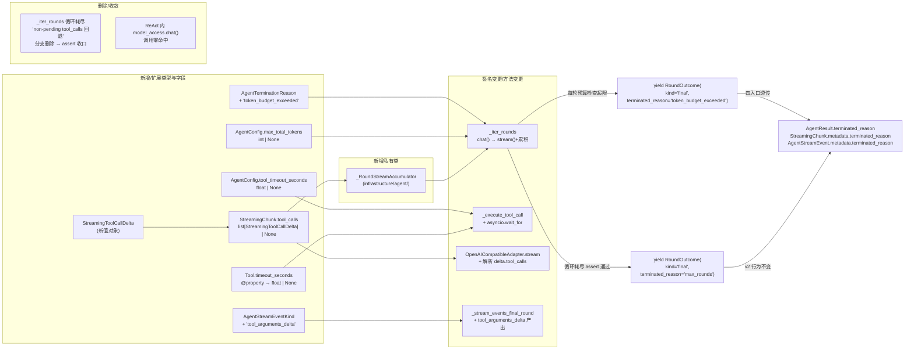

# 设计文档：Agent Adapter Refactor v3（ReAct 全程 stream + 工具治理 + Token 预算）

## 概述

本期是 v2（`docs/spec/agent-adapter-refactor-v2/`，commit `feb5ec6`）落地后的第三轮内部重构,触及 `infrastructure/agent/react_agent_adapter.py`、`infrastructure/model_access/openai_compatible_adapter.py`、`domain/agent/value_objects.py`、`domain/model_access/value_objects.py`、`domain/agent/tools.py`、`infrastructure/agent/round_outcome.py`,不引入新 Port、不调整 HTTP/SSE 契约、不调整审批语义、不新增配置键、前端代码不变。核心思路是:

1. **ReAct 全程 stream + 内部累积**(v2 ReAct 内部全程 `chat()` 调用 → v3 改为全程 `stream()`):v2 `ReActAgentAdapter` 内部包含两条 `chat()` 路径——`_iter_rounds` 中间轮次 tool_calls 累积路径,以及 `run` 入口最后一轮 text 路径(由 `run` 直接调用 `chat()` 获取整段最终回复);v3 把这两条路径全部替换为 `model_access.stream(...)`:中间轮次由 `_RoundStreamAccumulator` 在生成器内部完整消费分片并累积为等价 `LLMResponse` 后再驱动既有分支判断,`run` 末轮 text 路径下用户感知到由整段返回 → 逐字推送。**对外的 `RoundOutcome` 形态、事件时序与 v2 字面一致**——这是实现细节升级,不破坏既有流式协议(覆盖需求 1)。
2. **`StreamingChunk.tool_calls` 协议字段 + `OpenAICompatibleAdapter` SDK 透传**:在 `StreamingChunk` 末尾追加可选 `tool_calls: list[StreamingToolCallDelta] | None` 字段,适配器内部状态机重组 OpenAI SDK 的 `delta.tool_calls.index` 增量为完整 `ToolCallRequest`,在 `finished=True` 分片产出完整列表(覆盖需求 2 底层)。
3. **`tool_arguments_delta` 事件**:`AgentStreamEventKind` 末尾追加 `"tool_arguments_delta"`,`run_events` 在最后一轮真流式产出工具调用且 SDK 提供增量时,按分片产出 `tool_arguments_delta` 事件,供前端 typewriter 渲染工具入参(覆盖需求 2 上层)。
4. **工具超时治理**:`AgentConfig.tool_timeout_seconds: float | None` 全局默认 + `Tool.timeout_seconds: float | None` per-tool override(`@property` 默认 `None`);`_execute_tool_call` 通过 `asyncio.wait_for` 包裹工具执行;超时视为工具失败 `is_error=True`,`metadata={"error": True}`,`content` 为中文 `"工具执行超时(\{N\}s)"`(覆盖需求 3)。
5. **Token 预算治理**:`AgentConfig.max_total_tokens: int | None`;`_iter_rounds` 每轮 `merge_usage` 后立即按 `Token_Budget_Computation_Rule` 评估累计 token,超限即在本轮工具执行后产出 `RoundOutcome(kind="final", terminated_reason="token_budget_exceeded", ...)`;`AgentTerminationReason` 由 `Literal["completed", "max_rounds"]` 扩展为三取值;四入口透传(覆盖需求 4)。
6. **循环耗尽不变量收口**:删除 v2 残留的"non-pending tool_calls 静默回退到 `terminated_reason='completed'`"兜底分支,改为 `assert bool(last_response.tool_calls) and isinstance(messages[-1], ToolMessage), "<中文断言失败信息>"` 显式表达,加中文注释说明"仅 `terminal_round=0` 等数学边界可达"(覆盖需求 5)。

本设计严格遵循 [docs/steering/ddd-architecture.md](../../steering/ddd-architecture.md)(领域字段仅使用 Python 标准库类型;`StreamingToolCallDelta` 新值对象置于 `domain/model_access/value_objects.py`;`Tool.timeout_seconds` 抽象基类属性置于 `domain/agent/tools.py`;`asyncio.wait_for` 调用与 OpenAI SDK 解析仍位于 `infrastructure/`,不向 `domain/` 反向暴露)、[docs/steering/code-documentation.md](../../steering/code-documentation.md)(所有新增/修改的公开符号配中文 docstring)、[docs/steering/config-source.md](../../steering/config-source.md)(不新增配置键)、[docs/steering/uv-package-manager.md](../../steering/uv-package-manager.md)(不调整依赖)。

#### 设计决策

| 决策 | 选定方案 | 理由 |
| --- | --- | --- |
| 决策 1:v2 ReAct 内部全程 `chat()` 调用 → v3 改为全程 `stream()`(需求 1) | **B** 路线:`ReActAgentAdapter` 内部不再调用 `model_access.chat(...)`——`_iter_rounds` 中间轮次由内部累积器 `_RoundStreamAccumulator` 完整消费 `model_access.stream(...)` 分片聚合为 `LLMResponse` 后驱动既有分支判断;`run` 入口最后一轮 text 路径同样改为通过 `_stream_final_round` / `_stream_events_final_round` 走 stream(本来已是 stream,本期保留接口) | 用户已锁定决策。与主流 Agent 框架(OpenAI Assistants / LangGraph / Vercel AI SDK)"全程 stream"风格对齐;保留 `ModelAccessPort.chat()` 端口供 `ChatServiceAdapter` 无工具路径与 `LLMSummaryCompactionAdapter` 复用(调研 1)。requirement 决策 1 备注已澄清"原始问题标签'中间轮次纯文本非真流式'在精确语义下不可达——纯文本响应在任一轮次出现都会立即触发 `text` 终止;v2 的实际症结是 ReAct 内部全程 `chat()` 调用" |
| 决策 2:`tool_arguments_delta` 是否落地(需求 2) | **落地**:扩展 `StreamingChunk.tool_calls` 字段 + 新增 `AgentStreamEventKind.tool_arguments_delta` 取值 + `OpenAICompatibleAdapter.stream` 透传 SDK 的 `delta.tool_calls` | 用户已锁定决策。前端获得 typewriter 风格的工具入参渲染能力;底层 SDK 已支持增量,仅 adapter 层未透传(调研 2) |
| 决策 3:工具超时粒度(需求 3) | **(b)** 全局 + per-tool override:`AgentConfig.tool_timeout_seconds` 全局默认 + `Tool.timeout_seconds: float \| None` 可选 `@property` 子类按需 override | 用户已锁定决策。让所有工具调用都受全局兜底治理,同时允许长耗时工具(SQL 查询、外部 RPC 等)按需放宽;`@property` 形态保持 `Tool` 既有抽象方法签名不变,既有具体工具子类无需修改即可继续工作 |
| 决策 4:Token 预算粒度(需求 4) | **(a)** 仅 `max_total_tokens`(token 数量上限),不引入 cost / `request_limit` / `response_tokens_limit` 等多维预算 | 用户已锁定决策。一阶解决"长跑 Agent 不可控成本"问题;cost 预算与多维预算留给未来 spec |
| 决策 5:不可达分支处理(需求 5) | **(b)** assert + 注释:`_iter_rounds` 循环耗尽分支用 `assert bool(last_response.tool_calls) and isinstance(messages[-1], ToolMessage)` 显式约束;删除 v2 静默回退 | 用户已锁定决策。让"循环耗尽路径恰有一种 final 形态"的不变量在阅读上显式;assert 失败立刻抛出 `AssertionError` 而非默默走 `terminated_reason="completed"` |
| 决策 6:工具调用增量字段形态 | 新增 `StreamingToolCallDelta` 值对象,`StreamingChunk.tool_calls: list[StreamingToolCallDelta] \| None`;每个 delta 携带 `index: int` / `id: str \| None` / `name: str \| None` / `arguments_delta: str \| None` | 不直接复用 `ToolCallRequest`(其字段必填,且不携带 `index`);`StreamingToolCallDelta` 与 OpenAI SDK 形态严格对齐,既能承载"中间增量分片",也能承载"`finished=True` 分片携带的完整列表"(此时把累积出的完整工具调用拆解成等价 delta 列表回传——见组件 4 详述)。让 `ReActAgentAdapter` 的累积器逻辑只依赖一个稳定字段语义,而不必区分"完整 vs 增量分片" |
| 决策 7:中间轮次累积期间是否对外发事件 | **不对外发**:中间轮次的 `model_access.stream(...)` 由 `_RoundStreamAccumulator` 完整消费,**不**向 `run_streaming` / `run_events` 产出任何 `StreamingChunk` / `AgentStreamEvent`;心跳 / tool_progress / tool_start / tool_result / status 事件按 v2 字面位置产出 | 需求 1.3 明确约束"中间轮次累积期间不向上层产出任何分片或事件";保证 v3 是实现细节升级而非协议变更;前端无需适配 |
| 决策 8:`_stream_final_round` / `_stream_events_final_round` 命运 | **保留** v2 接口与产出语义,仅在 `_stream_events_final_round` 内增加 `tool_arguments_delta` 事件产出 | 需求 1.4 明确"保留 v2 接口与产出语义不变";最后一轮的 stream 产出与中间轮次累积是两条不同的对外协议(中间轮次累积不对外,最后一轮真流式对外发 `assistant_delta` / `tool_arguments_delta`),复用同一个 helper 反而会让两路产出协议混淆 |
| 决策 9:Token 预算 text 路径口径 | text 路径下即使最后一轮 usage 把累计推过预算,**仍按** `terminated_reason="completed"`;`token_budget_exceeded` 只在"超限发生时模型仍未给出最终文本回复"的语义下命中 | 需求 4.7 明确口径。text 路径已得到模型最终回复,无需以"超限"信号替代"已完成"信号;避免触发 caller 的"补救续跑"误判 |
| 决策 10:Token 预算与 HITL 交互 | HITL `approval` 路径**不**改写为 `token_budget_exceeded`;循环已通过 `yield approval; return` 退出,预算检查不参与该路径 | 需求 NFR-5 明确口径。HITL 中断由 `AgentResult.status="approval_required"` 单独表达,不属于"超限" |
| 决策 11:OpenAI SDK 最后一片完整 tool_calls 的产出 | `finished=True` 分片携带"基于内部状态机累积出的完整工具调用列表"(把累积出的 `ToolCallRequest` 拆为 `arguments_delta=完整 arguments` 形式的等价 delta 列表) | 需求 2.3 明确"`finished=True` 分片产出完整列表"——下游消费者即使丢弃中间增量分片,也能从该分片重组完整工具调用列表;同时与决策 6 的"统一字段语义"对齐 |
| 决策 12:`_stream_final_round` 处理 `chunk.tool_calls` 的二选一 | **选定 (a)**:`_stream_final_round`(用于 `run_streaming`)**完全忽略** `chunk.tool_calls`,只按 v2 既有形态产出 `delta_content` / `finished` / `usage` 形态的 `StreamingChunk`;不透传 `chunk.tool_calls` 到产出的 `StreamingChunk.tool_calls` | 需求 2.8 给 design 在 (a) 与 (b) 之间二选一;本期不升级 `run_streaming` 的对外协议——`tool_arguments_delta` typewriter 收益由 `run_events`(决策 2)单独承载,`run_streaming` 对外形态保持 v2 字面一致,前端 `StreamingChunk` 通道不获得工具调用增量;若未来需要把 `run_streaming` 也升级,可在后续 spec 中以"启用 (b) 路线"形式落地。该决策让 tasker 阶段无歧义:`_stream_final_round` 在本期**不修改** |

## 架构

### v3 顶层方法变更图



### 中间轮次内部累积序列(决策 1 + 决策 7 落地)

```mermaid
sequenceDiagram
    participant Caller as run / run_streaming / run_events / resume
    participant Iter as _iter_rounds
    participant Acc as _RoundStreamAccumulator
    participant Model as ModelAccessPort.stream
    participant Ctx as ConversationContext

    Caller->>Iter: __aiter__()
    Iter->>Ctx: _ensure_agent_system_prompt(首轮前唯一注入点)
    loop 每轮 round_num ∈ [start_round, effective_terminal]
        Iter->>Acc: 创建累积器
        Iter->>Model: stream(ChatRequest)
        loop 每个 StreamingChunk
            Model-->>Acc: chunk(delta_content / tool_calls / usage / finished)
            Note over Acc: 内部累积:<br/>delta_content 拼接<br/>tool_calls 按 index 合并<br/>usage 取 finished=True 分片
        end
        Acc-->>Iter: LLMResponse(content, tool_calls, usage, model, latency_ms)
        Note over Iter,Caller: 中间轮次累积期间<br/>不向 Caller 产出 chunk / event<br/>(决策 7)
        Iter->>Iter: total_usage = merge_usage(...)
        alt config.max_total_tokens 非 None 且超限
            Iter->>Iter: logger.warning(Token_Budget_Exceeded_Warning)
            alt 本轮 kind == 'tool_calls'
                Iter-->>Caller: yield tool_calls(让 caller 执行工具回写)
                Caller->>Caller: _execute_tool_call(...)
                Iter-->>Caller: yield final(terminated_reason='token_budget_exceeded'); return
            else 本轮 kind == 'text'
                Iter-->>Caller: yield text(terminated_reason='completed'); return
            else 本轮 kind == 'approval'
                Iter-->>Caller: yield approval; return
            end
        else 未超限
            alt no tool_calls
                Iter-->>Caller: yield text; return
            else has tool_calls (no approval)
                Iter-->>Caller: yield tool_calls
                Caller->>Caller: _execute_tool_call(每个工具)
            else approval
                Iter-->>Caller: yield approval; return
            end
        end
    end
    Note over Iter: 循环耗尽:assert 不变量
    Iter->>Iter: assert bool(last_response.tool_calls) and<br/>isinstance(messages[-1], ToolMessage)
    Iter->>Iter: logger.warning(Max_Rounds_Termination_Warning)
    Iter-->>Caller: yield final(terminated_reason='max_rounds')
```

### `tool_arguments_delta` 在最后一轮的产出序列(决策 2 + 决策 8 落地)

```mermaid
sequenceDiagram
    participant Run as run_events
    participant Helper as _stream_events_final_round
    participant Model as ModelAccessPort.stream
    participant Adapter as OpenAICompatibleAdapter.stream
    participant SDK as OpenAI SDK

    Run->>Helper: 进入最后一轮
    Helper->>Model: stream(ChatRequest)
    Model->>Adapter: 委派
    Adapter->>SDK: chat.completions.create(stream=True)
    loop SDK 流式分片
        SDK-->>Adapter: chunk.delta(content / tool_calls[index])
        Adapter->>Adapter: 内部状态机重组(index → id/name/arguments_delta)
        Adapter-->>Helper: StreamingChunk(<br/>delta_content,<br/>tool_calls=[StreamingToolCallDelta(...)],<br/>finished=False)
        alt chunk.delta_content 非空
            Helper-->>Run: AgentStreamEvent(kind='assistant_delta', content=...)
        end
        alt chunk.tool_calls 非空且 finished=False
            Helper-->>Run: AgentStreamEvent(kind='tool_arguments_delta',<br/>tool_call_id=..., tool_name=...,<br/>arguments=delta.arguments_delta,<br/>metadata={'round': round_num})
        end
    end
    SDK-->>Adapter: 最后一片 finish_reason='tool_calls'
    Adapter-->>Helper: StreamingChunk(<br/>finished=True,<br/>tool_calls=[完整工具调用 delta 列表],<br/>usage=...)
    Helper-->>Run: AgentStreamEvent(kind='assistant_done', usage=..., metadata={'round': round_num})
    Note over Helper,Run: 完整 tool_calls 由 _iter_rounds 后续轮次<br/>(若有)从 LLMResponse.tool_calls 读取;<br/>本轮即最后一轮,模型 tool_calls 无后续轮可用,<br/>由 caller(顶层编排)从已 stream 出的<br/>tool_arguments_delta 拼接还原。
```

### 包/目录结构(仅列变更点)

```
epsilon-boot/src/
├── domain/
│   ├── agent/
│   │   ├── value_objects.py              # AgentTerminationReason 扩展为 3 取值;
│   │                                     # AgentStreamEventKind 追加 'tool_arguments_delta';
│   │                                     # AgentConfig 末尾追加 tool_timeout_seconds / max_total_tokens
│   │   └── tools.py                      # Tool 抽象基类追加 timeout_seconds @property(默认 None)
│   └── model_access/
│       └── value_objects.py              # 新增 StreamingToolCallDelta;
│                                         # StreamingChunk 末尾追加 tool_calls 字段
├── infrastructure/
│   ├── agent/
│   │   ├── round_outcome.py              # RoundOutcome.terminated_reason 类型同步扩展(无新字段)
│   │   ├── round_stream_accumulator.py   # 新增 _RoundStreamAccumulator
│   │   └── react_agent_adapter.py        # _iter_rounds chat() → stream() + 累积器消费;
│   │                                     # _iter_rounds 每轮 merge_usage 后预算检查;
│   │                                     # _iter_rounds 循环耗尽分支删除回退分支 + assert 收口;
│   │                                     # _execute_tool_call 加入 asyncio.wait_for + 超时分支;
│   │                                     # _stream_events_final_round 加入 tool_arguments_delta 产出;
│   │                                     # 三入口对 terminated_reason='token_budget_exceeded' 透传(对称 max_rounds)
│   └── model_access/
│       └── openai_compatible_adapter.py  # stream() 解析 delta.tool_calls,内部状态机重组;
│                                         # 产出 StreamingChunk.tool_calls
├── docs/
│   └── agent.md                          # 同步:全程 stream 升级、tool_arguments_delta 事件、
│                                         # token 预算 / 工具超时治理新增信号
└── ...
```

## 组件与接口

### 1. `StreamingToolCallDelta`(新值对象,需求 2)

- 位置:`epsilon-boot/src/domain/model_access/value_objects.py`,`StreamingChunk` 之前。
- 职责:刻画一个工具调用在某个 `StreamingChunk` 上的"增量切片",对齐 OpenAI SDK 的 `chunk.choices[0].delta.tool_calls[i]` 形态。
- 完整签名:

```python
@dataclass(frozen=True)
class StreamingToolCallDelta:
    """流式工具调用增量切片。

    刻画一个工具调用在某个 :class:`StreamingChunk` 上的增量信息,与
    OpenAI Python SDK 流式分片中 ``chunk.choices[0].delta.tool_calls[i]``
    的字段语义严格对齐。

    OpenAI SDK 的工具调用流式语义:同一工具调用会跨越多个 SDK 分片,
    每个分片的 ``tool_calls[i].index`` 标识"该 delta 属于哪个工具调用",
    第一个分片携带 ``id`` 与 ``function.name``,后续分片只携带
    ``function.arguments`` 增量(每个分片的 arguments 是字符串切片,
    需要按 ``index`` 顺序拼接)。

    本值对象的字段约定:

    - ``index``:必填,SDK 中 ``tool_calls[i].index``,用于跨分片合并同一工具调用。
    - ``id``:可选,工具调用的唯一标识符,通常仅出现在该工具调用的首个 delta;
      若该 delta 不携带 ``id``,保留 ``None``。
    - ``name``:可选,函数名,通常仅出现在该工具调用的首个 delta;
      若该 delta 不携带 ``name``,保留 ``None``。
    - ``arguments_delta``:可选,该 delta 携带的 ``function.arguments`` 增量片段;
      ``None`` 表示该 delta 不携带 arguments(例如首个 delta 仅携带 id/name)。

    `finished=True` 分片的特殊语义:适配器内部状态机累积出完整工具调用后,
    把每个完整工具调用以 ``StreamingToolCallDelta(index=..., id=完整id,
    name=完整name, arguments_delta=完整arguments JSON)`` 形式回传(``arguments_delta``
    不再是"增量",而是"完整 arguments"),保证下游即使丢弃中间增量分片,
    也能从 ``finished=True`` 分片重组出完整工具调用列表。

    Attributes:
        index: SDK ``tool_calls[i].index``,跨分片标识同一工具调用。
        id: 工具调用唯一标识;仅首个 delta 携带,后续 delta 为 ``None``。
        name: 函数名;仅首个 delta 携带,后续 delta 为 ``None``。
        arguments_delta: 本 delta 携带的 arguments 增量字符串;``None`` 表示
            该 delta 不携带 arguments。``finished=True`` 分片中为完整 arguments。
    """

    index: int
    id: str | None = None
    name: str | None = None
    arguments_delta: str | None = None
```

### 2. `StreamingChunk` 字段扩展(需求 2.1)

- 位置:`domain/model_access/value_objects.py:StreamingChunk`。
- 变更:末尾追加 `tool_calls: list[StreamingToolCallDelta] | None = None`。
- 完整签名:

```python
@dataclass(frozen=True)
class StreamingChunk:
    """流式响应分片值对象。

    在流式调用中,LLM 的响应会被拆分为多个分片逐个返回。

    Attributes:
        delta_content: 增量文本内容(相对于上一个分片的新增内容)
        finished: 是否为最后一个分片
        usage: 可选的 token 用量信息,通常仅在最后一个分片中提供
        metadata: 面向结构化事件或兼容提示的附加元数据
        tool_calls: 可选的工具调用增量切片列表(v3 新增,
            决策 6)。``None`` 表示该分片不携带工具调用相关数据;
            非 ``None`` 时为该分片携带的工具调用增量列表。
            ``finished=True`` 分片若包含完整工具调用,本字段为按
            ``StreamingToolCallDelta.index`` 重组后的完整列表(每个
            元素的 ``arguments_delta`` 为完整 arguments JSON 而非增量),
            保证下游消费者即使丢弃中间增量分片,也能从 ``finished=True``
            分片重组出完整工具调用列表(需求 2.3)。
    """

    delta_content: str = ""
    finished: bool = False
    usage: dict[str, int] | None = None
    metadata: dict[str, Any] = field(default_factory=dict)
    tool_calls: list[StreamingToolCallDelta] | None = None
```

> NFR-2 不变量保持:`frozen=True` 不变;既有字段类型与默认值不变;末尾追加可选字段不破坏既有构造。

### 3. `AgentStreamEventKind` / `AgentTerminationReason` / `AgentConfig` 扩展(需求 2 / 4)

#### 3.1 `AgentStreamEventKind` 追加取值

```python
AgentStreamEventKind = Literal[
    "status",
    "assistant_delta",
    "assistant_done",
    "tool_start",
    "tool_result",
    "tool_error",
    "approval_required",
    "error",
    # v3 新增:工具调用参数增量事件。在最后一轮 model_access.stream(...) 真流式
    # 产出工具调用且 SDK 提供 arguments 增量时,run_events 通过
    # _stream_events_final_round 按分片产出本事件,供前端 typewriter 渲染
    # 工具入参。content 为空字符串;arguments 字段携带本分片新增 arguments
    # 增量字符串;同一 tool_call_id 的多个 delta 严格按 SDK 产出顺序;
    # 中间轮次累积期间不产出本事件(决策 7)。
    "tool_arguments_delta",
]
```

#### 3.2 `AgentTerminationReason` 扩展为 3 取值

```python
AgentTerminationReason = Literal["completed", "max_rounds", "token_budget_exceeded"]
"""Agent 运行终止原因。

刻画"为何停止",与 :data:`AgentRunStatus`(``"completed"`` /
``"approval_required"``)正交:``status="approval_required"`` 时
``terminated_reason`` 保持 ``"completed"``(HITL 中断不属于"轮数超限"
或"预算超限",由 ``status`` 单独表达)。

取值:

- ``"completed"``:模型自然给出最终回复,或工具调用循环正常收尾。
- ``"max_rounds"``:循环达到 ``config.max_rounds`` 上限时最后一轮仍返回
  ``tool_calls``、工具已被执行但模型尚未对工具结果给出最终回复。调用方
  (顶层编排 / 自主续跑循环)应据此决策续跑或终止。
- ``"token_budget_exceeded"``(v3 新增):循环达到 ``config.max_total_tokens``
  上限时本轮结束后立即终止,不再发起更多模型调用;调用方应据此决策是否
  升档预算续跑或告知用户。具体判定规则见
  ``Token_Budget_Computation_Rule``(每轮 ``merge_usage`` 后立即评估)。
"""
```

#### 3.3 `AgentConfig` 末尾追加两字段

```python
@dataclass(frozen=True, kw_only=True)
class AgentConfig:
    # ... 既有字段保持不变 ...
    system_prompt: str
    tool_schemas: list[dict[str, Any]]
    model: str | None
    max_rounds: int
    prompt_id: str
    allowed_tool_names: frozenset[str] = field(default=frozenset())
    # v3 新增
    tool_timeout_seconds: float | None = None
    """工具执行全局超时阈值(秒)。

    ``None`` 表示不启用工具超时(与 v2 行为一致)。当配置为正数时,
    ``ReActAgentAdapter._execute_tool_call`` 内部以该值为默认超时阈值,
    通过 ``asyncio.wait_for`` 包裹工具执行调用;具体工具实例可通过
    ``Tool.timeout_seconds`` 覆盖该全局值(决策 3:全局 + per-tool override)。
    """
    max_total_tokens: int | None = None
    """单次 Agent 执行累计 token 预算上限。

    ``None`` 表示不启用 token 预算检查(与 v2 行为一致)。当配置为正整数时,
    ``ReActAgentAdapter._iter_rounds`` 每轮 ``merge_usage`` 完成后立即评估
    累计 token,超限即在本轮工具执行后产出 ``RoundOutcome(kind="final",
    terminated_reason="token_budget_exceeded")`` 并记录
    ``Token_Budget_Exceeded_Warning`` 警告。判定规则见
    ``Token_Budget_Computation_Rule``。
    """

    def __post_init__(self) -> None:
        # 既有校验保持不变(max_rounds > 0;prompt_id 正则)
        if self.max_rounds <= 0:
            raise ValueError(f"max_rounds 必须大于 0,当前值: {self.max_rounds}")
        if not _PROMPT_ID_PATTERN.match(self.prompt_id):
            raise ValueError(
                f"prompt_id 非法,期望形如 'name@v<N>',当前值: {self.prompt_id!r}"
            )
        # v3 新增校验
        if self.tool_timeout_seconds is not None and self.tool_timeout_seconds <= 0:
            raise ValueError("tool_timeout_seconds 必须大于 0")
        if self.max_total_tokens is not None and self.max_total_tokens <= 0:
            raise ValueError("max_total_tokens 必须大于 0")
        # 既有自动提取 allowed_tool_names 保持不变
        if not self.allowed_tool_names and self.tool_schemas:
            names = frozenset(
                schema["function"]["name"]
                for schema in self.tool_schemas
                if "function" in schema and "name" in schema["function"]
            )
            object.__setattr__(self, "allowed_tool_names", names)
```

### 4. `OpenAICompatibleAdapter.stream`(需求 2.2 / 2.3)

- 位置:`infrastructure/model_access/openai_compatible_adapter.py:OpenAICompatibleAdapter.stream`。
- 变更:解析 OpenAI SDK 流式分片中的 `chunk.choices[0].delta.tool_calls`,通过内部状态机按 `index` 累积/透传到 `StreamingChunk.tool_calls`,在 `finished=True` 分片产出完整列表。
- 完整签名(签名不变,行为扩展):

```python
async def stream(self, request: ChatRequest) -> AsyncIterator[StreamingChunk]:
    """流式对话接口(v3:透传工具调用增量)。

    将 ``ChatRequest`` 转换为 OpenAI Chat Completions API 流式调用,
    逐个返回 ``StreamingChunk``。

    v3 新增:解析 OpenAI Python SDK 流式分片中的
    ``chunk.choices[0].delta.tool_calls`` 字段。OpenAI SDK 的工具调用
    流式语义:同一工具调用会跨越多个 SDK 分片,每个分片的
    ``tool_calls[i].index`` 标识"该 delta 属于哪个工具调用",首分片
    携带 ``id`` 与 ``function.name``,后续分片只携带 ``function.arguments``
    增量字符串。

    本方法的处理:

    1. 维护内部状态字典 ``acc: dict[int, StreamingToolCallDelta_累积态]``,
       按 SDK ``index`` 累积每个工具调用的 ``id`` / ``name`` / ``arguments``。
    2. 对每个 SDK 分片,把"本分片新增的工具调用 delta 列表"以
       ``list[StreamingToolCallDelta]`` 形态写入产出的 ``StreamingChunk.tool_calls``;
       每个 ``StreamingToolCallDelta`` 仅携带"本分片新观察到的 id/name/arguments_delta",
       即与 SDK 原始 delta 字段一一对应,**不携带累积值**。
    3. 在 ``finished=True`` 分片产出时,把 ``acc`` 中累积出的完整工具调用
       拆解为等价 ``StreamingToolCallDelta`` 列表(``arguments_delta`` 字段
       为完整 arguments JSON 而非增量;``id`` / ``name`` 完整;``index`` 与
       SDK ``index`` 对齐),写入 ``StreamingChunk.tool_calls``,保证下游
       消费者即使丢弃中间增量分片,也能从 ``finished=True`` 分片重组出
       完整工具调用列表(需求 2.3)。

    既有行为保持:``delta_content`` 仍透传 ``delta.content``;``usage`` 仍
    在 SDK 最后一片(``chunk.choices`` 为空但 ``chunk.usage`` 非空时)产出。

    Args:
        request: 对话请求,包含消息列表和可选参数。

    Yields:
        流式响应分片,最后一个分片的 ``finished`` 标志为 True。

    Raises:
        ModelTimeoutError: 请求超时。
        ModelRateLimitError: 触发速率限制(HTTP 429)。
        ModelConnectionError: 模型服务不可达。
        ModelAccessError: 其他模型调用错误。
    """
```

实现要点(伪代码):

```python
async def stream(self, request: ChatRequest) -> AsyncIterator[StreamingChunk]:
    params = self._build_params(request, stream=True)
    # ... 既有异常映射保持不变 ...
    response = await self._client.chat.completions.create(**params)

    # v3 新增:工具调用累积状态字典,按 SDK index 累积
    acc: dict[int, dict[str, Any]] = {}  # index → {id, name, arguments}

    async for chunk in response:
        if not chunk.choices:
            # 最后一个 chunk 可能只包含 usage(既有逻辑)
            usage_info = None
            if chunk.usage:
                usage_info = {
                    "prompt_tokens": chunk.usage.prompt_tokens,
                    "completion_tokens": chunk.usage.completion_tokens,
                    "total_tokens": chunk.usage.total_tokens,
                }
            if usage_info:
                # finished=True 且携带累积出的完整工具调用列表(需求 2.3)
                full_tool_calls = _materialize_full_tool_calls(acc) if acc else None
                yield StreamingChunk(
                    finished=True,
                    usage=usage_info,
                    tool_calls=full_tool_calls,
                )
            continue

        delta = chunk.choices[0].delta
        finish_reason = chunk.choices[0].finish_reason

        # v3 新增:解析 delta.tool_calls
        delta_tool_calls: list[StreamingToolCallDelta] | None = None
        if delta and getattr(delta, "tool_calls", None):
            delta_tool_calls = []
            for tc in delta.tool_calls:
                idx = tc.index
                # 累积态 update
                state = acc.setdefault(idx, {"id": None, "name": None, "arguments": ""})
                if tc.id:
                    state["id"] = tc.id
                if tc.function and tc.function.name:
                    state["name"] = tc.function.name
                args_delta = (tc.function.arguments if tc.function else None) or None
                if args_delta:
                    state["arguments"] = (state["arguments"] or "") + args_delta
                # 本分片 delta(不携带累积值,与 SDK 原始 delta 一一对应)
                delta_tool_calls.append(
                    StreamingToolCallDelta(
                        index=idx,
                        id=tc.id if tc.id else None,
                        name=tc.function.name if (tc.function and tc.function.name) else None,
                        arguments_delta=args_delta,
                    )
                )

        is_finished = finish_reason is not None
        if is_finished and acc:
            # 在 finish_reason 非 None 的分片携带累积完整列表(需求 2.3)
            yield StreamingChunk(
                delta_content=(delta.content or "") if delta else "",
                finished=True,
                usage=None,
                tool_calls=_materialize_full_tool_calls(acc),
            )
        else:
            yield StreamingChunk(
                delta_content=(delta.content or "") if delta else "",
                finished=is_finished,
                usage=None,
                tool_calls=delta_tool_calls,
            )


def _materialize_full_tool_calls(
    acc: dict[int, dict[str, Any]],
) -> list[StreamingToolCallDelta]:
    """把累积态字典展开为"携带完整 arguments"的 StreamingToolCallDelta 列表。"""
    return [
        StreamingToolCallDelta(
            index=idx,
            id=state.get("id"),
            name=state.get("name"),
            arguments_delta=state.get("arguments") or None,
        )
        for idx, state in sorted(acc.items())
    ]
```

> 与 v2 唯一行为差异:`StreamingChunk.tool_calls` 字段被填充。`delta_content` / `finished` / `usage` 既有语义不变。

### 5. `_RoundStreamAccumulator`(新增,需求 1)

- 位置:`epsilon-boot/src/infrastructure/agent/round_stream_accumulator.py`(新文件,DDD 分层中归属基础设施层 Adapter 内部协作组件)。
- 职责:封装"消费 `model_access.stream(req)` 流式分片 → 内部累积 → 输出等价 `LLMResponse`"的状态机。`_iter_rounds` 每轮调用一次,中间轮次累积期间不向上层产出任何分片或事件(决策 7)。
- 完整签名:

```python
"""ReAct Agent 单轮 stream 累积器模块。

提供 ``_RoundStreamAccumulator`` 类,封装 v3 决策 1 落地后
``ReActAgentAdapter._iter_rounds`` 中间轮次"消费 stream → 累积成 LLMResponse"
的状态机逻辑,使 ``_iter_rounds`` 主体保持简洁、可测。

本模块仅服务于 ``ReActAgentAdapter`` 内部统一轮次推进,不向 ``domain/`` 暴露。
"""

from __future__ import annotations

import time
from collections.abc import AsyncIterator

from domain.model_access.value_objects import (
    LLMResponse,
    StreamingChunk,
    StreamingToolCallDelta,
    ToolCallRequest,
)


class _RoundStreamAccumulator:
    """ReAct Agent 单轮 stream 累积器(``Mid_Round_Stream_Aggregation``)。

    封装"完整消费 ``model_access.stream(...)`` 流 → 累积出等价
    :class:`LLMResponse`"的状态机。生命周期为单轮:每轮 ``_iter_rounds``
    创建一个新实例,完成消费后由 :meth:`build_response` 返回累积结果。

    累积规约:

    - ``content``:所有分片的 ``delta_content`` 顺序拼接(不区分 ``finished``);
    - ``tool_calls``:所有分片的 ``StreamingChunk.tool_calls`` 按
      :attr:`StreamingToolCallDelta.index` 合并去重为
      ``list[ToolCallRequest]``;``id`` / ``name`` 取首个非 ``None`` 值;
      ``arguments`` 取所有 ``arguments_delta`` 顺序拼接(``finished=True``
      分片携带的完整 arguments 优先覆盖累积结果,与决策 11 对齐);
    - ``usage``:取 ``finished=True`` 分片的 ``usage``,缺失视为 ``{}``;
    - ``model``:由 ``ReActAgentAdapter`` 在创建累积器时显式传入(取
      ``ChatRequest.model`` 或回退到 ``config.model`` 或空字符串),
      因 ``StreamingChunk`` 不携带 model 字段;
    - ``latency_ms``:从 ``__init__`` 到 ``build_response`` 的 ``time.monotonic()``
      毫秒差。

    本类**不**向上层产出任何 ``StreamingChunk`` 或 ``AgentStreamEvent``——
    中间轮次累积期间对外完全静默(决策 7、需求 1.3)。
    """

    def __init__(self, model: str) -> None:
        """初始化累积器,记录起始时刻。

        Args:
            model: 本轮使用的模型名称,直接写入累积出的 ``LLMResponse.model``。
        """
        self._model = model
        self._start_monotonic = time.monotonic()
        self._content_parts: list[str] = []
        # tool_calls 累积态:index → {id, name, arguments, complete_arguments}
        self._tool_calls_state: dict[int, dict[str, str | None]] = {}
        self._final_usage: dict[str, int] = {}

    async def consume(self, stream: AsyncIterator[StreamingChunk]) -> None:
        """完整消费一个 stream,累积所有分片。

        本方法**不**向调用方产出任何值;调用方在消费完成后通过
        :meth:`build_response` 取回累积出的 :class:`LLMResponse`。

        异常透传:``stream`` 内部抛出的任何异常(``ModelTimeoutError`` /
        ``ModelRateLimitError`` / ``ModelAccessError`` 等)直接透传给
        调用方,与 v2 ``model_access.chat`` 的异常透传语义一致(需求 1.7)。

        Args:
            stream: 由 ``model_access.stream(...)`` 产出的异步分片迭代器。
        """
        async for chunk in stream:
            if chunk.delta_content:
                self._content_parts.append(chunk.delta_content)
            if chunk.tool_calls:
                self._merge_tool_calls(chunk.tool_calls, is_finished=chunk.finished)
            if chunk.finished and chunk.usage:
                self._final_usage = dict(chunk.usage)

    def _merge_tool_calls(
        self,
        deltas: list[StreamingToolCallDelta],
        *,
        is_finished: bool,
    ) -> None:
        """合并一个分片的工具调用 delta 列表到累积状态。

        - ``id`` / ``name``:取首个非 ``None`` 值;
        - ``arguments_delta``:增量分片下顺序拼接到 ``arguments``;
          ``finished=True`` 分片下视为"完整 arguments",直接覆盖
          ``complete_arguments`` 槽位(决策 11)。

        Args:
            deltas: 本分片的 ``StreamingChunk.tool_calls`` 列表。
            is_finished: 当前分片是否为 ``finished=True``。
        """
        for delta in deltas:
            state = self._tool_calls_state.setdefault(
                delta.index,
                {"id": None, "name": None, "arguments": "", "complete_arguments": None},
            )
            if delta.id and not state["id"]:
                state["id"] = delta.id
            if delta.name and not state["name"]:
                state["name"] = delta.name
            if delta.arguments_delta:
                if is_finished:
                    state["complete_arguments"] = delta.arguments_delta
                else:
                    state["arguments"] = (state["arguments"] or "") + delta.arguments_delta

    def build_response(self) -> LLMResponse:
        """累积完成后构造等价 :class:`LLMResponse`。

        合并语义详见类 docstring。``tool_calls`` 列表按 ``index`` 升序排列;
        每个 ``ToolCallRequest`` 的 ``arguments`` 优先取
        ``complete_arguments`` 槽位(``finished=True`` 分片携带的完整值),
        否则取所有增量 ``arguments_delta`` 拼接结果。

        Returns:
            等价于 ``ModelAccessPort.chat(...)`` 一次性返回的 ``LLMResponse``。
        """
        content = "".join(self._content_parts)
        latency_ms = (time.monotonic() - self._start_monotonic) * 1000.0
        tool_calls: list[ToolCallRequest] = []
        for idx in sorted(self._tool_calls_state):
            state = self._tool_calls_state[idx]
            arguments = state["complete_arguments"] or state["arguments"] or ""
            # ToolCallRequest.__post_init__ 要求 id/name/arguments 非空;
            # 当 SDK 流尾仍未观察到 id/name 时使用空白会触发 ValueError——
            # 这是真实异常路径(SDK 协议错误),交由调用方异常透传处理。
            tool_calls.append(
                ToolCallRequest(
                    id=state["id"] or "",
                    name=state["name"] or "",
                    arguments=arguments,
                )
            )
        return LLMResponse(
            content=content,
            model=self._model,
            usage=dict(self._final_usage),
            latency_ms=latency_ms,
            tool_calls=tool_calls,
        )
```

### 6. `Tool.timeout_seconds`(需求 3.2)

- 位置:`domain/agent/tools.py:Tool`。
- 变更:新增可选 `@property`,默认实现返回 `None`,子类可 override。
- 完整签名:

```python
class Tool(ABC):
    """工具抽象基类。
    ...(既有 docstring 保持不变)...
    """

    # 既有抽象成员保持不变:name / description / parameters / execute

    @property
    def timeout_seconds(self) -> float | None:
        """工具级超时阈值(秒)。

        子类可按需 override 该属性以为单个工具指定超时阈值;未 override
        时默认返回 ``None``,表示沿用 ``AgentConfig.tool_timeout_seconds``
        全局默认。

        优先级(决策 3 b 路线):per-tool > 全局 > None(不超时)。

        Returns:
            该工具的超时阈值(秒),``None`` 表示继承全局值。
        """
        return None
```

> 既有抽象方法 `name` / `description` / `parameters` / `execute` 签名不变;新增 `timeout_seconds` 属性默认返回 `None`,既有具体工具子类无需修改即可继续工作(NFR-2 不变量保持)。

### 7. `_iter_rounds`(签名不变,主体重写,需求 1 / 4 / 5)

- 位置:`infrastructure/agent/react_agent_adapter.py`,类内私有方法。
- 变更:中间轮次推进改为 `model_access.stream(...)` + `_RoundStreamAccumulator`;每轮 `merge_usage` 后预算检查;循环耗尽分支删除"non-pending tool_calls 静默回退"分支,改为 `assert` 收口。
- 完整签名(与 v2 一致):

```python
async def _iter_rounds(
    self,
    context: ConversationContext,
    config: AgentConfig,
    model_access: ModelAccessPort,
    *,
    start_round: int = 1,
    initial_usage: dict[str, int] | None = None,
    terminal_round: int | None = None,
) -> AsyncIterator[RoundOutcome]:
    """统一的轮次推进异步生成器(v3:全程 stream + 预算/超时治理)。

    覆盖 ``run`` / ``run_streaming`` / ``run_events`` / ``resume`` 四个入口的
    单轮推进语义。生成器的产出顺序由 ``RoundOutcome.kind`` 表达。

    本方法在首次进入循环之前以 ``Single_System_Prompt_Injection_Site`` 语义
    幂等注入 ``config.system_prompt``。

    v3 变更:

    1. 中间轮次每轮通过 ``model_access.stream(...)`` 推进,由
       ``_RoundStreamAccumulator`` 累积成等价 ``LLMResponse`` 后驱动既有的
       ``tool_calls`` / ``text`` / ``approval`` 分支判断;**中间轮次累积
       期间不向上层产出任何 ``StreamingChunk`` 或 ``AgentStreamEvent``**
       (决策 7、需求 1.3)。
    2. 每轮 ``merge_usage`` 完成后立即按 ``Token_Budget_Computation_Rule``
       评估累计 token 预算;当 ``config.max_total_tokens`` 非 ``None`` 且
       累计 ``> max_total_tokens`` 时:
       - 若本轮 kind == ``"text"``:按 ``terminated_reason="completed"``
         自然终止(决策 9、需求 4.7)——text 路径已得到模型最终回复,
         不改写为"超限";
       - 若本轮 kind == ``"approval"``:按 v2 ``approval`` 路径正常产出,
         **不**改写为 ``"token_budget_exceeded"``(决策 10、需求 NFR-5);
       - 若本轮 kind == ``"tool_calls"``:先 yield ``tool_calls`` outcome
         让 caller 执行工具回写 ToolMessage;``__anext__`` 时**不**进入新一轮
         stream,而是直接 yield ``RoundOutcome(kind="final",
         terminated_reason="token_budget_exceeded")`` 并 return;
         产出前记录 ``Token_Budget_Exceeded_Warning`` 警告(需求 4.5)。
    3. 循环耗尽分支删除 v2 残留的"non-pending tool_calls 静默回退到
       ``terminated_reason='completed'``"兜底分支;新增 ``assert
       bool(last_response.tool_calls) and bool(messages) and isinstance(
       messages[-1], ToolMessage)`` 显式约束最后一轮一定是 tool_calls 且
       工具已被外层执行回写(决策 5、需求 5.3)。``last_response is None``
       的极端边界(``terminal_round=0``)直接 ``return``,不产出 outcome
       (需求 5.2)。

    Args:
        context: 对话上下文,原地修改。
        config: Agent 执行配置。
        model_access: 模型访问端口。
        start_round: 起始轮次号。
        initial_usage: 起始累计用量。
        terminal_round: 循环结束轮次(含),默认 ``None`` 即为
            ``config.max_rounds``。

    Yields:
        每轮的 ``RoundOutcome``。
    """
```

主体伪代码(关键变化部分):

```python
total_usage: dict[str, int] = dict(initial_usage or {})
self._ensure_agent_system_prompt(context, config)
last_response: LLMResponse | None = None
effective_terminal = terminal_round if terminal_round is not None else config.max_rounds
# v3 新增:跨轮预算超限延迟终止标记
budget_exceeded_pending_after_tools = False

for round_num in range(start_round, effective_terminal + 1):
    # v3 跨轮检查:上一轮 yield tool_calls 后,caller 已执行完工具回写;
    # 本次 __anext__ 进入下一轮前先检查"上一轮已超限"标记
    if budget_exceeded_pending_after_tools:
        assert last_response is not None
        yield RoundOutcome(
            kind="final",
            round_num=round_num - 1,
            response=last_response,
            total_usage=dict(total_usage),
            terminated_reason="token_budget_exceeded",
        )
        return

    builder_result = await self._context_builder.build(
        context.get_messages(),
        model_access=model_access,
        model=config.model,
    )
    chat_request = ChatRequest(
        messages=builder_result.serialized_messages,
        model=config.model,
        tools=config.tool_schemas,
    )

    # v3 关键改动:chat() → stream() + 累积器
    accumulator = _RoundStreamAccumulator(model=config.model or "")
    await accumulator.consume(model_access.stream(chat_request))
    response = accumulator.build_response()

    total_usage = merge_usage(total_usage, builder_result.usage, response.usage)
    last_response = response

    # v3 新增:每轮 merge_usage 后预算检查(决策 9 + 决策 10)
    budget_hit = self._is_token_budget_exceeded(config, total_usage)

    if not response.tool_calls:
        # text 路径:即使 budget_hit,仍按 completed(决策 9、需求 4.7)
        yield RoundOutcome(
            kind="text",
            round_num=round_num,
            response=response,
            total_usage=dict(total_usage),
        )
        return

    msg_index = self._record_assistant_with_tool_calls(context, response)
    pending = self._collect_pending_actions(response.tool_calls, config)
    if pending:
        # approval 路径:即使 budget_hit,仍按 approval(决策 10、需求 NFR-5)
        approval = await self._save_interrupt(...)
        yield RoundOutcome(kind="approval", ..., total_usage=dict(total_usage))
        return

    # tool_calls 路径:若超限,记录 warning 并标记跨轮终止
    if budget_hit:
        logger.warning(
            "Agent Loop 累计 token 超过 max_total_tokens 预算",
            extra={
                "round_num": round_num,
                "accumulated_total_tokens": self._compute_total_tokens(total_usage),
                "max_total_tokens": config.max_total_tokens,
            },
        )
        budget_exceeded_pending_after_tools = True

    yield RoundOutcome(
        kind="tool_calls",
        round_num=round_num,
        response=response,
        tool_calls=tuple(response.tool_calls),
        total_usage=dict(total_usage),
        assistant_message_index=msg_index,
    )
    # caller 执行工具(__anext__ 时上方循环开头检查 budget_exceeded_pending_after_tools)
    logger.info("Agent Loop 第 %d 轮完成,执行工具: %s", round_num, [tc.name for tc in response.tool_calls])

# 循环耗尽:v3 改用 assert 显式表达不变量(决策 5、需求 5.3)
if last_response is None:
    # 极端边界:terminal_round=0 等情况下未发生任何 stream() 调用,
    # 自然终止路径(text/approval)在循环体内已 yield;此处无需产出 outcome。
    return

messages = context.get_messages()
# 唯一可达本分支的情形:循环体跑完所有 N 轮,最后一轮返回 tool_calls
# 且工具已被外层执行回写。其他组合(如 last_response.tool_calls 为空)
# 已在 yield text 后 return;HITL approval 已在 yield approval 后 return;
# 仅 terminal_round=0 等数学边界绕过本断言(在上方 last_response is None 分支处理)。
assert (
    bool(last_response.tool_calls)
    and bool(messages)
    and isinstance(messages[-1], ToolMessage)
), (
    "_iter_rounds 循环耗尽不变量失败:期望最后一轮存在 tool_calls 且 "
    "context 末尾为 ToolMessage,实际 tool_calls={tc} messages_tail={tail}".format(
        tc=last_response.tool_calls,
        tail=type(messages[-1]).__name__ if messages else None,
    )
)
logger.warning(
    "Agent Loop 达到 max_rounds 仍存在未消费 tool_calls",
    extra={
        "round_num": effective_terminal,
        "tool_call_count": len(last_response.tool_calls),
    },
)
yield RoundOutcome(
    kind="final",
    round_num=effective_terminal,
    response=last_response,
    total_usage=dict(total_usage),
    terminated_reason="max_rounds",
)
```

辅助方法:

```python
@staticmethod
def _compute_total_tokens(total_usage: dict[str, int]) -> int:
    """按 ``Token_Budget_Computation_Rule`` 计算累计 token 数。

    口径:优先取 ``total_usage["total_tokens"]``;当该键不存在或为 0 时
    回退到 ``total_usage.get("prompt_tokens", 0) + total_usage.get(
    "completion_tokens", 0)``。

    Args:
        total_usage: 累计用量字典。

    Returns:
        累计 token 数(非负整数)。
    """
    tt = total_usage.get("total_tokens") or 0
    if tt > 0:
        return tt
    return total_usage.get("prompt_tokens", 0) + total_usage.get("completion_tokens", 0)


@staticmethod
def _is_token_budget_exceeded(
    config: AgentConfig,
    total_usage: dict[str, int],
) -> bool:
    """判断累计 token 是否超过 ``config.max_total_tokens`` 预算。

    Args:
        config: Agent 执行配置。
        total_usage: 累计用量字典。

    Returns:
        ``True`` 表示已超限;``config.max_total_tokens is None`` 时永远返回 ``False``。
    """
    if config.max_total_tokens is None:
        return False
    return ReActAgentAdapter._compute_total_tokens(total_usage) > config.max_total_tokens
```

> 与 v2 行为差异(对称 max_rounds):
> - `run` / `resume`:消费到 `outcome.terminated_reason == "token_budget_exceeded"` 的 `kind="final"` 时,直接构造 `AgentResult(content=last_response.content, ..., status="completed", terminated_reason="token_budget_exceeded")`(`_outcome_to_agent_result` 已通过透传 `outcome.terminated_reason` 自然处理)。
> - `run_streaming` / `run_events`:命中 `terminated_reason="token_budget_exceeded"` 时**跳过** `_stream_*_final_round`,与 `max_rounds` 命中分支字面对称(详见组件 9)。

### 8. `_execute_tool_call`(需求 3.3-3.7)

- 位置:`react_agent_adapter.py`,类内私有方法。
- 变更:在 `await self._tool_registry.execute(tool_call)` 外包裹 `asyncio.wait_for(timeout=...)`;捕获 `asyncio.TimeoutError` 进入"超时失败"分支;签名与返回类型保持 v2 不变(`tuple[str, bool]`)。
- 完整签名:

```python
async def _execute_tool_call(
    self,
    context: ConversationContext,
    tool_call: ToolCallRequest,
    config: AgentConfig,
) -> tuple[str, bool]:
    """执行单个工具调用并追加 ``ToolMessage``,返回 ``(result, is_error)``。

    v3 新增超时治理(决策 3、需求 3):

    1. 通过 ``self._tool_registry.get(tool_call.name)`` 获取工具实例,
       读取其 ``timeout_seconds`` 属性;
    2. 有效超时阈值优先级:``tool.timeout_seconds`` > ``config.tool_timeout_seconds``
       > ``None``(不超时);
    3. 当有效阈值非 ``None``,通过 ``await asyncio.wait_for(self._tool_registry.execute(
       tool_call), timeout=<有效阈值>)`` 包裹工具执行;
    4. 当工具执行超过有效阈值,捕获 ``asyncio.TimeoutError`` 视为工具失败:
       - ``is_error=True``;
       - ``ToolMessage.metadata`` 写入 ``error=True``(与 v2 工具失败一致);
       - ``ToolMessage.content`` 为中文 ``f"工具执行超时({timeout}s)"``;
       - 通过 ``_log_tool_failure(tool_call, exc, "timeout")`` 输出 warning;
       - **不**触发 ``ApprovalInterrupt``(决策 / NFR-5)。

    其他异常路径(``ToolPermissionDeniedError`` / 运行期 ``Exception``)
    保持 v2 既有失败语义。

    Args:
        context: 对话上下文,原地修改。
        tool_call: 待执行的工具调用请求。
        config: Agent 执行配置。

    Returns:
        ``(result, is_error)``,语义同 v2。
    """
```

主体伪代码:

```python
async def _execute_tool_call(self, context, tool_call, config) -> tuple[str, bool]:
    is_error = False
    timeout = self._resolve_tool_timeout(tool_call.name, config)
    try:
        self._ensure_tool_authorized(tool_call, config)
        if timeout is None:
            result = await self._tool_registry.execute(tool_call)
        else:
            try:
                result = await asyncio.wait_for(
                    self._tool_registry.execute(tool_call),
                    timeout=timeout,
                )
            except asyncio.TimeoutError as exc:
                self._log_tool_failure(tool_call, exc, "timeout")
                result = f"工具执行超时({timeout}s)"
                is_error = True
    except ToolPermissionDeniedError as exc:
        self._log_tool_failure(tool_call, exc, "permission_denied")
        result = str(exc)
        is_error = True
    except Exception as exc:
        # 注意:asyncio.TimeoutError 已在内层 try 处理,此处 except Exception
        # 不会再次捕获已处理过的 TimeoutError。
        self._log_tool_failure(tool_call, exc, "execution_error")
        result = str(exc)
        is_error = True

    msg_index = context.add_tool_result(
        tool_name=tool_call.name,
        result=result,
        tool_call_id=tool_call.id,
    )
    if is_error:
        msg = context.get_messages()[msg_index]
        assert isinstance(msg, ToolMessage)
        msg.metadata["error"] = True
    self._stamp_event(context, msg_index)
    return result, is_error


def _resolve_tool_timeout(self, tool_name: str, config: AgentConfig) -> float | None:
    """按 per-tool > 全局 > None 的优先级解析有效超时阈值。

    Args:
        tool_name: 工具名称。
        config: Agent 执行配置。

    Returns:
        有效超时秒数;``None`` 表示不启用超时。
    """
    tool = self._tool_registry.get(tool_name)
    if tool is not None and tool.timeout_seconds is not None:
        return tool.timeout_seconds
    return config.tool_timeout_seconds
```

> 关于 `asyncio.TimeoutError` 与 `Exception` 的捕获顺序:外层 `except Exception` 不会"二次捕获"内层已处理的 `TimeoutError`——内层 `try` 已经 `except asyncio.TimeoutError as exc: ... is_error = True` 并落入与 `result/is_error` 同步的赋值,控制流自然脱离内层 try。当工具调用未启用 timeout(``timeout is None``)时,运行期异常仍由外层 `except Exception` 捕获,与 v2 行为一致。

### 9. `_stream_events_final_round`(需求 2.5 / 2.6 / 2.10)

- 位置:`react_agent_adapter.py`,类内私有方法。
- 变更:在最后一轮真流式产出中,当观察到 `chunk.tool_calls` 且 `chunk.finished == False` 时,按分片产出 `kind="tool_arguments_delta"` 事件;`finished=True` 分片仍按 v2 产出 `assistant_done`。
- 完整签名(签名不变,行为扩展):

```python
async def _stream_events_final_round(
    self,
    context: ConversationContext,
    config: AgentConfig,
    model_access: ModelAccessPort,
    base_usage: dict[str, int],
    round_num: int,
) -> AsyncIterator[AgentStreamEvent]:
    """``run_events`` 最后一轮流式调用辅助方法(v3 新增 tool_arguments_delta)。

    封装"build → ChatRequest → stream → 产出 assistant_delta +
    tool_arguments_delta + assistant_done"的完整逻辑。

    v3 新增:当 ``model_access.stream(...)`` 产出的 ``StreamingChunk.tool_calls``
    非空且 ``finished == False`` 时,按其 ``StreamingToolCallDelta`` 列表
    逐个产出 ``AgentStreamEvent(kind="tool_arguments_delta",
    tool_call_id=delta.id, tool_name=delta.name,
    arguments=delta.arguments_delta or "",
    metadata={"round": round_num})`` 事件,供前端 typewriter 渲染工具入参
    (决策 2、需求 2.5)。

    同一 ``tool_call_id`` 的多个 delta 严格按 SDK 产出顺序(基础设施层
    ``OpenAICompatibleAdapter.stream`` 已按 SDK ``index`` 重组,顺序与
    SDK 一致)。``tool_call_id`` 与 ``tool_name`` 仅在该工具调用的首个
    delta 上携带非 ``None`` 值,后续 delta 可能为 ``None``——前端按
    ``tool_call_id`` 分组聚合即可。

    既有行为保持(NFR-2、需求 2.5):

    - ``chunk.delta_content`` 非空 → ``kind="assistant_delta"`` 事件;
    - ``chunk.finished`` → ``kind="assistant_done"`` 事件,``usage`` 为
      ``merge_usage(total_usage, chunk.usage or {})``,``metadata={"round":
      round_num}``;
    - ``finished=True`` 分片携带的完整 ``tool_calls`` 列表**不**额外产出
      ``tool_start`` 事件(决策 8、需求 2.6:本期口径"仅在最后一轮真流式
      产出工具调用时通过 tool_arguments_delta 流出全部增量,assistant_done
      之前不再补产 tool_start"——本期 ReAct 的最后一轮工具调用不进入
      下一轮工具执行循环,无需 tool_start 通知)。

    Args:
        context: 对话上下文(仅读取,不修改)。
        config: Agent 执行配置。
        model_access: 模型访问端口。
        base_usage: 进入最后一轮前的累计 token 用量。
        round_num: 最后一轮的轮次号。

    Yields:
        ``AgentStreamEvent``。
    """
```

主体伪代码(仅显示新增分支):

```python
async for chunk in model_access.stream(chat_request):
    if chunk.delta_content:
        yield AgentStreamEvent(kind="assistant_delta", content=chunk.delta_content)
    # v3 新增:工具调用增量分片
    if chunk.tool_calls and not chunk.finished:
        for delta in chunk.tool_calls:
            yield AgentStreamEvent(
                kind="tool_arguments_delta",
                content="",
                tool_name=delta.name,           # 仅首个 delta 携带,后续 None
                tool_call_id=delta.id,          # 仅首个 delta 携带,后续 None
                arguments=delta.arguments_delta or "",
                metadata={"round": round_num},
            )
    if chunk.finished:
        yield AgentStreamEvent(
            kind="assistant_done",
            usage=merge_usage(total_usage, chunk.usage or {}),
            metadata={"round": round_num},
        )
```

> `_stream_final_round`(用于 `run_streaming`)行为保持 v2 不变——按决策 12 / 需求 2.8 (a) 路线,仍只产出 `delta_content` / `finished` / `usage` 形态的 `StreamingChunk`,**忽略** `chunk.tool_calls`(若启用 (b) 路线则需前端协议升级,本期不在范围内)。本期 design 选定 (a),`_stream_final_round` **不修改**。

### 10. 三入口对 `terminated_reason="token_budget_exceeded"` 的透传(需求 4.10)

`run` / `resume`(`_outcome_to_agent_result` 已通过透传 `outcome.terminated_reason` 自动覆盖,`AgentResult.terminated_reason="token_budget_exceeded"`,无需新增分支)。

`run_streaming` 在消费 `kind="final"` 时:

```python
if outcome.kind == "final":
    if outcome.terminated_reason == "max_rounds":
        # v2 行为
        yield StreamingChunk(
            delta_content="",
            finished=True,
            usage=outcome.total_usage,
            metadata={"terminated_reason": "max_rounds"},
        )
        return
    if outcome.terminated_reason == "token_budget_exceeded":
        # v3 新增:与 max_rounds 字面对称
        yield StreamingChunk(
            delta_content="",
            finished=True,
            usage=outcome.total_usage,
            metadata={"terminated_reason": "token_budget_exceeded"},
        )
        return
    # 正常路径:进入最后一轮真流式
    async for chunk in self._stream_final_round(...):
        yield chunk
    return
```

`run_events` 同构对称(在 v2 既有 `max_rounds` 命中分支后追加 `token_budget_exceeded` 分支,产出 `kind="status" content="round-final"` + `kind="assistant_done"` 携带 `metadata={"round": ..., "terminated_reason": "token_budget_exceeded"}`)。

## 数据模型

本期不引入新的领域聚合根、不调整持久化模型、不新增配置键。增量仅限:

| 模型 | 变更 | 位置 |
| --- | --- | --- |
| `StreamingToolCallDelta` | **新增**值对象,`frozen=True`;字段 `index: int` / `id: str \| None` / `name: str \| None` / `arguments_delta: str \| None` | `domain/model_access/value_objects.py` |
| `StreamingChunk.tool_calls` | 末尾追加可选字段 `list[StreamingToolCallDelta] \| None`,默认 `None`;既有字段不变 | 同上 |
| `AgentStreamEventKind` | `Literal[...]` 末尾追加 `"tool_arguments_delta"` 取值 | `domain/agent/value_objects.py` |
| `AgentTerminationReason` | `Literal["completed", "max_rounds"]` → `Literal["completed", "max_rounds", "token_budget_exceeded"]` | 同上 |
| `AgentConfig.tool_timeout_seconds` | 末尾追加可选字段 `float \| None`,默认 `None`;`__post_init__` 校验非 `None` 时 `> 0` | 同上 |
| `AgentConfig.max_total_tokens` | 末尾追加可选字段 `int \| None`,默认 `None`;`__post_init__` 校验非 `None` 时 `> 0` | 同上 |
| `Tool.timeout_seconds` | 新增可选 `@property`,默认实现 `return None` | `domain/agent/tools.py` |
| `RoundOutcome.terminated_reason` 类型 | 类型同步随 `AgentTerminationReason` 扩展为 3 取值;字段定义不变 | `infrastructure/agent/round_outcome.py` |
| `_RoundStreamAccumulator` | **新增**累积器类 | `infrastructure/agent/round_stream_accumulator.py` |
| `_iter_rounds` 循环耗尽分支 | 删除"non-pending tool_calls 静默回退"分支 + 新增 `assert` | `infrastructure/agent/react_agent_adapter.py` |
| `_iter_rounds` 中间轮次推进 | `chat() → stream() + accumulator` | 同上 |
| `_iter_rounds` 每轮预算检查 | `merge_usage` 后即时调用 `_is_token_budget_exceeded` | 同上 |
| `_execute_tool_call` 工具超时 | 通过 `asyncio.wait_for` 包裹 `_tool_registry.execute(...)` | 同上 |
| `_stream_events_final_round` | 新增 `tool_arguments_delta` 事件产出 | 同上 |
| `OpenAICompatibleAdapter.stream` | 解析 `delta.tool_calls`,内部状态机重组,产出 `StreamingChunk.tool_calls` | `infrastructure/model_access/openai_compatible_adapter.py` |

### 序列化形态示例

`StreamingChunk` 携带工具调用增量分片(`finished=False`):

```python
StreamingChunk(
    delta_content="",
    finished=False,
    usage=None,
    metadata={},
    tool_calls=[
        StreamingToolCallDelta(
            index=0,
            id="call_abc123",   # 仅首个 delta 携带
            name="search",      # 仅首个 delta 携带
            arguments_delta=None,
        ),
    ],
)
```

`StreamingChunk` 携带工具调用 arguments 增量(`finished=False`):

```python
StreamingChunk(
    delta_content="",
    finished=False,
    usage=None,
    metadata={},
    tool_calls=[
        StreamingToolCallDelta(
            index=0,
            id=None,
            name=None,
            arguments_delta='{"q": "agen',
        ),
    ],
)
```

`StreamingChunk` finished 分片携带累积完整工具调用列表:

```python
StreamingChunk(
    delta_content="",
    finished=True,
    usage={"prompt_tokens": 100, "completion_tokens": 50, "total_tokens": 150},
    metadata={},
    tool_calls=[
        StreamingToolCallDelta(
            index=0,
            id="call_abc123",
            name="search",
            arguments_delta='{"q": "agent design"}',  # 完整 arguments
        ),
    ],
)
```

`AgentStreamEvent` 携带 `tool_arguments_delta`:

```python
AgentStreamEvent(
    kind="tool_arguments_delta",
    content="",
    tool_name="search",        # 仅首个 delta 携带
    tool_call_id="call_abc123",# 仅首个 delta 携带
    arguments='{"q": "agen',   # 本分片增量
    usage=None,
    metadata={"round": 2},
)
```

`StreamingChunk.metadata.terminated_reason="token_budget_exceeded"`:

```python
StreamingChunk(
    delta_content="",
    finished=True,
    usage={"total_tokens": 1234},
    metadata={"terminated_reason": "token_budget_exceeded"},
)
```

## 事务与并发边界

本期改动**不涉及任何持久化写操作**。所有内存修改(累积器内部状态、`asyncio.wait_for` 超时包裹、`merge_usage` 累计、`AgentResult.terminated_reason` 字段构造)仍由调用方在原有位置触发 `SessionContextStorePort.save(...)` / `ApprovalStateStorePort.save(...)` 写入。`token_budget_exceeded` 命中分支不引入任何额外的模型调用——与 v2 `max_rounds` 命中字面对称。

并发口径:

- 单次 `run` / `run_streaming` / `run_events` / `resume` 调用是单协程顺序执行;
- `_RoundStreamAccumulator` 单轮单实例,跨轮不复用,无共享可变状态;
- `OpenAICompatibleAdapter.stream` 内部状态字典 `acc` 在每次 `stream` 调用内部局部变量,不跨调用共享;
- `asyncio.wait_for` 触发超时时会取消底层任务(SDK 协程),取消传播由 OpenAI Python SDK 内部处理——HTTP 请求会被取消、相关连接释放;本期不另外引入资源清理钩子(决策依赖 SDK 自身的取消语义);
- 同一 `session_id` 的并发请求由 `SessionContextStorePort` 实现层保证一致性,本期不变更。

> 因本期无新增数据库写入与多数据源协同,不展开事务传播 / 回滚规则。

## 正确性属性

### Property 1(全程 stream 后中间轮次累积出的 LLMResponse 与 v2 等价)

对任意"v2 中 `chat()` 一次返回的 `LLMResponse`(假设字段为 `(content_v2,
tool_calls_v2, usage_v2)`)"和"v3 中等价 `stream()` 切片序列(其
`delta_content` 顺序拼接 = `content_v2`、`tool_calls` 按 SDK index 重组 =
`tool_calls_v2`、`finished=True` 分片 `usage` = `usage_v2`)":
`_RoundStreamAccumulator.consume(...) → build_response()` 产出的
`LLMResponse.content == content_v2`、`tool_calls` 与 `tool_calls_v2`
按 `(id, name, arguments)` 三元组逐一相等且顺序一致、`usage == usage_v2`。

中间轮次累积期间不向上层产出任何 `StreamingChunk` 或 `AgentStreamEvent`
(决策 7)。

验证需求:1.1, 1.2, 1.3, 1.8, 1.9, 1.10, NFR-1, NFR-7

### Property 2(`tool_arguments_delta` 顺序拼接 = 完整 arguments)

对任意最后一轮 SDK 流式产出工具调用且提供 arguments 增量的输入:
`run_events` 产出的所有 `kind="tool_arguments_delta"` 事件按产出顺序
取 `arguments` 字段拼接结果 = `LLMResponse.tool_calls` 中对应工具调用的
完整 `arguments` JSON 字符串。

`tool_call_id` 仅在该工具调用的首个 delta 携带非 `None` 值;前端按
`tool_call_id` 聚合即可还原"该 tool_call_id 的完整 arguments"。

`tool_arguments_delta` 事件 `usage` 字段为 `None`、`content` 字段为空字符串
(需求 2.7)。

验证需求:2.4, 2.5, 2.6, 2.7, 2.10

### Property 3(`StreamingChunk.tool_calls` 在 `finished=True` 分片重组完整列表)

对任意 `OpenAICompatibleAdapter.stream` 输入:`finished=True` 分片
产出的 `StreamingChunk.tool_calls`(若非 `None`)的每个 `StreamingToolCallDelta`
都满足 `id is not None and name is not None and arguments_delta is not None`,
且 `arguments_delta` 等于"该 `index` 对应的所有中间增量分片
`arguments_delta` 顺序拼接结果"(决策 11、需求 2.3、需求 2.9)。

进一步,把 `finished=True` 分片携带的累积完整 `StreamingToolCallDelta`
列表按"取每个元素的 `(id, name, arguments_delta)` 三元组"映射到
`(id, name, arguments)` 三元组后,与"等价 chat() 一次返回的
`LLMResponse.tool_calls`(类型 `list[ToolCallRequest]`)按
`(id, name, arguments)` 三元组逐一相等且顺序一致"(需求 2.3 / 需求 2.9
明确的下游等价性验收口径)。下游消费者据此口径即可在不依赖
`StreamingToolCallDelta` 具体类型的前提下,无歧义地从 `finished=True`
分片重组出与 `LLMResponse.tool_calls` 语义等价的工具调用列表。

验证需求:2.1, 2.2, 2.3, 2.9

### Property 4(工具超时优先级 per-tool > 全局)

对任意 `(global, per_tool, sleep, expected_timeout)` 输入:
- `global=None, per_tool=None`:`_resolve_tool_timeout = None`;不启用 `wait_for`;慢工具正常完成;
- `global=T1, per_tool=None`:`_resolve_tool_timeout = T1`;
- `global=None, per_tool=T2`:`_resolve_tool_timeout = T2`;
- `global=T1, per_tool=T2`(均非 None):`_resolve_tool_timeout = T2`(per-tool 优先)。

当工具实际耗时 > 有效阈值时:
- 触发 `asyncio.TimeoutError`;
- `(result, is_error) = (f"工具执行超时({timeout}s)", True)`;
- `ToolMessage.metadata["error"] == True`;
- `_log_tool_failure` warning 1 条,`reason="timeout"`;
- 不触发 `ApprovalInterrupt`。

验证需求:3.1, 3.2, 3.3, 3.4, 3.5, 3.7, 3.10

### Property 5(token 预算命中时按工具执行后语义终止)

对任意 `config.max_total_tokens=B` 输入,使第 1 轮 `merge_usage` 后累计
`> B` 且第 1 轮模型返回 tool_calls:
- `run`:第 1 轮工具被执行(`_execute_tool_call` 调用次数 = 第 1 轮 tool_calls 数);
  随后 `_iter_rounds` 在第 2 轮入口检测到跨轮预算超限标记,直接 yield
  `RoundOutcome(kind="final", terminated_reason="token_budget_exceeded")`;
  `model_access.stream` 调用次数 = **1**(无第 2 轮 stream);
  `AgentResult.terminated_reason == "token_budget_exceeded"`;
  `Token_Budget_Exceeded_Warning` warning 仅 1 条;
- `run_streaming`:命中后跳过 `_stream_final_round`;最后一个
  `StreamingChunk.metadata["terminated_reason"] == "token_budget_exceeded"`;
- `run_events`:命中后跳过 `_stream_events_final_round`;最后一个
  `AgentStreamEvent.kind == "assistant_done"` 且
  `metadata["terminated_reason"] == "token_budget_exceeded"`;
- text 路径:即使最后一轮 usage 把累计推过预算,仍按
  `terminated_reason="completed"`(决策 9);
- approval 路径:不改写为 `token_budget_exceeded`(决策 10);
- `Token_Budget_Exceeded_Warning` 与 `Max_Rounds_Termination_Warning`
  在同一次执行中不同时出现(需求 4.8)。

验证需求:4.1, 4.2, 4.3, 4.4, 4.5, 4.6, 4.7, 4.8, 4.9, 4.10, 4.11

### Property 6(`Terminal_Round_Boundary_Assert` 强约束)

对任意输入:
- `terminal_round=0` → `last_response is None` 分支直接 `return`,不抛
  `AssertionError`;
- 正常 `max_rounds` 命中(最后一轮 tool_calls + caller 已执行工具回写
  ToolMessage)→ assert 通过 + 产出 `terminated_reason="max_rounds"`;
- 故意构造"最后一轮 tool_calls 但 caller 未执行工具回写"的人工测试场景
  → `AssertionError` 抛出。

验证需求:5.1, 5.2, 5.3, 5.4, 5.5, 5.6, 5.7, 5.8

### Property 7(`ReAct_Internal_Chat_Zero_Reference`)

落地后:
- `grep -rn 'model_access\.chat(' epsilon-boot/src/infrastructure/agent/`
  零结果;
- `grep -rn 'await\s\+model_access\.chat(' epsilon-boot/src/infrastructure/agent/react_agent_adapter.py`
  零结果;
- `chat_service_adapter.py` 与 `llm_summary_compaction_adapter.py` 处的
  `model_access.chat(...)` 调用保留;
- `grep -rn 'last_response\.tool_calls' epsilon-boot/src/infrastructure/agent/react_agent_adapter.py`
  仅出现在 `assert` 表达式内,不再出现 if/else 分支判断用法。

验证需求:1.5, 1.6, 5.1, NFR-6

## 错误处理

### 错误类型矩阵(沿用既有错误体系)

| 错误类型 | 错误码段 | 触发场景 | 本期处理 |
| --- | --- | --- | --- |
| `ToolPermissionDeniedError` | 60004 | `_ensure_tool_authorized` 拒绝 | 与 v2 一致;`ToolMessage.metadata["error"] = True` |
| `asyncio.TimeoutError` | 不抛业务异常 | 工具执行超过有效阈值 | v3 新增分支:回灌 `f"工具执行超时({timeout}s)"`;`ToolMessage.metadata["error"] = True`;`_log_tool_failure` warning `reason="timeout"`;**不**触发 `ApprovalInterrupt` |
| 工具运行期异常(`Exception`) | 60001 系列 | `_tool_registry.execute` 抛出 | 与 v2 一致;`ToolMessage.metadata["error"] = True` |
| HITL 决策校验异常 | 60023-60027 | `_apply_approval_decisions` | 与 v2 一致 |
| `AssertionError` | 不属于业务异常 | `_iter_rounds` 循环耗尽不变量失败 | v3 新增:`Terminal_Round_Boundary_Assert` 失败时抛出,透传给入口的 `async for` 循环;不被静默吞掉(需求 5.5) |
| `_iter_rounds` 透传异常 | 不变 | builder / model.stream / store 抛出 | 异常透传给四个入口的 `async for` 循环,与 v2 一致(需求 1.7) |
| `ModelTimeoutError` / `ModelRateLimitError` / `ModelConnectionError` / `ModelAccessError` | 既有错误码 | `model_access.stream(...)` 抛出 | 异常透传,与 v2 ``chat`` 一致;`_RoundStreamAccumulator` 不捕获 |
| `ValueError("tool_timeout_seconds 必须大于 0")` / `ValueError("max_total_tokens 必须大于 0")` | 配置层 | `AgentConfig.__post_init__` 校验失败 | 构造 ``AgentConfig`` 即 fail-fast;不进入 `_iter_rounds` |

### 异常传播路径

- `_iter_rounds` 抛出异常时:异常透传给四个入口的 `async for` 循环 → 透传给 `ChatServiceAdapter` / `TaskAgentAdapter`;`TaskAgentAdapter.execute` 已有 `except Exception` → 包装为 `TaskResult(status=FAILED)`;`ChatServiceAdapter.chat` 透传给 FastAPI 全局异常处理器。整体行为与 v2 一致。
- `_RoundStreamAccumulator.consume(...)` 内部不捕获 `model_access.stream(...)` 的异常,直接透传给 `_iter_rounds`(需求 1.7)。
- 工具超时(`asyncio.TimeoutError`)被捕获后**不**透传——视为工具失败回灌 LLM,与运行期异常一致;不触发 `ApprovalInterrupt`(决策、NFR-5、需求 3.7)。
- `Terminal_Round_Boundary_Assert` 失败抛出 `AssertionError` 时,该错误**不**被 `_iter_rounds` 捕获,直接透传给入口;入口透传给 `ChatServiceAdapter` / `TaskAgentAdapter`,最终映射为 5xxxx 段非业务异常(沿用既有 FastAPI 异常处理)。线上正常路径不应触发该 assert——这是一个开发期 invariant 检查,生产命中即视为代码缺陷。

### 错误处理总原则

- 所有业务异常仍然继承 `BizException`,保持错误码 6xxxx 段不变;
- 不引入新的错误返回风格;
- 日志统一通过模块级 `logger = logging.getLogger(__name__)`,不使用 `print`;
- `Token_Budget_Exceeded_Warning` 与 `Max_Rounds_Termination_Warning` 互斥(需求 4.8、Property 5);
- `_log_tool_failure(reason="timeout")` 不记录 `tool_call.arguments` 完整文本(NFR-4);
- v2 已落地的 `_log_tool_failure` warning 行为不降级也不修改字段集合(NFR-4)。

## 测试策略

### 单元测试新增/修改清单

| 文件 | 处置 | 关键场景 |
| --- | --- | --- |
| `test/infrastructure/model_access/test_openai_compatible_stream_tool_calls_unit.py` | **新增** | (a) mock SDK 流分多片返回 `delta.tool_calls`(典型分片:第 1 片 `{index:0, id:"call_x", function:{name:"search"}}`;第 2-N 片 `{index:0, function:{arguments:"..."}}`;最后一片 `finish_reason="tool_calls"`),验证 `StreamingChunk.tool_calls` 中间分片仅携带本片增量、`finished=True` 分片携带累积完整列表;(b) 多个 `index`(`index:0` 与 `index:1` 交错)的合并;(c) 无 `tool_calls` 的纯文本流不被影响,`StreamingChunk.tool_calls` 为 `None`。覆盖需求 2.1, 2.2, 2.3, 2.9, Property 3。 |
| `test/infrastructure/agent/test_round_stream_accumulator_unit.py` | **新增** | (a) 纯文本累积:`delta_content` 顺序拼接 → `LLMResponse.content`;(b) 工具调用累积:多分片 `arguments_delta` 拼接 → `LLMResponse.tool_calls[i].arguments`;(c) `usage` 取 `finished=True` 分片;(d) `latency_ms` 为非负 float;(e) `finished=True` 分片携带的完整 `arguments_delta`(决策 11)优先于增量拼接结果。覆盖需求 1.2, 1.10, Property 1。 |
| `test/infrastructure/agent/test_react_agent_iter_rounds_stream_only_unit.py` | **新增** | (a1) **第 1 轮即返回 text 终止**(最短路径,`max_rounds=3` 但实际仅进入第 1 轮):`model_access.chat` mock 调用 0 次、`model_access.stream` 恰好被调用 **1** 次,`AgentResult.terminated_reason=="completed"`(NFR-3 术语精确性约束:不存在"中间轮次纯文本"组合,纯文本响应在任一轮次出现都会立即触发 `text` 终止);(a2) **`max_rounds=3` 中间轮次 tool_calls 累积,第 3 轮 text 终止**:每轮均返回 tool_calls 直至最后一轮文本终止,`model_access.chat` mock 调用 0 次、`model_access.stream` 被调用 **3** 次;每轮 `Mid_Round_Stream_Aggregation` 累积出的 `LLMResponse.tool_calls` 与"等价 chat() 一次返回"按 `(id, name, arguments)` 三元组逐一相等且顺序一致、`LLMResponse.content` 等于所有 `delta_content` 顺序拼接、`LLMResponse.usage` 等于 `finished=True` 分片的 `usage`;(b) 累积期间不向上层产出对外 `StreamingChunk` / `AgentStreamEvent`(用 `run_streaming` 与 `run_events` 验证中间轮次 chunk/event 数量与 v2 一致)。覆盖需求 1.1, 1.2, 1.3, 1.5, 1.8, 1.9, 1.10, NFR-3, Property 1, Property 7。 |
| `test/infrastructure/agent/test_react_agent_tool_arguments_delta_unit.py` | **新增** | (a) mock 一条多分片 stream(`run_events` 最后一轮真流式产出工具调用),断言收到 ≥1 条 `tool_arguments_delta` 事件;(b) 各 `tool_arguments_delta.arguments` 顺序拼接 = 完整 `arguments` JSON;(c) 末尾仍产出 `assistant_done` 事件;(d) `tool_call_id` 仅在首个 delta 携带,后续 `None`;(e) `tool_arguments_delta` 事件 `usage` 为 `None`、`content` 为空字符串。覆盖需求 2.4, 2.5, 2.6, 2.7, 2.10, Property 2。 |
| `test/infrastructure/agent/test_react_agent_tool_timeout_unit.py` | **新增** | (a) `tool_timeout_seconds=None` + `tool.timeout_seconds=None`:不启用 `wait_for`,慢工具正常完成;(b) 全局 `0.1` + 慢工具 `sleep(1.0)`:触发 timeout → `is_error=True` + `metadata["error"]==True` + `content=="工具执行超时(0.1s)"` + `_log_tool_failure` warning `reason="timeout"`;(c) per-tool override:全局 `5.0` / 工具 `0.1` / sleep `1.0` → 用工具级值触发 timeout(content 携带 `0.1s`);(d) per-tool override:全局 `0.1` / 工具 `5.0` / sleep `1.0` → 不超时(用工具级值);(e) 超时不触发 `ApprovalInterrupt`(用 `tool_use=interrupt` 工具构造);(f) `AgentConfig.__post_init__` 对 `tool_timeout_seconds <= 0` 抛 `ValueError`。覆盖需求 3.1-3.10, Property 4。 |
| `test/infrastructure/agent/test_react_agent_token_budget_unit.py` | **新增** | (a) `run`:`max_total_tokens=B`,第 1 轮返回 tool_calls + usage 已超出 → 工具被执行 + `AgentResult.terminated_reason=="token_budget_exceeded"` + `Token_Budget_Exceeded_Warning` warning 仅 1 条 + `model_access.stream` 调用 1 次(无第 2 轮);(b) `run_streaming`:超限分支跳过 `_stream_final_round`,最后一个 `StreamingChunk.metadata["terminated_reason"]=="token_budget_exceeded"`;(c) `run_events`:同上,最后一个事件为 `kind="assistant_done"` 且 `metadata["terminated_reason"]=="token_budget_exceeded"`;(d) text 路径下即使最后一轮 usage 把累计推过预算,仍 `terminated_reason="completed"`;(e) approval 路径下不改写为 `token_budget_exceeded`;(f) `max_total_tokens=None`:行为与 v2 一致;(g) `max_total_tokens` 与 `max_rounds` 共存:命中预算优先(token_budget_exceeded 与 max_rounds warning 互斥);(h) `Token_Budget_Computation_Rule`:`total_tokens` 缺失时回退到 `prompt_tokens + completion_tokens`;(i) `AgentConfig.__post_init__` 对 `max_total_tokens <= 0` 抛 `ValueError`。覆盖需求 4.1-4.11, Property 5。 |
| `test/infrastructure/agent/test_react_agent_terminal_assert_unit.py` | **新增** | (a) `terminal_round=0` 边界(`run_streaming` / `run_events` `max_rounds=1` 实际不进入 `_iter_rounds` 主循环):`last_response is None` 分支直接 `return`,不抛 `AssertionError`;(b) 正常 `max_rounds` 命中(最后一轮 tool_calls + caller 已执行工具回写):assert 通过 + 产出 `terminated_reason="max_rounds"`;(c) 人工构造"最后一轮 tool_calls 但 caller 不执行工具回写"(直接绕过 `_execute_tool_call`,使用自定义 caller 驱动 generator):assert 抛 `AssertionError`。覆盖需求 5.1-5.8, Property 6。 |
| `test/infrastructure/agent/test_react_agent_max_rounds_terminated_reason_unit.py`(v2 已存在) | **修改** | 原测试中 `chat.call_count` 断言改为 `stream.call_count`(`run` 路径由 N 次 chat 改为 N 次 stream);中间轮次 mock 由 `model_access.chat` 改为 `model_access.stream`(产出等价分片序列)。语义等价改写。覆盖 v2 需求 8 在 v3 路径下仍然成立。 |
| `test/domain/agent/test_agent_config_validation_unit.py`(可能已存在) | **修改/扩展** | 新增 `tool_timeout_seconds`/`max_total_tokens` 校验测试。 |
| `test/domain/agent/test_tool_timeout_property_unit.py` | **新增** | (a) 默认 `Tool` 子类 `timeout_seconds` 返回 `None`;(b) 子类 override 后返回值生效。覆盖需求 3.2, 3.10。 |
| `test/domain/model_access/test_streaming_chunk_tool_calls_field_unit.py` | **新增** | `StreamingChunk` 默认 `tool_calls=None`;非默认值时 `frozen=True` 不变。覆盖需求 2.1, NFR-2。 |

### Property-based 测试新增清单

| 文件 | 处置 | property 描述 |
| --- | --- | --- |
| `test/infrastructure/agent/test_round_stream_accumulator_property.py` | **新增** | 对 hypothesis 生成的 `(content_str, tool_calls_seq, usage_dict)` 三元组,构造等价 `StreamingChunk` 序列 → 断言 `_RoundStreamAccumulator.consume(...) → build_response()` 产出的 `LLMResponse` 满足:`content` 等于所有 `delta_content` 顺序拼接、`usage` 等于 `finished=True` 分片携带的 `usage`、`tool_calls` 与"等价 chat() 一次返回"按 `(id, name, arguments)` 三元组逐一相等且顺序一致(下游消费者等价性验收口径,与 Property 1、需求 2.3 / 2.9 保持一致)。覆盖需求 1.2, 1.10, Property 1。 |
| `test/infrastructure/model_access/test_openai_compatible_stream_tool_calls_property.py` | **新增** | 对 hypothesis 生成的"工具调用列表 + 任意分片切分方案",断言 `OpenAICompatibleAdapter.stream` 产出的 `StreamingChunk.tool_calls` 中间增量 `arguments_delta` 顺序拼接 = 完整 `arguments`;`finished=True` 分片携带的累积完整列表与原始工具调用列表按 `(id, name, arguments)` 三元组逐一相等。覆盖需求 2.2, 2.3, Property 3。 |

### 静态扫描清单(NFR-6 落地校验)

PR 完成后必须运行以下 grep(任一非零结果即视为缺陷,除最后一条外):

```bash
# 1. ReAct 内 chat 调用零命中(需求 1.5、NFR-6)
grep -rn 'model_access\.chat(' epsilon-boot/src/infrastructure/agent/
# 预期:0 行

# 2. ReAct adapter 内 await chat 零命中(需求 NFR-6)
grep -rn 'await\s\+model_access\.chat(' epsilon-boot/src/infrastructure/agent/react_agent_adapter.py
# 预期:0 行

# 3. last_response.tool_calls 仅出现在 assert(需求 NFR-6)
grep -rn 'last_response\.tool_calls' epsilon-boot/src/infrastructure/agent/react_agent_adapter.py
# 预期:仅 1-2 行,且全部出现在 'assert ' 行内

# 4. ChatServiceAdapter 与 LLMSummaryCompactionAdapter 的 chat 调用应保留
grep -rn 'model_access\.chat(' epsilon-boot/src/infrastructure/chat/chat_service_adapter.py epsilon-boot/src/infrastructure/chat/llm_summary_compaction_adapter.py
# 预期:≥2 行(保留)

# 5. v2 残留兜底分支注释零命中(需求 5.1)
grep -rn '其他循环耗尽分支:保持 completed' epsilon-boot/src/
# 预期:0 行
```

落地时建议在 PR 描述中粘贴 grep 结果作为自检证据。

### 与需求验收标准的回溯

| 需求 | 验收标准编号 | 测试文件 |
| --- | --- | --- |
| 1(`Stream_Only_Path`) | 1.1-1.10 | `test_round_stream_accumulator_unit.py` + `test_round_stream_accumulator_property.py` + `test_react_agent_iter_rounds_stream_only_unit.py` |
| 2(`StreamingChunk.tool_calls` + `tool_arguments_delta`) | 2.1-2.10 | `test_streaming_chunk_tool_calls_field_unit.py` + `test_openai_compatible_stream_tool_calls_unit.py` + `test_openai_compatible_stream_tool_calls_property.py` + `test_react_agent_tool_arguments_delta_unit.py` |
| 3(`Tool_Timeout_*`) | 3.1-3.10 | `test_tool_timeout_property_unit.py` + `test_react_agent_tool_timeout_unit.py` |
| 4(`Token_Budget_*`) | 4.1-4.11 | `test_react_agent_token_budget_unit.py` + `test_agent_config_validation_unit.py` |
| 5(`Terminal_Round_Boundary_Assert`) | 5.1-5.8 | `test_react_agent_terminal_assert_unit.py` |
| NFR-1-7 | 全部 | 上述测试 + 静态 grep |

### 不变量回归测试要求

每个 PR 入到 main 前必须确认:

1. `AgentResult` 字段集合仅以"末尾追加可选字段"形式扩展(本期无新增字段;`terminated_reason` 类型扩展);
2. `RoundOutcome` 字段集合仅以"末尾追加可选字段"形式扩展(本期无新增字段;`terminated_reason` 类型扩展);
3. `StreamingChunk` 字段集合仅以"末尾追加可选字段"形式扩展:新增 `tool_calls: list[StreamingToolCallDelta] | None = None`;
4. `AgentStreamEventKind` 取值集合仅扩展(追加 `"tool_arguments_delta"`),不删除既有取值;`AgentStreamEvent` 字段集合不变;
5. `AgentConfig` 字段集合仅以"末尾追加可选字段"形式扩展:新增 `tool_timeout_seconds: float | None = None` + `max_total_tokens: int | None = None`;`frozen=True` 与 `kw_only=True` 不变;
6. `Tool` 抽象基类既有抽象方法 `name` / `description` / `parameters` / `execute` 签名不变;新增 `timeout_seconds` 是可选 `@property` 默认返回 `None`;既有具体工具子类无需修改;
7. `ConversationContext` 字段集合不变(v3 不修改领域上下文);
8. v2 现有 1480 测试全部继续通过;除非该测试覆盖被删除的 ReAct 内部 `chat()` 路径——此时在 PR 内同步把 mock 由 `model_access.chat` 改为 `model_access.stream`(语义等价改写,NFR-3)。

## PR 拆分建议

本期需求间存在线性依赖:决策 2 底层(`StreamingChunk.tool_calls` 协议字段)是决策 1 ReAct 内累积器的基础,二者必须先于其他治理项落地;决策 3(超时)与决策 4 / 决策 5(预算 + assert 收口)互不依赖,可并行 review;但合入顺序建议按以下 4 个 PR 顺序推进,每个 PR 都应在自身完整通过单元测试 + property 测试 + 静态扫描后再推进下一个:

### PR-1:`StreamingChunk.tool_calls` 协议扩展 + `OpenAICompatibleAdapter.stream` 工具调用分片透传

- 范围:
  - `domain/model_access/value_objects.py`:新增 `StreamingToolCallDelta` 值对象;`StreamingChunk` 末尾追加 `tool_calls` 字段。
  - `infrastructure/model_access/openai_compatible_adapter.py`:`stream()` 解析 `delta.tool_calls`,内部状态机重组,产出 `StreamingChunk.tool_calls`。
- 测试:
  - `test_streaming_chunk_tool_calls_field_unit.py`(新增,domain 层字段单测);
  - `test_openai_compatible_stream_tool_calls_unit.py`(新增,适配器单测);
  - `test_openai_compatible_stream_tool_calls_property.py`(新增,property);
  - 现有 `OpenAICompatibleAdapter.stream` 测试回归(纯文本流不受影响)。
- Checkpoint:
  - 静态 grep:无新增不合规调用。
  - 全量回归:全仓 1480 + 新增测试通过。
- 覆盖需求:决策 2 底层(需求 2.1, 2.2, 2.3, 2.9)。
- 依赖:无。

### PR-2:ReAct 全程 stream + 内部累积器 + `tool_arguments_delta` 事件

- 范围:
  - `infrastructure/agent/round_stream_accumulator.py`:新增 `_RoundStreamAccumulator` 类。
  - `domain/agent/value_objects.py`:`AgentStreamEventKind` 末尾追加 `"tool_arguments_delta"`。
  - `infrastructure/agent/react_agent_adapter.py`:
    - `_iter_rounds` 中间轮次推进 `chat() → stream() + accumulator.consume(...) + accumulator.build_response()`;保持外部 `RoundOutcome` 形态不变;
    - `_stream_events_final_round` 增加 `tool_arguments_delta` 事件产出(决策 8、需求 2.5)。
  - 现有测试中所有 `model_access.chat` mock 改为 `model_access.stream`(语义等价改写,NFR-3)。
- 测试:
  - `test_round_stream_accumulator_unit.py`(新增);
  - `test_round_stream_accumulator_property.py`(新增);
  - `test_react_agent_iter_rounds_stream_only_unit.py`(新增);
  - `test_react_agent_tool_arguments_delta_unit.py`(新增);
  - v2 既有测试:`test_react_agent_max_rounds_terminated_reason_unit.py` 等 mock 等价改写。
- Checkpoint:
  - 静态 grep:`grep -rn 'model_access\.chat(' epsilon-boot/src/infrastructure/agent/` 零命中(`ReAct_Internal_Chat_Zero_Reference`、需求 1.5);
  - 全量回归:全仓测试通过(所有原依赖 chat() mock 的测试已等价改写)。
- 覆盖需求:决策 1 + 决策 2 上层(需求 1.1-1.10, 2.4, 2.5, 2.6, 2.7, 2.10)。
- 依赖:**PR-1**(消费 `StreamingChunk.tool_calls`)。

### PR-3:工具 timeout 全局 + per-tool

- 范围:
  - `domain/agent/tools.py`:`Tool` 抽象基类追加 `timeout_seconds @property`(默认 `None`)。
  - `domain/agent/value_objects.py`:`AgentConfig` 末尾追加 `tool_timeout_seconds: float | None = None`;`__post_init__` 校验 `> 0`。
  - `infrastructure/agent/react_agent_adapter.py`:
    - `_resolve_tool_timeout` 新增辅助方法;
    - `_execute_tool_call` 加入 `asyncio.wait_for` + 超时分支。
- 测试:
  - `test_tool_timeout_property_unit.py`(新增,domain 层);
  - `test_react_agent_tool_timeout_unit.py`(新增);
  - `test_agent_config_validation_unit.py`(扩展)。
- Checkpoint:
  - 静态 grep:无新增不合规调用。
  - 全量回归:全仓测试通过。
- 覆盖需求:决策 3(需求 3.1-3.10)。
- 依赖:无强依赖(可与 PR-2 并行 review),但建议在 PR-2 之后合入避免 `react_agent_adapter.py` 的 conflict 解决成本。

### PR-4:`max_total_tokens` 预算 + `terminated_reason` 扩展 + 不可达分支 assert 收口

- 范围:
  - `domain/agent/value_objects.py`:`AgentTerminationReason` 扩展为 3 取值;`AgentConfig` 末尾追加 `max_total_tokens: int | None = None`;`__post_init__` 校验 `> 0`。
  - `infrastructure/agent/round_outcome.py`:`RoundOutcome.terminated_reason` 类型同步扩展(无新字段)。
  - `infrastructure/agent/react_agent_adapter.py`:
    - `_compute_total_tokens` / `_is_token_budget_exceeded` 新增辅助方法;
    - `_iter_rounds` 每轮 `merge_usage` 后预算检查;tool_calls 路径下"先 yield → 跨轮终止"的延迟终止机制;
    - `_iter_rounds` 循环耗尽分支删除 v2 残留兜底分支 + 新增 `Terminal_Round_Boundary_Assert`;
    - `run_streaming` / `run_events` 在消费 `kind="final"` 时新增 `terminated_reason="token_budget_exceeded"` 透传分支(对称 max_rounds);
    - `run` / `resume` 通过 `_outcome_to_agent_result` 自然透传(无需新增分支)。
- 测试:
  - `test_react_agent_token_budget_unit.py`(新增);
  - `test_react_agent_terminal_assert_unit.py`(新增);
  - 现有 v2 max_rounds 测试不需修改(行为对称延续)。
- Checkpoint:
  - 静态 grep:`grep -rn 'last_response\.tool_calls' epsilon-boot/src/infrastructure/agent/react_agent_adapter.py` 仅出现在 `assert` 表达式内;`grep -rn '其他循环耗尽分支:保持 completed' epsilon-boot/src/` 零命中。
  - 全量回归:全仓测试通过;`Token_Budget_Exceeded_Warning` 与 `Max_Rounds_Termination_Warning` 在同一执行内不同时出现。
- 覆盖需求:决策 4 + 决策 5(需求 4.1-4.11, 5.1-5.8)。
- 依赖:**PR-2**(共用 `_iter_rounds` 主体)。

### PR 间依赖关系总览

```
PR-1 (StreamingChunk.tool_calls 协议 + OpenAICompatibleAdapter SDK 透传)
  └─→ PR-2 (ReAct 全程 stream + 内部累积器 + tool_arguments_delta)
        ├─→ PR-3 (工具 timeout 全局 + per-tool)        # 可并行 review
        └─→ PR-4 (token 预算 + terminated_reason 扩展 + assert 收口)
```

PR-3 与 PR-4 之间无强耦合,可并行 review;但建议按 PR-1 → PR-2 → PR-3 → PR-4 顺序合入,避免 `react_agent_adapter.py` 的 conflict 解决成本。整个 v3 重构全部 PR 落地后,需求 1-5 与 NFR-1 至 NFR-7 全部满足,静态 grep 5 条全部为 0(或受控保留)。

## 遵循的 Steering 检查清单

| Steering 文档 | 适用要求 | 本设计如何满足 |
| --- | --- | --- |
| `docs/steering/ddd-architecture.md` | `domain/` 不依赖 `infrastructure/`;新增字段类型仅使用 Python 标准库;Adapter 位于 `infrastructure/` | `StreamingToolCallDelta` 定义在 `domain/model_access/value_objects.py`,字段为 `int` / `str | None`,仅依赖 `dataclasses`;`Tool.timeout_seconds` `@property` 定义在 `domain/agent/tools.py`,返回 `float | None`,仅依赖 `typing`;`AgentConfig.tool_timeout_seconds` / `AgentConfig.max_total_tokens` / `AgentTerminationReason` 扩展同样仅使用标准库 `Literal` / `float | None` / `int | None`;`_RoundStreamAccumulator` 与 `asyncio.wait_for` 调用以及 OpenAI SDK 解析仍位于 `infrastructure/`,不向 `domain/` 反向暴露 |
| `docs/steering/code-documentation.md` | 模块、类、公开函数/方法需中文 docstring | 新增 `StreamingToolCallDelta` 类、`_RoundStreamAccumulator` 类与方法、`Tool.timeout_seconds` 属性、`AgentConfig` 新增字段、`AgentTerminationReason` 取值扩展、`AgentStreamEventKind` 新增取值、`_iter_rounds` 主体重写、`_execute_tool_call` 超时分支、`_stream_events_final_round` 新增 `tool_arguments_delta` 分支、`OpenAICompatibleAdapter.stream` 行为扩展全部使用中文 docstring,明确职责、参数、返回值、向后兼容策略;`StreamingChunk.tool_calls` 字段在类 docstring `Attributes` 段显式描述 |
| `docs/steering/config-source.md` | 新增配置写入 `config.properties`,禁止仅写 `.env` | 本期不新增配置项(`tool_timeout_seconds` / `max_total_tokens` 是 `AgentConfig` 字段,由编排层在每次请求构造时注入,不属于配置文件项),无适用对象 |
| `docs/steering/uv-package-manager.md` | 后端依赖管理仅允许 `uv` | 本期不调整 `pyproject.toml`、不增删依赖;`asyncio.wait_for` 是 Python 标准库,无 `pip` / `poetry` 等命令使用 |

## 自评估

按 Designer 工作流的 Clarification Loop 自查:

- **Trade-offs**:核心 trade-off(决策 1=B、决策 2=落地、决策 3=b、决策 4=a、决策 5=b)已在用户预先锁定的关键决策中给出。设计中新增的次级决策(决策 6-12)均为"如何把已锁定的方案落到代码层"的实现细节决策,设计文档中已给出选定方案与理由,不需要用户再次介入:
  - 决策 6(`StreamingToolCallDelta` 形态而非复用 `ToolCallRequest`):因为 `ToolCallRequest` 字段必填且不携带 `index`,无法承载"中间增量分片仅含 `arguments_delta`"的语义;新增专用值对象使得字段语义清晰可测;
  - 决策 7(中间轮次累积期间不对外发事件)、决策 8(`_stream_*_final_round` 保留 v2 接口)、决策 9(text 路径预算不改写 completed)、决策 10(approval 路径预算不改写)均直接落地需求条款的明确约束(需求 1.3、1.4、4.7、NFR-5);
  - 决策 11(`finished=True` 分片携带累积完整列表):是需求 2.3 强制约束的实现路径;
  - 决策 12(`_stream_final_round` 选 (a) 路线,完全忽略 `chunk.tool_calls`):需求 2.8 给 design 二选一;选 (a) 让 `run_streaming` 对外协议保持 v2 字面一致,`tool_arguments_delta` typewriter 收益由 `run_events` 单独承载,前后向无破坏。
- **Security and privacy risks**:`Token_Budget_Exceeded_Warning` 与 `_log_tool_failure(reason="timeout")` 显式禁止记录 `tool_call.arguments` / `delta_content` 全文,沿用 v2 NFR-7 安全口径;`asyncio.wait_for` 触发取消时由 OpenAI SDK 自身处理 HTTP 取消,无连接泄漏风险;`StreamingToolCallDelta.arguments_delta` 字段会沿 `StreamingChunk` 流出至前端事件流——这与 v2 既有的 "完整 `arguments` 一次性透传给前端" 在数据范围上一致,只是从一次性变为分片;无新增鉴权 / 跨租户 / 反序列化风险面;
- **Other open questions**:
  - `_stream_final_round`(`run_streaming` 路径)是否启用决策 2 (b) 路线把 `chunk.tool_calls` 透传到 `StreamingChunk.tool_calls`:本期决策为 (a)(决策 12),仅 `run_events` 启用 `tool_arguments_delta`;`run_streaming` 仍按 v2 既有形态产出 `StreamingChunk`(忽略 `chunk.tool_calls`),前端 `StreamingChunk` 通道不获得工具调用增量。如未来需要把 `run_streaming` 也升级,可在后续 spec 中以"启用 (b) 路线"形式落地。
  - 工具超时取消时是否需要"补偿"已部分执行的副作用(如已经发出去的 SQL):本期决策为"中断 + 标记失败 + 回灌 LLM",不引入补偿机制;若后续工具实现需要事务性补偿,留待工具实现层各自处理(如 Tool.execute 内部使用 try/except CancelledError 进行清理)。

无 trade-offs / security risks / open questions 需要用户介入决策;所有用户预锁定的关键决策(决策 1=B、决策 2=落地、决策 3=b、决策 4=a、决策 5=b)已在文档中体现并贯穿到接口、属性、错误处理与 PR 拆分。设计已就绪,待用户确认后即可进入 tasks.md 阶段。
