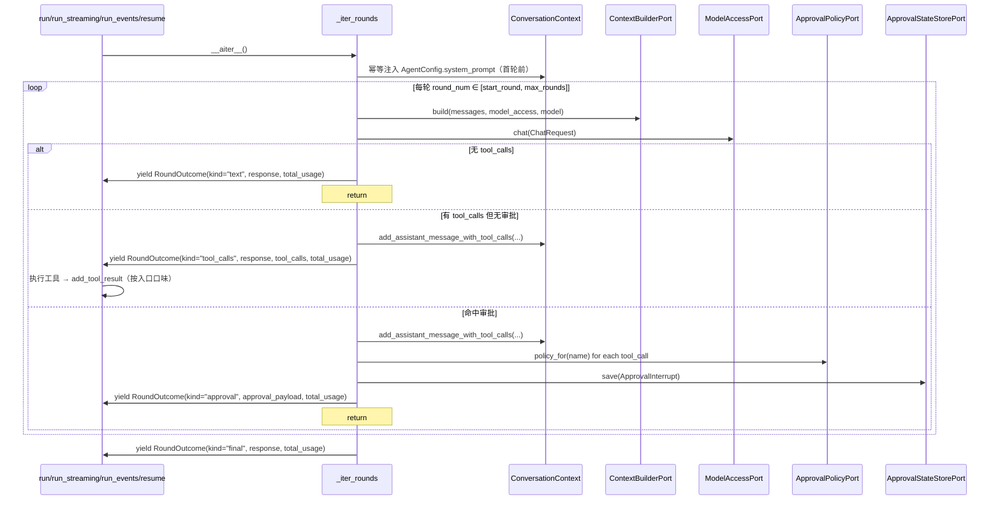

# 设计文档：Agent 适配器重构（ReAct 三循环合并与代码质量收口）

## 概述

本期为 `infrastructure/agent/react_agent_adapter.py` 与 `infrastructure/task/task_agent_adapter.py` 的纯内部质量重构，不引入新 Port、不调整 HTTP/SSE 契约、不影响审批语义。核心思路是：

1. 在 `ReActAgentAdapter` 内部抽取一个统一的"轮次推进异步生成器" `_iter_rounds`（即需求中的 `Round_Iterator`），由它产出 `RoundOutcome`（即需求中的 `Round_Outcome`），让 `run` / `run_streaming` / `run_events` / `resume` 四个入口都成为它的消费者，从而消除三份循环主体复制（覆盖需求 1）。
2. 给 `ConversationContext` 增加一个公开 API `add_assistant_message_with_tool_calls`，把 4 处 `context._messages.append(AssistantMessage(...))` 替换掉（覆盖需求 2）。
3. 在 `_iter_rounds` 与 `run_streaming` 消费者之间补充心跳 / 工具进度分片，避免长任务静默（覆盖需求 3）。
4. 在 `_iter_rounds` 推进过程中以"事件发生时刻"为口径维护 `message_index → timestamp_ms` 的内部映射，由 `TaskAgentAdapter._extract_trace` 读取真实时刻（覆盖需求 4）。
5. 在 `_execute_tool_call` 的异常分支补充 warning 级 `Tool_Failure_Log`（覆盖需求 5）。
6. 抽取 `_approval_to_stream_metadata` 共享 helper，让 `run_streaming` / `run_events` / `approval_interrupt_to_dict` 复用同一份 actions 序列化形态，且天然 JSON 安全（覆盖需求 6）。
7. 落定方案 A：在 `_iter_rounds` 入口处以幂等方式将"当前 Agent 自己的 `AgentConfig.system_prompt`"注入到 `ConversationContext`，与 `ChatServiceAdapter._ensure_system_prompt` 同语义（覆盖需求 7）。
8. 在 `TaskAgentAdapter.execute` 中按"已含任意 SystemMessage 即跳过"的幂等规则注入 `system_prompt`（覆盖需求 8）。
9. 落定方案 B：删除 `_apply_approval_decisions` 的 `respond` 死分支、`ApprovalDecisionType` 中的 `"respond"` 取值，并同步收敛文档与测试（覆盖需求 9）。

本设计严格遵循 [docs/steering/ddd-architecture.md](../../steering/ddd-architecture.md)（值对象 / Port 不动，新增内部生成器与值对象均位于 `infrastructure/agent/` 内）、[docs/steering/code-documentation.md](../../steering/code-documentation.md)（所有新增公开符号配中文 docstring）、[docs/steering/config-source.md](../../steering/config-source.md)（本期不新增配置项）、[docs/steering/uv-package-manager.md](../../steering/uv-package-manager.md)（不调整依赖，无包管理动作）。

#### 设计决策

| 决策 | 选定方案 | 理由 |
| --- | --- | --- |
| 三入口循环合并 | 在 `ReActAgentAdapter` 内部抽取异步生成器 `_iter_rounds`，产出 `RoundOutcome` | 单一推进点，四入口都改为消费者；`Round_Outcome.kind ∈ {"text","tool_calls","approval","final"}` 显式覆盖需求 1.2-1.6 |
| `RoundOutcome` 归属 | 放在 `infrastructure/agent/round_outcome.py`，仅服务于 `ReActAgentAdapter` 内部 | 仅 Adapter 用到，不进 `domain/`，避免污染领域层（需求 NFR.3） |
| `Round_Iterator` 与流式主路径的解耦 | `_iter_rounds` 只产出 `RoundOutcome`；心跳与工具进度由 `run_streaming` 在消费 outcome 之间产出，工具执行也由 `run_streaming` / `run_events` 自己围绕 outcome 调度，不收编进生成器 | 既保证"统一逐轮推进"，又保留 `run_events` 已有的"逐工具事件"语义；模型调用次数、消息序列与现状完全一致（需求 NFR.8） |
| 助手消息 + tool_calls 公开 API | `ConversationContext.add_assistant_message_with_tool_calls(content, tool_calls)` | 与既有 `add_assistant_message` / `add_tool_result` 命名风格一致（需求 2.3） |
| 心跳 / 工具进度分片形态 | `StreamingChunk(delta_content="", finished=False, metadata={"phase":..., "round":...})` | 不计入文本拼接、不触发收尾，保持 `ChatServiceAdapter.stream_chat` 现有"按 finished 分支"逻辑兼容（需求 3.4-3.7） |
| `Trace_Entry.timestamp_ms` 数据通路 | `_iter_rounds` 维护 `dict[int, int]`：`message_index → timestamp_ms`；`_extract_trace` 通过 `getattr(context, "_event_timestamps", {})` 读取，缺失项回退 `time.time()*1000` | 不改 `TraceEntry` 字段集合（需求 4.6），不改 `ConversationContext` 公开 API；事件时刻在事件实际发生时记录 |
| `Approval_Stream_Metadata` 共享 helper | 新增 `infrastructure/agent/approval_serialization.py:approval_actions_to_dicts` 与 `approval_payload_to_metadata` | 与 `approval_interrupt_to_dict` 复用同一组字段，并保证 JSON 直接序列化（需求 6.4-6.5） |
| `AgentConfig.system_prompt` 死字段 | 方案 A：`_iter_rounds` 入口处以"已存在任意 `SystemMessage` 即跳过"幂等注入；docstring 显式声明"per-Agent 独立"（需求 7.1-7.9） | 用户已落定 |
| `Respond` 决策 | 方案 B：删除分支、收窄 Literal、删除文档与测试中的 `respond` 字样；保留异常类 `ApprovalRespondNotAllowedError`（仍在 `tasks.md` 与 `test_approval_exceptions_unit.py` 中被引用） | 用户已落定；先于 Edit 前用 grep 验证唯一调用点位于 `react_agent_adapter.py:473` |

## 架构

### 模块依赖（component 视图）

```mermaid
graph LR
    Chat[ChatServiceAdapter] -->|run/run_streaming/run_events/resume| Adapter[ReActAgentAdapter]
    Task[TaskAgentAdapter] -->|run| Adapter
    Adapter -->|内部消费| Iter[_iter_rounds<br/>AsyncIterator&#91;RoundOutcome&#93;]
    Iter -->|build| Builder[ContextBuilderPort]
    Iter -->|chat| Model[ModelAccessPort]
    Iter -->|policy_for| Policy[ApprovalPolicyPort]
    Iter -->|save| Store[ApprovalStateStorePort]
    Adapter -->|execute| Tools[ToolRegistry]
    Adapter -->|metadata helper| Serial[approval_serialization]
    Serial -.复用.-> StoreSerial[approval_state_store.<br/>approval_interrupt_to_dict]
    Adapter -->|add_assistant_message_with_tool_calls<br/>add_tool_result| Ctx[ConversationContext]
    Task -->|_extract_trace 读取| Ctx
```



### 单轮推进序列（cross-component 视图）



### 包/目录结构（仅列变更点）

```
epsilon-boot/src/
├── domain/
│   ├── agent/
│   │   ├── value_objects.py             # docstring 修订；ApprovalDecisionType 移除 "respond"
│   │   └── exceptions.py                # 不动（保留 ApprovalRespondNotAllowedError）
│   └── chat/
│       └── context.py                   # 新增 add_assistant_message_with_tool_calls
├── infrastructure/
│   ├── agent/
│   │   ├── react_agent_adapter.py       # 抽取 _iter_rounds；run/run_streaming/run_events/resume 改为消费者；删除 _continue_after_tools；删除 respond 分支
│   │   ├── approval_policy_provider.py  # 不动逻辑（_VALID_DECISIONS 由 Literal 自动收敛）
│   │   ├── approval_serialization.py    # 新增：approval_actions_to_dicts / approval_payload_to_metadata
│   │   └── round_outcome.py             # 新增：RoundOutcome 数据类
│   └── task/
│       └── task_agent_adapter.py        # execute 幂等注入 system；_extract_trace 读取事件时刻
└── ...
```

## 组件与接口

### 1. `RoundOutcome` 值对象（新增）

- 位置：`epsilon-boot/src/infrastructure/agent/round_outcome.py`
- 职责：表示单轮推进的结构化结果，仅在 `ReActAgentAdapter` 内部流转。
- 完整签名：

```python
"""ReAct Agent 单轮推进结果模块。

定义 ``ReActAgentAdapter._iter_rounds`` 异步生成器产出的单轮结果值对象，
封装四种轮次终止形态（text / tool_calls / approval / final）及其携带的
LLM 响应、待执行工具调用、审批载荷与累计 token 用量。

本模块仅服务于 ``ReActAgentAdapter`` 内部统一轮次推进，不向 ``domain/`` 暴露。
"""

from __future__ import annotations

from dataclasses import dataclass, field
from typing import Literal

from domain.agent.value_objects import ApprovalRequiredPayload
from domain.model_access.value_objects import LLMResponse, ToolCallRequest

RoundOutcomeKind = Literal["text", "tool_calls", "approval", "final"]


@dataclass(frozen=True)
class RoundOutcome:
    """ReAct Agent 单轮推进结果值对象。

    由 ``ReActAgentAdapter._iter_rounds`` 在每轮模型调用结束后产出，
    四个执行入口（run / run_streaming / run_events / resume）按 ``kind``
    分支构造各自的对外形态。

    Attributes:
        kind: 轮次终止形态。
            ``"text"`` 表示模型返回纯文本回复，循环终止；
            ``"tool_calls"`` 表示存在 tool_calls 且无需审批，调用方需在本轮
            内逐个执行工具，工具执行完成后由调用方继续 ``__anext__``；
            ``"approval"`` 表示存在 tool_calls 且命中审批策略，循环终止；
            ``"final"`` 表示已达 ``config.max_rounds`` 仍未自然终止。
        round_num: 当前轮次序号，从 1 开始。
        response: 当前轮次的 LLM 响应；``"approval"`` / ``"text"`` /
            ``"tool_calls"`` / ``"final"`` 四种 kind 均必填。
        tool_calls: ``"tool_calls"`` kind 下的待执行工具调用列表，按模型返回顺序；
            其它 kind 为空 tuple。
        approval: ``"approval"`` kind 下的审批载荷；其它 kind 为 ``None``。
        total_usage: 截至本轮结束时累计的 token 用量。
        assistant_message_index: 本轮如果向 ``ConversationContext`` 追加了
            "携带 tool_calls 的 AssistantMessage"，记录该消息在
            ``ConversationContext.get_messages()`` 中的索引；
            供 ``TaskAgentAdapter._extract_trace`` 从事件时间索引读取真实
            时刻使用。``"text"`` / ``"final"`` kind 下为 ``None``。
    """

    kind: RoundOutcomeKind
    round_num: int
    response: LLMResponse
    total_usage: dict[str, int]
    tool_calls: tuple[ToolCallRequest, ...] = ()
    approval: ApprovalRequiredPayload | None = None
    assistant_message_index: int | None = None
```

### 2. `ReActAgentAdapter._iter_rounds`（新增内部生成器）

- 位置：`infrastructure/agent/react_agent_adapter.py`，`ReActAgentAdapter` 类内私有方法。
- 职责：统一执行"幂等注入 system → 上下文构建 → 模型调用 → tool_calls / 审批 / 终止判定"的单轮推进；不执行工具，把工具执行权交给四个入口的消费者。
- 完整签名（保持仓库现有 typing 风格）：

```python
async def _iter_rounds(
    self,
    context: ConversationContext,
    config: AgentConfig,
    model_access: ModelAccessPort,
    *,
    start_round: int = 1,
    initial_usage: dict[str, int] | None = None,
) -> AsyncIterator[RoundOutcome]:
    """统一的轮次推进异步生成器。

    覆盖 ``run`` / ``run_streaming`` / ``run_events`` / ``resume`` 四个入口的
    单轮推进语义。生成器的产出顺序由 ``RoundOutcome.kind`` 表达：

    - ``"tool_calls"``：调用方应在 ``__anext__`` 之前同步执行 ``outcome.tool_calls``
      并通过 ``context.add_tool_result`` 把结果回写到上下文；
    - ``"approval"`` / ``"text"`` / ``"final"``：生成器自身已停止迭代，
      调用方拿到该 outcome 后即可结束消费。

    本方法在首次进入循环之前以 ``System_Prompt_Idempotent_Injection`` 语义
    注入 ``config.system_prompt``：当 ``ConversationContext`` 中已存在任何
    ``SystemMessage`` 时跳过，否则追加一条；与
    ``ChatServiceAdapter._ensure_system_prompt`` 判定模式保持一致。

    Args:
        context: 对话上下文，原地修改（仅会追加 AssistantMessage / SystemMessage）。
        config: Agent 执行配置。
        model_access: 模型访问端口。
        start_round: 起始轮次号，``run`` / ``run_streaming`` / ``run_events``
            为 1，``resume`` 为 ``interrupt.round_num + 1``。
        initial_usage: 起始累计用量，``resume`` 时传入
            ``dict(interrupt.usage_so_far)``，其余入口传 ``None`` 视为空。

    Yields:
        每轮的 ``RoundOutcome``。
    """
```

实现要点（伪代码）：

```python
total_usage: dict[str, int] = dict(initial_usage or {})
self._ensure_agent_system_prompt(context, config)  # System_Prompt_Idempotent_Injection
last_response: LLMResponse | None = None

for round_num in range(start_round, config.max_rounds + 1):
    builder_result = await self._context_builder.build(
        context.get_messages(), model_access=model_access, model=config.model,
    )
    response = await model_access.chat(
        ChatRequest(
            messages=builder_result.serialized_messages,
            model=config.model,
            tools=config.tool_schemas,
        )
    )
    total_usage = merge_usage(total_usage, builder_result.usage, response.usage)
    last_response = response

    if not response.tool_calls:
        yield RoundOutcome(
            kind="text", round_num=round_num, response=response,
            total_usage=dict(total_usage),
        )
        return

    msg_index = self._record_assistant_with_tool_calls(context, response)
    pending = self._collect_pending_actions(response.tool_calls, config)
    if pending:
        approval = await self._save_interrupt(
            context, config, pending, round_num, response.model, total_usage,
        )
        yield RoundOutcome(
            kind="approval", round_num=round_num, response=response,
            tool_calls=tuple(response.tool_calls), approval=approval,
            total_usage=dict(total_usage), assistant_message_index=msg_index,
        )
        return

    yield RoundOutcome(
        kind="tool_calls", round_num=round_num, response=response,
        tool_calls=tuple(response.tool_calls), total_usage=dict(total_usage),
        assistant_message_index=msg_index,
    )
    # 工具执行由 caller 完成；caller 期望 add_tool_result 写回 context
    logger.info("Agent Loop 第 %d 轮完成，执行工具: %s",
                round_num, [tc.name for tc in response.tool_calls])

assert last_response is not None
yield RoundOutcome(
    kind="final", round_num=config.max_rounds, response=last_response,
    total_usage=dict(total_usage),
)
```

### 3. `ReActAgentAdapter._record_assistant_with_tool_calls`（新增私有方法）

- 位置：`infrastructure/agent/react_agent_adapter.py`，类内私有方法。
- 职责：把"追加助手消息 + 记录事件时间戳 + 返回消息索引"封装为一处，替代原 4 处 `context._messages.append(AssistantMessage(...))`。

```python
def _record_assistant_with_tool_calls(
    self,
    context: ConversationContext,
    response: LLMResponse,
) -> int:
    """将携带 tool_calls 的 AssistantMessage 追加到上下文并记录事件时刻。

    使用 ``ConversationContext.add_assistant_message_with_tool_calls`` 公开
    API 完成追加，避免直接访问 ``_messages``。同时把"该 AssistantMessage
    在消息列表中的索引 → 当前事件发生时刻（毫秒整数）"写入挂在 context
    上的 ``_event_timestamps`` 索引（不存在则懒创建），供
    ``TaskAgentAdapter._extract_trace`` 读取真实时刻。

    Args:
        context: 对话上下文，原地修改。
        response: 当前轮次模型响应。

    Returns:
        追加后的 AssistantMessage 在 ``context.get_messages()`` 中的索引。
    """
    context.add_assistant_message_with_tool_calls(
        content=response.content,
        tool_calls=list(response.tool_calls),
    )
    msg_index = context.message_count - 1
    self._stamp_event(context, msg_index)
    return msg_index
```

`_stamp_event` 与配套读取：

```python
@staticmethod
def _stamp_event(context: ConversationContext, message_index: int) -> None:
    """记录指定消息索引对应事件的发生时刻（毫秒整数）。"""
    stamps: dict[int, int] = getattr(context, "_event_timestamps", None)
    if stamps is None:
        stamps = {}
        setattr(context, "_event_timestamps", stamps)
    stamps[message_index] = int(time.time() * 1000)
```

### 4. `ReActAgentAdapter._ensure_agent_system_prompt`（新增私有方法，方案 A）

- 位置：`infrastructure/agent/react_agent_adapter.py`。
- 职责：在 `_iter_rounds` 入口处以幂等方式注入"当前 Agent 自己的" `system_prompt`。

```python
@staticmethod
def _ensure_agent_system_prompt(
    context: ConversationContext, config: AgentConfig,
) -> None:
    """以幂等方式注入当前 Agent 的 system_prompt。

    判定规则：当 ``context.get_messages()`` 中已存在任何 ``SystemMessage``
    时跳过，否则追加 ``config.system_prompt``。语义与
    ``ChatServiceAdapter._ensure_system_prompt`` 完全一致。

    本方法保证"每个 Agent 拥有独立的 system_prompt"：

    - ``AgentConfig`` 是 frozen dataclass，``system_prompt`` 字段在不同
      实例间互不共享、互不可变；
    - 子 Agent 拥有独立 ``ConversationContext`` 时（默认情形），首轮无
      SystemMessage，注入子 Agent 自己的 ``config.system_prompt``；
    - 子 Agent 复用父 Agent ``ConversationContext`` 时，父侧已注入过
      SystemMessage，幂等规则保证不重复注入，避免父子提示词冲突。

    Args:
        context: 对话上下文，可能被原地追加 SystemMessage。
        config: 当前 Agent 的执行配置。
    """
    if not config.system_prompt:
        return
    if any(m.role == "system" for m in context.get_messages()):
        return
    context.add_system_message(config.system_prompt)
```

> 与 `ChatServiceAdapter._ensure_system_prompt` 的语义对齐：均使用 `any(m.role == "system" ...)` 作为存在性判定，不做内容比对。`ChatServiceAdapter` 在 `chat` / `stream_chat` / `stream_chat_events` 入口先注入一次 `chat-default` 系统提示词，再调用 `AgentPort.run*`；`_iter_rounds` 进入后看到已有 system 消息便不重复注入，因此对 `ChatServiceAdapter` 路径完全无副作用。

### 5. 四个入口的精简实现（`run` / `run_streaming` / `run_events` / `resume`）

#### 5.1 `run`（同步）

```python
async def run(self, context, config, model_access) -> AgentResult:
    last: RoundOutcome | None = None
    async for outcome in self._iter_rounds(context, config, model_access):
        last = outcome
        if outcome.kind == "tool_calls":
            for tool_call in outcome.tool_calls:
                await self._execute_tool_call(context, tool_call, config)
            continue
        # text / approval / final 均由生成器自身收尾
        break
    assert last is not None
    return self._outcome_to_agent_result(last)
```

`_outcome_to_agent_result` 把 `kind` 分支翻译为现有 `AgentResult` 形态：`text` / `final` → `status="completed"`；`approval` → `status="approval_required"` 且 `approval=outcome.approval`。

#### 5.2 `run_streaming`（流式 + 心跳 + 工具进度）

```python
async def run_streaming(self, context, config, model_access):
    iterator = self._iter_rounds(context, config, model_access)
    try:
        outcome = await iterator.__anext__()
    except StopAsyncIteration:
        return  # max_rounds=0 不应发生（AgentConfig 禁止 max_rounds <= 0）

    while True:
        # 中间轮次心跳：仅在仍有后续轮次（即非 max_rounds 终止）时产出
        if outcome.kind == "tool_calls":
            yield self._heartbeat_chunk(outcome.round_num)
            for tool_call in outcome.tool_calls:
                yield self._tool_progress_chunk(outcome.round_num, tool_call, "start")
                await self._execute_tool_call(context, tool_call, config)
                yield self._tool_progress_chunk(outcome.round_num, tool_call, "end")
            try:
                outcome = await iterator.__anext__()
            except StopAsyncIteration:
                return
            continue

        if outcome.kind == "approval":
            yield StreamingChunk(
                delta_content=(
                    f"当前会话等待人工审批，approval_id={outcome.approval.approval_id}"
                ),
                finished=True,
                usage=outcome.total_usage,
                metadata=approval_payload_to_metadata(outcome.approval),
            )
            return

        # kind in {"text", "final"}：当前轮次同步已得到模型响应。
        # 为保留"max_rounds 触达时由流式 stream() 产出"的现有行为，
        # 仅当 outcome.kind == "final" 时再走一次 stream()，与原实现一致。
        if outcome.kind == "final":
            chat_request = ChatRequest(
                messages=...,  # 与 _iter_rounds 内部构建路径一致
                model=config.model,
                tools=config.tool_schemas,
            )
            ...  # 见 5.2.1 说明
            return

        # kind == "text"：复用同步响应，包装为单分片
        yield StreamingChunk(
            delta_content=outcome.response.content,
            finished=True,
            usage=outcome.total_usage,
        )
        return
```

##### 5.2.1 关于 `final` 轮次的流式产出

原实现是"达到 `max_rounds` 时直接 `model_access.stream()`"。重构后需保持该外部行为：

- `_iter_rounds` 在 `max_rounds` 轮模型 `chat()` 结束后产出 `kind="final"`；为避免重复模型调用，方案是在 `_iter_rounds` 内对最后一轮做条件分支：当 `round_num == config.max_rounds` 且仍有 tool_calls 时按现状发出 `final`（不再继续 chat）；当 `round_num == config.max_rounds` 且仍未触发自然终止前，`run_streaming` 不调用 `_iter_rounds` 处理"最后一轮的流式产出"，而是由 `run_streaming` 直接对最后一轮调用 `model_access.stream()`。
- 等价实现方式：把 `_iter_rounds` 的循环上限收为 `config.max_rounds - 1`，并要求 `run_streaming` 在 outcome 流耗尽后追加调用一次 `model_access.stream(...)` 输出最后一轮。`run` / `run_events` / `resume` 在循环耗尽后看到 `kind="final"` 时退化为现有"返回最后一轮 chat 响应内容"语义（与重构前 `run` / `run_events` 走过的 `assert response is not None` 分支一致）。

> 选定方案：**`_iter_rounds` 仍然推进到 `max_rounds`**，`run_streaming` 在循环开始前判断 `config.max_rounds`：当 `max_rounds == 1`（最后一轮即第一轮）时直接走 `model_access.stream()`；当 `max_rounds > 1` 时让 `_iter_rounds` 推到 `max_rounds - 1` 轮（在 `start_round=1` / `initial_usage=None` 时使用一个内部参数 `terminal_round=config.max_rounds - 1`），最后一轮由 `run_streaming` 自行 `model_access.stream()`。这一约束在 `_iter_rounds` 签名里通过命名参数 `terminal_round: int | None = None` 表达，默认 `None` 即为 `config.max_rounds`，仅 `run_streaming` 显式传入收紧值。该方案保证模型调用次数与原实现一致（`run_streaming` 模型调用次数 = `max_rounds`，其中最后一轮是流式调用）。

#### 5.3 `run_events`（结构化事件流）

```python
async def run_events(self, context, config, model_access):
    iterator = self._iter_rounds(
        context, config, model_access,
        terminal_round=config.max_rounds - 1,
    )
    async for outcome in iterator:
        yield AgentStreamEvent(
            kind="status",
            content=f"Agent round {outcome.round_num}",
            metadata={"round": outcome.round_num},
        )
        if outcome.kind == "tool_calls":
            for tool_call in outcome.tool_calls:
                yield AgentStreamEvent(kind="tool_start", ...)
                try:
                    self._ensure_tool_authorized(tool_call, config)
                    result = await self._tool_registry.execute(tool_call)
                except ToolPermissionDeniedError as exc:
                    result = str(exc)
                    self._log_tool_failure(tool_call, exc, "permission_denied")
                    yield AgentStreamEvent(kind="tool_error", ...)
                except Exception as exc:
                    result = str(exc)
                    self._log_tool_failure(tool_call, exc, "execution_error")
                    yield AgentStreamEvent(kind="tool_error", ...)
                else:
                    yield AgentStreamEvent(kind="tool_result", ...)
                context.add_tool_result(
                    tool_name=tool_call.name, result=result,
                    tool_call_id=tool_call.id,
                )
            continue
        if outcome.kind == "approval":
            yield AgentStreamEvent(
                kind="approval_required",
                content="当前请求等待人工审批，请通过审批恢复接口提交决策。",
                usage=outcome.total_usage,
                metadata=approval_payload_to_metadata(outcome.approval) | {
                    "round": outcome.round_num,
                },
            )
            return
        if outcome.kind == "text":
            if outcome.response.content:
                yield AgentStreamEvent(kind="assistant_delta",
                                       content=outcome.response.content)
            yield AgentStreamEvent(
                kind="assistant_done",
                usage=outcome.total_usage,
                metadata={"round": outcome.round_num},
            )
            return
        if outcome.kind == "final":
            # 与原实现一致：最后一轮使用 model_access.stream() 产出
            chat_request = ChatRequest(...)
            async for chunk in model_access.stream(chat_request):
                if chunk.delta_content:
                    yield AgentStreamEvent(kind="assistant_delta",
                                           content=chunk.delta_content)
                if chunk.finished:
                    yield AgentStreamEvent(
                        kind="assistant_done",
                        usage=merge_usage(outcome.total_usage, chunk.usage or {}),
                        metadata={"round": outcome.round_num},
                    )
            return
```

> 与原实现一致地保留 `run_events` 中的"逐工具事件"语义（`tool_start` / `tool_result` / `tool_error`）；仅当 `kind="final"` 时调用一次额外的 `stream()`，与原 `if round_num == config.max_rounds` 分支等价。`run_events` 不产出 `Heartbeat_Chunk` / `Tool_Progress_Chunk`（这两类分片仅服务于 `StreamingChunk` 形态），因此事件流不会出现新事件 kind（需求 1.11 + NFR.6 保证）。

#### 5.4 `resume`（审批恢复）

```python
async def resume(
    self, context, config, model_access, interrupt, decisions,
) -> AgentResult:
    await self._apply_approval_decisions(context, config, interrupt, decisions)
    last: RoundOutcome | None = None
    async for outcome in self._iter_rounds(
        context, config, model_access,
        start_round=interrupt.round_num + 1,
        initial_usage=dict(interrupt.usage_so_far),
    ):
        last = outcome
        if outcome.kind == "tool_calls":
            for tool_call in outcome.tool_calls:
                await self._execute_tool_call(context, tool_call, config)
            continue
        break
    assert last is not None
    return self._outcome_to_agent_result(last)
```

#### 5.5 `_continue_after_tools` 的去向

完全删除 `react_agent_adapter.py:237-302` 的整段方法。`resume` 直接复用 `_iter_rounds`，外部行为不变。

### 6. `_execute_tool_call` 增补 `Tool_Failure_Log`

```python
async def _execute_tool_call(self, context, tool_call, config) -> str:
    """执行单个工具调用并追加 ToolMessage。

    工具异常（含 ``ToolPermissionDeniedError``）按现状作为 ``ToolMessage``
    内容回灌给 LLM；同时输出 warning 级 ``Tool_Failure_Log``，确保线上
    工具失败可观测。日志只记录工具名、tool_call_id、异常类名与摘要，不
    记录工具入参完整文本，避免泄露密钥或大文本。
    """
    try:
        self._ensure_tool_authorized(tool_call, config)
        result = await self._tool_registry.execute(tool_call)
    except ToolPermissionDeniedError as exc:
        self._log_tool_failure(tool_call, exc, "permission_denied")
        result = str(exc)
    except Exception as exc:
        self._log_tool_failure(tool_call, exc, "execution_error")
        result = str(exc)
    context.add_tool_result(
        tool_name=tool_call.name, result=result, tool_call_id=tool_call.id,
    )
    return result


@staticmethod
def _log_tool_failure(
    tool_call: ToolCallRequest, exc: BaseException, reason: str,
) -> None:
    """输出工具失败 warning 日志（不携带工具入参完整文本）。"""
    logger.warning(
        "工具执行失败 tool=%s tool_call_id=%s reason=%s error=%s: %s",
        tool_call.name,
        tool_call.id,
        reason,
        type(exc).__name__,
        str(exc),
    )
```

`run_events` 的内联 `try/except` 也复用同一 `_log_tool_failure`（见 5.3 实现）。

### 7. `infrastructure/agent/approval_serialization.py`（新增）

```python
"""HITL 审批载荷的流式元数据共享序列化模块。

抽取 ``run_streaming`` / ``run_events`` 与
``approval_state_store.approval_interrupt_to_dict`` 共用的 actions 序列化
形态，保证 ``Approval_Stream_Metadata`` 可被标准 ``json.dumps`` 直接序列化。
"""

from __future__ import annotations

from typing import Any

from domain.agent.value_objects import (
    ApprovalRequiredPayload,
    PendingActionRequest,
)


def approval_actions_to_dicts(
    actions: tuple[PendingActionRequest, ...],
) -> list[dict[str, Any]]:
    """把 PendingActionRequest 元组序列化为 JSON 友好的 dict 列表。

    ``allowed_decisions`` 通过 ``sorted(...)`` 转 list，与
    ``approval_interrupt_to_dict`` 的 actions 形态保持完全一致。

    Args:
        actions: 待审批动作元组，顺序与模型 tool_calls 一致。

    Returns:
        每个 dict 至少包含 ``tool_call_id`` / ``tool_name`` / ``arguments`` /
        ``allowed_decisions`` / ``reason``，全部为 JSON 原生类型。
    """
    return [
        {
            "tool_call_id": action.tool_call_id,
            "tool_name": action.tool_name,
            "arguments": action.arguments,
            "allowed_decisions": sorted(action.allowed_decisions),
            "reason": action.reason,
        }
        for action in actions
    ]


def approval_payload_to_metadata(
    payload: ApprovalRequiredPayload,
) -> dict[str, Any]:
    """构造 run_streaming / run_events 共用的审批元数据。

    返回值满足以下不变量：

    - 顶层包含 ``status="approval_required"`` / ``session_id`` / ``approval_id`` /
      ``actions``；
    - 不直接引用 frozenset、tuple、dataclass 等不能被标准 ``json.dumps`` 处理的对象；
    - 与 ``approval_interrupt_to_dict`` 的 actions 形态严格一致。

    Args:
        payload: Agent 返回给上层的审批中断载荷。

    Returns:
        JSON 安全的元数据字典；调用方可按需 ``| {"round": ...}`` 合并轮次号。
    """
    return {
        "status": "approval_required",
        "session_id": payload.session_id,
        "approval_id": payload.approval_id,
        "actions": approval_actions_to_dicts(payload.actions),
    }
```

`approval_state_store.approval_interrupt_to_dict` 的实现按既有形态保留，但 actions 部分改为内联调用 `approval_actions_to_dicts(interrupt.actions)`，把"actions 字典字段"的事实标准下沉为同一个 helper（一处维护，三处复用）。

调用点替换 diff（共 3 处）：

| 文件:行 | 旧实现（关键片段） | 新实现 |
| --- | --- | --- |
| `react_agent_adapter.py:599-605` | `metadata={"status": ..., "actions": [action.__dict__ for action in approval.actions]}` | `metadata=approval_payload_to_metadata(approval)` |
| `react_agent_adapter.py:692-698` | `metadata={"round": ..., "session_id": ..., "actions": [action.__dict__ for ...]}` | `metadata=approval_payload_to_metadata(approval) \| {"round": round_num}` |
| `approval_state_store.py:28-37` | `"actions": [{"tool_call_id": ..., "allowed_decisions": sorted(...), ...} for action in interrupt.actions]` | `"actions": approval_actions_to_dicts(interrupt.actions)` |

### 8. `ConversationContext.add_assistant_message_with_tool_calls`（新增公开方法）

- 位置：`epsilon-boot/src/domain/chat/context.py`，紧邻既有 `add_assistant_message`（约第 271 行之后）。

```python
def add_assistant_message_with_tool_calls(
    self,
    content: str,
    tool_calls: list[ToolCallRequest],
) -> None:
    """追加一条携带工具调用的助手消息。

    与 ``add_assistant_message`` 的差异：本方法把模型返回的 ``tool_calls``
    一并写入 ``AssistantMessage.tool_calls``，用于在 ReAct Loop 中表达
    "助手请求执行工具"的语义；``add_assistant_message`` 仅追加纯文本助手
    消息。基础设施层的 Agent 适配器禁止直接访问 ``_messages`` 列表，应通过
    本方法完成"携带 tool_calls 的助手消息"追加。

    Args:
        content: 助手回复的文本内容；可能为空字符串（模型仅返回 tool_calls
            而无伴随文本）。
        tool_calls: LLM 返回的工具调用请求列表，按模型返回顺序。

    Notes:
        本方法不校验 ``tool_calls`` 是否为空——空列表的语义等价于
        ``add_assistant_message(content)``。但调用方仍应优先使用
        ``add_assistant_message`` 表达"无工具调用的助手回复"。
    """
    self._messages.append(
        AssistantMessage(content=content, tool_calls=list(tool_calls))
    )
```

替换调用点（共 4 处，全部位于 `infrastructure/agent/react_agent_adapter.py`）：

| 行号 | 原实现 | 替换为 |
| --- | --- | --- |
| 272-274 | `context._messages.append(AssistantMessage(content=response.content, tool_calls=response.tool_calls))` | `self._record_assistant_with_tool_calls(context, response)` |
| 363-365 | 同上 | 同上 |
| 582-584 | 同上 | 同上 |
| 675-677 | 同上 | 同上 |

> 替换后 `react_agent_adapter.py` 中不再保留任何对 `context._messages` 的访问；全仓 `infrastructure/` 在重构落地后对 `_messages` 的访问只剩 `domain/chat/context.py` 内部（属于值对象自身实现，不属于跨边界访问，符合需求 2.6）。

### 9. `TaskAgentAdapter` 修订

#### 9.1 `execute()` 的系统消息幂等注入（覆盖需求 8）

修改 `epsilon-boot/src/infrastructure/task/task_agent_adapter.py:196-198`：

```python
# 2. 构造系统提示词并按幂等规则添加到上下文
system_prompt = self.build_system_prompt(task)
existing_system = next(
    (m for m in context.get_messages() if m.role == "system"),
    None,
)
if existing_system is None:
    context.add_system_message(system_prompt)
elif existing_system.content != system_prompt:
    logger.info(
        "复用既有 system 消息（与本次 build_system_prompt 不一致）",
        extra={
            "session_id": task.session_id,
            "prompt_id": self._task_template_prompt_id,
        },
    )
```

判定规则与 `ChatServiceAdapter._ensure_system_prompt` 完全一致（"是否存在 system 消息"，不基于内容比对）；当内容不一致时仅输出 info 日志，不重复追加。

#### 9.2 `_extract_trace` 时间戳来源（覆盖需求 4）

```python
def _extract_trace(
    self, messages: list[BaseMessage], start_index: int,
    *, event_timestamps: dict[int, int] | None = None,
) -> list[TraceEntry]:
    """从 ConversationContext 新增消息中提取执行轨迹。

    时间戳来源：

    - 若 ``event_timestamps`` 中存在该消息索引对应的发生时刻（毫秒整数），
      则用作 ``TraceEntry.timestamp_ms``；
    - 否则按需求 4.5 仍以毫秒形式回退到 ``int(time.time() * 1000)``。

    本改动不影响 ``TraceEntry`` 字段集合（仍为 step / action / detail /
    timestamp_ms），且每个 ``TraceEntry`` 的时间戳允许彼此不同（需求 4.4）。
    """
```

执行入口替换：

```python
# 8. 提取执行轨迹（事件时刻索引由 ReActAgentAdapter 在推进时写入）
event_timestamps = getattr(context, "_event_timestamps", {}) or {}
trace = self._extract_trace(
    context.get_messages(), pre_message_count,
    event_timestamps=event_timestamps,
)
```

`event_timestamps` 的产生位置：`ReActAgentAdapter._record_assistant_with_tool_calls` 已在追加 `AssistantMessage` 时打戳；同时 `_execute_tool_call`（以及 `run_events` 的内联工具执行块）在 `context.add_tool_result(...)` 之后立即调用 `self._stamp_event(context, context.message_count - 1)` 为新增的 `ToolMessage` 索引打戳。整个链路只读写挂在 `context` 上的 `_event_timestamps` 属性，不需要扩展 `ConversationContext` 的公开字段（保持需求 4.6 字段集合不变）。

> 风险点：`message_index` 越界。由 `ReActAgentAdapter` 在唯一的"追加点"打戳，`TaskAgentAdapter._extract_trace` 仅按 `enumerate(messages[start_index:], start=start_index)` 读取，二者键空间对齐；context 复用时旧索引仍指向不变消息（messages 仅追加不删除），不会越界。

## 数据模型

本期不引入新的领域值对象、不调整持久化模型、不新增配置键。增量仅限：

| 模型 | 变更 | 位置 |
| --- | --- | --- |
| `RoundOutcome`（值对象） | 新增 frozen dataclass | `infrastructure/agent/round_outcome.py` |
| `RoundOutcomeKind` | 新增 `Literal["text","tool_calls","approval","final"]` | 同上 |
| `ApprovalDecisionType` | 收窄为 `Literal["approve", "edit", "reject"]`（移除 `"respond"`） | `domain/agent/value_objects.py:84` |
| `AgentConfig.system_prompt` 注释 | 修订 docstring，明确"per-Agent 独立、由 ReActAgentAdapter 在首轮前幂等注入" | `domain/agent/value_objects.py:39, 49` |
| `ApprovalDecision.message` 注释 | 修订 docstring，将"`reject` 或 `respond` 决策携带的人工说明"改为"`reject` 决策携带的人工说明" | `domain/agent/value_objects.py:153` |
| `ConversationContext.add_assistant_message_with_tool_calls` | 新增公开方法 | `domain/chat/context.py`（紧邻 `add_assistant_message`） |
| `_event_timestamps` 属性 | 由 `ReActAgentAdapter` 通过 `setattr` 挂在 `ConversationContext` 实例上的内部映射 `dict[int, int]`；不属于 `ConversationContext` 的公开 API、不参与 `to_dict()` / `from_dict()` 序列化 | 运行期挂载 |

`AgentConfig.system_prompt` 字段类型仍为 `str`，不可变性不变；多 Agent 委派下子 Agent 注入"自己 `AgentConfig` 实例的 `system_prompt`"，frozen dataclass 与值传递保证不同 Agent 之间互不污染（需求 7.5）。

## 事务与并发边界

本期改动**不涉及任何持久化写操作**：`_iter_rounds` 内对 `ConversationContext` 的修改仍在调用方持有的内存对象内，最终仍由 `ChatServiceAdapter` / `TaskAgentAdapter` 在原有位置调用 `SessionContextStorePort.save(...)`；审批中断的 `ApprovalStateStorePort.save(...)` 调用点位置不变（仍在 `_save_interrupt`）。

并发口径：

- 单次 `run` / `run_streaming` / `run_events` / `resume` 调用是单协程顺序执行，`_iter_rounds` 不引入并发分支；
- 同一 `session_id` 的并发请求在原架构下由 `SessionContextStorePort` 的实现层（本地文件锁 / Redis）保证一致性，本期不变更；
- `_event_timestamps` 字典挂在 `ConversationContext` 实例上，与该实例同生命周期；不跨请求共享、不持久化，不引入并发风险。

> 因本期无新增数据库写入与多数据源协同，故此章节略去事务传播 / 回滚规则细节。

## 正确性属性

### Property 1（轮次推进单源化）

任意一次 `run` / `run_streaming` / `run_events` / `resume` 调用在重构后只通过 `_iter_rounds` 完成"上下文构建 → 模型调用 → tool_calls / 审批 / 终止判定"的单轮推进；任意"上下文构建 → 模型调用 → tool_calls 分支"的代码片段在 `react_agent_adapter.py` 中只能出现 1 次（生成器内部那一份）。

验证需求：1.1, 1.7, 1.8, 1.9, 1.10, 1.12, 11

### Property 2（消息追加 API 不绕过封装）

`epsilon-boot/src/infrastructure/` 下任何生产代码不再出现对 `ConversationContext._messages` 的直接读写；所有"携带 tool_calls 的助手消息"均通过 `add_assistant_message_with_tool_calls` 追加。

验证需求：2.1, 2.4, 2.5, 2.6

### Property 3（流式不静默）

对任意 `run_streaming` 调用，若实际进入第 K 轮（K 为中间轮次，即 K < `max_rounds` 且模型返回 tool_calls），则在该轮内至少产出 1 个 `Heartbeat_Chunk` 与每个工具的两枚 `Tool_Progress_Chunk`（`phase="start"` / `phase="end"`），且这些分片满足 `finished=False` 与 `delta_content=""`。

验证需求：3.1, 3.2, 3.3, 3.4, 3.5

### Property 4（流式心跳与最终用量隔离）

`run_streaming` 在最终轮次产出的 `finished=True` 分片的 `usage` 字段，与重构前同一调用路径下产出的 `usage` 字段在所有 key 上数值相等。心跳 / 工具进度分片的产出不会改变 `total_usage` 的累计逻辑。

验证需求：3.6, 3.7

### Property 5（HITL 元数据 JSON 可序列化）

对任意 `Approval_Stream_Metadata`（无论由 `run_streaming` 还是 `run_events` 产出），`json.dumps(metadata)` 在不传入自定义 `default` 的情况下成功；且 `metadata["actions"]` 与 `approval_interrupt_to_dict(interrupt)["actions"]` 字段集合及类型完全一致。

验证需求：6.1, 6.2, 6.3, 6.4, 6.5, 6.6

### Property 6（Trace 时间戳事件时刻语义）

对任意一次 `TaskAgentAdapter.execute(task)` 执行：每个 `TraceEntry.timestamp_ms` 来自该事件实际发生时刻；若 Agent 在执行中观测到事件 e1（model 返回 tool_calls）发生在事件 e2（工具结果产生）之前的真实时间，则 `e1.timestamp_ms <= e2.timestamp_ms`（毫秒整数粒度）。

验证需求：4.1, 4.2, 4.3, 4.4, 4.5, 4.6

### Property 7（工具失败可观测）

任意 `_execute_tool_call` / `run_events` 内联工具执行抛出异常的分支，至少输出 1 条 warning 级日志，且日志内容包含 `tool_call.name` 与 `tool_call.id` 与异常类名/摘要，但不包含 `tool_call.arguments` 完整文本。

验证需求：5.1, 5.2, 5.3, 5.4, 5.5, 5.6

### Property 8（每 Agent 独立 system_prompt）

对任意两次 `_iter_rounds(context, config_a, ...)` 与 `_iter_rounds(context', config_b, ...)`：(a) 当 `context` / `context'` 不共享时，注入的 SystemMessage 内容分别为 `config_a.system_prompt` / `config_b.system_prompt`；(b) 当二者共享同一 `context` 且首次注入由父 Agent 完成时，子 Agent 的注入因幂等规则被跳过；不存在"父 Agent 系统提示词被注入到只属于子 Agent 的 context"的情形。

验证需求：7.1, 7.2, 7.4, 7.5, 7.6, 7.7, 7.8

### Property 9（系统消息幂等）

对任意同 `session_id` 的连续两次 `TaskAgentAdapter.execute(task)`，第二次执行结束后该会话上下文中 `SystemMessage` 数量相比第一次执行结束后不增加。

验证需求：8.1, 8.2, 8.3, 8.4, 8.5

### Property 10（`respond` 决策不可达）

`ApprovalDecisionType` 不再包含 `"respond"`；`_apply_approval_decisions` 不再包含 `decision.type == "respond"` 分支；任何针对 `respond` 的恢复请求会在领域校验阶段（`ApprovalDecisionNotAllowedError`）就失败。

验证需求：9.1, 9.2, 9.3, 9.4, 9.5

## 错误处理

### 错误类型矩阵（不新增、不修改既有错误码）

| 错误类型 | 错误码 | 触发场景 | 本期处理变化 |
| --- | --- | --- | --- |
| `ToolPermissionDeniedError` | 60004 | `_ensure_tool_authorized` 拒绝 | 现状 + 新增 warning 日志 |
| `ApprovalDecisionCountMismatchError` | 60023 | `_apply_approval_decisions` 决策数量不匹配 | 不变 |
| `ApprovalDecisionOrderMismatchError` | 60024 | 决策顺序错位 | 不变 |
| `ApprovalDecisionNotAllowedError` | 60025 | 决策类型不在 `allowed_decisions` 内 | 不变；`respond` 永远走这条 |
| `ApprovalEditToolNameMismatchError` | 60026 | `edit` 决策修改了工具名 | 不变 |
| `ApprovalEditInvalidArgumentsError` | 60027 | `edit` 决策参数非法 | 不变 |
| `ApprovalRespondNotAllowedError` | 60028 | （仅作为异常类保留，不再被任何代码路径 raise；保留以兼容 `test_approval_exceptions_unit.py:87` 与历史 `human-in-the-loop` 文档） | 删除 raise 调用点；类本身保留 |
| 工具内部异常（`Exception`） | 60001 系列 | `_tool_registry.execute` 抛出 | 现状（作为 ToolMessage 内容回灌）+ 新增 warning 日志 |

### 异常传播路径

- `_iter_rounds` 抛出异常时：异常透传给四个入口的 `async for` 循环，未被捕获 → 透传给 `ChatServiceAdapter` / `TaskAgentAdapter`；`TaskAgentAdapter.execute` 已有 `except Exception` → 包装为 `TaskResult(status=FAILED)`；`ChatServiceAdapter.chat` 透传给 FastAPI 全局异常处理器。整体行为与重构前一致。
- HITL 中断在四个入口的统一表达：`_iter_rounds` 产出 `kind="approval"` 的 `RoundOutcome`，`run` / `resume` → `AgentResult(status="approval_required", approval=...)`；`run_streaming` → 单一 `finished=True` 且 `metadata.status="approval_required"` 的 `StreamingChunk`；`run_events` → 单一 `kind="approval_required"` 的 `AgentStreamEvent`。三种形态的 metadata 现在通过 `approval_payload_to_metadata(payload)` 同步生成。
- 工具失败回灌 LLM 的语义保持不变：异常被捕获后 `str(exc)` 作为 `ToolMessage.content`；新增 warning 日志位于回灌之前。

### `Respond` 删除清单（grep 验证后确认）

代码删除（共 4 处）：

| 文件:行 | 删除内容 |
| --- | --- |
| `epsilon-boot/src/infrastructure/agent/react_agent_adapter.py:24` | 移除 `from domain.agent.exceptions import (... ApprovalRespondNotAllowedError ...)` 这一项 |
| `epsilon-boot/src/infrastructure/agent/react_agent_adapter.py:471-478` | 删除 `elif decision.type == "respond":` 整段分支（含 raise 与 `add_tool_result` 调用） |
| `epsilon-boot/src/domain/agent/value_objects.py:84` | 收窄 `ApprovalDecisionType = Literal["approve", "edit", "reject"]` |
| `epsilon-boot/src/domain/agent/value_objects.py:86-89` | 删除 docstring 中 `respond` 解释 |

值对象 docstring 同步：

- `epsilon-boot/src/domain/agent/value_objects.py:153`（`ApprovalDecision.message` 注释）：删除 "或 `respond`"。

`StaticApprovalPolicyProvider._VALID_DECISIONS`：实际位置为 `infrastructure/agent/approval_policy_provider.py:15` 的模块级 `_VALID_DECISIONS = frozenset(get_args(ApprovalDecisionType))`。Literal 收窄后 `_VALID_DECISIONS` 自动变为 `frozenset({"approve","edit","reject"})`，无需手动改这一行——但要在 design 中明确该收敛是 Literal 改动的副作用。

`ApprovalRespondNotAllowedError`：grep 显示其调用点仅为 `react_agent_adapter.py:473`；测试文件 `test_approval_exceptions_unit.py:87` 仍在断言异常类的字段（不依赖代码路径触发）；规格 `docs/spec/human-in-the-loop/tasks.md:28` 仍在历史清单中。**保留异常类**，仅删除 raise 调用点；不动 `test_approval_exceptions_unit.py`，避免与历史规格说明冲突。

文档同步（grep 验证后清单）：

| 文件:行 | 处置 |
| --- | --- |
| `docs/agent.md:97` | 把"按顺序应用 `approve/edit/reject/respond` 决策" → "按顺序应用 `approve/edit/reject` 决策" |
| `docs/tools.md:89` | 删除"现有工具默认不开放 `respond`；该决策仅作为未来 ask-user 类工具的扩展点。"整句 |
| `docs/api.md:55` | 删除"`respond` 未开放返回 400" 短语 |
| `docs/spec/human-in-the-loop/*` | 不动。该 spec 是历史决策原始记录，本期不重写历史文档；只在最新 `agent-adapter-refactor` spec 中显式声明方案 B 落定 |

测试同步：

| 文件:行 | 处置 |
| --- | --- |
| `epsilon-boot/test/domain/agent/test_approval_value_objects_property.py:15` | `decision_st = st.sampled_from(["approve", "edit", "reject"])`（移除 `"respond"`） |
| `epsilon-boot/test/infrastructure/agent/test_approval_policy_provider_property.py:14` | `st.sampled_from(["approve", "edit", "reject"])` |
| `epsilon-boot/test/infrastructure/agent/test_approval_policy_provider_property.py:34` | filter 集合内移除 `"respond"` |
| `epsilon-boot/test/domain/agent/test_approval_exceptions_unit.py:87-92` | 不动（异常类仍保留，单元测试断言其字段） |

### 错误处理总原则

- 所有异常仍然继承 `BizException`，保持错误码 6xxxx 段不变；
- 不引入新的错误返回风格（既有"工具异常作为 ToolMessage 内容回灌"语义保留）；
- 日志统一通过模块级 `logger = logging.getLogger(__name__)`，不使用 `print`（需求 5.6）。

## 测试策略

### 测试文件矩阵

| 文件 | 处置 | 关键场景 |
| --- | --- | --- |
| `test/infrastructure/agent/test_react_agent_adapter_unit.py` | 修改 | 现有"单轮无工具调用"、"多轮工具调用"、"max_rounds"、"工具异常"用例迁移到 `_iter_rounds` 路径下复跑；不变量：`AgentResult.status` 取值集合、`StreamingChunk` 字段、`AgentStreamEvent.kind` 取值集合、模型调用次数。 |
| `test/infrastructure/agent/test_react_agent_adapter_property.py` | 修改 | 现有 property 测试（围绕 `run`）保持原断言；同时新增 property："任意构造的多轮交互下，`run` 与 `_iter_rounds` 流式产出的最终 `AgentResult.content` 等价"。 |
| `test/infrastructure/agent/test_react_agent_streaming_unit.py` | **新增** | 心跳分片：中间轮次至少 1 个 `Heartbeat_Chunk`，`finished=False` 且 `delta_content=""`；工具进度：每个工具产出 `phase="start"` / `phase="end"` 各 1 个，`metadata` 含 `round` / `tool_name` / `tool_call_id` 但不含 `arguments` 全文。覆盖需求 3.1-3.8。 |
| `test/infrastructure/agent/test_react_agent_hitl_unit.py` | 修改 | 现有 HITL 单元测试保留；新增："`Approval_Stream_Metadata` 可被 `json.dumps` 直接序列化（`run_streaming` 与 `run_events` 两个入口）"，覆盖需求 6.1-6.6。 |
| `test/infrastructure/agent/test_react_agent_events_unit.py` | 修改 | 增补"`run_events` 不产生 Heartbeat / Tool_Progress 类 `AgentStreamEvent`"断言（NFR.6）。 |
| `test/infrastructure/agent/test_react_agent_resume_unit.py`（已有）/ `test_react_agent_hitl_unit.py` | 修改 | resume 路径走 `_iter_rounds`：从中断恢复后产出的 `AgentResult` / 二次 HITL 行为与重构前等价；新增"`respond` 决策被 `ApprovalDecisionNotAllowedError` 拒绝（不再走死分支）"。覆盖需求 9.5。 |
| `test/infrastructure/agent/test_react_agent_tool_failure_log_unit.py` | **新增** | 使用 `caplog`：(a) 工具内部异常 → 出现 1 条 WARNING、含工具名 / tool_call_id / 异常类名，但不含 arguments；(b) `ToolPermissionDeniedError` → 出现 1 条 WARNING 且 `reason="permission_denied"`。覆盖需求 5.1-5.6。 |
| `test/domain/chat/test_context_add_assistant_with_tool_calls_unit.py` | **新增** | 调用 `add_assistant_message_with_tool_calls("", [tc1, tc2])`：消息列表末尾为 `AssistantMessage(content="", tool_calls=[tc1, tc2])`；多次调用追加不覆盖；`tool_calls=[]` 时退化语义。覆盖需求 2.1-2.3。 |
| `test/infrastructure/task/test_task_agent_adapter_unit.py` | 修改 | 增补：(a) "已含 SystemMessage 的 `ConversationContext` 二次执行后 SystemMessage 数量保持 1"；(b) "已含 SystemMessage 但内容不一致" → 仅产出 info 日志，不追加；(c) "Trace 时间戳取自事件时刻而非 `_extract_trace` 调用时刻：mock `time.time` 在事件发生时返回 1000，在 `_extract_trace` 调用时返回 9999，断言 `trace[i].timestamp_ms == 1000_000`"。覆盖需求 4.1-4.6, 8.1-8.6。 |
| `test/infrastructure/task/test_task_agent_adapter_property.py` | 修改 | 增补 property："对任意工具调用序列，`trace[i].timestamp_ms <= trace[i+1].timestamp_ms`（毫秒整数粒度，允许相等）"。覆盖需求 4.4。 |
| `test/infrastructure/agent/test_react_agent_system_prompt_injection_unit.py` | **新增** | 三场景：(a) 空 context → 注入 `config.system_prompt`；(b) context 已含任一 SystemMessage → 不再追加；(c) 多 Agent 委派双 context：父 ctx 注入父 prompt，子 ctx 注入子 prompt，互不污染。覆盖需求 7.1-7.8。 |
| `test/domain/agent/test_approval_value_objects_property.py:15` | 修改 | `decision_st` 收敛为 `["approve","edit","reject"]`。 |
| `test/infrastructure/agent/test_approval_policy_provider_property.py:14, 34` | 修改 | 同上。 |
| `test/domain/agent/test_approval_exceptions_unit.py:87-92` | 不动 | 异常类仍保留。 |
| `test/infrastructure/chat/test_agent_loop_streaming.py` | 不动 | 集成测试主路径不变；流式分片新增项不破坏既有断言（既有断言只关心最终 `finished=True` 分片内容）。需要本地复跑确认。 |

### 不变量回归测试要求

每个修改入口入到 PR 时必须确认以下断言仍然成立：

1. `AgentResult.status` 取值仍为 `Literal["completed", "approval_required"]`；
2. `StreamingChunk` 字段集合不变（仅 `metadata` 内追加 `phase` / `round` / `tool_name` / `tool_call_id` 等键）；
3. `AgentStreamEvent.kind` 取值集合仍为 `{"status","assistant_delta","assistant_done","tool_start","tool_result","tool_error","approval_required","error"}`；
4. 同一调用路径下模型调用次数与重构前一致：
   - `run`：N 轮共 N 次 `chat()`；
   - `run_streaming`：N-1 次 `chat()` + 1 次 `stream()`（最后一轮）；当 `max_rounds=1` 时仅 1 次 `stream()`；
   - `run_events`：同 `run_streaming`；
   - `resume`：从 `interrupt.round_num + 1` 起，与重构前 `_continue_after_tools` 调用次数一致。

### 与需求验收标准的回溯

| 需求 | 验收标准编号 | 测试文件 |
| --- | --- | --- |
| 1 | 1.1-1.12 | `test_react_agent_adapter_unit.py` 修改, `test_react_agent_adapter_property.py` 修改 |
| 2 | 2.1-2.6 | `test_context_add_assistant_with_tool_calls_unit.py` 新增, 静态扫描"`infrastructure/` 下不含 `_messages.append`" |
| 3 | 3.1-3.8 | `test_react_agent_streaming_unit.py` 新增 |
| 4 | 4.1-4.6 | `test_task_agent_adapter_unit.py` 修改, `test_task_agent_adapter_property.py` 修改 |
| 5 | 5.1-5.6 | `test_react_agent_tool_failure_log_unit.py` 新增 |
| 6 | 6.1-6.6 | `test_react_agent_hitl_unit.py` 修改 |
| 7 | 7.1-7.8 | `test_react_agent_system_prompt_injection_unit.py` 新增 |
| 8 | 8.1-8.6 | `test_task_agent_adapter_unit.py` 修改 |
| 9 | 9.1-9.6 | `test_react_agent_hitl_unit.py` 修改 + `test_approval_value_objects_property.py` / `test_approval_policy_provider_property.py` 修改 |

### Property-based 测试约定

Hypothesis 已是项目既有依赖（`test_react_agent_adapter_property.py` 等已使用）。本期新增 property 测试沿用 `@settings(max_examples=100, deadline=5000)` 默认配置，与既有约定一致。

## 回滚与风险

### 主要风险点

1. **轮次循环统一过程中误吞 `Approval_Interrupt`**：`_iter_rounds` 在 `kind="approval"` 分支后必须 `return`，且四个入口收到 `kind="approval"` 后立即终止消费；测试 `test_react_agent_hitl_unit.py` 已覆盖此不变量，新增 property 显式断言"产出 `kind="approval"` 后生成器停止迭代"。
2. **子 Agent `system_prompt` 错位**：`_ensure_agent_system_prompt` 接收的是当前 Agent 自己的 `AgentConfig`，与 `DelegationAdapter`/`TaskAgentAdapter` 调用 `AgentPort.run` 时传入的 `AgentConfig` 一致；frozen dataclass 不可变保证父 Agent 的 `system_prompt` 不会泄漏。`test_react_agent_system_prompt_injection_unit.py` 双 Agent 场景 (c) 显式覆盖。
3. **`message_index` 越界**：仅由 `ReActAgentAdapter` 在唯一追加点写入 `_event_timestamps`，键空间与 `context.get_messages()` 索引同步生长；`TaskAgentAdapter._extract_trace` 仅按已知索引 `getattr(context, "_event_timestamps", {})` 查表，缺失项回退 `time.time()*1000`，永不引发越界。
4. **`run_streaming` 最终轮次的 stream() 路径**：方案要求 `_iter_rounds` 推到 `max_rounds - 1`、`run_streaming` 自己处理最后一轮 `stream()`；如果 `_iter_rounds` 把 `terminal_round` 错算成 `max_rounds` 会导致一次额外 `chat()` 调用。集成测试 `test_agent_loop_streaming.py` 通过统计 `model_access.chat.call_count` / `model_access.stream.call_count` 拦截该回归。
5. **`Approval_Stream_Metadata` 序列化口径偏移**：通过单元测试断言 `metadata == approval_payload_to_metadata(payload) | ...` 与 `json.dumps(metadata)` 同时通过，避免后续手改 helper 又回退到 `__dict__` 形态。

### 灰度策略

本期为纯内部重构，无开关、无配置，无灰度需求。建议按以下顺序拆分提交，方便逐步验证（每个切分点都应在 CI 通过、关键测试用例新增/复跑后再合入）：

1. **PR-1：`ConversationContext.add_assistant_message_with_tool_calls` + 静态替换**。
   - 新增公开方法 + docstring + 单元测试；
   - 同步替换 `react_agent_adapter.py` 4 处 `context._messages.append(...)`；
   - 不引入 `_iter_rounds`、不调整循环主体。
2. **PR-2：`approval_serialization.py` 与 HITL 元数据 JSON 化**。
   - 新增 helper；
   - 替换 `react_agent_adapter.py:599-604` 与 `:692-697` 两处 `__dict__`；
   - 在 `approval_state_store.py:28-37` 内联使用同一 helper；
   - 单元测试确认 `json.dumps` 不抛异常。
3. **PR-3：`_execute_tool_call` 与 `run_events` 的 `Tool_Failure_Log` + `respond` 死分支删除**。
   - `_log_tool_failure` 抽取；
   - `_apply_approval_decisions` 删除 `respond` 分支；
   - `ApprovalDecisionType` 收窄为三值；
   - 同步修订文档与测试；
   - `caplog` 单元测试覆盖。
4. **PR-4：`_iter_rounds` 抽取 + 三入口改为消费者 + `_continue_after_tools` 删除 + `run_streaming` 心跳/工具进度分片**。
   - 引入 `RoundOutcome`；
   - 实现 `_iter_rounds`、`_record_assistant_with_tool_calls`、`_stamp_event`、`_ensure_agent_system_prompt`、`_outcome_to_agent_result`；
   - `run` / `run_streaming` / `run_events` / `resume` 改写；
   - 删除 `_continue_after_tools`；
   - 新增流式心跳与工具进度分片；
   - 关键回归：`test_agent_loop_streaming.py` 与 `test_react_agent_adapter_unit.py` 全部通过，模型调用次数与原实现一致。
5. **PR-5：`TaskAgentAdapter` 系统消息幂等 + `Trace_Entry` 时间戳事件时刻**。
   - 修改 `execute()` 系统消息注入分支；
   - `_extract_trace` 增补 `event_timestamps` 参数；
   - 新增 / 修改 `test_task_agent_adapter_unit.py` 与 property 测试；
   - 不变量：首次执行结果未变。

> 5 个 PR 之间相互独立，PR-1 与 PR-2、PR-3 之间无依赖；PR-4 依赖 PR-1 提供的公开 API；PR-5 依赖 PR-4 提供的 `_event_timestamps` 写入路径，可与 PR-4 同 PR 提交，也可分开作为最末尾的可独立验证切分点。

## 遵循的 Steering 检查清单

| Steering 文档 | 适用要求 | 本设计如何满足 |
| --- | --- | --- |
| `docs/steering/ddd-architecture.md` | `domain/` 不依赖 `infrastructure/`；新增 Port 应位于 `domain/`，Adapter 位于 `infrastructure/` | `RoundOutcome` 与 `_iter_rounds` 仅服务于 `ReActAgentAdapter` 内部，置于 `infrastructure/agent/`；`add_assistant_message_with_tool_calls` 是 `domain/chat/context.py` 既有值对象的方法扩展，不引入外部依赖；`ApprovalDecisionType` 收窄发生在 `domain/agent/value_objects.py` 内，仅依赖 `typing`；`approval_serialization.py` 位于 `infrastructure/agent/`，不被 `domain/` 反向依赖。 |
| `docs/steering/code-documentation.md` | 模块、类、公开函数/方法需中文 docstring | 所有新增模块（`round_outcome.py` / `approval_serialization.py`）、新增方法（`add_assistant_message_with_tool_calls` / `_iter_rounds` / `_ensure_agent_system_prompt` / `_record_assistant_with_tool_calls` / `_log_tool_failure` / `approval_actions_to_dicts` / `approval_payload_to_metadata`）、修订的 `_extract_trace`、修订的 `AgentConfig.system_prompt` docstring 全部使用中文 docstring，明确职责、参数与返回值。 |
| `docs/steering/config-source.md` | 新增配置写入 `config.properties`，禁止仅写 `.env` | 本期不新增任何配置项，无适用对象。 |
| `docs/steering/uv-package-manager.md` | 后端依赖管理仅允许 `uv` | 本期不调整 `pyproject.toml`、不增删依赖，无 `pip` / `poetry` 等命令使用。 |
