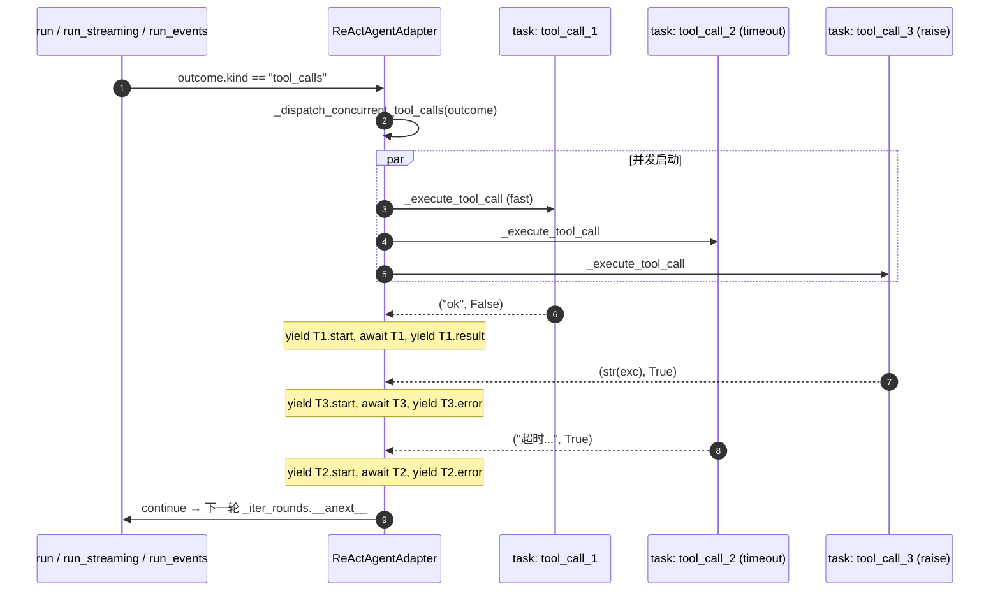

# 设计文档：Agent Quality Assessment 2 — P0 性能/正确性/数据一致性强化

## 概述

本设计落地 `requirement.md` 的三项 P0 改造：(1) `Concurrent_Tool_Execution` 把 `ReActAgentAdapter` 的 `run` / `resume` / `run_streaming` / `run_events` 四个入口同轮 `tool_calls` 由串行改为 `asyncio.gather` 并发；(2) `Pairing_Aware_Trimming` 让 `SlidingWindowCompactionAdapter` 在裁剪时识别 `AssistantMessage(tool_calls)` 与 `ToolMessage(tool_call_id)` 的 `Tool_Pair_Group` 整组保留/丢弃；(3) `Session_Optimistic_Lock_Cycle` 给 `RedisSessionContextAdapter` 引入 `WATCH/MULTI/EXEC` CAS 周期，并给 `LocalFileSessionContextAdapter` 提供基于 `EXCLUSIVE` 文件锁的等价实现，新增方法在末尾追加进 `SessionContextStorePort`。

设计遵循的仓库规范：

- `docs/steering/ddd-architecture.md`：CAS / WATCH / Lua / 文件锁等技术细节封装在 `infrastructure/`，端口仅暴露领域语义；`Session_Conflict_Error` 落 `domain/chat/exceptions.py`（领域语义，与 `domain/chat/ports.py` 同层）。
- `docs/steering/config-source.md`：`SESSION_REDIS_CONFLICT_RETRY_MAX` 等所有新增配置项写入 `epsilon-boot/config.properties`，`.env` 仅作为本地覆盖。
- `docs/steering/uv-package-manager.md`：本期不引入新依赖；如需补充 hypothesis/pytest 类辅助库，统一通过 `uv add`。
- `docs/steering/code-documentation.md`：新增公开类、方法、`@property` 一律附中文 docstring，复杂的 CAS / 配对扫描算法在 docstring 中补充背景说明。

## 设计决策

| 决策点 | 选定方案 | 理由 |
| --- | --- | --- |
| D1 `asyncio.gather` 形态（R1.5 / R1.10） | `return_exceptions=False` + 在 `_execute_tool_call` 内部把所有失败转为 `(content, True)` 返回，`gather` 永不抛 | `_execute_tool_call` 已经在 v3 把 `ToolPermissionDeniedError` / `Exception` / `asyncio.TimeoutError` 全部 catch，正常路径下 `gather` 不可能拿到异常；`return_exceptions=True` 反而需要在 caller 端再做一遍异常分发。保持 caller 简单一致。 |
| D2 单 `tool_call` fast path（R1.10） | `len(outcome.tool_calls) == 1` 时直接 `await self._execute_tool_call(...)`，**不**进入 `gather` 包装 | v3 单工具路径已稳定，避免引入额外 task 创建开销 / 事件时序漂移；测试矩阵中既有断言可不改写。 |
| D3 事件配对相邻策略（R1.3 / R1.4） | 每个 `Tool_Call_Request` 包装为一个 task，task 内部依次产出 `start → 执行 → end/result/error` 三事件序列；外层用 `asyncio.as_completed` 按 task 完成顺序消费，把该 task 的事件序列**作为整段** yield | 既允许同轮多工具按完成顺序错峰可见（流式体验），又严格保证同一 `tool_call_id` 的 start/end 之间不会穿插他者事件；不需要任何外部事件队列 / 锁。 |
| D4 工具间共享状态（R1.7 / R1.9） | 仅 `ConversationContext.add_tool_result` 这一公开写入点；并发 task 各自独立调用，不共享中间局部状态。`add_tool_result` 是 list append + 索引返回，append 在 CPython 单事件循环内**原子**，无需额外锁 | `ConversationContext` 在领域层已被设计为单事件循环单实例；`event_timestamps` / `_messages` 仅在事件循环中被同一适配器写入，无跨线程访问。 |
| D5 写回顺序与 R1.7 一致性 | `_execute_tool_call` 在 task 内部完成 `add_tool_result` + `_stamp_event`，因此 `context.get_messages()` 末尾的 `Tool_Result_Message` 顺序由"task 完成顺序"决定，**不**保证与 `outcome.tool_calls` 顺序一致；R1.7 仅约束等量映射与 `tool_call_id` 一一对应，不约束顺序 | 与 OpenAI / Anthropic 服务端契约一致——服务端只校验"每个 `tool_calls[i].id` 都有 `tool_call_id` 对应的 ToolMessage"，不要求顺序；保留并发收益。R1.11(b) 的"按 `outcome.tool_calls` 顺序产出 3 条 `Tool_Result_Message`"在 design 阶段细化为"集合等量、`tool_call_id` 一一对应、`metadata['error']` 一一相同"——见 Property 4。 |
| D6 `Pairing_Aware_Trimming` 算法（R2.2 / R2.5） | 单次反向扫描：从尾部向头部累计构造"已保留 group"集合，遇到 ToolMessage 先入候选缓冲；遇到 AssistantMessage(tool_calls) 时在缓冲中按 `tool_call_id` 全集匹配，全集匹配则整组保留并消耗对应配额，否则整组丢弃 | 单次 O(N) 扫描；反向天然契合"最近 N 条非 system"语义；半组永远在窗口边界先被丢弃；与 LangGraph `trim_messages(strategy="last")` 的语义对齐。 |
| D7 `Pairing_Aware_Trimming` 配额计数（R2.6） | 配额在"保留时"扣减，整组保留按"组内全部消息条数"计数；配额耗尽后即使后续是 plain user/assistant 也停止保留 | 与"最近 N 条非 system"原意一致——把配对组视为 atomic 但仍计入条数；不向更早历史扩展去补足配额。 |
| D8 CAS 路径（R3.1） | `WATCH` + `MULTI/EXEC`（pipeline 模式） | 不引入 Lua 脚本预编译复杂度；`aioredis` 已原生支持 `WATCH` / `pipeline.execute()`；对调试友好（直接观察 Redis 命令）；与 LangGraph `RedisSaver` 选型一致。Lua 路径作为备选不进入本期实现。 |
| D9 端口扩展形态（R3.1 / R3.2） | 在 `SessionContextStorePort` 末尾追加 `compare_and_swap(session_id, mutator)` 单方法（接收一个异步 mutator 回调），由 adapter 内部完成 "load → mutator → save" 重试循环 | 对调用方 API 最小侵入；adapter 内部对调用方屏蔽 WATCH / 文件锁差异；调用方仅传一个对 `ConversationContext` 做幂等修改的 mutator；与"端口仅暴露领域语义"一致。`load_for_update` + `save_if_unchanged` 二段形态会把"版本号"等技术细节泄漏到端口，被本设计拒绝。 |
| D10 重试机制归属（R3.4） | adapter 内部循环重试，重试上限由 `SESSION_REDIS_CONFLICT_RETRY_MAX` 配置；耗尽抛 `Session_Conflict_Error` 让上层感知 | 调用方使用 `compare_and_swap` 时只关心"成功 / 失败"两态，重试细节属于实现层面；与 v3 `Tool_Timeout_Failure_Semantics` 把超时收口在 adapter 的风格一致。 |
| D11 `Session_Conflict_Error` 归属（R3.5 / 已知约束 1） | 定义在 `domain/chat/exceptions.py`，错误码段 `60xxx`（与 `BizException` 风格一致；建议 `60040`）；adapter 抛出，调用方按需 catch | 该异常属于领域语义"会话写入冲突无法在重试上限内解决"，调用方（`ChatServiceAdapter` / 上层路由）需要据此感知；放在 domain 与 `domain/chat/ports.py` 同层不引入反向依赖。 |
| D12 `LocalFileSessionContextAdapter` 对等实现（R3.3） | 复用既有 `EXCLUSIVE` 文件锁——在锁持有期间执行 "read → mutator → atomic write"，等价于 CAS 周期；不需要"版本字段" | 文件锁本身是悲观锁，但对外语义与 Redis 乐观重试等价（同样保证"提交时观察到的状态与读取时一致"）；不引入新依赖。 |
| D13 配置键集合 | 仅新增 `SESSION_REDIS_CONFLICT_RETRY_MAX`（默认 `3`），其余无新配置 | 重试已由 adapter 内部循环表达；CAS 超时 / Lua 预编译无必要（不走 Lua 路径）。`3` 与业内 RedisSaver / Anthropic SDK 默认值一致，留出冲突缓冲又不会无限重试导致请求挂死。 |
| D14 `compare_and_swap` 与既有 `save` 的关系 | `compare_and_swap` 作为新增独立方法；既有 `save` 单写者路径不退化、无破坏性改动，旧调用方不主动迁移仍可用 | 端口"仅末尾追加"约束（R3.2）；CAS 主要服务于 `ChatServiceAdapter` 中"同一 `session_id` 下 chat / resume_approval / clear_session 等存在并发"的场景；其它纯 read-then-write 场景上层可逐步迁移。 |
| D15 mutator 是否允许返回值 | mutator 签名 `(ConversationContext) -> Awaitable[T]`；`compare_and_swap` 透传 mutator 返回值，便于调用方拿到"业务侧本次修改的副产物"（如新追加消息的索引） | 与 `add_tool_result` 返回 `int` 索引的现有风格一致；一处 API 同时承担"原子 update + 业务返回"。 |
| D16 测试规模阈值（R1.11(a) NFR-1） | 同轮 3 个工具各 `await asyncio.sleep(0.5)`，断言 `elapsed < 1.2s`；CI 抗噪：测试在前置 `event_loop` warm-up 后执行；保留 0.7s 余量 | 串行总和 1.5s，并发理论 ~0.5s + 调度；1.2s 阈值在 GitHub Actions / 本地容器下均稳定通过。 |

## 架构

### 组件视图

```mermaid
graph LR
  subgraph application
    A[ChatServiceAdapter]
  end
  subgraph infrastructure_agent
    B[ReActAgentAdapter]
    B1[_execute_tool_call]
    B2[_iter_rounds]
  end
  subgraph infrastructure_chat
    C[SlidingWindowCompactionAdapter]
  end
  subgraph infrastructure_session
    D1[RedisSessionContextAdapter]
    D2[LocalFileSessionContextAdapter]
  end
  subgraph domain_chat
    P1[ContextCompactionPort]
    P2[SessionContextStorePort]
    E[Session_Conflict_Error]
  end
  A --> B
  A --> P1
  A --> P2
  B --> B1
  B --> B2
  C -.implements.-> P1
  D1 -.implements.-> P2
  D2 -.implements.-> P2
  D1 -.raises.-> E
  D2 -.raises.-> E
  C -. uses .-> ToolPair[Tool_Pair_Group 扫描]
  B -. asyncio.gather .-> B1
```

依赖方向：`application/` → `domain/` ← `infrastructure/`，与 `docs/steering/ddd-architecture.md` 一致；`Session_Conflict_Error` 在 `domain/chat/exceptions.py` 暴露，adapter 抛出，调用方仅依赖领域异常。

### `Concurrent_Tool_Execution` 时序图（同轮 3 个工具，1 失败 1 成功 1 超时）



关键约束：每个 task 的事件序列**整段** yield，绝不交叉（D3）；HITL 路径在 `_iter_rounds` 已提前 return，不进入此并发分支（NFR-5）。

### 包/目录结构

无目录新增，所有改动落在既有文件：

```
epsilon-boot/src/
  domain/
    chat/
      exceptions.py                                  ← 新文件：Session_Conflict_Error
      ports.py                                       ← 修改：SessionContextStorePort 末尾追加 compare_and_swap
  infrastructure/
    agent/
      react_agent_adapter.py                         ← 修改：四入口工具并发 + 新增 _dispatch_concurrent_tool_calls / _stream_concurrent_tool_progress / _events_concurrent_tool_calls 辅助
    chat/
      sliding_window_compaction_adapter.py           ← 修改：compact_messages 引入 _trim_with_pairing 内部算法
    session/
      redis_session_context_adapter.py               ← 修改：实现 compare_and_swap (WATCH/MULTI/EXEC + 重试)
      local_file_session_context_adapter.py          ← 修改：实现 compare_and_swap (EXCLUSIVE 锁内 read-modify-write)
      session_lock_config.py                         ← 新文件：SessionLockConfig (SESSION_REDIS_CONFLICT_RETRY_MAX)
test/
  infrastructure/
    agent/
      test_react_agent_concurrent_tool_calls_unit.py        ← 新增
      test_react_agent_concurrent_tool_calls_property.py    ← 新增
      test_react_agent_concurrent_resume_unit.py            ← 新增
    chat/
      test_sliding_window_pairing_aware_unit.py             ← 新增
      test_sliding_window_pairing_aware_property.py         ← 新增
    session/
      test_redis_session_context_cas_unit.py                ← 新增
      test_redis_session_context_cas_property.py            ← 新增
      test_local_file_session_context_cas_unit.py           ← 新增（或扩展既有 unit）
config.properties                                            ← 追加 SESSION_REDIS_CONFLICT_RETRY_MAX=3
```

## 组件与接口

### 1. `ReActAgentAdapter` 工具并发改造（`infrastructure/agent/react_agent_adapter.py`）

#### 1.1 新增辅助：单次工具执行的事件包装器

仅由 `run_events` / `run_streaming` 使用，把"该轮某个 tool_call 的 start/end/result 事件序列"封装为可被 task 整段产出的列表，配合 `asyncio.as_completed` 按完成顺序整段 yield，保证 `Tool_Event_Pair_Adjacency`。

```python
async def _execute_tool_call_with_events(
    self,
    context: ConversationContext,
    tool_call: ToolCallRequest,
    config: AgentConfig,
    round_num: int,
) -> tuple[ToolCallRequest, str, bool]:
    """并发分支下执行单个工具调用并返回 ``(tool_call, result, is_error)``。

    本方法仅作为 ``asyncio.gather`` / ``asyncio.as_completed`` 的工作单元，
    不直接 yield 事件——事件 yield 由调用方根据本方法的返回值与
    ``Tool_Event_Pair_Adjacency`` 约束统一安排。

    内部直接复用 ``_execute_tool_call``：鉴权、超时（``Tool_Timeout_Failure_Semantics``）、
    异常捕获、``add_tool_result`` 写回、``metadata['error']`` 失败标记、
    ``_stamp_event`` 时间戳全部沿用既有语义，并发不改变其中任一行为。

    Args:
        context: 对话上下文，原地修改（``add_tool_result`` 写回的并发安全
            性见设计决策 D4）。
        tool_call: 待执行的工具调用请求。
        config: Agent 执行配置。
        round_num: 当前轮次号（仅用于事件 metadata 透传，不影响执行）。

    Returns:
        ``(tool_call, result, is_error)`` 三元组；``result`` / ``is_error``
        语义与 ``_execute_tool_call`` 完全一致。
    """
```

#### 1.2 新增辅助：四入口共用的并发分发器

```python
async def _dispatch_concurrent_tool_calls(
    self,
    context: ConversationContext,
    tool_calls: tuple[ToolCallRequest, ...],
    config: AgentConfig,
) -> None:
    """同轮多个 ``Tool_Call_Request`` 并发执行的统一入口（``run`` / ``resume`` 复用）。

    决策 D2：``len(tool_calls) == 1`` 时直接 ``await`` 单 task 路径，
    与 v3 串行行为字面等价；``len(tool_calls) >= 2`` 时通过
    ``asyncio.gather(return_exceptions=False)`` 并发调度。

    决策 D1：``_execute_tool_call`` 已把 ``ToolPermissionDeniedError`` /
    ``asyncio.TimeoutError`` / ``Exception`` 全量转为 ``(content, True)``，
    ``gather`` 不会观察到异常；并发分支与串行分支的"任一失败不影响他者
    回灌"语义一致（``Tool_Failure_Feedback_Semantics``）。

    决策 D5：``Tool_Result_Message`` 的最终顺序由 task 完成顺序决定，
    与 ``tool_calls`` 输入顺序未必一致；``Conversation_Context`` 的最终
    一致性由"等量、``tool_call_id`` 一一对应"保证（R1.7 / Property 6）。

    Args:
        context: 对话上下文，原地修改。
        tool_calls: 同一 ``RoundOutcome`` 中的 ``outcome.tool_calls``，
            元组形态保证 caller 不会在并发期间修改。
        config: Agent 执行配置。
    """
```

#### 1.3 新增辅助：`run_streaming` 的并发 + 事件配对相邻产出

```python
async def _stream_concurrent_tool_progress(
    self,
    context: ConversationContext,
    tool_calls: tuple[ToolCallRequest, ...],
    config: AgentConfig,
    round_num: int,
) -> AsyncIterator[StreamingChunk]:
    """``run_streaming`` 同轮工具并发版本：保持 ``Tool_Event_Pair_Adjacency``。

    决策 D3：每个 ``tool_call`` 包装为 ``asyncio.create_task``；外层用
    ``asyncio.as_completed`` 按完成顺序消费 task 结果，对每个完成的
    task 整段 yield 该工具的 ``tool_progress(start)`` →
    ``tool_progress(end)`` 两个 ``StreamingChunk``，绝不"先 yield 全部
    start，再 yield 全部 end"。

    Args:
        context: 对话上下文，原地修改。
        tool_calls: 同轮工具调用列表（已剥离审批路径）。
        config: Agent 执行配置。
        round_num: 当前轮次号（``StreamingChunk.metadata['round']``）。

    Yields:
        ``StreamingChunk``：``tool_progress`` 相邻成对，按 task 完成顺序。
    """
```

#### 1.4 新增辅助：`run_events` 的并发 + 事件配对相邻产出

```python
async def _events_concurrent_tool_calls(
    self,
    context: ConversationContext,
    tool_calls: tuple[ToolCallRequest, ...],
    config: AgentConfig,
    round_num: int,
) -> AsyncIterator[AgentStreamEvent]:
    """``run_events`` 同轮工具并发版本：保持 ``Tool_Event_Pair_Adjacency``。

    与 ``_stream_concurrent_tool_progress`` 同构，但产出的事件 kind 为
    ``tool_start`` / ``tool_result`` / ``tool_error``。决策 D3 一致：
    每个 task 的 ``tool_start`` 与对应 ``tool_result`` / ``tool_error``
    必须连续 yield，不允许穿插他者事件。

    Args:
        context: 对话上下文，原地修改。
        tool_calls: 同轮工具调用列表。
        config: Agent 执行配置。
        round_num: 当前轮次号（``metadata['round']``）。

    Yields:
        ``AgentStreamEvent``：每个 ``tool_call_id`` 的 start/result-or-error
        相邻产出。
    """
```

#### 1.5 四入口的具体替换点

`run`（替换原 727 行 `for tool_call in outcome.tool_calls: await self._execute_tool_call(...)`）：

```python
async for outcome in self._iter_rounds(context, config, model_access):
    if outcome.kind == "tool_calls":
        await self._dispatch_concurrent_tool_calls(
            context, outcome.tool_calls, config,
        )
        continue
    return self._outcome_to_agent_result(outcome)
```

`resume`（替换原 835 行）：与 `run` 同形态，`_apply_approval_decisions` 内部仍保持严格 `Hitl_Decision_Application_Order`（不动）。

`run_streaming`（替换原 1052 行 `for tool_call in outcome.tool_calls: yield start; await execute; yield end`）：

```python
if outcome.kind == "tool_calls":
    yield self._heartbeat_chunk(outcome.round_num)
    async for chunk in self._stream_concurrent_tool_progress(
        context, outcome.tool_calls, config, outcome.round_num,
    ):
        yield chunk
    last_usage = outcome.total_usage
    continue
```

`run_events`（替换原 1147 行 `for tool_call in outcome.tool_calls: yield tool_start; await execute; yield tool_result/error`）：

```python
if outcome.kind == "tool_calls":
    async for event in self._events_concurrent_tool_calls(
        context, outcome.tool_calls, config, outcome.round_num,
    ):
        yield event
    last_usage = outcome.total_usage
    continue
```

### 2. `SlidingWindowCompactionAdapter` 配对保护（`infrastructure/chat/sliding_window_compaction_adapter.py`）

#### 2.1 内部新增方法

```python
def _trim_with_pairing(
    self,
    non_system_messages: list[BaseMessage],
) -> list[BaseMessage]:
    """对非 system 消息列表执行 ``Pairing_Aware_Trimming``。

    决策 D6：单次反向扫描算法，时间复杂度 O(N)。流程：

    1. 维护尾部"已保留消息"反向缓冲 ``kept_reverse: list[BaseMessage]``
       与已使用配额 ``used: int``。
    2. 从 ``non_system_messages[-1]`` 向头部遍历：

       a. 当前消息为 ``ToolMessage``：临时收集到"待匹配 ToolMessage 缓冲"
          ``pending_tools_by_id: dict[str, ToolMessage]``（按 ``tool_call_id``
          索引）；不计入 ``used``，等待对应 ``Assistant_Tool_Calls_Message``
          配对时整组结算。

       b. 当前消息为 ``AssistantMessage(tool_calls)``：检查其全部
          ``tool_calls[i].id`` 是否都在 ``pending_tools_by_id`` 中。
          - 全集匹配且整组消息条数（assistant + N 个 tool）``<= max_messages - used``：
            整组保留，``used += 组内消息条数``，从 ``pending_tools_by_id``
            移除已配对的 ``tool_call_id``，把整组消息以正向顺序插入
            ``kept_reverse`` 头部。
          - 任一 ``tool_call_id`` 未在缓冲中（半组在窗口外）或配额不足：
            整组丢弃（``No_Half_Tool_Group_Pass_Through``）；
            ``logger.debug`` 记录 "丢弃 tool_call 半组：N=<missing_count>
            assistant_msg=<short_id> reason=<missing|over_quota>"。

       c. 当前消息为 ``Assistant_Message`` 不带 ``tool_calls`` /
          ``UserMessage``：``used < max_messages`` 时单独保留，否则停止扫描。

    3. 扫描结束后，``pending_tools_by_id`` 中残留的 ``ToolMessage`` 表示
       "ToolMessage 在窗口内但 assistant 在窗口外"——按
       ``No_Half_Tool_Group_Pass_Through`` 整组丢弃，同样 ``logger.debug``
       记录。

    决策 D7：配额耗尽即停，不向更早历史扩展。

    Args:
        non_system_messages: 已剔除 ``SystemMessage`` 的消息列表，按原始顺序。

    Returns:
        裁剪后的非 system 消息列表，按原始正向顺序，``len(...) <= max_messages``，
        且满足 ``Pairing_Aware_Trimming`` 的两条对偶约束（Property 8 / 9）。
    """
```

#### 2.2 `compact_messages` 改写

```python
def compact_messages(self, messages: list[BaseMessage]) -> list[BaseMessage]:
    """同步压缩消息列表（``Pairing_Aware_Trimming`` 升级版）。

    新流程：

    1. 空输入退化（R2.9）；
    2. 拆分为 ``system_messages`` / ``non_system_messages``，``system_messages``
       全保留（R2.1）；
    3. 当 ``non_system_messages`` 中无任何 ``ToolMessage`` 时，退化到 v3
       原有 "最近 max_messages 条非 system" 路径，输出与 v3 字面等价
       （R2.10 / Property 11）；
    4. 否则调用 ``self._trim_with_pairing(non_system_messages)`` 得到配对
       保护裁剪结果；
    5. 返回 ``system_messages + trimmed_non_system_messages``。
    """
```

`compact` 异步入口签名不变，端口签名零变更（R2.7）。

### 3. `SessionContextStorePort` 端口扩展（`domain/chat/ports.py`）

末尾追加：

```python
class SessionContextStorePort(Protocol):
    # 既有 save / load / delete 不变 ...

    async def compare_and_swap(
        self,
        session_id: str,
        mutator: "Callable[[ConversationContext], Awaitable[T]]",
    ) -> T:
        """在 ``Session_Optimistic_Lock_Cycle`` 内原子地"读取-修改-提交"。

        语义：

        1. 加载当前会话上下文（不存在则等价 ``ConversationContext()``）；
        2. 在底层后端的"原子保护期"内调用 ``mutator(ctx)``；mutator 应对
           ``ctx`` 做幂等的就地修改并返回业务侧需要的副产物（如新追加
           消息的索引）；
        3. 若提交时检测到 ``Session_Write_Conflict``，由 adapter 内部按
           ``Session_Conflict_Retry_Max`` 自动重试整个 read-modify-write 周期；
        4. 重试上限内成功 → 返回 mutator 的返回值；
        5. 重试上限耗尽仍冲突 → 抛出
           ``domain.chat.exceptions.SessionConflictError``。

        端口本身不暴露版本号 / WATCH / 文件锁等技术细节（DDD 边界）。

        Args:
            session_id: 会话唯一标识符。
            mutator: 异步修改回调，接收当前 ``ConversationContext`` 并就地
                修改；返回值原样透传给调用方。**注意**：mutator 可能因冲突
                重试而被多次调用，必须保证幂等。

        Returns:
            mutator 的返回值（``T``）；类型由调用方决定。

        Raises:
            SessionConflictError: ``Session_Conflict_Retry_Max`` 耗尽仍发生
                ``Session_Write_Conflict`` 时抛出。
            其它后端异常（``aioredis.RedisError`` / ``OSError``）：按 v3
                既有日志范式记录后透传，CAS 改造不收窄/不改写。
        """
        ...
```

为支持上述类型签名，新增 import：

```python
from collections.abc import Awaitable, Callable
from typing import TypeVar

T = TypeVar("T")
```

### 4. `Session_Conflict_Error` 异常（`domain/chat/exceptions.py`，新文件）

```python
"""会话领域异常定义。

定义会话上下文存储相关的领域级异常。``Session_Conflict_Error`` 用于在
``Session_Optimistic_Lock_Cycle`` 重试上限耗尽时让调用方感知并发冲突。
"""

from common.exceptions import BizException


class SessionConflictError(BizException):
    """会话写入冲突无法在重试上限内解决。

    ``RedisSessionContextAdapter`` / ``LocalFileSessionContextAdapter`` 在
    ``compare_and_swap`` 路径下检测到 ``Session_Write_Conflict`` 并按
    ``SESSION_REDIS_CONFLICT_RETRY_MAX`` 重试后仍失败时抛出。

    Attributes:
        session_id: 触发冲突的会话标识。
        retry_count: 实际重试次数（与配置上限相等时表示完全耗尽）。
    """

    def __init__(self, session_id: str, retry_count: int) -> None:
        super().__init__(
            code=60040,
            message=f"会话写入冲突重试 {retry_count} 次后仍失败",
        )
        self.session_id = session_id
        self.retry_count = retry_count
```

### 5. `RedisSessionContextAdapter` CAS 实现（`infrastructure/session/redis_session_context_adapter.py`）

#### 5.1 新增方法

```python
async def compare_and_swap(
    self,
    session_id: str,
    mutator: Callable[["ConversationContext"], Awaitable[T]],
) -> T:
    """基于 ``WATCH/MULTI/EXEC`` 的 ``Session_Optimistic_Lock_Cycle`` 实现。

    决策 D8：选用 ``WATCH/MULTI/EXEC`` 而非 Lua；底层使用
    ``aioredis`` 的 ``client.pipeline(transaction=True)`` 上下文，先
    ``await pipe.watch(key)``，再 ``await pipe.get(key)`` 拿到当前值，
    在 mutator 修改后通过 ``pipe.multi()`` + ``pipe.set(key, data, ex=ttl)``
    + ``await pipe.execute()`` 一次提交：

    - ``execute()`` 返回 ``None`` 视为 ``Session_Write_Conflict``，按
      ``SESSION_REDIS_CONFLICT_RETRY_MAX`` 重试；
    - ``execute()`` 返回非 ``None`` 视为成功，返回 mutator 的返回值；
    - 重试上限耗尽抛 ``SessionConflictError``，``logger.error`` 记录最少
      必要字段（``session_id`` / ``error_class="SessionConflictError"`` /
      ``retry_count``），不记录 ``Conversation_Context`` 全文（NFR-4）；
    - 重试期间每次冲突均 ``logger.info`` 记录 ``session_id`` /
      ``retry_count`` / ``outcome="retry"``；最终成功 ``logger.info``
      ``outcome="success"``，最终放弃 ``logger.info`` ``outcome="give_up"``
      （在 ``logger.error`` 之前）。

    决策 D14：``save`` / ``load`` / ``delete`` 既有方法保持原签名与原逻辑，
    仅 ``compare_and_swap`` 走 CAS 路径。``aioredis.RedisError`` 在 watch /
    get / execute 任一阶段抛出时按 v3 既有 ``logger.error`` 范式记录后透传
    （R3.8）。

    Args:
        session_id: 会话唯一标识符。
        mutator: 异步修改回调；可能因冲突被多次调用，必须幂等。

    Returns:
        mutator 的返回值。

    Raises:
        SessionConflictError: 重试上限耗尽。
        aioredis.RedisError: Redis 客户端层异常透传。
    """
```

#### 5.2 配置注入

构造函数追加可选参数 `conflict_retry_max: int | None = None`，由 `_create_session_store` 在 `container_config.py` 中从 `session_lock_config` 读取注入；为保持与既有签名兼容，参数有默认值。

```python
def __init__(
    self,
    redis_client: aioredis.Redis,
    key_prefix: str = "session:context:",
    ttl_seconds: int = 3600,
    conflict_retry_max: int | None = None,
) -> None:
    """初始化 Redis 会话上下文存储适配器。

    Args:
        redis_client: aioredis 异步客户端实例（由组合根装配）。
        key_prefix: Redis key 前缀，默认 ``session:context:``。
        ttl_seconds: 会话 key TTL（秒），默认 ``3600``；CAS 提交分支
            最终 ``SET`` 仍带 ``ex=ttl_seconds`` 不破坏既有 TTL（R3.7）。
        conflict_retry_max: ``Session_Optimistic_Lock_Cycle`` 重试上限；
            ``None`` 时使用 ``SESSION_REDIS_CONFLICT_RETRY_MAX`` 配置值
            （默认 ``3``）。
    """
```

### 6. `LocalFileSessionContextAdapter` CAS 对等实现（`infrastructure/session/local_file_session_context_adapter.py`）

```python
async def compare_and_swap(
    self,
    session_id: str,
    mutator: Callable[["ConversationContext"], Awaitable[T]],
) -> T:
    """基于 ``EXCLUSIVE`` 文件锁的 ``Session_Optimistic_Lock_Cycle`` 等价实现。

    决策 D12：文件锁本身是悲观锁，但对外语义与 Redis CAS 等价——锁持有
    期间执行 "read → mutator → atomic write" 三步，提交时观察到的状态
    与读取时一定一致，``Session_Write_Conflict`` 在锁层面被吸收，无需
    重试循环（与 Redis 的"乐观重试"是等价语义的两种实现）。

    流程：

    1. 计算 ``path`` / ``lock_path``（既有 ``_resolve_path`` 复用）；
    2. 通过 ``self._lock_factory(lock_path).acquire(LockMode.EXCLUSIVE)``
       获取写锁；
    3. 锁持有期内：
       - 若 ``path`` 存在：读字节 + ``json.loads`` + ``ConversationContext.from_dict``；
       - 若不存在或反序列化失败：使用 ``ConversationContext()`` 占位（与
         既有 ``load`` 失败回退一致）；
    4. ``await mutator(ctx)`` 拿到返回值 ``result``；
    5. ``json.dumps(ctx.to_dict()).encode("utf-8")`` →
       ``self._writer.write_bytes_atomic(path, data)``（``Temp_File_Atomic_Rename``）；
    6. 释放锁；
    7. 返回 ``result``。

    本方法**不**抛出 ``SessionConflictError``（文件锁路径不会观察到该错误）；
    底层 ``OSError`` 按 ``save`` 既有 ``logger.error`` 范式透传（NFR-4 / R3.8）。

    Args:
        session_id: 会话唯一标识符。
        mutator: 异步修改回调；锁持有期内串行执行，理论上可被调用 1 次，
            但调用方仍应保持幂等以与 Redis 后端语义对等。

    Returns:
        mutator 的返回值。

    Raises:
        OSError: 底层 I/O 失败（``PermissionError`` / ``ENOSPC``）。
    """
```

### 7. `SessionLockConfig`（`infrastructure/session/session_lock_config.py`，新文件）

```python
"""会话存储乐观锁配置。

对应 ``SESSION_REDIS_*`` 前缀；本期仅 ``SESSION_REDIS_CONFLICT_RETRY_MAX``。
配置项写入 ``epsilon-boot/config.properties``（``docs/steering/config-source.md``）。
"""

from typing import ClassVar

from pydantic import model_validator
from pydantic_settings import SettingsConfigDict

from common.configuration import ConfigurationError, PropertiesBaseSettings, create_config


class SessionLockConfig(PropertiesBaseSettings):
    """对应 ``SESSION_REDIS_*`` 前缀。

    Attributes:
        conflict_retry_max: ``Session_Optimistic_Lock_Cycle`` 在
            ``RedisSessionContextAdapter.compare_and_swap`` 路径下的重试
            上限；对应 ``SESSION_REDIS_CONFLICT_RETRY_MAX``，默认 ``3``。
            ``< 0`` 时启动期校验失败。
    """

    hot_reload: ClassVar[bool] = False

    model_config = SettingsConfigDict(env_prefix="SESSION_REDIS_")

    conflict_retry_max: int = 3

    @model_validator(mode="after")
    def _validate(self) -> "SessionLockConfig":
        """校验配置参数；非法值拒绝启动。"""
        if self.conflict_retry_max < 0:
            raise ConfigurationError(
                "SESSION_REDIS_CONFLICT_RETRY_MAX 必须 >= 0"
            )
        return self


session_lock_config = create_config(SessionLockConfig)
"""全局会话乐观锁配置实例。"""
```

`container_config.py:_create_session_store` 中 Redis 分支注入：

```python
return RedisSessionContextAdapter(
    redis_client=_redis_client,
    conflict_retry_max=session_lock_config.conflict_retry_max,
)
```

## 数据模型

无任何领域数据模型字段变更（R3.11、需求 5.x）：

- `ConversationContext` / `BaseMessage` / `AssistantMessage` / `ToolMessage`：字段集合、`to_dict` / `from_dict` 序列化形式不变；
- `AgentConfig` / `AgentResult` / `StreamingChunk` / `AgentStreamEvent`：字段不变（已知约束 8）；
- `RoundOutcome`：字段不变；
- Redis key 结构不变：`session:context:<session_id>`，TTL `3600`；CAS 提交仍 `SET ... EX ttl_seconds`（R3.7）；
- 本地文件布局不变：`<root>/sessions/<bucket>/<stem>.json`。

新增配置键（`config.properties`）：

```properties
# -------------------------------------------
# 会话存储乐观锁配置（Session_Optimistic_Lock_Cycle）
# 仅 RedisSessionContextAdapter.compare_and_swap 路径生效；
# LocalFileSessionContextAdapter 走 EXCLUSIVE 锁不消费此值。
# -------------------------------------------
# WATCH/MULTI/EXEC 冲突重试上限；>= 0；默认 3。
SESSION_REDIS_CONFLICT_RETRY_MAX=3
```

## 事务与并发边界

本期所有写入路径仍位于 `infrastructure/`，不引入跨数据源事务。逐项声明：

| 改造点 | 写入边界 | 一致性保证 |
| --- | --- | --- |
| `Concurrent_Tool_Execution` | 单事件循环单 `ConversationContext` 实例；`add_tool_result` 由各 task 串行 append（CPython 事件循环单线程，append 原子） | R1.7：等量映射 + `tool_call_id` 一一对应；不要求顺序（D5） |
| `Pairing_Aware_Trimming` | 纯计算，无副作用 | 算法层确定性输出，property-based 验证（Property 8 / 9） |
| `Redis_CAS` 单后端写 | `WATCH/MULTI/EXEC` 单 key 原子提交 | NFR-3：最终状态为某次完整周期结果；冲突上限耗尽抛 `SessionConflictError` 让上层感知（不静默丢更新） |
| `Local_File_CAS` | 单文件 `EXCLUSIVE` 锁内 read-modify-write + 原子替换 | 与 Redis CAS 等价语义；同主机进程间安全 |
| 跨后端边界 | `SESSION_STORE_BACKEND` 在进程生命周期内单选；不存在"Redis 与 Local File 同时写"路径 | 不需要分布式事务 |

HITL 决策应用顺序（`Hitl_Decision_Application_Order`）保持 v3 严格顺序处理（已知约束 6 / NFR-5），不进入并发：`_apply_approval_decisions` 内部 `for action, decision in zip(...)` 完全不动；`resume` 在 `_apply_approval_decisions` 完成后才进入 `_iter_rounds`，并发改造仅在 `RoundOutcome.kind == "tool_calls"` 分支生效。

## 正确性属性

### Property 1：单工具 fast path 与 v3 字面等价

`len(outcome.tool_calls) == 1` 时 `_dispatch_concurrent_tool_calls` 等价 `await self._execute_tool_call(...)`：
- `context.get_messages()` 末尾追加恰好一条 `Tool_Result_Message`；
- `_log_tool_failure` 调用次数与 v3 串行路径完全一致；
- `run_streaming` / `run_events` 事件序列与 v3 字面等价。

验证需求：R1.10。

### Property 2：同轮多工具并发显著低于串行总和

同轮 `K` 个 `Tool_Call_Request`，每个 `await asyncio.sleep(t)`，`run` 端到端工具阶段耗时 `< 1.2 * t`（NFR-1 / D16），不再随 `K` 线性增长。

验证需求：R1.1 / R1.11(a) / NFR-1。

### Property 3：`Tool_Event_Pair_Adjacency` 在 `run_events` / `run_streaming` 同轮多工具下成立

对任意正整数 `K` 与任意工具耗时分布，`run_events` 输出的 `tool_start` / `tool_result` / `tool_error` 事件按 `tool_call_id` 分组连续——同一 `tool_call_id` 的起止事件之间不出现他者 `tool_call_id` 的任一事件；`run_streaming` 的 `tool_progress(start)` / `tool_progress(end)` 同理。property-based fuzzing：随机 `K ∈ [1, 8]`、随机耗时 `[0, 0.05]s` 组合下断言相邻性。

验证需求：R1.3 / R1.4 / R1.11(c) / R1.11(d) / NFR-4。

### Property 4：`Tool_Failure_Feedback_Semantics` 在并发下任一失败不影响他者

同轮 `K` 个工具，任意子集 `F ⊂ K` 抛 `ToolPermissionDeniedError` / `RuntimeError` / `asyncio.TimeoutError`：
- `context.get_messages()` 末尾恰有 `K` 条 `ToolMessage`，`tool_call_id` 集合等于 `outcome.tool_calls` 的 id 集合；
- 失败工具对应 `ToolMessage.metadata['error'] is True`；
- 成功工具对应 `ToolMessage.metadata` 为 `{}`；
- `_log_tool_failure` 被恰好调用 `|F|` 次，且不记录 `tool_call.arguments` 全文。

验证需求：R1.5 / R1.7 / R1.11(b) / NFR-4。

### Property 5：`HITL` 与并发不交叉

`_iter_rounds` 在 `RoundOutcome.kind == "approval"` 时已 return；`_apply_approval_decisions` 内部 `zip(interrupt.actions, decisions, strict=True)` 顺序处理；`resume` 路径下并发分支只在 `_apply_approval_decisions` 完成后续 `_iter_rounds` 推进的 `kind == "tool_calls"` 时生效。`ApprovalDecisionCountMismatchError` / `ApprovalDecisionOrderMismatchError` 行为不变。

验证需求：R1.2 / R1.6 / R1.11(e) / NFR-5。

### Property 6：`Conversation_Context` 写回最终一致

并发 `_dispatch_concurrent_tool_calls` 完成后，`context.get_messages()` 末尾的 `Tool_Result_Message` 集合（按 `tool_call_id` 取集合）等于 `outcome.tool_calls` 的 `id` 集合，`event_timestamps` 中每条 `Tool_Result_Message` 的索引都有非零毫秒戳。

验证需求：R1.7 / R1.9。

### Property 7：超时语义在并发下不变

每个并发 `tool_call` 仍受 `asyncio.wait_for` + `_resolve_tool_timeout` 包裹；超时仍按 `is_error=True` 路径回灌 `Tool_Result_Message` 且 `metadata['error'] is True`，回灌内容仍为 `"工具执行超时（{N}s)"`。

验证需求：R1.8 / R1.5 / NFR-4。

### Property 8：`Pairing_Aware_Trimming` 输出每条 ToolMessage 都有上文 assistant 配对

对任意 `messages` / `max_messages`，`SlidingWindowCompactionAdapter.compact_messages(messages)` 的输出中每条 `ToolMessage` 的 `tool_call_id` 必定能在保留集合的某条 `AssistantMessage.tool_calls` 中找到 `id` 相等的元素。

验证需求：R2.2 / R2.3 / R2.5 / NFR-2。

### Property 9：`Pairing_Aware_Trimming` 输出每条 assistant tool_calls 全集都能在 ToolMessage 中找到

对任意 `messages` / `max_messages`，输出中每条 `AssistantMessage(tool_calls)` 的全部 `tool_calls[i].id` 集合是输出中 `ToolMessage.tool_call_id` 集合的子集。`No_Half_Tool_Group_Pass_Through` 必然成立。

验证需求：R2.4 / R2.5 / NFR-2。

### Property 10：`SystemMessage` 全保留

无论是否进入配对保护路径，`compact_messages(messages)` 输出中 `role == "system"` 的消息子序列与输入中完全一致（数量、顺序、对象引用）。

验证需求：R2.1 / R2.6。

### Property 11：无 ToolMessage 退化等价

`messages` 中不含任何 `ToolMessage` 时，输出与 v3 "system 全保留 + 最近 N 条非 system" 路径字面相等（同一 `[m for m in messages if m.role == "system"] + [m for m in messages if m.role != "system"][-max_messages:]` 表达式）。

验证需求：R2.10 / R2.11(e)。

### Property 12：Redis CAS 双写者并发不丢更新

并发触发两个 `compare_and_swap` 周期对同一 `session_id`，每个 mutator 向 `ConversationContext` 追加一条独立标识的消息；最终 Redis key 中存储的 `Conversation_Context` 必定包含两条消息（线性化结果），不出现"后写者覆盖前写者"。

验证需求：R3.4 / R3.10(b) / NFR-3。

### Property 13：`Session_Conflict_Retry_Max` 耗尽抛 `SessionConflictError`

构造持续冲突场景（mock `pipeline.execute()` 持续返回 `None`），`compare_and_swap` 必定在重试 `conflict_retry_max` 次后抛 `SessionConflictError`，且 `error.session_id == session_id`、`error.retry_count == conflict_retry_max`；`logger.error` 被恰好调用 1 次，记录字段集合 `{session_id, error_class, retry_count}` 且不记录 `Conversation_Context` 全文。

验证需求：R3.5 / R3.10(c) / NFR-4。

### Property 14：`Local_File_Session_Context_Adapter` CAS 对等

并发触发两个 `compare_and_swap` 周期对同一 `session_id`，mutator 各追加一条消息，最终文件内 JSON 恰好包含两条消息（顺序由调度决定）；`SessionConflictError` 不抛出；`OSError` 仍按 `logger.error` 透传。

验证需求：R3.3 / R3.10(d) / NFR-3。

### Property 15：CAS 周期不破坏 TTL 与既有日志

`compare_and_swap` 成功路径下 Redis key 仍带 `ex=ttl_seconds`；`save` / `load` / `delete` 中的 `aioredis.RedisError` 透传与日志格式与 v3 完全一致。

验证需求：R3.7 / R3.8。

## 错误处理

错误模型完全沿用项目既有 `BizException` 体系（`common/exceptions.py`）；不引入新的错误返回风格。

| 异常 | 错误码 | 出现场景 | 传播策略 |
| --- | --- | --- | --- |
| `ToolPermissionDeniedError` | 60004 | 并发 `_execute_tool_call` 中工具未授权 | 既有：内部 catch → `(str(exc), True)` 回灌 + `_log_tool_failure(reason="permission_denied")` warning；不向上层透出 |
| `asyncio.TimeoutError` | — | 并发 task 超时 | 既有：内部 catch → `("工具执行超时（{N}s)", True)` 回灌 + `_log_tool_failure(reason="timeout")` warning |
| 工具运行期 `Exception` | — | 并发 task 抛任意 `Exception` 子类 | 既有：内部 catch → `(str(exc), True)` 回灌 + `_log_tool_failure(reason="execution_error")` warning |
| `ApprovalDecisionCountMismatchError` / `ApprovalDecisionOrderMismatchError` / `ApprovalDecisionNotAllowedError` / `ApprovalEditInvalidArgumentsError` / `ApprovalEditToolNameMismatchError` | 60023-60027 | `resume` 路径 `_apply_approval_decisions`（与并发路径正交） | 不动；继续按 v3 直抛 |
| `aioredis.RedisError` | — | `compare_and_swap` 中 watch / get / execute 任一阶段 | 既有：`logger.error` 范式记录后透传，不收窄；调用方按现有 chat 链路捕获 |
| `OSError` | — | `LocalFileSessionContextAdapter.compare_and_swap` 锁 / IO 失败 | 既有：`logger.error` 范式记录后透传 |
| **新增** `SessionConflictError` | 60040 | Redis CAS 重试上限耗尽 | adapter 抛出 → 上层 `ChatServiceAdapter` 不主动 catch（让请求 5xx），后续若需要"温和提示"由 application 层加 catch；初期仅日志可见 |

错误处理原则：

1. 工具失败仍按 `Tool_Failure_Feedback_Semantics` 回灌给 LLM 自我纠正，不让 Agent Loop 因单个工具失败终止（v3 既定）。
2. CAS 冲突重试上限耗尽视为"实在无法收敛的并发竞争"，必须让调用方感知，因此抛 `SessionConflictError`；不静默 noop（R3.4）。
3. `Conversation_Context` 全文一律不进任何日志（NFR-4）。
4. 所有冲突 / 重试 / 失败日志字段集合定义于 `infrastructure/session/redis_session_context_adapter.py` 的模块级 `logger`；不引入新的 logger。

## 测试策略

测试一律用 `pytest` + `pytest-asyncio` + `hypothesis`，与既有 `test/infrastructure/agent/test_react_agent_*` 与 `test/infrastructure/session/test_local_file_session_context_adapter_unit.py` 风格保持一致——`MagicMock` / `AsyncMock` 装配、`_FakeContextBuilder` / `_FakeModelAccess` 复用 v3 helpers（`test/infrastructure/agent/_v3_stream_helpers.py`）。

### Concurrent_Tool_Execution

新增文件：`test/infrastructure/agent/test_react_agent_concurrent_tool_calls_unit.py`

- `test_single_tool_call_fast_path_equivalence` — Property 1 / R1.10。
- `test_run_three_concurrent_tools_total_elapsed_under_threshold` — Property 2 / R1.1 / R1.11(a)；阈值 `< 1.2s`。
- `test_run_partial_failure_does_not_affect_others` — Property 4 / R1.5 / R1.11(b)；3 工具 `(deny, raise, ok)`，断言 `ToolMessage` 集合等量、`metadata['error']` 标记一一相同。
- `test_run_streaming_tool_progress_pair_adjacency_three_tools` — Property 3 / R1.3 / R1.11(d)；mock 工具按不同耗时完成，断言 `metadata['type']=='tool_progress'` 的 `phase=='start'/'end'` 按 `tool_call_id` 分组连续。
- `test_run_events_tool_start_result_pair_adjacency_three_tools` — Property 3 / R1.4 / R1.11(c)；同结构断言 `tool_start` → `tool_result|tool_error` 相邻。
- `test_concurrent_timeout_keeps_pair_semantics` — Property 7 / R1.8；同轮 1 个超时 + 2 个正常。
- `test_concurrent_tools_dont_share_arguments_state` — R1.9；mock 中检查每个 task 收到的 `tool_call.arguments` 引用唯一。

新增文件：`test/infrastructure/agent/test_react_agent_concurrent_tool_calls_property.py`

- `test_property_event_pair_adjacency` — `hypothesis` 生成 `K ∈ [1, 8]` 个 mock 工具与 `[0, 0.05]s` 随机耗时组合，断言 `run_events` / `run_streaming` 事件分组连续。
- `test_property_message_set_equivalence` — `hypothesis` 生成同轮 N 工具调用 + 任意失败/成功子集，断言 `context.get_messages()` 末尾 `tool_call_id` 集合 == 输入集合。

新增文件：`test/infrastructure/agent/test_react_agent_concurrent_resume_unit.py`

- `test_resume_apply_decisions_serial_then_concurrent` — Property 5 / R1.2 / R1.11(e)；构造 1 个 approval round 含 2 个工具，`_apply_approval_decisions` 用 `RecordingTool` 记录调用顺序断言"严格按 `interrupt.actions` 顺序"；恢复后下一轮 `tool_calls` 走并发路径。

### Pairing_Aware_Trimming

新增文件：`test/infrastructure/chat/test_sliding_window_pairing_aware_unit.py`

- `test_window_boundary_splits_pair_drops_whole_group` — R2.11(a)；assistant tool_calls 在窗口外、ToolMessage 在窗口内 → 整组丢弃，输出无孤儿 ToolMessage。
- `test_three_tool_calls_one_outside_window_drops_group` — R2.11(b)；assistant 含 3 id，对应 3 ToolMessage，1 条恰落窗口外 → 整组丢弃。
- `test_chained_groups_recent_kept_older_dropped` — R2.11(c)；多组串联，最近完整组保留、上一组半组丢弃。
- `test_no_tool_messages_falls_back_to_v3_literal` — Property 11 / R2.10 / R2.11(e)。
- `test_system_messages_fully_preserved` — Property 10 / R2.1。
- `test_empty_input_returns_empty` — R2.9。
- `test_logger_debug_records_dropped_count` — NFR-4；`caplog` 验证 `logger.debug` 字段。
- `test_compact_async_signature_unchanged` — R2.7；`compact(...)` 返回 `ContextCompactionResult(usage={}, summary_created=False)`。

新增文件：`test/infrastructure/chat/test_sliding_window_pairing_aware_property.py`

- `test_property_each_tool_message_has_assistant` — Property 8 / R2.11(d-i)。
- `test_property_each_assistant_tool_calls_fully_covered` — Property 9 / R2.11(d-ii)。
- `test_property_system_messages_fully_preserved` — Property 10 / R2.11(d-iii)。

`hypothesis` 策略生成：随机 `Tool_Pair_Group` 序列（每个 group 的 assistant 含 `[1, 4]` 个 `tool_call_id`，对应 ToolMessage 全集出现且不被打断），随机插入 plain user/assistant 消息，随机 `max_messages ∈ [1, 30]`，断言三条对偶不变量。

### Session_Optimistic_Lock_Cycle

新增文件：`test/infrastructure/session/test_redis_session_context_cas_unit.py`

- `test_compare_and_swap_single_writer_success` — R3.10(a)；`fakeredis` 后端单写者 read-modify-write 成功，写入内容与 `save` 等价。
- `test_compare_and_swap_two_writers_no_lost_update` — Property 12 / R3.10(b)；`asyncio.gather(cas_a, cas_b)`，断言最终消息列表包含两次修改产物。
- `test_compare_and_swap_retry_exhausted_raises_session_conflict_error` — Property 13 / R3.10(c)；mock `pipeline.execute()` 持续返回 `None`，断言抛 `SessionConflictError(retry_count=conflict_retry_max)` 且 `logger.error` 字段不含 `Conversation_Context` 全文。
- `test_compare_and_swap_preserves_ttl` — Property 15 / R3.7；断言成功路径下 Redis SET 命令带 `EX=ttl_seconds`。
- `test_save_load_delete_unchanged` — R3.2 / R3.8；断言既有方法签名与日志范式不变。

新增文件：`test/infrastructure/session/test_redis_session_context_cas_property.py`

- `test_property_concurrent_cas_linearizable` — `hypothesis` 生成 `K ∈ [2, 8]` 个并发 mutator（每个对 ConversationContext 追加一条不同 user_id 的消息），断言最终 Redis 中消息集合等于全部 `K` 个 mutator 产物的并集（线性化结果）。

新增/扩展：`test/infrastructure/session/test_local_file_session_context_cas_unit.py`（或追加到既有 `test_local_file_session_context_adapter_unit.py`）

- `test_cas_single_writer_success` — Property 14 / R3.3 / R3.10(d)。
- `test_cas_two_writers_no_lost_update` — Property 14；`asyncio.gather` 触发，`EXCLUSIVE` 锁吸收冲突。
- `test_cas_does_not_raise_session_conflict_error` — Property 14；文件锁路径不抛 `SessionConflictError`。
- `test_cas_os_error_logged_and_propagated` — R3.8。

### 配置加载

新增/扩展：`test/infrastructure/session/test_session_lock_config_unit.py`

- `test_session_redis_conflict_retry_max_loaded_from_config_properties` — R3.10(e)；将值写入临时 `config.properties` 验证 `session_lock_config.conflict_retry_max == 期望值`。
- `test_negative_value_raises_configuration_error` — `< 0` 启动失败。
- `test_default_value_is_three` — 默认 `3`。

### 既有测试矩阵的兼容性

按 NFR-6：本期已替换的"串行 `for tool_call in outcome.tool_calls`"路径，对应既有断言改写为基于 `Tool_Event_Pair_Adjacency` 的等价语义断言；具体待改写文件清单（实施时一并处理）：

- `test/infrastructure/agent/test_react_agent_streaming_unit.py` — 中间轮次 `tool_progress` 断言改为"按 `tool_call_id` 分组相邻"。
- `test/infrastructure/agent/test_react_agent_events_unit.py` — `tool_start` / `tool_result` 同上。
- `test/infrastructure/agent/test_react_agent_run_events_tool_failure_unit.py` — 单工具路径走 fast path（D2），断言不变。
- `test/infrastructure/agent/test_react_agent_hitl_unit.py` — `_apply_approval_decisions` 顺序不动，无需改写。
- `test/infrastructure/agent/test_react_agent_tool_timeout_unit.py` — 超时语义不变（Property 7），无需改写。

## 可追溯性矩阵

| 需求条款 | 设计章节 | 正确性属性 | 测试用例 |
| --- | --- | --- | --- |
| R1.1 (run 并发) | 1.2 / 1.5 | Property 2 | `test_run_three_concurrent_tools_total_elapsed_under_threshold` |
| R1.2 (resume 并发 + HITL 串行) | 1.5 | Property 5 | `test_resume_apply_decisions_serial_then_concurrent` |
| R1.3 (run_streaming 配对相邻) | 1.3 / 1.5 | Property 3 | `test_run_streaming_tool_progress_pair_adjacency_three_tools` |
| R1.4 (run_events 配对相邻) | 1.4 / 1.5 | Property 3 | `test_run_events_tool_start_result_pair_adjacency_three_tools` |
| R1.5 (失败语义不变) | 1.1 / 错误处理 | Property 4 / 7 | `test_run_partial_failure_does_not_affect_others` |
| R1.6 (HITL 越权禁止) | 1.5 / 事务边界 | Property 5 | `test_resume_apply_decisions_serial_then_concurrent` |
| R1.7 (上下文最终一致) | 1.2 / D5 | Property 6 | `test_property_message_set_equivalence` |
| R1.8 (超时语义不变) | 1.1 | Property 7 | `test_concurrent_timeout_keeps_pair_semantics` |
| R1.9 (无共享可变状态) | D4 | Property 6 | `test_concurrent_tools_dont_share_arguments_state` |
| R1.10 (单工具 fast path) | D2 / 1.2 | Property 1 | `test_single_tool_call_fast_path_equivalence` |
| R1.11(a-e) | 测试策略 | 2-7 | 上表对应用例 |
| R2.1 / R2.6 | 2.2 | Property 10 | `test_system_messages_fully_preserved` |
| R2.2 / R2.3 / R2.4 / R2.5 | 2.1 / 2.2 | Property 8 / 9 | `test_window_boundary_splits_pair_drops_whole_group` 等 |
| R2.7 / R2.8 | 2.2 | — | `test_compact_async_signature_unchanged` |
| R2.9 | 2.2 | — | `test_empty_input_returns_empty` |
| R2.10 | 2.2 | Property 11 | `test_no_tool_messages_falls_back_to_v3_literal` |
| R2.11(a-e) | 测试策略 | 8-11 | 上表对应用例 |
| R3.1 / R3.2 / R3.9 | 3 / 5.1 | — | `test_save_load_delete_unchanged` |
| R3.3 | 6 | Property 14 | `test_cas_single_writer_success` |
| R3.4 | 5.1 / 错误处理 | Property 12 / 13 | `test_compare_and_swap_two_writers_no_lost_update` |
| R3.5 | 4 / 5.1 | Property 13 | `test_compare_and_swap_retry_exhausted_raises_session_conflict_error` |
| R3.6 | 7 / 数据模型 | — | `test_session_redis_conflict_retry_max_loaded_from_config_properties` |
| R3.7 | 5.1 / 5.2 | Property 15 | `test_compare_and_swap_preserves_ttl` |
| R3.8 | 错误处理 | Property 15 | `test_save_load_delete_unchanged` |
| R3.10(a-e) | 测试策略 | 12-15 | 上表对应用例 |
| R3.11 | 数据模型 | — | （回归）既有 `to_dict` / `from_dict` 测试 |
| NFR-1 | 1.5 / D16 | Property 2 | `test_run_three_concurrent_tools_total_elapsed_under_threshold` |
| NFR-2 | 2.x | Property 8 / 9 | property-based |
| NFR-3 | 5.1 / 6 | Property 12 / 14 | property-based |
| NFR-4 | 错误处理 | Property 4 / 13 | `caplog` 字段断言 |
| NFR-5 | 事务边界 | Property 5 | `test_resume_apply_decisions_serial_then_concurrent` |
| NFR-6 | 测试策略 / 兼容性 | — | 既有套件继续通过 |
