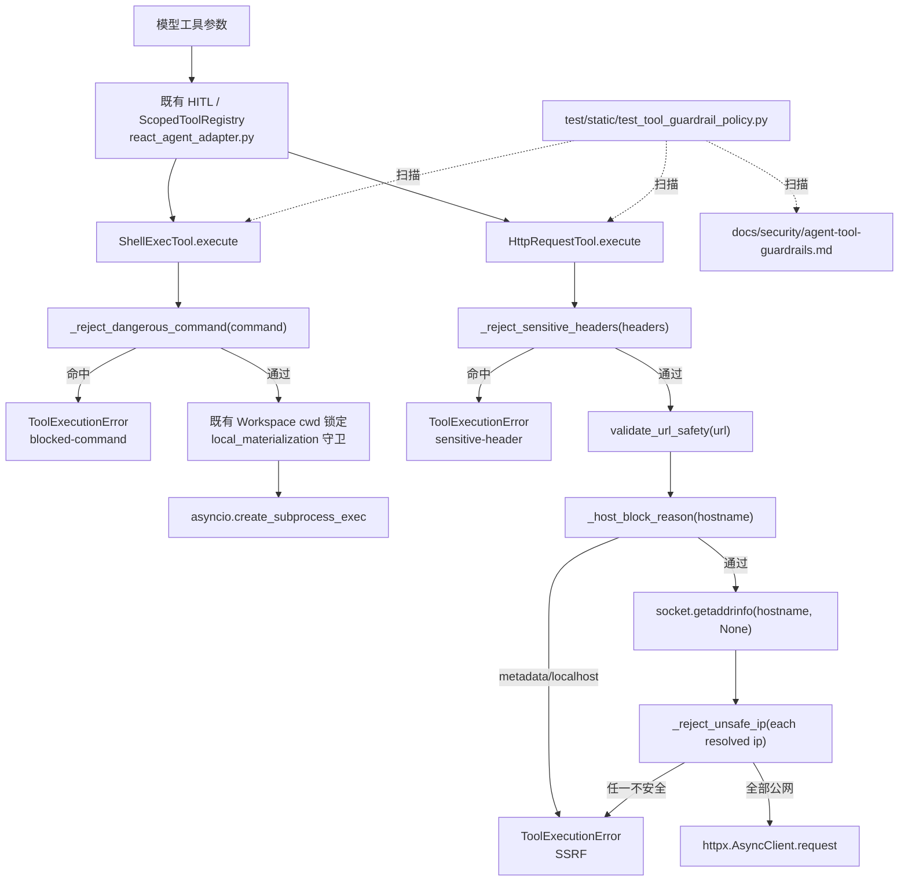
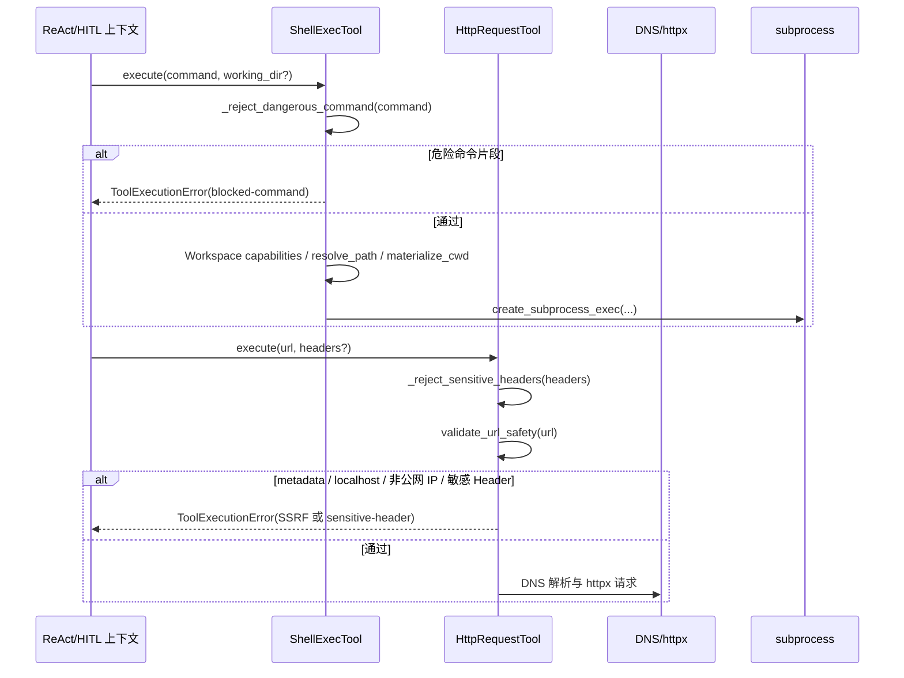

# 设计文档：Agent Tool Guardrails

## 概述

本设计在不扩大 Agent 工具能力面的前提下，为 `ShellExecTool` 与 `HttpRequestTool` 补齐工具参数层的最小硬阻断：Shell 在创建子进程前拒绝破坏性命令、敏感文件读取和远程脚本下载执行片段；HTTP 在发起请求前明确拒绝 metadata、localhost、私网/非公网目标和模型可控敏感 Header。设计遵循 `docs/steering/ddd-architecture.md` 的基础设施适配器边界、`docs/steering/config-source.md` 的配置来源规则、`docs/steering/uv-package-manager.md` 的验证命令规则和 `docs/steering/code-documentation.md` 的中文 docstring 要求；保持 `docs/tools.md` 与 `docs/agent.md` 中既有 Workspace、ScopedToolRegistry、HITL 与 ReAct Loop 语义。

本阶段只设计后续实现：新增 `docs/security/agent-tool-guardrails.md`、新增静态策略测试、在两个现有工具模块内增加私有校验函数和入口检查；不设计 plan2 Task 4 的工具滥用检测、同工具高频检测、异常参数模式检测或 OpenTelemetry event。

### 设计决策

| 决策点 | 选择 | 理由 |
| --- | --- | --- |
| 安全规则落点 | 规则文档 + 工具模块私有函数 + 静态策略测试 | 需求要求可审计、可测试、可防回退；工具参数硬规则属于 `src/infrastructure/tools/` 适配器职责，不需要新增 domain Port。 |
| Shell 阻断方式 | 无新依赖的大小写不敏感片段/正则匹配 | Shell 语法完整解析复杂且超出需求；本需求只覆盖明确危险片段，优先保证创建子进程前拒绝高置信命中。 |
| Shell 校验时机 | `execute()` 提取 `command` 后立即调用私有阻断函数 | 确保命中危险命令时不进入 Workspace 物化、环境变量清理或 `asyncio.create_subprocess_exec`。 |
| HTTP SSRF 策略 | 保留现有 scheme + DNS 所有 IP 校验，补充 host 语义标记函数 | 现有 `_ip_block_reason()` 已覆盖 private/loopback/link-local/reserved/unspecified/multicast/non-global；新增 host 层显式拒绝让 metadata/localhost 策略可读可测。 |
| HTTP 敏感 Header 策略 | `headers` 入参中出现敏感 Header 名即拒绝 | Header 由模型参数直接控制，不能作为凭证转发通道；不做脱敏转发或 allowlist，本需求也不新增配置。 |
| 错误模型 | 继续抛 `ToolExecutionError(code=60001, tool_name=...)` | 与现有工具错误模型一致；错误消息只说明阻断原因，不暴露宿主绝对路径、环境变量值或 Header 值。 |
| ReAct/HITL 集成 | 不改 `react_agent_adapter.py`，仅在设计中说明上下文 | HITL 发生在工具执行前，但不能替代工具参数校验；本需求不重构主循环、不改变工具注册范围。 |
| 配置 | 不新增配置项 | 需求默认不需要 allowlist；未来若引入显式 allowlist，必须另开 spec 并优先写入 `epsilon-boot/config.properties`。 |

## 架构



运行期顺序：



## 组件与接口

### 1. 安全护栏文档

- 位置：`docs/security/agent-tool-guardrails.md`
- 职责：记录 Shell / HTTP 高风险工具硬规则，作为实现、评审和静态策略测试依据。
- 内容结构：
  - `# Agent 工具安全护栏`
  - `## 适用范围`
  - `## ShellExecTool 硬规则`
  - `## HttpRequestTool 硬规则`
  - `## 不作为安全边界的能力`
  - `## 未来 allowlist 变更要求`

文档必须包含可被静态测试锁定的策略标记：`ShellExecTool`、`HttpRequestTool`、`Dangerous_Command_Fragment`、`SSRF_Risk_Target`、`Model_Controlled_Sensitive_Header`、`rm -rf`、`mkfs`、`dd if=`、`curl ... | sh`、`wget ... | bash`、`.env`、`/etc/shadow`、`~/.ssh/id_rsa`、`169.254.169.254`、`localhost`、`non-global`。

### 2. ShellExecTool 私有阻断函数

- 位置：`epsilon-boot/src/infrastructure/tools/shell_exec/shell_exec_tool.py`
- 职责：在子进程创建前拒绝危险命令片段，并保持现有 Workspace、环境变量、超时和输出截断行为。

新增/调整接口签名：

```python
import re
from typing import Any

_DANGEROUS_COMMAND_TEXT_FRAGMENTS: tuple[str, ...] = (
    "mkfs",
    "dd if=",
    "/etc/shadow",
    "~/.ssh/id_rsa",
    ".env",
)

_DANGEROUS_COMMAND_PATTERNS: tuple[re.Pattern[str], ...] = (
    re.compile(r"\brm\s+-[A-Za-z]*r[A-Za-z]*f\b", re.IGNORECASE),
    re.compile(r"\bdd\b[^|;&\n]*\bif\s*=", re.IGNORECASE),
    re.compile(r"\b(?:curl|wget)\b[^|;&\n]*(?:\||\s+-O\s+|\s+-o\s+).*?\b(?:sh|bash)\b", re.IGNORECASE),
    re.compile(r":\s*\(\s*\)\s*\{\s*:\s*\|\s*:\s*&\s*\}\s*;", re.IGNORECASE),
)


def _blocked_command_reason(command: str) -> str | None:
    """返回 Shell 命令命中安全阻断的原因，未命中时返回 None。"""
    ...


def _reject_dangerous_command(command: str, *, tool_name: str) -> None:
    """在创建子进程前拒绝危险 Shell 命令片段。"""
    ...


class ShellExecTool(Tool):
    async def execute(self, **kwargs: Any) -> str:
        """执行 Shell 命令并返回结果。"""
        command: str = kwargs["command"]
        _reject_dangerous_command(command, tool_name=self.name)
        ...
```

实现约束：

- `_reject_dangerous_command()` 必须在 `execute()` 中读取 `command` 后立即调用，早于 `self._workspace.capabilities()`、`resolve_path()`、`materialize_cwd()` 和 `asyncio.create_subprocess_exec()`。
- `_blocked_command_reason()` 返回稳定分类字符串，建议值：`"blocked-command: destructive command"`、`"blocked-command: sensitive file read"`、`"blocked-command: remote script execution"`。
- `ToolExecutionError.message` 必须包含 `blocked-command` 或中文等价固定标记，便于测试和日志定位；不得包含宿主绝对路径、环境变量值或敏感文件内容。
- 对文本片段采用 `command.casefold()` 匹配；正则统一 `re.IGNORECASE`。
- 不改变 `ShellExecTool.name`、`risk_level`、`parameters`、构造函数和 `get_shell_command()` 的公开契约。

### 3. HttpRequestTool host 与 Header 阻断函数

- 位置：`epsilon-boot/src/infrastructure/tools/http_request/http_request_tool.py`
- 职责：保留既有 SSRF 公网 IP 校验，同时把 metadata、localhost、private/non-global host 和模型可控敏感 Header 明确为工具层硬规则。

新增/调整接口签名：

```python
from typing import Any, Mapping

_METADATA_HOSTS: frozenset[str] = frozenset({"169.254.169.254"})
_LOCALHOST_HOSTS: frozenset[str] = frozenset({"localhost", "localhost.localdomain"})
_SENSITIVE_HEADER_NAMES: frozenset[str] = frozenset(
    {
        "authorization",
        "cookie",
        "x-api-key",
        "api-key",
        "proxy-authorization",
    }
)


def _normalise_header_name(name: object) -> str:
    """规范化模型传入的 Header 名称，用于敏感 Header 判断。"""
    ...


def _sensitive_header_reason(headers: Mapping[str, Any] | None) -> str | None:
    """返回模型可控敏感 Header 阻断原因，未命中时返回 None。"""
    ...


def _reject_sensitive_headers(
    headers: Mapping[str, Any] | None,
    *,
    tool_name: str,
) -> None:
    """拒绝模型参数中的 Authorization/Cookie/API key 等敏感 Header。"""
    ...


def _host_block_reason(hostname: str) -> str | None:
    """返回 URL host 语义层面的 SSRF 阻断原因，公网候选返回 None。"""
    ...


def validate_url_safety(url: str, *, tool_name: str = "http_request") -> None:
    """校验 URL 安全性，防止 SSRF 攻击。"""
    ...


class HttpRequestTool(Tool):
    async def execute(self, **kwargs: Any) -> str:
        """执行 HTTP 请求并返回处理后的响应内容。"""
        url: str = kwargs["url"]
        headers: Mapping[str, Any] | None = kwargs.get("headers")
        _reject_sensitive_headers(headers, tool_name=self.name)
        validate_url_safety(url, tool_name=self.name)
        ...
```

实现约束：

- `_reject_sensitive_headers()` 必须早于 `validate_url_safety()` 和 `self._client.request()`，命中时不做 DNS 解析、不发网络请求。
- `_host_block_reason()` 至少覆盖：
  - `169.254.169.254`：返回 `metadata`；
  - `localhost`、`localhost.localdomain`、大小写变体和末尾点变体：返回 `localhost`；
  - host 字面量 IP：复用 `_ip_block_reason()` 判定 private/loopback/link-local/reserved/unspecified/multicast/non-global。
- `validate_url_safety()` 继续只允许 `http`/`https`，继续对 DNS 返回的所有地址逐一调用 `_reject_unsafe_ip()`；任一地址不安全即拒绝。
- 敏感 Header 名匹配只看 Header 名，不读取或输出 Header 值；匹配大小写不敏感，并剥离首尾空白。
- 不新增外部服务、网络 allowlist、依赖或配置项。

### 4. 静态策略测试

- 位置：`epsilon-boot/test/static/test_tool_guardrail_policy.py`
- 职责：通过读取文档和源码文本守住关键安全策略标记，不启动服务、不访问网络。

接口与辅助函数签名：

```python
"""Agent 工具安全护栏静态策略测试。"""

from pathlib import Path

BOOT_ROOT = Path(__file__).resolve().parents[2]
REPO_ROOT = BOOT_ROOT.parent
SECURITY_DOC = REPO_ROOT / "docs" / "security" / "agent-tool-guardrails.md"
SHELL_TOOL = BOOT_ROOT / "src" / "infrastructure" / "tools" / "shell_exec" / "shell_exec_tool.py"
HTTP_TOOL = BOOT_ROOT / "src" / "infrastructure" / "tools" / "http_request" / "http_request_tool.py"


def _read(path: Path) -> str:
    """读取文本文件内容。"""
    ...


def _assert_contains_all(content: str, fragments: list[str]) -> None:
    """断言文本包含全部策略标记。"""
    ...


def test_security_guardrail_document_contains_required_policy_markers() -> None:
    """安全护栏文档必须包含 Shell/HTTP 工具策略标记。"""
    ...


def test_shell_exec_tool_contains_guardrail_policy_markers() -> None:
    """ShellExecTool 必须保留危险命令阻断策略标记。"""
    ...


def test_http_request_tool_contains_guardrail_policy_markers() -> None:
    """HttpRequestTool 必须保留 SSRF 与敏感 Header 策略标记。"""
    ...
```

测试标记清单：

| 文件 | 必须包含的标记 |
| --- | --- |
| `docs/security/agent-tool-guardrails.md` | `ShellExecTool`、`HttpRequestTool`、`Dangerous_Command_Fragment`、`SSRF_Risk_Target`、`Model_Controlled_Sensitive_Header`、`SHELL_EXEC_ENABLED=false`、`http/https`、`Config_Primary_Source` |
| `shell_exec_tool.py` | `_reject_dangerous_command`、`blocked-command`、`rm -rf`、`mkfs`、`dd if=`、`remote script execution`、`sensitive file read`、`.env`、`/etc/shadow`、`~/.ssh/id_rsa` |
| `http_request_tool.py` | `_reject_sensitive_headers`、`_host_block_reason`、`169.254.169.254`、`localhost`、`private`、`non-global`、`authorization`、`cookie`、`x-api-key`、`api-key`、`proxy-authorization` |

### 5. 既有上下文不改动项

- `epsilon-boot/src/infrastructure/agent/react_agent_adapter.py`：只作为既有工具权限、guardrail 和 HITL 上下文；本需求不要求修改。
- `application/container_config.py`：不新增工具、不改变注册范围、不改变 `SHELL_EXEC_ENABLED=false` 默认语义。
- 前端目录：不修改。
- 依赖文件：不修改 `pyproject.toml`、`uv.lock`。
- 配置：不新增 `config.properties` 键。

## 数据模型

本需求不新增数据库表、ORM/PO、DDL、索引或持久化模型。

运行期新增的仅是模块级策略常量和错误分类字符串：

```python
_DANGEROUS_COMMAND_TEXT_FRAGMENTS: tuple[str, ...]
_DANGEROUS_COMMAND_PATTERNS: tuple[re.Pattern[str], ...]
_METADATA_HOSTS: frozenset[str]
_LOCALHOST_HOSTS: frozenset[str]
_SENSITIVE_HEADER_NAMES: frozenset[str]
```

错误输出格式继续使用 `ToolExecutionError`：

```python
ToolExecutionError(
    message="安全护栏 blocked-command: remote script execution，拒绝执行该 Shell 命令",
    tool_name="shell_exec",
)

ToolExecutionError(
    message="SSRF 防护: 目标主机 localhost (localhost) 不允许访问",
    tool_name="http_request",
)

ToolExecutionError(
    message="HTTP 请求安全护栏: 模型参数不允许设置敏感 Header authorization",
    tool_name="http_request",
)
```

文档数据格式示例：

```markdown
### ShellExecTool 硬规则示例

- `Dangerous_Command_Fragment` 包括 destructive command execution、sensitive file reads、remote script download-and-execute patterns。
- 示例标记：`rm -rf`、`mkfs`、`dd if=`、`curl ... | sh`、`wget ... | bash`、`.env`、`/etc/shadow`、`~/.ssh/id_rsa`。
```

## 事务与并发边界

本需求不引入运行期写事务、数据库事务、锁、幂等键或跨外部系统一致性问题。

- Shell 阻断是单次 `execute()` 的纯内存前置校验；命中时不创建子进程，因此不存在需要补偿的外部副作用。
- HTTP Header/URL 阻断是单次 `execute()` 的纯内存前置校验；命中敏感 Header 时不做 DNS 解析，命中 URL/解析 IP 风险时不发 `httpx` 请求。
- DNS 多地址解析保持既有一致性规则：任一解析结果属于 `SSRF_Risk_Target` 即拒绝整个 URL。
- 文档和测试文件由后续实现阶段作为普通仓库文件变更提交，不涉及应用运行期事务。

## 正确性属性

### Property 1: 安全护栏文档完整覆盖工具硬规则
*For any* 后续评审、实现或维护者读取 `docs/security/agent-tool-guardrails.md` 时，文档必须同时说明 `ShellExecTool` 与 `HttpRequestTool` 的适用范围、默认禁用/审批/Workspace 关系、危险命令分类、HTTP scheme、SSRF 风险目标、模型可控敏感 Header 禁止规则，以及未来 allowlist 必须另走审批 spec 和 Config_Primary_Source 的要求。
**验证需求：1.1, 1.2, 1.3, 1.4, 1.5, 1.6, 1.7**

### Property 2: 静态策略测试守住关键标记
*For any* 后续重构导致安全护栏文档、`ShellExecTool` 或 `HttpRequestTool` 中移除必需策略标记的情况，`test/static/test_tool_guardrail_policy.py` 必须在无网络、无服务启动条件下失败，且实现完成后该静态测试可通过 `uv run pytest test/static/test_tool_guardrail_policy.py -v` 单独运行。
**验证需求：2.1, 2.2, 2.3, 2.4, 2.5, 2.6, 6.1, 6.4, 6.5**

### Property 3: Shell 危险命令在子进程前被拒绝
*For any* `ShellExecTool.execute()` 接收到包含 destructive command、sensitive file read 或 remote script execution 片段的 `command`，工具必须在调用 Workspace 物化或 `asyncio.create_subprocess_exec()` 前抛出 `ToolExecutionError`，并保持现有 Workspace、环境变量清理、超时、输出截断、HITL 和风险等级语义不弱化。
**验证需求：3.1, 3.2, 3.3, 3.4, 3.5, 3.6, 3.7, 5.6**

### Property 4: HTTP SSRF 风险目标在请求前被拒绝
*For any* `HttpRequestTool.execute()` 接收到 metadata、localhost、loopback、link-local、RFC1918 private、reserved、unspecified、multicast 或 non-global 目标 URL，或 DNS 解析出的任一地址属于上述风险类别，工具必须在发送网络请求前抛出 `ToolExecutionError`，并继续保留 http/https scheme 校验和多地址 DNS 校验。
**验证需求：4.1, 4.2, 4.3, 4.5, 4.6, 4.7, 4.8, 4.9**

### Property 5: 模型可控敏感 Header 在请求前被拒绝
*For any* `HttpRequestTool.execute()` 接收到的 `headers` 中包含 `Authorization`、`Cookie`、`X-API-Key`、`API-Key` 或 `Proxy-Authorization` 的任意大小写/首尾空白变体，工具必须在 DNS 解析和网络请求前抛出 `ToolExecutionError`，且错误消息不得包含 Header 值。
**验证需求：4.4, 4.8, 4.9**

### Property 6: 实现范围不扩张
*For any* 本需求派生出的后续任务与代码变更，变更不得触及前端、不得新增依赖、不得新增工具或扩大工具注册范围、不得重构 ReAct 主循环、不得实现 task4-style 工具滥用检测/高频检测/异常参数检测/OpenTelemetry event。
**验证需求：5.1, 5.2, 5.3, 5.4, 5.5, 5.7**

### Property 7: 回归验证边界清晰
*For any* 实现交付，必须至少报告静态策略测试结果；完整回归期望为从 `epsilon-boot` 执行 `uv run pytest -m "not benchmark"`，若完整回归存在无关失败，交付说明必须区分静态策略测试结果和无关失败。
**验证需求：6.1, 6.2, 6.3, 6.4, 6.5**

## 错误处理

### 错误常量定义

不新增异常类或错误码；继续使用：

```python
from domain.agent.exceptions import ToolExecutionError
```

建议稳定错误标记：

| 场景 | `tool_name` | message 稳定标记 |
| --- | --- | --- |
| Shell 危险命令 | `shell_exec` | `blocked-command` |
| HTTP SSRF host/IP | `http_request` | `SSRF 防护` |
| HTTP 敏感 Header | `http_request` | `敏感 Header` |

### 错误场景与处理策略

| 场景 | 检测位置 | 处理 |
| --- | --- | --- |
| `rm -rf`、`mkfs`、`dd if=` 等破坏性片段 | `_reject_dangerous_command()` | 抛 `ToolExecutionError`，不创建子进程。 |
| `.env`、`/etc/shadow`、`~/.ssh/id_rsa` 等敏感文件读取片段 | `_reject_dangerous_command()` | 抛 `ToolExecutionError`，不解析 cwd、不创建子进程。 |
| `curl ... \| sh`、`wget ... \| bash` 等远程脚本执行 | `_reject_dangerous_command()` | 抛 `ToolExecutionError`，错误标记为 `remote script execution`。 |
| metadata endpoint | `_host_block_reason()` / `_reject_unsafe_ip()` | 抛 `ToolExecutionError`，不发请求。 |
| localhost/loopback/link-local/private/reserved/unspecified/multicast/non-global | `_host_block_reason()` / `_reject_unsafe_ip()` | 抛 `ToolExecutionError`，不发请求。 |
| 多 DNS 地址中任一不安全 | `validate_url_safety()` | 拒绝整个 URL。 |
| 敏感 Header | `_reject_sensitive_headers()` | 抛 `ToolExecutionError`，不解析 DNS、不发请求、不输出 Header 值。 |
| body JSON 解析失败、httpx 异常、Shell 超时等既有错误 | 既有代码路径 | 保持现有 `ToolExecutionError` 包装语义。 |

### 错误传播策略

- 工具私有校验函数直接抛 `ToolExecutionError`；`execute()` 的 `except ToolExecutionError: raise` 保持原样。
- `ToolRegistry`、`ScopedToolRegistry`、ReAct ToolMessage 处理沿用现有行为，不新增错误转换层。
- 错误消息向模型可见，因此只包含策略分类、host/Header 名和通用原因；禁止输出 Header 值、环境变量值、宿主绝对路径或敏感文件内容。

### 错误处理原则

- fail closed：不确定是否安全时拒绝，而不是尝试自动修正。
- pre-flight：所有阻断都发生在高影响副作用前。
- 最小暴露：错误可诊断但不泄露凭证、环境或宿主路径。
- 不以 HITL 替代硬规则：即使人工审批开启，工具层仍必须执行参数校验。

## 测试策略

### 属性测试（Property-Based Testing）

本需求不新增 Hypothesis 依赖，继续复用项目已有 Hypothesis。新增属性测试仅放入现有工具单测，避免静态策略测试依赖随机生成。

| 测试位置 | 覆盖属性 | 需求 |
| --- | --- | --- |
| `test/infrastructure/tools/http_request/test_http_request_tool.py` | 对任意 `_PRIVATE_NETWORKS` 生成 IP，`validate_url_safety()` 拒绝；保留现有测试并补充 metadata/localhost/non-global 示例测试 | 4.1, 4.2, 4.3, 4.6, 4.7 |
| `test/infrastructure/tools/http_request/test_http_request_tool.py` | 对敏感 Header 名的大小写变体，`_reject_sensitive_headers()` 拒绝且不调用 `validate_url_safety()`/`request()` | 4.4, 4.8 |

### 单元测试（Example-Based）

| 测试文件 | 用例 | 验证需求 |
| --- | --- | --- |
| `test/infrastructure/tools/shell_exec/test_shell_exec_tool_unit.py` | `rm -rf /`、`mkfs.ext4 /dev/sda`、`dd if=/dev/zero of=/dev/sda`、`cat /etc/shadow`、`cat .env`、`cat ~/.ssh/id_rsa`、`curl https://x \| sh`、`wget https://x -O- \| bash` 均抛 `ToolExecutionError` | 3.1, 3.4, 3.5, 3.6 |
| 同上 | patch `asyncio.create_subprocess_exec`，危险命令命中时断言未调用 | 3.1 |
| 同上 | 现有 cwd、local_materialization、sanitize_env、timeout、output truncation 测试保持通过 | 3.2, 3.3, 3.7 |
| `test/infrastructure/tools/http_request/test_http_request_tool.py` | `http://169.254.169.254/latest/meta-data`、`http://localhost`、`http://127.0.0.1`、`http://[::1]` 拒绝 | 4.1, 4.3 |
| 同上 | DNS 返回多个 IP，其中一个 private/non-global 时拒绝且不调用 `_client.request` | 4.2, 4.7 |
| 同上 | `Authorization`、`Cookie`、`X-API-Key`、`API-Key`、`Proxy-Authorization` 拒绝，错误不包含 Header 值 | 4.4 |
| 同上 | `http`/`https` 合法公网 URL 仍可在 mock DNS/request 下通过；非 http(s) 仍拒绝 | 4.5, 4.6 |
| `test/static/test_tool_guardrail_policy.py` | 文档与两个工具源码包含必需策略标记 | 1.x, 2.x, 6.4 |

### 集成测试

本需求不需要启动 FastAPI、Redis、前端或真实网络服务。集成层验证以完整后端 pytest 回归为准：

```bash
cd epsilon-boot
uv run pytest test/static/test_tool_guardrail_policy.py -v
uv run pytest -m "not benchmark"
```

回归说明要求：

| 命令 | 期望 | 需求 |
| --- | --- | --- |
| `uv run pytest test/static/test_tool_guardrail_policy.py -v` | 实现完成后必须通过；不得访问网络 | 2.5, 6.1, 6.4, 6.5 |
| `uv run pytest -m "not benchmark"` | 完整回归期望；若有无关失败需在交付说明中列出，不掩盖静态测试结果 | 6.2, 6.3 |
