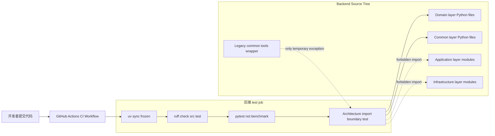
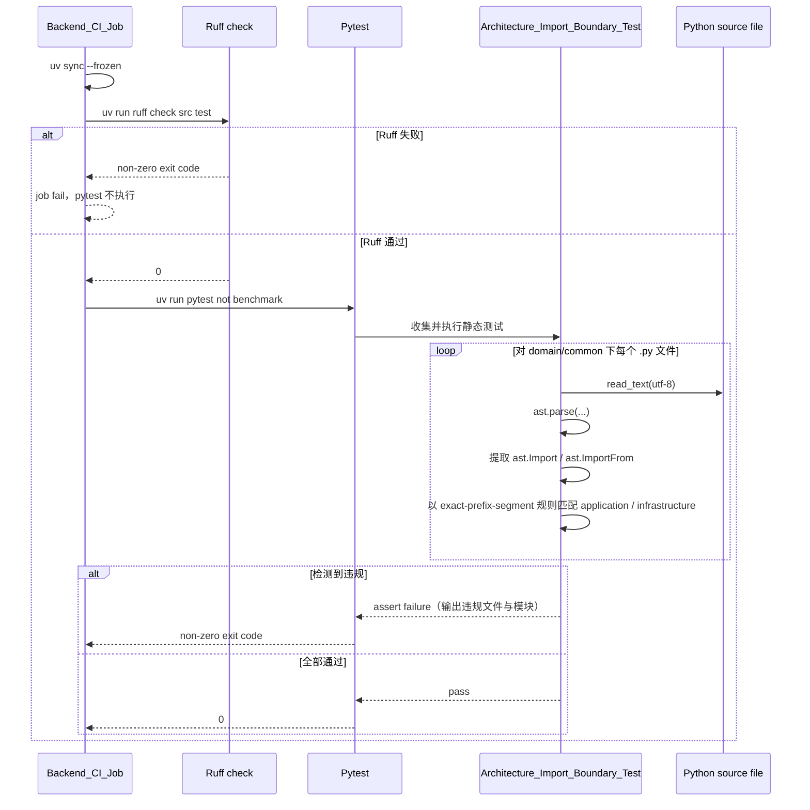

# 设计文档：后端静态检查与 DDD import guard

## 概述

本设计在不修改后端运行时业务行为的前提下，为 `epsilon-boot` 增加两道最小静态门禁：一是基于 AST 的 `Architecture_Import_Boundary_Test`，用于守住 `domain/` 与 `common/` 对 `application/`、`infrastructure/` 的禁止导入规则；二是在现有后端 CI job 中于 pytest 之前执行 `ruff` lint。设计遵循 `docs/steering/ddd-architecture.md` 的分层依赖约束、`docs/steering/uv-package-manager.md` 的 `uv` 依赖管理约束、`docs/steering/config-source.md` 的配置来源约束，以及 `docs/steering/code-documentation.md` 的中文 docstring 约束。

本特性只触及后端静态测试、后端 `pyproject.toml` / `uv.lock` 与现有 GitHub Actions 后端步骤，不新增运行时配置、不修改 `config.properties`、不引入事务或持久化模型变更、不改动前端 job，也不扩展到 evaluation CI、nightly、SAST 平台或更广泛的全仓库依赖图治理。

#### 设计决策

| 决策 | 选择方案 | 理由 |
| --- | --- | --- |
| 架构边界检查实现方式 | 在 `epsilon-boot/test/static/test_architecture_import_boundaries.py` 中用 Python `ast` 解析源码 | 满足“只解析源码、不执行导入”的要求；与仓库现有 `test/static` 风格一致，便于复用 pytest / CI。 |
| 扫描范围 | 递归扫描 `epsilon-boot/src/domain/**/*.py` 与 `epsilon-boot/src/common/**/*.py`，包含 `__init__.py` | 需求写明“FOR ALL files”；递归扫描可覆盖子目录与未来新增模块，避免漏检。 |
| import 提取规则 | 同时处理 `ast.Import` 与 `ast.ImportFrom`；仅当 `module == prefix` 或 `module.startswith(prefix + ".")` 时命中禁止前缀 | 精确匹配分段前缀，避免把 `infrastructurex`、`application_utils` 等误判为违规。 |
| 领域层禁止前缀 | 仅禁止 `application` 与 `infrastructure` | 本特性的范围只覆盖 requirement.md 中定义的 `Domain_Import_Boundary_Rule`，不借机扩大到框架、数据库或外部 SDK。 |
| 公共层禁止前缀 | 仅禁止 `application` 与 `infrastructure` | 与 `ddd-architecture.md` 对 `common/` 的约束精确对齐，且不超出本次需求范围。 |
| Common 历史例外策略 | 仅允许 `src/common/tools/common_tools.py` 对 `infrastructure` 的临时例外；对 `application` 无例外；对 `domain` 无例外 | 需求明确要求把历史泄漏限制为单文件且不得扩散，并保持 `domain/` 零例外。 |
| 违规报告形式 | 测试失败时输出“仓库相对路径 -> 命中的禁止模块列表” | 与现有静态测试的可读性一致，评审者可以直接定位具体文件与导入目标。 |
| lint 工具接入方式 | 在 `epsilon-boot/` 下执行 `uv add --dev ruff`，由 `uv` 自动更新 `pyproject.toml` 与 `uv.lock` | 遵循 `uv-package-manager.md`；避免手工猜测版本号或手改 lockfile。 |
| Ruff 最小规则集 | `[tool.ruff] line-length = 100`、`target-version = "py311"`；`[tool.ruff.lint] select = ["E", "F", "I", "UP", "B"]`、`ignore = []` | 需求已给出精确配置；规则集足够形成最小 lint 门禁，又不引入超范围的风格治理。 |
| 后端 CI 接入位置 | 在现有 `.github/workflows/ci.yml` 的后端 `test` job 中，于 `uv sync --frozen` 之后、pytest 之前加入 `uv run ruff check src test` | 满足 lint 先于 pytest 的验收标准，同时保持现有 job、OS matrix 和工作目录不变。 |
| 历史 lint 问题收敛方式 | 允许使用 `uv run ruff check src test --fix` 做安全自动修复，但必须人工复核 diff | 需求已限定安全自动修复边界；该方案兼顾效率与变更可控性。 |
| 运行时配置策略 | 不新增 `config.properties` / `.env` 键 | 静态测试与 lint 均为构建期/开发期能力，不应影响 `Runtime_Business_Behavior`。 |

## 架构

本特性不改变后端 DDD + 六边形运行时架构，只在“源码提交前/CI 执行时”新增两条仓库级静态门禁链路：`pytest` 负责 AST 架构边界检查，`ruff` 负责最小 Python lint 检查。两者都运行在既有 `Backend_CI_Job` 中，并在 `epsilon-boot/` 工作目录下通过 `uv run` 执行。

### 目标结构

```text
.github/workflows/ci.yml                                      # 现有后端 CI job；新增 backend lint step
epsilon-boot/
├── pyproject.toml                                            # 新增 Ruff 配置；dev 依赖组纳入 ruff
├── uv.lock                                                   # 由 `uv add --dev ruff` 自动更新
├── src/
│   ├── application/                                          # 被静态规则作为禁止导入目标之一
│   ├── common/                                               # 被扫描目录之一；仅 common/tools/common_tools.py 可临时例外
│   ├── domain/                                               # 被扫描目录之一；无任何例外
│   └── infrastructure/                                       # 被静态规则作为禁止导入目标之一
└── test/static/test_architecture_import_boundaries.py        # 新增 AST 静态测试模块
```

### 组件图



### 违规检测序列



### 目录边界说明

- `src/domain/`：扫描全部 Python 文件，禁止导入 `application`、`infrastructure`。
- `src/common/`：扫描全部 Python 文件，禁止导入 `application`、`infrastructure`。
- `src/common/tools/common_tools.py`：仅在“导入 `infrastructure`”这一条规则上允许临时例外；不允许把例外扩展到 `common/` 其他文件，也不允许为 `application` 添加对称例外。
- `src/application/`、`src/infrastructure/`：不作为被扫描目录，但作为目标前缀参与命中判定。
- 前端目录 `epsilon-client/`：不参与本特性任何扫描、配置或 CI 修改。

## 组件与接口

### 1. AST 架构导入边界静态测试模块

- **位置**：`/home/jupeter/source/epsilon/epsilon-boot/test/static/test_architecture_import_boundaries.py`
- **职责**：
  1. 以 AST 解析 `domain/` 与 `common/` 的所有 Python 源码，不执行生产模块导入。
  2. 检查 `domain/` 是否导入 `application`、`infrastructure`。
  3. 检查 `common/` 是否导入 `application`、`infrastructure`，但仅允许 `common/tools/common_tools.py` 对 `infrastructure` 的历史临时例外。
  4. 用中文模块 docstring 与中文公开测试函数 docstring 对齐仓库文档规范。

- **接口 / 代码签名（Python）**：

```python
"""DDD 分层导入边界静态测试。"""

from __future__ import annotations

import ast
from pathlib import Path
from typing import Iterable


BOOT_ROOT = Path(__file__).resolve().parents[2]
REPO_ROOT = BOOT_ROOT.parent
SRC_ROOT = BOOT_ROOT / "src"
DOMAIN_ROOT = SRC_ROOT / "domain"
COMMON_ROOT = SRC_ROOT / "common"
ALLOWED_COMMON_INFRASTRUCTURE_EXCEPTION = (
    COMMON_ROOT / "tools" / "common_tools.py"
)
FORBIDDEN_APPLICATION_PREFIX = "application"
FORBIDDEN_INFRASTRUCTURE_PREFIX = "infrastructure"


def _python_files(root: Path) -> list[Path]:
    """返回目录下全部 Python 源文件。"""


def _parse(path: Path) -> ast.Module:
    """将 Python 源码解析为 AST，不执行模块导入。"""


def _imports(path: Path) -> set[str]:
    """提取文件中的绝对导入模块名。"""


def _has_prefix(module: str, prefix: str) -> bool:
    """按精确前缀分段规则判断模块名是否命中。"""


def _relative(path: Path) -> str:
    """返回仓库相对路径，便于断言失败输出。"""


def _collect_violations(
    *,
    root: Path,
    forbidden_prefix: str,
    allowed_paths: set[Path] | None = None,
) -> dict[str, list[str]]:
    """收集目录下命中禁止前缀且不在允许名单内的违规项。"""


def test_domain_layer_does_not_import_application_layer() -> None:
    """领域层不得导入应用层模块。"""


def test_domain_layer_does_not_import_infrastructure_layer() -> None:
    """领域层不得导入基础设施层模块。"""


def test_common_layer_does_not_import_application_layer() -> None:
    """公共层不得导入应用层模块。"""


def test_common_layer_does_not_import_infrastructure_layer_except_legacy_common_tools() -> None:
    """公共层不得导入基础设施层，唯一临时例外仅限 common_tools 薄壳。"""
```

- **关键实现约束**：
  - `_parse(path)` 必须执行 `ast.parse(path.read_text(encoding="utf-8"), filename=str(path))`，确保静态分析阶段不会 import 生产模块。
  - `_imports(path)` 必须同时处理：
    - `ast.Import`：收集 `alias.name`
    - `ast.ImportFrom`：当 `node.module` 非空时收集 `node.module`
  - `_has_prefix(module, prefix)` 的判定逻辑必须为：

    ```python
    return module == prefix or module.startswith(prefix + ".")
    ```

    不能使用普通 `startswith(prefix)`，否则会把 `applicationx`、`infrastructure_tools` 等误判为违规。
  - `_collect_violations(...)` 必须按仓库相对路径输出违规结果，例如：

    ```python
    {
        "epsilon-boot/src/common/foo.py": ["infrastructure.workspace.local_filesystem"],
    }
    ```

  - `allowed_paths` 仅用于 `common -> infrastructure` 规则，且调用点必须只传入：

    ```python
    {ALLOWED_COMMON_INFRASTRUCTURE_EXCEPTION}
    ```

  - `domain` 的两条规则调用时不得传入任何例外白名单。
  - 断言方式采用仓库现有静态测试惯例：`assert violations == {}`，让 pytest 直接输出差异。

- **命中判定示例**：

| 源码导入语句 | 提取模块 | 规则前缀 | 是否违规 | 说明 |
| --- | --- | --- | --- | --- |
| `import application.api.routers.chat` | `application.api.routers.chat` | `application` | 是 | `module.startswith("application.")` |
| `from infrastructure.tools.filesystem import read_file_tool` | `infrastructure.tools.filesystem` | `infrastructure` | 是 | `ast.ImportFrom.module` 命中 |
| `import infrastructure` | `infrastructure` | `infrastructure` | 是 | `module == prefix` |
| `import infrastructurex.helper` | `infrastructurex.helper` | `infrastructure` | 否 | 非精确分段前缀 |
| `from application_utils import x` | `application_utils` | `application` | 否 | 非精确分段前缀 |

### 2. 后端项目配置与 Ruff 依赖接入

- **位置**：`/home/jupeter/source/epsilon/epsilon-boot/pyproject.toml`
- **职责**：
  1. 通过 `uv` 把 `ruff` 纳入后端开发依赖集合。
  2. 定义仓库统一的最小 Ruff 配置。
  3. 不增加运行时配置，不修改 `project.dependencies` 中的业务依赖，不改变 pytest 配置。

- **接口 / 配置签名（命令）**：

```bash
cd /home/jupeter/source/epsilon/epsilon-boot && uv add --dev ruff
```

- **接口 / 配置签名（TOML）**：

```toml
[tool.ruff]
line-length = 100
target-version = "py311"

[tool.ruff.lint]
select = ["E", "F", "I", "UP", "B"]
ignore = []
```

- **实现后必须保持的文件约束**：
  - `[dependency-groups].dev` 中新增 `ruff` 条目，但其具体版本约束由 `uv add --dev ruff` 自动写入；实现时不得手工猜测或硬编码版本字符串。
  - `uv.lock` 必须随 `uv add --dev ruff` 自动更新并提交，作为 `uv sync --frozen` 的冻结输入。
  - 现有 pytest 配置保持不变：

    ```toml
    [tool.pytest]
    asyncio_mode = "auto"
    pythonpath = ["src"]
    testpaths = ["test"]
    ```

  - 不新增 `[tool.ruff.format]`、`per-file-ignores`、`extend-select`、`fix` 默认开关等额外配置，避免超出“最小稳定配置”范围。

### 3. 后端 CI lint 门禁

- **位置**：`/home/jupeter/source/epsilon/.github/workflows/ci.yml`
- **职责**：
  1. 保留现有后端 `test` job、OS matrix、工作目录、`uv sync --frozen` 和 pytest 命令。
  2. 在 pytest 之前增加 `Backend_Lint_Gate`：`uv run ruff check src test`。
  3. 不改动现有前端 job 的行为。

- **接口 / 配置签名（YAML）**：

```yaml
name: ci

on:
  push:
    branches: ["**"]
  pull_request:

jobs:
  test:
    strategy:
      fail-fast: false
      matrix:
        os: [ubuntu-latest, windows-latest]
    runs-on: ${{ matrix.os }}
    defaults:
      run:
        working-directory: epsilon-boot
        shell: bash
    steps:
      - name: Checkout
        uses: actions/checkout@v4

      - name: Install uv
        uses: astral-sh/setup-uv@v3

      - name: Sync dependencies
        run: uv sync --frozen

      - name: Run backend lint gate
        run: uv run ruff check src test

      - name: Run tests (includes static secret hygiene checks)
        run: uv run pytest -m "not benchmark"

  frontend:
    runs-on: ubuntu-latest
    defaults:
      run:
        working-directory: epsilon-client
        shell: bash
    steps:
      - name: Checkout
        uses: actions/checkout@v4

      - name: Install Bun
        uses: oven-sh/setup-bun@v2

      - name: Install frontend dependencies
        run: bun install --frozen-lockfile

      - name: Run frontend lint
        run: bun run lint

      - name: Run frontend typecheck
        run: bun run typecheck

      - name: Run frontend build
        run: bun run build
```

- **执行契约**：
  - `Run backend lint gate` 必须位于 `Sync dependencies` 之后、`Run tests...` 之前。
  - `uv run ruff check src test` 与 pytest 一样运行在 `epsilon-boot/` 下。
  - 若 lint step 返回非零 exit code，则当前矩阵 job 立即失败，pytest 不再执行；GitHub Actions workflow / PR 门禁随之失败。
  - 由于 lint 被加入现有 `test` job 而不是新建独立 backend-lint job，因此 Ubuntu 与 Windows 两个矩阵都会执行同一 lint 命令；这是“保持现有 job 结构不变”的直接结果。

### 4. 最小验证命令集合

- **位置**：实现说明与评审验证流程；命令均在 `/home/jupeter/source/epsilon/epsilon-boot` 下执行。
- **职责**：为开发者与评审者提供一致的本地完成判断，并限定历史 lint 问题的安全收敛方式。

- **接口 / 配置签名（Shell）**：

```bash
cd /home/jupeter/source/epsilon/epsilon-boot && uv run ruff check src test
cd /home/jupeter/source/epsilon/epsilon-boot && uv run pytest test/static/test_architecture_import_boundaries.py -v
```

- **安全自动修复边界**：

```bash
cd /home/jupeter/source/epsilon/epsilon-boot && uv run ruff check src test --fix
```

- **执行契约**：
  - `--fix` 仅用于 Ruff 可安全自动修复的历史问题，不得替代手工修复语义性问题。
  - 一旦使用 `--fix`，必须执行人工 diff 复核后才可认定本特性完成。
  - 本特性不要求新增 `make`、脚本文件或文档命令包装器；直接使用 `uv run` 即可。

## 数据模型

本特性不新增领域实体、值对象、持久化表、ORM/PO、缓存键、消息主题或运行时配置键；其“数据模型”全部属于仓库静态配置与静态分析结果。数据库 DDL、索引、回填、迁移脚本均为“无”。

### 1. 静态分析输入模型

| 对象 | 载体 | 结构 | 说明 |
| --- | --- | --- | --- |
| `ScannedPythonFile` | `src/domain/**/*.py`、`src/common/**/*.py` | `Path` | 递归扫描得到的 Python 文件绝对路径。 |
| `ImportedModuleName` | AST | `str` | 从 `ast.Import` / `ast.ImportFrom` 提取出的模块名。 |
| `ForbiddenPrefix` | 规则常量 | `"application"` / `"infrastructure"` | 仅这两个前缀参与本特性判定。 |
| `AllowedExceptionPath` | 规则常量 | `Path` | 仅 `src/common/tools/common_tools.py`。 |
| `ViolationMap` | pytest 断言对象 | `dict[str, list[str]]` | key 为仓库相对路径，value 为命中的禁止模块列表。 |

### 2. 违规结果格式

```python
{
    "epsilon-boot/src/domain/chat/ports.py": ["application.api.routers.chat"],
    "epsilon-boot/src/common/example.py": [
        "infrastructure.workspace.local_filesystem",
        "infrastructure.tools.filesystem.read_file_tool",
    ],
}
```

约束：

- 空字典 `{}` 表示对应规则通过。
- 非空字典表示失败；pytest `assert violations == {}` 将直接展示差异。
- `common/tools/common_tools.py` 若命中 `infrastructure...`，不会出现在 `Common -> Infrastructure` 规则的 `ViolationMap` 中；其他任何 `common/` 文件命中该前缀都必须出现。

### 3. Ruff 配置模型

```toml
[tool.ruff]
line-length = 100
target-version = "py311"

[tool.ruff.lint]
select = ["E", "F", "I", "UP", "B"]
ignore = []
```

| 配置键 | 值 | 作用 | 需求覆盖 |
| --- | --- | --- | --- |
| `tool.ruff.line-length` | `100` | 统一 lint 行宽 | 需求 3.3 |
| `tool.ruff.target-version` | `py311` | 对齐后端 `requires-python >=3.11` | 需求 3.4 |
| `tool.ruff.lint.select` | `E/F/I/UP/B` | 启用最小规则族 | 需求 3.5 |
| `tool.ruff.lint.ignore` | `[]` | 不设置忽略项 | 需求 3.6 |

### 4. 依赖与锁文件模型

| 文件 | 变更类型 | 规则 |
| --- | --- | --- |
| `epsilon-boot/pyproject.toml` | 开发依赖声明 + Ruff 配置 | 通过 `uv add --dev ruff` 更新 dev group，并手工加入 `[tool.ruff]` / `[tool.ruff.lint]`。 |
| `epsilon-boot/uv.lock` | 锁文件刷新 | 仅由 `uv add --dev ruff` 自动生成差异，不手工编辑。 |
| `epsilon-boot/config.properties` | 无变更 | 本特性不新增运行时配置。 |
| `.env` | 无变更 | 本特性不依赖本地环境变量新增项。 |

### 5. DDL / 迁移 / 回填声明

- 数据库 DDL：无。
- 索引变更：无。
- ORM / PO 变更：无。
- 数据回填 / backfill：无。
- 运行时配置迁移：无。
- 前端数据模型变更：无。

## 事务与并发边界

本特性不涉及应用运行时数据库写入、消息投递、跨数据源一致性或任何事务管理器；仓库现有 FastAPI / DDD 业务事务模型不受影响。因此不存在类级或方法级事务注解、传播级别、回滚规则、乐观锁、悲观锁或幂等键设计。

仍需明确以下“仓库变更与 CI 执行边界”：

1. **仓库文件一致性边界**
   - `pyproject.toml`、`uv.lock`、`.github/workflows/ci.yml`、`test/static/test_architecture_import_boundaries.py` 必须作为同一逻辑变更提交。
   - 不能只提交 CI step 而不提交 `ruff` 依赖或测试文件，否则 `uv sync --frozen` / pytest 会在 CI 中失配。

2. **后端 CI job 步骤边界**
   - `uv sync --frozen` 成功后，才允许执行 `uv run ruff check src test`。
   - `uv run ruff check src test` 成功后，才允许执行 `uv run pytest -m "not benchmark"`。
   - lint 失败不会触发补偿逻辑；直接由 GitHub Actions 终止当前 job 后续步骤。

3. **矩阵并发边界**
   - 现有 `test` job 的 `ubuntu-latest` 与 `windows-latest` 继续并行执行。
   - 由于 lint step 放在现有 backend matrix job 中，两个 OS runner 都会执行相同 lint；它们彼此独立，不共享缓存写状态。
   - 该并发不影响正确性，因为静态测试与 Ruff 都是只读扫描源码树。

4. **业务运行时边界**
   - AST 测试通过 `Path.read_text()` 与 `ast.parse()` 只读访问源码，不导入模块、不启动容器、不连接外部服务。
   - `ruff` 仅在显式执行 `--fix` 时修改文件；在 CI 中使用的命令固定为 `uv run ruff check src test`，因此 CI 本身是只读门禁。

## 正确性属性

### Property 1：领域层导入边界被完整静态守卫

**不变式**：`src/domain/` 下任意 Python 文件都必须通过 AST 静态分析验证，不得导入 `application` 或 `infrastructure` 前缀模块，且不存在任何例外白名单。

**验证需求：需求 1.1、需求 1.2、需求 1.3、需求 2.4。**

### Property 2：公共层导入边界只允许单文件历史例外

**不变式**：`src/common/` 下任意 Python 文件都必须通过 AST 静态分析验证，不得导入 `application`；不得导入 `infrastructure`，唯一允许的临时例外仅为 `src/common/tools/common_tools.py`，且例外不能扩展到其他文件。

**验证需求：需求 1.1、需求 1.4、需求 1.5、需求 2.1、需求 2.2、需求 2.3。**

### Property 3：静态测试本身符合仓库文档风格且不执行生产导入

**不变式**：`test/static/test_architecture_import_boundaries.py` 必须具有中文模块 docstring 与中文公开测试函数 docstring，并通过 `ast.parse()` / AST 遍历实现源码分析，而不是 `import` 生产模块执行。

**验证需求：需求 1.1、需求 1.6。**

### Property 4：Ruff 通过 uv 接入并保持最小稳定配置

**不变式**：后端 `ruff` 必须通过 `uv add --dev ruff` 纳入 dev dependency，`pyproject.toml` 中必须存在 `line-length = 100`、`target-version = "py311"`、`select = ["E", "F", "I", "UP", "B"]`、`ignore = []` 的精确配置，且不新增任何运行时配置或业务行为变化。

**验证需求：需求 3.1、需求 3.2、需求 3.3、需求 3.4、需求 3.5、需求 3.6、需求 3.7。**

### Property 5：后端 CI 在 pytest 之前执行 lint 并形成 PR 门禁

**不变式**：`.github/workflows/ci.yml` 的现有后端 `test` job 继续保留 `epsilon-boot` 工作目录、`uv sync --frozen` 与 `uv run pytest -m "not benchmark"`，并在两者之间新增 `uv run ruff check src test`；任一 lint 或 pytest 失败都会使 PR 门禁失败。

**验证需求：需求 4.1、需求 4.2、需求 4.3、需求 4.4、需求 4.5。**

### Property 6：完成验证路径明确且历史 lint 修复边界受控

**不变式**：本特性的最小验证命令必须都能在 `epsilon-boot/` 下执行，并至少包含 `uv run ruff check src test` 与 `uv run pytest test/static/test_architecture_import_boundaries.py -v`；若使用 `uv run ruff check src test --fix`，则必须进行人工 diff 复核。

**验证需求：需求 5.1、需求 5.2、需求 5.3、需求 5.4、需求 5.5、需求 5.6、需求 5.7。**

## 错误处理

本特性不经过后端 HTTP API，不涉及 `BizException`、FastAPI 异常处理器或 JSON 响应包装变更。错误传播遵循仓库现有命令行 / pytest / GitHub Actions 模型：解析异常、断言失败或命令非零退出直接向上冒泡，最终表现为本地验证失败或 CI job 失败；不引入新的错误返回风格。

### 错误场景表

| 场景 | 触发点 | 传播策略 | 预期结果 | 需求覆盖 |
| --- | --- | --- | --- | --- |
| 源码文件存在语法错误 | `ast.parse()` | 不捕获为业务异常，保持原始 `SyntaxError` / pytest failure | `test_architecture_import_boundaries.py` 失败，提醒先修复源码语法 | 需求 1、需求 5 |
| 领域层导入应用层 | `test_domain_layer_does_not_import_application_layer()` | `assert violations == {}` 失败 | pytest 失败，输出违规文件与模块 | 需求 1.2 |
| 领域层导入基础设施层 | `test_domain_layer_does_not_import_infrastructure_layer()` | `assert violations == {}` 失败 | pytest 失败，输出违规文件与模块 | 需求 1.3、需求 2.4 |
| 公共层导入应用层 | `test_common_layer_does_not_import_application_layer()` | `assert violations == {}` 失败 | pytest 失败，输出违规文件与模块 | 需求 1.4 |
| 公共层导入基础设施层且不在唯一例外文件内 | `test_common_layer_does_not_import_infrastructure_layer_except_legacy_common_tools()` | `assert violations == {}` 失败 | pytest 失败，阻止历史例外扩散 | 需求 1.5、需求 2.1-2.3 |
| Ruff 发现 lint 问题 | `uv run ruff check src test` | `ruff` 返回非零 exit code | 当前 CI step 失败，pytest 不执行，PR 门禁失败 | 需求 4.2-4.4、需求 5.2 |
| `uv sync --frozen` 与锁文件不一致 | `uv sync --frozen` | `uv` 返回非零 exit code | 后端 job 失败，阻止后续 lint / pytest | 需求 3.1、需求 4.1 |
| 使用 `--fix` 后引入非预期改动 | 本地执行 `uv run ruff check src test --fix` | 不自动接受结果，必须人工复核 diff | 只有人工确认后方可视为完成 | 需求 5.4、需求 5.5 |

### 错误处理原则

1. **不吞错**：不在 pytest 或 CI 中使用 `continue-on-error: true`。
2. **不包装成新异常体系**：静态检查失败直接用 pytest 断言与命令退出码表达，不新增 `BizException` 子类。
3. **不弱化边界**：发现违规时不自动降级为 warning，不通过输出日志后继续放行。
4. **不以运行时配置绕过**：不增加开关来关闭导入边界测试或 CI lint 门禁。
5. **不把历史例外泛化**：`common/tools/common_tools.py` 之外的 `common/` 违规必须失败，而不是追加更多白名单。

## 测试策略

本特性以仓库现有 pytest、`test/static` 风格、`uv` 工作流和 GitHub Actions 为验证手段；不新增运行时单元测试框架、不新增前端测试、不新增 property-based generator。由于该特性本质是“静态门禁配置 + 静态测试模块”，其测试重点是规则覆盖、失败可读性与 CI 集成顺序。

### 1. 示例型静态测试

1. **领域层 -> 应用层违规检测**
   - 目标：验证 `test_domain_layer_does_not_import_application_layer()` 能扫描 `src/domain/**` 并拦截 `application` 导入。
   - 断言：任何命中 `application` 或 `application.*` 的模块都会出现在 `ViolationMap` 中。
   - 覆盖：需求 1.1、需求 1.2。

2. **领域层 -> 基础设施层违规检测**
   - 目标：验证 `test_domain_layer_does_not_import_infrastructure_layer()` 能扫描 `src/domain/**` 并拦截 `infrastructure` 导入。
   - 断言：任何命中 `infrastructure` 或 `infrastructure.*` 的模块都会出现在 `ViolationMap` 中。
   - 覆盖：需求 1.1、需求 1.3、需求 2.4。

3. **公共层 -> 应用层违规检测**
   - 目标：验证 `test_common_layer_does_not_import_application_layer()` 能扫描 `src/common/**` 并拦截 `application` 导入。
   - 断言：`common/tools/common_tools.py` 不享有 `application` 例外；命中即失败。
   - 覆盖：需求 1.1、需求 1.4。

4. **公共层 -> 基础设施层违规检测与单文件例外控制**
   - 目标：验证 `test_common_layer_does_not_import_infrastructure_layer_except_legacy_common_tools()` 允许 `common/tools/common_tools.py`，但只允许这一个文件。
   - 断言：
     - `common/tools/common_tools.py` 命中 `infrastructure...` 时被白名单过滤。
     - 任意其他 `common/` 文件命中 `infrastructure...` 时测试失败。
   - 覆盖：需求 1.5、需求 2.1、需求 2.2、需求 2.3。

5. **中文 docstring 约束**
   - 目标：通过代码评审与实现规范，确保新增模块 docstring 与公开测试函数 docstring 使用中文。
   - 断言：模块头与四个公开测试函数均含中文 docstring。
   - 覆盖：需求 1.6。

### 2. Ruff lint 门禁验证

在 `epsilon-boot/` 下执行：

```bash
uv run ruff check src test
```

验证点：

- 能读取 `pyproject.toml` 中的 `[tool.ruff]` 与 `[tool.ruff.lint]` 配置。
- 规则族精确为 `E/F/I/UP/B`，无 ignore 项。
- 若存在历史问题，允许先执行：

  ```bash
  uv run ruff check src test --fix
  ```

  然后人工复核 diff。

覆盖：需求 3.1、需求 3.2、需求 3.3、需求 3.4、需求 3.5、需求 3.6、需求 5.2、需求 5.4、需求 5.5、需求 5.7。

### 3. 定向 pytest 验证

在 `epsilon-boot/` 下执行：

```bash
uv run pytest test/static/test_architecture_import_boundaries.py -v
```

验证点：

- 新增静态测试模块能被现有 pytest 配置收集。
- 四条导入边界规则全部执行。
- 失败时能输出违规文件和禁止模块，便于快速定位。

覆盖：需求 1.1-1.6、需求 2.1-2.4、需求 5.3、需求 5.6。

### 4. GitHub Actions 集成验证

通过 push 或 pull request 观察 `.github/workflows/ci.yml` 中后端 `test` job：

1. `uv sync --frozen` 执行成功。
2. `uv run ruff check src test` 在 pytest 之前执行。
3. `uv run pytest -m "not benchmark"` 保持原命令与原收集范围。
4. 任一步骤失败时，当前矩阵 job 失败并形成 PR 门禁失败。
5. 前端 `frontend` job 无改动；本特性不新增任何前端 lint/typecheck/build 行为。

覆盖：需求 4.1、需求 4.2、需求 4.3、需求 4.4、需求 4.5、需求 5.7。

### 5. 变更范围验证

实现完成后检查修改范围应仅包含：

```text
.github/workflows/ci.yml
epsilon-boot/pyproject.toml
epsilon-boot/uv.lock
epsilon-boot/test/static/test_architecture_import_boundaries.py
```

并显式确认以下内容没有变化：

- 前端任何文件；
- `epsilon-boot/config.properties`；
- 运行时业务源码行为；
- evaluation CI / nightly / 安全扫描平台配置；
- 数据库迁移、DDL、回填脚本。

覆盖：需求 3.7、需求 4、需求 5。
