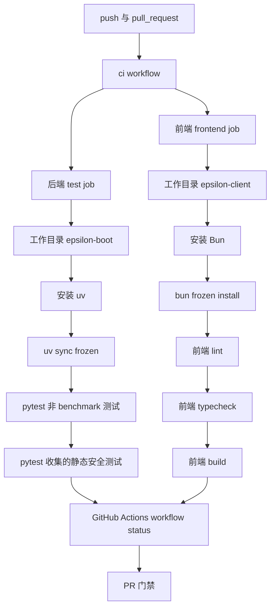
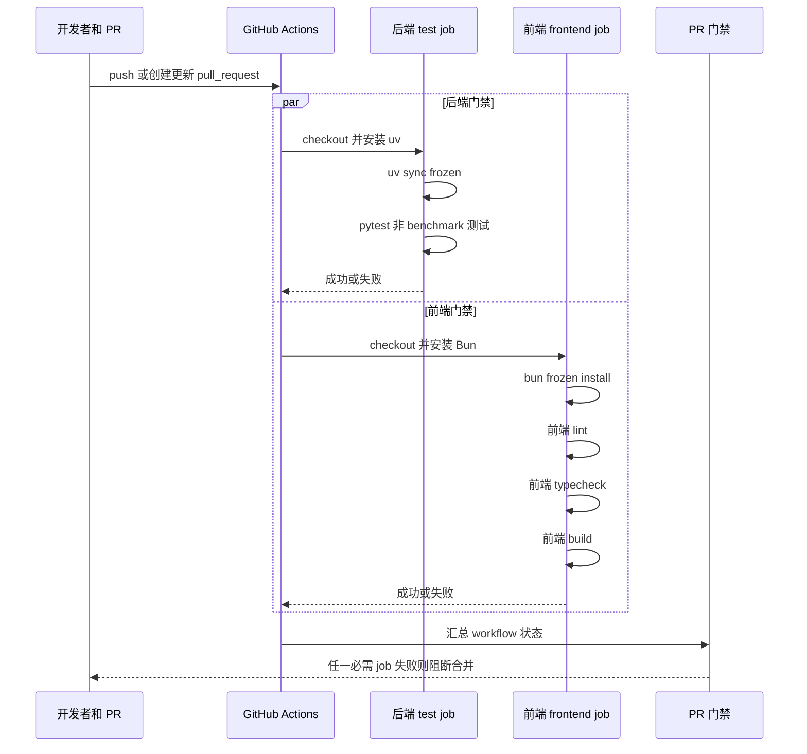

# 设计文档：CI 补齐前端、后端、安全和构建门禁

## 概述

本设计在不触碰前后端业务源码的前提下，将前端 lint、TypeScript 类型检查和 Next.js 构建加入现有 GitHub Actions CI 工作流，并补齐前端本地 `typecheck` 脚本与开发文档命令。设计遵循 `docs/steering/ddd-architecture.md` 的分层约束（不引入后端/前端业务层变更）、`docs/steering/uv-package-manager.md` 的后端 `uv` 命令约束、`docs/steering/config-source.md` 的配置来源约束（不修改配置文件或 `.env`）以及 `docs/steering/code-documentation.md` 的中文文档风格。

本特性仅修改 `.github/workflows/ci.yml`、`epsilon-client/package.json`、`docs/development.md` 三个文件；不新增依赖、不修改 lockfile、不引入后端静态扫描器、不新增前端测试框架，也不改变应用运行时行为。

#### 设计决策

| 决策 | 选择方案 | 理由 |
| --- | --- | --- |
| 前端类型检查入口 | 在 `epsilon-client/package.json` 的 `scripts` 中新增 `"typecheck": "tsc --noEmit"` | 与需求 1 的命令完全一致；复用现有 TypeScript devDependency，不新增依赖或运行时行为。 |
| 前端 CI job 标识 | 在 `.github/workflows/ci.yml` 新增独立 job `frontend` | 与现有后端 `test` job 解耦，前端失败可独立定位；不重命名现有 `test` job，避免破坏既有分支保护或历史状态检查名称。 |
| 前端 CI 运行系统 | `runs-on: ubuntu-latest` | 满足需求 2；前端构建不需要 Windows 矩阵，避免扩大 CI 成本和范围。 |
| 前端 CI 包管理器 | 使用 `oven-sh/setup-bun@v2` 后执行 `bun install --frozen-lockfile` | 与仓库前端 `bun.lock` 和需求约束一致；冻结安装确保依赖解析不漂移。 |
| 前端 CI 检查顺序 | `bun run lint` → `bun run typecheck` → `bun run build` | 先执行较快的静态检查，再执行构建；任一步骤非零退出即失败，形成 PR 门禁。 |
| 后端 CI 处理方式 | 保留现有 `test` job、OS matrix、`epsilon-boot` 工作目录、`uv sync --frozen` 与 `uv run pytest -m "not benchmark"` | 满足需求 3，并遵循 `uv` steering；现有 pytest 收集的静态安全测试继续随测试门禁执行。 |
| 安全门禁范围 | 不新增独立安全扫描器 | 需求明确限定本阶段安全检查为 pytest 已收集的静态安全测试，避免引入 Task 6 以外能力。 |
| 文档更新范围 | 仅在 `docs/development.md` 前端命令块中加入 `bun run typecheck  # TypeScript 类型检查` 并保留受限沙箱说明 | 让本地验证命令与 CI 一致，同时保留既有 Next/Turbopack 沙箱限制提醒。 |
| Next.js 16 lint/build 约定 | 保持现有 `"lint": "eslint ."` 与 `"build": "next build"`，不回退到 `next lint` 或显式 `--webpack` | `epsilon-client/AGENTS.md` 要求参考本地 Next 文档；Next 16 文档说明 ESLint CLI 和默认 Turbopack 是当前约定。 |
| 变更范围控制 | 通过实现前后执行 `git diff -- .github/workflows/ci.yml epsilon-client/package.json docs/development.md` 校验 | 满足需求 5，确保不混入后端源码、前端源码、lockfile、配置或后续任务。 |

## 架构

本特性属于仓库级 CI 与脚本配置变更，不改变后端 FastAPI + DDD 六边形架构，也不改变前端 Next.js 运行时组件结构。新增的前端 CI job 与现有后端 `test` job 在同一个 GitHub Actions workflow 中并行形成质量门禁；任一 job 或 step 非零退出都会使 workflow 失败，从而作为 push / pull request 的阻断信号。





相关目录和文件结构：

```text
.github/workflows/ci.yml                         # GitHub Actions workflow：保留后端 test job，新增 frontend job
epsilon-client/package.json                 # 前端 scripts：新增 typecheck
epsilon-client/bun.lock                     # 已存在，仅被 bun install --frozen-lockfile 读取，不修改
docs/development.md                              # 开发指南：补充本地 typecheck 命令与验证说明
```

## 组件与接口

1. **CI 工作流：后端 `test` job**

   - **位置**：`.github/workflows/ci.yml`
   - **职责**：继续在 push 和 pull request 上执行后端冻结依赖安装与非 benchmark pytest，包含 pytest 已收集的静态安全测试。
   - **接口 / 配置签名（YAML）**：实现时必须保留以下语义；允许仅因 YAML 格式化调整空行，不允许改命令、工作目录或包管理器。

   ```yaml
   name: ci

   on:
     push:
       branches: ["**"]
     pull_request:

   jobs:
     test:
       strategy:
         fail-fast: false
         matrix:
           os: [ubuntu-latest, windows-latest]
       runs-on: ${{ matrix.os }}
       defaults:
         run:
           working-directory: epsilon-boot
           shell: bash
       steps:
         - name: Checkout
           uses: actions/checkout@v4

         - name: Install uv
           uses: astral-sh/setup-uv@v3

         - name: Sync dependencies
           run: uv sync --frozen

         - name: Run tests (includes static secret hygiene checks)
           run: uv run pytest -m "not benchmark"
   ```

2. **CI 工作流：前端 `frontend` job**

   - **位置**：`.github/workflows/ci.yml`
   - **职责**：在 `ubuntu-latest` 上安装前端依赖，并依次执行 lint、TypeScript 类型检查和 Next.js 构建。
   - **接口 / 配置签名（YAML）**：新增 job 必须使用以下完整结构和命令。

   ```yaml
     frontend:
       runs-on: ubuntu-latest
       defaults:
         run:
           working-directory: epsilon-client
           shell: bash
       steps:
         - name: Checkout
           uses: actions/checkout@v4

         - name: Install Bun
           uses: oven-sh/setup-bun@v2

         - name: Install frontend dependencies
           run: bun install --frozen-lockfile

         - name: Run frontend lint
           run: bun run lint

         - name: Run frontend typecheck
           run: bun run typecheck

         - name: Run frontend build
           run: bun run build
   ```

   - **执行契约**：
     - `frontend` job 不声明 `needs: test`，与后端 job 独立运行，缩短反馈时间。
     - 不配置缓存、不上传 artifact、不读取 secrets、不设置 `NEXT_PUBLIC_API_BASE_URL`，因为当前构建应依赖默认 Next.js 配置与仓库内资源。
     - 任一步骤返回非零 exit code 时，GitHub Actions 标记该 step 和 `frontend` job 失败。

3. **前端脚本集合：`package.json` scripts**

   - **位置**：`epsilon-client/package.json`
   - **职责**：为本地开发和 CI 暴露统一的 TypeScript 类型检查命令。
   - **接口 / 配置签名（JSON）**：实现后的 `scripts` 对象必须为以下键值集合；除新增 `typecheck` 外，不改变既有脚本命令。

   ```json
   {
     "scripts": {
       "dev": "next dev",
       "build": "next build",
       "start": "next start",
       "lint": "eslint .",
       "typecheck": "tsc --noEmit"
     }
   }
   ```

   - **约束**：
     - 不修改 `dependencies`、`devDependencies`、`bun.lock`、`packageManager` 或其他 package 元数据。
     - 不新增 `test`、`e2e`、`schema`、`security` 等脚本，避免越界到 Task 8 / Task 9 或后续任务。

4. **开发文档：前端命令块**

   - **位置**：`docs/development.md`
   - **职责**：让本地开发者能够用与 CI 一致的命令复现前端门禁，并保留受限沙箱中的 Next/Turbopack 构建限制说明。
   - **接口 / 文档签名（Markdown 命令块）**：前端命令块必须包含以下命令，其中 `bun run typecheck  # TypeScript 类型检查` 为新增行。

   ```markdown
   前端命令在 `epsilon-client/` 下执行：

   ```bash
   bun install
   bun run dev        # 启动 Next.js dev server（默认 3000）
   bun run build
   bun run start
   bun run lint
   bun run typecheck  # TypeScript 类型检查
   ```
   ```

   - **文档约束**：
     - 保留现有关于 `Next/Turbopack build 在受限沙箱中可能因 helper 进程本地端口绑定失败，需要在具备本地端口权限的环境中重跑` 的说明。
     - 不把前端命令从 Bun 改写为 npm/yarn/pnpm；既有“也可用 npm run lint / npm run build”的历史说明如保留，不得影响本特性要求的 Bun CI 路径。

## 数据模型

本特性不新增领域模型、持久化模型、数据库表、ORM/PO、DDL、索引、缓存键或后端配置键。涉及的数据格式仅为仓库已有配置文件格式：GitHub Actions YAML、`package.json` JSON 和 Markdown 文档命令块。

| 数据 / 配置对象 | 文件 | 目标状态 | 需求覆盖 |
| --- | --- | --- | --- |
| `Frontend_Typecheck_Script` | `epsilon-client/package.json` | `"typecheck": "tsc --noEmit"` | 需求 1 |
| `Frontend_CI_Job` | `.github/workflows/ci.yml` | job id 为 `frontend`，`runs-on: ubuntu-latest`，默认工作目录 `epsilon-client` | 需求 2 |
| `Bun_Frozen_Install` | `.github/workflows/ci.yml` | `bun install --frozen-lockfile` | 需求 2 |
| `Frontend_Lint_Gate` | `.github/workflows/ci.yml` | `bun run lint` | 需求 2 |
| `Frontend_Typecheck_Gate` | `.github/workflows/ci.yml` | `bun run typecheck` | 需求 2 |
| `Frontend_Build_Gate` | `.github/workflows/ci.yml` | `bun run build` | 需求 2 |
| `UV_Frozen_Sync` | `.github/workflows/ci.yml` | `uv sync --frozen` 保持不变 | 需求 3 |
| `Backend_Pytest_Gate` | `.github/workflows/ci.yml` | `uv run pytest -m "not benchmark"` 保持不变 | 需求 3 |
| `Development_Documentation` | `docs/development.md` | 前端命令块列出 `bun run typecheck  # TypeScript 类型检查` | 需求 4 |

配置来源约束：本特性不修改 `epsilon-boot/config.properties`、`.env`、`next.config.ts` 或任何运行时配置文件。

## 事务与并发边界

本特性没有应用运行时写入、数据库事务、外部服务事务、消息队列发布或跨数据源一致性问题，因此不需要后端事务管理器、回滚规则或锁机制。实现层面的写入边界是一次代码变更中的三个仓库文件：`.github/workflows/ci.yml`、`epsilon-client/package.json`、`docs/development.md`；这些文件应在同一提交中完成，避免 CI 引用尚未存在的 `typecheck` 脚本。

CI 并发边界如下：

- `test` job 与 `frontend` job 无 `needs` 依赖，GitHub Actions 可以并行执行。
- 两个 job 分别在独立 runner 工作目录中执行，不共享可写缓存、artifact 或临时状态。
- 后端 `test` job 保持 `strategy.fail-fast: false`，Linux 与 Windows 后端测试互不抢占；新增 `frontend` job 不加入后端 matrix。
- `frontend` job 内部步骤按顺序执行：冻结安装成功后才执行 lint，lint 成功后才执行 typecheck，typecheck 成功后才执行 build。
- 一次业务意义上的 PR 门禁跨越后端 job 与前端 job 两个独立执行边界；一致性由 GitHub Actions workflow 状态聚合保证，任一 job 失败即使整体门禁失败。

## 正确性属性

### Property 1：前端类型检查脚本精确且无副作用

**不变式**：`epsilon-client/package.json` 的 `scripts` 中必须存在 `"typecheck": "tsc --noEmit"`，且不得通过本特性新增依赖、lockfile 变更、测试脚本、E2E 脚本或运行时行为。

**验证需求：需求 1.1、需求 1.2、需求 1.3、需求 5.1、需求 5.2、需求 5.3。**

### Property 2：前端 CI job 形成完整前端质量门禁

**不变式**：`.github/workflows/ci.yml` 必须定义 `frontend` job，运行于 `ubuntu-latest`，默认工作目录为 `epsilon-client`，并按 `setup-bun`、冻结安装、lint、typecheck、build 的顺序执行；任一检查失败时 `frontend` job 失败。

**验证需求：需求 2.1、需求 2.2、需求 2.3、需求 2.4、需求 2.5、需求 2.6、需求 2.7、需求 2.8、需求 2.9。**

### Property 3：后端 CI 保持 uv 冻结依赖和 pytest 门禁

**不变式**：现有后端 `test` job 继续以 `epsilon-boot` 为默认工作目录，执行 `uv sync --frozen` 和 `uv run pytest -m "not benchmark"`；不引入 `pip`、`poetry`、`pipenv`、`conda` 或独立安全扫描器。

**验证需求：需求 3.1、需求 3.2、需求 3.3、需求 3.4、需求 3.5、需求 3.6。**

### Property 4：开发文档可复现前端 CI 检查并记录沙箱限制

**不变式**：`docs/development.md` 的前端命令块列出 `bun run typecheck  # TypeScript 类型检查`，本地验证路径包含 `bun run lint`、`bun run typecheck`、`bun run build`，并保留受限沙箱中 Next/Turbopack helper 进程本地端口绑定失败时需要在正常开发环境或 CI 重跑的说明。

**验证需求：需求 4.1、需求 4.2、需求 4.3、需求 4.4。**

### Property 5：变更范围仅限 CI、脚本和开发文档

**不变式**：实现后的 `git diff` 只包含 `.github/workflows/ci.yml`、`epsilon-client/package.json`、`docs/development.md`；不得修改后端源码、后端测试、前端源码、依赖 lockfile、主配置文件，也不得实现 Task 6 / 7 / 8 / 9 / 10 的能力。

**验证需求：需求 5.1、需求 5.2、需求 5.3。**

## 错误处理

本特性不经过后端 API，不涉及仓库的 `BizException`、FastAPI 异常映射或响应包装。错误传播模型使用现有命令行与 GitHub Actions 机制：命令返回非零 exit code 时 step 失败，step 失败时 job 失败，任一必需 job 失败时 workflow / PR 门禁失败。

| 场景 | 触发点 | 传播策略 | 预期结果 | 需求覆盖 |
| --- | --- | --- | --- | --- |
| 前端依赖与 `bun.lock` 不一致 | `bun install --frozen-lockfile` | Bun 返回非零 exit code，GitHub Actions 标记 step 失败 | `frontend` job 失败，PR 门禁失败 | 需求 2.3、需求 2.7-2.9 |
| 前端 lint 失败 | `bun run lint` | ESLint CLI 返回非零 exit code | `frontend` job 失败，PR 门禁失败 | 需求 2.4、需求 2.7 |
| 前端类型错误 | `bun run typecheck` | `tsc --noEmit` 返回非零 exit code | `frontend` job 失败，PR 门禁失败 | 需求 1.2、需求 2.5、需求 2.8 |
| 前端构建失败 | `bun run build` | Next.js build 返回非零 exit code | `frontend` job 失败，PR 门禁失败 | 需求 2.6、需求 2.9 |
| 后端锁文件或依赖同步失败 | `uv sync --frozen` | uv 返回非零 exit code | `test` job 对应矩阵失败，PR 门禁失败 | 需求 3.2、需求 3.5 |
| 后端测试或 pytest 收集的静态安全测试失败 | `uv run pytest -m "not benchmark"` | pytest 返回非零 exit code | `test` job 对应矩阵失败，PR 门禁失败 | 需求 3.3、需求 3.4、需求 3.6 |
| 本地受限沙箱无法完成 Next/Turbopack build | `bun run build` 本地验证 | 不在代码中绕过；在验证记录中注明环境限制，要求正常开发环境或 CI 重跑 | 不把环境限制误判为设计通过；保留真实门禁 | 需求 4.3、需求 4.4 |
| YAML / JSON 格式错误 | GitHub Actions 解析或 Bun/npm 读取 package.json | 解析阶段失败或命令失败 | CI 失败；实现阶段通过人工 diff 和命令验证提前发现 | 需求 2、需求 5 |

错误处理原则：

- 不吞掉失败：不添加 `continue-on-error: true`。
- 不弱化检查：不把 `bun run typecheck` 合并进 `build` 后隐藏独立失败信号。
- 不用非仓库约定工具替代失败检查：后端继续使用 `uv`，前端继续使用 Bun。
- 不新增安全扫描器或测试框架来“修复”失败；若失败来自现有代码质量问题，应由后续修复提交处理。

## 测试策略

本特性不新增业务代码，因此不适用 Hypothesis 属性测试、后端单元测试类扩展、前端 Vitest 或 Playwright。验证采用仓库现有命令和 CI 机制，覆盖需求中的每个门禁与范围约束。

1. **静态结构验证**

   - 检查 `epsilon-client/package.json`：
     - `scripts.typecheck` 精确等于 `tsc --noEmit`。
     - `dependencies`、`devDependencies`、`bun.lock` 未变化。
     - 覆盖需求 1、需求 5。
   - 检查 `.github/workflows/ci.yml`：
     - 后端 `test` job 保留 `epsilon-boot` 工作目录、`uv sync --frozen`、`uv run pytest -m "not benchmark"`。
     - 新增 `frontend` job 包含 `ubuntu-latest`、`oven-sh/setup-bun@v2`、`bun install --frozen-lockfile`、`bun run lint`、`bun run typecheck`、`bun run build`。
     - 不存在 `continue-on-error: true`。
     - 覆盖需求 2、需求 3。
   - 检查 `docs/development.md`：
     - 前端命令块包含 `bun run typecheck  # TypeScript 类型检查`。
     - 受限沙箱构建限制说明仍存在。
     - 覆盖需求 4。

2. **本地前端验证**

   在 `epsilon-client/` 下执行：

   ```bash
   bun run lint
   bun run typecheck
   bun run build
   ```

   - 三条命令全部成功时，记录本地验证通过。
   - 若 `bun run build` 在受限沙箱中因 Next/Turbopack helper 进程本地端口绑定权限不足失败，记录该环境限制，并要求在具备本地端口权限的开发机或 GitHub Actions CI 中重跑。
   - 覆盖需求 1.2、需求 2.4-2.6、需求 4.2、需求 4.3。

3. **后端 CI 命令保持验证**

   不需要为本特性额外本地运行后端全量测试，但实现后必须确认 workflow 中仍为：

   ```bash
   uv sync --frozen
   uv run pytest -m "not benchmark"
   ```

   若执行仓库级验收，可在 `epsilon-boot/` 下按 CI 命令运行；不得改用 `pip`、`poetry`、`pipenv` 或 `conda`。

   覆盖需求 3。

4. **范围验证**

   实现完成后执行并记录：

   ```bash
   git diff -- .github/workflows/ci.yml epsilon-client/package.json docs/development.md
   ```

   同时检查 `git diff --name-only`，确认修改文件集合仅包含：

   ```text
   .github/workflows/ci.yml
   epsilon-client/package.json
   docs/development.md
   ```

   覆盖需求 5。

5. **GitHub Actions 集成验证**

   在 push 或 pull request 上观察 `ci` workflow：

   - 后端 `test` job 的 Ubuntu 与 Windows 矩阵均完成。
   - 前端 `frontend` job 完成冻结安装、lint、typecheck、build。
   - 任一门禁失败时 workflow 显示失败；全部通过时 workflow 显示成功。

   覆盖需求 2.7-2.9、需求 3.5-3.6。
