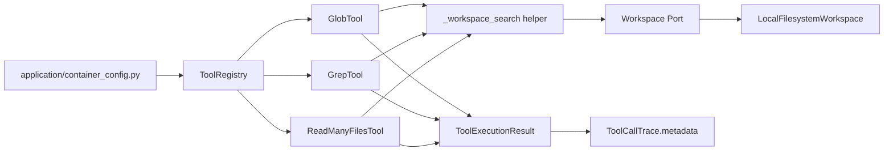
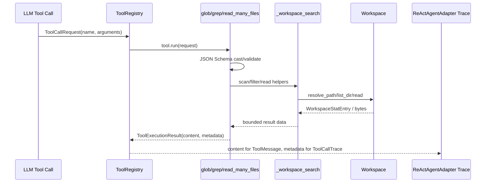

# 设计文档：Code Search Tools

## 概述

本设计新增 `glob`、`grep`、`read_many_files` 三个低风险、只读代码检索工具，作为 `Tool` 的基础设施适配器注册进既有 `ToolRegistry`。实现遵循 `tool-authoring.md`、`ddd-architecture.md`、`python-typing-lint.md` 与 `doc-sync.md`：工具只通过注入的 `Workspace` 读取逻辑路径，不新增领域抽象、不直接访问宿主文件系统、不引入数据库写入或外部依赖。

#### 设计决策

| 决策 | 选择 | 理由 |
| --- | --- | --- |
| 工具放置 | 分别放入 `infrastructure/tools/glob/`、`infrastructure/tools/grep/`、`infrastructure/tools/read_many_files/` | 对齐 `tool-authoring.md` 的“一个工具一个子包”，避免继续扩大 legacy `filesystem/` 聚合包。 |
| 共享逻辑 | 新增 `infrastructure/tools/_workspace_search.py` 作为内部 helper | 三个工具都需要 Workspace 递归枚举、路径模式过滤、输出截断；共享 helper 不暴露为 Tool，不改变领域层。 |
| 文件扫描方式 | 使用 `Workspace.resolve_path()` + `Workspace.list_dir()` + `Workspace.read()` | 满足 Workspace confinement；工具实现不使用 `os` / `pathlib` / `open` 访问宿主路径。 |
| 模式匹配 | 使用 POSIX 逻辑路径字符串 + `fnmatch.fnmatchcase()` | 无新增依赖，结果确定，适合 `**/*.py`、`src/**/*.py` 这类 Agent 常用模式。 |
| 搜索模式 | `grep` 支持 `literal` 与 `regex` 两种模式 | 覆盖主流 coding agent 的关键词搜索与正则搜索；非法 regex 在扫描前失败。 |
| 读取错误策略 | `read_many_files` 对单文件错误生成 per-file error entry 并继续 | 满足批量读取的容错需求；仍不泄露宿主路径。 |
| 风险与恢复语义 | 三个工具均声明 `LOW`、`NONE`、`REPLAY_RESULT` | 三者只读 Workspace 且无外部副作用，恢复时可重放结果。 |
| 配置项 | 不新增 `config.properties` 配置项 | 工具始终注册，限制通过参数 schema 与模块常量实现；避免为低风险读类工具增加配置面。 |

## 架构





新增文件结构：

```text
epsilon-boot/src/infrastructure/tools/
  _workspace_search.py
  glob/
    __init__.py
    glob_tool.py
  grep/
    __init__.py
    grep_tool.py
  read_many_files/
    __init__.py
    read_many_files_tool.py

epsilon-boot/test/infrastructure/tools/
  test_workspace_search_helpers_unit.py
  glob/test_glob_tool_unit.py
  grep/test_grep_tool_unit.py
  read_many_files/test_read_many_files_tool_unit.py
```

## 组件与接口

### 1. `infrastructure.tools._workspace_search`

位置：`epsilon-boot/src/infrastructure/tools/_workspace_search.py`

职责：提供仅基于 `Workspace` 的递归文件枚举、POSIX pattern 校验、模式匹配、内容截断与预览格式化。该模块是基础设施内部 helper，不注册为 Tool，不导入 `os` / `pathlib` / `open`。

```python
from __future__ import annotations

from dataclasses import dataclass
from enum import StrEnum

from domain.workspace.ports import Workspace
from domain.workspace.value_objects import WorkspacePath, WorkspaceStatEntry


class SearchMode(StrEnum):
    """内容搜索模式。"""

    LITERAL = "literal"
    REGEX = "regex"


@dataclass(frozen=True, slots=True)
class SearchFileCandidate:
    """可被代码检索工具读取的文件候选。"""

    path: WorkspacePath
    posix_path: str
    size: int | None


@dataclass(frozen=True, slots=True)
class BoundedText:
    """受输出上限约束后的文本片段。"""

    text: str
    truncated: bool


def validate_workspace_pattern(pattern: str, *, field_name: str) -> None:
    """校验 POSIX pattern 不含 Workspace 越界段或非法字符。"""


def pattern_matches(posix_path: str, pattern: str) -> bool:
    """判断 Workspace POSIX 路径是否匹配 glob 风格 pattern。"""


async def list_file_candidates(
    workspace: Workspace,
    *,
    directory_path: str,
    include_pattern: str,
    max_files: int,
    context: dict[str, object],
) -> tuple[list[SearchFileCandidate], bool]:
    """列出目录下匹配 include_pattern 的文件候选。

    Returns:
        二元组：候选文件列表、候选数量是否因 max_files 被截断。
    """


def clamp_text(text: str, *, max_chars: int) -> BoundedText:
    """按字符上限截断文本，并返回是否截断。"""


def render_file_header(posix_path: str) -> str:
    """生成批量读取输出中的文件标题行。"""
```

### 2. `GlobTool`

位置：`epsilon-boot/src/infrastructure/tools/glob/glob_tool.py`

职责：按工作区 POSIX pattern 返回匹配文件路径。只返回文件，不返回目录。

```python
from __future__ import annotations

from typing import Any

from domain.agent.guardrails import ToolRiskLevel
from domain.agent.tools import Tool, ToolExecutionResult
from domain.run.value_objects import ToolReplayPolicy, ToolSideEffectLevel
from domain.workspace.ports import Workspace


class GlobTool(Tool):
    """按 POSIX glob pattern 查找工作区文件路径的只读工具。"""

    def __init__(self, workspace: Workspace) -> None:
        self._workspace = workspace

    @property
    def name(self) -> str:
        return "glob"

    @property
    def risk_level(self) -> ToolRiskLevel:
        return ToolRiskLevel.LOW

    @property
    def side_effect_level(self) -> ToolSideEffectLevel:
        return ToolSideEffectLevel.NONE

    @property
    def replay_policy(self) -> ToolReplayPolicy:
        return ToolReplayPolicy.REPLAY_RESULT

    @property
    def description(self) -> str:
        """返回面向 LLM 的英文工具描述。"""

    @property
    def parameters(self) -> dict[str, Any]:
        """返回 JSON Schema 参数。"""

    async def execute(self, **kwargs: Any) -> ToolExecutionResult:
        """执行路径模式匹配并返回结构化结果。"""
```

参数：

```json
{
  "pattern": "工作区相对 POSIX glob pattern，例如 **/*.py",
  "directory_path": "可选扫描目录，默认 /",
  "max_results": "可选最大返回路径数，默认 200，范围 1..1000"
}
```

`metadata`：

```python
{
    "operation": "glob",
    "pattern": str,          # 截断到 128 字符
    "directory_path": str,   # Workspace POSIX 路径
    "match_count": int,
    "truncated": bool,
}
```

### 3. `GrepTool`

位置：`epsilon-boot/src/infrastructure/tools/grep/grep_tool.py`

职责：在工作区文本文件中进行 literal 或 regex 搜索，返回路径、行号和有界预览。

```python
from __future__ import annotations

from typing import Any

from domain.agent.guardrails import ToolRiskLevel
from domain.agent.tools import Tool, ToolExecutionResult
from domain.run.value_objects import ToolReplayPolicy, ToolSideEffectLevel
from domain.workspace.ports import Workspace


class GrepTool(Tool):
    """在工作区文本文件中执行关键词或正则搜索的只读工具。"""

    def __init__(self, workspace: Workspace) -> None:
        self._workspace = workspace

    @property
    def name(self) -> str:
        return "grep"

    @property
    def risk_level(self) -> ToolRiskLevel:
        return ToolRiskLevel.LOW

    @property
    def side_effect_level(self) -> ToolSideEffectLevel:
        return ToolSideEffectLevel.NONE

    @property
    def replay_policy(self) -> ToolReplayPolicy:
        return ToolReplayPolicy.REPLAY_RESULT

    @property
    def description(self) -> str:
        """返回面向 LLM 的英文工具描述。"""

    @property
    def parameters(self) -> dict[str, Any]:
        """返回 JSON Schema 参数。"""

    async def execute(self, **kwargs: Any) -> ToolExecutionResult:
        """执行内容搜索并返回结构化结果。"""
```

参数：

```json
{
  "query": "必填搜索文本或正则表达式",
  "mode": "literal 或 regex，默认 literal",
  "directory_path": "可选扫描目录，默认 /",
  "include_pattern": "可选文件路径 pattern，默认 **/*",
  "case_sensitive": "可选大小写敏感开关，默认 true",
  "max_matches": "可选最大返回匹配数，默认 100，范围 1..1000",
  "max_files": "可选最大扫描文件数，默认 2000，范围 1..10000",
  "max_line_chars": "可选单行预览字符数，默认 300，范围 40..1000"
}
```

`metadata`：

```python
{
    "operation": "grep",
    "query": str,              # 截断到 128 字符
    "mode": "literal" | "regex",
    "directory_path": str,
    "include_pattern": str,    # 截断到 128 字符
    "files_scanned": int,
    "files_skipped": int,
    "matches_returned": int,
    "truncated": bool,
}
```

输出格式：

```text
/path/to/file.py:12: matched line preview
/path/to/file.py:27: another preview
[truncated: more matches not shown]
```

### 4. `ReadManyFilesTool`

位置：`epsilon-boot/src/infrastructure/tools/read_many_files/read_many_files_tool.py`

职责：批量读取多个工作区文件的指定行范围，并在单文件失败时继续处理后续文件。

```python
from __future__ import annotations

from typing import Any

from domain.agent.guardrails import ToolRiskLevel
from domain.agent.tools import Tool, ToolExecutionResult
from domain.run.value_objects import ToolReplayPolicy, ToolSideEffectLevel
from domain.workspace.ports import Workspace


class ReadManyFilesTool(Tool):
    """批量读取多个工作区文本文件的只读工具。"""

    def __init__(self, workspace: Workspace) -> None:
        self._workspace = workspace

    @property
    def name(self) -> str:
        return "read_many_files"

    @property
    def risk_level(self) -> ToolRiskLevel:
        return ToolRiskLevel.LOW

    @property
    def side_effect_level(self) -> ToolSideEffectLevel:
        return ToolSideEffectLevel.NONE

    @property
    def replay_policy(self) -> ToolReplayPolicy:
        return ToolReplayPolicy.REPLAY_RESULT

    @property
    def description(self) -> str:
        """返回面向 LLM 的英文工具描述。"""

    @property
    def parameters(self) -> dict[str, Any]:
        """返回 JSON Schema 参数。"""

    async def execute(self, **kwargs: Any) -> ToolExecutionResult:
        """批量读取文件并返回结构化结果。"""
```

参数：

```json
{
  "file_paths": "必填，工作区相对 POSIX 路径数组，最多 50 个",
  "offset": "可选起始行，默认 1，必须 >= 1",
  "limit": "可选每文件最大行数，默认 200，范围 1..1000",
  "max_total_chars": "可选总输出字符上限，默认 60000，范围 1000..200000"
}
```

`metadata`：

```python
{
    "operation": "read_many_files",
    "requested_file_count": int,
    "files_read": int,
    "files_failed": int,
    "total_lines_returned": int,
    "truncated": bool,
}
```

输出格式：

```text
===== /src/a.py =====
   1 | ...

===== /src/missing.py =====
[error] 路径 /src/missing.py 不存在
```

### 5. 组合根注册

位置：`epsilon-boot/src/application/container_config.py::_create_tool_registry()`

在 filesystem 工具注册后注册三个新读类工具：

```python
from infrastructure.tools.glob import GlobTool
from infrastructure.tools.grep import GrepTool
from infrastructure.tools.read_many_files import ReadManyFilesTool

for tool_cls in (GlobTool, GrepTool, ReadManyFilesTool):
    registry.register(tool_cls(workspace=ws))
```

注册为默认内置工具，不新增开关。若模块导入失败，按现有可选工具风格记录 debug 并跳过。

## 数据模型

本特性不新增领域值对象、数据库表、API DTO 或配置模型。

工具返回的数据格式如下：

| 工具 | `content` | `metadata` |
| --- | --- | --- |
| `glob` | 每行一个匹配文件路径，空结果返回空串 | `operation`、`pattern`、`directory_path`、`match_count`、`truncated` |
| `grep` | 每行 `path:line: preview`，空结果返回空串 | `operation`、`query`、`mode`、`directory_path`、`include_pattern`、`files_scanned`、`files_skipped`、`matches_returned`、`truncated` |
| `read_many_files` | 多文件标题 + 带行号内容 + per-file error entry | `operation`、`requested_file_count`、`files_read`、`files_failed`、`total_lines_returned`、`truncated` |

截断常量由模块级私有常量承载，避免新增配置项：

```python
_SUMMARY_MAX_LEN = 128
_DEFAULT_GLOB_MAX_RESULTS = 200
_DEFAULT_GREP_MAX_MATCHES = 100
_DEFAULT_GREP_MAX_FILES = 2000
_DEFAULT_GREP_MAX_LINE_CHARS = 300
_DEFAULT_READ_MANY_FILE_LIMIT = 200
_DEFAULT_READ_MANY_MAX_TOTAL_CHARS = 60000
```

## 事务与并发边界

本特性不执行数据库写入、不写 Workspace、不调用外部服务，因此无事务管理器、回滚规则或跨资源一致性问题。

并发边界：

- 三个工具实例无可变共享状态，单次 `execute()` 只使用局部变量。
- `Workspace.list_dir()` 与 `Workspace.read()` 是只读操作；并发文件修改可能导致扫描后读取失败，工具按 `WorkspaceNotFoundError` / `WorkspaceIoError` 翻译为工具错误或 per-file error entry。
- `grep` 与 `read_many_files` 不并发读取文件，保持输出顺序确定；后续若引入并发读取需另行评估输出稳定性与 Workspace 后端压力。

## 正确性属性

### Property 1：Workspace confinement

新增工具不得返回或读取 Workspace 外部路径；任何可见路径均为 Workspace POSIX 逻辑路径。

验证需求：需求 1.2、1.3、2.5、3.4、4.1-4.7、5.4。

### Property 2：Deterministic bounded output

相同 Workspace 快照、相同参数下，工具输出顺序稳定；所有结果受匹配数、文件数、行数或字符数上限约束。

验证需求：需求 1.2、1.4、2.4、2.6、3.2、3.5、5.5。

### Property 3：Read-only recovery semantics

三个工具只读且无外部副作用，风险等级、side effect 与 replay policy 必须与 `LOW` / `NONE` / `REPLAY_RESULT` 一致。

验证需求：需求 1.5、2.7、3.6、6.2-6.4。

### Property 4：Trace metadata hygiene

metadata 仅记录结构化摘要和计数，不记录宿主绝对路径、凭证、完整文件内容或无限长 query/pattern。

验证需求：需求 5.1-5.5。

### Property 5：Partial failure containment

`read_many_files` 的单文件缺失、不可读或解码失败不会阻断其它文件读取；`grep` 对不可读或非文本文件跳过计数，不泄露内部后端细节。

验证需求：需求 2.5、3.3、3.4、6.3、6.4。

## 错误处理

沿用现有工具错误模型：业务/安全失败抛 `domain.agent.exceptions.ToolExecutionError`，参数结构错误由 `Tool.run()` 的 JSON Schema 校验抛 `ToolParameterValidationError`。

| 场景 | 工具 | 处理 |
| --- | --- | --- |
| pattern 含 NUL、反斜杠、`..` 段或 Windows 盘符 | `glob`、`grep` | 扫描前抛 `ToolExecutionError`，消息只说明 pattern 非法。 |
| `directory_path` 越界 | `glob`、`grep` | 捕获 `WorkspaceConfinementViolation` 并抛 `ToolExecutionError`，不含宿主路径。 |
| regex 非法 | `grep` | 编译前置，抛 `ToolExecutionError("正则表达式非法")` 并保留 `tool_name="grep"`。 |
| 文件读取解码失败 | `grep` | 跳过文件，`files_skipped += 1`，不输出内部 reason。 |
| 单文件缺失或读取失败 | `read_many_files` | 输出该文件 error entry，`files_failed += 1`，继续处理后续文件。 |
| `offset < 1`、`limit < 1` 或 `max_total_chars < 1` | `read_many_files` | 抛 `ToolExecutionError`，并且不调用 `Workspace.read()`。 |
| 未知异常 | 全部 | 由 `Tool.run()` 包装为 `ToolExecutionError`，保持既有工具执行语义。 |

错误消息红线：

- 不拼入 `Workspace.display_root_hint()`、宿主绝对路径、环境变量值或完整文件内容。
- `metadata` 不在失败工具内自行构造；失败 trace 由 `ReActAgentAdapter` 既有异常分支记录 `error_class`。

## 测试策略

使用 `pytest` + `pytest.mark.asyncio`，沿用 `test/infrastructure/tools/filesystem/test_read_file_tool_unit.py` 的 mock `Workspace` 样式，测试离线确定性。

| 需求 | 测试文件 | 覆盖点 |
| --- | --- | --- |
| 需求 1 | `test/infrastructure/tools/glob/test_glob_tool_unit.py` | 正常匹配、空结果、排序、pattern 越界拒绝、max_results 截断、metadata、description、schema。 |
| 需求 2 | `test/infrastructure/tools/grep/test_grep_tool_unit.py` | literal、regex、case_sensitive、invalid regex、include_pattern、跳过二进制/不可读文件、max_matches 截断、metadata。 |
| 需求 3 | `test/infrastructure/tools/read_many_files/test_read_many_files_tool_unit.py` | 多文件成功、missing per-file error、越界 per-file error、offset/limit、total char 截断、metadata。 |
| 需求 4 | 三个工具单测 + AST 静态测试 | 工具源码不导入 `os` / `pathlib` / `open` / `common.tools.common_tools`；Workspace 方法带 `context["tool_name"]`。 |
| 需求 5 | 三个工具单测 | metadata key 集合、snake_case、摘要截断、不含宿主路径或完整内容。 |
| 需求 6 | `test/infrastructure/tools/test_builtin_tool_risk_levels_unit.py`、container 相关单测、`docs/tools.md` diff | 风险声明、注册行为、文档同步。 |

建议验证命令：

```bash
cd epsilon-boot
PYTHONPATH=src uv run --frozen pytest \
  test/infrastructure/tools/glob \
  test/infrastructure/tools/grep \
  test/infrastructure/tools/read_many_files \
  test/infrastructure/tools/test_builtin_tool_risk_levels_unit.py \
  -q
PYTHONPATH=src uv run --frozen pytest test/application/test_workspace_container_integration.py -q
uv run ruff check src/infrastructure/tools test/infrastructure/tools
uv run pyright
```

## 自评与确认结论

设计自评发现 1 个取舍，已由用户确认：

1. `glob`/`grep` 的 pattern 语义：使用 Python `fnmatch.fnmatchcase()` 对 POSIX 逻辑路径做匹配，无新增依赖，适合 `**/*.py` 等常见模式；不实现完整 gitignore 规则，也不默认排除 `.git`、`.venv` 等目录。性能风险通过 `directory_path` / `include_pattern` 缩小范围，以及 `max_results` / `max_files` / `max_matches` / 输出字符上限保持有界。
