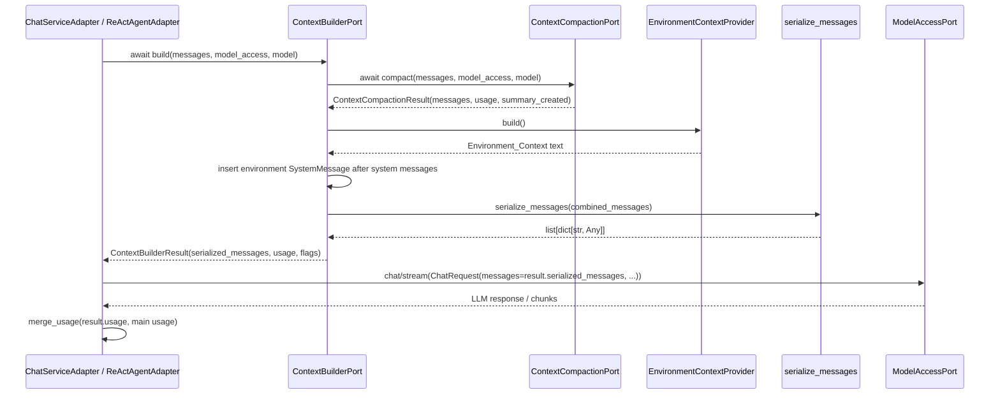

# 设计文档：Context Engineering

## 概述

本设计在现有 DDD / 六边形架构下新增 `ContextBuilderPort`，把模型输入装配集中到一个领域 Port 与基础设施 Adapter 中：调用方传入完整消息、当前请求模型访问端口和模型名，builder 负责复用 `ContextCompactionPort`、插入安全的 Codex 风格环境上下文，并通过现有 `serialize_messages` 输出模型消息。设计遵循 `docs/steering/ddd-architecture.md` 的依赖方向、`docs/steering/config-source.md` 的配置来源规则、`docs/steering/code-documentation.md` 的中文 docstring 规范，以及 `docs/steering/uv-package-manager.md` 的依赖管理规则。

V1 不修改 session 持久化，不替换摘要压缩，不新增数据库 / Redis 结构，也不实现 `AGENTS.md` 或项目指令发现。`ChatServiceAdapter` 与 `ReActAgentAdapter` 只从 `ContextBuilderPort` 获取模型消息，仍由各自保留模型路由、工具 schema、审批、最终回复保存和 usage 合并职责。

### 设计决策

| 决策 | 选定方案 | 理由 |
| --- | --- | --- |
| Port 位置 | 在 `domain/chat/ports.py` 新增 `ContextBuilderPort` | 该能力直接消费 `BaseMessage` / `ContextCompactionResult`，与现有聊天上下文端口同一限界上下文，避免新增空目录和跨域跳转。 |
| Result 位置 | 在 `domain/chat/value_objects.py` 新增 `ContextBuilderResult` | 与 `ContextCompactionResult` 并列，领域层只表达构建结果，不包含基础设施序列化实现细节之外的 I/O。 |
| 环境上下文形态 | 注入为临时 `SystemMessage`，metadata 标记 `{"context_kind": "environment"}` | 复用现有 `BaseMessage` 和 `serialize_messages`，便于保证插入顺序和“不写历史”。metadata 不会进入模型消息，但可供测试识别临时消息。 |
| 环境上下文 provider | 基础设施层 `StaticEnvironmentContextProvider`，默认启用且不新增配置 | Requirement 要求 V1 默认启用；本期没有关闭开关需求，避免新增配置面。未来若要开关，再按 `config.properties` 规则补充。 |
| 工作区提示 | 不直接使用 `Workspace.display_root_hint()` 的返回值；统一输出逻辑提示 `workspace:/` | 现有本地 Workspace 的 `display_root_hint()` 返回宿主绝对路径，与本特性“不泄露宿主绝对路径”冲突。V1 使用安全固定提示更稳。 |
| 环境上下文失败策略 | provider 失败或检测到不安全内容时 fail-fast | 用户确认 B；环境上下文承载路径披露边界，失败时阻断模型调用比静默缺失更符合安全目标。 |
| 当前日期 | provider 构造期接收 `clock: Callable[[], datetime] = datetime.now`，运行期输出本地日期 `YYYY-MM-DD` | 便于测试固定日期；不引入外部时间服务。 |
| ChatRequest 组装 | builder 只返回序列化 messages，不返回 `ChatRequest` | `tools`、`model`、stream/chat 选择仍属于 Chat / Agent 调用入口职责，满足“不改变工具 schema 和模型路由”。 |
| usage 合并 | 调用入口继续用现有 `merge_usage(builder_result.usage, main_usage)` | usage 合并属于响应编排职责；builder 只暴露压缩 usage，不消费主模型 usage。 |

## 架构

```mermaid
flowchart TD
    Chat[ChatServiceAdapter] --> BuilderPort[ContextBuilderPort]
    Agent[ReActAgentAdapter] --> BuilderPort
    BuilderPort --> Builder[ContextBuilderAdapter]
    Builder --> Compaction[ContextCompactionPort]
    Builder --> EnvProvider[StaticEnvironmentContextProvider]
    Builder --> Serializer[serialize_messages]
    Compaction --> Compacted[Compacted History Input]
    EnvProvider --> EnvMsg[Temporary SystemMessage Environment Context]
    Compacted --> Combine[Insert env after system messages]
    EnvMsg --> Combine
    Combine --> Serializer
    Serializer --> Result[ContextBuilderResult.serialized_messages]
    Result --> ChatRequest[ChatRequest(messages=..., model=..., tools=...)]
    ChatRequest --> Model[ModelAccessPort chat/stream]
```



## 组件与接口

### 1. 领域层：`ContextBuilderResult`

位置：`epsilon-boot/src/domain/chat/value_objects.py`

职责：表达上下文构建结果。它包含已经可交给 `ChatRequest.messages` 的序列化消息、压缩阶段 usage、摘要标记和环境上下文标记。该对象不包含工具 schema，避免 builder 改变 Agent 工具语义。

```python
@dataclass(frozen=True)
class ContextBuilderResult:
    """上下文构建结果值对象。

    Attributes:
        serialized_messages: 可直接传入 ChatRequest.messages 的模型消息列表。
        usage: 上下文构建阶段产生的 token usage，当前来源于 ContextCompactionPort。
        summary_created: 本次构建是否由压缩策略生成语义摘要。
        environment_injected: 本次构建是否成功注入环境上下文。
        metadata: 面向测试和观测的轻量元数据，不进入模型请求。
    """

    serialized_messages: list[dict[str, Any]]
    usage: dict[str, int] = field(default_factory=dict)
    summary_created: bool = False
    environment_injected: bool = False
    metadata: dict[str, Any] = field(default_factory=dict)

    def __post_init__(self) -> None:
        """校验 serialized_messages 与 usage 结构合法。"""
```

校验规则：

- `serialized_messages` 必须是非空 list；
- 每条消息必须包含 `role` 与 `content`；
- `usage` 的 key 必须是 `str`，value 必须是非负 `int`；
- `metadata` 必须是 dict。

### 2. 领域层：`ContextBuilderPort`

位置：`epsilon-boot/src/domain/chat/ports.py`

职责：定义“完整历史 → 模型输入”的业务能力边界。领域层只通过 `TYPE_CHECKING` 引用 `ModelAccessPort` 和 `ContextBuilderResult`，不得导入基础设施序列化函数。

```python
class ContextBuilderPort(Protocol):
    """上下文构建端口。"""

    async def build(
        self,
        messages: list["BaseMessage"],
        *,
        model_access: "ModelAccessPort | None" = None,
        model: str | None = None,
    ) -> "ContextBuilderResult":
        """构建单次模型调用使用的序列化消息列表。"""
        ...
```

参数说明：

- `messages`：来自 `ConversationContext.get_messages()` 的完整消息快照；
- `model_access` / `model`：透传给 `ContextCompactionPort`，供现有 LLM 摘要压缩复用当前请求模型；
- 不接收 `tools`，工具 schema 仍由 `ChatServiceAdapter` / `ReActAgentAdapter` 放入 `ChatRequest`。

### 3. 基础设施：`EnvironmentContextProvider`

位置：`epsilon-boot/src/infrastructure/chat/environment_context_provider.py`

职责：生成安全的 Codex 风格环境上下文文本。该 provider 是基础设施内部协作者，不定义领域 Port；只有 `ContextBuilderAdapter` 依赖它。

```python
class EnvironmentContextProvider(Protocol):
    """环境上下文提供器协议，仅供基础设施内部使用。"""

    def build(self) -> str:
        """返回可注入模型输入的环境上下文文本。"""
        ...


class StaticEnvironmentContextProvider:
    """生成安全的静态环境上下文。"""

    def __init__(
        self,
        *,
        clock: Callable[[], datetime] | None = None,
        workspace_label: str = "workspace:/",
    ) -> None:
        """初始化环境上下文提供器。"""

    def build(self) -> str:
        """生成不含宿主绝对路径、环境变量值或密钥的环境上下文。"""
```

V1 输出模板：

```text
<environment_context>
current_date: 2026-06-02
workspace: workspace:/
path_policy: Use workspace-relative POSIX paths. Do not expose host absolute paths.
</environment_context>
```

安全规则：

- `workspace_label` 默认固定为 `workspace:/`；
- provider 不读取 `os.environ`；
- provider 不读取 `Workspace.display_root_hint()`，因为本地实现返回宿主绝对路径；
- provider 在返回前调用 `_assert_no_host_absolute_path(text)`，匹配到宿主绝对路径时抛 `UnsafeEnvironmentContextError`。

### 4. 基础设施：`ContextBuilderAdapter`

位置：`epsilon-boot/src/infrastructure/chat/context_builder_adapter.py`

职责：实现 `ContextBuilderPort`。它是唯一负责“压缩结果 + 临时环境上下文 + 序列化”的组件。

```python
class ContextBuilderAdapter(ContextBuilderPort):
    """上下文构建适配器。"""

    def __init__(
        self,
        *,
        compaction: ContextCompactionPort,
        environment_provider: EnvironmentContextProvider,
    ) -> None:
        """初始化上下文构建适配器。"""

    async def build(
        self,
        messages: list[BaseMessage],
        *,
        model_access: ModelAccessPort | None = None,
        model: str | None = None,
    ) -> ContextBuilderResult:
        """构建单次模型调用的序列化消息列表。"""

    def _insert_environment_context(
        self,
        messages: list[BaseMessage],
        environment_text: str,
    ) -> list[BaseMessage]:
        """把环境上下文插入所有 system 消息之后。"""
```

构建流程：

1. 调用 `await self._compaction.compact(messages, model_access=model_access, model=model)`；
2. 复制 `compaction_result.messages` 到新 list，不修改传入列表；
3. 调用 `environment_provider.build()`；
4. 若环境上下文非空，构造临时 `SystemMessage(content=environment_text, metadata={"context_kind": "environment"})`；
5. 将临时环境消息插入到所有连续 / 非连续 system 消息之后：`insert_at = last index where role == "system" + 1`；若没有 system 消息，则插入到列表头部；
6. 调用现有 `serialize_messages(combined_messages)`；
7. 返回 `ContextBuilderResult(serialized_messages=..., usage=compaction_result.usage, summary_created=compaction_result.summary_created, environment_injected=True/False)`。

环境 provider 失败策略：

- `UnsafeEnvironmentContextError` 直接向上传播；
- 普通 `Exception` 包装为 `EnvironmentContextBuildError` 后向上传播；
- 记录 warning，`extra` 只包含错误类型、压缩后消息数量、`environment_injected=False`；
- 不记录环境上下文正文；
- 不构建 `ContextBuilderResult`，不继续主模型调用。

### 5. 基础设施：路径安全校验

位置：`epsilon-boot/src/infrastructure/chat/environment_context_provider.py`

```python
class UnsafeEnvironmentContextError(RuntimeError):
    """环境上下文包含不允许暴露给模型的宿主路径或敏感内容。"""


class EnvironmentContextBuildError(RuntimeError):
    """环境上下文生成失败，阻止继续构建模型输入。"""


_HOST_ABSOLUTE_PATH_PATTERNS: tuple[re.Pattern[str], ...] = (
    re.compile(r"(?<![\w/])/(?:mnt|home|Users|var|tmp|root|opt|etc)/[^\s<>]+"),
    re.compile(r"[A-Za-z]:\\[^\s<>]+"),
)


def _assert_no_host_absolute_path(text: str) -> None:
    """校验环境上下文不包含常见宿主绝对路径。"""
```

该校验只用于环境上下文 provider，不改变 Workspace 既有工具 description 或其他路径披露策略。本特性范围只约束 `Environment_Context`。

### 6. 基础设施：`ChatServiceAdapter` 调整

位置：`epsilon-boot/src/infrastructure/chat/chat_service_adapter.py`

构造签名调整：

```python
def __init__(
    self,
    session_store: SessionContextStorePort,
    model_registry: ModelRegistryPort,
    prompt_registry: PromptRegistryPort,
    context_builder: ContextBuilderPort,
    agent: AgentPort,
    tool_calling_enabled: bool,
    max_tool_rounds: int,
    tool_schemas: list[dict[str, Any]],
    approval_store: ApprovalStateStorePort | None = None,
) -> None:
    ...
```

直接模型路径迁移：

```python
builder_result = await self._context_builder.build(
    context.get_messages(),
    model_access=model_access,
    model=resolved_model,
)
chat_request = ChatRequest(
    messages=builder_result.serialized_messages,
    model=resolved_model,
)
response = await model_access.chat(chat_request)
response_usage = merge_usage(builder_result.usage, response.usage)
```

流式和事件流路径同样把 `summary_usage` 替换为 `builder_result.usage`。Agent 委托路径不在 `ChatServiceAdapter` 内调用 builder，仍由 `ReActAgentAdapter` 在每轮模型调用前构建。

### 7. 基础设施：`ReActAgentAdapter` 调整

位置：`epsilon-boot/src/infrastructure/agent/react_agent_adapter.py`

构造签名调整：

```python
def __init__(
    self,
    tool_registry: ToolRegistry,
    context_builder: ContextBuilderPort,
    approval_policy: ApprovalPolicyPort | None = None,
    approval_store: ApprovalStateStorePort | None = None,
) -> None:
    ...
```

所有模型调用点把：

```python
compaction_result = await self._compaction.compact(...)
ChatRequest(messages=serialize_messages(compaction_result.messages), ...)
```

替换为：

```python
builder_result = await self._context_builder.build(
    context.get_messages(),
    model_access=model_access,
    model=config.model,
)
chat_request = ChatRequest(
    messages=builder_result.serialized_messages,
    model=config.model,
    tools=config.tool_schemas,
)
total_usage = merge_usage(total_usage, builder_result.usage, response.usage)
```

覆盖入口：

- `run`
- `_continue_after_tools`
- `run_streaming`
- `run_events`
- `resume` 通过 `_continue_after_tools` 覆盖恢复后的后续模型调用。

### 8. 应用容器装配

位置：`epsilon-boot/src/application/container_config.py`

新增导入 / 注册：

```python
from domain.chat.ports import ContextBuilderPort, ContextCompactionPort


async def _create_context_builder() -> "ContextBuilderPort":
    """创建上下文构建适配器。"""
    from infrastructure.chat.context_builder_adapter import ContextBuilderAdapter
    from infrastructure.chat.environment_context_provider import (
        StaticEnvironmentContextProvider,
    )

    compaction = await container.resolve(ContextCompactionPort)
    return ContextBuilderAdapter(
        compaction=compaction,
        environment_provider=StaticEnvironmentContextProvider(),
    )
```

注册：

```python
container.register(ContextBuilderPort, _create_context_builder, Scope.SINGLETON)
```

依赖替换：

- `_create_agent()` 解析 `ContextBuilderPort` 并传给 `ReActAgentAdapter`；
- `_create_chat_service()` 解析 `ContextBuilderPort` 并传给 `ChatServiceAdapter`；
- `ContextCompactionPort` 继续单独注册，作为 builder 的内部依赖，兼容已有测试和评测。

### 9. 保留兼容薄壳

`ReActAgentAdapter._serialize_messages()` 可以保留为静态兼容壳：

```python
@staticmethod
def _serialize_messages(messages: list[BaseMessage]) -> list[dict[str, Any]]:
    """兼容旧测试与调用点，内部调用 serialize_messages。"""
    return serialize_messages(messages)
```

生产模型调用点不再使用该方法；它只服务旧测试和外部导入兼容。

## 数据模型

### 领域模型

新增 `ContextBuilderResult`：

```python
{
    "serialized_messages": [
        {"role": "system", "content": "system prompt"},
        {"role": "system", "content": "<environment_context>...</environment_context>"},
        {"role": "user", "content": "用户输入"}
    ],
    "usage": {"prompt_tokens": 10, "completion_tokens": 4, "total_tokens": 14},
    "summary_created": true,
    "environment_injected": true,
    "metadata": {"compacted_message_count": 3}
}
```

`serialized_messages` 是运行期对象，不持久化。

### 持久化模型

无变更。

- 不修改 `ConversationContext.to_dict()`；
- 不修改 session 文件、Redis、DB 的 schema；
- 不写入 `Environment_Context`；
- 不新增摘要或环境上下文缓存。

### 配置模型

V1 不新增配置键。环境上下文默认启用，内容固定为安全模板。

若未来需要关闭开关或自定义格式，应新增 `CHAT_` 前缀配置并写入 `epsilon-boot/config.properties`，但不属于本期任务。

### 模型消息格式示例

压缩前完整历史：

```python
[
    SystemMessage(content="你是一个有用的 AI 助手。"),
    UserMessage(content="读取 README"),
]
```

builder 输出：

```python
[
    {"role": "system", "content": "你是一个有用的 AI 助手。"},
    {
        "role": "system",
        "content": "<environment_context>\ncurrent_date: 2026-06-02\nworkspace: workspace:/\npath_policy: Use workspace-relative POSIX paths. Do not expose host absolute paths.\n</environment_context>",
    },
    {"role": "user", "content": "读取 README"},
]
```

session 保存仍为：

```python
{
    "messages": [
        {"role": "system", "content": "你是一个有用的 AI 助手。"},
        {"role": "user", "content": "读取 README"},
        {"role": "assistant", "content": "..."}
    ]
}
```

## 事务与并发边界

本特性不引入数据库事务、Redis 写入或文件持久化写入。

- `ContextBuilderAdapter.build()` 对输入消息做快照式 list 组合，不修改 `ConversationContext`；
- `EnvironmentContextProvider.build()` 是同步纯构建逻辑，无共享可变状态；
- `ContextCompactionPort` 的既有异步调用语义不变；
- Chat 与 Agent 的 session 保存仍位于现有入口：最终助手回复生成后由 `ChatServiceAdapter` 保存，Agent 中间 tool 消息仍原地追加到传入 `ConversationContext`；
- 审批中断快照仍由 `ReActAgentAdapter._save_interrupt()` 保存 `ConversationContext.to_dict()`，不包含环境上下文。

并发风险与处理：

- 同一 session 并发请求的历史写入竞争沿用现有 `SessionContextStorePort` 行为，本期不新增锁；
- provider 失败会阻断主请求，避免在缺少路径披露边界的情况下继续模型调用；
- builder 中的临时 `SystemMessage` 只在当前 coroutine 栈内存在，不暴露给 session store。

## 正确性属性

### Property 1: Builder 统一装配模型消息

*For any* `BaseMessage` 列表、`ModelAccessPort | None` 和 `model | None`，当 `ContextBuilderPort.build()` 被调用时，它必须恰好调用一次 `ContextCompactionPort.compact()`，并对组合后的临时消息列表调用现有 `serialize_messages` 生成 `ContextBuilderResult.serialized_messages`。

**验证需求：1.1, 1.2, 1.3, 1.4, 1.5, 1.6**

### Property 2: 环境上下文插入位置稳定

*For any* 压缩后消息列表，若其中存在任意 system 消息，`Environment_Context` 必须插入最后一条 system 消息之后；若不存在 system 消息，必须插入列表头部；所有非 system 历史消息的相对顺序必须保持不变。

**验证需求：2.1, 2.2, 2.3, 6.2, 6.3, 6.4**

### Property 3: 环境上下文不进入历史

*For any* Chat 或 Agent 调用，`Environment_Context` 只能出现在 `ContextBuilderResult.serialized_messages` 中，不得出现在 `ConversationContext.get_messages()` 或 `ConversationContext.to_dict()` 的结果中。

**验证需求：3.1, 3.2, 3.3, 3.4, 3.5, 3.6**

### Property 4: Chat 与 Agent 行为兼容

*For any* 直接聊天请求或 Agent Loop 轮次，builder 迁移不得改变模型解析结果、工具 schema、审批中断 / 恢复、工具授权、最终助手回复写回和响应对象字段。

**验证需求：4.1, 4.2, 4.3, 4.4, 4.5, 4.6**

### Property 5: Usage 合并不丢失

*For any* builder usage 与主模型 usage 字典，最终 `ChatResponseVO.usage`、最终 `StreamingChunk.usage`、`assistant_done.usage` 或 `AgentResult.usage` 必须等于现有 `merge_usage` 对两者及历史累计 usage 的合并结果。

**验证需求：5.1, 5.2, 5.3, 5.4, 5.5, 5.6**

### Property 6: DDD 依赖方向不破坏

*For any* 生产代码导入图，`domain/chat/ports.py` 与 `domain/chat/value_objects.py` 不得导入 `infrastructure.*`、Workspace 具体实现、配置类、模型 SDK 或文件系统 API；只有应用容器允许同时引用 Port 与 Adapter 完成装配。

**验证需求：7.1, 7.2, 7.3, 7.4, 7.5, 7.6**

### Property 7: 环境上下文安全

*For any* `Environment_Context` 文本，文本不得包含常见宿主绝对路径、环境变量值、密钥、访问令牌或完整配置内容；若 provider 生成失败或检测到不安全内容，builder 必须抛出内部环境上下文错误并阻止主模型请求。

**验证需求：2.5, 2.6, 8.1, 8.3, 8.4, 8.5, 8.6**

### Property 8: 测试和依赖管理保持项目约束

*For any* 本特性新增测试和依赖操作，测试必须使用 pytest / pytest-asyncio / Hypothesis 现有栈，依赖管理不得使用 `pip`、Poetry、Pipenv 或 Conda。

**验证需求：9.1, 9.2, 9.3, 9.4, 9.5, 9.6, 9.7, 9.8**

## 错误处理

### 错误常量定义

本期不新增对外 API 错误码。新增内部异常：

```python
class UnsafeEnvironmentContextError(RuntimeError):
    """环境上下文包含不允许暴露给模型的宿主路径或敏感内容。"""


class EnvironmentContextBuildError(RuntimeError):
    """环境上下文生成失败，阻止继续构建模型输入。"""
```

内部日志事件名：

- `environment_context_build_failed`
- `environment_context_unsafe`

### 错误场景与处理策略

| 场景 | 处理 |
| --- | --- |
| `ContextCompactionPort.compact()` 抛异常 | 沿用现有压缩端口语义向上传播；builder 不吞掉压缩失败，避免隐藏已有摘要压缩错误策略之外的问题。 |
| `EnvironmentContextProvider.build()` 抛普通异常 | `ContextBuilderAdapter` 记录 warning，包装为 `EnvironmentContextBuildError` 后向上传播，不继续主模型调用。 |
| provider 生成内容包含宿主绝对路径 | 抛 `UnsafeEnvironmentContextError`，builder 记录 warning 后向上传播，不继续主模型调用。 |
| `serialize_messages()` 因消息结构非法抛异常 | 向上传播；这是生产代码编程错误或领域消息非法，不能静默降级。 |
| `ContextBuilderResult` 校验失败 | 构造时抛 `ValueError`，测试应覆盖；生产路径视为编程错误。 |

### 错误传播策略

- 环境上下文失败阻断主请求，错误向上传播到原模型调用入口；
- 压缩失败按现有 `ContextCompactionPort` / `LLMSummaryCompactionAdapter` 的策略处理，builder 不新增第二层降级；
- 序列化失败向上传播到原模型调用入口；
- warning 日志不得包含环境上下文正文、宿主绝对路径、环境变量值或 prompt 全文。

### 错误处理原则

- 安全优先：检测到路径泄露风险时阻止模型调用；
- 不污染历史：失败和成功都不写入 `ConversationContext`；
- 不隐藏既有核心链路错误：压缩与序列化错误不被 builder 静默吞掉；
- 观测最小化：日志只记录错误类型、消息数量和布尔标记。

## 测试策略

### 属性测试（Property-Based Testing）

项目已有 Hypothesis，适用于顺序不变量和 usage 合并不变量。

| 测试文件 | 覆盖属性 | 说明 |
| --- | --- | --- |
| `epsilon-boot/test/infrastructure/chat/test_context_builder_properties.py` | Property 2, Property 3 | 生成 system / user / assistant / tool 消息序列，验证环境插入位置、非 system 相对顺序和原列表不变。 |
| `epsilon-boot/test/infrastructure/chat/test_context_builder_usage_properties.py` | Property 5 | 生成 usage 字典，验证 builder usage 与主模型 usage 通过 `merge_usage` 合并后不丢键、不丢值。 |
| `epsilon-boot/test/domain/chat/test_context_builder_import_boundaries.py` | Property 6 | 静态读取 domain 文件，断言不含 `infrastructure.` 等禁止导入。 |

### 单元测试（Example-Based）

| 测试文件 | 覆盖需求 | 重点断言 |
| --- | --- | --- |
| `test/domain/chat/test_context_builder_result_unit.py` | 1.2, 5.1 | `ContextBuilderResult` 字段校验、非法 usage / 空 messages 失败。 |
| `test/domain/chat/test_context_builder_port_signature_static.py` | 1.1, 7.1 | `ContextBuilderPort.build` 是 async，签名包含 `messages`、keyword-only `model_access` / `model`。 |
| `test/infrastructure/chat/test_environment_context_provider_unit.py` | 2.4, 2.5, 8.3, 8.4, 8.6 | 固定 clock 输出日期；不含 `/mnt/c`、`/home`、`C:\`；不读取 env。 |
| `test/infrastructure/chat/test_context_builder_adapter_unit.py` | 1.4, 1.5, 2.1, 2.2, 2.3, 2.6, 6.1-6.6 | compaction 调用、provider 成功、provider 失败阻断、插入位置、序列化输出、原消息列表不变。 |
| `test/infrastructure/chat/test_chat_service_adapter_unit.py` | 3.3, 4.1, 5.2-5.4, 9.3 | 直接 chat / stream / events 使用 builder，保存历史不含环境上下文，usage 合并正确。 |
| `test/infrastructure/chat/test_agent_loop_sync.py` | 4.3, 5.5, 9.4 | `run` 和恢复后 `_continue_after_tools` 每轮使用 builder。 |
| `test/infrastructure/chat/test_agent_loop_streaming.py` | 4.3, 5.5, 9.4 | `run_streaming` 最终 chunk usage 合并 builder usage。 |
| `test/infrastructure/agent/test_react_agent_events_unit.py` | 4.3, 5.5, 9.4 | `run_events` 的 `assistant_done.usage` 合并 builder usage。 |
| `test/application/test_container_config.py` | 7.5, 7.6 | `ContextBuilderPort` singleton 注册；Chat / Agent 构造参数注入 builder。 |

### 集成测试

| 测试文件 | 覆盖需求 | 重点断言 |
| --- | --- | --- |
| `test/infrastructure/chat/test_context_engineering_integration_unit.py` | 1.6, 2.1, 3.1-3.6, 4.1, 5.2 | 构造真实 `ContextBuilderAdapter` + mock compaction/provider，执行 `ChatServiceAdapter.chat`，断言模型收到环境上下文而 session store 保存历史不含它。 |
| `test/infrastructure/agent/test_context_engineering_agent_integration_unit.py` | 1.6, 4.3, 5.5 | 构造真实 `ReActAgentAdapter` + builder mock，多轮工具调用中每轮 ChatRequest.messages 来自 builder。 |

集成测试仍使用 pytest / pytest-asyncio，不启动真实模型 provider，不访问网络。
