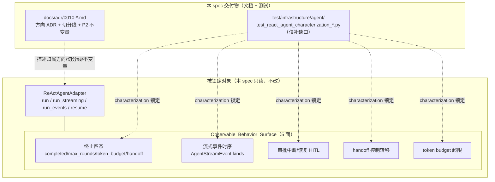

# 设计文档：P2 前置——Agent Loop 归属重划的方向 ADR + 特征化测试安全网

## 概述

本 spec 是 P2 搬迁（把 `src/infrastructure/agent/react_agent_adapter.py` 的 ReAct Agent Loop 上提到领域层）的**前置降风险轮**，本身**零业务逻辑搬迁**：只产出两样降风险资产——(1) 方向决策 **ADR-0010**（确立 Agent Loop 归属领域层的判断、划出「领域编排 vs 真技术封装」切分线、锁定 P2 不变量清单）；(2) **特征化测试安全网**——先据实清点 `test/infrastructure/agent/` 既有覆盖，只对 5 个对外可观测行为面的缺口补测，复用既有 fake/stub harness。设计严格遵循 `docs/steering/adr.md`（四段式、只增不改、不 supersede）、`docs/steering/change-discipline.md`（最小改动、只补缺口不重复造轮）、`docs/steering/code-documentation.md`（中文 docstring）、`docs/steering/python-typing-lint.md`（全量类型标注、禁裸 `Any`、`ruff`/`pyright` 零新增错误）、`docs/steering/doc-sync.md`（ADR 索引同步），并以既有 ADR-0009 与 `test/infrastructure/agent/` 现有测试组织为格式与 harness 基准。默认**零生产代码改动**。

#### 设计决策

| 决策点 | 选定方案 | 理由 |
| --- | --- | --- |
| ADR 编号与状态 | 新增 **ADR-0010**，`Accepted`，不 supersede ADR-0001 | 现有 ADR 至 0009；方向 / 归属决策属架构级，`adr.md` 要求先写 ADR；ADR-0001（移除领域事件总线）为既定前提，不回退（需求 1 AC1.7、AC1.1）。 |
| ADR 是否含逐行代码清单 | 只给**可操作判据** + 据实符号级候选清单，不逐行罗列 | `Orchestration_Infrastructure_Split_Line` 要求基于"是否封装外部技术/SDK、是否为可复用业务判定"的分类标准（AC1.3）。 |
| 特征化测试范围 | 先清点既有覆盖，**只补缺口**，充分处明确写"无需新增" | `change-discipline.md` 最小改动；需求 3 AC3.4「已充分锁定处 SHALL NOT 重复添加等价断言」。 |
| 测试 harness | 复用既有 `_v3_stream_helpers.install_stream_mock` / `FakeStreamModel` + 各文件内 `_FakeContextBuilder` / `StaticPolicy` / `MemoryApprovalStore` / `RecordingTool` | 既有测试已建立稳定的 fake `ModelAccessPort`（全程 stream）+ stub 工具 harness；复用可保证与既有断言语义一致、避免引入新替身分歧（需求 8）。 |
| 生产代码改动 | **零生产代码改动**（缺口均可经 `run`/`run_streaming`/`run_events`/`resume` 四入口观测） | 需求 2 AC2.4「优先经既有对外入口观测」；清点后确认无行为面需生产改动（见"可测试性改动登记"）。 |
| 特征化测试放置 | `test/infrastructure/agent/`，命名前缀 `test_react_agent_characterization_*` | 需求 8 AC8.1「对齐现有组织、命名清晰标识为特征化/回归基线」。 |
| characterization 纪律 | 照当前实际值写断言；发现可疑行为只登记、不修复 | 需求 4 AC4.7 / 需求 5 AC5.6 / 需求 8 AC8.4/AC8.5；本轮不修 v3 现状。 |

## 架构

本 spec 不改任何运行时组件、不改依赖方向、不动 `AgentPort` 契约。交付物为 1 篇 ADR 文档 + 若干新增测试文件；下图仅表达"降风险资产"与其锁定目标（`ReActAgentAdapter` 的 4 入口 + 5 行为面）之间的关系，不代表新增运行时依赖。

### 目录/交付物落点

| 新增/改动 | 内容 |
| --- | --- |
| `docs/adr/0010-relocate-agent-loop-to-domain-direction.md`（新增） | ADR-0010 全文（见组件 1）。 |
| `docs/adr/README.md`（改） | 索引表追加 ADR-0010 行（AC1.8）。 |
| `test/infrastructure/agent/test_react_agent_characterization_streaming_events_ordering.py`（新增，若清点为缺口） | 锁定 `run_events` 完整 kind 时序 + `run_streaming` 分片序列（见组件 3）。 |
| `test/infrastructure/agent/test_react_agent_characterization_hitl_resume_matrix.py`（新增，若清点为缺口） | 锁定 `resume` 的 edit 续跑到 `completed`、决策数量/顺序/allowed 不匹配异常、恢复后再次 approval_required（见组件 3）。 |
| `test/infrastructure/agent/test_react_agent_characterization_terminated_reason_orthogonality.py`（新增，若清点为缺口） | 锁定 `completed` 正例与 status/terminated_reason 正交（见组件 3）。 |

> 是否真的新增以上三个文件，取决于组件 2 清点结论——只有"未覆盖/部分覆盖"项才落文件；"已覆盖"项明确写"无需新增"，不落文件。

## 组件与接口

### 组件 1：ADR-0010 草案要点（`Direction_ADR`）

- **文件**：`docs/adr/0010-relocate-agent-loop-to-domain-direction.md`；标题「将 ReAct Agent Loop 编排逻辑归属领域层的方向决策（P2 前置）」；front-matter `status: Accepted`、`date: 2026-07-06`、`deciders: [后端架构维护者]`、`supersedes:` 留空、`superseded-by:` 留空；`docs/adr/README.md` 索引追加一行（AC1.1、AC1.8）。采用 `adr.md` 四段式（背景/决策/后果/备选），沿用 ADR-0009 的写作深度与回链风格。

#### 一、背景与问题（据实证据）

- `Domain_Logic_In_Infrastructure`：ReAct Agent Loop 位于 `src/infrastructure/agent/react_agent_adapter.py`（**3314 行**，据实），模块 docstring 第 7 行自称"本模块属于基础设施层"。
- **无 SDK 封装证据**：该文件顶部 import 仅有 `asyncio`/`json`/`logging`/`time`/`uuid`/`contextvars`/`dataclasses`/`typing`、`opentelemetry`（可观测性）、`domain.*`、`infrastructure.*`；**未 `import openai` / `agents` / `litellm`**。模型调用经 `domain.model_access.ports.ModelAccessPort`（Port）间接进行，本文件不直接绑定任何 LLM SDK——即它不是"外部技术封装适配器"，而是自研的"推理→行动→观察"编排算法。
- 三层 LOC 失衡（据整合报告）：domain ≈ 8.3k / application ≈ 9.9k / infrastructure ≈ 24.5k，Agent Loop 是 infrastructure 膨胀的主因（AC1.2）。

#### 二、决策（归属方向 + 切分线判据）

- **方向判断**：`ReAct_Agent_Adapter` 中承载"轮次循环控制 + 终止判定 + 控制流决策"的编排逻辑属**领域关注点**，应经 `P2_Relocation` 上提到领域层；仅封装外部技术/运行时的部分留在基础设施层（AC1.2）。
- **`Orchestration_Infrastructure_Split_Line` 可操作判据（AC1.3）**，逐条自问：
  1. **是否封装外部技术/SDK 或进程外资源？** 是 → 留基础设施（OTel、审批持久化 I/O、事件写入、序列化、workflow runtime）。
  2. **是否为可脱离运行时、可复用的纯业务判定（给定输入即可确定输出，不触 I/O）？** 是 → 属领域（终止判定、预算判定、handoff 检测、循环控制、结果翻译）。
  3. **是否表达 Agent Loop 的"何时停止/如何推进/产出何种形态"这一通用语言？** 是 → 属领域（`RoundOutcome` 五态、`_iter_rounds` 的产出契约）。
  4. **是否只是把技术观测/记账缝合进循环的胶水？** 是 → 留基础设施（guardrail 运行时累加、trace 记录、abuse 检测）。

##### `Domain_Orchestration_Candidates`（应上提，据实指名）

| 符号 / 位置 | 领域编排语义 |
| --- | --- |
| `_iter_rounds`（`react_agent_adapter.py:1867`，异步生成器）的**轮次循环控制** | `for round_num in range(start_round, effective_terminal + 1)` 的推进、`terminal_round` 边界、`RoundOutcome` 产出协议。 |
| `AgentTerminationReason` 四态判定 | `text`→`completed`（:2100）；循环耗尽 assert + `max_rounds` final（:2219-2252）；`token_budget_exceeded` 跨轮 pending 标记 + 下一轮入口终止（:1942-1964、:2186-2187）；`handoff` 短路（:1969-1990）。 |
| `_is_token_budget_exceeded` / `_compute_total_tokens`（:993-998、:979-991） | `Token_Budget_Computation_Rule` 纯判定：优先 `total_tokens`，缺失回退 `prompt+completion`。 |
| `_detect_handoff`（:1837） | 尾部反向扫描最近一组 `ToolMessage` 命中 `metadata["handoff_target"]` 的纯判定。 |
| `_collect_pending_actions`（:847） | tool_calls 是否命中审批策略而应中断的**审批中断决策**（读 `ApprovalPolicyPort` 后的纯筛选）。 |
| `_outcome_to_agent_result`（:2254，`@staticmethod`） | `RoundOutcome → AgentResult` 的纯翻译（按 kind 分支）。 |
| `_apply_approval_decisions` 中的**校验部分**（:2588-2603） | 决策数量/顺序/allowed 前置校验（纯判定；I/O 执行部分留基础设施）。 |
| `RoundOutcome` / `RoundOutcomeKind`（`round_outcome.py`） | `text/tool_calls/approval/final/handoff` 五态所表达的轮次终止形态本身。 |

##### `Infrastructure_Encapsulation_Candidates`（留基础设施，据实指名）

| 符号 / 位置 | 技术关注点 |
| --- | --- |
| `_GuardrailRuntimeAccumulator`（:165）+ `_CURRENT_GUARDRAIL_RUNTIME`（:351） | guardrail 运行时累加器（有状态、ContextVar 绑定）。 |
| `ToolAbuseDetector`（`tool_abuse_detector.py`）+ `_CURRENT_TOOL_ABUSE_DETECTOR`（:357） | 工具滥用运行时检测。 |
| OTel `tracer`（:98）+ `_record_trace`/`_record_error_trace`/`_record_tool_call_trace`/`_build_*_trace`（:571-735） | trace 记录（外部可观测性技术）。 |
| `ApprovalStateStorePort` 的 `save`/`load`/`consume` 调用（`_save_interrupt`:875、`resume` 前置 I/O） | 审批状态持久化 I/O。 |
| `approval_serialization`（`approval_payload_to_metadata`）/ `guardrail_serialization`（`guardrail_runtime_stats_to_dict`） | 序列化（ADR-0008 已定归属基础设施）。 |
| `approval_logging`（`approval_log_extra`） | 审批日志装配。 |
| `_RoundStreamAccumulator`（`round_stream_accumulator.py`） | 流式分片累加器（SDK 分片重组技术）。 |
| `handoff_context`（`set_parent_context`/`reset_parent_context`） | handoff 上下文栈（ContextVar 传参技术）。 |
| `workflow_capability_runtime`（`enforce_workflow_capability_before_action`） | workflow 能力运行时（依赖 `RunEventStorePort`）。 |
| `merge_usage`（`infrastructure.chat.usage`） | usage 合并工具。 |

#### 三、后果（Consequences）

- **正面**：P2 搬迁"哪些上提、哪些留下"有据可依，无需临场判断；本轮通过特征化测试固化 5 个行为面，为 P2 提供"行为等价"回归判据；本轮零行为风险（不动生产代码）。
- **负面/代价**：切分线是**方向性**判据而非逐行方案，P2 落地时仍需处理领域编排与技术记账高度交织（如 `_execute_tool_call` 同时含控制流与 guardrail/trace/checkpoint 副作用）的解耦细节，可能需引入领域服务 + 端口回调等结构；这些细节留待 P2 spec。
- **后续影响**：`P2_Invariants` 成为 P2 spec 的硬约束；本 ADR 不改变任何现有代码，`Existing_Test_Suite_Green` 与 `Contract_Invariance` 在本轮天然成立。

##### `P2_Invariants` 清单（AC1.6，P2 落地不可破坏）

1. `AgentPort` 四方法签名不变——`run(context, config, model_access) -> AgentResult`、`run_streaming(...) -> AsyncIterator[StreamingChunk]`、`run_events(...) -> AsyncIterator[AgentStreamEvent]`、`resume(context, config, model_access, interrupt, decisions) -> AgentResult`（据 `ports.py:68-144`）。
2. `Contract_Invariance`：`AgentResult`/`AgentStreamEvent`/`StreamingChunk` 字段与时序、`AgentTerminationReason` 取值、审批中断/恢复协议、流式协议对外字面等价。
3. `V3_Decisions_Frozen`：全程 stream、工具 `timeout`（`AgentConfig.tool_timeout_seconds`）、`max_total_tokens` 预算终止、循环耗尽 assert、`tool_arguments_delta` 决策不动。
4. `Existing_Test_Suite_Green`：`PYTHONPATH=src uv run --frozen pytest` 前后全绿。
5. 不回退 ADR-0001（不引入领域事件/事件总线承载循环逻辑）。
6. 因文件移动导致的 import 路径调整**只改 import、不改断言语义**。

#### 四、备选方案（含未采纳原因，AC1.1）

- **方案 A：就地把 docstring 改为"领域层"、不搬迁** —— 未采纳：文件物理仍在 `infrastructure/`，依赖方向与分层归属未真正纠正，只是文字自欺，且改 docstring 也属对生产代码的改动、违背本轮零改动倾向。
- **方案 B：引入领域事件/事件总线承载循环推进** —— 未采纳：直接违反 ADR-0001（已 `Accepted` 移除领域事件总线），本 ADR SHALL NOT 把领域事件列为 P2 推荐形态（AC1.7）。
- **方案 C：本轮一次性大爆炸搬迁 3314 行** —— 未采纳：牵动 `AgentPort`、DI 装配、大量测试 import，紧邻 v3 行为决策，风险极高；本 spec 定位为前置降风险轮，搬迁留待独立 P2 spec（需求 2）。
- **方案 D：不写 ADR、P2 时临场判断切分** —— 未采纳：切分判据是高价值、易漂移的方向决策，`adr.md` 判定口诀「三个月后新 agent 会问『为什么这么切』」即应写 ADR。
- **方案 E：把整个适配器（含 guardrail/trace/abuse/序列化）整体上提** —— 未采纳：违反分层，技术关注点（外部可观测性、持久化 I/O、序列化，ADR-0008）应留基础设施。

### 组件 2：既有测试覆盖清点表（`Existing_Test_Coverage_Gap`，需求 3）

对 `test/infrastructure/agent/` 逐文件据实清点，5 个行为面结论如下（"已覆盖"= 既有测试已用明确断言锁定当前实际值；"部分覆盖"= 部分子情形已锁定但存在缺口；"未覆盖"= 无既有断言）：

| 行为面 | 结论 | 既有测试文件 · 关键断言（据实） | 缺口（若有） |
| --- | --- | --- | --- |
| **(a) 终止四态 — `max_rounds`** | 已覆盖 | `test_react_agent_max_rounds_terminated_reason_unit.py`：`test_run_max_rounds_hit_terminated_reason` 断言 `terminated_reason=="max_rounds"` + `content==""` + `status=="completed"` + `stream_call_count==2`；`(g) test_resume_max_rounds_hit_terminated_reason`；`test_react_agent_adapter_unit.py:304 test_returns_last_round_response_at_max_rounds`（:352 断言 `terminated_reason=="max_rounds"`）；`test_react_agent_terminal_assert_unit.py`（耗尽 assert）。 | 无。 |
| **(a) 终止四态 — `token_budget_exceeded`** | 已覆盖 | `test_react_agent_token_budget_unit.py`：`(a) run`、`(b) run_streaming`、`(c) run_events`、`(g) 与 max_rounds 共存预算优先`、`(h) Token_Budget_Computation_Rule 回退`、`(i) _outcome_to_agent_result 透传` 均断言 `terminated_reason=="token_budget_exceeded"`。 | 无。 |
| **(a) 终止四态 — `completed`（自然收尾）** | 部分覆盖 | `test_react_agent_adapter_unit.py:84 test_returns_correct_agent_result` 断言 `content`/`model`/`usage`（未显式断言 `terminated_reason=="completed"`）；`test_react_agent_max_rounds_..._unit.py:(e) test_run_text_kind_terminated_reason_completed` 断言 text 分支 `terminated_reason=="completed"`。 | `completed` 与 `status` 的**正交关系**在 `token_budget` 文件 `(e)` 与 `max_rounds` 文件 `(f)` 已就 approval 分支断言 `terminated_reason=="completed"`——已覆盖；缺口仅在于**纯文本自然收尾**未有一处显式同时断言 `status=="completed" and terminated_reason=="completed"` 的独立 characterization（现有 :84 未断言 terminated_reason）。补测（需求 4 AC4.2、AC4.6）。 |
| **(a) 终止形态 — `handoff`（RoundOutcome 层）** | 已覆盖 | `test_react_agent_handoff_unit.py`：`test_run_terminates_via_handoff_and_returns_target_content`（`content=="目标 Agent 回复"`、`terminated_reason=="completed"`、`stream_call_count==1`）。 | 无（RoundOutcome handoff 终止形态经 `run` 已锁定）。 |
| **(b) 流式事件时序 — `run_events` 完整 kind 序列** | 部分覆盖 | `test_react_agent_events_unit.py:test_react_agent_run_events_emits_tool_and_assistant_events` 断言 `[status, tool_start, tool_result, status, assistant_delta, assistant_done]`；`test_run_events_all_kinds_within_allowed_set`（kind ⊆ 允许集，非精确序列）；`test_react_agent_tool_arguments_delta_unit.py`（delta 载荷 + 中间轮不发 delta）。 | 已覆盖单工具单中间轮的精确序列。缺口：**`tool_error` kind**（工具失败）在时序中的位置未在"完整序列断言"中锁定（`test_react_agent_run_events_tool_failure_unit.py` 已锁定 tool_error 出现，但需确认其为精确序列；见下）。经复核 `test_react_agent_run_events_tool_failure_unit.py` 已锁定 tool_error 场景——判为已覆盖，**无需新增**（AC3.4）。 |
| **(b) 流式分片时序 — `run_streaming`** | 已覆盖 | `test_react_agent_streaming_unit.py`：`test_intermediate_round_emits_at_least_one_heartbeat`、`test_each_tool_emits_start_and_end_progress_chunks`（4 分片、按 tool_call_id 分组 `[start,end]`）、`test_final_chunk_remains_finished_true`（max_rounds 命中）、`test_heartbeat_metadata_contains_round_number`（轮次号 1/2）。 | 无。 |
| **(b) 流式 — `tool_arguments_delta` 决策 7 约束** | 已覆盖 | `test_react_agent_tool_arguments_delta_unit.py`：拼接=完整 JSON、末尾 `assistant_done`、`content==""` & `usage is None`、首片带 id/name 后续 None、`(f)` 中间轮不产出 delta。 | 无。 |
| **(b) 流式 — `max_rounds`/`token_budget` 分支跳过最终轮 stream + metadata 携带 terminated_reason** | 已覆盖 | `max_rounds` 文件 `(c)(d)`、`token_budget` 文件 `(b)(c)` 断言 `finished.metadata["terminated_reason"]` 及 `stream_call_count==1`。 | 无。 |
| **(c) 审批中断 — `run` 返回 approval_required + payload** | 已覆盖 | `test_react_agent_hitl_unit.py:test_hitl_interrupt_saves_state_and_does_not_execute_tool`（`status=="approval_required"`、`approval.actions[0].tool_call_id`、工具未执行）；`test_react_agent_events_unit.py:test_react_agent_run_events_emits_approval_required_shape`（payload metadata 结构、`session_id`/`approval_id`/`action_count`/`action_summaries`）。 | 无。 |
| **(c) 审批恢复 — `resume` approve/edit/reject 续跑** | 部分覆盖 | `test_react_agent_hitl_unit.py`：`test_hitl_resume_approve_executes_tool_and_continues`（approve → `status=="completed"`、`content=="done"`、`usage`、工具被执行）；`test_hitl_resume_reject_adds_tool_message_without_execution`（reject → ToolMessage 内容、工具未执行）。 | **`edit` 决策续跑**无独立入口级 characterization（`_apply_approval_decisions` 的 edit 分支 :2617-2651 仅由 `test_react_agent_adapter_property.py`/checkpoint 测试间接触及，未有 `resume(...) + ApprovalDecision("edit",...)` 端到端断言）。补测（需求 6 AC6.2）。 |
| **(c) 审批恢复 — 决策数量/顺序/allowed 不匹配异常** | 部分覆盖 | `test_react_agent_hitl_unit.py:test_hitl_respond_decision_is_rejected_after_branch_removal` 锁定 `ApprovalDecisionNotAllowedError`（code 60025）。 | **数量不匹配**（`ApprovalDecisionCountMismatchError`）与**顺序不匹配**（`ApprovalDecisionOrderMismatchError`）经 `resume` 入口无端到端 characterization（逻辑在 :2588-2597）。补测（需求 6 AC6.3）。 |
| **(c) 审批恢复 — 恢复后再次命中审批** | 部分覆盖 | `test_react_agent_guardrail_runtime.py:test_resume_approve_returns_new_guardrail_approval_instead_of_raising` 锁定 **guardrail 触发的** resume 再次 `status=="approval_required"`（新 approval_id）。 | **策略型（`ApprovalPolicy.interrupt`）** 恢复后下一轮再次命中审批的 resume 再中断，无独立 characterization。补测（需求 6 AC6.4）。 |
| **(d) handoff 控制转移 — run/run_streaming/run_events** | 已覆盖 | `test_react_agent_handoff_unit.py`：`run`（content/terminated_reason/stream=1、ToolMessage 带 handoff_target 不带 error）、`run_streaming`（finished chunk `delta_content` + `metadata["handoff_target"]`）、`run_events`（assistant_delta + assistant_done + handoff_target）；`test_handoff_does_not_set_error_metadata`。 | `resume` 入口的 handoff 终止**当前实际不支持独立锁定**——`resume` 经 `_iter_rounds` 与 `run` 共享短路逻辑，但无既有 resume+handoff 测试。需求 7 AC7.2 只要求锁定"**当前实际支持** handoff 终止的入口"，run/streaming/events 已覆盖；resume 路径是否触发 handoff 短路取决于恢复后是否再产生 HandoffPerformed——判为**边界、当前无既有支持断言**，登记为待观测（见"疑点登记"），本轮不强行补 resume+handoff（避免断言"理想行为"，AC7.5）。 |
| **(e) token budget 超限 — "先执行工具回写、下一轮入口终止"时序** | 已覆盖 | `test_react_agent_token_budget_unit.py:(a)` 断言 `stream_call_count==1`（无第 2 轮）+ 工具被执行；`_iter_rounds` :2184-2196 的 `budget_exceeded_pending_after_tools` 语义经该断言锁定。 | 无。 |
| **(e) token budget — 与 max_rounds 先命中者优先 + 告警互斥** | 已覆盖 | `test_react_agent_token_budget_unit.py:(g) test_budget_takes_priority_over_max_rounds`（`has_budget and not has_max_rounds`）。 | 无。 |

**清点小结**：5 个行为面绝大多数已被既有测试充分锁定。**真正的缺口仅三处**：
- **G1**：纯文本自然收尾的 `completed` 正交 characterization（现有 :84 未断言 `terminated_reason`）。
- **G2**：`resume` 的 `edit` 续跑端到端 characterization。
- **G3**：`resume` 的决策**数量不匹配 / 顺序不匹配**异常端到端 characterization，及**策略型**恢复后再次 approval_required。

其余行为面明确**无需新增**（遵循 AC3.4 不重复造轮）。需求 3 AC3.3 遵守：不删除、不弱化任何既有测试断言。

### 组件 3：特征化测试缺口补测方案（需求 4/5/6/7/8）

仅针对 G1/G2/G3 补测；每项均 characterization（照当前实际值写断言），复用既有 harness，全量类型标注 + 中文 docstring（AC8.3）。

#### 3.1 缺口 G1 — `completed` 自然收尾正交（需求 4 AC4.2、AC4.6）

- **文件**：`test/infrastructure/agent/test_react_agent_characterization_terminated_reason_orthogonality.py`
- **锁定行为面**：(a) 终止四态之 `completed`。
- **harness**：复用 `_v3_stream_helpers.install_stream_mock` + 文件内 `_FakeContextBuilder`（原样透传、空 usage），`ReActAgentAdapter(tool_registry=MagicMock, context_builder=_FakeContextBuilder())`，`AgentConfig(max_rounds=3, prompt_id="chat-default@v1")`。
- **关键断言**（照当前实际值）：
  - `test_run_plain_text_completed_orthogonal`：单轮纯文本 `LLMResponse(content="ok", tool_calls=[])` → `result.status == "completed"` **且** `result.terminated_reason == "completed"` 且 `result.content == "ok"`（锁定 status 与 terminated_reason 正交、二者同为 completed）。
  - `test_run_tool_loop_natural_completion`：`[tool_calls, text]` 两轮正常收尾 → `terminated_reason == "completed"`、`content == "done"`（锁定工具循环正常收尾亦为 completed，`_iter_rounds` :2099-2106 text 分支）。

#### 3.2 缺口 G2 — `resume` edit 续跑（需求 6 AC6.2）

- **文件**：`test/infrastructure/agent/test_react_agent_characterization_hitl_resume_matrix.py`
- **锁定行为面**：(c) 审批恢复语义（edit 分支）。
- **harness**：复用 `test_react_agent_hitl_unit.py` 的 `FakeContextBuilder`/`StaticPolicy`/`MemoryApprovalStore`/`RecordingTool`/`FakeModel` 同构 harness（可直接 import 或等价重建），`ApprovalPolicy("write_file", interrupt=True, allowed_decisions=frozenset({"approve","edit","reject"}))`。
- **关键断言**（照 `_apply_approval_decisions` edit 分支 :2617-2651 实际行为）：
  - `test_resume_edit_executes_with_edited_arguments`：构造 `ApprovalInterrupt`（round_num=1，actions 含 `write_file`），`resume(..., (ApprovalDecision("edit","call-1", edited_action=EditedAction("write_file", '{"path":"edited.txt"}')),))` → `RecordingTool.requests == [{"path": "edited.txt"}]`（编辑后参数被采纳）、`result.status == "completed"`、`result.content == "done"`。工具须经 `ToolRegistry.get(...).cast_params/validate_params` 通过（`RecordingTool` 参数 schema 已允许）。

#### 3.3 缺口 G3 — `resume` 决策不匹配异常 + 策略型再次审批（需求 6 AC6.3、AC6.4）

- **文件**：同 `test_react_agent_characterization_hitl_resume_matrix.py`
- **锁定行为面**：(c) 审批恢复语义（异常类型、再次中断）。
- **harness**：同 3.2。异常从 `domain.agent.exceptions` import。
- **关键断言**（照 `_apply_approval_decisions` :2588-2603 实际抛出类型）：
  - `test_resume_decision_count_mismatch_raises`：`interrupt.actions` 有 1 项、`resume(..., ())` 空决策 → `pytest.raises(ApprovalDecisionCountMismatchError)`，断言其 `code == 60023`（据 ADR-0009 错误码登记）与构造参数 `(expected=1, actual=0)` 语义。
  - `test_resume_decision_order_mismatch_raises`：决策 `tool_call_id` 与 action 不对齐 → `pytest.raises(ApprovalDecisionOrderMismatchError)`（`code == 60024`）。
  - `test_resume_policy_reapproval_returns_approval_required`：恢复后下一轮模型再次返回命中 `ApprovalPolicy.interrupt=True` 的 tool_calls → `result.status == "approval_required"`、`result.approval is not None`、新 `approval_id != 原 approval_id`（锁定策略型 resume 再中断，区别于既有 guardrail 型）。
- **说明**：`ApprovalDecisionNotAllowedError`（60025）已被 `test_hitl_respond_decision_is_rejected_after_branch_removal` 锁定，**不重复添加**（AC3.4）。

#### 3.4 流式事件时序（需求 5）——复核结论：无需新增

- 需求 5 各 AC 的行为已由 `test_react_agent_events_unit.py`（精确 kind 序列、approval_required 载荷、kind 允许集）、`test_react_agent_tool_arguments_delta_unit.py`（AC5.3/AC5.4：中间轮不发 delta、delta 载荷形态）、`max_rounds`/`token_budget` 文件（AC5.5：终止分支跳过最终轮 stream + metadata 带 terminated_reason）、`test_react_agent_run_events_tool_failure_unit.py`（tool_error 时序）充分锁定。故 **需求 5 无需新增特征化测试**（AC3.4、AC8.5）；本 design 显式记录该结论以示据实清点而非遗漏。

#### 3.5 handoff 与 token budget（需求 7）——复核结论：无需新增

- 需求 7 AC7.1（handoff 立即终止、目标回复成 content）、AC7.2（run/streaming/events 入口产出形态）由 `test_react_agent_handoff_unit.py` 全覆盖；AC7.3（先执行工具回写、下一轮入口终止 token_budget）与 AC7.4（先命中者优先、告警互斥）由 `test_react_agent_token_budget_unit.py:(a)(g)` 覆盖。故 **需求 7 无需新增**；`resume` 入口 handoff 终止列为疑点登记（见下），本轮不补（AC7.5 只锁当前实际支持的入口）。

## 数据模型

本 spec **不新增、不改动任何数据模型 / 值对象 / 持久化 schema / 线格式 / DDL / 配置键**。新增内容仅为 1 篇 Markdown ADR 与若干测试文件；测试所用的 `AgentConfig`/`AgentResult`/`AgentStreamEvent`/`StreamingChunk`/`ApprovalInterrupt`/`ApprovalDecision`/`EditedAction`/`PendingActionRequest` 均直接复用 `domain/agent/value_objects.py` 现有定义，测试替身（fake `ModelAccessPort`、stub 工具）复用既有 harness，不引入新数据类型。

## 事务与并发边界

本 spec **不执行任何写操作**：不写数据库、不写 Redis/文件、不投递消息、不改任何事务边界或并发语义。特征化测试通过 fake `ModelAccessPort`（内存 `stream` 队列）+ `MemoryApprovalStore`（内存 dict）+ stub 工具驱动，全程在单测进程内、无跨进程/跨数据源交互；被测的 `resume` 原子消费（`ApprovalStateStorePort.consume`）路径在 `MemoryApprovalStore` 中为纯内存操作，本轮只读锁定其对外行为、不改其时序。故本 spec 无事务/并发边界需声明（符合"无写操作则可省略"的条件，但此处显式声明以消歧义）。

## 正确性属性

### Property 1（5 个行为面在本 spec 后均有测试锁定）
经组件 2 据实清点 + 组件 3 补测后，(a) 终止四态、(b) 流式事件时序、(c) 审批中断/恢复、(d) handoff、(e) token budget 五面均有明确断言锁定当前实际行为（含新补 G1/G2/G3）。
验证需求：需求 3 AC3.1/AC3.2、需求 4、需求 5、需求 6、需求 7、需求 8 AC8.1。
验证命令：`PYTHONPATH=src uv run --frozen pytest test/infrastructure/agent/ -q`（含既有 + 新增特征化测试全绿）。

### Property 2（既有测试零删改）
本 spec 不删除、不弱化、不修改任何既有测试的断言语义；G1/G2/G3 均为**新增**文件，既有文件不动。
验证需求：需求 3 AC3.3、需求 8 AC8.2。
验证命令：`git diff --stat origin/master -- test/infrastructure/agent/`（期望既有文件零改动行、仅出现新增 `test_react_agent_characterization_*.py`）；`git diff -- test/infrastructure/agent/test_react_agent_*_unit.py`（期望空）。

### Property 3（全量绿）
本 spec 落地前后 `PYTHONPATH=src uv run --frozen pytest`（在 `epsilon-boot/` 下）均全部通过；新增特征化测试全绿。
验证需求：需求 8 AC8.2；`Existing_Test_Suite_Green`。
验证命令：`cd epsilon-boot && PYTHONPATH=src uv run --frozen pytest`。

### Property 4（零生产代码改动）
`src/` 下无任何改动；缺口均经 `AgentPort` 四入口观测。
验证需求：需求 2 AC2.1/AC2.2/AC2.4/AC2.5/AC2.6。
验证命令：`git diff --stat origin/master -- src/`（期望空）；`git status --porcelain src/`（期望无输出）。

### Property 5（characterization 纪律：仅锁定当前行为、不触碰 v3 决策）
新增测试仅断言 `ReActAgentAdapter` 当前实际对外可观测值，不断言"理想应有"行为，不触及 `V3_Decisions_Frozen` 的"改后"形态；疑点只登记不修复。
验证需求：需求 4 AC4.7、需求 5 AC5.6、需求 6 AC6.6、需求 7 AC7.5、需求 8 AC8.4/AC8.5/AC8.6。
验证命令：人工复核 + `PYTHONPATH=src uv run --frozen pytest test/infrastructure/agent/test_react_agent_characterization_*.py -q`（新测试独立全绿，证明断言与现状一致）。

### Property 6（ADR-0010 合规且不回退 ADR-0001）
ADR-0010 为四段式、`Accepted`、不 supersede ADR-0001、不推荐领域事件、含切分线判据 + 两类候选清单 + P2 不变量，且已登记索引。
验证需求：需求 1 AC1.1–AC1.8。
验证命令：`grep -n "0010" docs/adr/README.md`（期望命中新行）；人工核对 ADR 四段式与 front-matter `supersedes:` 为空、正文无"领域事件承载循环"推荐。

### Property 7（lint/类型/文档基线）
新增测试全量类型标注、禁裸 `Any`、中文 docstring 说明所锁定行为面，`ruff`/`pyright` 零新增错误。
验证需求：需求 8 AC8.3。
验证命令：`cd epsilon-boot && uv run ruff check test/infrastructure/agent/test_react_agent_characterization_*.py && uv run pyright test/infrastructure/agent/test_react_agent_characterization_*.py`。

## 错误处理

本 spec 不新增生产错误处理路径，**复用仓库既有错误模型**：特征化测试断言的异常均为 `domain/agent/exceptions.py` 现有领域异常，直接 import、按现状锁定，不新建、不改错误码、不改错误返回风格。

| 场景 | 复用的既有异常 / 行为（据实） | 特征化测试断言方式 |
| --- | --- | --- |
| resume 决策数量不匹配 | `ApprovalDecisionCountMismatchError`（code 60023） | `pytest.raises(...)` + `.code == 60023` |
| resume 决策顺序不匹配 | `ApprovalDecisionOrderMismatchError`（code 60024） | `pytest.raises(...)` + `.code == 60024` |
| resume 决策类型不允许 | `ApprovalDecisionNotAllowedError`（code 60025） | **已由既有测试锁定，不重复** |
| resume edit 参数非法 | `ApprovalEditInvalidArgumentsError` / `ApprovalEditToolNameMismatchError` | 本轮 edit 用例走**合法**路径（AC6.2 锁定成功续跑）；非法分支不在本轮缺口内，不新增 |

原则：测试只观测异常、不吞不改；异常类型/参数/触发时机以当前生产代码为准（characterization），若与直觉不符只登记不修复。

## 测试策略

采用「据实清点既有覆盖 → 只补缺口 → 全量回归」策略，统一用项目既有 `pytest`（`PYTHONPATH=src uv run --frozen pytest`，在 `epsilon-boot/` 下），新测试置于 `test/infrastructure/agent/`（AC8.1），复用既有 fake `ModelAccessPort`（全程 stream）+ stub 工具 harness。

1. **特征化测试（新增，仅缺口 G1/G2/G3）**——example-based、characterization：
   - `test_react_agent_characterization_terminated_reason_orthogonality.py`（G1，追溯 需求 4，Property 1/5）。
   - `test_react_agent_characterization_hitl_resume_matrix.py`（G2+G3，追溯 需求 6，Property 1/5）。
2. **既有测试作回归基线**——`max_rounds` / `token_budget` / `events` / `hitl` / `handoff` / `streaming` / `tool_arguments_delta` / `terminal_assert` 等文件不改、全绿（追溯 Property 2/3）。本项目无 property-based 框架强制要求；既有 `*_property.py` 测试沿用不动。
3. **纪律与门禁**——`git diff src/` 空（Property 4）；`ruff`/`pyright` 零新增错误（Property 7）；ADR 索引 grep（Property 6）。
4. **全量门禁**——`PYTHONPATH=src uv run --frozen pytest`（Property 3）。

## 疑点登记（characterization 暴露的待后续 spec 决策项）

按需求 5 AC5.6 / 需求 8 AC8.5，本轮只登记、不修复：

1. **`resume` 入口的 handoff 终止未被独立测试锁定**：`resume` 经 `_iter_rounds` 与 `run` 共享 handoff 短路逻辑（`_detect_handoff` :1837），理论可触发，但无既有测试；是否/如何在恢复路径触发 HandoffPerformed 属边界。P2 搬迁循环控制时需留意此路径，本轮不补 resume+handoff 测试以免断言未验证的"理想行为"（需求 7 AC7.2 只要求锁定当前实际支持的入口）。
2. **`AgentResult.model` 在 handoff 分支取 `outcome.response.model`（上一轮父模型），而 `HandoffResult.model` 为目标 Agent 模型**（`_outcome_to_agent_result` :2280-2285 用 `outcome.response.model`，未采纳 `HandoffPerformed.model`）：这是当前实际行为，特征化不改；若 P2 认为应透传目标模型，另开 spec 决策。

## AC → 交付物追溯表

| AC | 交付物 / 设计位置 | 验证 |
| --- | --- | --- |
| 1.1–1.5 | 组件 1 ADR-0010（四段式、方向判断、切分线判据、两类候选清单） | Property 6 |
| 1.6 | 组件 1 §二 `P2_Invariants` 清单 | Property 6 |
| 1.7 | 组件 1 §四 方案 B 未采纳 + 正文不推荐领域事件、不 supersede ADR-0001 | Property 6 |
| 1.8 | `docs/adr/README.md` 追加 0010 行 | Property 6 |
| 2.1–2.6 | 零生产代码改动、不搬迁、不改契约/前端/依赖 | Property 4 |
| 3.1–3.2 | 组件 2 清点表（5 面 × 已覆盖/部分/未覆盖 + 缺口说明） | 组件 2 |
| 3.3 | 既有测试零删改 | Property 2 |
| 3.4 | 已覆盖处明确"无需新增"（组件 3.4/3.5、清点表） | Property 2；组件 2/3 |
| 4.1–4.6 | 终止四态：`max_rounds`/`token_budget`/`handoff` 已覆盖，`completed` 由 G1 补测 | 组件 2/3.1；Property 1 |
| 4.7 | characterization 纪律 | Property 5 |
| 5.1–5.5 | 流式时序：既有测试已充分覆盖（组件 3.4） | 组件 2；Property 1 |
| 5.6 | 疑点登记，不修复 | Property 5；疑点登记 |
| 6.1 | 审批中断 approval_required + payload 已覆盖 | 组件 2 |
| 6.2 | `resume` edit 续跑由 G2 补测 | 组件 3.2；Property 1 |
| 6.3 | 数量/顺序不匹配异常由 G3 补测；allowed 已覆盖不重复 | 组件 3.3；错误处理 |
| 6.4 | 策略型恢复后再次 approval_required 由 G3 补测 | 组件 3.3 |
| 6.5–6.6 | 经 run/resume 既有入口观测、不改持久化/序列化；characterization | Property 4/5 |
| 7.1–7.4 | handoff（run/streaming/events）与 token budget 时序 + 优先级已覆盖 | 组件 2/3.5；Property 1 |
| 7.5 | 不改 `_detect_handoff`/`_is_token_budget_exceeded`/`handoff_context`；resume+handoff 登记 | Property 4/5；疑点登记 |
| 8.1 | 测试置于 `test/infrastructure/agent/`、命名 `characterization_*` | 测试策略 |
| 8.2 | 全量绿、前后成立 | Property 3 |
| 8.3 | 中文 docstring + 全量类型标注 + ruff/pyright | Property 7 |
| 8.4–8.6 | 仅锁当前行为、疑点只登记、不触 v3 改后行为 | Property 5；疑点登记 |

## 可测试性改动登记

**零生产代码改动。** 经组件 2 据实清点，三处缺口（G1/G2/G3）均可经 `AgentPort` 既有对外入口（`run` / `resume`）以 fake `ModelAccessPort` + stub 工具直接观测并断言，无任何行为面需要"抽纯函数 / 暴露只读探针"等生产侧改动（需求 2 AC2.4 例外条款未被触发）。故本 spec `src/` 目录 `git diff` 应为空（Property 4）。

## Clarification Loop（自评估）

对上述草案做了 trade-off / 安全 / 开放问题自评估。本 spec 为"文档 + 特征化测试、零生产改动"，**无安全/隐私风险、无写路径/事务变更**（审批脱敏语义、`allowed_decisions` 校验均只读锁定、未放宽）。以下为需你确认的低风险取舍，均已给出推荐并写入 design：

1. **缺口判定的松紧度**：我据实清点后认定"真缺口仅 G1/G2/G3"，需求 5（流式时序）与需求 7（handoff/token budget）判为**已充分覆盖、无需新增**（依 AC3.4 不重复造轮）。备选是"即便已覆盖也为每条 AC 各写一遍独立 characterization 以求整齐"。推荐现方案（只补真缺口，避免与既有断言重复、符合 change-discipline）。是否认可这一"只补 G1/G2/G3"的范围？

2. **`resume` + handoff 是否补测**：`resume` 经 `_iter_rounds` 共享 handoff 短路，理论可达但无既有支持断言。我推荐**不补**、仅登记为疑点（AC7.2 只要求锁定"当前实际支持"的入口，强补 resume+handoff 有断言未验证行为之嫌）。备选是构造 resume 后再触发 HandoffPerformed 的用例并照实断言。是否认可"不补、仅登记"？

3. **新增测试文件的合并粒度**：G2 与 G3 合并进一个 `test_react_agent_characterization_hitl_resume_matrix.py`（同 HITL resume 主题），G1 单独成 `..._terminated_reason_orthogonality.py`。备选是每个缺口一个文件（更细）或全部并一个文件（更粗）。推荐现两文件方案（按主题聚合、对齐既有按行为面组织的习惯）。是否认可文件划分与命名？

若以上均认可，我将视设计为最终版；如需调整请按编号答复，我会就地更新 `design.md` 并复评。
