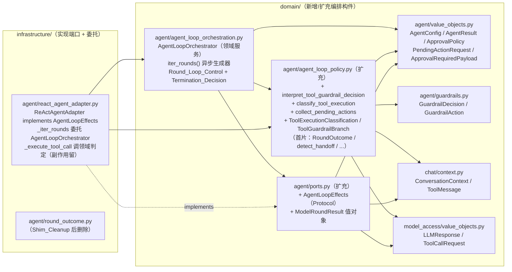
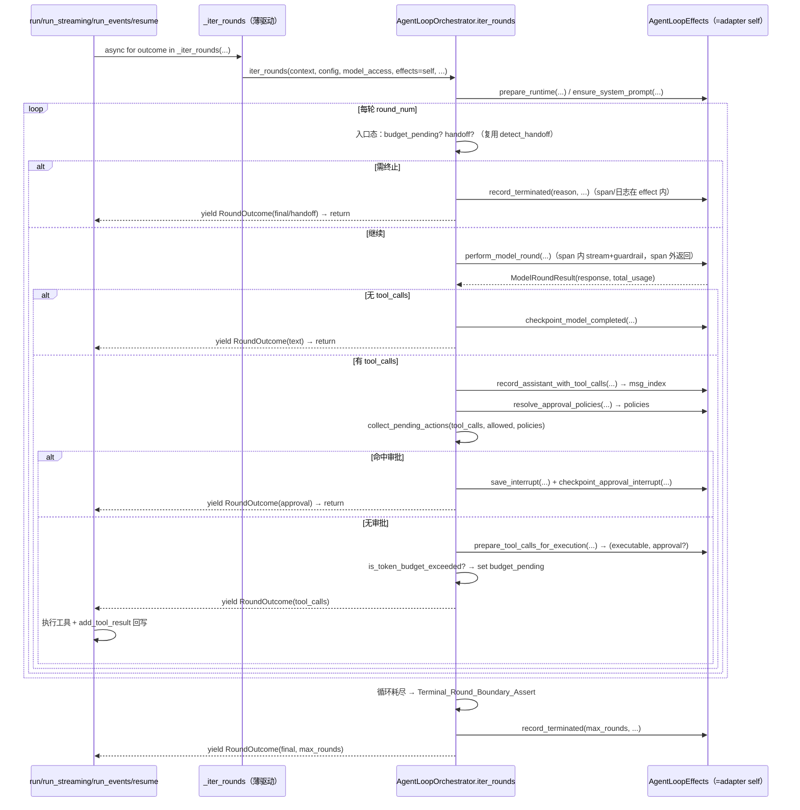

# 设计文档：P2 落地第二片——Agent Loop 循环编排主体上提与工具执行控制流解耦

## 概述

本设计落地 ADR-0010 `P2_Relocation` **第二片**，承接首片（ADR-0011）建立的 `domain/agent/agent_loop_policy.py` 领域模块、`round_outcome.py` 垫片与委托范式。全程为 **行为等价纯重构**（`Behavior_Equivalent_Refactor`）。

第二片的核心是 ADR-0010 后果节预告的解耦形态——**领域服务 + 端口回调**（`Port_Callback_Decoupling`）：

- 新增领域服务 `AgentLoopOrchestrator`（`src/domain/agent/agent_loop_orchestration.py`）承载 `Round_Loop_Control`（轮次循环推进骨架）+ `Termination_Decision`（终止判定状态机），以异步生成器形态产出 `RoundOutcome`，保持源 `_iter_rounds` 的协作式生成器协议。
- 新增领域端口 `AgentLoopEffects`（`Protocol`，落于 `src/domain/agent/ports.py`）承载 `Round_Loop_Control` 编排所需的全部运行时 I/O / 副作用回调；方法签名只引用领域类型。
- 以首片同款「叶子委托」范式，把 `_execute_tool_call` / `_prepare_tool_calls_for_execution` / `_collect_pending_actions` 中的纯控制流判定上提为 `agent_loop_policy.py` 的模块级纯函数 + 值对象：`interpret_tool_guardrail_decision`（`Tool_Guardrail_Branch_Interpretation`）、`classify_tool_execution`（`Tool_Exception_Classification`）、`collect_pending_actions`（`Pending_Action_Collection`）。
- `ReActAgentAdapter` 改为 **实现 `AgentLoopEffects` + 委托 `AgentLoopOrchestrator`**：`_iter_rounds` 降为「构造 orchestrator、以 self 作 effects、透传生成器」的薄驱动；`_execute_tool_call` 等调用点直调领域判定。副作用实现（OTel/checkpoint/guardrail 累加/abuse/持久化/流式/日志）**留基础设施**。
- 首片 `round_outcome.py` re-export 垫片在 `_iter_rounds` 主体上提、确认无外部依赖后 `Shim_Cleanup`。

设计严格遵循 ADR-0010（最高约束源，六条 `P2_Invariants` + 两条疑点）、ADR-0011（首片委托范式，不重复上提）、`ddd-architecture.md`（依赖方向 `infrastructure → domain`、领域禁框架/Pydantic）、`ddd-tactical-modeling.md` §4（领域服务：具名模块合法、零基础设施依赖、可脱离运行时单测；样板 `RunStateMachine` / `ReadinessAggregator` 后者 `await HealthCheckPort` 佐证领域服务可 await 端口）、§6（Repository 语义经 `ports.py` Protocol）、§8（不引领域事件——端口回调是 `Protocol` 方法调用非事件机制）、`srp-principle.md`（序列化/日志/trace 不入领域）、`code-documentation.md`（中文 docstring）、`python-typing-lint.md`（全量类型标注、禁裸 `Any`）、`change-discipline.md`（最小改动、分波增量、架构级决策先写 ADR）、`doc-sync.md`。新增 ADR-0012 记录本片架构级决策。

### 设计决策

| 决策点 | 选定方案 | 理由 |
| --- | --- | --- |
| 循环骨架落点 | 领域服务 `AgentLoopOrchestrator`（`domain/agent/agent_loop_orchestration.py`），异步生成器 `iter_rounds(...) -> AsyncIterator[RoundOutcome]` | `Round_Loop_Control` + `Termination_Decision` 是「无自然归属某值对象的跨对象编排规则」，符合 `ddd-tactical-modeling.md` §4 领域服务判据；异步生成器形态保源协作协议字面等价。新模块（非塞入 `agent_loop_policy.py`）因编排器有状态编排职责、与纯叶子函数 SRP 不同，且需引 `AgentLoopEffects` 端口——独立模块边界更清晰，对齐 `state_machine.py` 具名样板。 |
| 副作用解耦形态 | 领域端口 `AgentLoopEffects`（`Protocol`，`domain/agent/ports.py`），adapter 实现 | ADR-0010 后果节明示「引入领域服务 + 端口回调」；`ReadinessAggregator.check_readiness()` await `HealthCheckPort` 是既有「领域服务 await 端口」正向样板。端口方法只引领域类型，OTel/checkpoint/guardrail 具体类型封装在 adapter 实现内，领域零反向依赖。`Protocol` 方法调用非事件总线，不违反 ADR-0001。 |
| 纯叶子判定落点 | 扩充首片 `agent_loop_policy.py`：`interpret_tool_guardrail_decision` / `classify_tool_execution` / `collect_pending_actions` + `ToolExecutionClassification` / `ToolGuardrailBranch` 值对象 | 复用首片模块与委托范式（ADR-0011）；三者均「给定输入即定输出」纯判定，与 `compute_total_tokens` 等同质，同处一模块内聚。 |
| `AgentLoopEffects.perform_model_round` 封装粒度 | 单端口方法封装「context 构建 + stream 累加 + merge_usage + guardrail model_completed + `react_agent.round` span 开闭」，返回领域 `ModelRoundResult(response, total_usage)` | 源码显式警示：`yield` 不能出现在 `start_as_current_span` 的 `with` 块内（OTel contextvars 冲突）。把 span 开闭封装进 effect 方法内、orchestrator 在**返回后（span 外）** yield——既解决冲突，又让领域编排零 OTel 依赖。 |
| `_collect_pending_actions` 端口注入 | `collect_pending_actions(tool_calls, allowed_tool_names, policies)` 纯函数，`policies: Mapping[str, ApprovalPolicy]` 由 effects 端口 `resolve_approval_policies` 预解析注入 | `policy_for` 是端口 I/O，纯函数不直调端口；预解析为 mapping 注入保持纯度，判定逻辑字面等价。not-allowed 的 `logger.warning` 留 adapter（日志属基础设施）。 |
| 工具执行控制流上提粒度 | 只上提 `interpret_tool_guardrail_decision` + `classify_tool_execution` 两个纯判定；`_execute_tool_call` 本体（含副作用顺序）留 adapter，调用点直调领域判定 | `_execute_tool_call` 793 行深度交织 checkpoint/guardrail/abuse/trace/context 变异，整体上提超本片风险预算；只剥离纯判定符合 `Scope_Shrink_Discipline`，副作用顺序字面不变（需求 2 AC2.5）。 |
| 工具并发骨架 | **不上提**（Out of Scope，需求 7 AC7.2） | `_dispatch_concurrent_tool_calls` 等的 `asyncio.gather` + `set_parent_context` 是运行时并发技术；可复用本片领域判定但并发骨架留基础设施。 |
| ADR-0010 疑点 1（resume+handoff） | design 决策：**补一条 `resume`+handoff 特征化测试**锁定共享循环控制骨架的恢复路径 handoff 行为，作本片安全网；不改既有行为语义 | 本片触及 resume 与 run 共享的 `Round_Loop_Control`，补测试锁定当前行为可防解耦回归（需求 1 AC1.7、ADR-0010 疑点 1）。 |
| ADR-0010 疑点 2（handoff model 取父模型） | **不修正**（首片 `outcome_to_agent_result` 承载，本片不改） | requirement Out of Scope 5；行为等价纯重构不改字段取值。 |
| ADR-0012 | 新增，`Accepted`，不 supersede 0001/0010/0011（落地方向、承接首片） | 引入 `AgentLoopOrchestrator` 领域服务 + `AgentLoopEffects` 端口属一等抽象架构级决策，`ddd-tactical-modeling.md` §4 / `change-discipline.md` §2 要求先写 ADR。 |

## 架构

改动跨领域层（新增 `agent_loop_orchestration.py`、扩充 `agent_loop_policy.py`、`ports.py` 加 `AgentLoopEffects`）与基础设施层（`react_agent_adapter.py` 实现端口 + 委托编排器 + 调用点直调、`round_outcome.py` 垫片清理）。依赖方向仍严格 `infrastructure → domain`；领域新构件零 `application` / `infrastructure` / 框架 / Pydantic 依赖。

### 组件依赖图



### 协作式生成器 + 端口回调时序



## 组件与接口

领域新构件统一：`from __future__ import annotations`、全量类型标注、禁裸 `Any`、中文 docstring、无 `application` / `infrastructure` / 框架 / Pydantic 导入。签名与源实现逐一等价，只去 `self` 自引用、把副作用调用改为经 `effects` 端口。

### 1. `AgentLoopEffects`（`Protocol`，`src/domain/agent/ports.py`）——需求 3

承载 `Round_Loop_Control` 编排所需的全部运行时副作用回调；方法签名只引用领域类型。示意（最终以据实核对源 `_iter_rounds` 片段为准）：

```python
@dataclass(frozen=True)
class ModelRoundResult:
    """单轮模型调用的领域结果（封装 span/stream/guardrail 副作用输出）。"""
    response: LLMResponse
    total_usage: dict[str, int]


class AgentLoopEffects(Protocol):
    """Agent Loop 编排的运行时副作用端口（由 ReActAgentAdapter 实现）。

    ``AgentLoopOrchestrator`` 经本端口驱动模型调用、流式累加、guardrail、
    trace、checkpoint、审批持久化、context 变异、日志——领域编排不直接
    引用任何基础设施 / OTel / 框架符号（ADR-0010 / ADR-0012）。
    """

    def prepare_runtime(self, *, context: ConversationContext, config: AgentConfig,
                        preserve_guardrail_runtime: bool) -> None: ...
    async def perform_model_round(self, *, context: ConversationContext, config: AgentConfig,
                                  model_access: ModelAccessPort, round_num: int,
                                  total_usage: dict[str, int]) -> ModelRoundResult: ...
    def record_assistant_with_tool_calls(self, *, context: ConversationContext,
                                         response: LLMResponse) -> int: ...
    def resolve_approval_policies(self, *, tool_calls: tuple[ToolCallRequest, ...],
                                  config: AgentConfig) -> Mapping[str, ApprovalPolicy]: ...
    async def save_interrupt(self, *, context: ConversationContext, config: AgentConfig,
                             actions: tuple[PendingActionRequest, ...], round_num: int,
                             model: str, total_usage: dict[str, int]) -> ApprovalRequiredPayload: ...
    async def prepare_tool_calls_for_execution(self, *, context: ConversationContext,
                             config: AgentConfig, tool_calls: tuple[ToolCallRequest, ...],
                             round_num: int, model: str, usage_so_far: dict[str, int]
                             ) -> tuple[tuple[ToolCallRequest, ...], ApprovalRequiredPayload | None]: ...
    async def checkpoint_model_completed(self, *, context: ConversationContext, round_num: int,
                             usage: dict[str, int], tool_call_count: int, model: str) -> None: ...
    async def checkpoint_approval_interrupt(self, *, context: ConversationContext, round_num: int,
                             usage: dict[str, int], approval_id: str) -> None: ...
    def record_terminated(self, *, reason: AgentTerminationReason, round_num: int,
                          total_usage: dict[str, int], config: AgentConfig,
                          handoff_target: str | None = None,
                          tool_call_count: int | None = None) -> None: ...
```

> `record_terminated` 内部按 `reason` 开闭 `react_agent.terminated` span、输出 `Token_Budget_Exceeded_Warning` / `Max_Rounds_Termination_Warning` 日志（首片保留的 `_log_token_budget_exceeded` 在此被调用）——span/日志留 adapter。`perform_model_round` 内部完成 `_context_builder.build` + `_RoundStreamAccumulator` + `merge_usage` + guardrail model_completed + `react_agent.round` span 开闭，**span 在方法内闭合后返回**，orchestrator 在 span 外 yield（解决 OTel contextvars 冲突）。

### 2. `AgentLoopOrchestrator`（领域服务，`src/domain/agent/agent_loop_orchestration.py`）——需求 1

```python
class AgentLoopOrchestrator:
    """Agent Loop 轮次循环控制与终止判定领域服务。

    承载 Round_Loop_Control（轮次推进骨架、terminal 边界、budget 跨轮状态机、
    Terminal_Round_Boundary_Assert、RoundOutcome 产出协议）与 Termination_Decision
    （text/handoff/token_budget_exceeded/max_rounds 终止原因决策）。全部运行时
    副作用经 AgentLoopEffects 端口回调；本服务可脱离运行时以 fake effects 单测。
    """

    async def iter_rounds(self, *, context: ConversationContext, config: AgentConfig,
                          model_access: ModelAccessPort, effects: AgentLoopEffects,
                          start_round: int = 1, initial_usage: dict[str, int] | None = None,
                          terminal_round: int | None = None,
                          preserve_guardrail_runtime: bool = False,
                          ) -> AsyncIterator[RoundOutcome]:
        """统一轮次推进异步生成器（逐一等价源 _iter_rounds 骨架）。"""
        ...
```

- `iter_rounds` 内部逻辑与源 `_iter_rounds`（1822-2432）主体**逐一等价**，仅把每处副作用调用替换为 `effects.<method>(...)`、把已上提的纯判定改为直调（`detect_handoff` / `is_token_budget_exceeded` / `collect_pending_actions`）；轮次区间 `range(start_round, effective_terminal+1)`、`budget_exceeded_pending_after_tools` 状态机、`RoundOutcome(...)` 五态产出顺序、`Terminal_Round_Boundary_Assert`、`last_response is None` 边界字面保留。
- 无状态领域服务（`iter_rounds` 局部状态在生成器帧内），可单例注入或每次 `AgentLoopOrchestrator()` 构造。

### 3. `agent_loop_policy.py` 扩充纯判定 + 值对象——需求 2

```python
ToolGuardrailBranch = Literal["proceed", "require_approval", "stop"]


def interpret_tool_guardrail_decision(decision: GuardrailDecision | None) -> ToolGuardrailBranch:
    """把 guardrail 决策映射为控制流分支（Tool_Guardrail_Branch_Interpretation）。

    ``decision is None`` → "proceed"；``action is REQUIRE_APPROVAL`` → "require_approval"；
    ``action is STOP`` → "stop"；其它 → "proceed"。与源分支判据逐一等价。
    """


@dataclass(frozen=True)
class ToolExecutionClassification:
    """工具执行异常分类结果值对象。"""
    is_error: bool
    handoff_target: str | None
    content: str
    error_class: str | None


def classify_tool_execution(exc: BaseException | None, *, handoff_signal: HandoffPerformed | None,
                            timeout: float | None) -> ToolExecutionClassification:
    """按 Tool_Exception_Classification 分类工具执行结果。

    handoff 信号 → is_error=False + handoff_target + content=signal.content；
    ToolPermissionDeniedError / TimeoutError / 其它 Exception → is_error=True +
    对应 error_class + content。与源 _execute_tool_call 异常分支逐一等价。
    """


def collect_pending_actions(tool_calls: tuple[ToolCallRequest, ...],
                            allowed_tool_names: frozenset[str] | set[str],
                            policies: Mapping[str, ApprovalPolicy],
                            ) -> tuple[PendingActionRequest, ...]:
    """按 tool_calls 顺序筛选需审批动作（Pending_Action_Collection，纯函数）。

    跳过 name 不在 allowed_tool_names 的调用；对 policies[name].interrupt 命中者
    产出 PendingActionRequest。与源 _collect_pending_actions 逐一等价；策略解析
    经入参注入（policy_for 端口 I/O 由 adapter 预解析），日志留 adapter。
    """
```

> `classify_tool_execution` 与 `collect_pending_actions` 的**入参形态**须据实核对源码（`HandoffPerformed` 领域归属、`ApprovalPolicy` 字段），若某类型实为基础设施符号则按需求 2 AC2.6 / 需求 3 AC3.5 收敛。落地前 grep 核验。

### 4. `react_agent_adapter.py` 改动（实现端口 + 委托）——需求 1/2/3

- `class ReActAgentAdapter(...)` 增补 `AgentLoopEffects` 端口方法实现（`prepare_runtime` / `perform_model_round` / ... ），实现体从源 `_iter_rounds` 对应片段**平移**（context 构建/stream/guardrail/span/checkpoint/审批持久化搬进对应端口方法），行为字面等价。
- `_iter_rounds` 降为：`return self._orchestrator.iter_rounds(context=..., config=..., model_access=..., effects=self, start_round=..., ...)`（透传生成器）；`self._orchestrator = AgentLoopOrchestrator()` 于 `__init__` 构造。
- `_execute_tool_call`：异常分支改为 `classify_tool_execution(...)` 构造 `ToolExecutionResult` 与 `is_error` / `handoff_target`；guardrail 分支改为 `interpret_tool_guardrail_decision(decision)` 分派——副作用（checkpoint/guardrail 累加/abuse/trace/`add_tool_result`/`_stamp_event`/`_log_tool_failure`/`save_interrupt`）位置与时机字面不变。
- `_prepare_tool_calls_for_execution`：guardrail 分支同样改直调 `interpret_tool_guardrail_decision`；副作用不动。
- `_collect_pending_actions`：改为 adapter 内薄封装——预解析 `policies = {tc.name: self._approval_policy.policy_for(tc.name) for ...}`（或经 `resolve_approval_policies`），not-allowed 的 `logger.warning` 保留，然后调领域 `collect_pending_actions(...)`。
- `Shim_Cleanup`：`_iter_rounds` 主体上提后，若无外部依赖，删除 `infrastructure/agent/round_outcome.py`，把 `react_agent_adapter.py` 及既有测试的 `from infrastructure.agent.round_outcome import RoundOutcome` 改指 `domain.agent.agent_loop_policy`（仅改 import）。

## 反向依赖复核（需求 2 AC2.6 / 需求 3 AC3.2）

落地前 grep 逐一核验，下列类型须**全部在领域层**（否则按需求 3 AC3.5 收敛进端口或缩范围）：

| 被引符号 | 期望来源模块 | 层 | 落地前核验点 |
| --- | --- | --- | --- |
| `AgentConfig` / `AgentResult` / `ApprovalPolicy` / `PendingActionRequest` / `ApprovalRequiredPayload` / `AgentTerminationReason` | `domain.agent.value_objects` | domain | 首片已确认在领域层 |
| `GuardrailDecision` / `GuardrailAction` | `domain.agent.guardrails` | domain | ✅ 据实核验（`guardrails.py` 在 domain/agent） |
| `HandoffPerformed` | 待核验（可能 `domain.agent.*` 或工具层） | 待定 | ⚠️ grep 确认；若非领域层则 `classify_tool_execution` 以入参传 `target`/`content`/`is_handoff` 原生值，不引 `HandoffPerformed` 类型 |
| `ConversationContext` / `ToolMessage` | `domain.chat.context` | domain | 首片已确认 |
| `LLMResponse` / `ToolCallRequest` | `domain.model_access.value_objects` | domain | 首片已确认 |
| `ModelAccessPort` | `domain.model_access.ports` | domain | ✅ 端口 |
| `Mapping` / `Literal` / `dataclass` | 标准库 | stdlib | — |

- `AgentLoopEffects` 端口签名逐一核验无 `_GuardrailRuntimeAccumulator` / `_RoundStreamAccumulator` / OTel `Span` / checkpoint 具体类型（需求 3 AC3.2）。
- 门禁：`grep -rnE "import (application|infrastructure|fastapi|pydantic)|from (application|infrastructure|fastapi|pydantic)" src/domain/agent/agent_loop_orchestration.py src/domain/agent/agent_loop_policy.py`（期望零命中）；`ports.py` 的 `AgentLoopEffects` 新增 import 亦纳入核验（既有 `ports.py` 已零 infrastructure，新增须维持）。

## 数据模型

本重构不改任何持久化 schema、DDL、线格式或既有值对象字段。新增领域值对象：`ModelRoundResult`（`response: LLMResponse` + `total_usage: dict[str,int]`，纯载体）、`ToolExecutionClassification`（`is_error` / `handoff_target` / `content` / `error_class`）、`ToolGuardrailBranch`（`Literal`）。`RoundOutcome` 复用首片定义，字段不变。

## 事务与并发边界

本 spec 为行为等价纯重构，**不新增、不改变任何写操作、事务边界、并发语义或幂等键**。

- `Infrastructure_Encapsulation_Candidates` 全部技术记账（guardrail 运行时累加、abuse、OTel trace、`ApprovalStateStorePort` I/O、序列化、`_RoundStreamAccumulator`、`handoff_context` ContextVar、`workflow_capability_runtime`、`merge_usage`、checkpoint sink）**实现本体与调用时机一律不动**（需求 7 AC7.1），只把调用编排经 `AgentLoopEffects` 上提——端口方法内部按源顺序调用这些副作用。
- 工具并发骨架（`_dispatch_concurrent_tool_calls` / `_stream_concurrent_tool_progress` / `_events_concurrent_tool_calls`）的 `asyncio.gather`、事件配对相邻、`set_parent_context` / `reset_parent_context` 边界**不动**（需求 7 AC7.2）。
- `AgentLoopOrchestrator.iter_rounds` 保持源协作式生成器协议：`tool_calls` yield 后由 caller 执行工具回写、再驱动下一轮；跨轮 `budget_exceeded_pending_after_tools` 状态机在生成器帧内，无共享可变状态引入。
- 无跨事务/多数据源/外部服务/消息队列的一致性问题被引入或改变。

## 正确性属性

### Property 1（循环控制骨架逐一等价）
`AgentLoopOrchestrator.iter_rounds` 的轮次推进、`terminal_round` 边界、`budget_exceeded_pending_after_tools` 状态机、`RoundOutcome` 五态产出顺序、`Terminal_Round_Boundary_Assert`、`last_response is None` 边界与源 `_iter_rounds` 逐一等价。
验证需求：需求 1 AC1.1/1.2/1.3/1.4。
验证命令：`PYTHONPATH=src uv run pytest test/domain/agent/test_agent_loop_orchestrator_unit.py`；`PYTHONPATH=src uv run --frozen pytest test/infrastructure/agent/test_react_agent_characterization_*.py`。

### Property 2（终止判定逐一等价）
text→completed、handoff 短路、token_budget_exceeded 跨轮、max_rounds 耗尽四种终止决策的触发条件、`round_num`、`terminated_reason` 与源等价。
验证需求：需求 1 AC1.2。
验证命令：`PYTHONPATH=src uv run pytest test/domain/agent/test_agent_loop_orchestrator_unit.py -k terminat`；终止四态特征化测试全绿。

### Property 3（工具控制流判定逐一等价）
`interpret_tool_guardrail_decision` / `classify_tool_execution` / `collect_pending_actions` 对任意输入与源分支逐一等价（guardrail 四分支、异常四类、审批筛选三情形）。
验证需求：需求 2 AC2.1/2.2/2.3。
验证命令：`PYTHONPATH=src uv run pytest test/domain/agent/test_agent_loop_tool_policy_unit.py`。

### Property 4（副作用顺序与时机字面等价）
`perform_model_round` / `record_terminated` / checkpoint / guardrail before-after / `add_tool_result` / `_stamp_event` / `save_interrupt` / handoff·error metadata 写入的调用序列、OTel span（`react_agent.round`/`react_agent.terminated` 名称·属性·ERROR 状态）、日志位置与内容对外字面等价。
验证需求：需求 1 AC1.7、需求 2 AC2.4/2.5、需求 3 AC3.3。
验证命令：`PYTHONPATH=src uv run --frozen pytest test/infrastructure/agent/`（含全部特征化测试）。

### Property 5（协作式生成器协议对四入口不变）
`run` / `run_streaming` / `run_events` / `resume` 消费 `_iter_rounds` 的方式（`async for` + 按 kind 分支 + tool_calls 回写继续）字面等价；resume+handoff 恢复路径行为被新增特征化测试锁定。
验证需求：需求 1 AC1.4/1.6、ADR-0010 疑点 1。
验证命令：`PYTHONPATH=src uv run --frozen pytest test/infrastructure/agent/test_react_agent_characterization_*.py`（含新增 resume+handoff 用例）。

### Property 6（领域编排零反向依赖）
`agent_loop_orchestration.py` / `agent_loop_policy.py` 扩充部分 / `ports.py` 的 `AgentLoopEffects` 签名不 import `application` / `infrastructure` / 框架 / Pydantic；`AgentLoopOrchestrator` 可脱离运行时以 fake effects 单测。
验证需求：需求 1 AC1.5、需求 2 AC2.6、需求 3 AC3.2、需求 5 AC5.4。
验证命令：`grep -rnE "import (application|infrastructure|fastapi|pydantic)" src/domain/agent/agent_loop_orchestration.py src/domain/agent/agent_loop_policy.py`（零命中）；`ruff` / `pyright` 零新增错误。

### Property 7（AgentPort 签名 + Contract_Invariance + V3 冻结）
`AgentPort` 四签名不变；`AgentResult`/`AgentStreamEvent`/`StreamingChunk` 字段与时序、`AgentTerminationReason` 取值、审批/流式协议、`V3_Decisions_Frozen` 对外字面等价。
验证需求：需求 4 AC4.1/4.2/4.3。
验证命令：`grep -nE "def run|def run_streaming|def run_events|def resume" src/domain/agent/ports.py`；全量 `PYTHONPATH=src uv run --frozen pytest`。

### Property 8（不引领域事件 / 端口回调为 Protocol 方法）
`AgentLoopEffects` 为 `Protocol` 方法调用，非领域事件 / 事件总线 / 发布订阅；ADR-0001 不被回退。
验证需求：需求 3 AC3.4、需求 4 AC4.5、需求 6 AC6.4。
验证命令：`grep -rnE "EventBus|DomainEvent|publish|subscribe" src/domain/agent/agent_loop_orchestration.py src/domain/agent/ports.py`（期望无事件机制命中）。

### Property 9（既有测试零断言改动 + Shim_Cleanup 正确）
构件移动导致的 import/调用形式调整只改 import/调用形式、不改断言语义；`round_outcome.py` 删除后无悬垂引用（全量 pytest 全绿）。
验证需求：需求 4 AC4.6、需求 5 AC5.6、需求 6 AC6.5。
验证命令：`git diff` 审查既有测试仅 import/调用变更；`grep -rn "round_outcome" src test`（Shim_Cleanup 后期望无生产引用）；全量 pytest。

## 错误处理

复用仓库既有错误模型，不引入任何新错误返回风格：

- 上提的纯判定不抛异常、不新增 try/except、不新增日志：`interpret_tool_guardrail_decision → ToolGuardrailBranch`、`classify_tool_execution → ToolExecutionClassification`、`collect_pending_actions → tuple[...]`。
- `AgentLoopOrchestrator.iter_rounds` 的异常传播语义与源 `_iter_rounds` 等价：`perform_model_round` 内模型调用异常经 `react_agent.round` span 标 ERROR + `record_exception` 后 raise（span 处理在 adapter 端口实现内，与源等价）；`_GuardrailApprovalRequired` 等既有异常由 adapter 侧保持。
- 工具执行异常经 `classify_tool_execution` 分类，`is_error` / `error_class` / content 语义与源等价；`_log_tool_failure`（日志）、`context.add_tool_result`、`_stamp_event`（变异）留 adapter。
- `Token_Budget_Exceeded_Warning` / `Max_Rounds_Termination_Warning` 日志经 `effects.record_terminated` 在 adapter 输出，位置与时机不变。
- 领域层不感知 HTTP 响应包装、`BizException`；本片不触及任何异常类型定义/抛出点/错误码。

## 测试策略

统一 `pytest`（`PYTHONPATH=src uv run --frozen pytest`，`epsilon-boot/` 下），新测试置 `test/domain/agent/`，仅 import `domain.*`（需求 5 AC5.4）。

1. **领域编排器单测（新增，主力）**——`test/domain/agent/test_agent_loop_orchestrator_unit.py`：定义领域侧 fake `AgentLoopEffects`（返回可编程 `ModelRoundResult` 序列、记录调用序列），驱动 `AgentLoopOrchestrator.iter_rounds`，覆盖 text 终止、tool_calls 协作协议、approval、handoff 短路、token_budget_exceeded 跨轮 pending、max_rounds 耗尽、`Terminal_Round_Boundary_Assert` 触发与 `last_response is None` 边界（需求 5 AC5.2，Property 1/2/5）。
2. **领域工具判定单测（新增）**——`test/domain/agent/test_agent_loop_tool_policy_unit.py`：`interpret_tool_guardrail_decision`（REQUIRE_APPROVAL/STOP/proceed/None）、`classify_tool_execution`（handoff/permission/timeout/其它 Exception）、`collect_pending_actions`（not-allowed 跳过/命中 interrupt/未命中）（需求 5 AC5.3，Property 3）。
3. **既有测试回归 + resume+handoff 新增**——`test/infrastructure/agent/test_react_agent_characterization_*.py` 五面作行为等价回归基线（Property 4/5/7）；新增一条 `resume`+handoff 特征化用例锁定共享循环控制骨架恢复路径（ADR-0010 疑点 1，Property 5）；既有单测按需只改 import/调用形式不改断言（需求 5 AC5.6）。
4. **依赖/规范门禁 + 全量门禁**——grep 领域零反向依赖、无事件机制（Property 6/8）；`ruff`/`pyright` 零新增；全量 `PYTHONPATH=src uv run --frozen pytest`（需求 4 AC4.4，Property 4/7/9）。

## ADR-0012 草案要点

- **编号/文件**：`docs/adr/0012-relocate-agent-loop-body-and-tool-controlflow-to-domain.md`；标题「上提 Agent Loop 循环编排主体与工具执行控制流至领域层（P2 第二片，引入 AgentLoopOrchestrator 领域服务与 AgentLoopEffects 端口回调）」；状态 `Accepted`；日期 2026-07-07；`docs/adr/README.md` 追加 0012 行；四段式。
- **背景**：承接 ADR-0010 方向与 ADR-0011 首片；首片只搬纯叶子，把 ADR-0010 后果节警示的「`_iter_rounds` 循环主体 + `_execute_tool_call` 高度交织」留给本片。需以「领域服务 + 端口回调」剥离编排与技术记账。
- **决策**：引入 `AgentLoopOrchestrator`（领域服务，承载 `Round_Loop_Control` + `Termination_Decision`）+ `AgentLoopEffects`（领域 `Protocol` 端口，承载全部运行时副作用回调），`ReActAgentAdapter` 实现端口并委托编排器；以首片委托范式上提 `interpret_tool_guardrail_decision` / `classify_tool_execution` / `collect_pending_actions` 纯判定。采用内部分波增量、特征化测试安全网。声明 `Behavior_Equivalent_Refactor`，遵守 `P2_Invariants` 六条。清理首片 `round_outcome.py` 垫片。
- **后果**：正面——3000+ 行核心编排算法的循环骨架回归领域层、领域编排可脱离运行时单测、副作用归属经端口彻底清晰、首片垫片清理；`Port_Callback_Decoupling` 解决 OTel span/yield contextvars 冲突（span 封装进 effect 方法）。负面/代价——`AgentLoopEffects` 端口面较宽（多方法），adapter 实现体从 `_iter_rounds` 平移需谨慎保序；工具并发骨架/guardrail 累加/流式累加实现本体仍留基础设施（回链 `Infrastructure_Encapsulation_Candidates`）。后续影响——若某构件无法零风险剥离依 `Scope_Shrink_Discipline` 缩范围登记；后续片可继续把工具并发编排等纳入评估。
- **备选方案（未采纳）**：(a) 一次性大爆炸整体上提 `_iter_rounds` + `_execute_tool_call`——被否（ADR-0010 方案 C，风险极高，本片以领域服务 + 端口 + 分波替代）；(b) 领域编排直接 import OTel/checkpoint——被否（违反 `Domain_Dependency_Rule`）；(c) 用领域事件/事件总线承载循环推进副作用——被否（违反 ADR-0001、`P2_Invariants` 第 5 条）；(d) 把 guardrail 累加器/流式累加器实现本体也上提领域——被否（属 `Infrastructure_Encapsulation_Candidates` 技术封装，ADR-0008/0010）；(e) orchestrator 用回调函数元组而非 `Protocol` 端口——不采纳（`Protocol` 端口对齐仓库 `ports.py` 既有实践、类型更清晰）。
- **不 supersede** ADR-0001 / 0010 / 0011（落地 0010 方向、承接 0011 首片）；不复活领域事件。

## 文档同步（doc-sync）

- **必做**：`docs/adr/README.md` 索引表追加 0012 条目（需求 6 AC6.6）。
- **建议同步**：
  - `docs/architecture.md`——「ReAct Agent Loop 流程」与「Port/Adapter 映射」章节补：循环编排主体（`Round_Loop_Control` + `Termination_Decision`）已上提领域服务 `AgentLoopOrchestrator`，经领域端口 `AgentLoopEffects`（adapter 实现）驱动运行时副作用（ADR-0012 第二片）；`round_outcome.py` 垫片已清理。
  - `docs/domain-model.md`——「Agent Loop 编排构件」节新增 `AgentLoopOrchestrator` 领域服务、`AgentLoopEffects` 端口、`ToolExecutionClassification` / `ToolGuardrailBranch` / `ModelRoundResult` 值对象说明，回链 ADR-0012。

## AC → 交付物追溯表

| AC | 交付物 / 设计位置 | 验证 |
| --- | --- | --- |
| 1.1–1.4 | `AgentLoopOrchestrator.iter_rounds`（组件 2） | Property 1/2/5 |
| 1.5 | orchestrator 仅经 `AgentLoopEffects`（组件 1/2） | Property 6 |
| 1.6 | `_iter_rounds` 薄驱动委托（组件 4） | Property 5 |
| 1.7 | 副作用经端口平移、字面等价（组件 1/4） | Property 4 |
| 1.8 | 复用首片构件不重复上提（组件 2/3） | Property 1 |
| 2.1–2.3 | `interpret_tool_guardrail_decision` / `classify_tool_execution` / `collect_pending_actions`（组件 3） | Property 3 |
| 2.4/2.5 | adapter 调用点委托、副作用顺序不变（组件 4） | Property 4 |
| 2.6 | 领域判定零反向依赖（反向依赖复核） | Property 6 |
| 3.1–3.3 | `AgentLoopEffects` 端口 + adapter 实现（组件 1/4） | Property 4/6 |
| 3.4 | 端口为 Protocol 非事件（组件 1） | Property 8 |
| 3.5 | 基础设施类型不入端口签名 / 收敛策略（反向依赖复核） | Property 6 |
| 4.1–4.6 | `P2_Invariants` 六条 | Property 7/8/9 |
| 5.1–5.6 | 领域单测 + 特征化回归 + resume·handoff（测试策略） | Property 1/2/3/5 |
| 6.1–6.4 | ADR-0012（草案要点） | Property 8 |
| 6.5 | `Shim_Cleanup`（组件 4） | Property 9 |
| 6.6 | README 索引 + 主题文档同步（文档同步） | — |
| 7.1–7.6 | Out of Scope 边界 + 分波 + `Scope_Shrink_Discipline`（决策表/事务并发边界） | Property 4/7 |

## Clarification Loop（自评估）

- **无安全/隐私风险**：本片为编排骨架与控制流判定上提 + 端口回调，不触 authn/authz、多租户隔离、PII、注入面、序列化反序列化或密钥；审批中断/guardrail/handoff 语义逐一保留。
- **无写路径/事务变更**：副作用实现本体与时机不动，只上提调用编排（见「事务与并发边界」）。
- 值得确认的**中风险取舍**（已给推荐并写入设计，如需调整请按编号答复）：

1. **循环骨架落点**：设计选「新增 `agent_loop_orchestration.py` 领域服务（异步生成器）」而非塞入首片 `agent_loop_policy.py`。理由：编排职责与纯叶子函数 SRP 不同、需引 `AgentLoopEffects` 端口。是否认可新模块？
2. **`AgentLoopEffects` 端口粒度**：设计选「较粗粒度端口方法（`perform_model_round` 封装 context 构建+stream+guardrail+span）」以解决 OTel span/yield 冲突并保编排简洁。备选是「细粒度多方法（分开 build/stream/span）」。是否认可粗粒度封装？
3. **`_execute_tool_call` 上提粒度**：设计只上提两个纯判定（guardrail 分支 + 异常分类），`_execute_tool_call` 本体（副作用顺序）留 adapter，不整体上提。是否认可此 `Scope_Shrink_Discipline` 边界，或希望本片更激进地把 `_execute_tool_call` 也重写为 orchestrator + effects？
4. **resume+handoff 特征化测试**：设计建议本片补一条锁定当前行为（ADR-0010 疑点 1），不改行为语义。是否认可新增该测试？

若均认可，我将视设计为最终版并据此展开 tasks.md。
