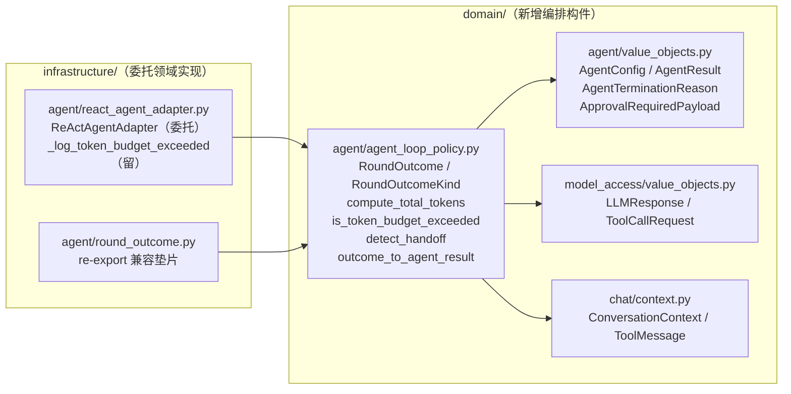
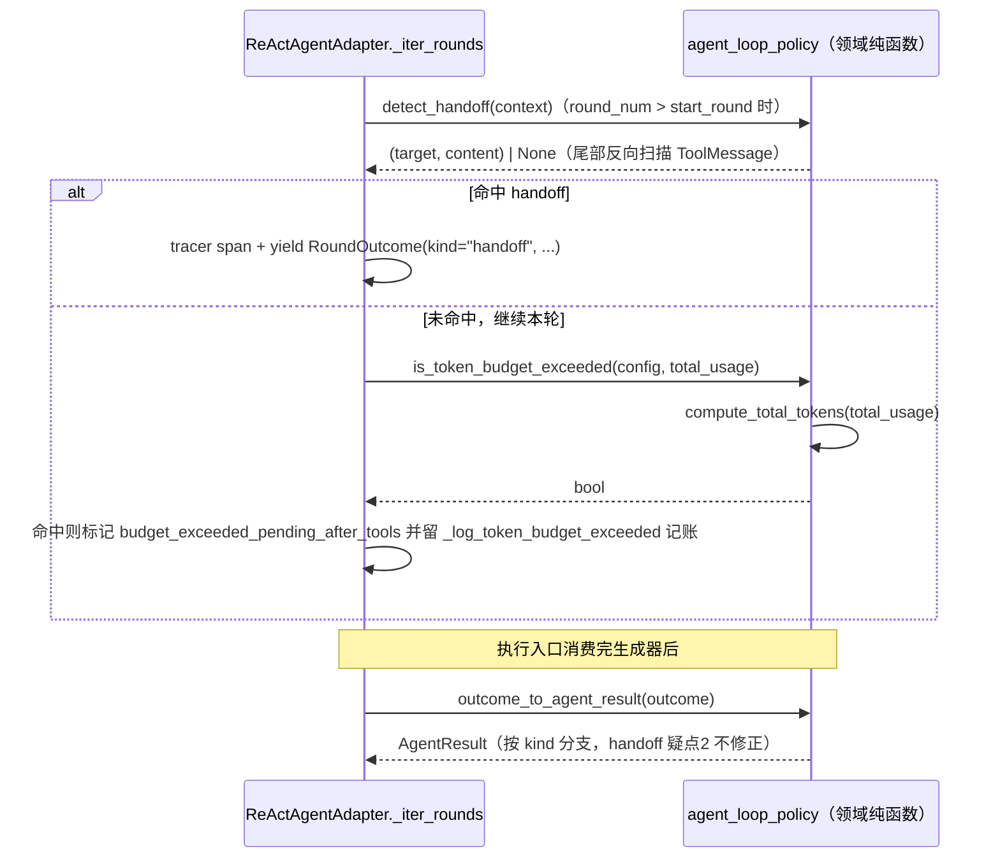

# 设计文档：P2 落地首片——Agent Loop 纯编排叶子逻辑与 RoundOutcome 值对象上提领域层

## 概述

本设计落地 ADR-0010 的 `P2_Relocation` **首片**，全程为**行为等价纯重构**（`Behavior_Equivalent_Refactor`）：新建领域模块 `src/domain/agent/agent_loop_policy.py`（`Domain_Agent_Loop_Module`），把 `ReActAgentAdapter` 现有的 4 个纯编排叶子 `@staticmethod`（`_compute_total_tokens` / `_is_token_budget_exceeded` / `_detect_handoff` / `_outcome_to_agent_result`）以模块级纯函数形态上提，并把 `RoundOutcome` / `RoundOutcomeKind` 值对象从 `src/infrastructure/agent/round_outcome.py` 迁入同一领域模块；`react_agent_adapter.py` 与既有测试改为 import / 委托领域实现，`infrastructure/agent/round_outcome.py` 降级为 re-export 兼容垫片，所有调用点行为字面等价。`_iter_rounds` 循环主体、`_execute_tool_call`、`_collect_pending_actions`、流式累加、guardrail / trace / abuse / 序列化 / 日志（含 `_log_token_budget_exceeded`）**明确留基础设施，不在本片范围**。

设计严格遵循 ADR-0010（最高约束源，六条 `P2_Invariants` + 两条待观测疑点不修正）、`ddd-architecture.md`（依赖方向 `infrastructure → domain`、领域层禁框架/Pydantic）、`ddd-tactical-modeling.md` §2（值对象 `@dataclass(frozen=True)` + 原生类型）/§4（领域服务放置：具名模块 `policy.py` 合法样板、零基础设施依赖 + 可脱离运行时单测）/§8（不引入领域事件）、`srp-principle.md`（序列化/日志不入领域）、`code-documentation.md`（中文 docstring）、`python-typing-lint.md`（全量类型标注、禁裸 `Any`）、`change-discipline.md`（最小改动、分片增量）、`doc-sync.md`（ADR 索引与主题文档同步），并以 P1 落地的 `domain/task/policy.py`（ADR-0009 纯函数式领域判定模块）与既有 `domain/workspace/policy.py`、`domain/agent/segmented_execution.py`（领域值对象样板）为职责与命名基准。新增 ADR-0011 记录「引入 `Domain_Agent_Loop_Module` 承载首片编排构件」的架构级决策与分片增量策略。

#### 设计决策

| 决策点 | 选定方案 | 理由 |
| --- | --- | --- |
| `Domain_Agent_Loop_Module` 落点与命名 | 单文件 `src/domain/agent/agent_loop_policy.py`，同时承载 4 个纯函数与 `RoundOutcome` / `RoundOutcomeKind` 值对象 | 4 构件同属「Agent Loop 编排判定 + 轮次终止形态」这一同一子域关注点，纯函数直接消费 `RoundOutcome`（`outcome_to_agent_result`），共文件避免跨模块循环引用；命名 `agent_loop_policy.py` 对齐 P1 `domain/task/policy.py` 与 `domain/workspace/policy.py` 的「纯函数式策略/判定」具名样板（`ddd-tactical-modeling.md` §4 承认 `policy.py` 合法组织），并直呼 Agent Loop 领域语言。不拆 `round_outcome.py` 到 `value_objects.py`——保持「首片全部编排构件同处一模块」的可复制样板边界清晰，且值对象与消费它的翻译函数强内聚。 |
| 4 个纯函数在领域层的形态 | **模块级纯函数**（`def compute_total_tokens(...)` 等，去掉前导下划线、去掉 `@staticmethod`），不再包裹进类 | 4 者均为「给定输入即定输出、无状态、无 `self`」的纯判定，对齐 ADR-0010 判据 2（可脱离运行时的纯业务判定属领域）与 `domain/workspace/policy.py` 的纯函数式风格；模块级函数比「无字段的领域服务类 + `@staticmethod`」更简洁，且 P1 的 `policy.py` 领域服务类是因需承载多个相关方法而聚类，本片 4 函数职责各异（token 计算 / 预算判定 / handoff 检测 / 结果翻译），模块级函数分列更贴 SRP。函数名去下划线（领域层公开 API 语义），原 `_` 前缀是基础设施私有约定。 |
| `RoundOutcome` 迁移 + 既有 import 兼容策略 | **真身迁入 `domain/agent/agent_loop_policy.py`；`infrastructure/agent/round_outcome.py` 保留为 re-export 垫片**（`from domain.agent.agent_loop_policy import RoundOutcome, RoundOutcomeKind`，`__all__` 导出，模块 docstring 标注为向后兼容垫片、真身已上提领域层） | 据实核验：`round_outcome.py` 全部 import 指向 `domain.agent.value_objects` 与 `domain.model_access.value_objects`，零 `infrastructure` 符号，上提零反向依赖（需求 3 AC3.2）。垫片方案让 `react_agent_adapter.py`（88 行）、两处测试（`test_value_objects_terminated_reason_unit.py`、`test_react_agent_token_budget_unit.py`）的既有 `from infrastructure.agent.round_outcome import RoundOutcome` 仍可解析，`P2_Invariants` 第 6 条「只改 import 不改断言」以最小 import 改动满足；相较「全量改 import 路径」减少改动面、降低漏改风险。垫片属首片临时产物，在后续片 `_iter_rounds` 上提完成后可清理（登记 ADR-0011 后果节）。 |
| `ReActAgentAdapter` 调用点委托方式 | **调用点直接改用领域实现（去薄封装）**：`react_agent_adapter.py` import 领域函数，`_iter_rounds` 等调用点直接调 `compute_total_tokens` / `is_token_budget_exceeded` / `detect_handoff` / `outcome_to_agent_result`；`react_agent_adapter.py` 内不再定义这 4 个 `@staticmethod`（`_compute_total_tokens` 等），但 `_log_token_budget_exceeded` 留下并改调领域 `compute_total_tokens` | requirement AC1.7 允许「薄封装保留 `@staticmethod` 入口 或 调用点直接改用领域层实现」二选一。据实核验：4 函数的**唯一外部（测试）引用**是 `test_react_agent_token_budget_unit.py:299` 对 `ReActAgentAdapter._outcome_to_agent_result` 的调用；其余全在本文件内。选「去薄封装」使 `infrastructure` 侧仅剩纯编排的委托、领域构件唯一权威落点在领域层，避免遗留空壳 `@staticmethod` 造成「两处都像入口」的认知负担（对齐 P1「调用点直接委托」范式）。该测试引用改为 import 领域函数直调（属 `P2_Invariants` 第 6 条允许的「只改 import / 调用形式、不改断言语义」）。`_log_token_budget_exceeded`（含 `logger`）按 ADR-0010 判据 4 留基础设施，内部改调领域 `compute_total_tokens` 复用计算。 |
| ADR-0010 疑点 2（handoff 分支 `model` 取父模型）处理 | **不修正**，`outcome_to_agent_result` 的 `handoff` 分支照搬 `outcome.response.model if outcome.response else ""` | requirement AC1.6 明令「SHALL NOT 借上提之名修正该疑点」；行为等价纯重构不改任何字段取值（ADR-0010 疑点 2 登记「另开 spec 决策」）。 |
| ADR-0011 | 新增，`Accepted`，不 supersede ADR-0001 / ADR-0010（落地其方向） | 引入 `Domain_Agent_Loop_Module` 一等抽象属架构级决策，`change-discipline.md` §2 / `ddd-tactical-modeling.md` §4 要求先写 ADR（需求 5）。 |

## 架构

改动跨领域层（新增 `agent_loop_policy.py`）与基础设施层（`react_agent_adapter.py` 改委托、`round_outcome.py` 降为垫片），依赖方向仍严格 `infrastructure → domain`；领域新模块仅引用同层 `domain.agent.value_objects` / `domain.model_access.value_objects` / `domain.chat.context`，**零 `application` / `infrastructure` / 框架 / Pydantic 依赖**，无新增反向依赖。

### 组件依赖图



### 调用委托时序（以 token 预算判定与 handoff 检测为例）



### 目录/模块落点

| 新增/改动模块 | 内容 |
| --- | --- |
| `src/domain/agent/agent_loop_policy.py`（新增） | `RoundOutcomeKind` / `RoundOutcome` 值对象 + 4 个模块级纯函数 `compute_total_tokens` / `is_token_budget_exceeded` / `detect_handoff` / `outcome_to_agent_result`；含模块中文 docstring。 |
| `src/infrastructure/agent/round_outcome.py`（改） | 降级为 re-export 兼容垫片，仅 `from domain.agent.agent_loop_policy import RoundOutcome, RoundOutcomeKind` + `__all__`；docstring 标注真身已上提领域层、本模块为向后兼容垫片。 |
| `src/infrastructure/agent/react_agent_adapter.py`（改） | 移除 4 个 `@staticmethod` 定义（`_compute_total_tokens` / `_is_token_budget_exceeded` / `_detect_handoff` / `_outcome_to_agent_result`）；改 import；`_iter_rounds`（1970 / 2186 行）、执行入口（2569 / 2791 行）、`_log_token_budget_exceeded`（1014 行）调用点改调领域函数；`RoundOutcome` import 改指领域模块。 |
| `test/domain/agent/`（新增测试） | 领域层纯函数 + `RoundOutcome` 单测（见测试策略）。 |
| `test/domain/agent/test_value_objects_terminated_reason_unit.py`（改 import） | `from infrastructure.agent.round_outcome import RoundOutcome` → `from domain.agent.agent_loop_policy import RoundOutcome`（垫片仍可解析，二选一，见「调用点 before/after」）。 |
| `test/infrastructure/agent/test_react_agent_token_budget_unit.py`（改 import/调用） | `_outcome_to_agent_result` 调用改为 import 领域 `outcome_to_agent_result` 直调；`RoundOutcome` import 改指领域模块（或经垫片，不改断言）。 |
| `docs/adr/0011-*.md` + `docs/adr/README.md`（新增/改） | ADR-0011。 |
| `docs/architecture.md` / `docs/domain-model.md`（按需同步） | 见「文档同步」。 |

## 组件与接口

领域新模块统一：`from __future__ import annotations`、全量类型标注、禁裸 `Any`、中文 docstring、无 `application` / `infrastructure` / 框架 / Pydantic 导入。函数签名与源实现逐一等价，仅去 `_` 前缀、去 `@staticmethod`、把对 `ReActAgentAdapter._compute_total_tokens` 的自引用改为对模块级 `compute_total_tokens` 的直调。

### 0. 模块头与导入（`src/domain/agent/agent_loop_policy.py`）

```python
"""领域层 Agent Loop 编排构件模块（P2 首片）。

承载 ReAct Agent Loop 的纯编排叶子判定与轮次终止形态值对象，
均为可脱离运行时、给定输入即定输出的领域判定，零基础设施 / 框架 / Pydantic 依赖。

包含：

- ``RoundOutcome`` / ``RoundOutcomeKind``：Agent Loop 单轮终止形态值对象（领域通用语言）；
- ``compute_total_tokens`` / ``is_token_budget_exceeded``：token 预算计算与超限判定；
- ``detect_handoff``：会话上下文尾部 handoff 标记检测；
- ``outcome_to_agent_result``：轮次结果到对外 AgentResult 的纯翻译。

本模块不承载循环推进主体、工具执行、审批中断决策、流式累加、guardrail / trace /
序列化 / 日志——这些技术关注点留在 ``infrastructure/agent``（见 ADR-0010 / ADR-0011）。
"""

from __future__ import annotations

from dataclasses import dataclass
from typing import Literal

from domain.agent.value_objects import (
    AgentConfig,
    AgentResult,
    AgentTerminationReason,
    ApprovalRequiredPayload,
)
from domain.chat.context import ConversationContext, ToolMessage
from domain.model_access.value_objects import LLMResponse, ToolCallRequest
```

### 1. `RoundOutcomeKind` / `RoundOutcome`（需求 1 AC1.2）

- **位置**：`src/domain/agent/agent_loop_policy.py`
- **职责**：刻画 Agent Loop 单轮终止形态的领域通用语言（`text` / `tool_calls` / `approval` / `final` / `handoff` 五态），字段与源 `round_outcome.py` **逐一等价**（名称、类型、默认值、`Literal` 取值、frozen 语义、字段级 docstring 全部照搬）。

```python
RoundOutcomeKind = Literal["text", "tool_calls", "approval", "final", "handoff"]
"""轮次终止形态类型（取值与语义照搬源定义，逐一等价）。"""


@dataclass(frozen=True)
class RoundOutcome:
    """ReAct Agent 单轮推进结果值对象（领域通用语言）。"""

    kind: RoundOutcomeKind
    round_num: int
    response: LLMResponse
    total_usage: dict[str, int]
    tool_calls: tuple[ToolCallRequest, ...] = ()
    approval: ApprovalRequiredPayload | None = None
    assistant_message_index: int | None = None
    terminated_reason: AgentTerminationReason = "completed"
    handoff_target: str | None = None
    handoff_content: str = ""
```

> 全部字段名称/类型/默认值/`Literal` 取值/frozen 与源 `round_outcome.py:34-88` 逐一等价；各字段的中文说明 docstring（`kind` / `terminated_reason` / `handoff_target` / `handoff_content` 等）随真身一并搬入，不改文字语义。

### 2. `compute_total_tokens`（需求 1 AC1.3，`Token_Budget_Computation_Rule`）

```python
def compute_total_tokens(total_usage: dict[str, int]) -> int:
    """按 Token_Budget_Computation_Rule 计算累计 token 用量。

    优先取 ``total_usage["total_tokens"]``；该键不存在或为 0 时回退到
    ``total_usage.get("prompt_tokens", 0) + total_usage.get("completion_tokens", 0)``。
    与源 ``ReActAgentAdapter._compute_total_tokens`` 逐一等价。
    """
    total = int(total_usage.get("total_tokens", 0) or 0)
    if total > 0:
        return total
    return int(total_usage.get("prompt_tokens", 0) or 0) + int(
        total_usage.get("completion_tokens", 0) or 0
    )
```

> 函数体照搬源 `react_agent_adapter.py:986-991`，字面等价。

### 3. `is_token_budget_exceeded`（需求 1 AC1.4，`Token_Budget_Exceeded_Predicate`）

```python
def is_token_budget_exceeded(config: AgentConfig, total_usage: dict[str, int]) -> bool:
    """判断当前累计 usage 是否超过 config.max_total_tokens。

    ``config.max_total_tokens is None`` 时恒返回 False；否则以
    ``compute_total_tokens(total_usage) > config.max_total_tokens`` 判定。
    与源 ``ReActAgentAdapter._is_token_budget_exceeded`` 逐一等价。
    """
    if config.max_total_tokens is None:
        return False
    return compute_total_tokens(total_usage) > config.max_total_tokens
```

> 源第 998 行的 `ReActAgentAdapter._compute_total_tokens(...)` 自引用改为对模块级 `compute_total_tokens(...)` 的直调，结果等价。

### 4. `detect_handoff`（需求 1 AC1.5，`Handoff_Detection`）

```python
def detect_handoff(context: ConversationContext) -> tuple[str, str] | None:
    """扫描最近一组 ToolMessage，返回 (handoff_target, handoff_content) 或 None。

    从消息列表尾部反向扫描最近一组连续 ToolMessage，遇非 ToolMessage 立刻停止；
    该区间内任一 ToolMessage 的 ``metadata["handoff_target"]`` 命中即返回
    ``(str(target), content)``，否则返回 None。与源
    ``ReActAgentAdapter._detect_handoff`` 逐一等价。
    """
    messages = context.get_messages()
    for msg in reversed(messages):
        if not isinstance(msg, ToolMessage):
            break
        target = msg.metadata.get("handoff_target")
        if target:
            return str(target), msg.content
    return None
```

> 函数体照搬源 `react_agent_adapter.py:1858-1865`，字面等价；docstring 保留源「同轮多个工具并发，handoff 可能出现在任意位置」等要点。

### 5. `outcome_to_agent_result`（需求 1 AC1.6，`Outcome_To_Result_Translation`）

```python
def outcome_to_agent_result(outcome: RoundOutcome) -> AgentResult:
    """将 RoundOutcome 翻译为 AgentResult（按 kind 分支）。

    - handoff：content 取 handoff_content，model 取 outcome.response.model
      （ADR-0010 疑点 2 当前实际行为，本片不修正），terminated_reason="completed"；
    - text / final：content 取 response.content，透传 terminated_reason；
    - approval：content 为空串，status="approval_required"，携 approval，
      terminated_reason="completed"。

    与源 ``ReActAgentAdapter._outcome_to_agent_result`` 逐一等价。
    """
    if outcome.kind == "handoff":
        return AgentResult(
            content=outcome.handoff_content,
            model=outcome.response.model if outcome.response else "",
            usage=outcome.total_usage,
            latency_ms=0.0,
            terminated_reason="completed",
        )
    if outcome.kind in ("text", "final"):
        return AgentResult(
            content=outcome.response.content,
            model=outcome.response.model,
            usage=outcome.total_usage,
            latency_ms=outcome.response.latency_ms,
            terminated_reason=outcome.terminated_reason,
        )
    # kind == "approval": HITL 中断不属于轮数超限
    return AgentResult(
        content="",
        model=outcome.response.model,
        usage=outcome.total_usage,
        latency_ms=outcome.response.latency_ms,
        status="approval_required",
        approval=outcome.approval,
        terminated_reason="completed",
    )
```

> 三分支照搬源 `react_agent_adapter.py:2277-2302`，字段取值逐一等价，含 `handoff` 分支 `model=outcome.response.model`（疑点 2 不修正，AC1.6）。

### 6. `infrastructure/agent/round_outcome.py`（改：re-export 垫片）

```python
"""ReAct Agent 单轮推进结果模块（向后兼容垫片）。

``RoundOutcome`` / ``RoundOutcomeKind`` 的真身已上提到领域层
``domain.agent.agent_loop_policy``（P2 首片，ADR-0011）。本模块仅重导出，
保持既有 ``from infrastructure.agent.round_outcome import RoundOutcome`` 引用可解析；
新代码应直接从 ``domain.agent.agent_loop_policy`` 导入。
"""

from __future__ import annotations

from domain.agent.agent_loop_policy import RoundOutcome, RoundOutcomeKind

__all__ = ["RoundOutcome", "RoundOutcomeKind"]
```

### 7. `infrastructure/agent/react_agent_adapter.py`（改：import + 委托）

- **import 改动**（第 88 行）：`from infrastructure.agent.round_outcome import RoundOutcome` → 从领域模块引入 `RoundOutcome` 与 4 个纯函数：

```python
from domain.agent.agent_loop_policy import (
    RoundOutcome,
    compute_total_tokens,
    detect_handoff,
    is_token_budget_exceeded,
    outcome_to_agent_result,
)
```

- **删除**：类内 4 个 `@staticmethod` 定义 `_compute_total_tokens`（979-991）、`_is_token_budget_exceeded`（993-998）、`_detect_handoff`（1837-1865）、`_outcome_to_agent_result`（2254-2303）。
- **保留并微调**：`_log_token_budget_exceeded`（1000-1017）留基础设施（含 `logger`，ADR-0010 判据 4）；其内第 1014 行 `ReActAgentAdapter._compute_total_tokens(total_usage)` 改为 `compute_total_tokens(total_usage)`。

## 调用点 before/after 全表（需求 1 AC1.7、需求 2 AC2.6）

### src 内引用

| 位置 | before | after | 改动类型 |
| --- | --- | --- | --- |
| `react_agent_adapter.py:88`（import） | `from infrastructure.agent.round_outcome import RoundOutcome` | 从 `domain.agent.agent_loop_policy` import `RoundOutcome` + 4 函数（见组件 7） | 只改 import |
| `react_agent_adapter.py:979-991`（`_compute_total_tokens` 定义） | 类内 `@staticmethod` 定义 | **删除**（真身在领域层 `compute_total_tokens`） | 删除定义 |
| `react_agent_adapter.py:993-998`（`_is_token_budget_exceeded` 定义） | 类内 `@staticmethod` 定义 | **删除**（真身在领域层 `is_token_budget_exceeded`） | 删除定义 |
| `react_agent_adapter.py:1014`（`_log_token_budget_exceeded` 内） | `ReActAgentAdapter._compute_total_tokens(total_usage)` | `compute_total_tokens(total_usage)` | 改委托（`_log_token_budget_exceeded` 本体留基础设施） |
| `react_agent_adapter.py:1837-1865`（`_detect_handoff` 定义） | 类内 `@staticmethod` 定义 | **删除**（真身在领域层 `detect_handoff`） | 删除定义 |
| `react_agent_adapter.py:1970`（`_iter_rounds` 内调用） | `handoff = self._detect_handoff(context)` | `handoff = detect_handoff(context)` | 改委托 |
| `react_agent_adapter.py:2186`（`_iter_rounds` 内调用） | `if self._is_token_budget_exceeded(config, total_usage):` | `if is_token_budget_exceeded(config, total_usage):` | 改委托 |
| `react_agent_adapter.py:2254-2303`（`_outcome_to_agent_result` 定义） | 类内 `@staticmethod` 定义 | **删除**（真身在领域层 `outcome_to_agent_result`） | 删除定义 |
| `react_agent_adapter.py:2569`（执行入口调用） | `return self._outcome_to_agent_result(outcome)` | `return outcome_to_agent_result(outcome)` | 改委托 |
| `react_agent_adapter.py:2791`（执行入口调用） | `return self._outcome_to_agent_result(outcome)` | `return outcome_to_agent_result(outcome)` | 改委托 |
| `react_agent_adapter.py` 内 `RoundOutcome(...)` 构造（1957/1982/2100/2142/2173/2189/2246 等 yield 处） | `RoundOutcome(...)` | **字面不变**（现指向领域模块 import 的 `RoundOutcome`，类型等价） | 无改动（仅 import 源变更） |
| `react_agent_adapter.py` 内 `-> AsyncIterator[RoundOutcome]` / `_build_model_call_trace(outcome: RoundOutcome, ...)` / `_build_approval_trace(outcome: RoundOutcome)`（587/636/1877 等类型注解） | `RoundOutcome` | **字面不变**（同上） | 无改动 |
| `round_outcome.py`（整文件） | `@dataclass` 真身定义 + `RoundOutcomeKind` | 降级为 re-export 垫片（见组件 6） | 内容替换（对外符号不变） |

> 说明：`react_agent_adapter.py` 内所有 `RoundOutcome(...)` 构造与类型注解**字面保持不变**——它们引用的仍是名为 `RoundOutcome` 的符号，只是该符号的 import 来源从 `infrastructure.agent.round_outcome` 改为 `domain.agent.agent_loop_policy`，二者为同一类（垫片 re-export），构造语义、frozen、字段全等价。`_iter_rounds` 内除 1970 / 2186 两处对被搬函数的调用外，循环控制主体、`_execute_tool_call`、审批筛选、流式累加、guardrail / trace / checkpoint 副作用**一律不动**（需求 6）。

### test 内引用

| 文件:行 | before | after | 改动类型 |
| --- | --- | --- | --- |
| `test/domain/agent/test_value_objects_terminated_reason_unit.py:20` | `from infrastructure.agent.round_outcome import RoundOutcome` | `from domain.agent.agent_loop_policy import RoundOutcome`（或经垫片保持不变，二选一） | 只改 import（断言 78-99 行**不动**） |
| `test/infrastructure/agent/test_react_agent_token_budget_unit.py:289`（函数内局部 import） | `from infrastructure.agent.round_outcome import RoundOutcome` | `from domain.agent.agent_loop_policy import RoundOutcome, outcome_to_agent_result` | 只改 import |
| `test/infrastructure/agent/test_react_agent_token_budget_unit.py:299` | `result = ReActAgentAdapter._outcome_to_agent_result(outcome)` | `result = outcome_to_agent_result(outcome)` | 改调用形式（断言 300 行 `result.terminated_reason == "token_budget_exceeded"` **不动**） |
| `test/infrastructure/agent/test_react_agent_handoff_unit.py:6`（docstring 提及 `RoundOutcome`） | 文档字符串文字 | **字面不变**（无 import/调用，仅说明性文字） | 无改动 |
| `test/infrastructure/agent/test_react_agent_characterization_*.py` 及其余 `test/infrastructure/agent/` 特征化/单测 | 经 `AgentPort` 对外行为断言，未直引被搬符号 | **字面不变** | 无改动（作回归基线） |

> `test_value_objects_terminated_reason_unit.py` 因 re-export 垫片存在，即使保持原 import 亦可解析；本设计推荐将其改指领域模块以体现「真身已上提」（属 `P2_Invariants` 第 6 条允许的 import 调整），断言语义零改动。`test_react_agent_token_budget_unit.py:299` 的调用形式从「适配器 `@staticmethod`」改为「领域纯函数直调」，输入 `outcome` 与断言不变，行为等价。

## 反向依赖复核（需求 3 AC3.2）

据实核验 `agent_loop_policy.py` 的全部 import 目标均在领域层，**零 `infrastructure` 符号**：

| 被引符号 | 来源模块 | 层 |
| --- | --- | --- |
| `AgentConfig` / `AgentResult` / `AgentTerminationReason` / `ApprovalRequiredPayload` | `domain.agent.value_objects` | domain（同子域） |
| `LLMResponse` / `ToolCallRequest` | `domain.model_access.value_objects` | domain |
| `ConversationContext` / `ToolMessage` | `domain.chat.context` | domain |
| `dataclass` / `Literal` | `dataclasses` / `typing` | 标准库 |

- `RoundOutcome` 原 import（`domain.agent.value_objects` + `domain.model_access.value_objects`）在源 `round_outcome.py:15-16` 已确认零 `infrastructure`，上提后不产生 `domain → infrastructure` 反向依赖。
- 4 函数入参/出参类型（`AgentConfig` / `AgentResult` / `ApprovalRequiredPayload` / `ConversationContext` / `ToolMessage` / `dict[str, int]` / `RoundOutcome`）全在领域层，属「领域内向领域内」引用，方向合规。
- 门禁：`grep -rnE "import (application|infrastructure|fastapi|pydantic)" src/domain/agent/agent_loop_policy.py` 期望零命中。

## 数据模型

本重构不改任何持久化 schema、DDL、线格式或既有值对象字段。唯一的数据构件迁移是 `RoundOutcome` / `RoundOutcomeKind` 从 `infrastructure.agent.round_outcome` 上提到 `domain.agent.agent_loop_policy`，**字段/类型/默认值/`Literal` 取值逐一等价**：

| 字段 | 类型 | 默认值 | 等价说明 |
| --- | --- | --- | --- |
| `kind` | `RoundOutcomeKind`（`Literal["text","tool_calls","approval","final","handoff"]`） | 无默认（必填） | 五态取值集合与源完全一致 |
| `round_num` | `int` | 无默认（必填） | 等价 |
| `response` | `LLMResponse` | 无默认（必填） | 等价（`domain.model_access.value_objects`） |
| `total_usage` | `dict[str, int]` | 无默认（必填） | 等价 |
| `tool_calls` | `tuple[ToolCallRequest, ...]` | `()` | 等价 |
| `approval` | `ApprovalRequiredPayload \| None` | `None` | 等价 |
| `assistant_message_index` | `int \| None` | `None` | 等价 |
| `terminated_reason` | `AgentTerminationReason`（`Literal["completed","max_rounds","token_budget_exceeded"]`） | `"completed"` | 等价 |
| `handoff_target` | `str \| None` | `None` | 等价 |
| `handoff_content` | `str` | `""` | 等价 |

- `@dataclass(frozen=True)` 语义（不可变、`__eq__` 按值）不变。
- `RoundOutcomeKind` 作为模块级 `Literal` 类型别名，取值顺序与集合不变。
- 4 个纯函数无字段（无状态模块级函数），不产生新数据模型。

## 事务与并发边界

本 spec 为行为等价纯重构，**不新增、不改变任何写操作、事务边界、并发语义或幂等键**。上提的 4 个函数均为纯判定（返回 `int` / `bool` / `tuple | None` / `AgentResult`），不触发任何持久化、Redis/文件写入、消息投递或 I/O；`RoundOutcome` 为不可变值对象。

- ADR-0010 `Infrastructure_Encapsulation_Candidates` 全部技术记账（guardrail 运行时累加、`ToolAbuseDetector`、OTel trace、`ApprovalStateStorePort` 持久化 I/O、序列化、`approval_logging`、`_RoundStreamAccumulator`、`handoff_context` ContextVar、`workflow_capability_runtime`、`merge_usage`）**位置与时机一律不动**（需求 6 AC6.2）。
- `_iter_rounds` 的 `for round_num in range(...)` 推进、`terminal_round` 边界、`RoundOutcome` 产出协议、`_execute_tool_call` 的控制流与副作用**不动**（需求 6 AC6.1）；1970 / 2186 两处委托只把内联的纯判定换成等价的领域函数调用，不改变判定发生的时机与前后语句顺序。
- `_log_token_budget_exceeded` 的 `logger.warning` 记账时机不变，仅内部计算改调领域 `compute_total_tokens`（结果等价）。
- 无跨事务/多数据源/外部服务/消息队列的一致性问题被引入或改变。

## 正确性属性

### Property 1（4 个纯函数输入→输出逐一等价）
对任意输入：`compute_total_tokens` / `is_token_budget_exceeded` / `detect_handoff` / `outcome_to_agent_result` 的领域实现与被删除的源 `@staticmethod` 逐一等价（`total_tokens` 命中/回退、`max_total_tokens` 为 `None`/等于/超限、handoff 命中/未命中/尾部非 `ToolMessage` 停止、各 `kind` 翻译分支）。
验证需求：需求 1 AC1.3 / AC1.4 / AC1.5 / AC1.6。
验证命令：`PYTHONPATH=src uv run pytest test/domain/agent/test_agent_loop_policy_unit.py`；`PYTHONPATH=src uv run --frozen pytest test/infrastructure/agent/test_react_agent_token_budget_unit.py`。

### Property 2（`RoundOutcome` 字段/类型/默认值/`Literal` 等价）
`RoundOutcome` 上提后全部字段名称、类型、默认值、`RoundOutcomeKind` / `AgentTerminationReason` 取值、frozen 语义与源逐一等价。
验证需求：需求 1 AC1.2。
验证命令：`PYTHONPATH=src uv run --frozen pytest test/domain/agent/test_value_objects_terminated_reason_unit.py::TestRoundOutcomeTerminatedReason`；`PYTHONPATH=src uv run pytest test/domain/agent/test_agent_loop_policy_unit.py -k round_outcome`。

### Property 3（所有调用点行为字面等价）
`_iter_rounds`（1970 / 2186）、执行入口（2569 / 2791）、`_log_token_budget_exceeded`（1014）改委托后，与改前对外可观测行为字面等价；`RoundOutcome(...)` 构造与类型注解字面不变。
验证需求：需求 1 AC1.7、需求 2 AC2.2 / AC2.3。
验证命令：`PYTHONPATH=src uv run --frozen pytest test/infrastructure/agent/`（含 `test_react_agent_characterization_*.py` 特征化基线全绿）。

### Property 4（既有 import 仍可解析）
`from infrastructure.agent.round_outcome import RoundOutcome` 经 re-export 垫片仍可解析；`ReActAgentAdapter._outcome_to_agent_result` 调用点已改为领域纯函数直调后可执行。
验证需求：需求 2 AC2.6、需求 4 AC4.5。
验证命令：`PYTHONPATH=src uv run python -c "from infrastructure.agent.round_outcome import RoundOutcome, RoundOutcomeKind; print('ok')"`；全量 `PYTHONPATH=src uv run --frozen pytest`。

### Property 5（handoff 分支 `model` 取父模型的疑点 2 不修正）
`outcome_to_agent_result` 的 `handoff` 分支 `model` 仍取 `outcome.response.model`（非 `HandoffPerformed.model`），未借上提之名修正 ADR-0010 疑点 2。
验证需求：需求 1 AC1.6。
验证命令：`PYTHONPATH=src uv run pytest test/domain/agent/test_agent_loop_policy_unit.py -k handoff`（断言 `result.model == outcome.response.model`）；既有 handoff 特征化测试全绿。

### Property 6（零对外行为变化 + `AgentPort` 签名不变）
`AgentPort` 四方法签名不变；`AgentResult` / `AgentStreamEvent` / `StreamingChunk` 字段与时序、`AgentTerminationReason` 取值、审批中断/恢复协议、流式协议、`V3_Decisions_Frozen` 对外字面等价。
验证需求：需求 2 AC2.1 / AC2.2 / AC2.3 / AC2.5。
验证命令：`grep -n "def run\|def run_streaming\|def run_events\|def resume" src/domain/agent/ports.py`（签名未变）；全量 `PYTHONPATH=src uv run --frozen pytest`。

### Property 7（既有测试零断言改动）
因构件移动导致的 import/调用形式调整只改 import/调用形式、不改任何断言语义；`Existing_Test_Suite_Green` 前后成立。
验证需求：需求 2 AC2.4 / AC2.6、需求 4 AC4.4 / AC4.5。
验证命令：`git diff` 审查 `test_value_objects_terminated_reason_unit.py` / `test_react_agent_token_budget_unit.py` 仅 import/调用形式行变更；全量 `PYTHONPATH=src uv run --frozen pytest`。

### Property 8（领域新模块零基础设施依赖，可脱离运行时单测）
`agent_loop_policy.py` 不 import `application` / `infrastructure` / 框架 / Pydantic；其单测无需运行时即可执行。
验证需求：需求 3 AC3.1 / AC3.2 / AC3.4 / AC3.5、需求 4 AC4.3。
验证命令：`grep -rnE "import (application|infrastructure|fastapi|pydantic)" src/domain/agent/agent_loop_policy.py`（期望零命中）；`PYTHONPATH=src uv run ruff check src/domain/agent/agent_loop_policy.py`；`PYTHONPATH=src uv run pyright src/domain/agent/agent_loop_policy.py`（零新增错误）。

## 错误处理

复用仓库既有错误模型，**不引入任何新错误返回风格**：

- 上提的 4 个纯函数均**不抛异常、不吞异常、不新增 try/except、不新增日志**——返回值语义与源完全一致（`compute_total_tokens → int`、`is_token_budget_exceeded → bool`、`detect_handoff → tuple[str, str] | None`、`outcome_to_agent_result → AgentResult`）。
- `RoundOutcome` 为 frozen 值对象，无 `__post_init__` 校验（源即无），不引入构造期异常。
- token 预算超限的**日志**（`Token_Budget_Exceeded_Warning`，`logger.warning`）仍由 `_log_token_budget_exceeded` 在基础设施层输出，位置与时机不变（ADR-0010 判据 4，需求 1 AC1.8）；领域函数不承载日志。
- `AgentResult.status="approval_required"` 等对外状态字段取值由 `outcome_to_agent_result` 照搬构造，`AgentTerminationReason` 取值不变，不改任何对外错误/状态语义（`Contract_Invariance`）。
- 领域层不感知 HTTP 响应包装、`BizException` 等应用/基础设施错误模型——本片不触及任何异常类型的定义、抛出点或错误码。

## 测试策略

采用「新增聚焦领域构件的单元测试（脱离运行时）+ 既有特征化/单测作回归」，统一用项目既有 `pytest`（`PYTHONPATH=src uv run --frozen pytest`，在 `epsilon-boot/` 下执行），新测试置于 `test/domain/agent/`（需求 4 AC4.1），仅 import `domain.*`（AC4.3）。

1. **领域构件单元测试（新增，主力）**——`test/domain/agent/test_agent_loop_policy_unit.py`（命名清晰标识锁定 `agent_loop_policy`），覆盖正例与边界/分支（AC4.2）：
   - `compute_total_tokens`：`total_tokens` 命中（>0 直接返回）、`total_tokens` 缺失或为 0 回退 `prompt_tokens + completion_tokens`、空 dict（追溯 需求 1 AC1.3，Property 1）。
   - `is_token_budget_exceeded`：`max_total_tokens is None`（恒 False）、恰好等于上限（False）、超限（True）（追溯 AC1.4，Property 1）。
   - `detect_handoff`：命中（尾部 `ToolMessage.metadata["handoff_target"]`）、未命中（无标记）、尾部非 `ToolMessage` 立即停止、同轮多 `ToolMessage` handoff 在任意位置命中（追溯 AC1.5，Property 1）。
   - `outcome_to_agent_result`：`handoff` 分支（content 取 handoff_content、model 取 response.model 疑点 2、terminated_reason="completed"）、`text` / `final` 分支（透传 terminated_reason）、`approval` 分支（空 content + status="approval_required" + 携 approval）（追溯 AC1.6，Property 1/5）。
   - `RoundOutcome`：默认 `terminated_reason == "completed"`、显式 `"max_rounds"` 可读、frozen 不可变、各字段默认值（追溯 AC1.2，Property 2）——不与 `test_value_objects_terminated_reason_unit.py::TestRoundOutcomeTerminatedReason` 添加等价重复断言（AC4.4），仅补该处未覆盖的字段（`handoff_target` / `handoff_content` / `tool_calls` 默认）。
2. **既有测试回归**——`test/infrastructure/agent/test_react_agent_characterization_*.py`（终止四态 / 流式事件时序 / 审批中断恢复 / handoff / token budget 五面）与既有 `test/infrastructure/agent/` 单测仅按需调整 import/调用形式、不改断言语义（AC4.4 / AC4.5），作首片行为等价回归基线（Property 3/6/7）；`test_value_objects_terminated_reason_unit.py` / `test_react_agent_token_budget_unit.py` 只改 import/调用形式（Property 4/7）。
3. **依赖与规范门禁**——`grep` 验证 `agent_loop_policy.py` 无 `application`/`infrastructure`/框架/Pydantic 依赖（Property 8）；`ruff`/`pyright` 零新增错误、禁裸 `Any`、中文 docstring（需求 3 AC3.3 / AC3.4 / AC3.5）。
4. **全量门禁**——`PYTHONPATH=src uv run --frozen pytest`（需求 2 AC2.4，Property 3/4/6/7）。

## ADR-0011 草案要点

- **编号/文件**：`docs/adr/0011-relocate-agent-loop-leaf-orchestration-to-domain.md`；标题「上提 Agent Loop 纯编排叶子逻辑与 RoundOutcome 值对象至领域层（P2 首片）」；状态 `Accepted`；日期 2026-07-06；在 `docs/adr/README.md` 索引表追加 0011 行。四段式（背景/决策/后果/备选方案含未采纳原因）。
- **背景**：落地 ADR-0010「ReAct Agent Loop 编排逻辑应归属领域层」方向的首片；ADR-0010 已确立切分线判据、据实候选清单与 `P2_Invariants` 六条，但只定方向未搬任何一行。整合报告识别的 `Domain_Logic_In_Infrastructure`（3313 行 `react_agent_adapter.py` 承载自研编排算法、非 SDK 封装）需以最低风险起步纠偏。
- **决策**：引入 `Domain_Agent_Loop_Module`（`src/domain/agent/agent_loop_policy.py`）承载 `First_Slice_Scope` 五项——4 个模块级纯编排函数（`compute_total_tokens` / `is_token_budget_exceeded` / `detect_handoff` / `outcome_to_agent_result`）+ `RoundOutcome` / `RoundOutcomeKind` 值对象；`ReActAgentAdapter` 调用点直接委托领域实现，`infrastructure/agent/round_outcome.py` 降为 re-export 兼容垫片；采用**分片增量策略**，本首片只搬零 I/O、给定输入即定输出的纯叶子构件。声明为 `Behavior_Equivalent_Refactor`，不改任何对外可观测行为，遵守 `P2_Invariants` 六条。
- **后果**：正面——领域层承载 Agent Loop 编排构件的第一块落地打通，建立领域模块 + 单测样板，为后续片降风险；`_log_token_budget_exceeded`（日志，判据 4）留基础设施。负面/临时性——`round_outcome.py` re-export 垫片是首片临时产物，待后续片 `_iter_rounds` 主体上提完成后可清理；`_iter_rounds` 循环控制主体、`_execute_tool_call`、审批中断决策 `_collect_pending_actions`、流式累加**明确留后续片**（回链 ADR-0010 后果节「高度交织」警示与方案 C「一次性大爆炸搬迁 3313 行」否决）。后续影响——若实施中发现某构件与循环主体/技术记账存在未预期耦合而无法零风险剥离，处置为「缩小该构件首片范围并登记于本 ADR 后果节，留后续片」，不借首片之名扩张至 Out of Scope（需求 6 AC6.5）。
- **备选方案（未采纳）**：(a) 一次性大爆炸搬迁全部编排逻辑——被否（ADR-0010 方案 C，风险极高）；(b) 保留 4 个空壳 `@staticmethod` 薄封装再委托领域——被否（造成「两处都像入口」认知负担，且遗留 infrastructure 侧冗余定义，AC1.7 允许直接委托）；(c) 全量改 import 路径、不留 re-export 垫片——被否（改动面更大、漏改风险高，违背最小改动纪律）；(d) 引入领域事件/事件总线承载循环——被否（违反 ADR-0001，`P2_Invariants` 第 5 条）；(e) 把 `RoundOutcome` 拆入 `domain/agent/value_objects.py` 而非新模块——不采纳（值对象与消费它的翻译函数强内聚，同处 `agent_loop_policy.py` 更利首片样板边界清晰，且避免与 `value_objects.py` 循环引用风险）。
- **不 supersede** ADR-0001 与 ADR-0010（落地 ADR-0010 方向）；不复活领域事件/事件总线（需求 5 AC5.4）。

## 文档同步（doc-sync）

- **必做**：`docs/adr/README.md` 索引表追加 0011 条目（需求 5 AC5.5）。
- **建议同步**：
  - `docs/architecture.md`——「Port/Adapter 映射」与「ReAct Agent Loop 流程」章节现描述 `ReActAgentAdapter` 承载 Agent Loop；应补一句「Agent Loop 的纯编排叶子判定（token 预算计算/超限、handoff 检测、结果翻译）与 `RoundOutcome` 值对象已上提领域层 `domain/agent/agent_loop_policy.py`（ADR-0011 首片），适配器改为委托」。
  - `docs/domain-model.md`——现无 `RoundOutcome` / Agent Loop 编排构件条目；应新增对 `domain/agent/agent_loop_policy.py`（`RoundOutcome` 值对象 + 4 个编排纯函数）的领域模型说明，标注其为 Agent Loop 轮次终止形态通用语言与纯编排判定。
- 上述文档同步在实现落地时随代码一并更新，防上下文脱节（`doc-sync.md`）。

## AC → 交付物追溯表

| AC | 交付物 / 设计位置 | 验证 |
| --- | --- | --- |
| 1.1 | `Domain_Agent_Loop_Module` = `domain/agent/agent_loop_policy.py`，仅纳入 5 项 | 组件 0–5；Property 8 |
| 1.2 | `RoundOutcome` / `RoundOutcomeKind` 上提、字段逐一等价 | 组件 1；数据模型；Property 2 |
| 1.3 | `compute_total_tokens` 上提、等价 | 组件 2；Property 1 |
| 1.4 | `is_token_budget_exceeded` 上提、等价 | 组件 3；Property 1 |
| 1.5 | `detect_handoff` 上提、等价 | 组件 4；Property 1 |
| 1.6 | `outcome_to_agent_result` 上提、等价、疑点 2 不修正 | 组件 5；Property 1/5 |
| 1.7 | 调用点直接委托领域实现，行为字面等价 | 组件 7；调用点全表；Property 3 |
| 1.8 | 不上提 `_iter_rounds` 主体/`_execute_tool_call`/`_collect_pending_actions`/流式/guardrail/trace/序列化/`_log_token_budget_exceeded` | 目录落点；事务并发边界；ADR-0011 后果 |
| 2.1 | `AgentPort` 四方法签名不变 | Property 6 |
| 2.2 | `Contract_Invariance` 成立 | Property 3/6 |
| 2.3 | `V3_Decisions_Frozen` 成立 | Property 3/6 |
| 2.4 | `Existing_Test_Suite_Green` 前后成立 | Property 3/7；测试策略 4 |
| 2.5 | 不回退 ADR-0001、不引入领域事件 | ADR-0011 决策/备选；Property 6 |
| 2.6 | import 变化只改 import 不改断言 | 调用点全表（test）；Property 4/7 |
| 3.1 | 领域层依赖禁则满足 | 反向依赖复核；Property 8 |
| 3.2 | 反向依赖复核（依赖全在领域层，零 infrastructure） | 反向依赖复核 |
| 3.3 | 中文 docstring | 组件 0–5 |
| 3.4 | 全量类型标注、禁裸 `Any`、过 ruff/pyright | Property 8；测试策略 3 |
| 3.5 | SRP：只承载纯编排判定与值对象，不夹带序列化/日志/I/O | 组件 0；错误处理；事务并发边界 |
| 4.1 | 新增单测置于 `test/domain/agent/`、命名标识构件 | 测试策略 1 |
| 4.2 | 覆盖正例与边界/分支 | 测试策略 1 |
| 4.3 | 脱离运行时单测 | 测试策略 1；Property 8 |
| 4.4 | 复用/对齐特征化测试、不加等价重复断言 | 测试策略 1/2 |
| 4.5 | 两处既有测试引用仍可解析、只改 import | 调用点全表（test）；Property 4/7 |
| 5.1–5.4 | ADR-0011（四段式、Accepted、不 supersede 0001/0010、不复活领域事件） | ADR-0011 草案要点 |
| 5.5 | `docs/adr/README.md` 索引 + 主题文档按需同步 | 文档同步 |
| 6.1–6.5 | 不搬 `_iter_rounds` 主体等；不改 `Infrastructure_Encapsulation_Candidates`；不改 DI/前端/依赖管理；文件本体不移动；缩小范围登记 ADR | 目录落点；事务并发边界；调用点全表；ADR-0011 后果 |

## Clarification Loop（自评估）

对上述草案做了 trade-off / 安全 / 开放问题自评估，结论如下：

- **无安全/隐私风险**：本片为纯判定/值对象上提，不触及 authn/authz、多租户隔离、PII、输入信任边界、注入面、序列化反序列化或密钥；handoff 检测、token 预算判定语义逐字段保留。
- **无写路径/事务变更**：不引入新事务边界、并发窗口或幂等键（见「事务与并发边界」）。
- 以下为设计中已按需求/ADR-0010 作出、但值得你确认的**低风险取舍**（已给推荐并写入设计，若认可可直接确认）：

1. **委托方式：去薄封装 vs 保留空壳 `@staticmethod`**。设计选「调用点直接委托领域函数、删除 `ReActAgentAdapter` 内 4 个 `@staticmethod` 定义」（AC1.7 二选一）。备选是「保留 4 个 `@staticmethod` 空壳转调领域实现」以让 `test_react_agent_token_budget_unit.py:299` 的 `ReActAgentAdapter._outcome_to_agent_result` 调用**零改动**。推荐去薄封装——领域构件唯一权威落点、避免「两处像入口」，代价是该测试一行调用形式改动（属 `P2_Invariants` 第 6 条允许，断言不变）。是否认可去薄封装？

2. **`RoundOutcome` re-export 垫片 vs 全量改 import**。设计选「保留 `infrastructure/agent/round_outcome.py` 为 re-export 垫片」以最小化 import 改动。备选是「删除该文件、全量改所有 import 路径」。推荐垫片——改动面小、漏改风险低，垫片为首片临时产物（后续片清理，已登记 ADR-0011 后果）。是否认可垫片方案，或希望本片即全量改路径不留垫片？

3. **`test_value_objects_terminated_reason_unit.py` import 是否顺带改指领域模块**。垫片存在时该文件即使保持原 `from infrastructure.agent.round_outcome import RoundOutcome` 亦可解析。设计推荐将其改指 `domain.agent.agent_loop_policy` 以体现「真身已上提」（属允许的 import 调整，断言不变）。备选是「保持原 import 不动」（改动更小）。是否认可改指领域模块，或倾向保持原 import 不动？

若以上均认可，我将视设计为最终版；如需调整请按编号答复，我会就地更新 `design.md` 并复评。
