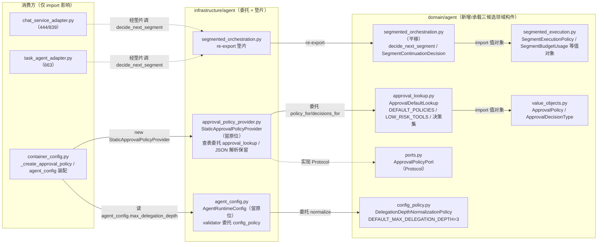
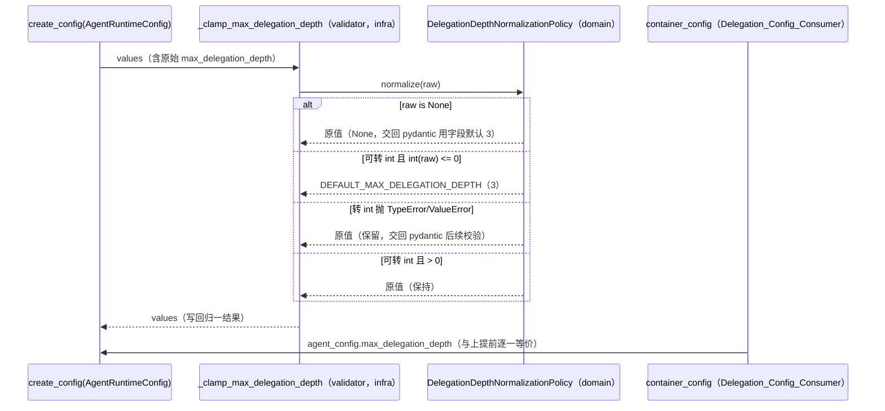

# 设计文档：贫血领域模型充血化后续片（domain/agent 三候选：委派深度规范化 / 审批查表 / 分段续跑）

## 概述

本设计承接前序 `ddd-anemic-domain-pilot-agent`（ADR-0014）显式列出的三个 `domain/agent` 后续候选，全程为**行为等价的纯重构**（`Behavior_Equivalent_Refactor`）：把散落在 `infrastructure/agent/` 的三处领域判定按既有范式收敛/平移进领域层——候选 A（委派深度规范化）新增 `domain/agent/config_policy.py` 承载「`<= 0` 回退默认值 3」归一规则与默认值常量，pydantic-settings 配置类 `AgentRuntimeConfig` 留 infrastructure 但改为委托该领域构件；候选 B（审批默认查表）新增 `domain/agent/approval_lookup.py` 承载 `_DEFAULT_POLICIES` / `_LOW_RISK_TOOLS` / 决策集常量与默认查表判定，`StaticApprovalPolicyProvider` 保留类身份与 JSON 解析、默认查表委托领域构件；候选 C（分段续跑）把 `decide_next_segment` 与 `SegmentContinuationDecision` 平移到新建 `domain/agent/segmented_orchestration.py`（与依赖的 `segmented_execution.py` 同子域同层），原 infrastructure 文件降为 re-export 垫片。设计以首片 `docs/spec/ddd-anemic-domain-pilot-agent/design.md`（ADR-0014，垫片/等价论证格式基准）与 `domain/task/policy.py`（ADR-0009，领域服务范式）为可复制样板，严格遵循 `ddd-architecture.md`（依赖方向 `application/infrastructure → domain`、领域层禁框架/基础设施依赖）、`ddd-tactical-modeling.md` §4（领域服务放置「零基础设施依赖 + 可脱离运行时单测」标尺）/§8（不引领域事件）、`config-source.md` 与 ADR-0008（JSON 配置解析属基础设施配置边界）、`srp-principle.md`（单一职责）、`change-discipline.md`（最小改动、逐候选推进）、`adr.md`（架构级决策先写 ADR）、`code-documentation.md`（中文 docstring）、`python-typing-lint.md`（全量类型标注、禁裸 `Any`）、`pydantic-model.md`（领域用 dataclass、Pydantic 仅在配置边界）、`doc-sync.md`（同步主题文档）。新增 ADR-0015 记录本片方向决策与两处边界厘清结论。

#### 设计决策

| 决策点 | 选定方案 | 理由 |
| --- | --- | --- |
| 候选 A 落点与形态 | 新建 `src/domain/agent/config_policy.py`，承载领域服务 `DelegationDepthNormalizationPolicy`（静态方法 `normalize(raw) -> int` 与 `default_max_delegation_depth() -> int`）+ 模块级常量 `DEFAULT_MAX_DELEGATION_DEPTH = 3`；`AgentRuntimeConfig._clamp_max_delegation_depth` 改为委托该策略 | 归一规则「`<= 0` 回退默认值」是纯业务判定，零框架依赖，属 §4 领域服务；`AgentRuntimeConfig` 依赖 pydantic-settings，须留 infrastructure。独立模块 `config_policy.py` 与 `guardrail_policy.py` 并列，保持 SRP（不与护栏/审批混放）。命名对齐 `domain/task/policy.py` 以 `Policy` 结尾的领域服务惯例。 |
| 候选 A 委托边界 | pydantic validator 只把 `values["max_delegation_depth"]` 交给领域策略归一，validator 的「`raw is None` 不动」「吞 `TypeError`/`ValueError` 保留原值」语义由领域策略 `normalize` **完整承载**（返回入参原值表达「不改动」） | 逐一等价迁移三分支；validator 仅剩「取值→写回」薄适配，不再内联 int 转换与异常吞噬。`normalize` 入参为 `object`（承载配置原始值可能是 `str`/`int`/`None`/非法类型），返回同类型或归一后的 `int`。 |
| 候选 B 落点与形态 | 新建 `src/domain/agent/approval_lookup.py`，承载模块级常量（`APPROVE_REJECT` / `APPROVE_EDIT_REJECT` / `DEFAULT_POLICIES` / `LOW_RISK_TOOLS`）+ 领域服务 `ApprovalDefaultLookup`（静态方法 `policy_for(tool_name) -> ApprovalPolicy` 默认查表、`decisions_for(tool_name) -> tuple[frozenset[str], str]` 供 JSON 解析 `value is True` 分支复用）；`StaticApprovalPolicyProvider` 保留类身份与三 JSON 方法，默认查表与 `_policy_from_value` 的 `value is True` 分支委托领域构件 | 默认查表是纯规则、零 `json` 依赖，属 §4 领域服务；JSON 解析依赖 `json`、面向 `HITL_INTERRUPT_ON` 配置字符串，按 ADR-0008 留 infrastructure。领域侧同时暴露「装配好的 `ApprovalPolicy`」与「原始 `(decisions, risk_label)` 元组」两个查表入口，使 `policy_for` 与 `_policy_from_value(value is True)` 均可等价委托而不重复常量。 |
| 候选 B 私有常量去下划线 | 上提到领域层的常量改为公开命名（`DEFAULT_POLICIES` 等，去掉前导 `_`），infrastructure 侧 `_DEFAULT_POLICIES` 等改为 `from domain.agent.approval_lookup import DEFAULT_POLICIES as _DEFAULT_POLICIES` 别名 re-export | 领域构件对外暴露的常量应为模块公开 API（供 provider 与单测引用），加前导下划线语义矛盾；infrastructure 侧保留旧的下划线别名，使既有 `_DEFAULT_POLICIES.get(...)` 等内部引用与既有测试（若引用私有名）零改动。 |
| 候选 C 落点与形态 | 平移 `decide_next_segment` + `SegmentContinuationDecision` 到新建 `src/domain/agent/segmented_orchestration.py`（独立模块，非并入 `segmented_execution.py`） | C 已是纯领域判定（仅 import `domain.agent.segmented_execution` 值对象、零 infra 依赖），只是物理放错层，直接平移。独立模块而非并入 `segmented_execution.py`：保持 SRP（值对象定义 vs 编排判定分离），且模块名与原 infra 文件名一致，垫片 re-export 更直观、diff 最小。 |
| 三个 infrastructure 文件处置 | A：`agent_config.py` 配置类**留原位**、仅改 validator 内部委托，**不需垫片**（`AgentRuntimeConfig` / `agent_config` 身份与 import 路径不变）。B：`approval_policy_provider.py` **留原位**（类身份/构造签名/JSON 方法不变），常量改别名 re-export、查表委托领域构件，**不需整文件垫片**。C：`segmented_orchestration.py` **降为 re-export 垫片** | A/B 的对外符号（配置实例、Provider 类）本就留原位，无移动即无需垫片；C 的符号物理迁走，须垫片保护 `from infrastructure.agent.segmented_orchestration import decide_next_segment`（3 处消费方 + 既有单测）零改动。对齐首片 `static_guardrail_policy.py` 垫片格式。 |
| C 垫片 `isinstance`/`==` 语义 | 垫片 `from domain.agent.segmented_orchestration import SegmentContinuationDecision, decide_next_segment` re-export 同一类对象、同一函数对象 | `SegmentContinuationDecision` 经垫片与经领域路径 import 为**同一个 dataclass 类**（Python 模块单例），`isinstance`/`==`（frozen dataclass 结构化相等）语义不破裂；`decide_next_segment` 为同一函数对象。 |
| Port/值对象契约 | `ApprovalPolicyPort.policy_for`、`AgentGuardrailPolicyPort`、`DelegationPort` 方法名/签名不变；`ApprovalPolicy` / `ApprovalDecisionType` / `SegmentStopReason` 等值对象字段与语义不变 | `Contract_Invariance`：本片纯重构，消费方经 Port 与垫片访问，DI 装配（`_create_approval_policy` / `agent_config` 全局实例）对外行为不变。 |
| 测试策略 | 新增 `test/domain/agent/test_config_policy_unit.py`、`test_approval_lookup_unit.py`、`test_segmented_orchestration_unit.py`（脱离运行时）；既有测试仅调 import（或依赖垫片零改），断言不改 | 对齐需求 6 分支矩阵；对齐首片「新增聚焦业务规则领域单测 + 既有测试仅调 import」策略。 |
| ADR-0015 | 新增，`Accepted`，不 supersede ADR-0001；回链 ADR-0014（agent 首片同源）、ADR-0009（task 范式来源）、ADR-0008（配置解析归属）、ADR-0001（不复活事件总线） | 三候选上提/平移 + 两处边界厘清属架构级决策，`adr.md`/§4 要求先写 ADR（需求 8）。 |

## 架构

改动跨领域层（新增 3 个判定/常量构件文件）、基础设施层（A/B 内部改委托、C 降垫片）与应用层（不改；DI 装配点符号身份不变）。依赖方向仍为 `application/infrastructure → domain`；领域新增文件仅依赖标准库与同层 `domain.agent`（`value_objects` / `exceptions` / `segmented_execution`），**无新增反向或跨层依赖**、无框架/Pydantic/`json`/logging/OTel 依赖。

### 组件依赖图



### 收敛时序（以委派工具装配读取归一深度为例，候选 A）



### 目录/模块落点

| 新增/改动模块 | 内容 |
| --- | --- |
| `src/domain/agent/config_policy.py`（新增） | 候选 A：`DelegationDepthNormalizationPolicy` + `DEFAULT_MAX_DELEGATION_DEPTH`。 |
| `src/domain/agent/approval_lookup.py`（新增） | 候选 B：`ApprovalDefaultLookup` + `DEFAULT_POLICIES` / `LOW_RISK_TOOLS` / `APPROVE_REJECT` / `APPROVE_EDIT_REJECT`。 |
| `src/domain/agent/segmented_orchestration.py`（新增：平移） | 候选 C：`decide_next_segment` + `SegmentContinuationDecision`（自 infra 平移）。 |
| `src/infrastructure/agent/agent_config.py`（改：内部委托） | validator 委托 `config_policy`；`_DEFAULT_MAX_DELEGATION_DEPTH` 改指领域常量别名；配置类/全局实例身份不变，无垫片。 |
| `src/infrastructure/agent/approval_policy_provider.py`（改：委托 + 别名 re-export） | 常量改 `from domain.agent.approval_lookup import ... as _...`；`policy_for` 默认查表分支与 `_policy_from_value(value is True)` 委托领域；JSON 三方法保留。 |
| `src/infrastructure/agent/segmented_orchestration.py`（改：降为垫片） | re-export `decide_next_segment` / `SegmentContinuationDecision`。 |
| `test/domain/agent/test_config_policy_unit.py`（新增） | 候选 A 全分支（脱离运行时）。 |
| `test/domain/agent/test_approval_lookup_unit.py`（新增） | 候选 B 查表全分支（脱离运行时）。 |
| `test/domain/agent/test_segmented_orchestration_unit.py`（新增） | 候选 C 12 门 + None 短路 + 全未触发（脱离运行时）。 |
| `test/infrastructure/agent/test_segmented_orchestration_unit.py`（改：仅 import） | import 改指领域路径（或依赖垫片零改），断言不改。 |
| `test/infrastructure/agent/test_approval_policy_provider_unit.py` / `_property.py`（改：仅 import，如需） | 依赖 Provider 与领域常量的 import 调整，断言不改。 |
| `docs/adr/0015-*.md` + `docs/adr/README.md`（新增/改） | ADR-0015。 |
| `docs/domain-model.md` / `docs/architecture.md`（改） | 按 `doc-sync.md` 同步三领域构件落点与边界结论。 |

> 三个新建领域文件当前不存在，均含模块级中文 docstring。三领域常量与类**不新增**进 `domain/agent/__init__.py` 的 `__all__`（既有 `StaticAgentGuardrailPolicy` 亦不经 `__init__` 导出，保持最小改动；消费方经具体模块路径/垫片访问）。

## 组件与接口

三个领域文件遵循：`from __future__ import annotations`、全量类型标注、禁裸 `Any`（配置原始值用 `object`）、中文 docstring、无 `application`/`infrastructure`/框架/Pydantic/`json`/logging/OTel/ContextVar 导入。

### 1. `DelegationDepthNormalizationPolicy`（领域服务，候选 A，需求 2）

- **位置**：`src/domain/agent/config_policy.py`
- **职责**：单一职责——委派深度上限的规范化/归一（`<= 0` 回退默认值 3），零框架依赖、可脱离运行时单测。
- **导入集合**：仅标准库（无第三方、无同层依赖）。

```python
"""domain/agent 运行时配置规范化领域服务。

承载 Agent 运行时配置中「委派深度上限」的规范化领域规则，为零基础设施
依赖的领域服务（Domain_Service）：无框架、无 Pydantic、无 I/O、无 logging，
可脱离配置框架单元测试。不变量：归一判据（<=0 回退默认值 3）、None 不改动、
无法转 int 时保留原值三分支与上提前逐一等价（Behavior_Equivalent_Refactor）。

与 domain/task/policy.py::DelegationDepthPolicy 边界：本服务做「配置取值的
规范化/归一」（一元变换 object -> int），后者做「运行期深度是否超限」的
二元比较判定（current vs max）；语义不同、不合并（详见 ADR-0015）。
"""

from __future__ import annotations

DEFAULT_MAX_DELEGATION_DEPTH = 3
"""Agent 委派递归深度默认值（自 infrastructure 上提）。"""


class DelegationDepthNormalizationPolicy:
    """委派深度上限规范化领域服务。"""

    @staticmethod
    def default_max_delegation_depth() -> int:
        """返回委派深度默认值 3。"""
        return DEFAULT_MAX_DELEGATION_DEPTH

    @staticmethod
    def normalize(raw: object) -> object:
        """把配置原始值归一为有效委派深度。

        与 AgentRuntimeConfig._clamp_max_delegation_depth 现有三分支逐一等价：

        - raw is None：原样返回（交回 pydantic 用字段默认值）；
        - 可转 int 且 int(raw) <= 0：返回 DEFAULT_MAX_DELEGATION_DEPTH（3）；
        - 转 int 抛 TypeError/ValueError：原样返回（吞异常、保留原值）；
        - 可转 int 且 int(raw) > 0：原样返回（保持）。

        Args:
            raw: 配置原始值（可能是 int/str/None/非法类型）。

        Returns:
            归一后的值：命中 <=0 分支返回 int 3，其余分支返回入参原值。
        """
        if raw is None:
            return raw
        try:
            if int(raw) <= 0:  # type: ignore[call-overload]
                return DEFAULT_MAX_DELEGATION_DEPTH
        except (TypeError, ValueError):
            return raw
        return raw
```

> `int(raw)` 对 `raw: object` 的类型标注问题：原实现 `int(raw)` 中 `raw` 来自 `values.get(...)` 无静态类型约束，运行期由 `try/except (TypeError, ValueError)` 兜底。领域侧以 `object` 承载并保留同样的 try/except，`int()` 调用点按 `python-typing-lint.md` 允许的窄豁免（局部 `# type: ignore[call-overload]` 或 `int(raw)  # noqa` 视 pyright 配置）处理，避免引入裸 `Any`；行为与上提前字面一致。

### 2. `AgentRuntimeConfig`（既有，留 infrastructure，改内部委托，候选 A，需求 2）

- **位置**：`src/infrastructure/agent/agent_config.py`（留原位，保留 pydantic-settings、`AGENT_` 前缀、`agent_config` 全局实例）
- **改动**：`_DEFAULT_MAX_DELEGATION_DEPTH` 改为引用领域常量；validator 改为委托 `normalize`。

```python
from __future__ import annotations

from pydantic import model_validator
from pydantic_settings import SettingsConfigDict

from common.configuration import PropertiesBaseSettings, create_config
from domain.agent.config_policy import (
    DEFAULT_MAX_DELEGATION_DEPTH as _DEFAULT_MAX_DELEGATION_DEPTH,
    DelegationDepthNormalizationPolicy,
)


class AgentRuntimeConfig(PropertiesBaseSettings):
    """Agent 运行时配置，对应环境变量前缀 ``AGENT_``。（docstring 不变）"""

    model_config = SettingsConfigDict(env_prefix="AGENT_")

    max_delegation_depth: int = _DEFAULT_MAX_DELEGATION_DEPTH
    delegate_tool_enabled: bool = True

    @model_validator(mode="before")
    @classmethod
    def _clamp_max_delegation_depth(cls, values: dict[str, object]) -> dict[str, object]:
        """当最大委派深度配置为 0 或负数时，回退为默认值 3（委托领域策略归一）。"""
        if "max_delegation_depth" in values:
            values["max_delegation_depth"] = DelegationDepthNormalizationPolicy.normalize(
                values["max_delegation_depth"]
            )
        return values


agent_config = create_config(AgentRuntimeConfig)
```

> **等价性关键**：原 validator 用 `raw = values.get("max_delegation_depth")` 后 `if raw is not None`——`get` 在键缺失时返回 `None`，与「键存在但值为 `None`」在原实现里走同一分支（都不改动）。领域侧 `normalize(None)` 返回 `None`，行为一致。此处 validator 判据从 `raw is not None` 收敛为「键存在则归一」：当键缺失时原实现 `raw=None → 不进 if → 不改动`；新实现 `"max_delegation_depth" not in values → 不改动`。当键存在且值为 `None` 时原实现不改动、新实现 `normalize(None)=None` 写回 `None`（与不改动等价，pydantic 后续用字段默认）。两者逐一等价。`dict[str, Any]` 收窄为 `dict[str, object]` 是禁裸 `Any` 的等价类型标注调整，不改运行期行为。

### 3. `ApprovalDefaultLookup`（领域服务 + 常量，候选 B，需求 3）

- **位置**：`src/domain/agent/approval_lookup.py`
- **职责**：单一职责——审批默认工具查表（命中 `DEFAULT_POLICIES` / 未命中依 `LOW_RISK_TOOLS` 定 `risk_label`），零 `json`/基础设施依赖。
- **导入集合**：`from domain.agent.value_objects import ApprovalPolicy`（值对象），标准库无。

```python
"""domain/agent 审批默认查表领域服务。

承载「工具名 → 默认审批策略」的纯查表领域规则，为零基础设施依赖的领域
服务（Domain_Service）：无 json、无框架、无 I/O，可脱离配置字符串单元测试。
JSON 配置解析（HITL_INTERRUPT_ON）依 ADR-0008 属配置边界技术关注点，保留在
infrastructure/agent/approval_policy_provider.py。不变量：查表判据、决策集、
risk_label 取值与上提前逐一等价（Behavior_Equivalent_Refactor）。
"""

from __future__ import annotations

from domain.agent.value_objects import ApprovalPolicy

APPROVE_REJECT = frozenset({"approve", "reject"})
"""允许 approve / reject 的默认决策集。"""

APPROVE_EDIT_REJECT = frozenset({"approve", "edit", "reject"})
"""允许 approve / edit / reject 的默认决策集。"""

DEFAULT_POLICIES: dict[str, tuple[frozenset[str], str]] = {
    "write_file": (APPROVE_REJECT, "高风险文件写入"),
    "edit_file": (APPROVE_REJECT, "高风险文件编辑"),
    "shell_exec": (APPROVE_REJECT, "高风险命令执行"),
    "python_exec": (APPROVE_REJECT, "高风险代码执行"),
    "delegate_to_agent": (APPROVE_REJECT, "高风险子 Agent 委派"),
    "http_request": (APPROVE_EDIT_REJECT, "高风险网络请求"),
}
"""默认审批工具查表：工具名 → (允许决策集, 风险标签)。字面自 infrastructure 上提。"""

LOW_RISK_TOOLS = frozenset({"read_file", "list_dir", "web_fetch", "web_search"})
"""默认低风险工具集合。"""


class ApprovalDefaultLookup:
    """审批默认查表领域服务。"""

    @staticmethod
    def policy_for(tool_name: str) -> ApprovalPolicy:
        """无 override 时按默认查表返回工具审批策略。

        与 StaticApprovalPolicyProvider.policy_for 的默认分支逐一等价：

        - 命中 DEFAULT_POLICIES：interrupt=True，带对应 allowed_decisions 与 risk_label；
        - 未命中：interrupt=False，allowed_decisions 空，risk_label 依
          「在 LOW_RISK_TOOLS 则『低风险工具』否则空串」。
        """
        if tool_name in DEFAULT_POLICIES:
            decisions, risk_label = DEFAULT_POLICIES[tool_name]
            return ApprovalPolicy(
                tool_name=tool_name,
                interrupt=True,
                allowed_decisions=frozenset(decisions),
                risk_label=risk_label,
            )
        return ApprovalPolicy(
            tool_name=tool_name,
            interrupt=False,
            allowed_decisions=frozenset(),
            risk_label="低风险工具" if tool_name in LOW_RISK_TOOLS else "",
        )

    @staticmethod
    def decisions_for(tool_name: str) -> tuple[frozenset[str], str]:
        """返回 value is True 分支所需的 (决策集, 风险标签) 元组。

        与 _policy_from_value 中 `_DEFAULT_POLICIES.get(tool_name,
        (_APPROVE_REJECT, "用户配置审批工具"))` 逐一等价：命中返回对应元组，
        未命中返回 (APPROVE_REJECT, "用户配置审批工具")。
        """
        return DEFAULT_POLICIES.get(tool_name, (APPROVE_REJECT, "用户配置审批工具"))
```

### 4. `StaticApprovalPolicyProvider`（既有，留 infrastructure，改委托，候选 B，需求 3）

- **位置**：`src/infrastructure/agent/approval_policy_provider.py`（留原位，保留类身份、构造签名 `(enabled, interrupt_on)`、JSON 三方法与 `json` / `HitlConfigInvalidError` 依赖）
- **改动**：常量改别名 re-export；`policy_for` 的默认查表分支委托 `ApprovalDefaultLookup.policy_for`；`_policy_from_value` 的 `value is True` 分支委托 `ApprovalDefaultLookup.decisions_for`。

```python
from __future__ import annotations

import json
from typing import Any, get_args

from domain.agent.approval_lookup import (
    APPROVE_EDIT_REJECT as _APPROVE_EDIT_REJECT,  # 若既有测试引用私有名则保留别名
    APPROVE_REJECT as _APPROVE_REJECT,
    DEFAULT_POLICIES as _DEFAULT_POLICIES,
    LOW_RISK_TOOLS as _LOW_RISK_TOOLS,
    ApprovalDefaultLookup,
)
from domain.agent.exceptions import HitlConfigInvalidError
from domain.agent.ports import ApprovalPolicyPort
from domain.agent.value_objects import ApprovalDecisionType, ApprovalPolicy

_VALID_DECISIONS = frozenset(get_args(ApprovalDecisionType))


class StaticApprovalPolicyProvider(ApprovalPolicyPort):
    """基于静态默认策略和 JSON 覆盖的审批策略提供器。（构造与 docstring 不变）"""

    def __init__(self, enabled: bool, interrupt_on: str) -> None:
        self._enabled = enabled
        self._overrides = self._parse_interrupt_on(interrupt_on) if enabled else {}

    def policy_for(self, tool_name: str) -> ApprovalPolicy:
        """返回指定工具的审批策略。"""
        if not self._enabled:
            return ApprovalPolicy(
                tool_name=tool_name,
                interrupt=False,
                allowed_decisions=frozenset(),
            )
        if tool_name in self._overrides:
            return self._overrides[tool_name]
        return ApprovalDefaultLookup.policy_for(tool_name)

    # _parse_interrupt_on / _validate_decisions：字面不变（json 解析、异常抛出保留）
    def _policy_from_value(self, tool_name: str, value: Any) -> ApprovalPolicy:
        """把单个工具配置值转换为 ApprovalPolicy。"""
        if value is True:
            decisions, risk_label = ApprovalDefaultLookup.decisions_for(tool_name)
            return ApprovalPolicy(
                tool_name=tool_name,
                interrupt=True,
                allowed_decisions=frozenset(decisions),
                risk_label=risk_label,
            )
        # value is False / list / dict / 其他：字面不变（保留 json 解析与 HitlConfigInvalidError）
        ...
```

> **等价性关键**：
> - `policy_for` 的 `enabled=False` 分支与 `override 命中` 分支**留在 provider 不变**（依赖实例状态 `self._enabled`/`self._overrides`，非纯查表）；仅「无 override 的默认查表」两条分支委托领域，与上提前 `if tool_name in _DEFAULT_POLICIES: ... else: ...` 逐一等价。
> - `_policy_from_value` 的 `value is True` 分支中 `_DEFAULT_POLICIES.get(tool_name, (_APPROVE_REJECT, "用户配置审批工具"))` 委托为 `ApprovalDefaultLookup.decisions_for(tool_name)`，返回同一默认元组语义，逐值等价。
> - `_APPROVE_REJECT` 别名在 `list`/`dict` 分支的 `allowed_decisions` 默认值 `value.get("allowed_decisions", ["approve", "reject"])` 场景不直接参与（原实现该处用字面量列表），别名仅为保留既有内部/测试引用；`_validate_decisions` 与 `_VALID_DECISIONS` 不变。

### 5. `decide_next_segment` / `SegmentContinuationDecision`（平移，候选 C，需求 4）

- **位置**：`src/domain/agent/segmented_orchestration.py`（自 `infrastructure/agent/segmented_orchestration.py` 平移，判据逐字面不变）
- **导入集合**：`from domain.agent.segmented_execution import (SegmentBudgetUsage, SegmentExecutionPolicy, SegmentProgressSnapshot, SegmentStopReason)`——与平移前**完全一致**（原文件已只 import 领域值对象）。
- **形态**：`@dataclass(frozen=True) class SegmentContinuationDecision(should_continue: bool, stop_reason: SegmentStopReason)` + `decide_next_segment(*, policy, usage, status, can_continue, progress, approval_required=False, tool_boundary_available=True, risk_gate_required=False) -> SegmentContinuationDecision`。方法体、12 门判定顺序、`>=` 运算符、`None` 阈值短路、每条 `stop_reason` 返回值**逐行整体平移、字面不变**（仅模块 docstring 补「自 infrastructure 平移至领域层同子域」说明）。

### 6. 基础设施垫片（候选 C，需求 5）

- **位置**：`src/infrastructure/agent/segmented_orchestration.py`

```python
"""分段执行编排决策向后兼容垫片。

判定逻辑已平移至 domain/agent/segmented_orchestration.py（ADR-0015），本模块
保留为向后兼容垫片，re-export 领域实现，保护既有 import 路径与测试引用（参照
ADR-0011/0014 垫片范式）；后续片可按 change-discipline 删除本垫片并改所有引用点。
此处 re-export 的 SegmentContinuationDecision 与领域模块为同一类对象、
decide_next_segment 为同一函数对象，isinstance/== 语义不破裂。
"""

from __future__ import annotations

from domain.agent.segmented_orchestration import (
    SegmentContinuationDecision,
    decide_next_segment,
)

__all__ = ["SegmentContinuationDecision", "decide_next_segment"]
```

### 7. Port 与消费方（契约不变，需求 1/3/4）

- `ApprovalPolicyPort.policy_for(self, tool_name: str) -> ApprovalPolicy`（`domain/agent/ports.py:152-166`）方法名/签名不变；`StaticApprovalPolicyProvider` 仍显式继承并实现之。
- `Segment_Continuation_Consumer`（`chat_service_adapter.py:64/444/839`、`task_agent_adapter.py:56/663`）：`from infrastructure.agent.segmented_orchestration import decide_next_segment` 经垫片零改可用；如 lint 要求直指领域，改为 `from domain.agent.segmented_orchestration import decide_next_segment`，调用参数/返回消费/时序不变。
- `Approval_Policy_Wiring`（`container_config._create_approval_policy:1103`）与 `Delegation_Config_Consumer`（`container_config:1364/1371/1380`、`delegation_adapter.py`）：符号身份（`StaticApprovalPolicyProvider` 类、`agent_config` 全局实例）不变，无 import 调整。

## 数据模型

本重构不改任何持久化 schema、DDL、线格式或既有值对象字段。**不新增任何数据构件**：审批查表复用 `ApprovalPolicy`（`domain/agent/value_objects.py`）与 `ApprovalDecisionType`；分段续跑复用 `SegmentContinuationDecision`（随判定平移的既有 dataclass）与 `SegmentStopReason` / `SegmentExecutionPolicy` / `SegmentBudgetUsage` / `SegmentProgressSnapshot`（`segmented_execution.py`，不改动）。新增的领域常量（`DEFAULT_MAX_DELEGATION_DEPTH` / `DEFAULT_POLICIES` / `LOW_RISK_TOOLS` / `APPROVE_REJECT` / `APPROVE_EDIT_REJECT`）为字面自 infrastructure 平移的静态查表数据，值逐一不变。三个领域服务均为无字段无状态类（仅静态方法）。

## 事务与并发边界

本 spec 为行为等价纯重构，**不新增、不改变任何写操作、事务边界、并发语义或幂等键**。三个领域构件只做纯判定/归一（返回 `int`/`object`、`ApprovalPolicy`/`tuple`、`SegmentContinuationDecision`），不触发持久化、Redis/文件写入、消息投递或任何 I/O，不含 `async`。候选 A 的归一在 pydantic validator（进程启动装配期、同步）内调用，时机不变；候选 B 的查表在 `policy_for`（同步、无状态查表）内调用，时机不变；候选 C 的续跑判定在消费方既有同步调用点调用，时序不变。审批 JSON 解析（`_parse_interrupt_on` 等）仍在 provider 构造期同步执行，位置不动。因此本节按「无写路径变更」结论存在但不引入新的一致性边界。

## 正确性属性

### Property 1（委派深度归一三分支逐一等价）
对任意配置原始值 `raw`：`DelegationDepthNormalizationPolicy.normalize` 当且仅当 `raw is None` 时原样返回；当可转 int 且 `int(raw) <= 0` 时返回 `DEFAULT_MAX_DELEGATION_DEPTH`（3）；当 `int(raw)` 抛 `TypeError`/`ValueError` 时原样返回（吞异常保留原值）；可转 int 且 `int(raw) > 0` 时原样返回。`AgentRuntimeConfig._clamp_max_delegation_depth` 委托后，`agent_config.max_delegation_depth` 与上提前逐一等价。
验证需求：需求 2 AC2.1/AC2.2/AC2.3/AC2.4。
验证策略：`test_config_policy_unit.py` 参数化覆盖 `None`、`0`、`-5`、`"0"`（可转 int 的 <=0 串）、`5`、`"abc"`（不可转 int）、`3.9`（float 转 int）等；既有 `AgentRuntimeConfig` 装配回归（`test_container_config.py` / `test_agent_delegation_config_properties.py`）全绿。

### Property 2（委派深度规范化 vs 比较判定边界厘清）
`Delegation_Depth_Normalization`（一元变换 `object -> int`，配置取值归一）与 `domain/task/policy.py::DelegationDepthPolicy`（二元比较 `current vs max`，运行期超限判定）语义不重叠、不合并，`DelegationDepthPolicy` 不被本片修改。
验证需求：需求 2 AC2.5；需求 1 AC1.4。
验证策略：ADR-0015 记录边界；`grep` 确认 `domain/task/policy.py` 无 diff；两服务分处 `config_policy.py` 与 `task/policy.py`。

### Property 3（审批默认查表逐一等价）
对任意 `tool_name`：`ApprovalDefaultLookup.policy_for` 命中 `DEFAULT_POLICIES` 时返回 `interrupt=True` + 对应 `allowed_decisions`（`frozenset` 拷贝）+ `risk_label`；未命中时返回 `interrupt=False` + 空 `allowed_decisions` + `risk_label`（`LOW_RISK_TOOLS` 命中为「低风险工具」否则空串）。与 `StaticApprovalPolicyProvider.policy_for` 无 override 分支逐一等价；`enabled=False` 与 override 命中分支留 provider、语义不变。
验证需求：需求 3 AC3.1/AC3.2/AC3.4/AC3.5。
验证策略：`test_approval_lookup_unit.py` 覆盖 6 个 `DEFAULT_POLICIES` 工具（区分 `APPROVE_REJECT` vs `http_request` 的 `APPROVE_EDIT_REJECT`）、`LOW_RISK_TOOLS` 4 工具、未命中且非低风险工具；既有 `test_approval_policy_provider_unit.py`/`_property.py` 全绿。

### Property 4（审批 JSON 解析留基础设施、value is True 委托等价）
`_parse_interrupt_on`/`_policy_from_value`/`_validate_decisions` 保留在 infrastructure，`json` 依赖、`HitlConfigInvalidError` 抛出条件与消息、override 分支（`True`/`False`/`list`/`dict`/非法）行为不变；`_policy_from_value(value is True)` 委托 `ApprovalDefaultLookup.decisions_for` 取得与 `_DEFAULT_POLICIES.get(tool_name, (_APPROVE_REJECT, "用户配置审批工具"))` 逐值等价的元组。
验证需求：需求 3 AC3.3；需求 7 AC7.4。
验证策略：既有 JSON 解析单测/属性测试（含非法 JSON、非 object、`True`/`False`/`list`/`dict` 与非法决策）全绿；单测断言 `decisions_for("write_file") == (APPROVE_REJECT, "高风险文件写入")`、`decisions_for("unknown") == (APPROVE_REJECT, "用户配置审批工具")`。

### Property 5（分段续跑判定 12 门逐一等价）
`decide_next_segment` 按 completed → approval_required（含 `status=="approval_required"`）→ can_continue → tool_boundary → risk_gate → auto_disabled → max_continuations(`>=`) → total_token(`None` 短路 + `>=`) → total_duration(`None` 短路 + `×1000` + `>=`) → consecutive_paused(`>=`) → no_progress(`>=`) → repeated_tool_call(`>=`) 的固定顺序判定，任一命中返回 `should_continue=False` + 对应 `stop_reason`，全未触发返回 `SegmentContinuationDecision(True, "completed")`。函数签名、keyword-only、默认值与判据字面不变；平移后仅依赖 `domain.agent.segmented_execution` 值对象。
验证需求：需求 4 AC4.1/AC4.2。
验证策略：`test_segmented_orchestration_unit.py`（领域）逐门参数化命中 + `None` 阈值短路（`max_total_tokens=None`/`max_duration_seconds=None`）+ 全未触发；平移的既有 `test/infrastructure/agent/test_segmented_orchestration_unit.py` 仅调 import、断言不改后全绿。

### Property 6（分段续跑 vs 任务续跑边界厘清）
`Segment_Continuation_Decision_Logic`（分段编排多阈值续跑门）与 `domain/task/policy.py::TaskContinuationPolicy`（单次 Agent 终止原因 → 是否 PAUSED 映射）语义不重叠、不合并、不重复上提，`TaskContinuationPolicy` 不被本片修改。
验证需求：需求 4 AC4.4；需求 1 AC1.4。
验证策略：ADR-0015 记录边界；`grep` 确认 `domain/task/policy.py` 无 diff。

### Property 7（消费方与契约不变）
`ApprovalPolicyPort.policy_for`/`AgentGuardrailPolicyPort`/`DelegationPort` 方法名/签名不变；`ApprovalPolicy`/`ApprovalDecisionType`/`SegmentContinuationDecision`/`SegmentStopReason` 字段与语义不变；`Segment_Continuation_Consumer`（chat 2 处、task 1 处）经垫片/新 import 调用参数与时序不变；`Approval_Policy_Wiring` 注入 `StaticApprovalPolicyProvider` 行为/返回类型/构造签名不变；`Delegation_Config_Consumer` 读 `agent_config.max_delegation_depth` 等价；`agent_loop_policy.py`/`agent_loop_orchestration.py`/`guardrail_policy.py` 不改。
验证需求：需求 1 AC1.1/AC1.2/AC1.3；需求 3 AC3.5；需求 4 AC4.3。
验证策略：既有 `test_chat_service_adapter_unit.py`/`test_segmented_container_wiring_static.py`/`test_container_config.py` 及运行时收敛集成测试全绿。

### Property 8（垫片同一对象、isinstance/== 不破裂）
经 `infrastructure.agent.segmented_orchestration` 与经 `domain.agent.segmented_orchestration` import 的 `SegmentContinuationDecision` 为同一类对象、`decide_next_segment` 为同一函数对象；`isinstance` 与 frozen dataclass `==` 语义不变。
验证需求：需求 5 AC5.1/AC5.3。
验证策略：单测断言 `infrastructure.agent.segmented_orchestration.SegmentContinuationDecision is domain.agent.segmented_orchestration.SegmentContinuationDecision`。

### Property 9（三领域构件零基础设施依赖，可脱离运行时单测）
`config_policy.py`/`approval_lookup.py`/`segmented_orchestration.py`（domain）不 import `application`/`infrastructure`/框架/Pydantic/`json`/logging/OTel/ContextVar；`config_policy.py` 仅标准库、`approval_lookup.py` 仅 `domain.agent.value_objects`、`segmented_orchestration.py` 仅 `domain.agent.segmented_execution`；新增单测无需运行时即可执行。
验证需求：需求 6 AC6.1；需求 7 AC7.1/AC7.2/AC7.3。
验证策略：`grep -rnE "import (application|infrastructure|fastapi|pydantic|json|logging)" src/domain/agent/{config_policy,approval_lookup,segmented_orchestration}.py` 期望零命中；`grep -n "ContextVar\|opentelemetry"` 零命中；`ruff`/`pyright` 零新增错误、禁裸 `Any`、中文 docstring；新增单测仅 import `domain.*`。

### Property 10（不引领域事件/新依赖）
三领域文件不引入任何第三方依赖、不引入领域事件或事件总线构件；`pyproject.toml`/`uv.lock` 不变。
验证需求：需求 1 AC1.5；需求 8 AC8.4。
验证策略：`grep -n "event_bus\|DomainEvent\|publish"` 零命中；依赖清单不变。

### Property 11（既有测试全绿）
`PYTHONPATH=src uv run --frozen pytest` 收敛前后全绿；import 路径调整不改断言语义。
验证需求：需求 5 AC5.2/AC5.4；需求 6 AC6.5。
验证策略：全量 pytest。

## 错误处理

- **复用既有错误模型，不引入新错误返回风格**：
  - 候选 A `normalize` 保留原 validator 的**吞异常**语义——`int(raw)` 抛 `TypeError`/`ValueError` 时 `except` 后返回原值，不 `raise`、不新增异常类型；下游由 pydantic 字段校验（`int` 类型）在原值非法时按既有行为报错，位置与时机不变。
  - 候选 B 的 `HitlConfigInvalidError`（`code=60029`，`domain/agent/exceptions.py`）抛出条件、消息、触发点**全部留在 infrastructure 的 JSON 解析三方法**，不迁入领域；领域查表构件不 `raise` 任何异常（命中/未命中均返回 `ApprovalPolicy`/`tuple`）。
  - 候选 C 的 `decide_next_segment` 不 `raise`，以 `SegmentContinuationDecision`（`should_continue` + `stop_reason`）表达判定，与平移前一致；`SegmentExecutionPolicy`/`SegmentBudgetUsage` 的 `__post_init__` 校验异常仍由 `segmented_execution.py` 承载，本片不触及。
- **容错语义保留**：候选 A 的 `except (TypeError, ValueError)` 与候选 C 的判定不新增/删除任何守卫；候选 B 的 `_validate_decisions` 类型/合法性守卫留 infrastructure、字面不变。

## 测试策略

采用「新增聚焦业务规则的单元测试（脱离运行时）+ 既有测试作回归」，统一用项目既有 `pytest`（`PYTHONPATH=src uv run --frozen pytest`）。

1. **领域构件单元测试（新增，主力，脱离运行时，仅 import `domain.*`）**：
   - `test/domain/agent/test_config_policy_unit.py`（候选 A，需求 6 AC6.2，Property 1）：`normalize(None)` 原样返回；`0`/`-5`/`"0"` 归一为 3；`5`/`"7"` 保持；`"abc"`/非数字对象保留原值；`default_max_delegation_depth() == 3`。
   - `test/domain/agent/test_approval_lookup_unit.py`（候选 B，需求 6 AC6.3，Property 3/4）：命中 6 个 `DEFAULT_POLICIES` 工具（区分 `APPROVE_REJECT`/`APPROVE_EDIT_REJECT`、断言 `interrupt`/`allowed_decisions`/`risk_label`）；`LOW_RISK_TOOLS` 4 工具（`interrupt=False`、`risk_label="低风险工具"`）；未命中且非低风险（`risk_label=""`）；`decisions_for` 命中与未命中默认元组。
   - `test/domain/agent/test_segmented_orchestration_unit.py`（候选 C，需求 6 AC6.4，Property 5/8）：12 条门逐条命中参数化 + `None` 阈值短路（token/duration）+ 全未触发 `should_continue=True`；断言垫片与领域为同一类对象。
2. **既有测试回归（仅调 import，断言不改）**：
   - `test/infrastructure/agent/test_segmented_orchestration_unit.py`：`from infrastructure.agent.segmented_orchestration import decide_next_segment` 经垫片零改通过；如 lint 要求直指领域则改 import，断言不改（AC5.2）。
   - `test/infrastructure/agent/test_approval_policy_provider_unit.py` / `_property.py`：Provider 类 import 不变；若引用私有常量 `_DEFAULT_POLICIES` 等，别名 re-export 使其零改可用。
   - `test/domain/agent/test_agent_config_validation_unit.py` / `test_named_agent_config_properties.py`、`test/application/test_container_config.py` / `test_agent_delegation_config_properties.py` / `test_segmented_container_wiring_static.py`、`test/infrastructure/chat/test_chat_service_adapter_unit.py`：验证 A 归一、B 装配、C 消费方时序等价（Property 1/7）。
3. **依赖与规范门禁**：`grep` 验证三领域文件无 `application`/`infrastructure`/框架/Pydantic/`json`/logging/OTel/ContextVar/事件构件依赖（Property 9/10）；`ruff`/`pyright` 零新增错误、禁裸 `Any`、中文 docstring（需求 7）。
4. **全量门禁**：`PYTHONPATH=src uv run --frozen pytest`（Property 11）。

### AC → 交付物追溯表

| AC | 交付物 / 设计位置 | 验证 |
| --- | --- | --- |
| 1.1 | 改动仅落 `domain/agent/`（3 新增）+ 3 infra 文件（A/B 委托、C 垫片）+ `test/domain/agent/`；`Approval_Policy_Wiring` 无改（符号身份不变） | Property 9/11；grep 改动范围 |
| 1.2/1.3 | Port 签名不变；不改 Agent Loop 编排与 `guardrail_policy.py` | Property 7 |
| 1.4 | 不改/不合并 `DelegationDepthPolicy`/`TaskContinuationPolicy` | Property 2/6 |
| 1.5 | 不引第三方依赖/领域事件 | Property 10 |
| 2.1–2.4 | `config_policy.py` 领域服务 + `AgentRuntimeConfig` 委托 | Property 1 |
| 2.5 | 规范化 vs 比较判定边界厘清 | Property 2；ADR-0015 |
| 3.1/3.2/3.4/3.5 | `approval_lookup.py` 查表 + Provider 委托 + Port/值对象/装配不变 | Property 3/7 |
| 3.3 | JSON 解析留 infra、`value is True` 委托等价 | Property 4 |
| 4.1/4.2 | `segmented_orchestration.py` 平移、12 门字面不变、仅依赖分段值对象 | Property 5 |
| 4.3 | 消费方仅调 import、参数/时序不变 | Property 7 |
| 4.4 | 分段续跑 vs 任务续跑边界厘清 | Property 6；ADR-0015 |
| 5.1/5.3 | C 垫片 re-export、同一类/函数对象 | Property 8 |
| 5.2/5.4 | 既有测试仅调 import、断言不改、全绿 | Property 11；测试策略 2 |
| 6.1–6.5 | 3 个新增领域单测覆盖各候选全分支、脱离运行时；既有测试全绿 | 测试策略 1；Property 1/3/5/11 |
| 7.1–7.4 | 原生类型/dataclass、无 Pydantic/框架/json、中文 docstring、全量类型标注禁裸 Any、SRP、JSON 解析留 infra 符合 ADR-0008 | Property 9；测试策略 3 |
| 7.5 | 同步 `domain-model.md`/`architecture.md` 与索引 | doc-sync 交付项 |
| 8.1–8.5 | ADR-0015（Accepted、回链 0009/0014/0008/0001、记两处边界、留 infra 取舍） | ADR 草案要点 |

## ADR-0015 草案要点

- **编号/文件**：`docs/adr/0015-uplift-agent-config-normalization-approval-lookup-and-relocate-segment-continuation.md`（落地时 `ls docs/adr/` 核验，现最新为 0014，取 0015）；标题「在 domain/agent 上提委派深度规范化与审批默认查表、平移分段续跑判定（充血化后续片）」；状态 `Accepted`；日期 2026-07-07；在 `docs/adr/README.md` 索引表追加 0015 行。
- **背景**：ADR-0014 已把 `StaticAgentGuardrailPolicy` 上提 `domain/agent`，并在「后续影响」显式把 `agent_config` 规范化、`approval_policy_provider` 查表、`segmented_orchestration` 续跑判定列为后续片。三者均为纯业务判定误落/放错 infrastructure（`Domain_Logic_In_Infrastructure`），与 ADR-0009（`domain/task` 范式）、ADR-0014（`domain/agent` 首片）同源。
- **决策**：(A) 新建 `domain/agent/config_policy.py` 承载委派深度归一领域服务与默认值常量，`AgentRuntimeConfig`（pydantic-settings）留 infrastructure 但委托之；(B) 新建 `domain/agent/approval_lookup.py` 承载审批默认查表常量与判定，`StaticApprovalPolicyProvider` 保留类身份/JSON 解析、默认查表委托领域构件；(C) 把 `decide_next_segment`+`SegmentContinuationDecision` 平移到新建 `domain/agent/segmented_orchestration.py`，原 infra 文件降为 re-export 垫片。三者判据逐一字面等价。
- **两处边界厘清（显式记录）**：
  - `Delegation_Depth_Normalization`（配置取值一元归一，`object -> int`）vs `DelegationDepthPolicy`（运行期深度二元比较，`current vs max`）——语义不同、不合并、不修改后者。
  - `Segment_Continuation_Decision_Logic`（分段编排多阈值续跑门，12 门决定是否自动进入下一段）vs `TaskContinuationPolicy`（单次 Agent 终止原因 → 是否 PAUSED 映射）——语义不重叠、不合并、不重复上提、不修改后者。
- **留 infrastructure 取舍理由**：`AgentRuntimeConfig` 依赖 pydantic-settings（框架），须留 infrastructure；`Approval_Json_Config_Parsing` 依赖 `json`、面向 `HITL_INTERRUPT_ON` 配置字符串，按 ADR-0008 属配置边界技术关注点，不进领域层（`config-source.md`）。
- **后果**：三候选领域判定住进领域层、可脱离运行时单测；C 垫片与领域实现临时并存，清理留后续片；`Behavior_Equivalent_Refactor`，不改任何对外可观测行为、不新增第三方依赖、不引领域事件（**不 supersede ADR-0001**）；回链 ADR-0009/0014（范式来源与同源方向）、ADR-0008（配置解析归属）。
- **备选方案与未采纳原因**：(a) 维持散落——被否，即差距本身；(b) 把 `AgentRuntimeConfig`/JSON 解析整体移入领域——被否，引框架/`json` 依赖入领域，违反 §4 与 ADR-0008；(c) 候选 C 并入 `segmented_execution.py`——被否，混淆「值对象定义」与「编排判定」职责（SRP），独立模块与原 infra 同名使垫片更直观；(d) 合并 A 与 `DelegationDepthPolicy` / C 与 `TaskContinuationPolicy`——被否，语义不同、借收敛之名统一会引入错误耦合；(e) 引入领域事件承载判定——被否，违反 ADR-0001 与 §8。

## Clarification Loop（自评估）

对上述草案做了 trade-off / 安全 / 开放问题自评估：

- **无安全/隐私风险**：本片为纯判定收敛/平移，不触及 authn/authz、多租户隔离、PII、输入信任边界或注入面；审批风险分级（`DEFAULT_POLICIES`/`LOW_RISK_TOOLS`）、委派深度上限、分段续跑门语义逐条保留、未放宽。JSON 解析（潜在信任边界）与 `HitlConfigInvalidError` 校验**留在 infrastructure 且字面不变**。
- **无写路径/事务变更**：见「事务与并发边界」。
- 以下为已按需求/规范作出、但值得你确认的**低风险取舍**（已写入设计，认可即定稿）：

1. **候选 A 领域落点**：设计选新建独立模块 `domain/agent/config_policy.py`（与 `guardrail_policy.py` 并列、SRP 清晰），而非并入某既有策略模块。是否认可独立模块，还是希望并入（若并入，倾向哪个已有模块）？

2. **候选 A 领域构件形态**：设计选「领域服务类 `DelegationDepthNormalizationPolicy` + 静态方法 `normalize`」，`normalize` 承载「吞异常/None 不动/归一」全部三分支（入参 `object`、返回 `object`）。备选是做成纯模块级函数 `normalize_max_delegation_depth(raw) -> object`（无类壳）。推荐领域服务类以对齐 `domain/task/policy.py` 的 `Policy` 类惯例。是否认可类形态，还是要求裸函数？

3. **候选 B 上提常量的命名**：设计把上提到领域层的常量去前导下划线（`DEFAULT_POLICIES` 等公开命名），infrastructure 侧用 `as _DEFAULT_POLICIES` 别名 re-export 保护既有私有名引用。备选是领域层也保留下划线私有名。推荐去下划线（领域公开 API 语义正确）+ infra 别名兼容。是否认可？

4. **候选 C 落点**：设计选新建 `domain/agent/segmented_orchestration.py`（与原 infra 同名、独立于 `segmented_execution.py`），而非并入 `segmented_execution.py`。推荐独立模块（SRP + 垫片直观）。是否认可？

5. **既有 infra 测试 import 处置**：设计对 C 的既有 `test/infrastructure/agent/test_segmented_orchestration_unit.py` 优先「依赖垫片零改」，仅当 lint/规范要求时才改指领域路径。是否认可「优先零改、必要时改 import」，还是要求本片即把既有测试 import 统一改指领域？

若以上均认可，我将视设计为最终版；如需调整请按编号答复，我会就地更新 `design.md` 并复评。
