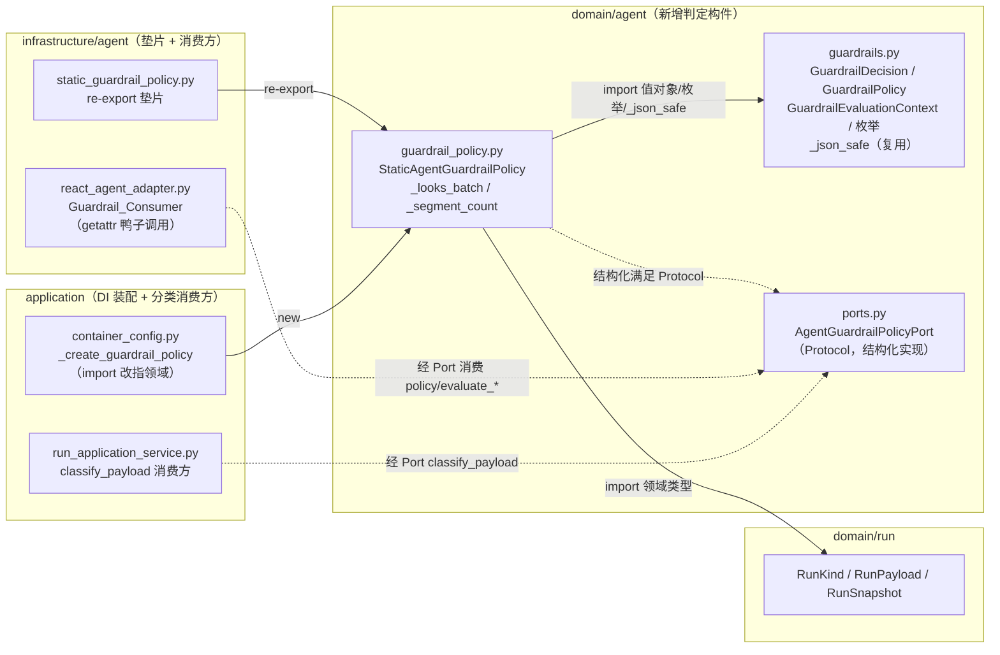
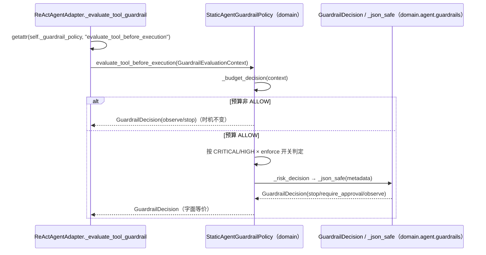

# 设计文档：贫血领域模型单子域充血化试点（domain/agent）

## 概述

本设计落地 `domain/agent` 子域的充血化试点，全程为**行为等价的纯重构**（`Behavior_Equivalent_Refactor`）：把现居 `infrastructure/agent/static_guardrail_policy.py::StaticAgentGuardrailPolicy`（216 行、只 import 领域类型、无 I/O/框架依赖）的全部纯判定逐条字面等价上提到领域层新增文件 `src/domain/agent/guardrail_policy.py`，承载任务分类（`classify_run`/`classify_payload` 及启发式 `_looks_batch`/`_segment_count`）与护栏决策（四个 `evaluate_*` 与内部 `_budget_decision`/`_risk_decision`）。领域类**直接结构化实现**领域内既有 `AgentGuardrailPolicyPort`（`domain/agent/ports.py` 的 `Protocol`），基础设施 `static_guardrail_policy.py` 降为薄 re-export 垫片以零风险保护既有 import 路径，DI 装配点改指领域类。设计以姊妹 spec `docs/spec/ddd-anemic-domain-pilot/design.md`（ADR-0009，`domain/task`）为可复制范式基准，并严格遵循 `ddd-architecture.md`（依赖方向 `application/infrastructure → domain`、领域层禁用框架/基础设施依赖）、`ddd-tactical-modeling.md` §4（领域服务放置与「零基础设施依赖 + 可脱离运行时单测」标尺）/§8（不引领域事件）、`srp-principle.md`（单一职责、技术关注点不入领域）、`change-discipline.md`（最小改动、逐子域推进）、`adr.md`（架构级决策先写 ADR）、`code-documentation.md`（中文 docstring）、`python-typing-lint.md`（全量类型标注、禁裸 `Any`）、`doc-sync.md`（同步主题文档）。新增 ADR-0014 记录「在 `domain/agent` 引入护栏策略领域服务一等抽象」。

#### 设计决策

| 决策点 | 选定方案 | 理由 |
| --- | --- | --- |
| 领域落点与形态 | 新增 `src/domain/agent/guardrail_policy.py`，**保留类名 `StaticAgentGuardrailPolicy` 迁入领域**（连同 `classify_run`/`classify_payload`/四 `evaluate_*`/`_risk_decision`/`_budget_decision` 及模块级 `_looks_batch`/`_segment_count`），该类**直接结构化实现** `AgentGuardrailPolicyPort` | 该类整文件已只依赖 `domain.agent.guardrails` 与 `domain.run` 领域类型，无 I/O/框架，本就是「纯规则判定却落基础设施」的 `Domain_Logic_In_Infrastructure`，落点属领域服务（§4）。`AgentGuardrailPolicyPort` 是**领域内**的 `Protocol`，领域类结构化满足它是「domain 实现 domain Protocol」，无反向依赖、无 `import ports`（Protocol 结构化匹配无需继承）。保留原类名而非改名（如 `GuardrailEvaluationPolicy`）：`Behavior_Equivalent_Refactor` 追求最小语义漂移，类名不变使既有测试断言与 `isinstance` 语义零变化，仅换 import 路径。 |
| `static_guardrail_policy.py` 处置 | **降为薄 re-export 垫片**：`from domain.agent.guardrail_policy import StaticAgentGuardrailPolicy`（并按需 re-export 模块级 helper），不删除 | 参照 P2 首片 `round_outcome` 垫片范式（ADR-0011）。垫片保护 4 处既有测试 import（`test_static_guardrail_policy_unit.py` 等）与任何潜在 `from infrastructure.agent.static_guardrail_policy import ...` 引用零改动即通过，风险最低；本片作为 `domain/agent` 试点样板不追求同时清理 import 面，删除+改所有引用留待后续片按 `change-discipline` 处理。DI 装配点例外——直接改指领域类（见下）以体现「装配领域实现」的正向样板。 |
| `_json_safe` 归属 | 领域判定**复用 `domain/agent/guardrails.py` 既有 `_json_safe`**，不在 `guardrail_policy.py` 再定义、不留基础设施副本 | `_risk_decision` 在判定内部装配 metadata（`{"tool_name": str｜None, "risk_level": ToolRiskLevel}`）后即调用 `_json_safe`，属判定不可分割的一步，复用同包既有函数使领域类自洽、避免序列化 helper 重复（对齐 §4 与 SRP）。核对结论：`guardrails._json_safe` 为**递归**实现（含 datetime/dict/list/set 分支），`static_guardrail_policy._json_safe` 为**一层 dict 推导**；对本用例的 metadata（一层 dict、值为 `str｜None｜ToolRiskLevel`）两者产出**逐值等价**（`ToolRiskLevel` 是 `StrEnum`、`hasattr .value` 与 `isinstance Enum` 均命中取 `.value`；`str`/`None` 均原样透传）。故复用是行为等价的安全替换；ADR-0008 允许序列化留基础设施，但此处 helper 已在领域同包内、且为判定内嵌步骤，复用更契合。 |
| `classify_run` 处理 | **随类完整上提，保持行为等价**，不因「无运行期消费方」而删除或标注废弃 | `classify_run` 现仅被自身（第 41 行委托 `classify_payload`）与 `test_static_guardrail_policy_unit.py` 引用，运行期消费方（`run_application_service.py:302`）只用 `classify_payload`。但删除会改变类对外表面与既有单测——违反行为等价与最小改动；随迁保留使既有单测零断言改动通过。 |
| DI 装配点改造 | `container_config._create_guardrail_policy` 的 import 改为 `from domain.agent.guardrail_policy import StaticAgentGuardrailPolicy`，`new` 语句与注入的 `agent_guardrail_config.to_policy()` 参数不变 | 装配对外返回类型仍满足 `AgentGuardrailPolicyPort`、注入位置与配置不变（`Contract_Invariance`）；改指领域类而非经垫片，体现「应用层装配领域实现」的正向样板。 |
| 测试策略 | 既有 `test/infrastructure/agent/test_static_guardrail_policy_unit.py` **原地保留、仅将 import 改指领域路径**（或依赖垫片零改），断言不改；**新增** `test/domain/agent/test_guardrail_policy_unit.py` 覆盖全判定分支（脱离运行时） | 对齐 AC5：新增聚焦业务规则、脱离运行时的领域单测置于 `test/domain/agent/`；既有测试仅调 import、不改断言语义（AC5.3）。 |
| ADR-0014 | 新增，`Accepted`，不 supersede ADR-0001；回链 ADR-0009（同类范式来源）、ADR-0010（Agent Loop 归属领域层同源判断） | 引入领域服务一等抽象属架构级决策，`adr.md`/§4 要求先写 ADR（需求 6）。 |

## 架构

改动跨领域层（新增 `guardrail_policy.py` 判定构件）、基础设施层（`static_guardrail_policy.py` 降为垫片）与应用层（DI import 改指）。依赖方向仍为 `application/infrastructure → domain`；领域新增文件仅依赖同层 `domain.agent.guardrails` 与 `domain.run`（与上提前 import 集合等价），并结构化满足同层 `domain.agent.ports.AgentGuardrailPolicyPort`，**无新增反向或跨层依赖**。

### 组件依赖图



### 收敛时序（以工具执行前护栏判定为例）



### 目录/模块落点

| 新增/改动模块 | 内容 |
| --- | --- |
| `src/domain/agent/guardrail_policy.py`（新增） | 承载 `StaticAgentGuardrailPolicy` 全部纯判定 + 模块级 `_looks_batch`/`_segment_count`；复用 `domain.agent.guardrails._json_safe`。 |
| `src/infrastructure/agent/static_guardrail_policy.py`（改：降为垫片） | re-export `StaticAgentGuardrailPolicy`（及被外部引用的模块级 helper），保护既有 import 路径。 |
| `src/application/container_config.py`（改：仅 import） | `_create_guardrail_policy` import 改指 `domain.agent.guardrail_policy`。 |
| `test/domain/agent/test_guardrail_policy_unit.py`（新增） | 领域服务全分支单测（脱离运行时）。 |
| `test/infrastructure/agent/test_static_guardrail_policy_unit.py`（改：仅 import） | import 改指领域路径（或依赖垫片零改），断言不改。 |
| `docs/adr/0014-*.md` + `docs/adr/README.md`（新增/改） | ADR-0014。 |
| `docs/domain-model.md` / `docs/architecture.md`（改） | 按 `doc-sync.md` 同步领域服务落点（需求 4 AC4.6）。 |

> `domain/agent/guardrail_policy.py` 当前不存在，需新建（含模块中文 docstring）。是否将新类登记进 `domain/agent/__init__.py` 的 `__all__`：既有 `StaticAgentGuardrailPolicy` 从不经 `__init__` 导出，为保持最小改动**不新增导出**（消费方经 Port 与垫片访问，不依赖包顶层导出）。

## 组件与接口

领域文件遵循：`from __future__ import annotations`、全量类型标注、禁裸 `Any`（分类启发式对 `dict[str, Any]` 的既有用法保留）、中文 docstring、无 `application`/`infrastructure`/框架/Pydantic 导入。

### 1. `StaticAgentGuardrailPolicy`（领域服务，需求 2/3/4）

- **位置**：`src/domain/agent/guardrail_policy.py`
- **职责**：承载护栏领域判定的单一职责——任务类型分类与预算/风险护栏决策；结构化实现 `AgentGuardrailPolicyPort`。零基础设施依赖、可脱离运行时单测。
- **导入集合**（与上提前逐一等价）：`from domain.agent.guardrails import (GuardrailAction, GuardrailDecision, GuardrailEvaluationContext, GuardrailMode, GuardrailPolicy, GuardrailReason, TaskExecutionClass, ToolRiskLevel, _json_safe)`；`from domain.run import RunKind, RunPayload, RunSnapshot`。相较上提前**新增复用** `guardrails._json_safe` 并**移除**基础设施本地 `_json_safe` 定义（见「设计决策」第 3 行）。
- **构造与属性**：`__init__(self, policy: GuardrailPolicy) -> None` 存 `self._policy`；`@property policy -> GuardrailPolicy` 返回 `self._policy`——签名与语义字面不变（消费方经 `getattr(_, "policy", None)` 读取，见 `react_agent_adapter.py:565`）。

完整签名（逐一等价迁移，docstring 保留/补全为中文说明职责与不变量）：

```python
"""domain/agent 护栏策略领域服务。

承载 Agent 护栏的任务类型分类与预算/风险护栏判定，为零基础设施依赖的
领域服务（Domain_Service）：仅依赖 domain.agent.guardrails 与 domain.run
的领域类型，无 I/O、无 ContextVar、无 OTel、无 logging、无 Pydantic，可
脱离运行时单元测试。本类结构化实现 domain.agent.ports.AgentGuardrailPolicyPort
（Protocol，无需继承）；不变量：所有判据、检查顺序、比较运算符、None 短路
语义、OBSERVE/ENFORCE 分支与上提前逐一等价（Behavior_Equivalent_Refactor）。
"""

from __future__ import annotations

from typing import Any

from domain.agent.guardrails import (
    GuardrailAction,
    GuardrailDecision,
    GuardrailEvaluationContext,
    GuardrailMode,
    GuardrailPolicy,
    GuardrailReason,
    TaskExecutionClass,
    ToolRiskLevel,
    _json_safe,
)
from domain.run import RunKind, RunPayload, RunSnapshot


class StaticAgentGuardrailPolicy:
    """基于确定性规则和静态配置的护栏策略领域服务。"""

    def __init__(self, policy: GuardrailPolicy) -> None: ...

    @property
    def policy(self) -> GuardrailPolicy: ...

    def classify_run(self, snapshot: RunSnapshot) -> TaskExecutionClass:
        """根据 Run 快照确定任务类型（LONG_TASK 判据 + 委托 classify_payload）。"""

    def classify_payload(
        self, payload: RunPayload, *, has_tools: bool
    ) -> TaskExecutionClass:
        """根据 payload 与工具可用性确定任务类型。"""

    def evaluate_run_start(
        self, context: GuardrailEvaluationContext
    ) -> GuardrailDecision:
        """Run/segment 开始前评估（委托 _budget_decision）。"""

    def evaluate_model_completed(
        self, context: GuardrailEvaluationContext
    ) -> GuardrailDecision:
        """模型调用后评估预算与上下文增长（委托 _budget_decision）。"""

    def evaluate_tool_before_execution(
        self, context: GuardrailEvaluationContext
    ) -> GuardrailDecision:
        """工具执行前评估：先预算判定，非 ALLOW 直接返回；再按风险门判定。"""

    def evaluate_tool_after_execution(
        self, context: GuardrailEvaluationContext
    ) -> GuardrailDecision:
        """工具执行后评估失败计数（委托 _budget_decision）；不撤销副作用。"""

    def _risk_decision(
        self, *, action: GuardrailAction, context: GuardrailEvaluationContext, message: str
    ) -> GuardrailDecision:
        """按 OBSERVE/ENFORCE 模式返回风险决策，metadata 经 _json_safe 归一。"""

    def _budget_decision(
        self, context: GuardrailEvaluationContext
    ) -> GuardrailDecision:
        """按 token/duration/context_growth/repeated_tool/consecutive_failure 阈值判定。"""


def _looks_batch(data: dict[str, Any]) -> bool:
    """启发式判定 payload 是否为批量任务（items/batch/targets/inputs 或 constraints 含「批量」）。"""


def _segment_count(metadata: dict[str, Any] | None) -> int:
    """从 segment_metadata 容错读取 segment_count（转 int，异常归 0）。"""
```

> 方法体逐行从 `infrastructure/agent/static_guardrail_policy.py` 原样迁移，**唯一改动**是 `_risk_decision` 内两处 `_json_safe(metadata)` 现引用 `domain.agent.guardrails._json_safe`（行为等价，见设计决策第 3 行），且移除基础设施本地 `_json_safe` 定义。`_budget_decision` 的 5 项 `checks` 列表（顺序、`>=` 运算符、`None` 短路、OBSERVE→`observe`/ENFORCE→`stop`）字面不变；`classify_run` 的 `latest_checkpoint_id / can_continue / _segment_count > 1` 判据与 `classify_payload` 的 `_looks_batch → BATCH_TASK`、`RunKind.TASK × has_tools` 分派字面不变。

### 2. `AgentGuardrailPolicyPort`（既有，契约不变，需求 3）

- **位置**：`src/domain/agent/ports.py:170-203`（`Protocol`）
- **本 spec 不改其方法名/签名**：`classify_payload(self, payload: Any, *, has_tools: bool) -> TaskExecutionClass`、`evaluate_run_start`/`evaluate_model_completed`/`evaluate_tool_before_execution`/`evaluate_tool_after_execution(self, context: GuardrailEvaluationContext) -> GuardrailDecision`。
- `StaticAgentGuardrailPolicy`（领域）结构化满足该 Protocol：`classify_payload` 与四 `evaluate_*` 签名一致（领域类的 `classify_payload` 形参为 `RunPayload`，是 Port `payload: Any` 的兼容特化，鸭子/结构化匹配成立，与上提前一致）。`classify_run` / `policy` 属性不在 Port 契约内，但被消费方经 `getattr` 使用，随类保留即可用。

### 3. 基础设施垫片（需求 3）

- **位置**：`src/infrastructure/agent/static_guardrail_policy.py`
- **形态**：模块 docstring + re-export，形如：

```python
"""静态 Agent guardrail 策略（re-export 垫片）。

判定逻辑已上提至 domain/agent/guardrail_policy.py（ADR-0014）。本模块保留为
向后兼容垫片，re-export 领域实现，保护既有 import 路径与测试引用；后续片可
按 change-discipline 删除本垫片并改所有引用点。
"""

from __future__ import annotations

from domain.agent.guardrail_policy import (
    StaticAgentGuardrailPolicy,
    _looks_batch,
    _segment_count,
)

__all__ = ["StaticAgentGuardrailPolicy", "_looks_batch", "_segment_count"]
```

> `_looks_batch`/`_segment_count` 一并 re-export，覆盖既有单测可能的模块级 helper 直接 import（若既有测试只 import 类，则这两个 re-export 为防御性冗余，`__all__` 显式声明避免 lint 未使用告警）。

## 数据模型

本重构不改任何持久化 schema、DDL、线格式或既有值对象字段。**不新增任何数据构件**：任务分类复用 `TaskExecutionClass`（`domain/agent/guardrails.py`），护栏决策复用 `GuardrailDecision`/`GuardrailEvaluationContext`/`GuardrailPolicy` 与全部枚举，Run 类型复用 `RunKind`/`RunPayload`/`RunSnapshot`。`GuardrailDecision.metadata` 的对外产出经 `_json_safe` 归一，替换为领域同包等价实现后**逐值不变**。领域服务为无字段（仅持 `_policy` 引用）类。

## 事务与并发边界

本 spec 为行为等价纯重构，**不新增、不改变任何写操作、事务边界、并发语义或幂等键**。领域服务只做纯判定（返回 `TaskExecutionClass` / `GuardrailDecision` / `bool` / `int`），不触发任何持久化、Redis/文件写入、消息投递或 I/O，不含 `async`。护栏观测的持久化（`RunGuardrailRecorderPort.record_observation`）、OTel span、guardrail 运行时统计累加（`_GuardrailRuntimeAccumulator`）全部留在 `react_agent_adapter.py`，调用位置与时机不动；评估阶段（run_start / model_completed / tool_before / tool_after）的调用时序不变。因此本节按「无写路径变更」结论存在但不引入新的一致性边界。

## 正确性属性

### Property 1（任务分类判据逐一等价）
对任意 `RunSnapshot`：`classify_run` 当且仅当 `latest_checkpoint_id is not None or can_continue or _segment_count(segment_metadata) > 1` 返回 `LONG_TASK`，否则委托 `classify_payload(payload, has_tools=True)`；对任意 `RunPayload` 与 `has_tools`：`classify_payload` 依 `_looks_batch → BATCH_TASK`、`RunKind.TASK × has_tools → TOOL_TASK/LONG_TASK`、其余 `× has_tools → TOOL_TASK/SHORT_QA`。与上提前逐一等价。
验证需求：需求 2 AC2.2 / AC2.5。
验证策略：`test/domain/agent/test_guardrail_policy_unit.py` 参数化覆盖 checkpoint/can_continue/segment_count 三条 LONG_TASK 触发分支与 payload 委托分支、batch/task/chat × has_tools 全组合；既有 `test_static_guardrail_policy_unit.py` 全绿。

### Property 2（预算判定阈值逐一等价，含顺序/短路/模式）
对任意 `GuardrailEvaluationContext` 与 `GuardrailPolicy`：`_budget_decision` 按 token→duration(`×1000`)→context_growth→repeated_tool→consecutive_failure 的固定顺序、`>=` 比较、`None` 阈值短路，首个命中项在 OBSERVE 模式返回 `observe`、ENFORCE 模式返回 `stop`，无命中返回 `allow`；`evaluate_run_start`/`evaluate_model_completed`/`evaluate_tool_after_execution` 均委托 `_budget_decision`。与上提前逐一等价。
验证需求：需求 2 AC2.3 / AC2.4。
验证策略：单测覆盖每条阈值单独命中、`None` 短路、OBSERVE vs ENFORCE、多阈值同时满足时命中顺序（token 优先），及三个 `evaluate_*` 委托一致性。

### Property 3（风险门判定逐一等价）
对任意 context：`evaluate_tool_before_execution` 先跑 `_budget_decision`，非 ALLOW 直接返回该决策；否则 `CRITICAL + enforce_critical_tools → _risk_decision(STOP)`、`HIGH + enforce_high_risk_tools → _risk_decision(REQUIRE_APPROVAL)`、其余 `allow`；`_risk_decision` 在 OBSERVE 模式降级为 `observe`、ENFORCE 模式按 action 返回 `require_approval`/`stop`，metadata 经 `_json_safe` 归一后 `{"tool_name","risk_level"}` 产出不变。与上提前逐一等价。
验证需求：需求 2 AC2.3；需求 3 AC3.4。
验证策略：单测覆盖预算非 ALLOW 短路、CRITICAL/HIGH × enforce 开关 4 组、OBSERVE 降级；断言 `metadata` 的 `risk_level` 为 `ToolRiskLevel.value`（枚举转 value）、`tool_name` 透传。

### Property 4（启发式边界逐一等价）
对任意 `dict`：`_looks_batch` 当且仅当 `items/batch/targets/inputs` 之一为长度 > 1 的 list，或 `constraints` 为含「批量」子串的 list 时为 True；`_segment_count` 对非 dict 返回 0、对 `segment_count` 容错转 int（`TypeError/ValueError` 归 0）。与上提前字面不变。
验证需求：需求 2 AC2.5。
验证策略：单测覆盖长度 0/1/2 的列表、非 list 值、`constraints` 含/不含「批量」、`segment_count` 缺失/非数字/合法值边界。

### Property 5（端口契约与消费方时序不变）
`AgentGuardrailPolicyPort` 方法名/签名不变；领域 `StaticAgentGuardrailPolicy` 结构化满足该 Port；`Guardrail_Consumer` 经 `getattr` 读取的 `policy` 属性与三个 `evaluate_*` 可用、返回 `GuardrailDecision` 语义不变；`classify_payload` 消费方（`run_application_service.py:302`）经 `getattr` 调用不变；DI `_create_guardrail_policy` 返回类型仍满足 Port、注入配置不变。
验证需求：需求 3 AC3.1 / AC3.2 / AC3.3。
验证策略：既有 `test_react_agent_guardrail_unit.py`/`test_react_agent_guardrail_runtime.py`/`test_workflow_hitl_guardrail_regression_unit.py`/`test_container_config.py` 及运行时收敛集成测试全绿。

### Property 6（领域服务零基础设施依赖，可脱离运行时单测）
`domain/agent/guardrail_policy.py` 不 import `application`/`infrastructure`/框架/Pydantic/logging/OTel/ContextVar；仅依赖 `domain.agent.guardrails` 与 `domain.run`；新增单测无需运行时即可执行。
验证需求：需求 4 AC4.1 / AC4.2 / AC4.4；需求 5 AC5.1。
验证策略：`grep -rnE "import (application|infrastructure|fastapi|pydantic|logging)" src/domain/agent/guardrail_policy.py` 期望零命中；`grep -n "ContextVar\|opentelemetry" src/domain/agent/guardrail_policy.py` 零命中；`ruff`/`pyright` 零新增错误；新增单测仅 import `domain.*`。

### Property 7（不引领域事件/新依赖）
`guardrail_policy.py` 不引入任何第三方依赖、不引入领域事件或事件总线构件。
验证需求：需求 4 AC4.5；需求 6 AC6.3。
验证策略：`grep -n "event_bus\|DomainEvent\|publish" src/domain/agent/guardrail_policy.py` 零命中；依赖清单不变（不改 `pyproject.toml`）。

### Property 8（既有测试全绿）
`PYTHONPATH=src uv run --frozen pytest` 收敛前后全绿；import 路径调整不改断言语义。
验证需求：需求 2 AC2.6；需求 3（隐含）；需求 5 AC5.3 / AC5.4。
验证策略：全量 pytest。

## 错误处理

- **复用既有错误模型，不引入新错误返回风格**：领域服务不 `raise` 任何异常、不新增 try/except、不吞异常。判定结果以 `GuardrailDecision`（`allow`/`observe`/`require_approval`/`stop`）或 `TaskExecutionClass`/`bool`/`int` 表达，与上提前一致。
- **护栏「阻断」不是异常**：`evaluate_tool_before_execution` 返回 `GuardrailDecision(action=STOP/REQUIRE_APPROVAL)`，由 `react_agent_adapter.py` 的 `interpret_tool_guardrail_decision` 与既有分支（`guardrail_branch == "stop"/"require_approval"`）处理，异常/审批中断路径与文案全部留在消费方，位置与时机不变。
- **容错语义保留**：`_segment_count` 对 `TypeError/ValueError` 的 `except` 归 0、`_looks_batch` 的类型守卫（`isinstance`）与上提前字面一致，不新增/删除任何守卫。
- `GuardrailPolicy` 阈值校验异常（`__post_init__` 抛 `ValueError`）仍由 `domain/agent/guardrails.py` 承载，本 spec 不触及。

## 测试策略

采用「新增聚焦业务规则的单元测试（脱离运行时）+ 既有测试作回归」，统一用项目既有 `pytest`（`PYTHONPATH=src uv run --frozen pytest`）。

1. **领域服务单元测试（新增，主力）**——`test/domain/agent/test_guardrail_policy_unit.py`，仅 import `domain.*`（AC5.1），覆盖全判定分支（AC5.2）：
   - `classify_run`：checkpoint / can_continue / segment_count>1 三条 LONG_TASK 触发 + payload 委托（追溯 需求 2，Property 1）。
   - `classify_payload`：batch / (task × has_tools) / (chat × has_tools) 全组合（Property 1）。
   - `_budget_decision`：每条阈值单独命中、`None` 短路、OBSERVE vs ENFORCE、多阈值命中顺序（Property 2）。
   - `evaluate_tool_before_execution`：预算非 ALLOW 短路、CRITICAL/HIGH × enforce 开关、OBSERVE 降级、metadata `_json_safe` 归一（Property 3）；三个委托型 `evaluate_*` 与 `_budget_decision` 一致（Property 2）。
   - `_looks_batch` / `_segment_count`：列表长度 0/1/2、非 list、`constraints` 含/不含「批量」、`segment_count` 缺失/非数字/合法（Property 4）。
2. **既有测试回归（仅调 import）**——`test/infrastructure/agent/test_static_guardrail_policy_unit.py` 的 `from infrastructure.agent.static_guardrail_policy import StaticAgentGuardrailPolicy` 依赖垫片可零改通过；若 lint 要求直指领域，则改为 `from domain.agent.guardrail_policy import StaticAgentGuardrailPolicy`，**断言不改**（AC5.3）。`test_react_agent_guardrail_unit.py`/`test_react_agent_guardrail_runtime.py`/`test_workflow_hitl_guardrail_regression_unit.py` 验证消费方经 Port 的时序、决策语义、metadata 产出等价（Property 3/5/8）。
3. **依赖与规范门禁**——`grep` 验证 `domain/agent/guardrail_policy.py` 无 `application`/`infrastructure`/框架/Pydantic/logging/OTel/ContextVar/事件构件依赖（Property 6/7）；`ruff`/`pyright` 零新增错误、禁裸 `Any`、中文 docstring（需求 4，Property 6）。
4. **全量门禁**——`PYTHONPATH=src uv run --frozen pytest`（Property 8）。

### AC → 交付物追溯表

| AC | 交付物 / 设计位置 | 验证 |
| --- | --- | --- |
| 1.1–1.4 | 改动仅落 `domain/agent/`（新增 `guardrail_policy.py`）+ `static_guardrail_policy.py` 垫片 + `container_config` import + `test/domain/agent/`；不触 `agent_config`/`approval_policy_provider`/`segmented_orchestration`；不改 `guardrails.py` 与 Agent Loop 编排 | Property 6/8；grep 改动范围 |
| 2.1 | 领域服务位于 `domain/agent/guardrail_policy.py`、零基础设施依赖 | Property 6 |
| 2.2 | `classify_run`/`classify_payload` 判据等价 | Property 1 |
| 2.3 | `_budget_decision` + 风险门等价 | Property 2/3 |
| 2.4 | `evaluate_*` 委托 `_budget_decision` 等价 | Property 2 |
| 2.5 | `_looks_batch`/`_segment_count` 判据字面不变 | Property 1/4 |
| 2.6 | — | Property 8 |
| 3.1 | `AgentGuardrailPolicyPort` 方法名/签名不变 | Property 5 |
| 3.2 | 消费方 `policy` + 三 `evaluate_*` 语义不变，值对象字段/时序不变 | Property 5 |
| 3.3 | DI 装配对外行为/返回类型/配置注入不变 | Property 5 |
| 3.4 | `_json_safe` 归属：复用 `guardrails._json_safe`，metadata 产出不变 | Property 3；设计决策第 3 行 |
| 4.1–4.4 | 原生类型/无 Pydantic/框架；仅依赖 `guardrails`+`run`；中文 docstring；全量类型标注禁裸 Any；SRP 单一判定 | Property 6；测试策略 3 |
| 4.5 | 不引第三方依赖/领域事件 | Property 7 |
| 4.6 | 同步 `domain-model.md`/`architecture.md` 与索引 | doc-sync 交付项 |
| 5.1–5.4 | `test/domain/agent/test_guardrail_policy_unit.py` 覆盖正例/边界/异常、脱离运行时；既有测试仅调 import、断言不改、全绿 | 测试策略 1/2；Property 8 |
| 6.1–6.4 | ADR-0014（Accepted、回链 0009/0010、不 supersede 0001、只覆盖 `StaticAgentGuardrailPolicy`） | ADR 草案要点 |

## ADR-0014 草案要点

- **编号/文件**：`docs/adr/0014-introduce-guardrail-domain-service-in-agent-subdomain.md`（落地时 `ls docs/adr/` 核验，现最新为 0013，取 0014）；标题「在 domain/agent 引入护栏策略领域服务一等抽象（充血化试点）」；状态 `Accepted`；日期 2026-07-07；在 `docs/adr/README.md` 索引表追加 0014 行。
- **背景**：`domain/agent` 的护栏判定（任务分类、预算/风险决策、分类启发式）纯规则却落在 `infrastructure/agent/static_guardrail_policy.py`，只 import 领域类型、无 I/O/框架，是典型 `Domain_Logic_In_Infrastructure`（与 ADR-0010 对 Agent Loop 判断同源）。ADR-0009 已在 `domain/task` 建立可复制范式。
- **决策**：在 `domain/agent/guardrail_policy.py` 引入承载全部纯判定的领域服务（保留类名 `StaticAgentGuardrailPolicy`），结构化实现同层 `AgentGuardrailPolicyPort`（Protocol，无反向依赖）；`_json_safe` 复用 `domain/agent/guardrails.py` 既有等价实现；`infrastructure/agent/static_guardrail_policy.py` 降为 re-export 垫片；DI 装配改指领域类。
- **后果**：护栏领域判定住进领域层、可脱离运行时单测；本试点只覆盖 `StaticAgentGuardrailPolicy`，`agent_config`/`approval_policy_provider`/`segmented_orchestration` 留待后续按 `change-discipline` 逐候选推进；本决策为 `Behavior_Equivalent_Refactor`，不改任何对外可观测行为、不引第三方依赖、不引领域事件（尊重 §8 与 ADR-0001，**不 supersede ADR-0001**）；回链 ADR-0009（范式来源）、ADR-0010（同源方向判断）。
- **备选方案与未采纳原因**：(a) 维持散落——被否，即差距本身；(b) 领域类改名 `GuardrailEvaluationPolicy`——被否，增加既有测试断言/`isinstance` 语义漂移，违反最小改动；(c) `_json_safe` 留基础设施副本——被否，判定内嵌步骤重复序列化 helper，且领域同包已有等价实现；(d) 直接删除基础设施文件+改全部引用——被否（本片），扩大改动面、偏离最小改动，留待后续片；(e) 让领域类显式继承 Port——被否，Protocol 结构化匹配无需继承，显式继承反增耦合。

## Clarification Loop（自评估）

对上述草案做了 trade-off / 安全 / 开放问题自评估：

- **无安全/隐私风险**：本 spec 为纯判定收敛，不触及 authn/authz、多租户隔离、PII、输入信任边界或注入面；护栏 CRITICAL/HIGH × enforce 开关与预算阈值语义逐条保留、未放宽。
- **无写路径/事务变更**：见「事务与并发边界」。
- 以下为已按需求/规范作出、但值得你确认的**低风险取舍**（已写入设计，认可即定稿）：

1. **`static_guardrail_policy.py` 处置**：设计选「降为 re-export 垫片」（最小改动、零风险保护既有 import），而非「删除 + 改所有引用点」。垫片会留下一个转发模块，后续片再清理。是否认可垫片方案，还是要求本片即删除基础设施文件并改全部引用（含 DI 与既有测试 import）？

2. **领域类名**：设计选保留 `StaticAgentGuardrailPolicy` 原名迁入领域（避免测试/`isinstance` 语义漂移）。备选是改名为语义更「领域服务」的 `GuardrailEvaluationPolicy`。推荐保留原名。是否认可，或要求改名？

3. **`_json_safe` 复用**：设计让领域 `_risk_decision` 复用 `domain/agent/guardrails._json_safe`（递归实现，对本用例 metadata 与原一层实现逐值等价），移除基础设施本地副本。备选是在 `guardrail_policy.py` 内保留一份一层实现。推荐复用同包既有函数（自洽、不重复）。是否认可复用，还是坚持独立副本？

若以上均认可，我将视设计为最终版；如需调整请按编号答复，我会就地更新 `design.md` 并复评。
