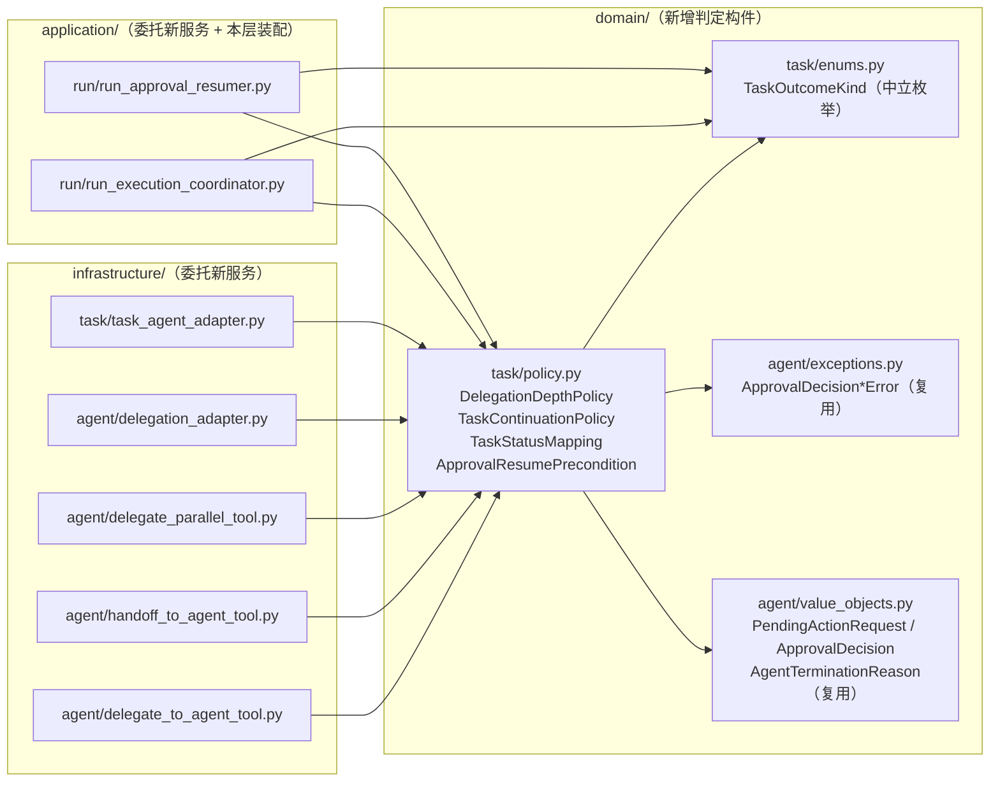
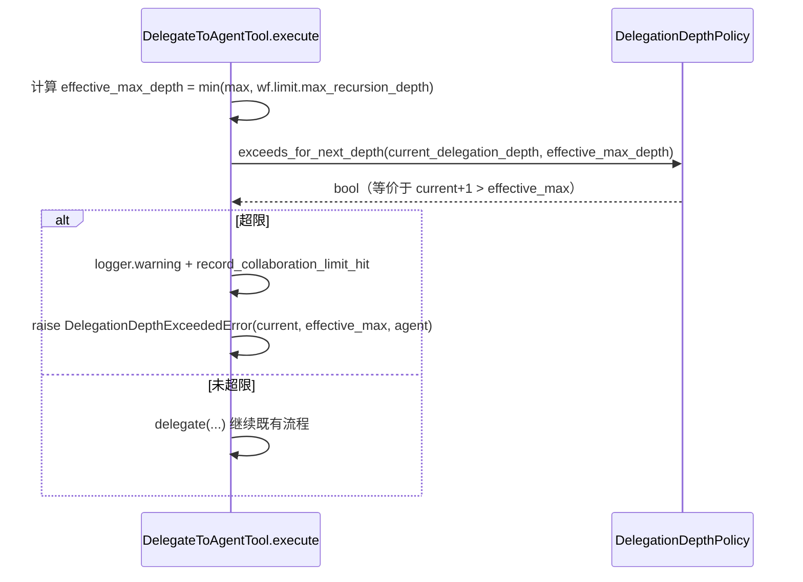

# 设计文档：贫血领域模型单子域充血化试点（domain/task）

## 概述

本设计落地 `domain/task` 子域的充血化试点，全程为**行为等价的纯重构**（`Behavior_Equivalent_Refactor`）：在 `domain/task/policy.py` 新增 4 个零基础设施依赖的领域服务（`DelegationDepthPolicy` / `TaskContinuationPolicy` / `TaskStatusMapping` / `ApprovalResumePrecondition`），把散落在委派工具/委派适配器、`TaskAgentAdapter`、`run_execution_coordinator`、`run_approval_resumer` 中的领域判定收敛进领域层，各调用点改为委托新服务；I/O、日志、序列化、`RunStatus` 装配等技术关注点全部留在原层。设计严格遵循 `ddd-architecture.md`（依赖方向 `application/infrastructure → domain`、领域层禁用框架/基础设施依赖）、`ddd-tactical-modeling.md` §4（领域服务放置与「零基础设施依赖 + 可脱离运行时单测」验收标尺）/§8（不引入领域事件）、`srp-principle.md`（单一职责判定、技术关注点不入领域）、`code-documentation.md`（中文 docstring）、`python-typing-lint.md`（全量类型标注、禁裸 `Any`）、`change-discipline.md`（最小改动、逐子域推进），并以既有 `domain/run/state_machine.py::RunStateMachine`、`domain/workspace/policy.py::WorkspacePolicy` 为职责与命名基准。新增 ADR-0009 记录「在 `domain/task` 引入领域服务一等抽象」的决策。

#### 设计决策

| 决策点 | 选定方案 | 理由 |
| --- | --- | --- |
| 4 个领域服务的文件落点 | 统一置于新增文件 `src/domain/task/policy.py` | 对齐既有具名样板 `domain/workspace/policy.py`（纯函数式策略）与 `ddd-tactical-modeling.md` §4「与既有样板一致的具名模块」；4 个构件同属「task 子域的领域判定」，同文件便于作为其他子域的可复制样板；不新增 `repository.py`（AC6.4）。 |
| `DelegationDepthPolicy` 需同时表达两类判据 | 提供两个方法：`exceeds_for_next_depth(current, max)`（判 `current+1 > max`）与 `exceeds_for_current_depth(current, max)`（判 `current > max`） | requirement AC2.4 指出 4 个调用点判据不一致：三个工具用 `next_depth = current+1; next_depth > max`，而 `delegation_adapter.delegate_parallel._one` 用 `delegation_depth > max`（其入参已是 `next_depth`），`delegation_adapter.handoff` 用 `delegation_depth + 1 > max`。逐调用点保持各自判据不变、不统一，故服务需两个语义清晰的方法覆盖两类判据。 |
| 领域服务不返回 `RunStatus`（需求 4） | `TaskStatusMapping` 返回 domain/task 内新增的中立枚举 `TaskOutcomeKind`；应用层再装配为 `RunStatus` / `ApprovalResumeStoreResult` | 避免 `domain/task → domain/run` 反向依赖（`RunStatus` 属 `domain/run`）；领域只做「task 状态 → 中立结局类别」判定，跨上下文的状态语义装配留在应用层（AC4.1/AC4.3）。 |
| 审批异常类型归属 | 复用现居 `domain/agent/exceptions.py` 的 `ApprovalDecisionCountMismatchError` / `ApprovalDecisionOrderMismatchError` / `ApprovalDecisionNotAllowedError`，不新建、不迁移 | 三者已在领域层（`domain/agent`），`domain/task` 与 `domain/agent` 同层可依赖（`value_objects.py` 已 `import domain.agent.value_objects`）；异常类型、参数、触发时机保持不变（AC5.3）。 |
| I/O / 序列化 / 上下文判定的边界 | `ApprovalStateStorePort` 的 `load`/`is_expired`/`consume`、`_can_continue_from_context`（依赖 `ConversationContext`/`ToolRegistry`）、`_json_safe` 均留原处 | 尊重 SRP 与 ADR-0008；领域服务只承载纯判定（AC3.4、AC4.4、AC5.4）。 |
| 领域服务构件形态 | 4 个均为**无状态类**（方法可为 `staticmethod` 或实例方法），Python 原生类型入参、无 Pydantic、无 `@dataclass` 字段 | 对齐 `RunStateMachine`（类 + 方法承载判定）；构件无独立标识、只承载判定，不需字段（AC6.1）。 |
| ADR-0009 | 新增，`Accepted`，不 supersede ADR-0001 | 引入领域服务一等抽象属架构级决策，`change-discipline.md` §2 / `ddd-tactical-modeling.md` §4 要求先写 ADR（AC8）。 |

## 架构

改动跨领域层（新增判定构件）与既有 4 处调用点（3 处基础设施 + 2 处应用），依赖方向仍为 `application/infrastructure → domain`，`domain/task` 仅新增对同层 `domain/agent` 的依赖（既已存在），无新增反向依赖。

### 组件依赖图



### 收敛时序（以委派深度判定为例）



### 目录/模块落点

| 新增/改动模块 | 内容 |
| --- | --- |
| `src/domain/task/enums.py`（新增） | `TaskOutcomeKind` 中立结局枚举（需求 4）。 |
| `src/domain/task/policy.py`（新增） | 4 个领域服务。 |
| `src/infrastructure/agent/delegate_to_agent_tool.py`（改） | 深度判定改调 `DelegationDepthPolicy.exceeds_for_next_depth`。 |
| `src/infrastructure/agent/handoff_to_agent_tool.py`（改） | 深度判定改调 `DelegationDepthPolicy.exceeds_for_next_depth`。 |
| `src/infrastructure/agent/delegate_parallel_tool.py`（改） | 工具层深度判定改调 `exceeds_for_next_depth`。 |
| `src/infrastructure/agent/delegation_adapter.py`（改） | `delegate_parallel._one` 改调 `exceeds_for_current_depth`；`handoff` 改调 `exceeds_for_next_depth`。 |
| `src/infrastructure/task/task_agent_adapter.py`（改） | `_to_task_result` 委托 `TaskContinuationPolicy`；`_load_consumed_interrupt` 委托 `ApprovalResumePrecondition`。 |
| `src/application/run/run_execution_coordinator.py`（改） | `_task_outcome` 委托 `TaskStatusMapping`，本层装配 `RunStatus`。 |
| `src/application/run/run_approval_resumer.py`（改） | `_task_result_to_store_result` 委托 `TaskStatusMapping`，本层装配 `ApprovalResumeStoreResult`。 |
| `test/domain/task/`（新增测试） | 4 个领域服务单测。 |
| `docs/adr/0009-*.md` + `docs/adr/README.md`（新增/改） | ADR-0009。 |

> `domain/task/enums.py` 当前不存在，需新建（含模块中文 docstring）；`domain/task/policy.py` 同。

## 组件与接口

所有领域服务均遵循：`from __future__ import annotations`、全量类型标注、禁裸 `Any`、中文 docstring、无 `application`/`infrastructure`/框架导入。

### 1. `DelegationDepthPolicy`（需求 2）

- **位置**：`src/domain/task/policy.py`
- **职责**：承载委派深度上限判定；提供两个方法以逐一表达 4 个调用点的两类现有判据，不统一二者差异。

```python
class DelegationDepthPolicy:
    """委派深度上限判定领域服务。

    收敛散落在委派工具与委派适配器中的深度判据。刻意提供两个方法以
    保留调用点间既有的判据差异（见 requirement AC2.4），不借收敛之名统一：

    - exceeds_for_next_depth：三个委派工具与 handoff 适配器的「下一层是否超限」判据；
    - exceeds_for_current_depth：delegate_parallel 内部「当前深度是否超限」判据。

    本服务零基础设施依赖、不感知 workflow_context；effective_max_depth 的
    min(...) 计算仍由各调用点在传入前完成，本服务只做纯比较判定。
    """

    @staticmethod
    def exceeds_for_next_depth(current_depth: int, max_delegation_depth: int) -> bool:
        """判定「下一层委派」是否超限。

        等价于既有内联逻辑 ``next_depth = current_depth + 1; next_depth > max``。

        Args:
            current_depth: 当前委派深度（根 Agent 为 0）。
            max_delegation_depth: 已经过 min(...) 归一的有效最大深度。

        Returns:
            当 ``current_depth + 1 > max_delegation_depth`` 时为 True。
        """
        return current_depth + 1 > max_delegation_depth

    @staticmethod
    def exceeds_for_current_depth(current_depth: int, max_delegation_depth: int) -> bool:
        """判定「当前深度」是否超限（delegate_parallel 专用判据）。

        等价于 ``delegation_adapter.delegate_parallel._one`` 的既有逻辑
        ``delegation_depth > max_delegation_depth``；此处入参 ``current_depth``
        承载调用点传入的「子 Agent 实际执行深度」（即 next_depth）。

        Returns:
            当 ``current_depth > max_delegation_depth`` 时为 True。
        """
        return current_depth > max_delegation_depth
```

#### 调用点 before/after（需求 2）

| 调用点 | 现有判据（before） | 收敛后（after） | 保留在原处的副作用 |
| --- | --- | --- | --- |
| `delegate_to_agent_tool.py:161` | `next_depth > effective_max_depth`（`next_depth = current+1`） | `DelegationDepthPolicy.exceeds_for_next_depth(self._current_delegation_depth, effective_max_depth)` | `next_depth`/`effective_max_depth` 计算位置不动；`logger.warning`、`record_collaboration_limit_hit`、`raise DelegationDepthExceededError(current, effective_max, agent)` 全留原处 |
| `handoff_to_agent_tool.py:165` | `next_depth > effective_max_depth` | `DelegationDepthPolicy.exceeds_for_next_depth(self._current_delegation_depth, effective_max_depth)` | `logger.warning`、`record_collaboration_limit_hit`、返回失败字符串 `_failure(...)` 全留原处；`handoff_count` 校验（第 184–201 行）不动 |
| `delegate_parallel_tool.py:219` | `next_depth > effective_max_depth` | `DelegationDepthPolicy.exceeds_for_next_depth(self._current_delegation_depth, effective_max_depth)` | `logger.warning`、`record_collaboration_limit_hit`、`raise DelegationDepthExceededError` 全留原处；并行数量超限判定（第 185–208 行）不动 |
| `delegation_adapter.py::delegate_parallel._one:201` | `delegation_depth > max_delegation_depth`（`delegation_depth` 已是 next_depth） | `DelegationDepthPolicy.exceeds_for_current_depth(delegation_depth, max_delegation_depth)` | 超限时返回 `DelegationResult(success=False, content=<既有中文文案>)` 不变；`_one` 的 try/except 隔离语义不动 |
| `delegation_adapter.py::handoff:283` | `delegation_depth + 1 > max_delegation_depth` | `DelegationDepthPolicy.exceeds_for_next_depth(delegation_depth, max_delegation_depth)` | 超限时 `raise DelegationDepthExceededError(current=delegation_depth, max=max_delegation_depth, target=agent)` 不变 |

> 说明：`delegate_parallel._one` 与 `handoff` 的判据是**不同**方法调用——前者 `exceeds_for_current_depth`，后者 `exceeds_for_next_depth`——因为 `_one` 的入参 `delegation_depth` 已被 `DelegateParallelTool.execute` 传入为 `next_depth`，而 `handoff` 的入参 `delegation_depth` 仍是「当前深度」。两处收敛后行为逐一等价，差异保留（AC2.4）。

### 2. `TaskContinuationPolicy`（需求 3）

- **位置**：`src/domain/task/policy.py`
- **职责**：以 Agent 终止原因判定「是否应产生 PAUSED」，收敛 `_to_task_result` 的内联规则。

```python
from domain.agent.value_objects import AgentTerminationReason

_PAUSE_REASONS: frozenset[str] = frozenset({"max_rounds", "token_budget_exceeded"})


class TaskContinuationPolicy:
    """任务续跑判定领域服务。

    承载「Agent 终止原因 → 任务是否应暂停(PAUSED)」这一领域判定，
    与 TaskAgentAdapter._to_task_result 现有 ``terminated_reason not in
    ("max_rounds", "token_budget_exceeded")`` 逻辑逐一等价。

    不承载 _can_continue_from_context 的上下文可继续性判定（该判定依赖
    ConversationContext / ToolRegistry，属基础设施，留在 TaskAgentAdapter）。
    """

    @staticmethod
    def should_pause(terminated_reason: AgentTerminationReason) -> bool:
        """判定该终止原因是否应产生 PAUSED 分支。

        Returns:
            当 ``terminated_reason`` 属于 {max_rounds, token_budget_exceeded}
            时为 True（PAUSED）；否则为 False（SUCCESS 分支）。
        """
        return terminated_reason in _PAUSE_REASONS
```

#### 调用点 before/after（需求 3）

`TaskAgentAdapter._to_task_result`（`task_agent_adapter.py:275-323`）：

- `approval_required` 分支（第 283–297 行）**完全不动**：仍构造 `TaskResult(status=HUMAN_INTERVENTION_REQUIRED, ..., approval_id=approval.approval_id)`。
- 第 299 行 `terminated_reason = getattr(agent_result, "terminated_reason", "completed")` 保留（infrastructure 侧 getattr 兜底不下沉领域）。
- 第 300 行 `if terminated_reason not in ("max_rounds", "token_budget_exceeded")` **改为** `if not TaskContinuationPolicy.should_pause(terminated_reason)`（等价取反）：
  - True 分支（SUCCESS，第 301–311 行）：`content`/`terminated_reason="completed"`/`can_continue=False`/`prompt_id` 透传等**字面不变**。
  - False 分支（PAUSED，第 313–323 行）：`content=""`/`terminated_reason=terminated_reason`/`can_continue=self._can_continue_from_context(context)` 等**字面不变**——`_can_continue_from_context` 调用留在适配器（AC3.4）。

### 3. `TaskStatusMapping`（需求 4）

- **位置**：`src/domain/task/policy.py`；配套中立枚举 `TaskOutcomeKind` 在 `src/domain/task/enums.py`
- **职责**：把 `TaskStatus`（+ 必要 `terminated_reason`）映射为 domain/task 内的中立结局类别；**不返回 `RunStatus`**（避免反向依赖）。

```python
# src/domain/task/enums.py
from enum import Enum


class TaskOutcomeKind(Enum):
    """任务结局中立类别枚举（领域内判定结果）。

    刻画「任务状态 → 领域中立结局」的判定输出，供应用层再装配为
    domain/run 的 RunStatus 或 ApprovalResumeStoreResult 状态字符串。
    刻意不引用 domain/run 的 RunStatus，避免 domain/task 反向依赖 domain/run。

    Members:
        SUCCEEDED: 任务成功结局（对应 TaskStatus.SUCCESS）。
        PAUSED: 任务暂停结局（对应 TaskStatus.PAUSED）。
        AWAITING_APPROVAL: 等待人工审批结局（对应 HUMAN_INTERVENTION_REQUIRED）。
        FAILED: 任务失败结局（对应 TaskStatus.FAILED 及其余未知状态）。
    """

    SUCCEEDED = "succeeded"
    PAUSED = "paused"
    AWAITING_APPROVAL = "awaiting_approval"
    FAILED = "failed"
```

```python
# src/domain/task/policy.py
from domain.task.enums import TaskOutcomeKind
from domain.task.value_objects import TaskStatus


class TaskStatusMapping:
    """任务状态到中立结局类别的映射领域服务。

    与 run_execution_coordinator._task_outcome 现有分支逐一等价：
    SUCCESS→SUCCEEDED、PAUSED→PAUSED、HUMAN_INTERVENTION_REQUIRED→
    AWAITING_APPROVAL、其余（含 FAILED）→FAILED。输出为中立枚举，
    不返回 RunStatus；到 RunStatus / ApprovalResumeStoreResult 的最终装配
    及 error 结构、terminal_reason、approval_id、can_continue 的构造留在应用层。
    """

    @staticmethod
    def outcome_of(status: TaskStatus) -> TaskOutcomeKind:
        """把任务状态映射为中立结局类别。

        Args:
            status: 任务执行状态枚举。

        Returns:
            对应的 TaskOutcomeKind；未显式覆盖的状态归为 FAILED，
            与既有 ``else -> RunStatus.FAILED`` 兜底逐一等价。
        """
        if status is TaskStatus.SUCCESS:
            return TaskOutcomeKind.SUCCEEDED
        if status is TaskStatus.PAUSED:
            return TaskOutcomeKind.PAUSED
        if status is TaskStatus.HUMAN_INTERVENTION_REQUIRED:
            return TaskOutcomeKind.AWAITING_APPROVAL
        return TaskOutcomeKind.FAILED
```

#### 应用层装配映射表（需求 4）

**`run_execution_coordinator._task_outcome`（`run_execution_coordinator.py:497-536`）**：第 500–507 行的 4 分支 `if/elif/else` 改为先取 `kind = TaskStatusMapping.outcome_of(response.status)`，再按下表装配 `status: RunStatus`（其余 `result`/`error`/`terminal_reason`/`can_continue`/`approval_id`/`segment_metadata` 构造字面不变，`_json_safe`/`_extract_approval_id`/`_segment_metadata` 留原处）：

| `TaskOutcomeKind` | 装配 `RunStatus` | 备注 |
| --- | --- | --- |
| `SUCCEEDED` | `RunStatus.SUCCEEDED` | |
| `PAUSED` | `RunStatus.PAUSED` | |
| `AWAITING_APPROVAL` | `RunStatus.AWAITING_APPROVAL` | |
| `FAILED` | `RunStatus.FAILED` | `error = {"message": response.content, "task_status": response.status.value}` 仍由 `status is RunStatus.FAILED` 触发，等价 |

**`run_approval_resumer._task_result_to_store_result`（`run_approval_resumer.py:123-176`）**：现有分支为 `PAUSED→queued`、`HUMAN_INTERVENTION_REQUIRED→awaiting_approval`、`FAILED→failed`、`else→succeeded`。改为先取 `kind = TaskStatusMapping.outcome_of(response.status)`，按下表装配 `ApprovalResumeStoreResult`（`result` dict、`error`、`terminal_reason`、`approval_id`、各 `*_summary=None` 字面不变）：

| `TaskOutcomeKind` | 装配 `ApprovalResumeStoreResult` |
| --- | --- |
| `PAUSED` | `status="queued", result=result, ...=None`（对应现 `TaskStatus.PAUSED` 分支） |
| `AWAITING_APPROVAL` | `status="awaiting_approval", approval_id=response.approval_id, result=result, ...=None` |
| `FAILED` | `status="failed", error={"message": response.content, "task_status": response.status.value}, terminal_reason="failed", ...=None` |
| `SUCCEEDED` | `status="succeeded", result=result, terminal_reason=str(response.terminated_reason), ...=None`（对应现 `else` 分支） |

> 现 `else` 分支（succeeded）覆盖 `TaskStatus.SUCCESS`；`TaskStatusMapping.outcome_of` 对 `SUCCESS` 返回 `SUCCEEDED`，对未知状态返回 `FAILED`。由于 `TaskStatus` 是封闭枚举（4 值），四个分支与现有 4 分支逐一等价。`_json_safe` 与 `_workflow_phase_can_continue` 留原处（AC4.4）。

### 4. `ApprovalResumePrecondition`（需求 5）

- **位置**：`src/domain/task/policy.py`
- **职责**：对审批决策集合做「数量匹配 / 顺序（tool_call_id 对齐） / 决策类型属于 allowed_decisions」的前置校验，收敛 `_load_consumed_interrupt` 中的校验；复用现居 `domain/agent/exceptions.py` 的异常，异常类型/参数/触发时机不变。

```python
from collections.abc import Sequence

from domain.agent.exceptions import (
    ApprovalDecisionCountMismatchError,
    ApprovalDecisionNotAllowedError,
    ApprovalDecisionOrderMismatchError,
)
from domain.agent.value_objects import ApprovalDecision, PendingActionRequest


class ApprovalResumePrecondition:
    """审批恢复前置条件校验领域服务。

    以待恢复审批的既有动作序列（actions）与恢复请求的决策序列（decisions）
    为输入，逐一校验：决策数量匹配、决策顺序（tool_call_id 对齐）、决策类型
    属于该动作 allowed_decisions。与 TaskAgentAdapter._load_consumed_interrupt
    现有校验逐一等价，任一不满足即抛出既有领域异常，异常类型、参数、触发顺序
    与时机保持不变。

    不承载 ApprovalStateStorePort 的 load / is_expired / consume 等 I/O
    步骤（留在 TaskAgentAdapter），本服务零基础设施依赖、可脱离运行时单测。
    """

    @staticmethod
    def check(
        actions: Sequence[PendingActionRequest],
        decisions: Sequence[ApprovalDecision],
    ) -> None:
        """校验审批决策集合的合法性。

        Args:
            actions: 待审批动作序列（来自 ApprovalInterrupt.actions）。
            decisions: 恢复请求携带的决策序列（TaskApprovalResumeRequest.decisions）。

        Raises:
            ApprovalDecisionCountMismatchError: 决策数量与动作数量不一致。
            ApprovalDecisionOrderMismatchError: 决策 tool_call_id 与动作不对齐。
            ApprovalDecisionNotAllowedError: 决策类型不在动作 allowed_decisions 内。
        """
        if len(decisions) != len(actions):
            raise ApprovalDecisionCountMismatchError(len(actions), len(decisions))
        for action, decision in zip(actions, decisions, strict=True):
            if decision.tool_call_id != action.tool_call_id:
                raise ApprovalDecisionOrderMismatchError(
                    action.tool_call_id,
                    decision.tool_call_id,
                )
            if decision.type not in action.allowed_decisions:
                raise ApprovalDecisionNotAllowedError(
                    action.tool_name,
                    decision.type,
                    frozenset(action.allowed_decisions),
                )
```

#### 调用点 before/after（需求 5）

`TaskAgentAdapter._load_consumed_interrupt`（`task_agent_adapter.py:432-469`）收敛后顺序保持不变：

1. 第 437–438 行 `if self._approval_store is None: raise ApprovalNotFoundError(...)` — **留原处**。
2. 第 440–442 行 `interrupt = await self._approval_store.load(...)` + `if interrupt is None: raise ApprovalNotFoundError(...)` — **留原处**（I/O）。
3. 第 443–444 行 `if interrupt.is_expired(time.time()): raise ApprovalExpiredError(...)` — **留原处**（I/O/时间）。
4. 第 445–461 行（数量/顺序/allowed_decisions 校验）— **替换为** `ApprovalResumePrecondition.check(interrupt.actions, request.decisions)`。
5. 第 463–468 行 `consumed = await self._approval_store.consume(...)` + `if consumed is None: raise ApprovalConsumedError(...)` — **留原处**（原子消费 I/O）。

> 校验被收敛的位置**恰在 `is_expired` 之后、`consume` 之前**，与既有代码时机字面一致；`ApprovalNotFoundError` / `ApprovalExpiredError` / `ApprovalConsumedError` 的触发顺序与时机不变（AC5.5）。适配器仍 `import` 这三个异常（`load`/`consume` 路径需要），仅移除对已收敛的 `ApprovalDecisionCountMismatchError` / `ApprovalDecisionOrderMismatchError` / `ApprovalDecisionNotAllowedError` 的直接 `raise`（这三个 import 是否保留取决于是否仍被引用；收敛后不再直接 raise，移除对应 import 以过 lint）。

## 数据模型

本重构不改任何持久化 schema、DDL、线格式或既有值对象字段。唯一新增的数据构件是**领域内中立判定枚举** `TaskOutcomeKind`（`src/domain/task/enums.py`，见组件 3），它不参与持久化、不出现在任何 HTTP/存储载荷中，仅作为领域服务→应用层装配的中间判定值。4 个领域服务均为无字段的无状态类。`TaskResult` / `RunExecutionOutcome` / `ApprovalResumeStoreResult` 的字段与取值全部字面不变。

## 事务与并发边界

本 spec 为行为等价纯重构，**不新增、不改变任何写操作、事务边界、并发语义或幂等键**。领域服务只做纯判定（布尔/枚举/校验抛异常），不触发任何持久化、Redis/文件写入或消息投递。既有的跨进程/异步语义全部留在原层且时机不变：

- `record_collaboration_limit_hit` / `record_collaboration_step`（`event_store` 写入）在委派工具中的调用位置与时机不动。
- `ApprovalStateStorePort.consume` 的原子消费仍在 `TaskAgentAdapter._load_consumed_interrupt` 内、在前置校验通过之后执行——收敛前置校验不改变「校验先于原子消费」的既有顺序，故不引入新的部分更新窗口。
- `delegate_parallel` 的 `asyncio.gather` 错误隔离并发语义不动，`_one` 仅把内联深度比较替换为等价的服务调用。

## 正确性属性

### Property 1（委派深度 4 调用点判据逐一等价，含差异保留）
对任意 `(current, max)`：三个委派工具与 `delegation_adapter.handoff` 的收敛结果等价于 `current + 1 > max`；`delegation_adapter.delegate_parallel._one` 的收敛结果等价于 `depth > max`（`depth` 为传入的 next_depth）。两类判据差异被保留，未被统一。
验证需求：需求 2 AC2.2 / AC2.3 / AC2.4。
验证策略：`test/domain/task/test_delegation_depth_policy_unit.py` 参数化断言 `exceeds_for_next_depth` 在边界 `current+1 == max`（False）与 `current+1 == max+1`（True）、`exceeds_for_current_depth` 在 `depth == max`（False）与 `depth == max+1`（True）；既有 `test/domain/task/test_task_delegation_depth_properties.py` 及委派工具/适配器既有测试全绿。

### Property 2（续跑判定等价）
对任意 `terminated_reason`：`TaskContinuationPolicy.should_pause` 为 True 当且仅当 `terminated_reason in {max_rounds, token_budget_exceeded}`；`_to_task_result` 的 SUCCESS/PAUSED 分支取值与既有字面等价，`approval_required` 分支、`prompt_id` 透传、`can_continue`、其余字段不变。
验证需求：需求 3 AC3.2 / AC3.3 / AC3.4。
验证策略：`test/domain/task/test_task_continuation_policy_unit.py` 覆盖三个 `AgentTerminationReason` 取值；既有 `test/domain/task/test_task_paused_result_unit.py` 及 task adapter 既有测试全绿。

### Property 3（状态映射 4 分支等价 + 无反向依赖）
`FOR ALL TaskStatus`：`TaskStatusMapping.outcome_of` 输出经应用层装配后与 `_task_outcome` 现有 `RunStatus` 分支、`_task_result_to_store_result` 现有 `status` 分支逐一等价；`domain/task` 不 import `domain/run`。
验证需求：需求 4 AC4.1 / AC4.2 / AC4.3 / AC4.4。
验证策略：`test/domain/task/test_task_status_mapping_unit.py` 断言 4 个 `TaskStatus` → `TaskOutcomeKind` 映射；`grep -rn "domain.run\|domain/run" src/domain/task/` 期望零命中；`run_execution_coordinator` / `run_approval_resumer` 既有测试全绿（验证 error/terminal_reason/approval_id/can_continue 字面不变）。

### Property 4（审批前置校验异常类型/时机等价）
对任意 `(actions, decisions)`：`ApprovalResumePrecondition.check` 抛出的异常类型、参数与既有 `_load_consumed_interrupt` 内联校验逐一等价；`ApprovalNotFoundError` / `ApprovalExpiredError` / `ApprovalConsumedError` 的触发顺序与时机不变（校验位于 is_expired 之后、consume 之前）。
验证需求：需求 5 AC5.2 / AC5.3 / AC5.5。
验证策略：`test/domain/task/test_approval_resume_precondition_unit.py` 覆盖数量不匹配（`ApprovalDecisionCountMismatchError`，含期望/实际计数）、顺序不匹配（`ApprovalDecisionOrderMismatchError`，含期望/实际 tool_call_id）、类型不允许（`ApprovalDecisionNotAllowedError`，含 tool_name/type/allowed 集合）、以及全部合法（无异常）四类分支；task adapter 既有审批恢复测试全绿。

### Property 5（领域服务零基础设施依赖，可脱离运行时单测）
`domain/task/policy.py` 与 `domain/task/enums.py` 不 import `application`/`infrastructure`/框架/Pydantic；4 个领域服务的单测无需运行时即可执行。
验证需求：需求 2 AC2.1、需求 3 AC3.1、需求 4 AC4.1、需求 5 AC5.1、需求 6 AC6.1/AC6.5、需求 7 AC7.3。
验证策略：`grep -rnE "import (application|infrastructure|fastapi|pydantic)" src/domain/task/policy.py src/domain/task/enums.py` 期望零命中；`ruff`/`pyright` 零新增错误；新增单测仅 import `domain.*`。

### Property 6（既有测试全绿）
`PYTHONPATH=src uv run --frozen pytest` 收敛前后全绿；import 路径调整不改断言语义。
验证需求：需求 2 AC2.5、需求 3 AC3.5、需求 4 AC4.5、需求 5 AC5.6、需求 7 AC7.4。
验证策略：全量 pytest。

## 错误处理

- **复用既有错误模型，不引入新错误返回风格**：
  - 委派深度超限沿用既有两条路径——`DelegateToAgentTool` / `DelegateParallelTool` / `delegation_adapter.handoff` 抛 `DelegationDepthExceededError`（`BizException`，code 60011）；`HandoffToAgentTool` / `delegation_adapter.delegate_parallel._one` 返回失败字符串 / `DelegationResult(success=False)`。`DelegationDepthPolicy` **只返回布尔**，不抛异常、不吞异常，超限后的抛异常/返回文案完全由调用点保留。
  - 审批前置校验复用现居 `domain/agent/exceptions.py` 的 `ApprovalDecisionCountMismatchError`（60023）/ `ApprovalDecisionOrderMismatchError`（60024）/ `ApprovalDecisionNotAllowedError`（60025），构造参数逐字段不变。
- **领域服务不承载 I/O 异常**：`ApprovalNotFoundError`（60020）/ `ApprovalExpiredError`（60021）/ `ApprovalConsumedError`（60022）仍由 `TaskAgentAdapter` 在 `load`/`is_expired`/`consume` 路径抛出，位置与时机不变。
- **中立枚举不引错误**：`TaskStatusMapping.outcome_of` 对封闭枚举的兜底 `return FAILED` 等价于既有 `else -> RunStatus.FAILED`，不抛异常；错误结构（`error` dict）仍由应用层构造。
- 领域服务不新增 try/except、不新增日志（`logger.warning` 等全部留在调用点）。

## 测试策略

采用「新增聚焦业务规则的单元测试（脱离运行时）+ 既有测试作回归」，统一用项目既有 `pytest`（`PYTHONPATH=src uv run --frozen pytest`），新测试置于 `test/domain/task/`（AC7.1），仅 import `domain.*`（AC7.3）。

1. **领域服务单元测试（新增，主力）**——覆盖正例与边界/异常分支（AC7.2）：
   - `test_delegation_depth_policy_unit.py`：`exceeds_for_next_depth` / `exceeds_for_current_depth` 的等于上限 vs 超限边界（追溯 需求 2，Property 1）。
   - `test_task_continuation_policy_unit.py`：三个 `AgentTerminationReason` 取值（追溯 需求 3，Property 2）。
   - `test_task_status_mapping_unit.py`：4 个 `TaskStatus` → `TaskOutcomeKind`（追溯 需求 4，Property 3）。
   - `test_approval_resume_precondition_unit.py`：数量/顺序/allowed_decisions 三类失败分支 + 全合法（追溯 需求 5，Property 4）。
2. **回归测试**——委派工具/适配器、task adapter、`run_execution_coordinator`、`run_approval_resumer` 的既有测试仅按需调整 import、不改断言语义（AC7.4）；验证深度判据差异、状态映射字面输出、审批异常时机等价（追溯 Property 1/2/3/4/6）。
3. **依赖与规范门禁**——`grep` 验证 `domain/task` 无 `application`/`infrastructure`/框架/`domain.run` 依赖（Property 3/5）；`ruff`/`pyright` 零新增错误、禁裸 `Any`、新增构件中文 docstring（需求 6，Property 5）。
4. **全量门禁**——`PYTHONPATH=src uv run --frozen pytest`（Property 6）。

## ADR-0009 草案要点

- **编号/文件**：`docs/adr/0009-introduce-domain-services-in-task-subdomain.md`；标题「在 domain/task 引入领域服务一等抽象（充血化试点）」；状态 `Accepted`；日期 2026-07-06；在 `docs/adr/README.md` 索引表追加 0009 行。
- **背景**：`domain/task` 的值对象均为「行为仅限 `__post_init__` 校验」的贫血数据载体（整合报告差距 2 / `ddd-implementation-review` 需求 2）；委派深度、续跑、状态映射、审批前置校验等领域判定散落在 `application`/`infrastructure` 且存在跨调用点重复（委派深度上限在三工具 + 适配器各写一份）。护栏已由 ADR-0007 + `ddd-tactical-modeling.md` 补齐，代码尚未纠偏。
- **决策**：在 `domain/task/policy.py` 引入 4 个零基础设施依赖的领域服务（`DelegationDepthPolicy` / `TaskContinuationPolicy` / `TaskStatusMapping` / `ApprovalResumePrecondition`）承载对应判定，调用点改为委托；新增中立枚举 `TaskOutcomeKind`（`domain/task/enums.py`）避免 `domain/task → domain/run` 反向依赖；I/O、序列化、`RunStatus` 装配、上下文可继续性判定留在原层。命名与放置对齐既有样板 `state_machine.py`/`policy.py`/`aggregator.py`，不新增 `repository.py`。
- **后果**：领域判定住进领域层、可脱离运行时单测、消除重复；本试点只覆盖 `domain/task`，其余子域充血化留待后续按 `change-discipline` 逐子域推进；本决策为 `Behavior_Equivalent_Refactor`，不改变任何对外可观测行为，不新增第三方依赖，不引入领域事件/事件总线（尊重 `ddd-tactical-modeling.md` §8 与 ADR-0001，**不 supersede ADR-0001**）。
- **备选方案与未采纳原因**：(a) 维持散落 + 复制——被否，即本差距本身，易行为漂移；(b) 把判定收进 `Task`/`TaskResult` 值对象方法——被否，这些判定跨对象（深度判定跨 workflow_context 传入的 max、状态映射跨 run 上下文），无自然归属单一值对象，按 §4 应建领域服务；(c) 统一委派深度两类判据——被否，属修改业务规则、违反行为等价（AC2.4）；(d) `TaskStatusMapping` 直接返回 `RunStatus`——被否，会引入 `domain/task → domain/run` 反向依赖，违反分层方向；(e) 一并充血 `domain/agent`——被否，牵涉 3313 行 Agent Loop、属 P2 高风险独立 spec，违反最小改动纪律。

## AC → 交付物追溯表

| AC | 交付物 / 设计位置 | 验证 |
| --- | --- | --- |
| 1.1–1.4 | 范围锁定：改动仅落 `domain/task/`（新增 `policy.py`/`enums.py`）+ 现有调用点 + `test/domain/task/`；不改四处正向样板；不推广其他子域 | Property 5/6；grep 改动范围 |
| 2.1 | `DelegationDepthPolicy` 位于 `domain/task/policy.py`、零基础设施依赖 | Property 5 |
| 2.2 | `exceeds_for_next_depth`（`current+1 > max`） | Property 1 |
| 2.3 | 3 工具调用点委托 + 保留 effective_max/副作用（表见组件 1） | Property 1/6 |
| 2.4 | `exceeds_for_current_depth`（`delegate_parallel`）与 `exceeds_for_next_depth`（其余）差异保留 | Property 1 |
| 2.5 | — | Property 6 |
| 3.1 | `TaskContinuationPolicy` 位于 `domain/task/policy.py`、零基础设施依赖 | Property 5 |
| 3.2 | `should_pause` 等价 `terminated_reason in {max_rounds, token_budget_exceeded}` | Property 2 |
| 3.3 | `_to_task_result` 委托 + 其余字段不变（组件 2） | Property 2/6 |
| 3.4 | `_can_continue_from_context` 留原处 | Property 2；组件 2 |
| 3.5 | — | Property 6 |
| 4.1 | `TaskStatusMapping` + 中立枚举 `TaskOutcomeKind`，不返回 `RunStatus` | Property 3/5 |
| 4.2 | 4 分支等价（SUCCESS→SUCCEEDED 等） | Property 3 |
| 4.3 | 两处应用层委托 + 本层装配 `RunStatus`/`ApprovalResumeStoreResult`（映射表见组件 3） | Property 3/6 |
| 4.4 | `_json_safe` 等序列化 helper 留应用层 | 组件 3；错误处理 |
| 4.5 | — | Property 6 |
| 5.1 | `ApprovalResumePrecondition` 位于 `domain/task/policy.py`、零基础设施依赖 | Property 5 |
| 5.2 | `check(actions, decisions)` 数量/顺序/allowed 校验等价 | Property 4 |
| 5.3 | 复用现居 `domain/agent/exceptions.py` 三异常，类型/参数/时机不变 | Property 4；错误处理 |
| 5.4 | `load`/`is_expired`/`consume` 留 `TaskAgentAdapter` | 组件 4 |
| 5.5 | `ApprovalNotFound/Expired/Consumed` 触发顺序时机不变 | Property 4；组件 4 |
| 5.6 | — | Property 6 |
| 6.1–6.5 | 无 Pydantic/原生类型或无状态类；中文 docstring；全量类型标注禁裸 Any；SRP 单一判定；`policy.py`/`enums.py` 具名模块、不新增 `repository.py`；不引第三方依赖/领域事件 | Property 5；测试策略 3 |
| 7.1–7.4 | `test/domain/task/` 4 个单测，覆盖正例/边界/异常、脱离运行时、既有测试全绿 | 测试策略 1/2；Property 6 |
| 8.1–8.4 | ADR-0009（Accepted、不 supersede ADR-0001、只覆盖 domain/task、声明行为等价） | ADR 草案要点 |

## Clarification Loop（自评估）

对上述草案做了针对 trade-off / 安全 / 开放问题的自评估，结论如下：

- **无安全/隐私风险**：本 spec 为纯判定收敛，不触及 authn/authz、多租户隔离、PII、输入信任边界或注入面；审批 `allowed_decisions` 校验语义逐字段保留，未放宽。
- **无写路径/事务变更**：不引入新事务边界或并发窗口（见「事务与并发边界」）。
- 以下为设计中已按需求/规范作出、但值得你确认的**低风险取舍**（我已给出推荐并写入设计，若认可可直接确认）：

1. **4 个领域服务的文件组织**：设计选「单文件 `domain/task/policy.py` 承载全部 4 个服务 + 单独 `domain/task/enums.py` 承载 `TaskOutcomeKind`」。备选是「按判定拆 4 个文件」（更细但偏离 `workspace/policy.py` 单文件样板，且 4 个构件都小）。推荐单文件——对齐样板、便于作为可复制范式。是否认可？

2. **中立枚举命名与放置**：设计选 `TaskOutcomeKind`（`domain/task/enums.py`）。备选命名 `TaskRunOutcome` / 放置于 `value_objects.py`。推荐 `TaskOutcomeKind` + 独立 `enums.py`（与 `TaskStatus` 同属枚举但语义为「判定输出」而非「任务状态」，独立文件更清晰）。是否认可命名与落点？

3. **`ApprovalResumePrecondition.check` 的入参类型**：设计用 `Sequence[PendingActionRequest]` / `Sequence[ApprovalDecision]`（宽松、便于单测传 list/tuple）。备选严格用 `tuple[...]`（与 `ApprovalInterrupt.actions` / `TaskApprovalResumeRequest.decisions` 的 tuple 类型完全一致）。推荐 `Sequence`（判定不依赖 tuple 特性，更易测）。是否认可，或要求严格 `tuple`？

若以上均认可，我将视设计为最终版；如需调整请按编号答复，我会就地更新 `design.md` 并复评。
