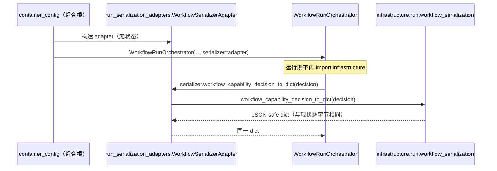

# 设计文档：DDD Follow-up Refinements（DDD 收尾清理）

## 概述

本设计承接 `ddd-infrastructure-logic-remediation` 登记的三项非阻塞 follow-up，在既有 DDD 分层约束（`application → domain ← infrastructure`）与 ADR-0008 / ADR-0013 / ADR-0016 已定案结论下，做**纯行为等价**清理：以「应用侧序列化 Protocol + 组合根结构注入」逐项消除 5 条 `application/run/* → infrastructure serializer` 受控例外并收敛 allowlist；把 `chat-default` prompt 加载与 workspace guidance 拼接收敛为单一来源；在基础设施层内部按 SRP 把 `react_agent_adapter.py` 拆为若干协作类，`ReActAgentAdapter` 保留为门面。设计遵循的仓库规范：`docs/steering/ddd-architecture.md`（依赖方向与组合根例外）、`docs/steering/srp-principle.md`（单一职责拆分）、`docs/steering/change-discipline.md`（最小改动、按规模选门）、`docs/steering/code-documentation.md`（中文 docstring）、`docs/steering/python-typing-lint.md`（全量类型标注、禁裸 `Any`）、`docs/steering/adr.md`（ADR 纪律）、`docs/steering/doc-sync.md`（文档同步）。

三项均不新增对外功能、不改 API 契约 / 事件类型 / 流式协议 / 错误语义，重构前后既有测试断言保持一致。

#### 设计决策

| 决策 | 选项 | 理由 |
| --- | --- | --- |
| Follow-up 实现顺序 | serializer 清理（中风险）优先，其后 prompt 去重（低风险小面）、SRP 拆分（低风险大面） | 需求 1.2 / 5.7 明确 serializer 清理最高优先；它涉及依赖反转，越早消除越能让静态 guard 收敛，后两项改动面互不阻塞。 |
| serializer 例外消除手段 | 统一采用 **Structural_Protocol_Injection**：应用侧定义序列化 Protocol，infrastructure 提供 delegating adapter，组合根注入 | 需求 1.3 允许 relocation 或 protocol injection 二选一；ADR-0008 要求 serializer 实现留 infrastructure，故不能把 serializer 搬到 domain/application（排除 relocation），只能反转依赖：应用依赖抽象、infra 实现、组合根装配。 |
| 序列化 Protocol 归属层 | 定义在 `application/run/serialization_ports.py`（应用层自有抽象） | 仓库既有先例：`run_application_service.py` 已在应用层定义 `ApprovalResumer(Protocol)`；且 ADR-0008 已把序列化词汇移出 domain，Protocol 放 domain 会重新引入序列化关注点，放应用层更贴合“应用声明其所需能力”。 |
| Protocol 粒度 | 按 infra serializer 模块划 3 个 Protocol（Workflow / Guardrail / Segment），各消费方只依赖所需 Protocol | 与 3 个 serializer 模块边界一一对应、职责内聚（SRP）；组合根一处装配三个 adapter，wiring 面最小。 |
| serializer adapter 归属 | 新增 `infrastructure/run/run_serialization_adapters.py`，3 个薄 adapter 逐一委托既有 serializer 自由函数 | serializer 自由函数保持不动（ADR-0008 mapper 纯净）；adapter 只做“调用同一函数”，输出逐字节等价。 |
| prompt 去重落点 | 新增 `infrastructure/chat/chat_default_prompt.py` 单一 helper，`ChatServiceAdapter.__init__` 与组合根 `_create_chat_service` 均调用它 | 需求 2.5 要求“单一来源被两处消费”；helper 组合 `PromptRegistryPort.get` + `append_workspace_path_guidance` + `prompt_id`，两处结果与现状逐字节等价，且保留 workspace guidance / prompt 访问在 infra + 组合根（需求 2.6）。 |
| react adapter 拆分方式 | 基础设施层内部 SRP 拆为 4 个协作模块，`ReActAgentAdapter` 保留为组合门面，继续实现 `AgentPort` 与 `AgentLoopEffects` | 需求 3.1/3.3/3.6：行为等价的 Infrastructure_Internal_Refactor；`AgentLoopEffects` 方法必须仍挂在 adapter（以 `effects=self` 传入编排器），故门面保留薄方法、委托协作者。 |
| 并发骨架归属 | `_dispatch_/_stream_/_events_concurrent_tool_calls` 逐字迁到 `react_concurrent_tool_executor.py`，仍属 infrastructure | ADR-0013 定案“工具并发骨架留基础设施、不开 P2 第三片”；模块内平移不改归属、不上提领域层、不重开 ADR-0013（需求 3.4/3.9/5.2）。 |
| ADR 判断 | 三项均**不新增 ADR**、不 supersede 任何已 Accepted ADR | serializer Protocol 是窄的 feature-local 抽象（类比前 spec `worker_contracts` 未新增 ADR），且恢复而非改变依赖方向；prompt 去重是纯内部重构；SRP 拆分是单层内模块重排，无跨层新契约。详见「ADR 判断检查点」。 |

## 架构

三项 follow-up 相互独立、可分片交付。下图给出目标态的组件与依赖方向（重点标注 Follow-up 1 的依赖反转与 Follow-up 3 的门面拆分）。

```mermaid
flowchart TB
    subgraph app["application 层"]
        SerPorts["application/run/serialization_ports.py<br/>WorkflowSerializerPort / GuardrailSerializerPort / SegmentSerializerPort（Protocol）"]
        Coord["run_execution_coordinator.py"]
        RunAppSvc["run_application_service.py"]
        Recovery["run_checkpoint_recovery_service.py"]
        GRecorder["run_guardrail_recorder.py"]
        WfOrch["workflow_orchestrator.py"]
        Root["container_config.py（组合根例外）"]
    end
    subgraph infra["infrastructure 层"]
        SerAdapters["infrastructure/run/run_serialization_adapters.py<br/>3 个 delegating adapter"]
        SegSer["infrastructure/agent/segment_serialization.py"]
        GdSer["infrastructure/agent/guardrail_serialization.py"]
        WfSer["infrastructure/run/workflow_serialization.py"]
        ChatPrompt["infrastructure/chat/chat_default_prompt.py<br/>chat-default 加载单一来源"]
        ChatAdapter["infrastructure/chat/chat_service_adapter.py"]
        ReactFacade["infrastructure/agent/react_agent_adapter.py<br/>ReActAgentAdapter 门面（AgentPort + AgentLoopEffects）"]
        GAcc["guardrail_runtime_accumulator.py"]
        Trace["react_trace_recorder.py"]
        Concurrent["react_concurrent_tool_executor.py（ADR-0013 留 infra）"]
        ApprCkpt["react_approval_checkpoint.py"]
    end

    Coord --> SerPorts
    RunAppSvc --> SerPorts
    Recovery --> SerPorts
    GRecorder --> SerPorts
    WfOrch --> SerPorts
    SerAdapters -. implements .-> SerPorts
    SerAdapters --> SegSer
    SerAdapters --> GdSer
    SerAdapters --> WfSer
    Root --> SerAdapters
    Root --> Coord
    Root --> RunAppSvc
    Root --> Recovery
    Root --> GRecorder
    Root --> WfOrch

    Root --> ChatPrompt
    ChatAdapter --> ChatPrompt
    ReactFacade --> GAcc
    ReactFacade --> Trace
    ReactFacade --> Concurrent
    ReactFacade --> ApprCkpt
```



Follow-up 1 关键序列（以 workflow_orchestrator 为例，其余消费方同构）：



实现切片顺序：

1. **serializer 受控例外清理（需求 1）**：新增应用侧 Protocol + infra adapter，逐项改造 5 个消费方与组合根注入，每消除一项从 allowlist 删一项。
2. **ChatServiceAdapter prompt 去重（需求 2）**：抽取单一 helper，两处消费。
3. **react_agent_adapter.py SRP 拆分（需求 3）**：门面保留、协作类外移。

## 组件与接口

### 1. 应用侧序列化 Protocol（新增）

位置：`epsilon-boot/src/application/run/serialization_ports.py`

职责：声明 `Application_Run_Module` 所需的序列化能力抽象，不 import `infrastructure`，只引用 domain 值对象类型与标准库。

```python
"""Run 应用层序列化能力抽象端口。

应用层通过本模块声明其所需的值对象→JSON-safe dict 序列化能力，具体实现
由 ``infrastructure`` 提供并经组合根注入，使 ``application/run/*`` 生产代码
不再直接 import ``infrastructure`` serializer（遵循
``docs/steering/ddd-architecture.md`` 的默认依赖方向）。序列化实现仍留
基础设施层（ADR-0008）。
"""

from __future__ import annotations

from typing import Any, Protocol

from domain.agent.guardrails import GuardrailObservation, GuardrailSummary
from domain.agent.segmented_execution import SegmentRunMetadata
from domain.run.workflow import (
    ChildRunOrchestrationState,
    WorkflowCapabilityDecision,
    WorkflowRunState,
)


class WorkflowSerializerPort(Protocol):
    """Run 工作流值对象的 JSON-safe 序列化能力。"""

    def workflow_run_state_to_dict(self, value: WorkflowRunState) -> dict[str, Any]:
        """返回 JSON-safe 工作流运行状态。"""
        ...

    def workflow_capability_decision_to_dict(
        self, value: WorkflowCapabilityDecision
    ) -> dict[str, Any]:
        """返回 JSON-safe 能力判定结果。"""
        ...

    def child_run_orchestration_state_to_dict(
        self, value: ChildRunOrchestrationState
    ) -> dict[str, Any]:
        """返回 JSON-safe child run 编排状态。"""
        ...


class GuardrailSerializerPort(Protocol):
    """Guardrail 值对象的线格式序列化能力。"""

    def guardrail_summary_to_dict(self, value: GuardrailSummary) -> dict[str, Any]:
        """返回 JSON-safe 护栏摘要。"""
        ...

    def guardrail_observation_to_event_payload(
        self, value: GuardrailObservation
    ) -> dict[str, Any]:
        """返回 JSON-safe 护栏观测事件 payload。"""
        ...


class SegmentSerializerPort(Protocol):
    """分段执行元数据的 HTTP 线格式序列化能力。"""

    def segment_run_metadata_to_http_dict(
        self, value: SegmentRunMetadata
    ) -> dict[str, object]:
        """返回 HTTP 响应友好的分段元数据字典。"""
        ...
```

各消费方所需方法（据现有 import 精确对齐）：

| 消费方 | 依赖 Protocol | 实际调用符号 |
| --- | --- | --- |
| `run_execution_coordinator.py` | `SegmentSerializerPort` | `segment_run_metadata_to_http_dict` |
| `run_application_service.py` | `WorkflowSerializerPort` | `workflow_run_state_to_dict` |
| `run_checkpoint_recovery_service.py` | `GuardrailSerializerPort` | `guardrail_summary_to_dict` |
| `run_guardrail_recorder.py` | `GuardrailSerializerPort` | `guardrail_observation_to_event_payload`、`guardrail_summary_to_dict` |
| `workflow_orchestrator.py` | `WorkflowSerializerPort` | `workflow_capability_decision_to_dict`、`child_run_orchestration_state_to_dict` |

### 2. 基础设施序列化 adapter（新增）

位置：`epsilon-boot/src/infrastructure/run/run_serialization_adapters.py`

职责：实现上述 3 个 Protocol，逐一委托既有 serializer 自由函数；无状态、无 I/O。serializer 自由函数模块保持不动（ADR-0008）。

```python
"""Run 应用层序列化端口的基础设施实现。

各 adapter 逐一委托既有 serializer 自由函数（``segment_serialization`` /
``guardrail_serialization`` / ``workflow_serialization``），输出与原自由函数
逐字节等价。本模块把 ``application/run/*`` 对 serializer 的直接 import 反转为
组合根注入，序列化实现仍留基础设施层（ADR-0008）。
"""

from __future__ import annotations

from typing import Any

from domain.agent.guardrails import GuardrailObservation, GuardrailSummary
from domain.agent.segmented_execution import SegmentRunMetadata
from domain.run.workflow import (
    ChildRunOrchestrationState,
    WorkflowCapabilityDecision,
    WorkflowRunState,
)
from infrastructure.agent.guardrail_serialization import (
    guardrail_observation_to_event_payload,
    guardrail_summary_to_dict,
)
from infrastructure.agent.segment_serialization import (
    segment_run_metadata_to_http_dict,
)
from infrastructure.run.workflow_serialization import (
    child_run_orchestration_state_to_dict,
    workflow_capability_decision_to_dict,
    workflow_run_state_to_dict,
)


class WorkflowSerializerAdapter:
    """委托 workflow_serialization 自由函数的 WorkflowSerializerPort 实现。"""

    def workflow_run_state_to_dict(self, value: WorkflowRunState) -> dict[str, Any]:
        """委托 ``workflow_run_state_to_dict`` 自由函数。"""
        return workflow_run_state_to_dict(value)

    def workflow_capability_decision_to_dict(
        self, value: WorkflowCapabilityDecision
    ) -> dict[str, Any]:
        """委托 ``workflow_capability_decision_to_dict`` 自由函数。"""
        return workflow_capability_decision_to_dict(value)

    def child_run_orchestration_state_to_dict(
        self, value: ChildRunOrchestrationState
    ) -> dict[str, Any]:
        """委托 ``child_run_orchestration_state_to_dict`` 自由函数。"""
        return child_run_orchestration_state_to_dict(value)


class GuardrailSerializerAdapter:
    """委托 guardrail_serialization 自由函数的 GuardrailSerializerPort 实现。"""

    def guardrail_summary_to_dict(self, value: GuardrailSummary) -> dict[str, Any]:
        """委托 ``guardrail_summary_to_dict`` 自由函数。"""
        return guardrail_summary_to_dict(value)

    def guardrail_observation_to_event_payload(
        self, value: GuardrailObservation
    ) -> dict[str, Any]:
        """委托 ``guardrail_observation_to_event_payload`` 自由函数。"""
        return guardrail_observation_to_event_payload(value)


class SegmentSerializerAdapter:
    """委托 segment_serialization 自由函数的 SegmentSerializerPort 实现。"""

    def segment_run_metadata_to_http_dict(
        self, value: SegmentRunMetadata
    ) -> dict[str, object]:
        """委托 ``segment_run_metadata_to_http_dict`` 自由函数。"""
        return segment_run_metadata_to_http_dict(value)
```

### 3. 五个消费方改造（每条例外的具体消除方案）

统一模式：构造函数新增对应 Protocol 参数——**所有 serializer 形参均为 required keyword，不提供 `None` 回退**；删除模块内 `from infrastructure...` 局部 import，改调注入的 serializer；模块级 helper 若使用 serializer，则改为实例方法或增加 serializer 形参以贯通。行为等价由「adapter 调用同一自由函数」保证。**更新既有测试构造点注入 adapter 是每条切片的组成部分。**

#### 3.1 `run_execution_coordinator.py` → 消除 `infrastructure.agent.segment_serialization`

- 现状：模块级 `_segment_metadata`（L528-539）局部 import `segment_run_metadata_to_http_dict`，被模块级 `_chat_outcome` / `_task_outcome` 调用。
- 方案：`RunExecutionCoordinator.__init__` 增加 `segment_serializer: SegmentSerializerPort`；把 `_chat_outcome` / `_task_outcome` / `_segment_metadata` 收敛为实例方法（`self._chat_outcome(...)` 等），`_segment_metadata` 改调 `self._segment_serializer.segment_run_metadata_to_http_dict(metadata)`；删除局部 import。

```python
from application.run.serialization_ports import SegmentSerializerPort


class RunExecutionCoordinator:
    def __init__(
        self,
        *,
        chat_service: ChatServicePort,
        task_agent: TaskAgentPort,
        segment_serializer: SegmentSerializerPort,
        checkpoint_store: RunCheckpointStorePort | None = None,
        event_store: RunEventStorePort | None = None,
        retention_policy: CheckpointRetentionPolicy | None = None,
        checkpoint_enabled: bool = False,
        workflow_orchestrator: WorkflowRunOrchestrator | None = None,
        workflow_registry: WorkflowRegistryPort | None = None,
    ) -> None: ...

    def _segment_metadata(self, metadata: Any) -> dict[str, Any]:
        """把 SegmentRunMetadata 或 dict 转换为 JSON-safe dict。"""
        from domain.agent.segmented_execution import SegmentRunMetadata

        if isinstance(metadata, SegmentRunMetadata):
            return _json_safe(
                self._segment_serializer.segment_run_metadata_to_http_dict(metadata)
            )
        safe = _json_safe(metadata)
        return safe if isinstance(safe, dict) else {}
```

#### 3.2 `run_application_service.py` → 消除 `infrastructure.run.workflow_serialization`

- 现状：`_with_workflow_selection`（L313-341）局部 import `workflow_run_state_to_dict`。
- 方案：`RunApplicationService.__init__` 增加 required keyword 参数 `workflow_serializer: WorkflowSerializerPort`；`_with_workflow_selection` 改调 `self._workflow_serializer.workflow_run_state_to_dict(...)`；删除局部 import。即使某些请求不走 `workflow_selector` 分支，`workflow_serializer` 仍为 required（不设 `None` 回退），由组合根统一注入；所有既有构造点与测试 fixture 须补注入 adapter。

```python
def __init__(
    self,
    *,
    run_store: RunStorePort,
    event_store: RunEventStorePort,
    capacity_policy: RunCapacityPolicy,
    event_retention_policy: EventRetentionPolicy,
    workflow_serializer: WorkflowSerializerPort,
    worker_wakeup: RunWorkerWakeup | None = None,
    approval_resumer: ApprovalResumer | None = None,
    event_stream_wait_seconds: float = 1.0,
    metrics: RunRuntimeMetrics | None = None,
    guardrail_policy: Any | None = None,
    workflow_selector: WorkflowSelectorPort | None = None,
) -> None: ...
```

#### 3.3 `run_checkpoint_recovery_service.py` → 消除 `infrastructure.agent.guardrail_serialization`

- 现状：模块级 `_recovery_guardrail_summary`（L156-198）局部 import `guardrail_summary_to_dict`，被 `sweep_expired_leases` 方法调用。
- 方案：`RunRecoveryService.__init__` 增加 `guardrail_serializer: GuardrailSerializerPort`；把 `_recovery_guardrail_summary` 改为实例方法或向其传入 `self._guardrail_serializer`，改调注入实现；删除局部 import。`mark_guardrail_summary_stale` 属 domain，不变。

#### 3.4 `run_guardrail_recorder.py` → 消除 `infrastructure.agent.guardrail_serialization`

- 现状：`record_observation`（L41-78）局部 import `guardrail_observation_to_event_payload` + `guardrail_summary_to_dict`。
- 方案：`RunGuardrailRecorder.__init__` 增加 `guardrail_serializer: GuardrailSerializerPort`；`record_observation` 改调 `self._guardrail_serializer.*`；删除局部 import。`RunGuardrailRecorder(RunGuardrailRecorderPort)` 契约方法签名不变。

```python
def __init__(
    self,
    *,
    run_store: RunStorePort,
    observation_store: RunObservationStorePort,
    guardrail_serializer: GuardrailSerializerPort,
) -> None: ...
```

#### 3.5 `workflow_orchestrator.py` → 消除 `infrastructure.run.workflow_serialization`

- 现状：`_capability_rejection_outcome`（L175）、`_child_run_reconciliation_outcome`（L244）、`_child_run_waiting_outcome`（L342）三处局部 import `workflow_capability_decision_to_dict` / `child_run_orchestration_state_to_dict`。
- 方案：`WorkflowRunOrchestrator.__init__` 增加 `workflow_serializer: WorkflowSerializerPort`；三个方法改调 `self._workflow_serializer.*`；删除三处局部 import。

```python
def __init__(
    self,
    *,
    event_store: RunEventStorePort,
    workflow_registry: WorkflowRegistryPort,
    workflow_serializer: WorkflowSerializerPort,
    approval_store: ApprovalStateStorePort | None = None,
    run_store: RunStorePort | None = None,
    now: Callable[[], datetime] | None = None,
) -> None: ...
```

#### 3.6 组合根装配（`container_config.py`）

在 `_create_workflow_run_orchestrator`（L911）、`_create_run_execution_coordinator`（L967）、`_create_run_application_service`（L1057 附近）、`_create_run_guardrail_recorder`（L1077）、`_create_run_recovery_service`（L992）中构造并注入对应 adapter。adapter 无状态，可模块级单例或每次 new。组合根作为受控例外，import `infrastructure.run.run_serialization_adapters` 不计违规。

```python
from infrastructure.run.run_serialization_adapters import (
    GuardrailSerializerAdapter,
    SegmentSerializerAdapter,
    WorkflowSerializerAdapter,
)

_workflow_serializer = WorkflowSerializerAdapter()
_guardrail_serializer = GuardrailSerializerAdapter()
_segment_serializer = SegmentSerializerAdapter()
# 各 _create_* 工厂把上述实例注入对应构造函数的 serializer 形参。
```

### 4. chat-default prompt 加载单一来源（新增，Follow-up 2）

位置：`epsilon-boot/src/infrastructure/chat/chat_default_prompt.py`

职责：把 `chat-default` prompt 的加载 + workspace guidance 拼接 + prompt_id 提取收敛为唯一逻辑源；由 `ChatServiceAdapter.__init__` 与组合根 `_create_chat_service` 共同消费。仍处 Infrastructure_Layer（需求 2.6），不引入 domain 运行时关注点。

```python
"""chat-default 系统 Prompt 加载的单一来源。

把 ``PromptRegistryPort.get("chat-default")`` + ``append_workspace_path_guidance``
+ ``prompt_id`` 提取收敛到唯一函数，供 ``ChatServiceAdapter`` 构造期与组合根
``_create_chat_service`` 共同调用，消除两处重复的 prompt 加载细节（行为等价）。
"""

from __future__ import annotations

from dataclasses import dataclass

from domain.prompt.ports import PromptRegistryPort
from infrastructure.prompt.workspace_guidance import append_workspace_path_guidance


@dataclass(frozen=True)
class ChatDefaultSystemPrompt:
    """经 workspace guidance 处理后的 chat-default 系统 Prompt。"""

    system_prompt: str
    prompt_id: str


def resolve_chat_default_system_prompt(
    prompt_registry: PromptRegistryPort,
) -> ChatDefaultSystemPrompt:
    """加载 chat-default Prompt 并追加 workspace 路径引导。

    与原 ``ChatServiceAdapter.__init__`` / ``_create_chat_service`` 中的三行加载
    逻辑逐字节等价：``get("chat-default")`` → ``append_workspace_path_guidance``
    → 取 ``prompt_id``；``prompt_id`` 不受 workspace guidance 影响。
    """
    loaded_prompt = prompt_registry.get("chat-default")
    return ChatDefaultSystemPrompt(
        system_prompt=append_workspace_path_guidance(loaded_prompt.content),
        prompt_id=loaded_prompt.prompt_id,
    )
```

消费方改造：

- `ChatServiceAdapter.__init__`（现 L193-196）：改为
  ```python
  from infrastructure.chat.chat_default_prompt import resolve_chat_default_system_prompt

  resolved = resolve_chat_default_system_prompt(prompt_registry)
  self._system_prompt = resolved.system_prompt
  self._prompt_id = resolved.prompt_id
  ```
  移除构造期对 `append_workspace_path_guidance` 的直接局部 import。`prompt_registry` 构造参数保留（签名不变，最小改动）。
- `container_config._create_chat_service`（现 L1811-1813）：改调同一 helper 得到 `system_prompt` / `prompt_id`，继续传给 `ChatSessionContextWorkflow` 与 `_make_agent_config`；移除组合根内 `append_workspace_path_guidance` 局部 import。

### 5. react_agent_adapter.py SRP 拆分（Follow-up 3）

`ReActAgentAdapter` 保留为门面：继续 `class ReActAgentAdapter(AgentPort)`，继续实现 `AgentLoopEffects` 全部方法（`prepare_runtime` / `perform_model_round` / `record_assistant_with_tool_calls` / `resolve_approval_policies` / `save_interrupt` / `prepare_tool_calls_for_execution` / `checkpoint_model_completed` / `checkpoint_approval_interrupt` / `record_terminated`）与四入口（`run` / `run_streaming` / `run_events` / `resume`），签名与 `effects=self` 委托方式不变；方法体委托下列协作者。

#### 5.1 `guardrail_runtime_accumulator.py`（新增）— 运行时统计累加

位置：`epsilon-boot/src/infrastructure/agent/guardrail_runtime_accumulator.py`

迁移：`_GuardrailRuntimeAccumulator`（L177-359）、`_safe_int` / `_safe_float` / `_safe_optional_float` / `_safe_optional_str`（L375-406）、ContextVar `_CURRENT_GUARDRAIL_RUNTIME`（L362）、`_CURRENT_TOOL_ABUSE_DETECTOR`（L368）。对外导出符号供门面 import。门面 `_guardrail_runtime_accumulator()` / `_tool_abuse_detector()` 访问器与 `prepare_runtime` 内累加器重置逻辑保留在门面，但引用本模块的类与 ContextVar。

```python
"""ReAct guardrail 运行时统计累加器与执行链路 ContextVar。"""

from __future__ import annotations

from contextvars import ContextVar
from dataclasses import dataclass, field
from typing import Any

from domain.agent.guardrails import GuardrailRuntimeStats
from infrastructure.agent.tool_abuse_detector import ToolAbuseDetector


@dataclass
class GuardrailRuntimeAccumulator:
    """在单次 ReAct 执行内累计 guardrail 真实运行时统计。"""
    # 字段、from_summary / model_completed / tool_before / tool_after / snapshot 等
    # 方法整体平移，逻辑不变。


CURRENT_GUARDRAIL_RUNTIME: ContextVar[GuardrailRuntimeAccumulator | None] = ContextVar(
    "react_guardrail_runtime_accumulator", default=None
)
CURRENT_TOOL_ABUSE_DETECTOR: ContextVar[ToolAbuseDetector | None] = ContextVar(
    "react_tool_abuse_detector", default=None
)
```

> 命名（已定）：迁移内部私有符号（`_GuardrailRuntimeAccumulator` / `_CURRENT_GUARDRAIL_RUNTIME` / `_CURRENT_TOOL_ABUSE_DETECTOR` 等）时，**若既有测试直接 import 了该内部符号，门面用 `from infrastructure.agent.guardrail_runtime_accumulator import GuardrailRuntimeAccumulator as _GuardrailRuntimeAccumulator` 保留原名以零改测试**；无外部引用的符号可去下划线导出。目标是不连带修改既有测试对内部符号的引用。

#### 5.2 `react_trace_recorder.py`（新增）— trace / OTel 记账

位置：`epsilon-boot/src/infrastructure/agent/react_trace_recorder.py`

迁移：`_record_trace`（L583）、`_truncate`（L593）、`_build_model_call_trace`（L599）、`_build_model_call_trace_from_response`（L614）、`_build_approval_trace`（L648）、`_record_error_trace`（L661）、`_record_tool_call_trace`（L693）、`_truncate_metadata`（L750），以及 abuse detection 记账 `_record_tool_call_for_abuse_detection`（L793）、`_emit_tool_abuse_detected`（L804）、`_record_tool_abuse_blocked_result`（L828）。

```python
class ReActTraceRecorder:
    """封装 ReAct 结构化 trace / OTel 记账与工具滥用记账。"""

    def __init__(self, trace_store: Any | None) -> None:
        """持有可选 trace_store；为 None 时记账静默跳过。"""
        self._trace_store = trace_store

    async def record_tool_call_trace(
        self,
        session_id: str | None,
        round_num: int,
        tool_call: ToolCallRequest,
        result: ToolExecutionResult,
        is_error: bool,
        elapsed_ms: float,
    ) -> None:
        """记录一次工具调用 trace。"""
        ...
    # 其余方法签名与原方法一致平移。
```

门面持有 `self._trace_recorder = ReActTraceRecorder(trace_store)`，原调用点改为委托。

#### 5.3 `react_concurrent_tool_executor.py`（新增，ADR-0013 留 infra）— 工具并发骨架

位置：`epsilon-boot/src/infrastructure/agent/react_concurrent_tool_executor.py`

迁移：`_dispatch_concurrent_tool_calls`（L2137）、`_stream_concurrent_tool_progress`（L2205）、`_events_concurrent_tool_calls`（L2273），以及仅服务并发进度的 `_tool_progress_chunk`（L2642）、`_heartbeat_chunk`（L2633）如仅被并发骨架使用可一并迁移（否则留门面）。三方法体（`asyncio.gather`、`set_parent_context` / `reset_parent_context`、事件配对 yield）**逐字平移**，不改语义（ADR-0013 不重开）。

该骨架需回调门面的 `_execute_tool_call`、`_record_tool_call_trace`（现委托 trace recorder）、`_record_tool_after_observation`。为避免循环依赖与保持 SRP，定义 infra 内部窄回调协议，门面实现之：

```python
class ToolExecutionRuntime(Protocol):
    """并发骨架回调门面的工具执行运行时（infra 内部协议）。"""

    async def execute_tool_call(
        self,
        context: ConversationContext,
        tool_call: ToolCallRequest,
        config: AgentConfig,
        *,
        round_num: int,
        skip_guardrail_before: bool,
        record_guardrail_after: bool,
    ) -> tuple[ToolExecutionResult, bool]: ...

    async def record_tool_call_trace(self, ...) -> None: ...
    async def record_tool_after_observation(self, ...) -> None: ...


class ConcurrentToolExecutor:
    """同轮多工具并发执行 / 流式进度 / 事件骨架（ADR-0013 留基础设施）。"""

    def __init__(self, runtime: ToolExecutionRuntime) -> None: ...

    async def dispatch(self, context, tool_calls, config, session_id=None, round_num=0) -> None: ...
    async def stream_progress(self, context, tool_calls, config, round_num) -> AsyncIterator[StreamingChunk]: ...
    async def events(self, context, tool_calls, config, ...) -> AsyncIterator[AgentStreamEvent]: ...
```

> 该协议是 **infrastructure 层内部**协作契约，不跨层、不入 domain，不构成 ADR 意义上的新一等抽象；也可选择直接把门面 `self` 作为回调对象传入（无独立协议）。二者皆不改变 ADR-0013 的归属结论。

#### 5.4 `react_approval_checkpoint.py`（新增）— 审批 / checkpoint 缝合

位置：`epsilon-boot/src/infrastructure/agent/react_approval_checkpoint.py`

迁移与 pending action 收集、审批中断保存、workflow capability 审批、checkpoint 缝合相关的 `_collect_pending_actions`（L859）、`_save_interrupt`（L888）、`_first_workflow_capability_denial`（L934）、`_save_workflow_capability_interrupt`（L950）、`checkpoint` 写入体（`checkpoint_model_completed` / `checkpoint_approval_interrupt` 的 sink 调用体，L2048/L2071）、`_apply_approval_decisions`（L2412）、`_record_rejected_tool_call`（L2493）、`_latest_tool_calls_by_id`（L2566）。

```python
class ApprovalCheckpointStitcher:
    """审批筛选、审批中断保存与 checkpoint 运行时缝合。"""

    def __init__(self, approval_store: ApprovalStateStorePort) -> None: ...
    # 各方法与原方法签名一致平移；依赖 domain 纯判定（collect_pending_actions 等）不变。
```

门面 `AgentLoopEffects.save_interrupt` / `checkpoint_model_completed` / `checkpoint_approval_interrupt` 仍是薄方法，委托 stitcher。`resolve_approval_policies`、`record_terminated`、`perform_model_round` 等因涉及门面自身状态与 OTel span，可保留门面并按需委托 trace recorder / accumulator，避免过度拆分。

## 数据模型

无数据库 DDL、索引、Redis key schema、文件布局或配置键变更；不改事件类型与流式协议。

新增 Python 类型（均为抽象或无状态 adapter / 纯 helper）：

| 模型 | 类型 | 位置 | 说明 |
| --- | --- | --- | --- |
| `WorkflowSerializerPort` / `GuardrailSerializerPort` / `SegmentSerializerPort` | `Protocol` | `application/run/serialization_ports.py` | 应用侧序列化能力抽象。 |
| `WorkflowSerializerAdapter` / `GuardrailSerializerAdapter` / `SegmentSerializerAdapter` | 无状态类 | `infrastructure/run/run_serialization_adapters.py` | 委托既有 serializer 自由函数。 |
| `ChatDefaultSystemPrompt` | `@dataclass(frozen=True)` | `infrastructure/chat/chat_default_prompt.py` | 承载 system_prompt + prompt_id。 |
| `GuardrailRuntimeAccumulator`（原 `_GuardrailRuntimeAccumulator`） | `@dataclass` | `infrastructure/agent/guardrail_runtime_accumulator.py` | 平移，字段与行为不变。 |
| `ReActTraceRecorder` / `ConcurrentToolExecutor` / `ApprovalCheckpointStitcher` | 协作类 | `infrastructure/agent/react_*.py` | 门面委托的基础设施协作者。 |
| `ToolExecutionRuntime` | `Protocol`（infra 内部，可选） | `react_concurrent_tool_executor.py` | 并发骨架回调门面的窄协议。 |

serializer 自由函数模块（`segment_serialization` / `guardrail_serialization` / `workflow_serialization`）与 `workspace_guidance` **保持不动**。

## 事务与并发边界

三项均为行为等价重构，**不改变任何事务放置、传播、回滚规则或写入时序**；本节声明各写入路径在重构后与现状完全一致。

- **Follow-up 1**：serializer adapter 无状态、无 I/O，只做值对象→dict 纯转换。`run_application_service` 的 workflow 选择写入、`run_guardrail_recorder` 的 observation 写入（`RunObservationStorePort.record_runtime_observation`）、`workflow_orchestrator` 的事件与 checkpoint 写入、`run_checkpoint_recovery_service` 的 enqueue_recovery / mark_lost 写入的调用序列与原子性边界均不变；仅 dict 的“生产者”从直接 import 改为注入 adapter，结果字节相同。
- **Follow-up 2**：prompt 加载在构造期发生（`ChatServiceAdapter.__init__` 与组合根），无并发、无事务；helper 为纯读取 + 字符串拼接，不涉及写入。
- **Follow-up 3**：
  - 并发骨架 `asyncio.gather` 调度、`set_parent_context` / `reset_parent_context`（ContextVar，`finally` 还原）逐字平移，同轮多工具并发时序与 fast-path 单工具直 await 不变（ADR-0013）。
  - guardrail 运行时累加器仍经 `CURRENT_GUARDRAIL_RUNTIME` / `CURRENT_TOOL_ABUSE_DETECTOR` ContextVar 按执行链路隔离，`prepare_runtime` 的 accumulator 重置 / preserve 语义（依 `context_key` 与 `preserve_guardrail_runtime`）保持一致。
  - checkpoint 写入（`sink.model_completed` / `sink.approval_interrupt`）、审批中断 `approval_store.save`、run guardrail 观测写入的调用点与顺序不变；不新增补偿 / 幂等机制、不新增 exactly-once 承诺。
  - 跨进程 / 外部系统边界（Redis / file persistence、模型 SDK/HTTP、OTel）不变；无新增跨事务操作。

## 正确性属性

### Property 1: application/run 不再直接导入 infrastructure serializer

*For any* 生产文件 under `src/application/run/`，重构完成后其 AST imports 不得包含 `infrastructure.agent.segment_serialization`、`infrastructure.run.workflow_serialization`、`infrastructure.agent.guardrail_serialization`（含函数体内局部 import）；5 个消费方仅通过 `application/run/serialization_ports.py` 的 Protocol 与组合根注入获得序列化能力。
**验证需求：需求 1.1, 1.3, 1.4, 1.5**

### Property 2: 序列化实现保留在 infrastructure

*For any* 已消除的 `Run_Serializer_Import_Exception`，其序列化实现（`*_serialization.py` 自由函数）仍位于 `src/infrastructure/`，adapter 只做委托，不把 `to_dict` 逻辑搬入 application 或 domain。
**验证需求：需求 1.4, 需求 5.1, 5.4**

### Property 3: allowlist 随消除同步收敛且精确相等

*For any* 完成的 Implementation_Slice，`APPLICATION_INFRASTRUCTURE_IMPORT_EXCEPTIONS` 删除对应条目后，`test_application_layer_imports_infrastructure_only_through_declared_exceptions` 与 `test_application_infrastructure_exception_scope_is_exact` 仍通过（实际命中 == allowlist）；全部消除后 allowlist 为空且 `Application_To_Infrastructure_Import_Rule` 无 serializer 例外通过。
**验证需求：需求 1.6, 1.7, 1.8, 1.9, 需求 4.3**

### Property 4: serializer 输出逐字节等价

*For any* 传入的 `SegmentRunMetadata` / `WorkflowRunState` / `WorkflowCapabilityDecision` / `ChildRunOrchestrationState` / `GuardrailSummary` / `GuardrailObservation`，经注入 adapter 得到的 dict 与重构前经直接 import 自由函数得到的 dict 完全相等。
**验证需求：需求 1.1**

### Property 5: chat-default prompt 单一来源且结果等价

*For any* `ChatServiceAdapter` 构造与组合根 `_create_chat_service` 调用，`_system_prompt` / `_prompt_id`（及组合根传给 `ChatSessionContextWorkflow` / `AgentConfig` 的 `system_prompt` / `prompt_id`）与重构前逐字节相同；workspace guidance 仍被幂等追加，且 `prompt_id` 不受其影响；加载逻辑存在于单一 helper 且被两处消费。
**验证需求：需求 2.1, 2.3, 2.4, 2.5, 2.6**

### Property 6: ReActAgentAdapter 契约与可观测行为不变

*For any* `run` / `run_streaming` / `run_events` / `resume` 调用路径与 `AgentLoopEffects` 回调，拆分后 `AgentResult` / `AgentStreamEvent` / `StreamingChunk` 的 status、metadata、审批错误语义、事件类型与顺序、OTel span 结构、终止 reason 与现状一致；`AgentPort` 与 `AgentLoopEffects` 方法签名不变。
**验证需求：需求 3.1, 3.3, 3.6, 3.7, 3.8**

### Property 7: 并发骨架与运行时技术关注点仍在 infrastructure

*For any* 拆分产出模块，其 imports 不引入新的跨层依赖，`asyncio` 并发原语、ContextVar、OTel trace 记账均留在 `src/infrastructure/`，不迁入 `src/domain`；工具并发骨架三方法仍属 infrastructure。
**验证需求：需求 3.4, 3.5, 3.7, 3.9, 需求 5.2**

### Property 8: 全量测试不低于基线且静态 guard 通过

*For any* Implementation_Slice 完成，`PYTHONPATH=src uv run --frozen pytest` 结果不劣于 Full_Test_Suite_Baseline（3072 passed、2 skipped、1 warning），且 `Backend_Static_Import_Guard`（含 domain/common/infra→app 规则与例外精确测试）通过。
**验证需求：需求 4.1, 4.2, 4.3, 4.4**

### Property 9: 已接受 ADR 基线不被静默推翻

*For any* 本特性改动，不新增领域事件总线、不上提并发骨架至 domain、不修 handoff model discrepancy、不弱化 ADR-0008 / 0013 / 0016，除非新增 ADR 显式 supersede。
**验证需求：需求 5.1, 5.2, 需求 3.9**

## 错误处理

复用仓库既有错误模型，**不新增**业务错误码、异常类型或响应包装，不改变任何错误传播路径。

| 场景 | 处理策略（与现状一致） |
| --- | --- |
| serializer adapter 转换非 dataclass / 非法值对象 | 由底层自由函数原样抛出（如 `workflow_serialization._dataclass_to_json_safe_dict` 的 `TypeError("value 必须为 dataclass 实例")`），adapter 不吞不改。 |
| 组合根未注入 serializer | 由 pyright 类型检查在构造点捕获（required keyword 参数）；运行期缺失注入会在构造时 `TypeError`，属组合根装配错误，非运行期新分支。 |
| `PromptRegistryPort.get("chat-default")` 抛出 | 由 `PromptRegistryPort` 实现按现状抛出（prompt 缺失 / 校验失败），helper 不新增捕获，与当前构造期传播一致。 |
| react adapter 拆分后协作者内部异常 | 各协作者保持原方法的异常类型与传播（`HandoffPerformed`、`ToolPermissionDeniedError`、审批系列异常等），门面不新增 try/except 改写语义。 |
| trace_store / OTel 未启用或记账失败 | 保持现状：`ReActTraceRecorder` 在 `trace_store is None` 或 `session_id` 为空时静默跳过；记账异常经原 `logger.warning(..., exc_info=True)` 吞掉，不影响主流程。 |

错误处理原则：不把异常映射 / HTTP 状态码 / OTel / ContextVar 恢复引入 domain；发现疑似 bug（如 handoff model discrepancy）只登记、不在本特性修复；行为等价优先。

## 测试策略

采用仓库既有 `pytest`（`PYTHONPATH=src uv run --frozen pytest`）；既有回归测试作为行为等价安全网，按需补充聚焦单测。

### 属性测试（Property-Based）

- `test/infrastructure/run/test_run_serialization_adapters_property.py`（新增，可选）：对随机构造的值对象，断言 `adapter.method(v) == <对应自由函数>(v)`（Property 4）。若既有 Hypothesis 夹具可复用则追加，否则参数化 example 覆盖各值对象即可。
- Follow-up 3 复用既有 `test/infrastructure/agent/test_react_agent_adapter_property.py`、`test_react_agent_permission_properties.py`、`test_react_agent_final_round_helper_property.py` 作为行为等价属性网。

### 单元测试（Example-Based）

| 测试文件 | 覆盖 |
| --- | --- |
| `test/static/test_architecture_import_boundaries.py` | 每消除一项从 `APPLICATION_INFRASTRUCTURE_IMPORT_EXCEPTIONS` 删一项；全部消除后 allowlist 为空（Property 1/3）。 |
| 既有 `test/application/run/*`、`test/infrastructure/run/*` | 更新对应构造点注入 serializer adapter；断言保持不变（Property 2/4）。 |
| `test/infrastructure/chat/test_chat_service_adapter_*`、`test_chat_service_adapter_refactor_property.py`、`test_chat_service_adapter_boundary_characterization.py` | 守护 `_system_prompt` / `_prompt_id` 等价（Property 5）；如新增 helper 单测 `test/infrastructure/chat/test_chat_default_prompt_unit.py` 锁定加载逻辑。 |
| 既有 `test/infrastructure/agent/test_react_agent_*`（adapter / streaming / events / hitl / guardrail / concurrent_tool_calls / trace / otel_span / checkpoint_recovery / handoff / characterization 系列） | 作为 Follow-up 3 行为等价网守护四入口、AgentLoopEffects、并发骨架、trace、审批/checkpoint（Property 6/7）。 |

若拆分后某协作者可独立单测（如 `GuardrailRuntimeAccumulator` 累加、`ReActTraceRecorder` 记账），可补相应聚焦单测，但不得改变既有断言。

### 集成 / 验证命令（每切片）

聚焦回归：

```bash
cd epsilon-boot
# Follow-up 1
PYTHONPATH=src uv run --frozen pytest \
  test/static/test_architecture_import_boundaries.py \
  test/application/run test/infrastructure/run
# Follow-up 2
PYTHONPATH=src uv run --frozen pytest test/infrastructure/chat
# Follow-up 3
PYTHONPATH=src uv run --frozen pytest test/infrastructure/agent
```

全量验收与类型 / lint：

```bash
cd epsilon-boot
PYTHONPATH=src uv run --frozen pytest
uv run ruff check src && uv run pyright src
```

需求可追溯：需求 1 → Property 1/2/3/4 + 静态 guard 测试；需求 2 → Property 5 + chat 测试；需求 3 → Property 6/7 + react 测试；需求 4 → Property 8 + 验证命令集合；需求 5 → Property 9 + ADR 判断。任一命令未运行须在交付中记录原因（需求 4.5）。

## ADR 判断结论

对照 `docs/steering/adr.md`（方向 / 边界级决策必写、只增不改、supersede 链接）、`docs/adr/README.md` 与已 Accepted 的 ADR-0008 / 0013 / 0016，结论：**三项 follow-up 均不新增 ADR，不 supersede 任何已 Accepted ADR**（需求 5.1, 5.4, 5.5）。

- **Follow-up 1**：引入应用侧窄序列化 Protocol + 组合根注入，是**恢复**而非改变依赖方向（消除 app→infra 反向导入，回到 `application → domain ← infrastructure` 默认方向）。类比前 spec 的 `infrastructure/run/worker_contracts.py`（依赖反转窄协议，当时判定不新增 ADR），本项同属 feature-local 依赖反转，非新一等抽象；ADR-0008「serialization 归 infrastructure mappers」被严格遵守（实现留 infra）。不改 Port 归属跨层语义。
- **Follow-up 2**：纯基础设施内部去重，无抽象、无依赖方向变化。
- **Follow-up 3**：单层（infrastructure）内模块重排 + 门面委托，`AgentPort` / `AgentLoopEffects` 契约不变，并发骨架仍 infra（ADR-0013 不重开），不上提领域层、不新增跨层契约；`ToolExecutionRuntime` 为 infra 内部窄协议，非 ADR 意义的一等抽象。属 `Infrastructure_Internal_Refactor`，按 change-discipline 与 adr.md 无需 ADR。

若实现中出现需改 Port 归属或依赖方向的偏离，必须回到本设计并按需求 5.5 记录 ADR 判断与建议。

## 文档同步清单

按 `docs/steering/doc-sync.md`，改代码即同步（需求 5.6）：

- `docs/architecture.md`：Follow-up 1 完成后描述 `application/run/*` 经序列化 Protocol + 组合根注入消费 serializer、app→infra serializer 受控例外收敛为空；Follow-up 3 更新 react adapter 门面 + 协作模块的运行时布局。
- `docs/agent.md`：Follow-up 3 更新 ReAct Agent Loop 的模块切分（accumulator / trace recorder / concurrent executor / approval-checkpoint stitcher）与门面职责；Follow-up 2 更新 chat-default prompt 单一来源说明。
- `docs/di-container.md`：Follow-up 1 更新组合根对 serializer adapter 的装配与注入点；Follow-up 2 更新 `_create_chat_service` 的 prompt helper 消费。
- `docs/domain-model.md`（如涉及）：说明序列化能力抽象位于应用层、实现留 infra 的边界（ADR-0008 一致）。

## 分片实现顺序建议

1. **切片 A（serializer 清理，最高优先，中风险）**：新增 `serialization_ports.py` + `run_serialization_adapters.py`；逐个改造 `run_execution_coordinator` → `run_guardrail_recorder` → `run_checkpoint_recovery_service` → `run_application_service` → `workflow_orchestrator` 及组合根注入；每项完成即删 allowlist 对应条目并跑静态 guard，全部完成后 allowlist 为空。
2. **切片 B（prompt 去重，低风险小面）**：新增 `chat_default_prompt.py`，改 `ChatServiceAdapter.__init__` 与 `_create_chat_service` 两处消费。
3. **切片 C（SRP 拆分，低风险大面）**：依次抽 `guardrail_runtime_accumulator.py` → `react_trace_recorder.py` → `react_concurrent_tool_executor.py` → `react_approval_checkpoint.py`，门面逐步瘦身；每抽一块跑 `test/infrastructure/agent` 全量守护，最后跑全量验收。

每切片完成运行 `Verification_Command_Set` 并确认不劣于 Full_Test_Suite_Baseline。
