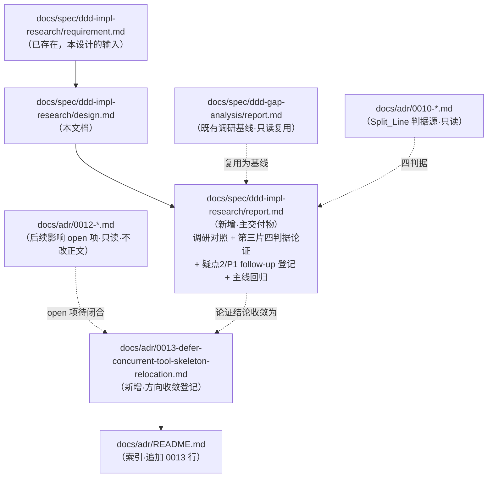

# 设计文档：业界 DDD 主流实现方案调研与 P2 后续任务评估

## 概述

本设计把 `requirement.md`（6 条需求、20 条验收标准）落为一组**文档交付物**：以既有 `docs/spec/ddd-gap-analysis/report.md` 为业界 DDD 调研基线（复用而非重写），结合 P2 两片落地后的新事实产出本 spec 的评估报告 `report.md`，用 ADR-0010 `Orchestration_Infrastructure_Split_Line` 四条判据逐条论证工具并发骨架 `Concurrent_Tool_Skeleton` 应留基础设施、不开 P2 第三片，并以**新增轻量 ADR-0013**（而非改写已 `Accepted` 的 ADR-0012 正文）正式登记该方向收敛。本 feature 是**调研 + 评估 + 方向决策登记型**任务，**全程不做任何生产源码行为变更**（`src/` 零改动），仅产出/修改 spec 文档、ADR 与文档索引。

设计严格遵循 `docs/steering/adr.md`（只增不改、备选方案+未采纳原因是防重开护栏、判定口诀「三个月后新 agent 会问为什么这么定」）、`docs/steering/change-discipline.md`（最小改动、按规模选流程门、不擅自推翻已定结论、范围外问题只登记不扩张）、`docs/steering/doc-sync.md`（新增 ADR 必同步 `docs/adr/README.md` 索引、文档描述当前真实状态）、`docs/steering/code-documentation.md`（文档中文撰写、结论可核验）。

### 设计决策

| 决策点 | 选定方案 | 理由 |
| --- | --- | --- |
| 第三片收敛登记落点 | **新增轻量 ADR-0013**（`Deferred`/`Accepted` 记「不开第三片」的方向收敛），**而非**在 ADR-0012「后续影响」节增量登记 | 依 `adr.md` 判定口诀「三个月后新来的 agent 可能问『当初为什么不切第三片』就写 ADR」——「工具并发骨架是否上提」是会被反复提起的**方向级决策**，正是 `adr.md` 强调「备选方案+未采纳原因」要防止的「后续 agent 重新提出已被否决方案」场景。独立 ADR 有完整四段式（背景/决策/后果/备选）+ 索引可检索性，比藏在 0012 后续影响子节里更可追溯、更防重开，且天然满足「只增不改」（不动 0012 正文）。ADR-0012 后续影响节已写「后续片可继续把工具并发编排纳入评估」——本 ADR-0013 正是对该 open 项的**收敛闭合**，供 supersede/回链而非改写。 |
| 是否改 ADR-0012 正文 | **不改**，仅在 ADR-0013 背景节回链 ADR-0012 后续影响的 open 项 | `adr.md` 只增不改：已 `Accepted` 的 0012 正文不得事后改写，允许的原地编辑仅限笔误/链接/状态字段。第三片收敛是**新结论**，须新增条目承载。 |
| ADR-0013 是否 supersede 0012 | **不 supersede**（0012 结论仍成立且生效） | 0012 是「上提循环主体」的落地决策，仍有效；ADR-0013 只是对其 open 后续项「工具并发编排是否继续上提」给出「否」的闭合，二者非取代关系，用普通回链即可。 |
| 调研基线处理 | **复用** `ddd-gap-analysis/report.md`，本 spec `report.md` 只做「基线仍成立」对照确认 + 新事实（LOC）叠加 | requirement Out-of-Scope 明确「不重复业界调研」；`change-discipline.md` 最小改动。 |
| 疑点 2（handoff model） | 在本 spec `report.md` 登记为**独立、低优先 follow-up**，标注「另开行为变更 spec、需求驱动承载」，本 feature 不修源码 | requirement 需求 4；ADR-0010 疑点 2 已登记为「另开 spec 决策」，本 feature 只登记不动生产代码。 |
| 主评估报告文件 | 新增 `docs/spec/ddd-impl-research/report.md`，风格对齐 `ddd-gap-analysis/report.md` | 承载调研对照 + 第三片四判据论证 + follow-up 登记 + 主线回归，集中可评审。 |
| 主题文档对照标注 | **可选、克制**：`docs/architecture.md` / `docs/domain-model.md` 视 ADR-0013 定稿后按 `doc-sync.md` 判断补一句「并发骨架经评估留基础设施」，非强制 | `doc-sync.md` 要求文档述当前真实状态；并发骨架归属未变（仍在基础设施），故属可选一句话对照标注，勿过度改文档。 |

## 架构

本 feature 无代码架构，架构层面即**交付物依赖与登记关系**。改动跨 `docs/spec/`、`docs/adr/` 两处文档域，`src/` 零涉及。

### 交付物与登记关系图



> 无 `src/` 节点、无运行时序列图：本 feature 不引入任何跨组件运行时行为。

### 目录落点

```text
docs/
├── spec/ddd-impl-research/
│   ├── requirement.md         # 已存在
│   ├── design.md              # 本文档
│   └── report.md              # 新增（主交付物）
└── adr/
    ├── 0013-defer-concurrent-tool-skeleton-relocation.md   # 新增
    └── README.md              # 修改（索引追加 0013）
```

## 组件与接口

本 feature 无代码组件，「组件」= 文档交付物；「接口」= 每份文档的**结构契约**（章节骨架与必含内容）。

### 组件 1：`docs/spec/ddd-impl-research/report.md`（主交付物）——需求 1/2/3/4/5

风格对齐 `ddd-gap-analysis/report.md`（顶部 `> 范围/依据/截至日期`；分节；表格化证据）。结构契约：

- **一、调研基线复用确认**（需求 1）：引用 `Industry_Research_Baseline`（`ddd-gap-analysis/report.md`）为业界主流 DDD 调研 + 本项目对照的评估基线；给出「基线仍成立、无需重复业界调研」结论；声明不重写/替换基线内容。
- **二、P2 落地后新事实对照**（需求 1/2）：登记三层 LOC 现状（domain 9430 / application 9918 / infrastructure 24242，domain 较基线 +1122、infrastructure 略降）；登记 P2 首片（ADR-0011）+ 第二片（ADR-0012）tasks 全部完成、evaluator 均 PASS；登记已上提构件（`domain/agent/agent_loop_policy.py` 纯叶子 + `RoundOutcome`、`AgentLoopOrchestrator` 领域服务、`AgentLoopEffects` 领域端口）与已删 `round_outcome.py` 垫片；声明不推翻 ADR-0011/0012 已定结论。
- **三、P2 第三片评估（工具并发骨架）**（需求 3）：见「组件 2」的四判据论证结构，结论「留基础设施、不开第三片」，指向 ADR-0013 登记。
- **四、follow-up 登记**（需求 4）：`Handoff_Model_Discrepancy`（疑点 2）登记为独立、低优先、需求驱动、另开行为变更 spec 承载，本 feature 不修源码。
- **五、主线回归标注**（需求 5）：依 `Priority_Roadmap` 记 P2 收敛后回归 P1（贫血子域充血试点），P1 属独立 spec + ADR 不在本 feature 启动；P3（应用层拆分）+ 治理收尾排 P1 之后。
- **六、范围纪律声明**（需求 6）：本 feature 零生产源码行为变更；改动类型仅限 spec 文档 / ADR 登记 / 文档索引；不处理 `SOURCES.txt` 中 `round_outcome.py` 构建残留。

### 组件 2：第三片四判据论证结构（`report.md` 第三节内嵌）——需求 3

按 ADR-0010 `Orchestration_Infrastructure_Split_Line` 四条判据**逐条**对 `Concurrent_Tool_Skeleton` 三方法（`_dispatch_concurrent_tool_calls` / `_stream_concurrent_tool_progress` / `_events_concurrent_tool_calls`，位于 `src/infrastructure/agent/react_agent_adapter.py:2137+`）作判定。论证模板固定为「判据 → 证据（真实符号）→ 归层」：

| 判据（ADR-0010 Split_Line） | 证据（真实符号，`react_agent_adapter.py:2137+`） | 归层判定 |
| --- | --- | --- |
| 1. 是否封装外部技术 / SDK 或进程外资源？ | `asyncio.gather(*(...))` 并发调度（运行时并发原语）；`_record_tool_call_trace(...)`（OTel trace 写入） | **是 → 留基础设施** |
| 2. 是否为可脱离运行时、可复用的纯业务判定（给定输入即定输出、不触 I/O）？ | 三方法本体是并发编排 + I/O 副作用（`await self._execute_tool_call`、trace/observation 写入），无独立纯判定；真正的纯判定（终止/预算/handoff/审批筛选/异常分类）已由 slice2 剥离至 `agent_loop_policy.py` | **否 → 无可再上提的纯判定** |
| 3. 是否表达 Agent Loop「何时停止 / 如何推进 / 产出何种形态」的通用语言？ | 三方法只做「同轮多工具如何并发、事件如何配对相邻 yield」的执行时序，不决定轮次推进或终止——推进/终止已在 `AgentLoopOrchestrator` | **否 → 非领域编排语言** |
| 4. 是否只是把技术观测 / 记账 / 运行时上下文缝合进循环的胶水？ | `set_parent_context(context)` / `reset_parent_context(token)`（ContextVar 运行时上下文传参，handoff 子 Agent 快照）+ `_record_tool_call_trace`（OTel 记账）+ 事件配对相邻 yield 的流式时序缝合 | **是 → 留基础设施** |

- **结论**：四判据中 1、4 命中「留基础设施」，2、3 命中「无可上提领域纯判定」。故 `Concurrent_Tool_Skeleton` 属**技术并发编排（`asyncio.gather`）+ 运行时上下文传参（ContextVar）+ 可观测性缝合（OTel）+ 流式事件时序**，应留基础设施，**不开 P2 第三片**。
- **依据补充**：把 `asyncio`/`ContextVar`/`OTel` 拖进领域层属过度设计（违反 `ddd-architecture.md` 领域禁框架/基础设施依赖）；真正领域纯判定已由 slice2 剥离；ADR-0012 后续影响已把「工具并发编排」列为待评估 open 项，本评估对其闭合为「否」。

### 组件 3：`docs/adr/0013-defer-concurrent-tool-skeleton-relocation.md`（新增 ADR）——需求 3

复制 `docs/adr/0000-template.md` 取序号 `0013`，四段式，中文，状态 `Accepted`，日期 2026-07-07，`deciders: [后端架构维护者]`，`supersedes:` 与 `superseded-by:` 留空。结构契约：

- **标题**：「ADR-0013：工具并发骨架经评估留基础设施、不开 P2 第三片（方向收敛）」。
- **背景与问题**：承接 ADR-0010 Split_Line 与 ADR-0012 后续影响 open 项「后续片可继续把工具并发编排纳入领域服务 + 端口评估」；指名三符号与 `react_agent_adapter.py:2137+`。
- **决策**：按四判据判 `Concurrent_Tool_Skeleton` 为技术并发编排 + 运行时上下文 + 可观测性缝合，留基础设施，不开 P2 第三片；本 ADR 零生产代码改动。
- **后果**：正面——闭合 open 项、防后续 agent 重开高风险第三片、领域层免于 asyncio/ContextVar/OTel 污染；负面/代价——同轮多工具执行编排仍在 `react_agent_adapter.py`（可接受，属技术封装）；后续影响——P2 视为收敛，主线回归 P1（回链本 spec `report.md`）。
- **备选方案（未采纳）**：(a) 上提整套并发骨架为领域服务 + 端口——否（引 asyncio/ContextVar/OTel 反向依赖，过度设计）；(b) 只上提「同轮工具编排顺序」纯序——否（无独立纯判定可剥离，slice2 已提净）；(c) 不写 ADR、留 0012 open 项悬置——否（违反 `adr.md` 防重开护栏，方向决策须落 ADR）；(d) 在 0012 后续影响节改写登记——否（违反只增不改，须新增条目）。

### 组件 4：`docs/adr/README.md` 索引同步——需求 6

在索引表末尾追加一行（对齐既有列格式）：

```markdown
| [0013](0013-defer-concurrent-tool-skeleton-relocation.md) | 工具并发骨架经评估留基础设施、不开 P2 第三片（方向收敛） | Accepted | 2026-07-07 |
```

### 组件 5（可选）：主题文档一句话对照标注——需求 6

依 `doc-sync.md` 判断：并发骨架归属未变（仍在基础设施），非强制。若定稿后认为有助后续 agent，可在 `docs/architecture.md`（Agent Loop / Port-Adapter 章节）或 `docs/domain-model.md`（Agent Loop 编排构件节）补一句「工具并发骨架（`_dispatch/_stream/_events_concurrent_tool_calls`）经 ADR-0013 评估留基础设施」并回链 ADR-0013。勿过度改写。

## 数据模型

本 feature 不涉及领域模型、持久化、DDL、ORM、配置键或线格式。唯一「数据」为文档结构与 ADR front-matter 字段（`status` / `date` / `deciders` / `supersedes` / `superseded-by`），已在组件 3 定义。

## 事务与并发边界

本 feature **无任何写操作**（不写数据库、不改运行时状态、`src/` 零改动），不涉及事务、并发、锁、幂等键或跨数据源一致性。按结构要求：本节声明「无写路径」即可，无进一步事务边界需登记。

## 正确性属性

因无代码，正确性属性表达为**文档正确性 / 一致性不变量**，均可客观核验。

### Property 1（已 Accepted ADR 正文只增不改）
本 feature 不改写任何已 `Accepted` 的 ADR（0001–0012）正文；第三片收敛以新增 ADR-0013 承载，允许的对既有 ADR 的编辑仅限（若需）状态/链接字段，本 feature 实际不触碰它们。
验证需求：需求 3 AC3.4、需求 6 AC6.2。
验证命令：`git diff --stat docs/adr/` 确认 0001–0012 各文件未变更（仅 README.md 与新增 0013 出现）。

### Property 2（`src/` 零生产源码行为变更）
本 feature 不修改任何 `src/` 下文件，不搬迁并发骨架、不修疑点 2、不动 `AgentPort` 契约。
验证需求：需求 3、需求 4 AC4.3、需求 6 AC6.1、需求 6 AC6.2。
验证命令：`git diff --stat -- ':!docs'` 期望零输出；`git diff --stat -- src/` 期望零输出。

### Property 3（report 结论与代码事实一致）
`report.md` 指名的三符号名称与位置（`react_agent_adapter.py:2137+`）、引用的真实符号（`asyncio.gather` / `set/reset_parent_context` / `_record_tool_call_trace`）与四判据论证均与当前代码一致；三层 LOC 与 requirement 登记一致。
验证需求：需求 1 AC1.2、需求 3 AC3.1、AC3.2。
验证命令：`grep -nE "_dispatch_concurrent_tool_calls|_stream_concurrent_tool_progress|_events_concurrent_tool_calls|asyncio.gather|set_parent_context|_record_tool_call_trace" src/infrastructure/agent/react_agent_adapter.py`（各符号均命中，佐证 report 引用真实）。

### Property 4（新增 ADR 必同步 README 索引）
新增 ADR-0013 后，`docs/adr/README.md` 索引表含 0013 行（编号→标题→状态→日期齐全）。
验证需求：需求 6 AC6.3。
验证命令：`grep -n "0013" docs/adr/README.md`（命中，且指向 `0013-defer-concurrent-tool-skeleton-relocation.md`）。

### Property 5（第三片含四判据逐条论证）
`report.md` 第三节 + ADR-0013 均按 ADR-0010 Split_Line 四条判据逐条判定并得出「留基础设施」结论，含备选方案与未采纳原因（防重开护栏）。
验证需求：需求 3 AC3.2、AC3.3。
验证命令：`grep -cE "判据 1|判据 2|判据 3|判据 4|留基础设施|不开.*第三片" docs/spec/ddd-impl-research/report.md`（四判据与结论均present）；`grep -n "备选方案" docs/adr/0013-*.md`（命中）。

### Property 6（疑点 2 登记为独立低优先且不修源码）
`report.md` 把 `Handoff_Model_Discrepancy` 登记为独立、低优先、需求驱动、另开 spec 承载的 follow-up，且不在本 feature 修改对应生产代码。
验证需求：需求 4 AC4.1、AC4.2、AC4.3。
验证命令：`grep -nE "疑点 2|Handoff_Model_Discrepancy|低优先|另开.*spec" docs/spec/ddd-impl-research/report.md`（命中）；配合 Property 2 的 `src/` 零改动。

### Property 7（调研基线复用不重写 + 主线回归登记）
`report.md` 引用 `ddd-gap-analysis/report.md` 为基线、给出「仍成立、无需重复调研」结论、不重写基线；登记 P2 收敛后回归 P1 且 P1 另立 spec、P3/治理收尾排其后。
验证需求：需求 1 AC1.1/1.3/1.4、需求 5 AC5.1/5.2/5.3。
验证命令：`grep -nE "ddd-gap-analysis|仍成立|回归 P1|独立 spec|P3" docs/spec/ddd-impl-research/report.md`（命中）；`git diff --stat docs/spec/ddd-gap-analysis/report.md` 期望零变更（基线未被改写）。

## 错误处理

本 feature 无运行时代码，「错误处理」= 文档产出过程中的**边界情形处置原则**（与仓库既有纪律一致，不引入新机制）：

| 边界情形 | 处置原则 | 依据 |
| --- | --- | --- |
| 发现 `ddd-gap-analysis/report.md` 基线结论已与当前代码事实不符 | 本 feature 定位为**复用 + 对照**，不擅自重写基线；只在本 spec `report.md` 中**登记差异**并标注「基线待另行修订」，交由人决定是否单开修订，不在本 feature 内改基线 | `change-discipline.md` §1 最小改动、范围外问题只登记不扩张；requirement Out-of-Scope「不重复业界调研」 |
| 评估发现某并发骨架片段其实是可上提的纯判定 | 只在 `report.md`/ADR-0013 如实登记该发现为「待评估 follow-up」，不在本 feature 搬迁；若足以推翻「不开第三片」，则暂缓 ADR-0013 定稿并向人上报 | `change-discipline.md` §4 不擅自推翻/确立方向；`adr.md` 方向决策先评审 |
| 已存在同号或冲突的 ADR 序号 | 落地前 `ls docs/adr/` 核验 0013 未被占用；若被占用则取下一个未用序号并同步本设计与索引 | `adr.md` 序号全局唯一、只增不减 |
| 疑点 2 被认为应立即修复 | 本 feature 不修；只登记为独立低优先 follow-up，另开行为变更 spec | requirement 需求 4 AC4.3；ADR-0010 疑点 2 |
| 文档写入敏感信息 | 禁止写入任何凭证/密钥/内网地址；占位用假值 | `doc-sync.md` §4 安全红线 |

- 传播策略：文档型 feature 不涉及异常传播；上述边界一律「登记 + 上报，不自行扩张范围」。
- 不引入任何新的错误返回风格 / 异常类型（本 feature 不含代码）。

## 测试策略

文档型 feature 的「测试」= 可客观核验的**检查清单**，全部为 grep / git diff 断言，可在 evaluator 阶段复核。追溯回 requirement 序号。

1. **零源码改动断言（对应 Property 2）**——`git diff --stat -- ':!docs'` 与 `git diff --stat -- src/` 均期望零输出；佐证需求 6 AC6.1/6.2、需求 3、需求 4 AC4.3。
2. **ADR 只增不改断言（对应 Property 1）**——`git diff --stat docs/adr/` 仅出现 `README.md`（改）与 `0013-*.md`（增），0001–0012 各文件零变更；佐证需求 3 AC3.4、需求 6 AC6.2。
3. **索引一致性断言（对应 Property 4）**——`grep -n "0013" docs/adr/README.md` 命中且链接正确；佐证需求 6 AC6.3。
4. **四判据论证断言（对应 Property 5）**——`grep` 确认 `report.md` 与 ADR-0013 均含四判据逐条判定、「留基础设施 / 不开第三片」结论、ADR-0013 含「备选方案」节；佐证需求 3 AC3.2/3.3。
5. **代码事实一致断言（对应 Property 3）**——`grep -n` 三符号与 `asyncio.gather` / `set_parent_context` / `reset_parent_context` / `_record_tool_call_trace` 在 `react_agent_adapter.py` 均命中，佐证 report 引用真实符号；LOC 与 requirement 一致；佐证需求 1 AC1.2、需求 3 AC3.1/3.2。
6. **基线复用与主线登记断言（对应 Property 7）**——`grep` 确认 `report.md` 引用基线、给「仍成立」结论、登记 P1 回归 + P1 独立 spec + P3/治理排后；`git diff --stat docs/spec/ddd-gap-analysis/report.md` 零变更；佐证需求 1 AC1.1/1.3/1.4、需求 5 AC5.1/5.2/5.3。
7. **疑点 2 登记断言（对应 Property 6）**——`grep` 确认疑点 2 登记为独立低优先另开 spec；配合断言 1 的 `src/` 零改动；佐证需求 4 AC4.1/4.2/4.3。
8. **构建残留不处理断言**——`report.md` 不要求处理 `SOURCES.txt` 的 `round_outcome.py` 残留；佐证需求 6 AC6.4。

### AC → 交付物 / 验证追溯表

| AC | 交付物 / 设计位置 | 验证 |
| --- | --- | --- |
| 1.1/1.3/1.4 | `report.md` 一节（组件 1） | Property 7 / 检查 6 |
| 1.2 | `report.md` 二节 LOC（组件 1） | Property 3 / 检查 5 |
| 2.1/2.2 | `report.md` 二节 P2 事实（组件 1） | Property 3/7 / 检查 5/6 |
| 2.3 | `report.md` 二节不推翻 0011/0012（组件 1） | Property 1 / 检查 2 |
| 3.1 | `report.md` 三节指名三符号（组件 2） | Property 3 / 检查 5 |
| 3.2/3.3 | 四判据论证 + ADR-0013（组件 2/3） | Property 5 / 检查 4 |
| 3.4 | 新增 ADR-0013、不改 0012 正文（组件 3、决策表） | Property 1 / 检查 2 |
| 4.1/4.2 | `report.md` 四节疑点 2 登记（组件 1） | Property 6 / 检查 7 |
| 4.3 | `src/` 零改动（决策/边界） | Property 2 / 检查 1 |
| 5.1/5.2/5.3 | `report.md` 五节主线回归（组件 1） | Property 7 / 检查 6 |
| 6.1/6.2 | 范围纪律声明 + 零源码改动（组件 1、决策表） | Property 2 / 检查 1 |
| 6.3 | 新增 ADR 同步 README（组件 4） | Property 4 / 检查 3 |
| 6.4 | `report.md` 不处理构建残留（组件 1） | 检查 8 |

## Clarification Loop（自评估）

- **无安全/隐私风险**：纯文档产出，不触 authn/authz、多租户、PII、注入面、密钥；文档不写敏感信息（`doc-sync.md` §4）。
- **无写路径 / 事务变更**：`src/` 零改动。
- 值得确认的**方向取舍**（已给推荐并写入设计，如需调整请按编号答复）：

1. **第三片收敛登记落点**：设计选**新增轻量 ADR-0013**（而非在 ADR-0012「后续影响」节增量登记）。理由：依 `adr.md` 判定口诀，「工具并发骨架是否上提」是会被反复提起的方向决策，独立 ADR 含完整备选方案（防重开护栏）+ 索引可检索，且天然满足只增不改并闭合 0012 的 open 项。是否认可新增 ADR-0013？（若你更倾向仅在 0012 后续影响节增量登记，请告知，我将改为增量登记方案并调整索引/正确性属性。）
2. **ADR-0013 与 0012 关系**：设计选**不 supersede 0012**（0012 上提结论仍生效，0013 只闭合其 open follow-up）。是否认可用普通回链而非 supersede？
3. **主题文档对照标注**：设计把 `architecture.md` / `domain-model.md` 的一句话对照标注列为**可选**（并发骨架归属未变，非强制同步）。是否需要将其升为必做？
4. **基线不符时的处置**：设计规定若发现 `ddd-gap-analysis/report.md` 基线与代码已不符，本 feature **只登记差异、不重写基线**。是否认可此保守边界？

若均认可，我将视本设计为最终版并据此展开 `tasks.md`。
