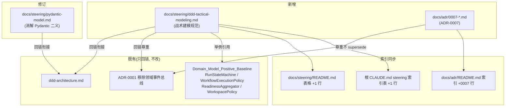

# 设计文档：补齐本项目 DDD 战术建模规范约束（需求 6）

## 概述

本设计只覆盖 requirement.md 的**需求 6：补齐本项目 DDD 战术建模规范约束**。产物全部是文档：新增一份战术建模 steering 规范、修订 `pydantic-model.md` 的方向性冲突措辞、新增 ADR-0007、并同步三处索引。**本轮零源码改动**——不动 `epsilon-boot/src/**` 任何文件，故 `Existing_Test_Suite_Green` 对本需求平凡成立。

需求 6 与需求 1–5 的关系是「规范护栏」：需求 1–5 修既有代码偏差，需求 6 补规范根源（`DDD_Tactical_Modeling_Gap`）——现有 steering 只约束「领域层不依赖基础设施」，从未要求「业务规则必须收敛进实体/领域服务」，故贫血模型在现规范下反而合规。补齐战术建模规范后，需求 2 的建模范式才有据可依、后续 agent 不会再「合规地」写出贫血模型。需求 6 只规定「今后如何建模」，不代替需求 2 执行既有代码的充血化改造。

本设计遵循的仓库规范：`docs/steering/adr.md`（ADR 四段式、只增不改、状态机、supersede 链接）、`docs/steering/change-discipline.md`（§1 最小改动、§2 架构级决策先写 ADR、§4「确需调整规范本身应作为独立显式改动」）、`docs/steering/doc-sync.md`（§3 新增 steering/ADR 须同步所有索引）、`docs/steering/ddd-architecture.md`（新规范须与既有分层规则衔接不冲突）、`docs/steering/code-documentation.md`（举例引用真实符号）。

#### 设计决策

| 决策 | 选定方案 | 理由 |
| --- | --- | --- |
| 决策 1：战术建模规范文件承载方式（AC1） | **新增独立文件** `docs/steering/ddd-tactical-modeling.md`，而非并入 `ddd-architecture.md` | requirement AC1 允许 design 决定。独立文件符合 SRP（`ddd-architecture.md` 管「分层依赖/Port-Adapter 归属」，战术建模管「实体/聚合/领域服务/值对象/仓储」两类关注点）；`ddd-architecture.md` 已被 CLAUDE.md 列为 Required Reading，并入会使其膨胀且冲淡分层主旨。两文件互相回链衔接。 |
| 决策 2：Pydantic 二义的消解方向（AC5/AC6） | **据既成实践确立「领域层用 dataclass、Pydantic 仅在 API/DTO/配置边界」**，并修订 `pydantic-model.md` 而非 `ddd-architecture.md` | 代码以脚投票：`domain/` 下 19 个文件用 `@dataclass(frozen=True)`、0 个用 Pydantic `BaseModel`；`ddd-architecture.md`「明确禁止的依赖」已把 Pydantic 列入领域层禁用项。冲突方在 `pydantic-model.md`，故修订它。属 change-discipline §4「确需调整规范本身」的独立显式改动。 |
| 决策 3：ADR-0007 与 ADR-0001 的关系（AC4/AC9） | **ADR-0007 尊重且不 supersede ADR-0001**；`supersedes:` 留空 | ADR-0001（`Accepted`，移除领域事件总线）是既定前提，战术规范不把「领域事件」列为推荐构件、并显式回链 ADR-0001。二者不冲突（一个讲「不做事件总线」，一个讲「怎么建模实体/服务」），无 supersede 关系。 |
| 决策 4：聚合边界约束的强度（AC8） | **轻量约束 + 判定指引**，不强制所有子域引入聚合根 | requirement 术语表明确「Agent 工作台状态多为会话/流式态、强一致性事务边界影响有限」；主流 DDD 也反对过度设计聚合。规范以「何时才需要引入聚合边界」的判定指引表达，避免为每个子域强推聚合根这一重量级构件。 |
| 决策 5：限界上下文的表达方式（AC7） | **以既有子域目录为天然限界上下文**，不引入上下文映射（Context Map）等重量级战略机制 | requirement AC7 明确要「轻量表达」。仓库已有 `agent`/`chat`/`task`/`run`/`model_access`/`workspace`/`health`/`prompt`/`storage` 子域天然构成上下文边界，只需补「术语在各上下文内保持一致」的约定即可，无需引入映射矩阵。 |
| 决策 6：仓储（Repository）语义如何对齐本仓库 | **说明本仓库以 `domain/*/ports.py` 的 Port 承载仓储语义**，不引入独立 `repository.py` 命名 | 仓库既有实践是「领域 Port（Protocol）+ 基础设施 Adapter」承载持久化能力（如 `TraceStorePort`/`ArtifactStorePort`），与经典 Repository 语义等价。规范据既成实践定义，而非引入新命名造成分裂。 |

## 架构

本需求为纯文档变更，不涉及运行时组件与跨组件时序，故不绘制组件图/时序图（按流水线约定，纯文档/单点变更时图表可选）。下图仅示意四类交付物与既有文档/索引的引用关系，帮助理解同步范围。



### 涉及文件与动作一览

| 文件 | 动作 |
| --- | --- |
| `docs/steering/ddd-tactical-modeling.md` | 新增 |
| `docs/steering/pydantic-model.md` | 修订（第 3 行、第 9 行两处，另补一处「分层与职责」措辞） |
| `docs/adr/0007-establish-domain-tactical-modeling-and-pydantic-boundary.md` | 新增 |
| `docs/steering/README.md` | 表格新增一行 |
| `docs/adr/README.md` | 索引表新增 0007 行 |
| `CLAUDE.md`（仓库根）「项目规范（强制性）」表格 | 新增一行 |

## 组件与接口

本需求无代码组件；此处以「文档结构规格」替代代码签名，逐一给出每份交付物的精确内容规格，使 generator 可直接照此落地而无需猜测。

### 组件 1：新增 `docs/steering/ddd-tactical-modeling.md`（战术建模规范）（覆盖 AC1/AC2/AC3/AC4/AC7/AC8）

- **位置**：`docs/steering/ddd-tactical-modeling.md`
- **文件头**：沿用其它 steering 文档风格（`ddd-architecture.md` 有 `--- inclusion: always ---` front matter，本文件同样加上，标明常驻上下文），首段一句话说明本规范与 `ddd-architecture.md` 的分工（前者管战术建模，后者管分层依赖），并互相回链。
- **举例基准**：每个战术构件都用 `Domain_Model_Positive_Baseline` 的真实符号举例，均为已存在、可直接对照的正确形态：
  - `domain/run/state_machine.py::RunStateMachine`（状态机式领域服务）
  - `domain/run/workflow.py::WorkflowExecutionPolicy`（含 `.validate()`，规则对象 / 策略型值对象）
  - `domain/health/aggregator.py::ReadinessAggregator`（跨对象聚合的领域服务）
  - `domain/workspace/policy.py::WorkspacePolicy`（纯函数式策略、`@dataclass(frozen=True)`）

**完整章节大纲 + 每节要点（这是 design，给出大纲与关键要点，规范全文由 generator 落地）：**

1. **概述与适用范围**
   - 本规范补齐 `ddd-architecture.md` 未覆盖的**战术设计维度**（实体/聚合/领域服务/值对象/仓储语义/限界上下文/通用语言）。
   - 与 `ddd-architecture.md` 分工：分层依赖方向、Port/Adapter 归属仍以 `ddd-architecture.md` 为准；本文件只补「业务规则该以什么构件、住在 `domain/` 的哪个文件」。
   - 明确本规范是**护栏而非一次性改造令**：规定「今后如何建模」，既有贫血模型的渐进纠偏归属需求 2 的单子域试点（回链 AC11）。

2. **值对象（Value Object）**
   - 建模规则：领域值对象用 `@dataclass(frozen=True)`，以「相等即同值、不可变、无独立标识」为判据；构造期校验放 `__post_init__` 或专用 `validate()`（举例 `WorkflowExecutionPolicy.validate()`、`WorkflowCapabilityCheck`）。
   - 放置规则：`domain/<子域>/value_objects.py`（与既有组织一致）。
   - 明确「值对象**不用 Pydantic**」——回链组件 2（`pydantic-model.md` 修订）与 `ddd-architecture.md`「明确禁止的依赖」，三处口径必须一致。

3. **实体（Entity）**
   - 建模规则：具备**稳定标识（identity）+ 生命周期内可变状态**的对象建模为实体；行为（不变量维护）应内聚在实体上，而非散落到应用/基础设施层。
   - 放置规则：`domain/<子域>/entities.py`（本仓库当前尚无该文件，规范据此约定「今后有实体时置于此」）。
   - 说明现状：当前 `domain/task/value_objects.py::Task`、`domain/agent/value_objects.py::AgentConfig` 是「行为仅限 `__post_init__` 校验」的数据载体，属需求 2 待评估的充血化候选，本规范不强制立即改（回链 AC11）。

4. **领域服务（Domain Service）与放置规则（`Domain_Service_Placement`）**
   - 建模规则：**无自然归属某个实体/值对象的跨对象业务规则**才建模为领域服务；领域服务只承载业务判定、不依赖 `application/`/`infrastructure/`、不引入框架 API。
   - 放置规则：`domain/<子域>/domain_service.py`，或与既有样板一致的具名模块（如 `state_machine.py`/`aggregator.py`/`policy.py`）——规范承认既有具名组织合法，不强制统一改名为 `domain_service.py`。
   - 逐一举例：`RunStateMachine`（状态迁移合法性判定）、`WorkflowExecutionPolicy.validate()`（策略字段校验）、`ReadinessAggregator.check_readiness()`（多 `HealthCheckPort` 结果聚合）、`WorkspacePolicy.resolve()`（路径归一化纯函数），并点明它们共有的正确特征：零基础设施依赖、规则内聚、可单测。

5. **聚合根与聚合边界（`Aggregate_Root`）**
   - 建模规则：聚合根是聚合的唯一外部入口、聚合边界即一致性/事务边界。
   - **本仓库上下文约束（AC8）**：Agent 工作台状态多为会话态/流式态，强一致性事务边界影响有限；因此**不强制每个子域引入聚合根**。
   - **「何时才需要引入聚合边界」判定指引**（列为要点清单）：仅当出现「一组对象必须在同一次变更内保持不变量、且存在并发写竞争或跨对象一致性约束」时才引入聚合根；若只是数据分组、无一致性约束，用值对象/实体组合即可，避免过度设计。

6. **仓储（Repository）语义与本项目 Port 命名的关系**
   - 建模规则：本仓库以 `domain/<子域>/ports.py` 中的 **Port（Protocol）** 承载经典 Repository 语义（「按标识取/存领域对象」的能力边界），基础设施层提供 Adapter 实现（举例既有 `TraceStorePort`/`ArtifactStorePort` 等持久化 Port）。
   - 放置规则：领域侧接口在 `ports.py`，实现在 `infrastructure/`；**不新增独立 `repository.py` 命名**，避免与既有 Port 实践分裂（回链决策 6）。

7. **限界上下文与通用语言（`Ubiquitous_Language`）**（AC7）
   - 以既有子域目录 `agent`/`chat`/`task`/`run`/`model_access`/`workspace`/`health`/`prompt`/`storage` 为**天然限界上下文**。
   - 约定：术语在各上下文内保持一致（同一名词在同一子域含义唯一）；跨上下文同名不同义应显式区分。
   - 明确**不引入**重量级上下文映射（Context Map）机制。

8. **不推荐的构件：领域事件（回链 ADR-0001）**（AC4）
   - 显式声明：**领域事件/事件总线不是本仓库推荐的战术构件**，已由 ADR-0001（`Accepted`）主动移除；跨模块副作用编排走 Port/Adapter 与 trace 抽象。
   - 回链 `docs/adr/0001-remove-domain-event-bus.md`，禁止后续 agent 以「补齐战术构件」为由复活事件总线。

9. **与其它规范的衔接**
   - 回链 `srp-principle.md`（序列化/日志属技术关注点，不入领域对象——呼应需求 3/5）、`code-documentation.md`（领域类中文 docstring）、`python-typing-lint.md`（全量类型标注、禁裸 `Any`）、`change-discipline.md`（引入领域服务/实体等一等抽象属架构级决策，须先写 ADR）。

### 组件 2：修订 `docs/steering/pydantic-model.md`（覆盖 AC5/AC6）

按 change-discipline §4 标注为**一次显式规范修订**（在提交说明与 ADR-0007 中注明「这是显式规范修订，非顺手改动」）。逐处 before/after 文本 diff 如下（`old_string` 须与文件当前内容逐字匹配）：

**修订点 A（第 3 行，AC6 指名的第一处）：**

- before：
  > 后端使用 Pydantic 2（`pydantic>=2.12`、`pydantic-settings`）作为数据校验与序列化的统一方案。API 边界与领域数据传递优先使用 Pydantic 模型，衔接 DDD 值对象与请求/响应契约。
- after：
  > 后端使用 Pydantic 2（`pydantic>=2.12`、`pydantic-settings`）作为**API/DTO 与配置边界**的数据校验与序列化方案。API 请求/响应契约、跨进程/跨层的数据传输对象（DTO）、应用配置优先使用 Pydantic 模型；**领域层（`domain/`）不使用 Pydantic**，领域值对象/实体一律用 Python 原生类型与 `@dataclass(frozen=True)`（见 [ddd-architecture.md](ddd-architecture.md)「明确禁止的依赖」与 [ddd-tactical-modeling.md](ddd-tactical-modeling.md)）。

**修订点 B（第 9 行，AC6 指名的第二处）：**

- before：
  > - 领域值对象优先使用不可变模型：`model_config = ConfigDict(frozen=True)`
- after：
  > - **领域值对象不使用 Pydantic**，用 `@dataclass(frozen=True)` 表达不可变性（依据：`domain/` 下 19 个文件用 dataclass、0 个用 Pydantic `BaseModel`）；`ConfigDict(frozen=True)` 仅用于 API/DTO 边界确需不可变的 Pydantic 模型

**修订点 C（第 21 行，「分层与职责」首条，补强一致性）：**

- before：
  > - API 层的请求/响应模型（DTO）与领域模型分离，避免直接把领域对象暴露到 HTTP 边界，遵循 [ddd-architecture.md](ddd-architecture.md)
- after：
  > - API 层的请求/响应模型（DTO，Pydantic）与领域模型（`domain/`，dataclass）分离：DTO↔领域对象的转换在应用层/基础设施层完成，避免直接把领域对象暴露到 HTTP 边界，也避免把 Pydantic 反向引入领域层，遵循 [ddd-architecture.md](ddd-architecture.md) 与 [ddd-tactical-modeling.md](ddd-tactical-modeling.md)

> 说明：修订点 C 非 AC6 强制指名，但为使 `pydantic-model.md` 内部三处表述自洽（避免第 3、9 行改了、第 21 行仍隐含「领域用 Pydantic」）而一并修订，仍属同一次显式规范修订的范围，符合 change-discipline §1「只改达成目标所必需」。generator 落地时若发现文件其余行仍残留「领域…Pydantic」倾向措辞，应一并纳入本次显式修订并在提交说明列明。

### 组件 3：新增 `docs/adr/0007-*.md`（ADR-0007）（覆盖 AC9）

- **文件名**：`docs/adr/0007-establish-domain-tactical-modeling-and-pydantic-boundary.md`
- **front matter**：
  - `status: Accepted`（决策在本 spec 落地即生效，与 0001–0006 一致）
  - `date: 2026-07-06`
  - `deciders: [架构评审]`
  - `supersedes:`（**留空**——不取代任何 ADR，尤其不 supersede ADR-0001）
  - `superseded-by:`（留空）
- **标题**：`ADR-0007：确立领域层战术建模范式与 Pydantic 边界`
- **四段式草案要点**（遵循 `0000-template.md`）：

  1. **背景与问题（Context）**：
     - `DDD_Tactical_Modeling_Gap`：现有 steering 在分层/工程治理达标甚至超越主流，但**战术设计维度覆盖不完整**——`ddd-architecture.md` 全文仅一句提及「实体、值对象、领域事件」三词、无任何建模规则；聚合根、实体、领域服务、仓储语义、限界上下文、通用语言全部缺失或未定义放置规则。
     - 这是需求 1–5 那些偏差的**规范根源**：现规范只要求「领域层不依赖基础设施」，从未要求「业务规则必须收敛进实体/领域服务」，故贫血模型在现规范下反而合规。
     - `Pydantic_Domain_Boundary_Clarification`：`pydantic-model.md`（「领域数据传递优先 Pydantic」「领域值对象优先 `ConfigDict(frozen=True)`」）与 `ddd-architecture.md`（Pydantic 列入领域层禁用依赖）存在方向性二义；代码以脚投票（`domain/` 19 文件 dataclass、0 Pydantic）。

  2. **决策（Decision）**（用「我们将……」陈述）：
     - 我们将新增 `docs/steering/ddd-tactical-modeling.md`，确立领域层战术建模范式（值对象/实体/领域服务/聚合边界判定/仓储 Port 语义/限界上下文=子域目录/通用语言），以 `Domain_Model_Positive_Baseline` 为范例基准。
     - 我们将确立「**领域层用 Python 原生类型 / `@dataclass(frozen=True)`，Pydantic 仅用于 API/DTO 与配置边界**」，并据此修订 `pydantic-model.md` 冲突措辞。
     - 我们将以「轻量约束 + 何时才需引入聚合边界的判定指引」表达聚合，不强制所有子域引入聚合根。
     - 我们**尊重 ADR-0001**：领域事件不列为推荐战术构件，本 ADR 不 supersede ADR-0001。

  3. **后果（Consequences）**：
     - **正面**：后续 agent 有据可依、不再「合规地」写贫血模型；消解 Pydantic 二义，领域纯净度规则单一收敛；需求 2 的建模范式获得规范背书。
     - **负面 / 代价**：新增一份必读 steering，增量阅读成本；既有贫血模型（如 `Task`/`AgentConfig`）与规范存在暂时落差，需靠需求 2 渐进纠偏（本 ADR 不强制立即改）。
     - **后续影响**：今后引入实体/聚合/领域服务等一等抽象仍属架构级决策，须按 change-discipline §2 先写新 ADR；`pydantic-model.md` 与 `ddd-architecture.md` 与新规范三者对「领域层可否用 Pydantic」的表述须永久保持一致。

  4. **备选方案（Alternatives，硬要求含未采纳原因）**：
     - **方案 A：把战术规范并入 `ddd-architecture.md`** —— 未采纳：违反 SRP，使分层规范膨胀、冲淡分层主旨（见决策 1）。
     - **方案 B：修订 `ddd-architecture.md` 改为允许领域层用 Pydantic** —— 未采纳：与既成实践（`domain/` 0 Pydantic）及领域纯净度目标相悖，会诱导框架耦合下沉领域层。
     - **方案 C：强制所有子域立即引入聚合根/充血实体** —— 未采纳：Agent 工作台状态多为会话/流式态、一致性边界影响有限，全面强推属过度设计且与 change-discipline 最小改动冲突。
     - **方案 D：引入领域事件补齐「事件」这一战术构件** —— 未采纳：ADR-0001 已 `Accepted` 移除事件总线，复活须走 supersede 流程且当前无稳定订阅方；跨模块副作用走 Port/Adapter + trace。

### 组件 4：索引同步（覆盖 AC1 的登记要求、遵循 doc-sync §3）

**4a. `docs/steering/README.md` 表格**：在 `ddd-architecture.md` 行之后新增一行（保持战术建模紧邻分层规范）：

```
| [ddd-tactical-modeling.md](ddd-tactical-modeling.md) | DDD 战术建模：值对象/实体/领域服务/聚合边界判定/仓储 Port 语义/限界上下文=子域目录/通用语言；领域层用 dataclass 不用 Pydantic。 |
```

**4b. `docs/adr/README.md` 索引表**：在 0006 行之后新增：

```
| [0007](0007-establish-domain-tactical-modeling-and-pydantic-boundary.md) | 确立领域层战术建模范式与 Pydantic 边界 | Accepted | 2026-07-06 |
```

**4c. 仓库根 `CLAUDE.md`「项目规范（强制性）」表格**：在 `ddd-architecture.md` 行之后新增一行：

```
| [docs/steering/ddd-tactical-modeling.md](docs/steering/ddd-tactical-modeling.md) | DDD 战术建模：值对象/实体/领域服务/聚合边界判定/仓储 Port 语义/限界上下文与通用语言；领域层用 dataclass，Pydantic 仅在 API/DTO/配置边界。 |
```

> 说明：doc-sync §3 还列出 `AGENT.md` 的规范表；经核查仓库根不存在 `AGENT.md`（仅 `CLAUDE.md`），故本项不适用；若 generator 落地时发现存在 `AGENT.md`，须一并新增同样一行。

## 数据模型

不适用。需求 6 为纯文档变更，不涉及任何领域模型、持久化模型、DDL、ORM/PO 或配置键的新增/修改。

## 事务与并发边界

不适用。需求 6 不写任何数据、不触碰运行时代码，无事务或并发边界（requirement AC10 明确「零代码改动、零测试影响」）。

## 正确性属性

### Property 1：三处规范对「领域层可否用 Pydantic」表述一致

修订后，`ddd-architecture.md`（「明确禁止的依赖」列 Pydantic）、`pydantic-model.md`（修订点 A/B/C）、`ddd-tactical-modeling.md`（值对象节 + 与 pydantic 衔接节）三份文档对「领域层不使用 Pydantic、Pydantic 仅在 API/DTO/配置边界」的表述必须字面一致，不得任一处仍残留「领域数据/值对象优先用 Pydantic」倾向。

验证需求：AC5、AC6。

### Property 2：新规范不推荐领域事件且回链 ADR-0001

`ddd-tactical-modeling.md` 不得把「领域事件/事件总线」列为推荐战术构件，须显式声明其已由 ADR-0001 移除并回链该 ADR；ADR-0007 `supersedes:` 字段为空、不回退 ADR-0001 的领域事件决策。

验证需求：AC4、AC9。

### Property 3：各战术构件均以正向样板真实符号举例

`ddd-tactical-modeling.md` 中值对象、实体、领域服务、聚合、仓储各节的举例，均引用 `Domain_Model_Positive_Baseline` 的真实存在符号（`RunStateMachine` / `WorkflowExecutionPolicy` / `ReadinessAggregator` / `WorkspacePolicy`），不得虚构不存在的类。

验证需求：AC3。

### Property 4：聚合边界以判定指引表达、不强制全域引入

规范对聚合的约束须为「轻量约束 + 何时才需引入聚合边界的判定指引」，并含「Agent 工作台状态多为会话/流式态、强一致性边界影响有限」的上下文说明，不得出现「所有子域必须引入聚合根」这类强制条款。

验证需求：AC8、AC11。

### Property 5：索引与实际文件一致

新增 `ddd-tactical-modeling.md` 后，`docs/steering/README.md` 与根 `CLAUDE.md` 规范表均含其条目；新增 ADR-0007 后 `docs/adr/README.md` 含 0007 行且文件存在。索引与实际文件不一致视为缺陷（doc-sync §3）。

验证需求：AC1、AC9。

### Property 6：零源码影响

需求 6 落地后 `epsilon-boot/src/**` 与 `test/**` 无任何改动，既有测试全绿基线不受影响。

验证需求：AC10、AC11。

## 错误处理

不适用于运行时错误模型（无代码改动，不引入/复用任何异常类型或响应包装）。此处以**文档一致性校验的失败判定**替代：任一「正确性属性」不成立即视为交付缺陷，须在 generator 阶段修正后重跑校验，不放行到评审。校验方式见「测试策略」。

## 测试策略

需求 6 零源码改动，验证以**文档一致性检查**为主，全部为可执行/可核查命令；`Existing_Test_Suite_Green` 仅作为「零源码影响」的旁证（AC10）。以下命令均在仓库根 `/workspace` 下执行（涉及测试的命令在 `epsilon-boot/` 下）。

### 文档一致性校验（对应正确性属性）

1. **Pydantic 冲突措辞已消除（Property 1，AC5/AC6）**：
   - `grep -n "领域数据传递优先使用 Pydantic" docs/steering/pydantic-model.md` → **零命中**（原第 3 行冲突措辞已改）。
   - `grep -n "领域值对象优先使用不可变模型" docs/steering/pydantic-model.md` → **零命中**（原第 9 行冲突措辞已改）。
   - `grep -n "领域层.*不使用 Pydantic\|Pydantic 仅用于 API/DTO" docs/steering/pydantic-model.md` → **有命中**（新措辞已落地）。
2. **战术规范存在且举例真实（Property 3，AC1/AC3）**：
   - `test -f docs/steering/ddd-tactical-modeling.md` → 存在。
   - `grep -n "RunStateMachine\|WorkflowExecutionPolicy\|ReadinessAggregator\|WorkspacePolicy" docs/steering/ddd-tactical-modeling.md` → 四个符号均命中。
3. **不推荐领域事件并回链 ADR-0001（Property 2，AC4）**：
   - `grep -n "ADR-0001\|0001-remove-domain-event-bus" docs/steering/ddd-tactical-modeling.md` → 有命中。
   - 人工核查：文中「领域事件」仅出现在「不推荐/已移除」语境，无推荐措辞。
4. **聚合以判定指引表达（Property 4，AC8）**：人工核查含「何时才需要引入聚合边界」判定指引与「会话/流式态、一致性边界影响有限」上下文说明，无「所有子域必须引入聚合根」强制条款。
5. **ADR-0007 存在且已登记（Property 5，AC9）**：
   - `test -f docs/adr/0007-establish-domain-tactical-modeling-and-pydantic-boundary.md` → 存在。
   - `grep -n "0007" docs/adr/README.md` → 有命中。
   - `grep -nA6 "^---" docs/adr/0007-*.md | grep -n "supersedes:"` → 该字段存在且值为空（不 supersede ADR-0001）。
   - 人工核查 ADR-0007 含四段（背景/决策/后果/备选方案），备选方案含未采纳原因。
6. **索引一致（Property 5，AC1/AC9，doc-sync §3）**：
   - `grep -n "ddd-tactical-modeling" docs/steering/README.md` → 有命中。
   - `grep -n "ddd-tactical-modeling" CLAUDE.md` → 有命中。
7. **零源码影响（Property 6，AC10/AC11）**：
   - `git diff --name-only` → 改动文件全部落在 `docs/` 下，`epsilon-boot/` 零命中。
   - `cd epsilon-boot && PYTHONPATH=src uv run --frozen pytest` → 全绿（作为零源码影响的旁证；本需求不新增/修改任何测试）。

### 属性 → 需求可追溯性

| 正确性属性 | 验证需求（AC） |
| --- | --- |
| Property 1 | AC5、AC6 |
| Property 2 | AC4、AC9 |
| Property 3 | AC3 |
| Property 4 | AC8、AC11 |
| Property 5 | AC1、AC9 |
| Property 6 | AC10、AC11 |

### AC → 交付物映射表（需求 6 全覆盖自查）

| 验收标准 | 交付物 |
| --- | --- |
| AC1（规范落地并在 README/CLAUDE.md 登记） | 组件 1 + 组件 4a/4c |
| AC2（定义聚合/实体/领域服务/值对象/仓储的建模+放置规则） | 组件 1 第 2/3/4/5/6 节 |
| AC3（以正向样板举例） | 组件 1「举例基准」+ 各节举例（Property 3） |
| AC4（不推荐领域事件、回链 ADR-0001） | 组件 1 第 8 节 + 组件 3 决策/备选方案 D（Property 2） |
| AC5（消解 Pydantic 二义、确立既成实践） | 组件 2 修订点 A/B/C + 组件 1 第 2 节（Property 1） |
| AC6（修订 pydantic-model.md 两处、标注显式规范修订） | 组件 2 修订点 A/B（+C）（Property 1） |
| AC7（限界上下文=子域目录、通用语言、不引入重量级映射） | 组件 1 第 7 节 |
| AC8（聚合一致性以轻量约束+判定指引表达） | 组件 1 第 5 节（Property 4） |
| AC9（新增 ADR-0007、README 登记、尊重不 supersede ADR-0001） | 组件 3 + 组件 4b（Property 2/5） |
| AC10（零源码改动、既有测试平凡全绿） | 全交付物均限于 `docs/`（Property 6，测试策略第 7 项） |
| AC11（不代替需求 2 强制充血化改造） | 组件 1 第 1/3 节明确「护栏而非改造令」（Property 4/6） |

## 风险与回滚

- **风险等级：低**——纯文档变更，不触碰任何源码、配置、依赖，无运行时/行为影响。
- **主要风险**：三处规范措辞不一致（Property 1 未满足）导致后续 agent 仍被旧措辞误导。缓解：测试策略第 1 项 grep 校验 + Property 1 人工核查双重把关。
- **次要风险**：ADR-0007 误填 `supersedes: ADR-0001` 而回退领域事件决策。缓解：测试策略第 5 项显式校验 `supersedes:` 为空。
- **回滚方式**：所有改动均在 `docs/` 下且为独立文件/独立行，回滚只需 `git revert` 本次提交，或删除 `ddd-tactical-modeling.md`/`0007-*.md` 两新增文件并还原 `pydantic-model.md`、三处索引表格；因零源码改动，回滚无需重跑构建，`Existing_Test_Suite_Green` 不受影响。
