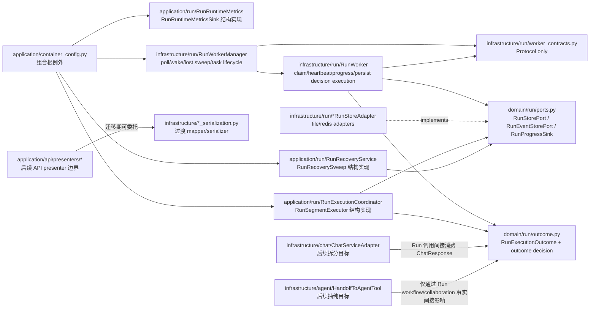
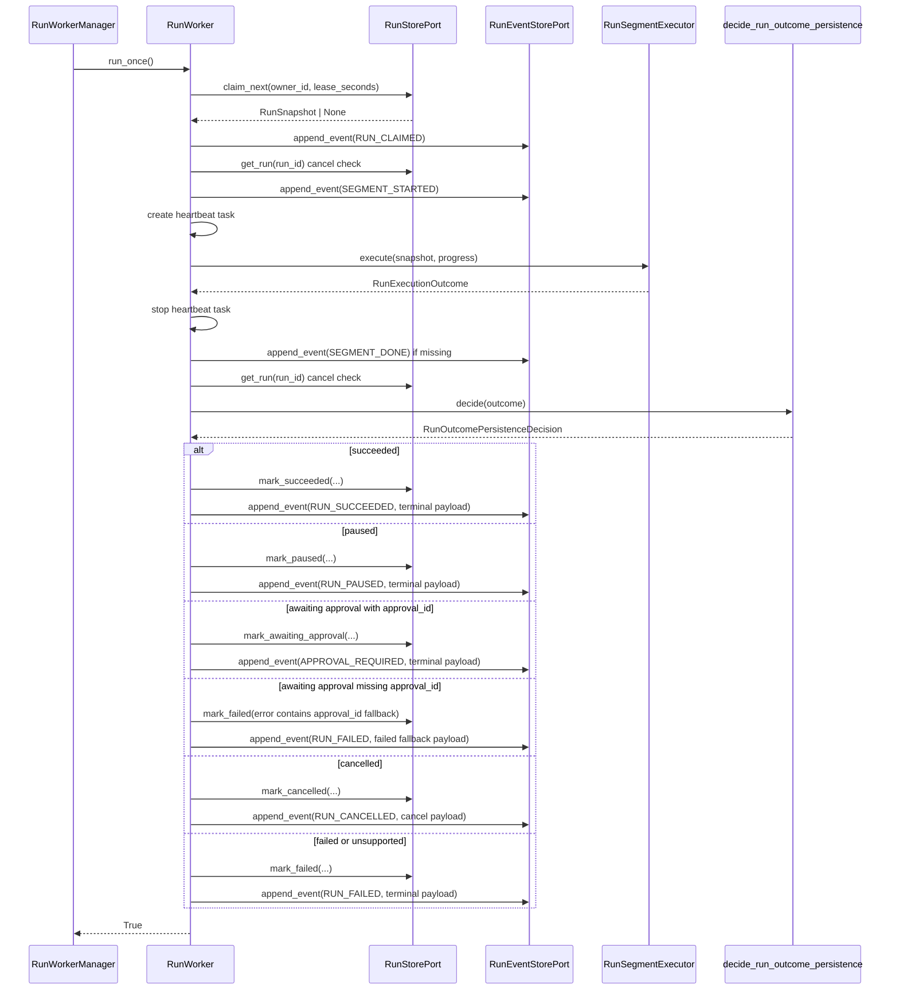

# 设计文档：DDD Infrastructure Logic Remediation

## 概述

本设计在既有 DDD 分层约束（`application -> domain <- infrastructure`）下，按最小切片治理 `infrastructure` 承载过多用例/领域判定和跨层导入的问题。第一实现切片固定为 Run worker 依赖反转：保留 claim、lease、heartbeat、asyncio task lifecycle、poll/wake、progress、lost sweep 等 worker runtime 技术职责在 `infrastructure/run`，同时消除 `run_worker.py` 与 `run_worker_manager.py` 对 `application.run.*` 的生产代码直接导入。

整体采用行为等价迁移：先把 Run 执行结果与 outcome 持久化判定收敛到可单测边界，再阶段化处理 ChatServiceAdapter、Handoff tool、API serializer/presenter 与静态 import guard。设计不引入领域事件总线，不重开 Agent Loop P2 第三片，不移动 asyncio/ContextVar/OTel/Redis/OpenAI SDK/Pydantic 等技术关注点进入 `domain`，并保持 ADR-0001/0010/0011/0012/0013/0015 的既定结论。

#### 设计决策

| 决策 | 选项 | 理由 |
| --- | --- | --- |
| 第一切片顺序 | 选择 `Run_Worker_Dependence_Inversion_Slice` 先做；Chat/Handoff/API 后续阶段化 | 需求 1 明确要求第一切片消除 `infrastructure/run` 对 `application.run.*` 的直接导入；Run worker 变更面最小且可用现有 worker 单测锁定行为。 |
| Run outcome 类型归属 | 将 `RunExecutionOutcome` 迁入 `domain/run/outcome.py`，应用协调器与基础设施 worker 均依赖 domain | 若 outcome 留在 application，infra 无法类型化消费而不反向导入；迁入 domain 后保持 `application -> domain <- infrastructure`，字段语义仍是 Run 子域生命周期结果。 |
| Outcome 持久化判定归属 | 在 `domain/run/outcome.py` 提供纯函数 `decide_run_outcome_persistence(...)` 与 frozen 决策值对象 | 判定只依赖 `RunStatus`、`RunEventType` 和 outcome 字段，不触 I/O、日志、asyncio 或 adapter，可脱离 worker runtime 单测，并覆盖缺失 approval id fallback。 |
| Worker 对 application collaborator 的依赖方式 | 在 `infrastructure/run/worker_contracts.py` 定义结构化 `Protocol`，manager/worker 构造函数接受协议类型 | `RunExecutionCoordinator`、`RunRecoveryService`、`RunRuntimeMetrics` 保持在 application，但由组合根注入；infra 只依赖本层协议与 domain 类型，不导入 application 具体类。 |
| Runtime 技术职责 | claim、lease refresh、heartbeat task、cancel check、segment progress、lost sweep、poll/wake 继续留 `infrastructure/run` | 这些职责依赖异步任务生命周期、存储 adapter 时序和后台 worker runtime，不属于 domain；符合 ADR-0013 对 asyncio/ContextVar 等运行时技术边界的口径。 |
| API serializer 边界 | 不在第一切片迁移；后续优先引入 `application/api/presenters/`，过渡期用精确受控例外 | ADR-0008 将领域序列化外移到 infrastructure mapper，但当前 application router 直接 import infrastructure mapper 会破坏默认方向。需单独盘点并迁移，避免混入 Run worker 第一切片。 |
| ChatServiceAdapter 边界 | 先诊断分类，再迁移会话/系统 prompt/continue/resume 等用例编排到 application；流式包装与技术适配留 infra | 该文件职责混合且体量大，直接搬迁风险高。分阶段能保留现有分段执行、审批恢复和事件流行为。 |
| Handoff tool 边界 | 仅抽取 depth/handoff count 等纯判定；ContextVar、DelegationPort、ToolExecutionResult、collaboration recorder 留 infra | 符合需求 4 与 ADR-0013：运行时上下文、工具适配和事件记录是基础设施技术/适配职责。 |
| 静态 import guard | 扩展现有 AST 测试，新增 infra→app 禁止规则与 app→infra 精确白名单规则 | 现有测试只保护 domain/common。新增规则必须比较实际违规集合与显式 allowlist，白名单新增或扩大都必须修改测试常量并接受评审。 |
| ADR 判断 | 当前 ADR checkpoint：第一 Run worker 切片不新增 ADR；API presenters 本任务不新增单独 ADR；Chat workflow/service 与 Handoff policy 已由 ADR-0016 Accepted 记录 | 不 supersede ADR-0001/0008/0010/0011/0012/0013/0015。API presenters 作为本 spec 的行为等价 presenter 边界与静态 guard 受控收敛处理，后续若扩展为通用 presenter 框架再新增 ADR。 |

### ADR 判断检查点（task 11.2）

对照 `docs/steering/adr.md`、`docs/adr/README.md` 与已 Accepted 的 ADR-0016，当前结论如下：

- 第一 Run worker 切片是既有 outcome DTO 归位、纯 outcome 持久化判定抽取和 worker collaborator 依赖反转，由组合根注入应用协作者；不新增 ADR。
- API presenter 切片只把 health/task HTTP response presenter 收敛到 `application/api/presenters/`，并用静态 guard 精确登记剩余 `application/run/*` serializer 受控迁移例外；本任务不新增单独 ADR。若后续扩展为跨 API 的通用 presenter 框架，再按新一等抽象评估 ADR。
- Chat 边界与 Handoff policy 已由 `docs/adr/0016-application-chat-workflow-and-handoff-policy-boundaries.md` 记录为 Accepted：`ChatSessionContextWorkflow`、`ChatApplicationService` 与 `domain/agent/handoff_policy.py` 是长期边界，`ChatServiceAdapter` 与 `HandoffToAgentTool` 的运行时 / 工具适配职责仍在 infrastructure。
- 本 spec 未 supersede ADR-0001、ADR-0008、ADR-0010、ADR-0011、ADR-0012、ADR-0013 或 ADR-0015；不引入领域事件总线，不重开工具并发骨架，不修复 handoff model discrepancy。

## 架构





实现切片顺序：

1. **Run worker 依赖反转**：迁移 outcome 类型与判定、引入 worker contracts、改造 `RunWorker` / `RunWorkerManager` 构造签名、更新组合根和聚焦测试。
2. **静态 import guard 加固**：在第一切片同 PR 或紧随其后扩展 AST 测试，阻断 infra→app 回归，并用精确白名单锁住 app→infra 例外。
3. **API presenter/serializer 收敛**：盘点 router 和 `application/run/*` 的 serializer 导入，优先迁移到 `application/api/presenters/` 或登记受控迁移例外。
4. **ChatServiceAdapter 边界拆分**：按职责迁移用例编排，保持流式协议、审批恢复和分段续跑行为等价。
5. **Handoff tool 纯判定抽取**：抽取 depth/handoff count 判定，保留工具适配和运行时上下文在 infrastructure。

## 组件与接口

### 1. Run outcome 领域值对象与持久化判定

位置：`epsilon-boot/src/domain/run/outcome.py`

职责：

- 承载单个 Run 执行段的 JSON-safe outcome，替代 `application.run.run_execution_coordinator.RunExecutionOutcome` 作为唯一权威类型。
- 将 outcome status 映射为 store mutation 与 terminal event type。
- 保留当前缺失 `approval_id` 的 awaiting approval fallback：转为 failed outcome、调用 `mark_failed`、写 `RUN_FAILED`。

建议签名：

```python
"""Run 执行结果与持久化判定领域模块。"""

from __future__ import annotations

from dataclasses import dataclass
from enum import StrEnum
from typing import Any

from domain.run.value_objects import RunEventType, RunStatus


@dataclass(frozen=True)
class RunExecutionOutcome:
    """单次 Run 执行段的 JSON-safe 结果。"""

    status: RunStatus
    result: dict[str, Any] | None = None
    error: dict[str, Any] | None = None
    terminal_reason: str | None = None
    can_continue: bool = False
    approval_id: str | None = None
    segment_metadata: dict[str, Any] | None = None
    workflow_run_state: dict[str, Any] | None = None
    collaboration_summary: dict[str, Any] | None = None


class RunStoreMutationKind(StrEnum):
    """Run outcome 对应的 RunStore 写入动作。"""

    MARK_SUCCEEDED = "mark_succeeded"
    MARK_PAUSED = "mark_paused"
    MARK_AWAITING_APPROVAL = "mark_awaiting_approval"
    MARK_FAILED = "mark_failed"
    MARK_CANCELLED = "mark_cancelled"


@dataclass(frozen=True)
class RunStoreMutation:
    """RunStorePort 终态或暂停态写入参数。"""

    kind: RunStoreMutationKind
    result: dict[str, Any] | None = None
    error: dict[str, Any] | None = None
    approval_id: str | None = None
    reason: str | None = None
    workflow_run_state: dict[str, Any] | None = None
    collaboration_summary: dict[str, Any] | None = None


@dataclass(frozen=True)
class RunOutcomePersistenceDecision:
    """Run worker 按 outcome 应执行的存储变更与事件写入。"""

    mutation: RunStoreMutation
    event_type: RunEventType
    terminal_outcome: RunExecutionOutcome


def decide_run_outcome_persistence(
    outcome: RunExecutionOutcome,
) -> RunOutcomePersistenceDecision:
    """把执行结果转换为 RunStore mutation 与 RunEventType。

    该函数不得导入 application/infrastructure，不执行 I/O，不记录日志。
    """
```

判定规则：

| 输入 status | mutation | event_type | 备注 |
| --- | --- | --- | --- |
| `SUCCEEDED` | `MARK_SUCCEEDED(result=outcome.result or {})` | `RUN_SUCCEEDED` | 保留 workflow/collaboration 字段。 |
| `PAUSED` | `MARK_PAUSED(result=outcome.result or {})` | `RUN_PAUSED` | 保留 `can_continue` 只进入事件 payload，store 的 can_continue 由 adapter 当前语义决定。 |
| `AWAITING_APPROVAL` 且 `approval_id` 非空 | `MARK_AWAITING_APPROVAL(approval_id, result=outcome.result or {})` | `APPROVAL_REQUIRED` | 保持当前审批等待路径。 |
| `AWAITING_APPROVAL` 且 `approval_id` 为空 | `MARK_FAILED(error={"message": "...approval_id...", "status": "awaiting_approval"})` | `RUN_FAILED` | `terminal_outcome.status` 改为 `FAILED`，保留 segment/workflow/collaboration。 |
| `CANCELLED` | `MARK_CANCELLED(reason=outcome.terminal_reason or "cancelled")` | `RUN_CANCELLED` | 保持 `_mark_cancelled` 当前 reason fallback。 |
| `FAILED` | `MARK_FAILED(error=outcome.error or unsupported fallback)` | `RUN_FAILED` | 显式 failed 走失败事件。 |
| 其它 status | `MARK_FAILED(error={"message": f"Unsupported run outcome status: {status.value}", "status": status.value})` | `RUN_FAILED` | 覆盖 queued/running/cancel_requested/lost 等不应作为 outcome 的状态。 |

### 2. Run worker 结构化 collaborator 协议

位置：`epsilon-boot/src/infrastructure/run/worker_contracts.py`

职责：

- 只定义 worker runtime 需要的结构协议，避免 import `application.run.*`。
- 协议引用 domain value object 和 port，不引用 FastAPI/Pydantic/Redis/OpenAI SDK。
- `RunExecutionCoordinator`、`RunRecoveryService`、`RunRuntimeMetrics` 通过结构类型自然满足协议，无需继承。

建议签名：

```python
"""Run worker 运行时 collaborator 协议。"""

from __future__ import annotations

from datetime import datetime
from typing import Protocol

from domain.run.outcome import RunExecutionOutcome
from domain.run.ports import RunProgressSink
from domain.run.value_objects import RunSnapshot


class RunSegmentExecutor(Protocol):
    """执行一个 Run segment 的应用协作者协议。"""

    async def execute(
        self,
        snapshot: RunSnapshot,
        progress: RunProgressSink,
    ) -> RunExecutionOutcome:
        """执行 Run 快照并返回执行结果。"""
        ...


class RunRecoverySweep(Protocol):
    """对过期租约 Run 执行 checkpoint recovery sweep 的协议。"""

    async def sweep_expired_leases(self, *, now: datetime) -> list[RunSnapshot]:
        """扫描过期租约并返回恢复或 lost 后的快照。"""
        ...


class RunRuntimeMetricsSink(Protocol):
    """Run worker 运行时指标写入协议。"""

    def increment_claim_success(self) -> None: ...
    def increment_lost(self, count: int = 1) -> None: ...
    def observe_execution_duration(self, duration_seconds: float) -> None: ...
    def increment_execution_failed(self) -> None: ...
```

### 3. RunWorker

位置：`epsilon-boot/src/infrastructure/run/run_worker.py`

职责保留：

- `claim_next`、`refresh_lease`、heartbeat loop、cancel pre/post segment check。
- `_WorkerProgressSink` 写 `SEGMENT_STARTED` / `SEGMENT_DONE`。
- 调用 `RunSegmentExecutor.execute(...)`。
- 执行 `RunOutcomePersistenceDecision` 对应的 `RunStorePort` 和 `RunEventStorePort` 调用。
- 日志、metrics、JSON-safe event payload 仍留 worker runtime。

构造签名调整：

```python
from domain.run.outcome import RunExecutionOutcome, RunOutcomePersistenceDecision
from infrastructure.run.worker_contracts import RunRuntimeMetricsSink, RunSegmentExecutor


class RunWorker:
    """从 RunStore 领取 queued Run 并推进一个执行段。"""

    def __init__(
        self,
        *,
        run_store: RunStorePort,
        event_store: RunEventStorePort,
        executor: RunSegmentExecutor,
        lease_seconds: int,
        heartbeat_interval_seconds: float,
        owner_id: str | None = None,
        metrics: RunRuntimeMetricsSink | None = None,
    ) -> None: ...

    async def run_once(self) -> bool: ...

    async def heartbeat_loop(
        self,
        run_id: str,
        owner_id: str,
        stop_event: asyncio.Event | None = None,
    ) -> None: ...

    async def _execute(
        self,
        snapshot: RunSnapshot,
        progress: RunProgressSink,
    ) -> RunExecutionOutcome: ...

    async def _persist_outcome(
        self,
        run_id: str,
        outcome: RunExecutionOutcome,
    ) -> None: ...

    async def _apply_store_mutation(
        self,
        run_id: str,
        decision: RunOutcomePersistenceDecision,
    ) -> RunSnapshot: ...
```

实现要求：

- `_execute` 捕获异常时构造 `domain.run.outcome.RunExecutionOutcome(status=FAILED, ...)`。
- `_persist_outcome` 不再包含 status 分支判定；只调用 `decide_run_outcome_persistence(outcome)` 并执行 mutation。
- `_append_terminal_event` 使用 `decision.terminal_outcome`，确保缺失 approval id fallback 写 failed outcome payload。
- `_mark_cancelled` 可保留作为 cancel pre/post segment 复用；outcome cancelled 分支可调用相同 helper 或走 `_apply_store_mutation` 后统一 append。

### 4. RunWorkerManager

位置：`epsilon-boot/src/infrastructure/run/run_worker_manager.py`

职责保留：

- worker task 创建/取消、`wake_up()`、poll wait、lost sweep loop。
- checkpoint recovery 开关判断和 stage-three lost sweep。
- 不 import `RunExecutionCoordinator`、`RunRecoveryService`、`RunRuntimeMetrics`。

构造签名调整：

```python
from infrastructure.run.worker_contracts import (
    RunRecoverySweep,
    RunRuntimeMetricsSink,
    RunSegmentExecutor,
)


class RunWorkerManager:
    """管理一组后台 RunWorker 和过期 lease sweep 任务。"""

    def __init__(
        self,
        *,
        run_store: RunStorePort,
        event_store: RunEventStorePort,
        executor: RunSegmentExecutor,
        config: RunRuntimeConfig,
        poll_interval_seconds: float | None = None,
        owner_prefix: str | None = None,
        metrics: RunRuntimeMetricsSink | None = None,
        recovery_sweep: RunRecoverySweep | None = None,
    ) -> None: ...
```

兼容策略：

- 参数名建议从 `coordinator` 改为 `executor`，从 `recovery_service` 改为 `recovery_sweep`；测试和组合根同步更新。
- 若为了最小 diff 保留旧参数名，也必须把类型改为协议，且文件不得再导入 `application.run.*`。

### 5. RunExecutionCoordinator 与 RunRecoveryService

位置：

- `epsilon-boot/src/application/run/run_execution_coordinator.py`
- `epsilon-boot/src/application/run/run_checkpoint_recovery_service.py`

职责：

- `RunExecutionCoordinator.execute(...)` 保持应用层用例协调职责，但返回类型改为 `domain.run.outcome.RunExecutionOutcome`。
- 删除本文件内 `RunExecutionOutcome` dataclass 定义，改为 import domain 类型。
- `RunRecoveryService` 不改行为；通过结构协议被 manager 消费。

签名：

```python
from domain.run.outcome import RunExecutionOutcome


class RunExecutionCoordinator:
    async def execute(
        self,
        snapshot: RunSnapshot,
        progress: RunProgressSink,
    ) -> RunExecutionOutcome:
        """执行一个 Run 快照并返回可持久化 outcome。"""
```

### 6. 组合根装配

位置：`epsilon-boot/src/application/container_config.py`

职责：

- 继续作为受控组合根例外，同时引用 application collaborator 与 infrastructure worker。
- 将 `RunExecutionCoordinator` / `RunRecoveryService` 实例注入 `RunWorkerManager` 的协议参数。
- 组合根可继续 import `infrastructure.run.run_worker_manager.RunWorkerManager`，不计入普通 `Application_To_Infrastructure_Import_Rule` 违规。

建议调整：

```python
async def _create_run_worker_manager() -> RunWorkerManager:
    """创建并缓存 RunWorkerManager，供生命周期资源和唤醒回调共享。"""

    run_store = await container.resolve(RunStorePort)
    event_store = await container.resolve(RunEventStorePort)
    executor = await container.resolve(RunExecutionCoordinator)
    recovery_sweep = None
    if (
        run_runtime_config.checkpoint_enabled
        and run_runtime_config.checkpoint_auto_recovery_enabled
    ):
        recovery_sweep = await container.resolve(RunRecoveryService)
    return RunWorkerManager(
        run_store=run_store,
        event_store=event_store,
        executor=executor,
        config=run_runtime_config,
        recovery_sweep=recovery_sweep,
    )
```

### 7. API presenter/serializer 后续边界

建议新增位置：

- `epsilon-boot/src/application/api/presenters/health_presenter.py`
- `epsilon-boot/src/application/api/presenters/task_presenter.py`
- `epsilon-boot/src/application/api/presenters/run_presenter.py`（仅当迁移 `application/run/*` serializer 导入需要共享）

职责：

- API/HTTP response body 映射归入 application presenter 边界。
- presenter 可先委托现有 `infrastructure.*_serialization` mapper，作为受控迁移例外；最终目标是 presenter 内部只依赖 domain DTO/value object 和 API Pydantic body。
- 不把 Pydantic 或 HTTP response 结构引入 domain。

建议签名：

```python
"""健康检查 API presenter。"""

from __future__ import annotations

from domain.health.value_objects import ReadinessResult


def readiness_result_to_response_body(value: ReadinessResult) -> dict[str, object]:
    """把 readiness 领域结果映射为 HTTP 响应体。"""
```

```python
"""任务 API presenter。"""

from __future__ import annotations

from domain.agent.segmented_execution import SegmentBudgetUsage, SegmentRunMetadata
from domain.task.value_objects import TaskResult


def segment_budget_usage_to_response_body(
    value: SegmentBudgetUsage,
) -> dict[str, int | float]:
    """把分段预算用量映射为任务 HTTP body。"""


def task_result_to_response_body(result: TaskResult) -> dict[str, object]:
    """把 TaskResult 映射为任务 HTTP response body 字段。"""
```

受控迁移例外登记格式：

```python
APPLICATION_INFRASTRUCTURE_IMPORT_EXCEPTIONS: dict[str, tuple[str, ...]] = {
    "src/application/api/routers/health.py": (
        "infrastructure.health.health_serialization",
    ),
    "src/application/api/routers/task.py": (
        "infrastructure.agent.segment_serialization",
    ),
    # application/run/* 中 guardrail/workflow/segment serialization 的局部 import
    # 需逐项精确列入，清理一项删除一项。
}
```

### 8. ChatServiceAdapter 后续拆分目标

位置现状：`epsilon-boot/src/infrastructure/chat/chat_service_adapter.py`

阶段化目标：

| 职责 | 当前位置 | 目标归属 | 说明 |
| --- | --- | --- | --- |
| 会话加载、保存、SessionIndex 更新 | `ChatServiceAdapter._save_context_and_index`、`chat`、`continue`、stream 方法 | 优先迁移到 `application/chat/chat_application_service.py` 或 `application/chat/session_context_workflow.py` | 属用例编排；Session store 仍通过 domain Port 注入。 |
| 系统 prompt 注入 | `_ensure_system_prompt` + 构造期 prompt 加载 | prompt 加载/Workspace guidance 留 infra adapter，是否注入的幂等判定可迁至 application/domain 纯函数 | 不把 prompt 文件系统和 workspace guidance helper 移入 domain。 |
| 分段续跑编排 | `_run_segmented_agent_on_context`、stream segmented 方法 | 应用层编排，继续复用 `domain.agent.segmented_orchestration.decide_next_segment` | 领域续跑判定已在 domain，infra 不再复制。 |
| 审批恢复编排 | `_resume_to_agent_result`、`resume_approval`、`stream_resume_approval` | 应用层用例服务 | 保留 load/is_expired/consume/resume 顺序与异常语义。 |
| 直接模型调用包装 | direct LLM path + `ContextBuilderPort` + `ModelAccessPort` | 可留 infra 或作为 adapter helper | 涉及模型 adapter 技术转换。 |
| `StreamingChunk` / `AgentStreamEvent` 包装 | `stream_chat`、`stream_chat_events`、`_stream_model_events` | 留 infrastructure | 流式协议、chunk 包装、metadata 合并属于技术适配。 |

建议签名：

```python
"""聊天用例编排服务。"""

from __future__ import annotations

from collections.abc import AsyncIterator

from domain.agent.value_objects import AgentStreamEvent
from domain.chat.value_objects import (
    ApprovalResumeRequestVO,
    ChatContinueRequestVO,
    ChatRequestVO,
    ChatResponseVO,
)


class ChatApplicationService:
    """聊天用例编排，隔离会话/continue/resume 流程。"""

    async def chat(self, request: ChatRequestVO) -> ChatResponseVO: ...

    async def continue_chat(
        self,
        request: ChatContinueRequestVO,
    ) -> ChatResponseVO: ...

    async def resume_approval(
        self,
        request: ApprovalResumeRequestVO,
    ) -> ChatResponseVO: ...

    async def stream_chat_events(
        self,
        request: ChatRequestVO,
    ) -> AsyncIterator[AgentStreamEvent]: ...
```

第一切片不实现该服务，只在任务拆分中登记诊断与后续迁移。

### 9. Handoff 纯判定后续抽取

建议位置：`epsilon-boot/src/domain/agent/handoff_policy.py`

职责：

- 输入当前 depth、max depth、可选 workflow collaboration context 中的 limit/handoff count，输出 allow/reject decision。
- 不读取 ContextVar，不调用 DelegationPort，不构造 ToolExecutionResult，不写 collaboration recorder。

建议签名：

```python
"""Handoff 纯判定领域策略。"""

from __future__ import annotations

from dataclasses import dataclass

from domain.run.workflow_context import WorkflowCollaborationContext


@dataclass(frozen=True)
class HandoffDecision:
    """Handoff 前置判定结果。"""

    allowed: bool
    next_depth: int
    effective_max_depth: int
    reason: str | None = None


def decide_handoff(
    *,
    current_depth: int,
    max_delegation_depth: int,
    workflow_context: WorkflowCollaborationContext | None,
) -> HandoffDecision:
    """判定 handoff 是否满足深度与 workflow handoff count 限制。"""
```

`HandoffToAgentTool.execute(...)` 后续只委托该函数做判定。拒绝时仍由 tool 构造当前错误 content 与 metadata，调用 `record_collaboration_limit_hit(...)`，并返回 `ToolExecutionResult`。

### 10. 静态 import guard

位置：`epsilon-boot/test/static/test_architecture_import_boundaries.py`

新增/调整职责：

- 保留现有 domain/common import guard。
- 新增 `Infrastructure_To_Application_Import_Rule`：`src/infrastructure/**/*.py` 生产代码不得 import `application`，默认无白名单。第一切片完成后 `run_worker.py`、`run_worker_manager.py` 应不再命中。
- 新增 `Application_To_Infrastructure_Import_Rule`：`src/application/**/*.py` 默认不得 import `infrastructure`；组合根例外和迁移例外用精确 `(path -> module tuple)` 登记。
- 白名单不能用 prefix 粗放放行，测试应比较实际 allowed hits 与常量完全一致，新增 import 必须显式修改测试常量。

建议测试骨架：

```python
APPLICATION_COMPOSITION_ROOT_PATHS = {
    SRC_ROOT / "application" / "container_config.py",
    SRC_ROOT / "application" / "server_app.py",
}

APPLICATION_INFRASTRUCTURE_IMPORT_EXCEPTIONS: dict[str, tuple[str, ...]] = {
    # 精确登记迁移期 serializer/presenter 例外。
}


def test_infrastructure_layer_does_not_import_application_layer() -> None:
    """基础设施层不得导入应用层模块。"""


def test_application_layer_imports_infrastructure_only_through_declared_exceptions() -> None:
    """应用层到基础设施层导入必须匹配组合根或精确迁移例外。"""


def test_application_infrastructure_exception_scope_is_exact() -> None:
    """迁移例外不得通过新增模块或扩大前缀静默增长。"""
```

## 数据模型

无数据库 DDL、索引、Redis key schema、文件布局或配置键变更。

新增/迁移的 Python 模型：

| 模型 | 类型 | 位置 | 说明 |
| --- | --- | --- | --- |
| `RunExecutionOutcome` | `@dataclass(frozen=True)` | 从 `application/run/run_execution_coordinator.py` 迁至 `domain/run/outcome.py` | 字段保持等价；应用协调器、worker、测试改 import。 |
| `RunStoreMutationKind` | `StrEnum` | `domain/run/outcome.py` | 仅用于纯判定到 worker store call 的内部映射，不进入外部 API。 |
| `RunStoreMutation` | `@dataclass(frozen=True)` | `domain/run/outcome.py` | 表达 `RunStorePort` mutation 参数。 |
| `RunOutcomePersistenceDecision` | `@dataclass(frozen=True)` | `domain/run/outcome.py` | 表达 mutation + event type + terminal payload。 |
| `RunSegmentExecutor` | `Protocol` | `infrastructure/run/worker_contracts.py` | worker 调用执行段的结构协议。 |
| `RunRecoverySweep` | `Protocol` | `infrastructure/run/worker_contracts.py` | manager 调用 checkpoint recovery sweep 的结构协议。 |
| `RunRuntimeMetricsSink` | `Protocol` | `infrastructure/run/worker_contracts.py` | worker/manager 写指标的结构协议。 |
| `HandoffDecision` | `@dataclass(frozen=True)` | 后续 `domain/agent/handoff_policy.py` | 非第一切片；仅抽纯 handoff 判定。 |

迁移 mapper：

- 第一切片不迁移 serializer mapper。
- API presenter 切片若实施，应逐步把 `readiness_result_to_dict`、`segment_budget_usage_to_dict` 等 HTTP response 映射迁入 `application/api/presenters/`，或通过受控迁移例外保留委托。

## 事务与并发边界

Run worker 写入边界保持现状：

- `claim_next(...)` 仍由 `RunStorePort` adapter 保证原子领取 queued Run 和 lease 写入。
- heartbeat 独立 asyncio task 周期调用 `refresh_lease(...)`；停止事件或非 running/cancel_requested 状态退出。
- 执行段期间不尝试中断正在 await 的模型/工具调用；取消只在 segment 前后检查。
- outcome 判定函数不执行事务、不持锁、不调用 store。真正写入仍由 `RunWorker` 顺序执行：store mutation 成功后 append terminal event。
- file/Redis adapter 的状态变更原子性不在本设计改变；不新增 exactly-once 承诺。

并发约束：

- 多 worker 并发仍由 `RunStorePort.claim_next` 防止同一 queued Run 被重复领取。
- `RunWorkerManager.start()` 创建 `worker_count` 个 worker loop 和一个 lost sweep loop；`stop()` cancel 并 gather 所有 tasks，保持现有 lifecycle。
- checkpoint recovery sweep 与 stage-three lost sweep 仍由 manager 串行执行；当配置启用 checkpoint recovery 且注入 `RunRecoverySweep` 时优先使用 recovery sweep，否则走 `mark_lost_expired_leases(...)`。
- outcome decision 是纯函数，可并发调用，无共享状态。

回滚/部分失败：

- 若 store mutation 抛异常，行为与现状一致：terminal event 不追加，异常向 worker loop 冒泡并由 manager loop 吞掉本轮错误后继续轮询。
- 若 event append 抛异常，store 已变更但事件缺失的现有风险不在本切片扩大；不新增补偿机制。
- 缺失 approval id fallback 必须在任何 store mutation 前完成，避免先写 awaiting approval 再失败。

## 正确性属性

### Property 1: Run worker 不再反向依赖 application

*For any* production Python file under `src/infrastructure/run/`, after the first implementation slice, its AST imports must not include `application` or any module prefixed by `application.`; `RunWorker` and `RunWorkerManager` receive application collaborators only through structural protocols and composition-root injection.
**验证需求：需求 1.1, 1.2, 1.3, 1.4, 需求 6.3**

### Property 2: Run worker runtime 技术职责保持在 infrastructure

*For any* Run processed by `RunWorker.run_once`, claim, lease refresh, heartbeat task lifecycle, cancel pre/post segment check, progress event writing, poll/wake waiting and lost sweep behavior remain implemented in `infrastructure/run` and are not moved to `domain` or `application`.
**验证需求：需求 1.6, 1.7, 需求 8.3**

### Property 3: Outcome 判定行为等价

*For any* `RunExecutionOutcome` with status `SUCCEEDED`, `PAUSED`, `AWAITING_APPROVAL`, `CANCELLED`, `FAILED`, or an unsupported `RunStatus`, `decide_run_outcome_persistence` must produce the same RunStore mutation target and terminal RunEventType as current `_persist_outcome`, including result/error fallback fields and workflow/collaboration propagation.
**验证需求：需求 2.1, 2.2, 2.4, 2.7**

### Property 4: Awaiting approval without approval_id fails safely

*For any* `RunExecutionOutcome(status=RunStatus.AWAITING_APPROVAL, approval_id=None)`, the persistence decision must not produce `MARK_AWAITING_APPROVAL` or `APPROVAL_REQUIRED`; it must produce `MARK_FAILED`, `RUN_FAILED`, and an error message containing `approval_id`.
**验证需求：需求 2.3, 2.7**

### Property 5: Domain remains free of runtime and framework concerns

*For any* new or moved file under `src/domain`, imports must exclude `application`, `infrastructure`, FastAPI, Pydantic, Redis/OpenAI SDK, OTel, ContextVar, and asyncio concurrency skeletons; domain models use dataclass/Protocol and Python standard types only.
**验证需求：需求 2.5, 需求 8.2, 8.3, 8.5**

### Property 6: Application-to-infrastructure imports are explicit and non-expanding

*For any* production file under `src/application`, imports of `infrastructure` are allowed only when the file is a composition root or when the exact `(path, imported module)` pair is listed as a controlled migration exception; adding a new pair without updating the allowlist must fail the static test.
**验证需求：需求 5.1, 5.2, 5.5, 5.6, 需求 6.4, 6.5**

### Property 7: ChatServiceAdapter refactor preserves orchestration semantics

*For any* chat, continue, approval resume, segmented execution, or streaming event path moved in later slices, the resulting ChatResponseVO/AgentStreamEvent/StreamingChunk status, metadata, approval error semantics, context save behavior and segment metadata must match current behavior.
**验证需求：需求 3.1, 3.2, 3.5, 3.6, 3.7, 3.8**

### Property 8: Handoff extraction does not change tool adaptation

*For any* handoff rejected by depth or handoff count policy, extracted pure decision must preserve the existing `ToolExecutionResult.content` and metadata shape at `HandoffToAgentTool`; ContextVar parent context, DelegationPort invocation, collaboration recording, and `HandoffPerformed` signaling remain in infrastructure.
**验证需求：需求 4.1, 4.2, 4.3, 4.4, 4.5, 4.6, 4.7, 4.8**

### Property 9: Accepted ADR baseline remains intact

*For any* implementation slice in this feature, no code or design may introduce a domain event bus, move concurrent tool skeletons into domain, repair handoff model discrepancy, or weaken ADR-0001/0010/0011/0012/0013/0015 without a new superseding ADR.
**验证需求：需求 7.1, 7.2, 7.3, 7.7, 需求 8.1, 8.2, 8.4, 8.5, 8.7**

## 错误处理

### 错误常量定义

本特性不新增公共业务错误码或 HTTP error code。

第一切片只保留/集中以下已有错误 payload 语义：

```python
MISSING_APPROVAL_ID_ERROR = (
    "AWAITING_APPROVAL outcome is missing approval_id; "
    "cannot persist recoverable awaiting approval state"
)

UNSUPPORTED_OUTCOME_STATUS_ERROR = "Unsupported run outcome status: {status}"
```

建议将它们作为 `domain/run/outcome.py` 私有常量，避免测试依赖长字符串散落。

### 错误场景与处理策略

| 场景 | 处理策略 |
| --- | --- |
| `RunSegmentExecutor.execute(...)` 抛异常 | `RunWorker._execute` 捕获，构造 failed `RunExecutionOutcome`，错误字段为 `{"message": str(exc) or exc.__class__.__name__, "type": exc.__class__.__name__}`。 |
| outcome awaiting approval 缺失 approval id | `decide_run_outcome_persistence` 转换为 failed decision，不写 awaiting approval。 |
| outcome status 不支持 | 判定为 failed decision，error 包含 unsupported status。 |
| heartbeat refresh 抛异常 | 保持当前行为：heartbeat loop 退出，不影响主执行段完成。 |
| lost sweep 抛异常 | manager 记录 exception 并继续下一轮 wait。 |
| recovery sweep 未注入或配置关闭 | manager 使用 stage-three `mark_lost_expired_leases`。 |
| API serializer 迁移期仍有 app→infra import | 必须登记受控迁移例外；未登记则静态测试失败。 |
| Handoff policy 拒绝 | 后续 tool 仍构造当前错误文本与 `metadata={"target_agent": agent_name, "success": False}`，并记录 collaboration limit hit。 |

### 错误传播策略

- Run outcome 判定函数只返回 decision，不抛业务异常；非法/不支持 status 通过 failed decision 表达，保持 worker 可落库。
- Store/event I/O 异常不在判定层处理，由 worker/manager 维持现有传播与日志行为。
- Chat/Handoff 后续切片不得改变现有领域异常类型和 HTTP/ToolExecutionResult 映射；审批恢复的 not found/expired/consumed/order/count/not allowed 语义保持。

### 错误处理原则

- 不把异常映射、HTTP 状态码、ToolExecutionResult 适配、OTel/logging、ContextVar 恢复放入 domain。
- 缺失恢复必要标识时保守失败，不写入不可恢复的 awaiting approval 状态。
- 行为等价优先；发现疑似 bug（如 handoff model discrepancy）只登记，不在本特性中修。

## 测试策略

### 属性测试（Property-Based Testing）

当前第一切片不强制新增 Hypothesis 属性测试；outcome 判定是枚举分支映射，example-based 参数化测试足以覆盖全状态空间。若实现时已有 Hypothesis 夹具可复用，可追加：

- `test/domain/run/test_run_outcome_persistence_property.py`：生成 `RunStatus` 与可选 `approval_id`，验证 decision 不执行 I/O、unsupported status 永远失败、awaiting approval 缺失 id 永远不产生 `APPROVAL_REQUIRED`。

### 单元测试（Example-Based）

建议新增/调整：

| 测试文件 | 覆盖 |
| --- | --- |
| `test/domain/run/test_run_outcome_persistence_unit.py` | `SUCCEEDED`、`PAUSED`、`AWAITING_APPROVAL`、缺失 approval id fallback、`CANCELLED`、`FAILED`、unsupported status 的 decision。 |
| `test/application/run/test_run_execution_coordinator_unit.py` | `RunExecutionCoordinator.execute(...)` 返回 domain `RunExecutionOutcome`，chat/task 映射不变。 |
| `test/infrastructure/run/test_run_worker_unit.py` | 更新 fake coordinator import；保留现有 claim/heartbeat/progress/outcome/cancel/concurrency 断言。 |
| `test/infrastructure/run/test_run_worker_manager_checkpoint_recovery_unit.py` | manager 使用 `RunRecoverySweep` 协议参数，不依赖具体 application 类型。 |
| `test/application/test_run_container_wiring_unit.py` | 组合根把 `RunExecutionCoordinator` 注入 `executor`，把 `RunRecoveryService` 注入 `recovery_sweep`；worker disabled/resource lifecycle 仍通过。 |
| `test/static/test_architecture_import_boundaries.py` | 新增 infra→app 与 app→infra 精确 allowlist 规则。 |

后续切片测试：

- Chat：`test/infrastructure/chat/test_chat_service_*` 现有回归继续作为行为等价网；迁移应用服务时新增 `test/application/chat/test_chat_application_service_unit.py`。
- Handoff：`test/infrastructure/agent/test_handoff_and_parallel_tools_unit.py` 保留工具适配断言；新增 `test/domain/agent/test_handoff_policy_unit.py` 覆盖 depth/count 判定。
- API presenter：`test/application/routers/test_*` 保持线格式；新增 presenter unit test 锁定 dict schema。

### 集成测试

第一切片完成时至少运行 Run worker 与长任务 runtime 聚焦集成：

```bash
cd epsilon-boot
PYTHONPATH=src uv run --frozen pytest \
  test/infrastructure/run/test_run_worker_unit.py \
  test/infrastructure/run/test_run_worker_manager_checkpoint_recovery_unit.py \
  test/application/test_run_container_wiring_unit.py \
  test/application/run/test_run_execution_coordinator_unit.py \
  test/static/test_architecture_import_boundaries.py
```

必要目标回归：

```bash
cd epsilon-boot
PYTHONPATH=src uv run --frozen pytest test/infrastructure/run test/application/run test/static/test_architecture_import_boundaries.py
```

必要全量验收：

```bash
cd epsilon-boot
PYTHONPATH=src uv run --frozen pytest
```

若只改设计文档，本阶段不运行测试；实现阶段未运行任一命令时必须在交付中说明原因。

## 开放问题

无阻塞开放问题。

默认建议：

1. **ADR**：task 11.2 当前判断是不新增 ADR：第一 Run worker 切片仍按既有 outcome DTO 归位和纯判定抽取处理；API presenter 是本 spec 内的行为等价边界收敛；Chat workflow/service 与 Handoff policy 已由 ADR-0016 Accepted 记录，且不 supersede 既有 ADR 基线。
2. **API presenter**：默认优先迁移 `health.py`、`task.py` 的 router serializer 导入到 `application/api/presenters/`；`application/run/*` 中 workflow/guardrail serializer 局部 import 可作为第二批，避免与第一切片混合。
3. **Application_To_Infrastructure 白名单**：默认使用精确 `(relative path, imported module)` 列表，不允许目录级或模块前缀级放行；组合根路径至少包含 `application/container_config.py`，是否加入 `application/server_app.py` 由实现时实际 import 扫描决定。
4. **ChatServiceAdapter**：默认先迁移会话加载/保存与 continue/resume 编排，不先动 direct model streaming 包装；这样能最大化复用现有 stream 测试并降低协议回归风险。
5. **Handoff**：默认只抽取 depth 与 handoff count 决策；不处理 handoff model discrepancy，不改 `ToolExecutionResult` 文本和 metadata。
6. **文档同步**：后续实现若改变 Run worker 装配或 presenter 边界，应同步更新 `docs/architecture.md`、`docs/agent.md`、`docs/di-container.md`、`docs/api.md`、`docs/domain-model.md` 中对应当前状态描述。
