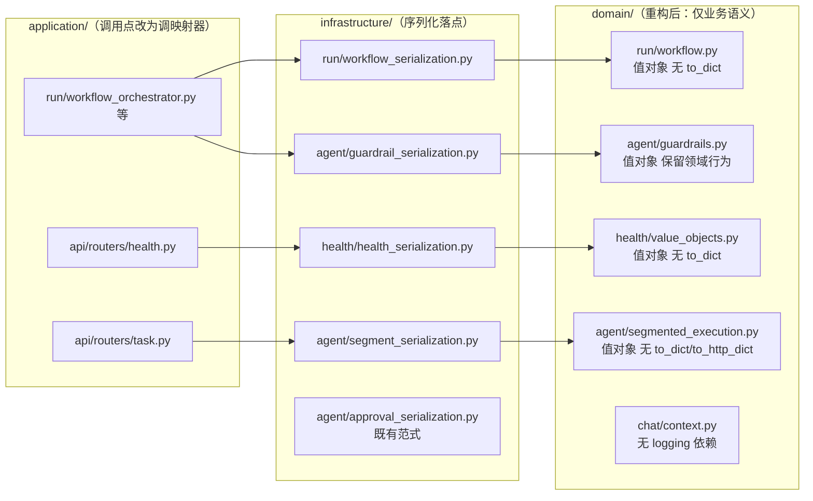

# 设计文档：DDD 战术建模代码级纠偏（第一批：低风险行为等价重构）

## 概述

本设计承接前置 spec `ddd-implementation-review` 登记的两项低风险差距，全程为**行为等价的纯重构**：需求 A 移除 `domain/chat/context.py` 对 `logging` 的直接依赖，使会话上下文子域回到零框架依赖；需求 B 把 `domain/` 内 15 处序列化方法（`to_dict` / `to_http_dict` / 私有 `_json_safe` / `_dataclass_to_json_safe_dict`）外移到基础设施层的序列化映射器，使领域对象只承载业务语义。设计严格遵循 `ddd-architecture.md`（依赖方向 `infrastructure → domain`、映射器落 `infrastructure/`）、`ddd-tactical-modeling.md` 第 9 节（技术关注点不入领域）、`srp-principle.md`、`change-discipline.md`（最小改动、可追溯）、`code-documentation.md`（中文 docstring）、`python-typing-lint.md`（全量类型标注、禁裸 `Any`），并以既有 `infrastructure/agent/approval_serialization.py` 为落点范式。

#### 设计决策

| 决策点 | 选定方案 | 理由 |
| --- | --- | --- |
| 需求 A `raise` 分支 `logger.warning` | 直接删除 | 该告警承载的 `source`/`raw_id_value`/`tool_name`/`tool_call_index`/`skipped_count`/`session_id` 全部已写入随后抛出的 `InvalidToolCallIdError.details`，异常向上传播时信息零丢失；`logger.warning` 属冗余复述（AC 4）。 |
| 需求 A `filter` 分支 `logger.warning` | 直接删除，不引入返回通道 | 该信号埋在 `ConversationContext.from_dict` 的列表推导深处，被 4 个基础设施/应用调用点（session/checkpoint 恢复）间接消费；为其增设结构化返回值需侵入 `ConversationContext.from_dict` 签名与全部调用点，违反 `Behavior_Equivalent_Refactor` 与最小改动。被过滤计数在恢复链路本非既有可观测点（无测试断言该日志），删除后无净可观测信息损失（AC 3/4，见正确性属性 Property 2 的论证）。 |
| 序列化映射器组织 | 按子域分放到 `infrastructure/<子域>/*_serialization.py`，与 `approval_serialization.py` 同层同风格；不建集中式单包 | 与既有范式一致；避免一个跨子域巨型 serialization 模块反向聚合多子域领域导入，保持子域内聚（`srp-principle.md`）。 |
| `_json_safe` / `_dataclass_to_json_safe_dict` 归属 | 随各自子域映射器迁移为该映射器模块的私有 helper；`workflow` 与 `guardrails` 两套 `_json_safe` 语义不同（见下），**不合并**为公共 helper | 两套 `_json_safe` 排序键（`sorted(value)` vs `sorted(value, key=str)`）、fallback（保留原值 vs `str(value)`）不同，合并会引入线格式漂移风险；保持逐字段等价优先于消重。 |
| guardrails 领域行为方法去留 | `to_dict`（3 处）随迁；`to_event_payload`、`to_summary`、`from_raw`、`from_model_usage`、`estimate_cost` **保留在领域层** | 判定见「组件设计 · 需求 B · guardrails」；后者承载业务语义或领域构造，非「领域数据→线格式」纯序列化。 |
| ADR-0008 | 新增 | 序列化职责归属从 `domain/` 移到 `infrastructure/` 属结构性/职责归属变更，`adr.md` 要求记录（需求 B AC 6）；不 supersede ADR-0001。 |
| `to_schema` 处置 | 登记为观察项，本期不动 | 语义为工具契约自描述而非数据序列化（需求 B AC 8、需求 C AC 3）。 |

## 架构

改动只在领域层与基础设施层之间移动技术关注点，依赖方向仍为 `application/infrastructure → domain`，无新增反向依赖。



### 目录/模块落点

| 新增模块 | 承载对象 |
| --- | --- |
| `src/infrastructure/run/workflow_serialization.py` | workflow.py 全部 8 个 `to_dict` + `_dataclass_to_json_safe_dict` / `_json_safe`（workflow 版） |
| `src/infrastructure/agent/guardrail_serialization.py` | guardrails.py 3 个 `to_dict` + `_json_safe`（guardrails 版） |
| `src/infrastructure/health/health_serialization.py` | health/value_objects.py 2 个 `to_dict` |
| `src/infrastructure/agent/segment_serialization.py` | segmented_execution.py `SegmentBudgetUsage.to_dict` + `SegmentRunMetadata.to_http_dict` |

> `infrastructure/health/` 当前若无 `__init__.py` 需补齐（含 `.gitkeep` 规则不适用，直接建含 docstring 的包）。

## 组件与接口

所有映射器均为**模块级独立函数**（与 `approval_serialization.py` 一致，非映射器类），输入领域对象、输出与旧 `to_dict()` 逐字段等价的 dict，全量类型标注、禁裸 `Any`（`dict[str, Any]` 允许，是既有返回类型）。

### 1. 需求 A：`domain/chat/context.py` 领域日志解耦

- **位置**：`src/domain/chat/context.py`
- **改动**：删除第 17 行 `import logging`、第 25 行 `logger = logging.getLogger(__name__)`；删除第 166–169 行（`raise` 分支的 `logger.warning`）与第 181–185 行（`filter` 分支的 `logger.warning`）。
- **控制流不变**：`if skipped:` 分支内，`raise` 策略仍构造并抛 `InvalidToolCallIdError(source=..., raw_id_value=..., tool_name=..., tool_call_index=..., extra={"skipped_count": ..., "session_id": ...})`（第 170–179 行不动）；`filter` 策略（`else`）删除 `logger.warning` 后为空体，`skipped` 项已在循环中 `continue` 跳过，`tool_calls` 仅含合法项，最终 `return AssistantMessage(..., tool_calls=tool_calls)` 不变。
- **告警信号承载结论**：
  - `raise` 分支：信号完整保留在 `InvalidToolCallIdError.details`，由应用层异常处理链记录（`Domain_Neutral_Warning_Signal` 经异常携带）。
  - `filter` 分支：判定为「移除后无可观测信息损失」（AC 4 允许直接删除）。论证：该分支不改变控制流/返回值/异常；被过滤计数无既有测试断言、无既有下游消费；surfacing 需侵入 `ConversationContext.from_dict` 及 4 处调用点，超出本期最小改动边界。
- **docstring**：`from_dict` 现有 docstring 无 logging 描述，无需更新；模块 docstring 不涉及 logging，保持不变。
- **复核结论（AC 8）**：`grep -rnE '^import logging|getLogger' src/domain/` 仅命中 `context.py` 两行，`domain/` 无其它同类瑕疵，无需登记待议项。

### 2. 需求 B · workflow：`src/infrastructure/run/workflow_serialization.py`

迁移 workflow.py 的 `_dataclass_to_json_safe_dict` / `_json_safe`（**逐字符照搬**，排序为 `sorted(value)`、frozenset→list、tuple→list、StrEnum→`.value`、datetime→`.isoformat()`、dict 键 `str(key)`）为该模块私有 helper，并为 8 个对象各提供一个映射函数：

```python
def workflow_capability_decision_to_dict(value: WorkflowCapabilityDecision) -> dict[str, Any]: ...
def workflow_execution_policy_to_dict(value: WorkflowExecutionPolicy) -> dict[str, Any]: ...
def workflow_phase_record_to_dict(value: WorkflowPhaseRecord) -> dict[str, Any]: ...
def collaboration_step_trace_link_to_dict(value: CollaborationStepTraceLink) -> dict[str, Any]: ...
def parent_child_run_link_to_dict(value: ParentChildRunLink) -> dict[str, Any]: ...
def child_run_orchestration_state_to_dict(value: ChildRunOrchestrationState) -> dict[str, Any]: ...
def collaboration_summary_to_dict(value: CollaborationSummary) -> dict[str, Any]: ...
def workflow_run_state_to_dict(value: WorkflowRunState) -> dict[str, Any]: ...
```

每个函数体等价于旧 `return _dataclass_to_json_safe_dict(self)`，即 `return _dataclass_to_json_safe_dict(value)`。逐字段映射由 `_dataclass_to_json_safe_dict`（遍历 `fields(value)`）+ `_json_safe` 递归保证，逐字段等价。

**`canonicalize_collaboration_summary` 处置**：该函数（workflow.py 第 338 行）是**领域归一逻辑**（兼容历史 `recent_steps` 字段），非纯序列化，**保留在领域层**；但它内部用到即将外移的 `CollaborationSummary.to_dict()`（第 352 行）与 `_json_safe`（第 356 行）。为保持依赖方向（domain 不得 import infrastructure），处理如下：
- 领域层保留一份**私有** `_json_safe`（供 `canonicalize_collaboration_summary` 使用），因为该函数是领域行为、其序列化归一属其自身实现细节；
- 第 352 行 `value.to_dict()` 改为调用领域私有 `_dataclass_to_json_safe_dict(value)`（领域侧保留私有实现，仅服务 `canonicalize_collaboration_summary`）。

> 说明：Property 5「私有序列化辅助不残留于 domain」的目标基线据此记录为——`_json_safe` / `_dataclass_to_json_safe_dict` 在 `domain/run/workflow.py` 保留**私有内联副本**专供 `canonicalize_collaboration_summary`，不再作为对外 `to_dict` 的实现。若 clarification 要求零残留，备选方案是把 `canonicalize_collaboration_summary` 一并外移到基础设施层（见 Clarification Loop 问题 1）。

### 3. 需求 B · guardrails：`src/infrastructure/agent/guardrail_serialization.py`

迁移 guardrails.py 的 `_json_safe`（**guardrails 版**，排序 `sorted(value, key=str)`、set/frozenset→list、非基本类型 fallback `str(value)`）为该模块私有 helper；提供 3 个映射函数，函数体逐字段照搬旧实现：

```python
def guardrail_model_pricing_to_dict(value: GuardrailModelPricing) -> dict[str, float | None]: ...
def guardrail_runtime_stats_to_dict(value: GuardrailRuntimeStats) -> dict[str, Any]: ...
def guardrail_summary_to_dict(value: GuardrailSummary) -> dict[str, Any]: ...
```

- `guardrail_model_pricing_to_dict`：照搬 `to_dict` 的 `total_per_1m is not None` 分支逻辑（互斥输出 split / total）。
- `guardrail_runtime_stats_to_dict`：照搬 14 个显式字段字典（非通用反射，逐字段列出）。
- `guardrail_summary_to_dict`：照搬 `mode.value` / `action.value` / `reason.value or None` / `_json_safe(metadata)` / `_coerce_runtime_stats_payload(runtime_stats)` 等；其中依赖的 `_coerce_runtime_stats_payload` 见下。

**guardrails 各方法去留判定（逐一给结论）**：

| 方法 | 性质 | 处置 |
| --- | --- | --- |
| `GuardrailModelPricing.to_dict` | 纯序列化 | 外移 |
| `GuardrailRuntimeStats.to_dict` | 纯序列化 | 外移 |
| `GuardrailSummary.to_dict` | 纯序列化 | 外移 |
| `_json_safe`（模块级） | 序列化 helper | 随迁（guardrails 版） |
| `GuardrailModelPricing.from_raw` | 领域构造（多格式 → 值对象），被 `_coerce_model_pricing_map`、`estimate_guardrail_model_cost` 领域内部调用 | **保留**领域层 |
| `GuardrailRuntimeStats.from_model_usage` | 领域构造（usage → 统计值对象，含成本估算业务规则） | **保留**领域层 |
| `GuardrailModelPricing.estimate_cost` | 领域计算（成本估算业务规则） | **保留**领域层 |
| `GuardrailDecision.to_summary` | 领域行为（decision → summary 值对象转换，非 dict 序列化） | **保留**领域层 |
| `GuardrailObservation.to_event_payload` | **混合**：产出事件 payload dict，但内部调 `self.stats.to_dict()` | 见下专项 |

**`to_event_payload` 与 `_coerce_runtime_stats_payload` / `merge_guardrail_summary` / `mark_guardrail_summary_stale` 的耦合处置**：
- `to_event_payload`（第 454 行）产出线格式 dict，属序列化，理应外移；但它内部调 `self.stats.to_dict()`。
- `_coerce_runtime_stats_payload`（第 638 行，领域内部 helper）、`merge_guardrail_summary`（第 519 行）、`mark_guardrail_summary_stale`（第 556 行）均在**领域层内部**调用 `GuardrailRuntimeStats.to_dict()` 与 `GuardrailSummary.to_dict()` 生成 `runtime_stats` 子字典。

为在不破坏依赖方向（domain 不得依赖 infrastructure 映射器）的前提下达成序列化外移，采用**领域私有序列化 + 基础设施薄封装**策略：
- 领域层保留 `GuardrailRuntimeStats` / `GuardrailSummary` 生成 dict 的**私有内联能力**：将 `to_dict` 逻辑降级为领域内部私有函数（如模块级 `_runtime_stats_payload(value)` / `_summary_payload(value)`），供 `merge_guardrail_summary` / `mark_guardrail_summary_stale` / `_coerce_runtime_stats_payload` / `to_event_payload` 使用——这些是领域行为对「摘要/事件的规范内部表示」的依赖，属领域自身细节；
- 对外供 `application`/`infrastructure` 调用的 `to_dict` 由 `guardrail_serialization.py` 承担（委托同一逐字段逻辑，保证等价）；
- `to_event_payload` 因被 `run_guardrail_recorder`（application 层）消费，判定为**外移**到 `guardrail_serialization.py`，其内部改调 `guardrail_runtime_stats_to_dict(stats)`。

> 该处置使「对外序列化职责」净移出领域公开面，同时承认领域内部编排（`merge_*`/`mark_*`）对内部规范表示的合理依赖。Property 5 目标基线据此记录（见下）。若 clarification 要求领域内部也零 dict 生成，备选是把 `merge_guardrail_summary`/`mark_guardrail_summary_stale` 一并上提基础设施（见 Clarification Loop 问题 2）。

### 4. 需求 B · health：`src/infrastructure/health/health_serialization.py`

```python
def health_check_result_to_dict(value: HealthCheckResult) -> dict[str, object]: ...
def readiness_result_to_dict(value: ReadinessResult) -> dict[str, object]: ...
```

- `health_check_result_to_dict`：照搬——`{"status": value.status.value}`，仅当 `value.reason is not None` 追加 `"reason"`。
- `readiness_result_to_dict`：`{"status": value.status.value, "checks": {c.name: health_check_result_to_dict(c) for c in value.checks}}`（内部复用同模块函数，替代原 `check.to_dict()`）。
- 返回类型收紧为 `dict[str, object]`（原为裸 `dict`，属类型改进，`pyright` 更严格但不改运行时）。

### 5. 需求 B · segmented：`src/infrastructure/agent/segment_serialization.py`

```python
def segment_budget_usage_to_dict(value: SegmentBudgetUsage) -> dict[str, int | float]: ...
def segment_run_metadata_to_http_dict(value: SegmentRunMetadata) -> dict[str, object]: ...
```

- 逐字段照搬旧实现；`segment_run_metadata_to_http_dict` 内部 `"budget_usage": segment_budget_usage_to_dict(value.budget_usage)` 替代原 `value.budget_usage.to_dict()`。

## 调用点迁移表

（`_json_safe` 出现在 `workflow_orchestrator.py` / `run_execution_coordinator.py` / `run_approval_resumer.py` / `workflow_collaboration_recorder.py` / `static_guardrail_policy.py` 的是各文件**自有的本地私有 helper**，与 domain 无关，**不在本期改动范围**。）

### workflow 对象

| 对象 | 旧调用（文件:行） | 新调用形态 |
| --- | --- | --- |
| `WorkflowCapabilityDecision` | `workflow_orchestrator.py:202,208,359,365` `decision.to_dict()` / `capability_decision.to_dict()` | `workflow_capability_decision_to_dict(decision)` |
| `ChildRunOrchestrationState` | `workflow_orchestrator.py:289,402` `ChildRunOrchestrationState(...).to_dict()` | `child_run_orchestration_state_to_dict(ChildRunOrchestrationState(...))` |
| `WorkflowRunState` | `run_application_service.py:329`、`run_checkpoint_recovery_service.py`（若命中 WorkflowRunState 构造）`WorkflowRunState(...).to_dict()` | `workflow_run_state_to_dict(WorkflowRunState(...))` |
| `CollaborationStepTraceLink` | `infrastructure/agent/workflow_collaboration_recorder.py:61` `step.to_dict()` | `collaboration_step_trace_link_to_dict(step)` |
| 其余（`WorkflowExecutionPolicy`/`WorkflowPhaseRecord`/`ParentChildRunLink`/`CollaborationSummary`） | 由 grep 全量核对后逐点替换（含 `react_agent_adapter.py`、`run_checkpoint_sink.py`、`run_guardrail_recorder.py` 等命中点） | 对应 `*_to_dict(obj)` |

> 落地时须以 `grep -rnE '\.to_dict\(\)' src/application src/infrastructure` 对每个对象类型逐点核对，确保无遗漏；替换后 import 从 domain 改为 infrastructure 映射器模块。

### guardrails 对象

| 对象/方法 | 旧调用 | 新调用形态 |
| --- | --- | --- |
| `GuardrailObservation.to_event_payload` | `run_guardrail_recorder.py:56` `observation.to_event_payload()` | `guardrail_observation_to_event_payload(observation)` |
| `GuardrailSummary.to_dict` | `run_guardrail_recorder.py:71` `summary_after.to_dict()`、`run_checkpoint_recovery_service.py:194` `mark_guardrail_summary_stale(...).to_dict()` | `guardrail_summary_to_dict(summary_after)` / `guardrail_summary_to_dict(mark_guardrail_summary_stale(...))` |
| `GuardrailRuntimeStats.to_dict`（对外） | `react_agent_adapter.py:1341,1420,2044` `runtime_stats.to_dict()` 等（作为 `metadata=` 传入 trace） | `guardrail_runtime_stats_to_dict(runtime_stats)` |

### health 对象

| 对象 | 旧调用 | 新调用形态 |
| --- | --- | --- |
| `ReadinessResult` | `api/routers/health.py:52` `result.to_dict()` | `readiness_result_to_dict(result)` |

### segmented 对象

| 对象 | 旧调用 | 新调用形态 |
| --- | --- | --- |
| `SegmentBudgetUsage` | `api/routers/task.py:118` `metadata.budget_usage.to_dict()` | `segment_budget_usage_to_dict(metadata.budget_usage)` |
| `SegmentRunMetadata` | `run_execution_coordinator.py:542-543` `hasattr(metadata, "to_http_dict")` + `metadata.to_http_dict()` | 改为 `isinstance(metadata, SegmentRunMetadata)` 判定后调 `segment_run_metadata_to_http_dict(metadata)`；`hasattr` 动态分派语义等价替换为显式类型判断 |

> `run_execution_coordinator._segment_metadata` 的 `hasattr` 分支是本重构唯一需要改判定形态（而非纯改调用）的点：外移后领域对象不再有 `to_http_dict` 属性，`hasattr` 恒为 False，故须改为 `isinstance` 检查以保持等价行为。

## 数据模型

本重构不改任何数据模型、DDL、持久化 schema 或线格式。所有映射器输出与旧 `to_dict()`/`to_http_dict()`/`to_event_payload()` 在键集合、键顺序、取值、嵌套形态上字面等价，含以下既有细节：

- `frozenset` → 排序后的 list（workflow 版 `sorted(value)`；guardrails 版 `sorted(value, key=str)`）。
- `StrEnum`/`Enum` → `.value`。
- `datetime` → `.isoformat()`（guardrails 版先经 `_resolve_datetime` 补 UTC 时区）。
- `dict` 键 → `str(key)`（含 `event_timestamps` 等 int 键 stringify）。
- `GuardrailModelPricing` 的 split/total 互斥输出规则。

## 事务与并发边界

本 spec 为纯重构，**不新增、不改变任何写操作、事务边界或并发语义**。序列化外移只改变「dict 由谁生成」，不触及持久化调用、Redis/文件写入时序或 Run 事件 append 顺序。故本节无适用内容（无 DDL、无新事务）。

## 正确性属性

### Property 1（领域纯净度）
`domain/chat/context.py` 重构后不 import 任何 `logging`/framework 技术模块。
验证需求：需求 A AC 1、AC 6；正确性属性 Property 1。
验证策略：`cd epsilon-boot && grep -nE 'import logging|getLogger|logging\.' src/domain/chat/context.py` 期望零输出。

### Property 2（告警信号不丢失）
`raise` 分支信号经 `InvalidToolCallIdError.details` 完整携带；`filter` 分支删除后无净可观测信息损失（无既有断言/下游消费）。
验证需求：需求 A AC 2/3/4；正确性属性 Property 2。
验证策略：`test/domain/chat/test_base_message_from_dict_raise_strategy_unit.py` 断言异常构造参数逐字段不变；`test_base_message_from_dict_id_validation_unit.py` 与 filter 相关用例断言过滤后 `tool_calls` 与返回值不变（不断言日志）。

### Property 3（序列化逐字段等价）
每个被外移对象 `mapper(obj)` 输出与旧 `obj.to_dict()`/`to_http_dict()`/`to_event_payload()` 字面相等。
验证需求：需求 B AC 3/7；正确性属性 Property 3。
验证策略：既有覆盖测试（`test/domain/run/*`、`test/domain/agent/test_guardrail_*`、`test/domain/health/test_value_objects_property.py`、`test/domain/agent/test_segmented_execution_value_objects_unit.py`）改 import 后仍绿；对无既有等价快照的对象，新增等价性断言 `mapper(obj) == <旧输出黄金值>`。

### Property 4（线格式不变）
会话/trace 持久化与 HTTP/事件消费方所见 JSON/字典结构本 spec 前后字面不变。
验证需求：需求 B AC 4；正确性属性 Property 4。
验证策略：`test/domain/chat/test_context_serialization_roundtrip_property.py` 及 session/trace/router 相关既有集成/单元测试全绿。

### Property 5（领域对外序列化零残留 / 目标基线数字）
`domain/` 下**对外** `to_dict`/`to_http_dict` 命中数降为具体基线；私有序列化辅助按 A 方案允许保留固定份数（下列均为供 tasker/generator 逐字对照的验收数字）。
验证需求：需求 B AC 1/2；正确性属性 Property 5。
**目标基线数字**：
- `grep -rnE 'def to_dict|def to_http_dict' src/domain/` 期望命中数 = **4**，且这 4 处**全部**必须落在 `domain/chat/context.py`（`BaseMessage.to_dict` 第 94 行、`ToolMessage.to_dict` 第 254 行、`AssistantMessage.to_dict` 第 297 行、`ConversationContext.to_dict` 第 477 行——均为消息/会话序列化，是需求 A 的等价性回归对象，**明确不在需求 B 外移范围**，其定义保留）。
- `domain/run/workflow.py`（原 8 处）、`domain/agent/guardrails.py`（原 3 处 `to_dict`）、`domain/health/value_objects.py`（原 2 处）、`domain/agent/segmented_execution.py`（原 `to_dict` + `to_http_dict` 共 2 处）的对外序列化方法**全部清零**——即上述 grep 命中中不得再出现 `run/workflow.py`、`agent/guardrails.py`、`health/value_objects.py`、`agent/segmented_execution.py` 任何一行。
- `to_schema` 属观察项，且不匹配上述正则，本就不计入。
- 私有序列化辅助保留份数（A 方案，明确记录、非违约）：
  - `domain/run/workflow.py`：保留 `_json_safe` **1 份** + `_dataclass_to_json_safe_dict` **1 份**，专供领域归一逻辑 `canonicalize_collaboration_summary` 使用。
  - `domain/agent/guardrails.py`：保留 `_json_safe` **1 份** + 领域内部 payload helper（如 `_runtime_stats_payload` / `_summary_payload`）供 `merge_guardrail_summary` / `mark_guardrail_summary_stale` / `_coerce_runtime_stats_payload` 内部规范表示使用。
  - `domain/health/value_objects.py`、`domain/agent/segmented_execution.py`：私有序列化辅助 = **0**（本无私有 helper，逐字段内联外移）。
验证策略：grep 命中数与上述数字一致即通过。彻底零残留（选项 B）已登记需求 C 后续事项，非本期验收目标。

### Property 6（测试全绿且断言不改）
`PYTHONPATH=src uv run --frozen pytest` 前后全绿（约 2824 passed / 0 failed）；import 调整不改断言语义。
验证需求：需求 A AC 7、需求 B AC 5；正确性属性 Property 6。
验证策略：全量 pytest。

### Property 7（依赖与规范合规）
仅用 `uv`、不新增第三方依赖；`ruff`/`pyright` 零新增错误、禁裸 `Any`；新增/改动公开单元有中文 docstring。
验证需求：需求 A AC 9、需求 B AC 9；正确性属性 Property 7。
验证策略：`uv run ruff check`、`uv run pyright`（或项目既有 lint 命令）零新增错误。

## 错误处理

- 序列化边界的异常语义保持等价：`_dataclass_to_json_safe_dict` 对非 dataclass 抛 `TypeError`（照搬），映射函数因入参有类型标注不改变该行为。
- 需求 A 复用既有 `InvalidToolCallIdError`（`ModelAccessError` 子类，code 50007），**不引入任何新错误类型或新错误返回风格**；`raise` 分支异常构造逐字段不变。
- 映射器不吞异常、不新增 try/except；对 `None`/缺失字段的处理沿用旧 `to_dict` 内既有逻辑（如 `reason.value if reason is not None else None`）。
- 不新增日志：告警删除后领域层无 logging；应用层是否记录 `InvalidToolCallIdError` 由既有异常处理链决定，本 spec 不改。

## 测试策略

采用「既有测试作回归 + 必要处补等价性断言」，均用项目既有 `pytest`（`PYTHONPATH=src uv run --frozen pytest`）：

1. **回归（主力）**：所有覆盖被改对象的既有测试，仅按新调用位置调 import、不改断言语义。追溯：需求 A AC 7、需求 B AC 5（Property 6）。
   - 需求 A：`test/domain/chat/test_context_serialization_roundtrip_property.py`、`test_base_message_from_dict_raise_strategy_unit.py`、`test_base_message_from_dict_id_validation_unit.py`、`test_message_hierarchy_unit.py`。
   - 需求 B：`test/domain/run/*`、`test/domain/agent/test_guardrail_*`、`test/domain/health/test_value_objects_property.py`、`test/domain/agent/test_segmented_execution_value_objects_unit.py`。
2. **等价性断言原地迁移（选 A）+ 自反断言硬核查**：对每个映射函数，把既有断言其旧 `to_dict`/`to_http_dict`/`to_event_payload` 输出的测试**原地**改为断言 `mapper(obj)`（等价迁移，不膨胀测试数）。追溯：Property 3。
   - **硬约束（迁移前逐处核查）**：迁移每一处断言前，必须先判定它是否为「字面 expected dict / golden snapshot」断言（形如 `obj.to_dict() == {"a": 1, ...}` 的字面右值）。
     - 若是字面/golden 断言：直接把左值 `obj.to_dict()` 换为 `mapper(obj)`，右值字面不动——等价性由字面右值真正锁住。
     - 若发现该处实为**自反型断言**（形如 `obj.to_dict() == 某个也由 `to_dict` 派生的值`，改前改后恒真、锁不住等价性）：**不得**直接迁移；必须为该对象补写一个新的**字面快照**断言 `mapper(obj) == {<逐字段展开的期望 dict>}`，真正锁住 mapper 输出，否则该对象的等价性无回归保护。
   - 覆盖边界须显式出现在字面快照中：`frozenset` 排序、enum `.value`、`datetime.isoformat()`、int 键 stringify、`GuardrailModelPricing` split/total 互斥、`reason=None`、`metadata` 空/非空。
   - 若某被外移对象既无既有 `to_dict` 断言、也无 golden 覆盖：在 `test/infrastructure/<子域>/` 下新增字面快照等价性测试补齐。
3. **集成回归**：health / task / runs router 与 session/trace 持久化的既有测试全绿，验证线格式不变。追溯：Property 4。
4. **grep 验证命令**（Property 1/5）：
   - `grep -nE 'import logging|getLogger|logging\.' src/domain/chat/context.py`（期望空）。
   - `grep -rnE '^import logging|getLogger' src/domain/`（登记同类瑕疵；重构后期望空）。
   - `grep -rnE 'def to_dict|def to_http_dict' src/domain/`（期望命中数 = **4**，且全部落在 `domain/chat/context.py`；`run/workflow.py`、`agent/guardrails.py`、`health/value_objects.py`、`agent/segmented_execution.py` 均不得再命中。详见 Property 5 目标基线数字）。
5. **全量门禁**：`PYTHONPATH=src uv run --frozen pytest` + `ruff`/`pyright`。追溯：Property 6/7。

## ADR 决策（ADR-0008）

**需要新增 ADR-0008**（需求 B AC 6）。序列化职责从 `domain/` 迁往 `infrastructure/` 属职责归属的结构性变更，`adr.md` 明确此类须记录。

- 标题：`将领域对象序列化职责外移至基础设施层序列化映射器`
- 状态：`Accepted`；**不 supersede ADR-0001**（领域事件决策不回退，本 ADR 与之无关）。
- 四段式要点：
  - **背景**：`domain/run/workflow.py`、`domain/agent/guardrails.py`、`domain/health/value_objects.py`、`domain/agent/segmented_execution.py` 等值对象自带 `to_dict`/`to_http_dict`/`to_event_payload` + 私有序列化 helper，序列化属基础设施关注点，违反 SRP 与 `ddd-tactical-modeling.md` 第 9 节。
  - **决策**：按子域在 `infrastructure/<子域>/*_serialization.py` 提供独立映射函数承担对外序列化，与既有 `approval_serialization.py` 范式一致；领域对象对外不再暴露序列化方法；领域行为方法（`from_raw`/`from_model_usage`/`estimate_cost`/`to_summary`/归一逻辑）保留；领域内部编排所需的规范表示以领域私有 helper 保留。
  - **后果**：领域层对外零序列化知识、可脱离序列化细节单测；调用点从领域方法改调基础设施映射器；线格式字面不变（行为等价）；新增映射器模块与其测试。
  - **备选方案与未采纳原因**：(a) 集中式单一 serialization 包——被否，会反向聚合多子域领域导入、破坏子域内聚；(b) 引入映射器基类/注册表抽象——被否，过度设计，`approval_serialization.py` 已证明模块级函数足够；(c) 保留领域 `to_dict`——被否，即本差距本身。
- 在 `docs/adr/README.md` 索引表追加 0008 行。

## 需求 C：后续差距登记（本期不实施）

| 项 | 风险档 | 建议流程门 | 处置 |
| --- | --- | --- | --- |
| 前置需求 1 `Domain_Logic_In_Infrastructure`（3310 行 Agent Loop 上提领域层） | 极高 | 独立后续 spec，**先写 ADR 再落地** | 登记，本期不做 |
| 前置需求 2 `Anemic_Domain_Model`（单子域充血化试点） | 中 | 独立后续 spec；引入实体/聚合等一等抽象须先写 ADR（`ddd-tactical-modeling.md` §3/§5、`change-discipline.md` §2） | 登记，本期不做 |
| 前置需求 4 `Application_Transaction_Script`（应用层大文件拆分） | 低 | 独立后续 spec，可不必 ADR（非架构级），走 change-discipline 最小改动 | 登记，本期不做 |
| `Serialization_Observation_Item` `domain/agent/tools.py::to_schema` | 观察项 | 无需处理 | 结论：其语义为「生成工具 JSON schema 供 LLM function calling」，属领域对工具契约的**自描述**，非领域数据的持久化/线格式序列化，与 `Domain_Serialization_Concern` 性质不同；本期不外移，后续 spec 亦无需处理，仅登记为观察结论。 |
| 序列化彻底零残留（选项 B）· workflow | 低 | 后续 spec，走 change-discipline 最小改动 | 本期按低风险定位选 **A 保留私有残留**：`canonicalize_collaboration_summary` 及其私有 `_json_safe`/`_dataclass_to_json_safe_dict` 保留在 `domain/run/workflow.py`。彻底零残留（把 `canonicalize_collaboration_summary` 一并外移至 `infrastructure/run/workflow_serialization.py` 并改其全部调用点，如 `workflow_collaboration_recorder.py:274`）留待后续 spec。 |
| 序列化彻底零残留（选项 B）· guardrails | 低 | 后续 spec，走 change-discipline 最小改动 | 本期按低风险定位选 **A 保留私有 payload helper**：`domain/agent/guardrails.py` 保留 `_json_safe` 与内部 payload helper 供 `merge_guardrail_summary`/`mark_guardrail_summary_stale`/`_coerce_runtime_stats_payload` 使用。彻底零残留（把这些汇总编排上提基础设施层、领域内不再生成 dict）留待后续 spec。 |
