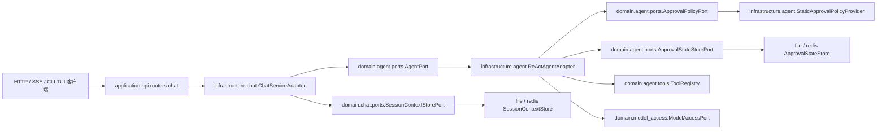
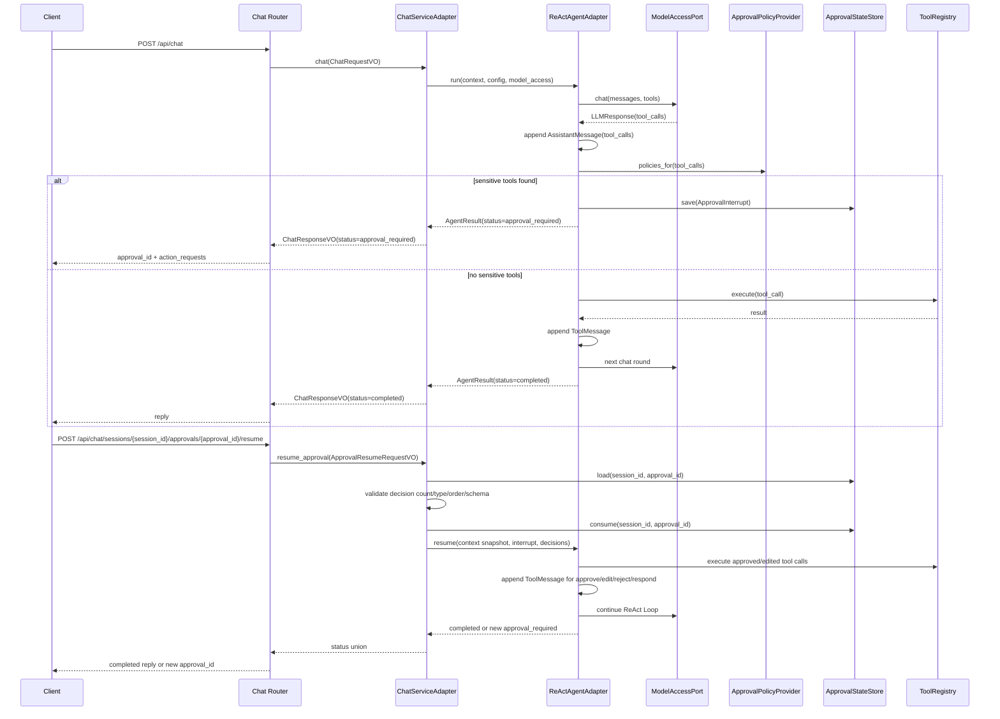

# 设计文档：Human-in-the-loop 工具审批

## 概述

本设计在现有自研 ReAct Agent Runtime 上接入 human-in-the-loop 工具审批，不迁移到 LangGraph / Deep Agents，仅借鉴 `interrupt_on`、决策类型、checkpointer 与同一会话恢复语义。实现遵循 `docs/steering/ddd-architecture.md` 的 DDD/六边形边界：领域层定义审批值对象与 Port，基础设施层实现配置解析、file/redis 状态存储和 ReAct Loop 中断，应用层只负责 HTTP/SSE 协议转换；新增配置优先落在 `epsilon-boot/config.properties`，符合 `docs/steering/config-source.md`。

### 设计决策

| 决策 | 选择 | 理由 |
| --- | --- | --- |
| Runtime 方案 | 保留 `ReActAgentAdapter`，不引入 LangGraph 图运行时 | 满足 v1 范围，避免重写现有 `ChatServiceAdapter`、工具注册表、会话存储和 TUI 事件链路。 |
| 分层边界 | `domain/agent` 定义审批模型与 Port，`infrastructure/agent` 实现策略与状态存储，`application/api` 暴露 HTTP | 与 DDD steering 一致，领域层不依赖 FastAPI、Pydantic Settings、Redis 或文件系统。 |
| 默认开关 | `HITL_ENABLED=false` | 关闭时保持现有 HTTP API、CLI/TUI 与测试行为，不产生审批状态或额外事件。 |
| 策略格式 | `HITL_INTERRUPT_ON` 使用 JSON object，值支持 `true`、`false`、决策数组或对象 | 覆盖 LangChain `interrupt_on` 的核心语义，同时能在 `config.properties` 中作为字符串稳定解析。 |
| 审批状态 | 新增 `ApprovalStateStorePort`，file/redis 分别实现，不复用 `SessionContextStorePort` 文件结构 | 审批状态有 TTL、消费语义和待审批动作，不能污染普通会话上下文格式。 |
| 响应模型 | `/api/chat` 与 resume API 使用 `status="completed" / "approval_required"` 状态联合 | 同步、SSE 与恢复协议用同一状态语义，客户端无需理解内部 Agent 状态。 |
| 恢复入口 | `ChatServicePort.resume_approval(...)` 编排加载、校验、消费状态，再委托 `AgentPort.resume(...)` | API router 与未来 CLI/TUI 可复用应用编排；Agent 只负责 ReAct Loop 语义。 |
| `respond` 决策 | 领域模型支持，默认策略不对现有工具开放 | 保留 Deep Agents 语义和未来 ask-user 工具扩展点，同时避免把人工回复误用于写文件、命令执行、网络请求。 |
| 委派边界 | v1 只审批主 Agent 对 `delegate_to_agent` 工具的调用 | 阻止主 Agent 通过委派绕过审批；子 Agent 内部审批传播留给 v2。 |
| 幂等与并发 | resume 先校验，再原子消费审批状态；消费失败返回 409 或 404，不执行工具 | 防止重复恢复导致敏感工具重复执行，同时允许非法请求修正后再次提交。 |

## 架构





## 组件与接口

1. `src/domain/agent/value_objects.py`

   责任：新增审批领域值对象，保持 frozen dataclass，不依赖基础设施或 Web 框架。`AgentResult` 追加默认字段，确保现有构造调用无需修改。

   ```python
   from __future__ import annotations

   from dataclasses import dataclass, field
   from typing import Any, Literal

   ApprovalDecisionType = Literal["approve", "edit", "reject", "respond"]
   AgentRunStatus = Literal["completed", "approval_required"]
   AgentStreamEventKind = Literal[
       "status",
       "assistant_delta",
       "assistant_done",
       "tool_start",
       "tool_result",
       "tool_error",
       "approval_required",
       "error",
   ]

   @dataclass(frozen=True)
   class ApprovalPolicy:
       tool_name: str
       interrupt: bool
       allowed_decisions: frozenset[ApprovalDecisionType]
       risk_label: str = ""

   @dataclass(frozen=True)
   class PendingActionRequest:
       tool_call_id: str
       tool_name: str
       arguments: str
       allowed_decisions: frozenset[ApprovalDecisionType]
       reason: str = ""

   @dataclass(frozen=True)
   class EditedAction:
       name: str
       arguments: str

   @dataclass(frozen=True)
   class ApprovalDecision:
       type: ApprovalDecisionType
       tool_call_id: str
       edited_action: EditedAction | None = None
       message: str = ""

   @dataclass(frozen=True)
   class ApprovalInterrupt:
       session_id: str
       approval_id: str
       actions: tuple[PendingActionRequest, ...]
       context_snapshot: dict[str, Any]
       round_num: int
       model: str
       usage_so_far: dict[str, int] = field(default_factory=dict)
       created_at_epoch: float = 0.0
       expires_at_epoch: float = 0.0
       metadata: dict[str, Any] = field(default_factory=dict)

       def is_expired(self, now_epoch: float) -> bool:
           return self.expires_at_epoch > 0 and now_epoch >= self.expires_at_epoch

   @dataclass(frozen=True)
   class ApprovalRequiredPayload:
       session_id: str
       approval_id: str
       actions: tuple[PendingActionRequest, ...]
       prompt_id: str
       metadata: dict[str, Any] = field(default_factory=dict)

   @dataclass(frozen=True)
   class ApprovalResume:
       session_id: str
       approval_id: str
       decisions: tuple[ApprovalDecision, ...]
       model: str | None = None

   @dataclass(frozen=True)
   class AgentResult:
       content: str
       model: str
       usage: dict[str, int] = field(default_factory=dict)
       latency_ms: float = 0.0
       status: AgentRunStatus = "completed"
       approval: ApprovalRequiredPayload | None = None
   ```

   关键不变量：

   - `AgentResult.status == "completed"` 时 `approval is None`。
   - `AgentResult.status == "approval_required"` 时 `approval is not None`，`content` 为空字符串，不追加最终 assistant 文本。
   - `PendingActionRequest` 顺序必须等于模型返回的 `tool_calls` 顺序。

2. `src/domain/agent/ports.py`

   责任：扩展 Agent 与审批状态/策略端口。`AgentPort.resume(...)` 只接收已经通过应用层校验和消费的 `ApprovalInterrupt`，不直接访问存储。

   ```python
   from collections.abc import AsyncIterator
   from typing import Protocol

   class AgentPort(Protocol):
       async def run(
           self,
           context: ConversationContext,
           config: AgentConfig,
           model_access: ModelAccessPort,
       ) -> AgentResult: ...

       def run_streaming(
           self,
           context: ConversationContext,
           config: AgentConfig,
           model_access: ModelAccessPort,
       ) -> AsyncIterator[StreamingChunk]: ...

       def run_events(
           self,
           context: ConversationContext,
           config: AgentConfig,
           model_access: ModelAccessPort,
       ) -> AsyncIterator[AgentStreamEvent]: ...

       async def resume(
           self,
           context: ConversationContext,
           config: AgentConfig,
           model_access: ModelAccessPort,
           interrupt: ApprovalInterrupt,
           decisions: tuple[ApprovalDecision, ...],
       ) -> AgentResult: ...

   class ApprovalPolicyPort(Protocol):
       def policy_for(self, tool_name: str) -> ApprovalPolicy:
           """返回工具审批策略；未配置工具返回 interrupt=False 的低风险策略。"""
           ...

   class ApprovalStateStorePort(Protocol):
       async def save(self, interrupt: ApprovalInterrupt) -> None: ...

       async def load(
           self,
           session_id: str,
           approval_id: str,
       ) -> ApprovalInterrupt | None: ...

       async def consume(
           self,
           session_id: str,
           approval_id: str,
       ) -> ApprovalInterrupt | None: ...

       async def delete(self, session_id: str, approval_id: str) -> None: ...

       async def delete_session(self, session_id: str) -> None: ...
   ```

3. `src/domain/chat/value_objects.py`

   责任：让聊天返回值和恢复请求表达状态联合。`ChatResponseVO` 保持原字段，新增字段均有默认值；关闭 HITL 或普通完成路径下旧代码读取 `reply/model/usage/prompt_id` 不受影响。

   ```python
   from dataclasses import dataclass, field
   from typing import Literal

   from domain.agent.value_objects import ApprovalDecision, PendingActionRequest

   ChatResponseStatus = Literal["completed", "approval_required"]

   @dataclass(frozen=True, kw_only=True)
   class ChatResponseVO:
       session_id: str
       reply: str
       model: str
       usage: dict[str, int]
       prompt_id: str
       status: ChatResponseStatus = "completed"
       approval_id: str | None = None
       action_requests: tuple[PendingActionRequest, ...] = field(default_factory=tuple)

   @dataclass(frozen=True)
   class ApprovalResumeRequestVO:
       session_id: str
       approval_id: str
       decisions: tuple[ApprovalDecision, ...]
       model: str | None = None
   ```

4. `src/domain/chat/ports.py`

   责任：暴露恢复审批的应用编排能力。

   ```python
   class ChatServicePort(Protocol):
       async def chat(self, request: ChatRequestVO) -> ChatResponseVO: ...

       def stream_chat(self, request: ChatRequestVO) -> AsyncIterator[StreamingChunk]: ...

       def stream_chat_events(
           self,
           request: ChatRequestVO,
       ) -> AsyncIterator[AgentStreamEvent]: ...

       async def resume_approval(
           self,
           request: ApprovalResumeRequestVO,
       ) -> ChatResponseVO: ...

       async def clear_session(self, session_id: str) -> None: ...

       @property
       def prompt_id(self) -> str: ...
   ```

5. `src/domain/model_access/value_objects.py`

   责任：为旧文本流调用方提供审批提示的同时让 `ChatServiceAdapter.stream_chat(...)` 能识别“不要保存为最终 assistant 回复”的中断分片。

   ```python
   @dataclass(frozen=True)
   class StreamingChunk:
       delta_content: str = ""
       finished: bool = False
       usage: dict[str, int] | None = None
       metadata: dict[str, Any] = field(default_factory=dict)
   ```

6. `src/infrastructure/agent/hitl_config.py`

   责任：读取 `HITL_` 配置，解析 `interrupt_on` 字符串。配置对象使用项目现有 `PropertiesBaseSettings` / `create_config`。

   ```python
   from pydantic import model_validator
   from pydantic_settings import SettingsConfigDict

   from common.configuration import PropertiesBaseSettings, create_config

   DEFAULT_HITL_STATE_TTL_SECONDS = 3600

   class HitlConfig(PropertiesBaseSettings):
       model_config = SettingsConfigDict(env_prefix="HITL_")

       enabled: bool = False
       interrupt_on: str = ""
       state_ttl_seconds: int = DEFAULT_HITL_STATE_TTL_SECONDS

       @model_validator(mode="before")
       @classmethod
       def _clamp_ttl(cls, values: dict[str, object]) -> dict[str, object]:
           ...

   hitl_config = create_config(HitlConfig)
   ```

   `HITL_INTERRUPT_ON` JSON 语义：

   ```json
   {
     "write_file": true,
     "edit_file": ["approve", "reject"],
     "http_request": ["approve", "edit", "reject"],
     "web_fetch": false,
     "ask_user": {
       "allowed_decisions": ["respond", "reject"],
       "risk_label": "需要人工补充信息"
     }
   }
   ```

   - `true` 表示中断并允许 `approve/reject`。
   - `false` 表示不对该工具中断，可覆盖默认敏感工具。
   - 决策数组表示显式允许决策。
   - 对象形式允许附加 `risk_label`。

7. `src/infrastructure/agent/approval_policy_provider.py`

   责任：把默认风险分级与用户配置合并为 `ApprovalPolicyPort`。

   ```python
   class StaticApprovalPolicyProvider(ApprovalPolicyPort):
       def __init__(self, enabled: bool, interrupt_on: str) -> None: ...

       def policy_for(self, tool_name: str) -> ApprovalPolicy: ...
   ```

   默认策略：

   | 工具 | 默认策略 |
   | --- | --- |
   | `write_file`、`edit_file`、`shell_exec`、`python_exec`、`delegate_to_agent` | `approve/reject` |
   | `http_request` | `approve/edit/reject` |
   | `read_file`、`list_dir`、`web_fetch`、`web_search` | 不审批 |

8. `src/infrastructure/agent/approval_state_store.py`

   责任：实现 `ApprovalStateStorePort`。本地文件后端复用 `LOCAL_PERSISTENCE_ROOT`、`LockFactory`、`CrossPlatformPathPolicy`、`TempFileAtomicWriter`；Redis 后端复用现有 Redis client。

   ```python
   class LocalFileApprovalStateStore(ApprovalStateStorePort):
       def __init__(
           self,
           root: Path,
           lock_factory: Callable[[Path], CrossPlatformFileLock],
           path_policy: CrossPlatformPathPolicy,
           atomic_writer: TempFileAtomicWriter,
           ttl_seconds: int,
       ) -> None: ...

       async def save(self, interrupt: ApprovalInterrupt) -> None: ...
       async def load(self, session_id: str, approval_id: str) -> ApprovalInterrupt | None: ...
       async def consume(self, session_id: str, approval_id: str) -> ApprovalInterrupt | None: ...
       async def delete(self, session_id: str, approval_id: str) -> None: ...
       async def delete_session(self, session_id: str) -> None: ...

   class RedisApprovalStateStore(ApprovalStateStorePort):
       def __init__(
           self,
           redis_client: aioredis.Redis,
           key_prefix: str = "agent:approval:",
           ttl_seconds: int = 3600,
       ) -> None: ...
   ```

   `consume(...)`：

   - file 后端在独占锁下读取、校验过期并删除 JSON 文件。
   - redis 后端优先使用 `GETDEL`；如客户端不支持，则使用 `WATCH/MULTI/EXEC` 保护 get-delete。
   - 返回 `None` 表示不存在、已消费或已过期；调用方映射为 404/409。

9. `src/infrastructure/agent/react_agent_adapter.py`

   责任：在模型返回 `tool_calls` 后，先执行 `allowed_tool_names` 授权校验，再筛选需要审批的工具；审批命中时保存中断状态并返回/发送审批状态，不执行待审批工具。

   ```python
   class ReActAgentAdapter(AgentPort):
       def __init__(
           self,
           tool_registry: ToolRegistry,
           compaction: ContextCompactionPort,
           approval_policy: ApprovalPolicyPort,
           approval_store: ApprovalStateStorePort,
       ) -> None: ...

       async def run(...) -> AgentResult: ...
       async def run_streaming(...) -> AsyncIterator[StreamingChunk]: ...
       async def run_events(...) -> AsyncIterator[AgentStreamEvent]: ...
       async def resume(
           self,
           context: ConversationContext,
           config: AgentConfig,
           model_access: ModelAccessPort,
           interrupt: ApprovalInterrupt,
           decisions: tuple[ApprovalDecision, ...],
       ) -> AgentResult: ...
   ```

   新增私有方法：

   ```python
   def _collect_pending_actions(
       self,
       tool_calls: list[ToolCallRequest],
   ) -> tuple[PendingActionRequest, ...]: ...

   async def _save_interrupt(
       self,
       *,
       session_id: str,
       context: ConversationContext,
       config: AgentConfig,
       response: LLMResponse,
       round_num: int,
       usage_so_far: dict[str, int],
   ) -> ApprovalRequiredPayload | None: ...

   async def _apply_approval_decisions(
       self,
       context: ConversationContext,
       interrupt: ApprovalInterrupt,
       decisions: tuple[ApprovalDecision, ...],
   ) -> None: ...

   async def _continue_after_tools(
       self,
       context: ConversationContext,
       config: AgentConfig,
       model_access: ModelAccessPort,
       start_round: int,
       usage_so_far: dict[str, int],
   ) -> AgentResult: ...
   ```

   中断点语义：

   - `context` 已追加当前模型返回的 `AssistantMessage(content=response.content, tool_calls=response.tool_calls)`。
   - `context` 尚未追加任何待审批工具的 `ToolMessage`。
   - `ApprovalInterrupt.context_snapshot = context.to_dict()`。
   - 只要同一轮任意敏感工具需要审批，本轮所有敏感工具进入同一个 `ApprovalInterrupt`；非敏感工具是否先执行会改变顺序，因此 v1 选择“命中审批时暂停整轮，待恢复后按原始顺序处理所有 tool_calls”。非敏感工具在同轮恢复时直接执行，敏感工具按决策处理。

10. `src/infrastructure/chat/chat_service_adapter.py`

    责任：把 `AgentResult` 状态联合转换为 `ChatResponseVO`，并在审批中断时不把等待提示保存为最终 assistant 回复。

    ```python
    class ChatServiceAdapter(ChatServicePort):
        def __init__(
            self,
            session_store: SessionContextStorePort,
            model_registry: ModelRegistryPort,
            prompt_registry: PromptRegistryPort,
            compaction: ContextCompactionPort,
            agent: AgentPort,
            approval_store: ApprovalStateStorePort,
            tool_calling_enabled: bool,
            max_tool_rounds: int,
            tool_schemas: list[dict[str, Any]],
        ) -> None: ...

        async def chat(self, request: ChatRequestVO) -> ChatResponseVO: ...
        async def resume_approval(self, request: ApprovalResumeRequestVO) -> ChatResponseVO: ...
        async def clear_session(self, session_id: str) -> None: ...
    ```

    `chat(...)` 行为：

    - 完成路径：追加最终 assistant 回复，保存 `SessionContextStorePort`。
    - 审批路径：不追加最终 assistant 回复，不保存普通 session 上下文；恢复时以 `ApprovalInterrupt.context_snapshot` 为准。

    `resume_approval(...)` 行为：

    1. `approval_store.load(...)`，找不到则抛审批状态异常。
    2. 校验未过期、决策数量、顺序、类型、`edit` 工具名与参数 schema、`respond` 文本。
    3. `approval_store.consume(...)`，失败则抛重复/过期异常。
    4. `ConversationContext.from_dict(interrupt.context_snapshot)`。
    5. 调用 `agent.resume(...)`。
    6. 完成路径保存 session；再次审批路径返回新的 `approval_id`。

11. `src/application/api/routers/chat.py`

    责任：新增状态联合响应和恢复端点。Pydantic 模型仅位于 application 层。

    ```python
    from typing import Literal

    class ApprovalActionBody(BaseModel):
        tool_call_id: str
        tool_name: str
        arguments: str
        allowed_decisions: list[Literal["approve", "edit", "reject", "respond"]]
        reason: str = ""

    class EditedActionBody(BaseModel):
        name: str
        arguments: str

    class ApprovalDecisionBody(BaseModel):
        type: Literal["approve", "edit", "reject", "respond"]
        tool_call_id: str
        edited_action: EditedActionBody | None = None
        message: str | None = None

    class ApprovalResumeRequestBody(BaseModel):
        decisions: list[ApprovalDecisionBody]
        model: str | None = None

    class ChatCompletedResponseBody(BaseModel):
        code: int = 0
        status: Literal["completed"] = "completed"
        session_id: str
        reply: str
        model: str
        usage: dict[str, int]
        prompt_id: str

    class ChatApprovalRequiredResponseBody(BaseModel):
        code: int = 0
        status: Literal["approval_required"] = "approval_required"
        session_id: str
        approval_id: str
        action_requests: list[ApprovalActionBody]
        prompt_id: str
        model: str
        usage: dict[str, int]
    ```

    端点：

    ```python
    @router.post("/api/chat", response_model=None)
    async def chat(...) -> ChatCompletedResponseBody | ChatApprovalRequiredResponseBody | EventSourceResponse:
        ...

    @router.post(
        "/api/chat/sessions/{session_id}/approvals/{approval_id}/resume",
        response_model=None,
    )
    async def resume_approval(
        session_id: str,
        approval_id: str,
        request: ApprovalResumeRequestBody,
        service: ChatServicePort = Depends(inject(ChatServicePort)),
    ) -> ChatCompletedResponseBody | ChatApprovalRequiredResponseBody | JSONResponse:
        ...
    ```

    SSE 行为：

    - `/api/chat` 的 `stream=true` 改为优先消费 `service.stream_chat_events(...)`。
    - 普通文本增量发送 `event: assistant_delta` 或保持兼容 `data`。
    - 审批中断发送：

      ```json
      {
        "status": "approval_required",
        "session_id": "s-1",
        "approval_id": "appr_...",
        "action_requests": []
      }
      ```

      并立即发送 `[DONE]`，不发送 `assistant_done`。

12. `src/application/cli/runtime.py` 与 `src/application/cli/tui.py`

    责任：TUI v1 只消费 `approval_required` 事件并展示等待审批提示，不实现交互式审批表单。`CliRuntime.stream_main_agent_events(...)` 继续复用 `ChatServicePort.stream_chat_events(...)`，不绕行 HTTP。

    `AgentStreamEvent(kind="approval_required")` 约定：

    ```python
    AgentStreamEvent(
        kind="approval_required",
        content="当前请求等待人工审批，请通过审批恢复接口提交决策。",
        metadata={
            "session_id": "tui-...",
            "approval_id": "appr_...",
            "actions": [
                {
                    "tool_call_id": "call_1",
                    "tool_name": "shell_exec",
                    "arguments": "...",
                    "allowed_decisions": ["approve", "reject"],
                    "reason": "shell_exec 默认需要人工审批",
                }
            ],
        },
    )
    ```

    `_EpsilonTextualApp._handle_event(...)` 新增分支：

    ```python
    if event.kind == "approval_required":
        await self._append_approval_required(event)
        self._set_status("Waiting for human approval")
        return
    ```

    展示要求：

    - 面板标题使用 `Approval required` 或中文等价标题。
    - 内容展示工具名、经 `_compact(...)` 压缩的参数、允许决策、`session_id` 与 `approval_id`。
    - 明确提示“当前请求等待人工审批，请通过审批恢复接口提交决策”。
    - 不展示 file/redis key、锁文件路径、异常堆栈或部署密钥。

13. `src/application/container_config.py`

    责任：注册 `ApprovalPolicyPort` 与 `ApprovalStateStorePort`，并把依赖注入 `ReActAgentAdapter` / `ChatServiceAdapter`。

    `ApprovalStateStorePort` 后端选择复用现有 `SESSION_STORE_BACKEND`：

    - `SESSION_STORE_BACKEND=redis`：创建 `RedisApprovalStateStore(redis_client=_redis_client, ttl_seconds=hitl_config.state_ttl_seconds)`。
    - `SESSION_STORE_BACKEND=file` 或默认：创建 `LocalFileApprovalStateStore(...)`，复用 `_local_persistence_root`、`_lock_factory`、`_path_policy`、`_atomic_writer`。
    - 不新增 `HITL_STATE_BACKEND`，避免审批状态与会话状态落到不同持久化域导致恢复排障复杂化。

    ```python
    def _create_approval_policy() -> ApprovalPolicyPort: ...

    def _create_approval_state_store() -> ApprovalStateStorePort: ...

    async def _create_agent() -> AgentPort:
        tool_registry = await container.resolve(ToolRegistry)
        compaction = await container.resolve(ContextCompactionPort)
        approval_policy = await container.resolve(ApprovalPolicyPort)
        approval_store = await container.resolve(ApprovalStateStorePort)
        return ReActAgentAdapter(tool_registry, compaction, approval_policy, approval_store)
    ```

14. 文档与配置文件

    责任：把协议、默认策略、安全边界和 v1/v2 范围写入项目文档，便于部署和客户端接入。

    - `epsilon-boot/config.properties`：新增 `HITL_ENABLED`、`HITL_INTERRUPT_ON`、`HITL_STATE_TTL_SECONDS` 中文注释与默认值。
    - `docs/agent.md`：说明审批点位于 ReAct Loop 的 assistant `tool_calls` 之后、工具执行之前。
    - `docs/api.md`：说明 `/api/chat` 的 `completed/approval_required` 状态联合、SSE `approval_required` 事件和 resume 端点。
    - `docs/tools.md`：列出默认敏感工具、低风险工具和 `respond` 默认关闭策略。
    - 文档必须明确：本项目借鉴 LangChain Deep Agents 的 `interrupt_on` / decision / checkpointer 语义，但不依赖 Deep Agents 执行图；v1 不包含 Web 弹窗、完整 TUI 表单、子 Agent 内部审批传播和组织级审批流；HITL 不替代 Workspace、工具权限、网络控制、命令沙箱或 OS 隔离。

## 数据模型

### 领域模型

`ApprovalInterrupt` 是可持久化的审批中断批次。它保存的是恢复 Agent Loop 所需的最小状态，而不是普通聊天最终回复。

```json
{
  "session_id": "session-123",
  "approval_id": "appr_01HY...",
  "actions": [
    {
      "tool_call_id": "call_1",
      "tool_name": "http_request",
      "arguments": "{\"method\":\"POST\",\"url\":\"https://example.com\"}",
      "allowed_decisions": ["approve", "edit", "reject"],
      "reason": "http_request 默认需要人工审批"
    }
  ],
  "context_snapshot": {
    "messages": [
      {"role": "system", "content": "..."},
      {"role": "user", "content": "..."},
      {
        "role": "assistant",
        "content": "",
        "tool_calls": [
          {
            "id": "call_1",
            "name": "http_request",
            "arguments": "{\"method\":\"POST\",\"url\":\"https://example.com\"}"
          }
        ]
      }
    ]
  },
  "round_num": 1,
  "model": "gpt-4.1",
  "usage_so_far": {"prompt_tokens": 100, "completion_tokens": 20, "total_tokens": 120},
  "created_at_epoch": 1760000000.0,
  "expires_at_epoch": 1760003600.0,
  "metadata": {
    "source": "main_agent",
    "tool_names": ["http_request"]
  }
}
```

### 持久化模型

本期不新增数据库 DDL，不新增 ORM/PO。

file 后端：

```text
<LOCAL_PERSISTENCE_ROOT>/
  approvals/
    <session_bucket>/
      <session_stem>/
        <approval_id>.json
        <approval_id>.json.lock
```

Redis 后端：

```text
agent:approval:<session_id>:<approval_id> -> JSON(ApprovalInterrupt), EX=HITL_STATE_TTL_SECONDS
```

映射规则：

- `ApprovalInterrupt` 使用 `dataclasses.asdict(...)` 或显式序列化为 JSON，`allowed_decisions` 以 list 存储，反序列化后恢复为 `frozenset`。
- `ConversationContext` 通过现有 `to_dict()` / `from_dict()` 序列化和恢复。
- `approval_id` 使用 `secrets.token_urlsafe(16)` 或 UUID4，前缀 `appr_`，仅作为业务 ID，不携带路径信息。

### 配置模型

`epsilon-boot/config.properties` 新增：

```properties
# 是否开启 Human-in-the-loop 工具审批。默认 false，保持现有行为。
HITL_ENABLED=false

# 工具中断策略，JSON object。空值表示使用默认风险分级。
# 支持 true / false / ["approve","edit","reject"] / {"allowed_decisions":[...],"risk_label":"..."}。
HITL_INTERRUPT_ON=

# 审批状态 TTL，单位秒。小于等于 0 时回退默认 3600。
HITL_STATE_TTL_SECONDS=3600
```

## 事务与并发边界

审批创建边界：

- 事务单位是单个 `ApprovalInterrupt` 文件或 Redis key。
- `ReActAgentAdapter` 在追加 assistant `tool_calls` 到内存 context 后，先保存审批状态，再向上返回 `approval_required`。
- 审批状态保存失败时，本次请求整体失败，不返回可恢复的 `approval_id`。
- 审批路径不保存普通 `SessionContextStorePort`，避免把尚未执行的工具结果写入会话历史。

审批恢复边界：

- `ChatServiceAdapter.resume_approval(...)` 先 `load` 做业务校验；非法决策不消费状态，用户可修正后重试。
- 决策校验通过后调用 `consume` 原子消费；如果消费失败，不执行任何工具并返回 409 或 404。
- 工具执行发生异常时，保持现有 ReAct 语义：异常文本作为对应 `ToolMessage` 回传给模型，Agent Loop 继续。
- 恢复完成后才保存普通会话上下文；如果恢复后再次中断，只保存新的审批状态，不覆盖普通会话上下文为半成品。

并发与幂等：

- 同一 `approval_id` 只允许一个 resume 成功消费。
- file 后端使用每个审批文件独占锁保护 `consume` 的读删临界区。
- Redis 后端使用 `GETDEL` 或 `WATCH/MULTI/EXEC`，保证同一 key 不会被两个请求同时消费成功。
- 重复 resume、过期 resume 或已清理状态返回错误，不重复执行工具。
- `DELETE /api/chat/sessions/{session_id}` 同时调用 `ApprovalStateStorePort.delete_session(session_id)`，清理该会话未完成审批。

外部边界：

- HITL 只控制工具执行前审批，不替代 `allowed_tool_names`、Workspace 边界、工具参数校验、网络访问控制、命令沙箱或 OS 权限。
- `edit` 决策必须重新走工具 JSON 解析、类型转换和 schema 校验；不得绕过 `Tool.run(...)`。

## 正确性属性

### Property 1: 关闭 HITL 时行为兼容
*For any* 合法聊天请求、任意已注册工具集合与任意模型 `tool_calls`，当 `HITL_ENABLED=false` 时，`ReActAgentAdapter` 不创建 `ApprovalInterrupt`，不访问 `ApprovalStateStorePort`，并按现有顺序执行授权工具或返回工具权限错误。
**验证需求：1.4, 1.5, 3.12, 9.1**

### Property 2: 未审批敏感工具不会执行
*For any* 模型返回的一轮 `tool_calls`，只要其中存在匹配 `ApprovalPolicy.interrupt=true` 的工具，在 `ApprovalResume` 成功消费前，对应待审批工具的 `ToolRegistry.execute(...)` 调用次数必须为 0。
**验证需求：1.6, 3.1, 3.2, 3.3, 9.2**

### Property 3: 批量审批顺序保持
*For any* 同一轮包含 N 个待审批动作的 `ApprovalInterrupt`，只有当提交的 N 个 `ApprovalDecision.tool_call_id` 与 `PendingActionRequest.tool_call_id` 按索引一一相等时，恢复才允许继续；否则拒绝恢复且不执行任何工具。
**验证需求：3.2, 3.8, 5.2, 5.3, 9.3, 9.6**

### Property 4: 中断快照不包含提前工具结果
*For any* 被保存的 `ApprovalInterrupt.context_snapshot`，快照必须包含模型刚返回的 assistant `tool_calls` 消息，并且不得包含这些待审批 `tool_call_id` 对应的 `ToolMessage`。
**验证需求：2.3, 2.4, 3.3**

### Property 5: 恢复消费最多成功一次
*For any* 相同的 `(session_id, approval_id)` 与任意数量并发 resume 请求，最多只有一个请求能从 `ApprovalStateStorePort.consume(...)` 获得非空状态；其他请求不得执行工具。
**验证需求：2.5, 2.6, 2.7, 5.7**

### Property 6: 决策执行语义正确
*For any* 通过校验的审批决策，`approve` 使用原始工具名和参数执行，`edit` 使用同名编辑参数执行，`reject` 追加拒绝 `ToolMessage` 且不执行工具，`respond` 仅在策略允许时追加人工回复 `ToolMessage` 且不执行工具；所有待审批动作处理完成后，Agent Loop 必须继续直到完成、再次中断或达到最大轮次。
**验证需求：3.4, 3.5, 3.6, 3.7, 3.9, 3.10, 3.11, 5.4, 5.5, 5.6, 9.4, 9.5, 9.6**

### Property 7: API 状态联合一致
*For any* `/api/chat` 或 resume API 响应，`status="completed"` 时必须包含普通聊天字段 `reply/model/usage/prompt_id`；`status="approval_required"` 时必须包含 `approval_id/action_requests/prompt_id`，且不得阻塞等待人工输入。
**验证需求：4.1, 4.2, 4.3, 4.7, 5.1, 5.7, 5.8, 5.9, 9.7, 9.9**

### Property 8: SSE 审批事件终止当前流
*For any* 触发审批的 SSE `/api/chat` 请求，服务端必须发送一个 `approval_required` 事件并结束当前流，不得再发送 `assistant_done` 或误导性的最终完成回复。
**验证需求：4.4, 4.5, 4.6, 9.8**

### Property 9: 委派工具边界不被绕过
*For any* 主 Agent 发起的 `delegate_to_agent` 工具调用，当默认或显式策略要求审批时，必须在委派执行前触发审批；v1 不要求子 Agent 内部工具调用继承该审批状态。
**验证需求：7.1, 7.2, 7.3, 7.4**

### Property 10: 日志和模型消息不泄露内部敏感信息
*For any* 审批创建、恢复、拒绝、过期、重复恢复或异常路径，结构化日志中的工具参数必须长度限制并脱敏敏感键；返回给 LLM 的 `ToolMessage` 不得包含审批文件路径、内部堆栈或部署密钥。
**验证需求：6.4, 8.1, 8.2, 8.3, 8.4, 8.5, 8.6**

### Property 11: TUI v1 只展示审批中断
*For any* `stream_chat_events` 产出的 `approval_required` 事件，TUI 必须展示工具名、压缩参数、允许决策、`session_id` 与 `approval_id`，并提示用户通过审批恢复接口提交决策；TUI v1 不要求也不得假装已经完成交互式 approve/edit/reject/respond 表单。
**验证需求：6.1, 6.2, 6.3, 6.4**

### Property 12: 运维文档可独立说明启用、协议与边界
*For any* 部署或客户端接入人员，只阅读 `config.properties` 注释、`docs/agent.md`、`docs/api.md` 与 `docs/tools.md` 时，必须能理解 HITL 的开启方式、默认策略、HTTP/SSE 协议字段、与 LangChain Deep Agents 的关系、v1/v2 边界和安全边界。
**验证需求：10.1, 10.2, 10.3, 10.4, 10.5, 10.6, 10.7**

### Property 13: 审批策略解析和工具权限优先级稳定
*For any* `HITL_INTERRUPT_ON` 配置和任意工具名，策略提供器必须生成确定的 `ApprovalPolicy`；默认敏感工具、低风险工具、`http_request` 和 `respond` 预留语义必须符合默认风险分级；未注册或未授权工具必须先触发既有工具错误，不能通过审批绕过权限。
**验证需求：1.1, 1.2, 1.3, 1.7, 1.8, 1.9, 1.10, 1.11**

### Property 14: 审批状态持久化保持领域独立且可恢复
*For any* 被保存的 `ApprovalInterrupt`，领域模型不得依赖基础设施类型；`ApprovalStateStorePort` 必须能通过 file 或 redis 后端保存、加载、消费和清理同一批次状态，并复用项目既有持久化风格而不引入新数据库系统。
**验证需求：2.1, 2.2, 2.3, 2.5, 2.8**

## 错误处理

### 错误常量定义

审批异常新增在 `src/domain/agent/exceptions.py`，继承现有 `BizException`，使用 60020-60039 段错误码。

| 常量 | code | HTTP | 消息语义 |
| --- | --- | --- | --- |
| `APPROVAL_NOT_FOUND` | 60020 | 404 | 审批状态不存在或已被清理。 |
| `APPROVAL_EXPIRED` | 60021 | 409 | 审批状态已过期，请重新发起请求。 |
| `APPROVAL_CONSUMED` | 60022 | 409 | 审批状态已被消费，请勿重复提交。 |
| `APPROVAL_DECISION_COUNT_MISMATCH` | 60023 | 400 | 审批决策数量与待审批动作数量不一致。 |
| `APPROVAL_DECISION_ORDER_MISMATCH` | 60024 | 400 | 审批决策顺序或 `tool_call_id` 不匹配。 |
| `APPROVAL_DECISION_NOT_ALLOWED` | 60025 | 400 | 当前工具不允许该决策类型。 |
| `APPROVAL_EDIT_TOOL_NAME_MISMATCH` | 60026 | 400 | `edit` 不允许修改工具名。 |
| `APPROVAL_EDIT_INVALID_ARGUMENTS` | 60027 | 400 | `edit` 参数不是合法 JSON 或不符合工具 schema。 |
| `APPROVAL_RESPOND_NOT_ALLOWED` | 60028 | 400 | 当前工具未开放 `respond`。 |
| `HITL_CONFIG_INVALID` | 60029 | 启动失败 | `HITL_INTERRUPT_ON` JSON 或决策类型非法。 |

### 错误场景与处理策略

| 场景 | 处理 |
| --- | --- |
| `HITL_INTERRUPT_ON` 非法 | 启动期 fail-fast，抛 `ConfigurationError` 或 `HITL_CONFIG_INVALID`，日志不打印敏感配置值全文。 |
| 未注册工具 / 未授权工具 | 沿用 `ToolNotFoundError` / `ToolPermissionDeniedError`，优先于 HITL；审批不能授权原本不允许的工具。 |
| 审批状态不存在 | resume API 返回 404 中文错误，不执行工具。 |
| 审批状态过期 | resume API 返回 409 中文错误，可删除状态；不执行工具。 |
| 审批状态重复消费 | resume API 返回 409 中文错误，不执行工具。 |
| 决策数量、顺序、类型非法 | resume API 返回 400 中文错误，不消费状态。 |
| `edit` 参数非法 | resume API 返回 400 中文错误，不消费状态；错误消息包含工具名和校验摘要，不包含内部堆栈。 |
| 工具执行失败 | 维持现有语义，把异常字符串作为 `ToolMessage`，并继续 ReAct Loop。 |
| 审批状态保存失败 | 当前 chat/resume 请求失败，不返回 `approval_id`，避免客户端拿到不可恢复状态。 |

### 错误传播策略

- 领域值对象构造错误使用 `ValueError`，由调用方转换为 400。
- 审批业务错误使用 `BizException` 子类，由 API router 映射到 400/404/409。
- Redis、文件系统 I/O 错误在基础设施层记录 `logger.error(..., exc_info=True)` 后向上传播为 500。
- SSE 中的业务错误序列化为 `{ "error": true, "message": "...", "finished": true }` 后发送 `[DONE]`。
- TUI 事件流收到 `approval_required` 时展示提示，不把状态存储路径或异常堆栈展示给用户。

### 错误处理原则

- 非法恢复请求不得消费审批状态。
- 消费失败后的恢复请求不得执行任何工具。
- 所有对 LLM 可见的拒绝/人工回复消息只描述用户决策，不包含内部实现细节。
- 日志允许记录 `session_id`、`approval_id`、工具名、动作数量、轮次和决策类型；工具参数必须脱敏并截断。
- HITL 不扩大工具权限；`allowed_tool_names` 与工具 schema 校验始终优先。

## 测试策略

### 属性测试（Property-Based Testing）

项目已有 `hypothesis`，新增属性测试集中在纯函数和领域校验，不触碰真实外部模型或文件系统。

| 测试目标 | 输入生成 | 验证属性 | 覆盖需求 |
| --- | --- | --- | --- |
| `HITL_INTERRUPT_ON` 解析 | 工具名、布尔值、决策数组、非法决策 | 合法配置生成稳定策略；非法配置 fail-fast | 1.1-1.3, 1.7-1.10 |
| 决策列表匹配 | 待审批动作列表与决策列表排列 | 数量/顺序/类型不匹配必拒绝 | 3.2, 3.8, 5.3-5.6 |
| 参数脱敏 | 嵌套 dict/list 与敏感键大小写变体 | 日志输出不包含原始 secret/token/password 值 | 8.3, 8.4 |
| 状态序列化往返 | `ApprovalInterrupt` 随机动作和 context 快照 | 序列化后再加载保持 action 顺序和 context 等价 | 2.3, 2.4 |

### 单元测试（Example-Based）

| 模块 | 用例 | 覆盖需求 |
| --- | --- | --- |
| `StaticApprovalPolicyProvider` | 默认敏感工具、低风险工具、用户覆盖、`respond` 默认关闭 | 1.4-1.10 |
| `ReActAgentAdapter.run` | 单敏感工具中断、批量中断、非敏感工具原行为、未授权工具优先 | 1.11, 3.1-3.3, 3.12 |
| `ReActAgentAdapter.resume` | `approve`、`edit`、`reject`、允许的 `respond`、再次中断 | 3.4-3.11 |
| `LocalFileApprovalStateStore` | save/load/consume/delete、TTL 过期、重复 consume | 2.2-2.8 |
| `RedisApprovalStateStore` | key 格式、TTL、consume 原子语义，使用 fake redis 或 mock | 2.8, 5.7 |
| `ChatServiceAdapter` | 审批中断不保存最终 assistant，完成路径保存 session，resume 不追加新 user 消息 | 2.3-2.7, 4.1-4.3 |
| 日志工具 | 参数截断与敏感键脱敏 | 8.1-8.5 |

### 集成测试

| 层级 | 用例 | 验证 |
| --- | --- | --- |
| FastAPI `/api/chat` 同步 | mock 模型返回敏感 `tool_calls` | 返回 `status="approval_required"`、`approval_id`、动作列表，不执行工具 |
| FastAPI resume | 提交 `approve/edit/reject` | 返回 `completed` 或新的 `approval_required`，session context 正确保存 |
| FastAPI 错误路径 | 数量不匹配、非法决策、过期、重复恢复 | HTTP 400/404/409 与中文错误消息 |
| SSE `/api/chat` | stream 请求触发审批 | 发送 `approval_required` 事件后 `[DONE]`，不发送 `assistant_done` |
| TUI 事件流 | `stream_chat_events` 触发审批 | 事件字段包含工具名、截断参数、允许决策、`session_id`、`approval_id` |
| 兼容性 | `HITL_ENABLED=false` | 既有 Agent Loop 测试仍通过 |

验证命令：

```bash
cd epsilon-boot
uv run --frozen pytest tests
```

任务阶段应优先拆分为针对新增审批模型/策略的窄单元测试，再加入 Agent/Chat/API 集成测试，最后补文档与配置示例。
