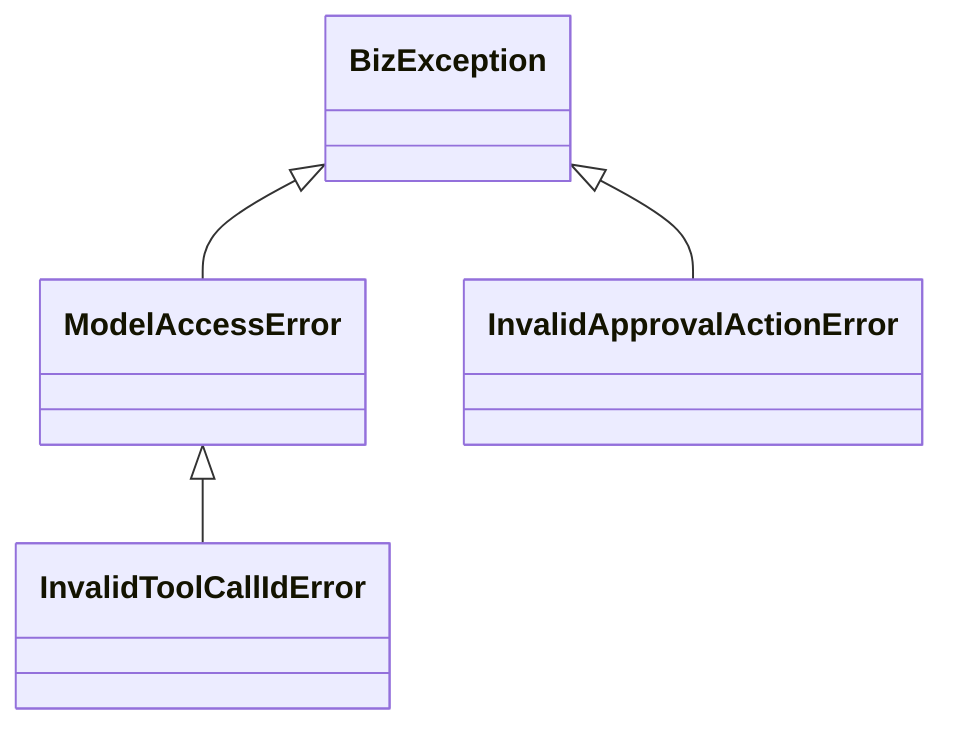
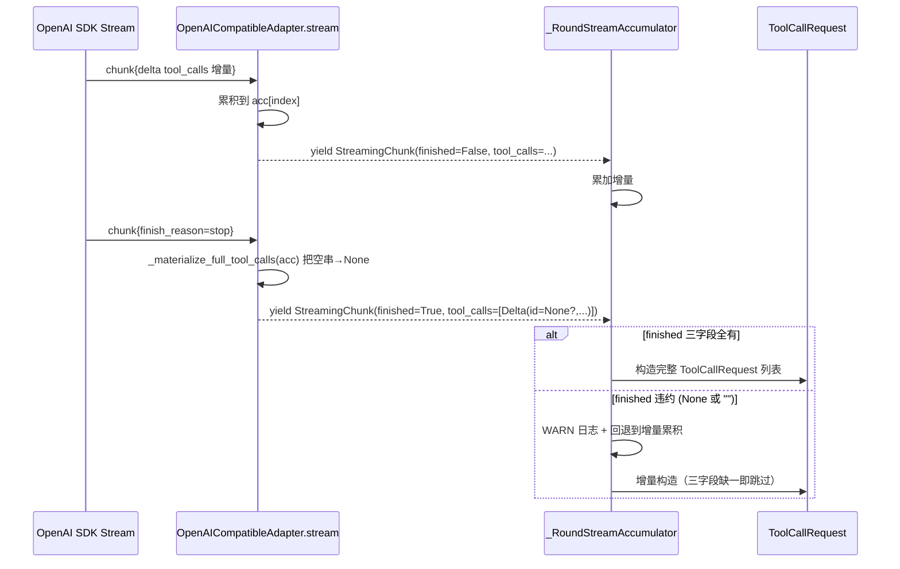

# 设计文档：ToolCallRequest id 校验失败链路分析与加固

## 概述

本设计在不破坏 `ToolCallRequest` 既有 frozen dataclass 与三字段必填语义的前提下，对四条空 `id` 触发链路（同步对话、流式 finished 重组、历史会话恢复、审批恢复）做"分类异常 + 上下文增强 + 流式契约对齐 + 审批前置校验 + 历史快照兼容策略"五类加固，遵循 `docs/steering/ddd-architecture.md` 的 DDD 分层依赖方向、`docs/steering/code-documentation.md` 的中文 docstring 规范与 `docs/steering/config-source.md` 的配置源约束。新增异常类型只放置在 `domain/model_access/exceptions.py` 与 `domain/agent/exceptions.py` 两处，不在 `infrastructure/` 层定义新领域异常。

### 设计决策（汇总）

| # | 决策 | 选项 | 理由 |
| --- | --- | --- | --- |
| D1 | 异常归属拆分 | 模型解析侧（同步 chat / 流式 finished / 历史快照）→ `domain/model_access/exceptions.py` 新增 `InvalidToolCallIdError`；审批前置校验侧（`PendingActionRequest` / `ApprovalDecision`）→ `domain/agent/exceptions.py` 新增 `InvalidApprovalActionError` | 模型解析侧的语义是"模型/Provider 给出的 tool_call payload 不合法"，归属 `model_access` 子域；审批前置校验侧的语义是"上游送入审批值对象的 tool_call_id 不合法"，归属 `agent` 子域。两条路径的捕获方与排障字段集本身不同，强行复用一个类型反而会让 application 层的 `isinstance` 分支退化（详见 §异常体系设计）。 |
| D2 | 单类型 + `source` 字段 vs 子类细分 | 模型解析侧用**单类型 `InvalidToolCallIdError` + `details["source"]`** 区分链路（`chat_sync` / `stream_finished` / `history_restore`）；审批前置校验侧用单类型 `InvalidApprovalActionError` + `details["value_object"]` / `details["field"]` 区分构造点 | 验收标准（需求 5）显式要求"统一字段集 + 同一查询能聚合"，且 application 层不需要为每个链路做差异化分支处理，只需要把它们都映射成 4xx 用户态错误；保留 `details["source"]` 即可在日志聚合时按链路筛选。 |
| D3 | 流式 finished 修复范围 | **同时**修：(a) `_materialize_full_tool_calls` 在源头把"空字符串"归一化为 `None`；(b) `round_stream_accumulator` 的 finished 分支把"`None` 或空字符串"视为违约 | 仅修下游会让上游契约继续撒谎；仅修上游会让 v3 决策 11 的"finished 分片完整列表覆盖增量"在第三方网关偏离契约时静默生效。同时双修才能把"finished 分片三字段非 None 且非空"提升为可被严格依赖的全链路契约。 |
| D4 | 历史快照兼容策略 | **过滤策略 + WARN 日志**（不抛异常） | 历史快照来自线上脏数据，单条会话内可能只有一项 tool_call 违约；抛异常会让整个会话不可恢复，严重损伤用户体验。过滤后保留剩余合法 `tool_calls`，并通过 WARN 日志暴露脏数据规模。配置开关 `ID_VALIDATION_HISTORY_RESTORE_STRATEGY=filter` 写入 `config.properties`，预留未来切换"专用异常"的能力（详见 §历史会话恢复兼容策略）。 |
| D5 | 审批前置校验落点 | `PendingActionRequest.__post_init__` 与 `ApprovalDecision.__post_init__` 均抛出 `InvalidApprovalActionError`（继承自 `BizException`，错误码 `60040`）；与模型解析侧的 `InvalidToolCallIdError` 显式区分类型，不共享父类 | 审批侧异常归 `agent` 子域，复用既有 `60xxx` 段错误码，与 `ApprovalDecisionCountMismatchError` 等同段；与模型解析侧 `50xxx` 段并行，application 层可分别 `isinstance` 捕获。 |
| D6 | 统一诊断字段集 | `details = {"source", "provider", "model", "tool_name", "tool_call_index", "raw_id_value", "value_object" (审批侧), "field" (审批侧)}`；缺失字段由抛出方填 `None`，**不省略键** | 统一 schema 是"日志聚合按同一查询命中"的前提；若按链路裁剪不同字段集，ELK 端就要对每条链路写一条查询。 |
| D7 | 日志字段映射 | WARN 日志通过 `logger.warning(msg, extra={...})`，`extra` dict 与异常 `details` 一一对应（同名键、同语义），`msg` 为人类可读模板 | 与仓库既有 `WorkspaceConfinementViolation` 的"observation 走 extra，不进 message"约定保持一致（参见 `domain/workspace/exceptions.py`）。 |
| D8 | 配置开关位置 | `epsilon-boot/config.properties` 新增 `ID_VALIDATION_HISTORY_RESTORE_STRATEGY` | 遵循 `docs/steering/config-source.md`；遵循 `config.properties` 既有 `UPPER_SNAKE_CASE` 命名风格 + 复用 `PropertiesBaseSettings` 加载链路（`common.configuration.create_config`）。 |

## 受影响代码与改动范围

### 新增文件

- `epsilon-boot/src/common/configuration/id_validation_config.py`：定义 `IdValidationConfig(PropertiesBaseSettings)` 并通过 `create_config` 暴露单例 `id_validation_config`，承载历史恢复策略等 ID 校验运行期配置；落点选 `common/configuration/` 是为了让 `domain/chat/context.py` 能在不违反 DDD 依赖方向（domain 不得 import `infrastructure/`）的前提下读取该配置。

异常类型添加进既有的 `exceptions.py` 文件，不新增异常源文件。

### 修改文件清单

| 文件 | 改动性质 |
| --- | --- |
| `epsilon-boot/src/domain/model_access/exceptions.py` | 新增 `InvalidToolCallIdError`。 |
| `epsilon-boot/src/domain/agent/exceptions.py` | 新增 `InvalidApprovalActionError`。 |
| `epsilon-boot/src/domain/agent/value_objects.py` | `PendingActionRequest.__post_init__` / `ApprovalDecision.__post_init__` 新增 `tool_call_id` 非空校验。 |
| `epsilon-boot/src/domain/chat/context.py` | `BaseMessage.from_dict` 在 role=assistant 分支增加"过滤 + WARN 日志"逻辑。 |
| `epsilon-boot/src/infrastructure/model_access/openai_compatible_adapter.py` | (a) 同步 `chat()` 在构造 `ToolCallRequest` 前做 id 校验；(b) `_materialize_full_tool_calls` 把 `slot.get("arguments")` 的空字符串归一化为合法值或保留 `None`，并把"id 为 None 或空字符串"在 finished 分片处显式归一化为 `None`（让下游回退保护生效）。 |
| `epsilon-boot/src/infrastructure/agent/round_stream_accumulator.py` | finished 分支的违约判定从 `is None` 扩展为 "`is None or 空字符串`"，并补 WARN 日志。 |
| `epsilon-boot/src/common/configuration/id_validation_config.py` | **新增文件**：定义 `IdValidationConfig(PropertiesBaseSettings)`（`env_prefix="ID_VALIDATION_"`），通过 `create_config` 暴露 `id_validation_config` 单例，复用既有配置加载链路；落点选 `common/configuration/` 而非 `infrastructure/` 是为了不破坏 domain 的依赖方向。 |
| `epsilon-boot/config.properties` | 新增 `ID_VALIDATION_HISTORY_RESTORE_STRATEGY=filter`（默认值）。 |

### 不动的契约（边界）

- `ToolCallRequest` 字段集与 `frozen=True` 不变。
- `StreamingChunk` / `StreamingToolCallDelta` 字段集与契约文案不变；流式 finished 分片的"三字段非 `None`"承诺从"非 `None`"加强为"非 `None` 且非空字符串"，仍然向下兼容（旧消费者不会被破坏）。
- `BaseMessage.to_dict` 输出格式不变，仅改 `from_dict` 输入解析。
- 不引入新的可观测性后端，复用 `logging.getLogger(__name__)`。

## 异常体系设计

### `domain/model_access/exceptions.py` 新增

```python
class InvalidToolCallIdError(ModelAccessError):
    """工具调用 id 不合法异常。

    用于刻画"从 LLM Provider / 历史会话快照 / 流式重组结果中得到的
    ``tool_call.id`` 为 ``None`` 或空字符串"这一类违约。所有同步 chat、
    流式 finished 分片重组、历史会话恢复链路上发现 id 违约的位置都
    抛出本异常，**不再裸抛 ``ValueError("id 不能为空")``**。

    错误码 ``50007``，与 ``ModelAccessError`` 同段；application 层可基于
    ``isinstance(exc, InvalidToolCallIdError)`` 单独捕获并转换为面向
    用户的 4xx 友好错误响应，且与既有 ``ModelTimeoutError`` /
    ``ModelRateLimitError`` 不共享类型。

    ``details`` 遵循统一诊断字段集（参见 §统一诊断字段集），抛出方
    填充各链路对应的 ``source`` / ``provider`` / ``model`` /
    ``tool_name`` / ``tool_call_index`` / ``raw_id_value`` 字段；
    缺失字段统一填 ``None``，**不省略键**，便于日志聚合按统一查询命中。

    Attributes:
        code: 错误码，固定为 ``50007``。
        message: 中文错误描述，含 ``source`` 与 ``raw_id_value`` 摘要。
        details: 见 §统一诊断字段集。
    """

    def __init__(
        self,
        source: str,
        raw_id_value: object,
        *,
        provider: str | None = None,
        model: str | None = None,
        tool_name: str | None = None,
        tool_call_index: int | None = None,
        extra: dict[str, Any] | None = None,
    ) -> None:
        message = (
            f"工具调用 id 不合法（source={source}, "
            f"raw_id_value={raw_id_value!r}）"
        )
        details: dict[str, Any] = {
            "source": source,
            "provider": provider,
            "model": model,
            "tool_name": tool_name,
            "tool_call_index": tool_call_index,
            "raw_id_value": raw_id_value,
        }
        if extra:
            details.update(extra)
        super().__init__(message=message, code=50007, details=details)
```

设计要点：
- **不在 message 中拼接敏感字段**：`raw_id_value` 仅含 `None` / `""`，本身无敏感性；`provider` / `model` / `tool_name` 已是元数据字段，安全。
- 继承自 `ModelAccessError` 而非直接继承 `BizException`，让既有 `except ModelAccessError:` 的兜底捕获仍然生效（向后兼容）。
- 错误码 `50007` 紧接 `ModelConnectionError` 的 `50006`。

### `domain/agent/exceptions.py` 新增

```python
class InvalidApprovalActionError(BizException):
    """审批动作值对象构造非法异常。

    当 ``PendingActionRequest`` / ``ApprovalDecision`` 在 ``__post_init__``
    中检测到 ``tool_call_id`` 为 ``None`` 或空字符串时抛出。该异常归属
    ``domain/agent`` 子域，错误码 ``60040``，与既有审批相关异常
    （``ApprovalNotFoundError`` 60020 / ``ApprovalExpiredError`` 60021…）
    同段，但分类独立，application 层可基于 ``isinstance`` 单独捕获。

    与 ``InvalidToolCallIdError``（``domain/model_access`` 侧）显式分
    类型：模型解析侧的 id 违约由 Provider 行为引发，审批前置校验侧的
    违约由上游 application 层送入的值对象构造引发；两者的排障路径
    与责任方不同。

    Attributes:
        code: 错误码，固定为 ``60040``。
        message: 中文错误描述，含违约值对象名与字段名。
        details: 见 §统一诊断字段集（审批侧特化字段）。
    """

    def __init__(
        self,
        value_object: str,
        field: str,
        raw_value: object,
        *,
        tool_name: str | None = None,
    ) -> None:
        message = (
            f"{value_object}.{field} 不能为空"
            f"（raw_value={raw_value!r}）"
        )
        super().__init__(code=60040, message=message)
        self.details: dict[str, Any] = {
            "source": "approval_resume",
            "provider": None,
            "model": None,
            "tool_name": tool_name,
            "tool_call_index": None,
            "raw_id_value": raw_value,
            "value_object": value_object,
            "field": field,
        }
        # 同时将 value_object / field 作为属性暴露，便于测试断言。
        self.value_object = value_object
        self.field = field
        self.raw_value = raw_value
```

设计要点：
- 继承自 `BizException`，与 `ApprovalDecisionCountMismatchError` 等审批相关异常并列（参见 `domain/agent/exceptions.py` 既有定义）。
- `details` schema 与 `InvalidToolCallIdError` 完全对齐（统一诊断字段集），并附加 `value_object` / `field` 两个审批侧特化键。
- 错误码 `60040` 与既有审批段（`60020`–`60029`）保持距离，预留 `60030`–`60039` 段给"工具熔断"等其他子域。

### 异常类继承关系图



## 同步链路改造（OpenAI_Compatible_Adapter.chat）

### 现状（节选）

```python
# infrastructure/model_access/openai_compatible_adapter.py:131-140
tool_calls: list[ToolCallRequest] = []
if message.tool_calls:
    for tc in message.tool_calls:
        tool_calls.append(
            ToolCallRequest(
                id=tc.id,                  # 当 tc.id 为 None 或 "" 时直接裸 ValueError
                name=tc.function.name,
                arguments=tc.function.arguments,
            )
        )
```

### 改造后

```python
tool_calls: list[ToolCallRequest] = []
if message.tool_calls:
    for tc in message.tool_calls:
        tc_id = getattr(tc, "id", None)
        tc_name = getattr(tc.function, "name", None) if tc.function else None
        tc_index = getattr(tc, "index", None)
        if not tc_id:                       # None 或 "" 同等处理
            details = {
                "source": "chat_sync",
                "provider": self._config.provider_name,
                "model": completion.model,
                "tool_name": tc_name,
                "tool_call_index": tc_index,
                "raw_id_value": tc_id,
            }
            logger.warning(
                "OpenAI 兼容 Provider 返回的 tool_call.id 不合法，将抛出 InvalidToolCallIdError",
                extra=details,
            )
            raise InvalidToolCallIdError(
                source="chat_sync",
                raw_id_value=tc_id,
                provider=self._config.provider_name,
                model=completion.model,
                tool_name=tc_name,
                tool_call_index=tc_index,
            )
        tool_calls.append(
            ToolCallRequest(
                id=tc_id,
                name=tc.function.name,
                arguments=tc.function.arguments,
            )
        )
```

设计要点：
- **校验前移到 `ToolCallRequest` 构造之前**，使错误以领域异常形态而非裸 `ValueError` 暴露。
- WARN 日志的 `extra` 与异常 `details` 字段集完全一致（仅日志多一句人类可读 message）。
- 保留 `name` / `arguments` 的现有非空校验由 `ToolCallRequest.__post_init__` 兜底（不在本次需求范围内强化，但若同样违约会以 `ValueError` 形态暴露——这是已知的"二阶段加固空间"，本次不动）。
- 不引入新的 SDK 依赖、不修改 `ChatRequest` / `LLMResponse` 字段集。

### 模块导入新增

```python
from domain.model_access.exceptions import (
    InvalidToolCallIdError,
    ModelAccessError,
    ModelConnectionError,
    ModelRateLimitError,
    ModelTimeoutError,
)
```

## 流式 finished 分片契约修复

### 双侧修复

#### (a) 上游：`_materialize_full_tool_calls` 把空串归一化为 `None`

```python
# infrastructure/model_access/openai_compatible_adapter.py
@staticmethod
def _materialize_full_tool_calls(
    acc: dict[int, dict[str, Any]],
) -> list[StreamingToolCallDelta] | None:
    if not acc:
        return None
    result: list[StreamingToolCallDelta] = []
    for index in sorted(acc):
        slot = acc[index]
        # 把"空字符串"归一化为 None，让下游 round_stream_accumulator
        # 的 finished 违约判定一次到位（决策 D3）。
        slot_id = slot.get("id") or None
        slot_name = slot.get("name") or None
        slot_args = slot.get("arguments") or None
        result.append(
            StreamingToolCallDelta(
                index=index,
                id=slot_id,
                name=slot_name,
                arguments_delta=slot_args,
            )
        )
    return result
```

> 注：`StreamingToolCallDelta` 的字段类型已是 `str | None`（参见 `domain/model_access/value_objects.py:165-168`），归一化不破坏 frozen dataclass 约束。

#### (b) 下游：`_RoundStreamAccumulator.consume` 的 finished 分支扩展违约判定

```python
# infrastructure/agent/round_stream_accumulator.py
import logging

logger = logging.getLogger(__name__)


class _RoundStreamAccumulator:
    ...

    async def consume(self, stream: AsyncIterator[StreamingChunk]) -> None:
        ...
        async for chunk in stream:
            ...
            if chunk.tool_calls is not None:
                if chunk.finished:
                    final: list[ToolCallRequest] = []
                    for delta in chunk.tool_calls:
                        # 决策 D3：把"None 或空字符串"同等视为违约。
                        if (
                            not delta.id
                            or not delta.name
                            or not delta.arguments_delta
                        ):
                            logger.warning(
                                "流式 finished 分片违约，回退到增量累积结果",
                                extra={
                                    "source": "stream_finished",
                                    "provider": None,
                                    "model": self._model,
                                    "tool_name": delta.name or None,
                                    "tool_call_index": delta.index,
                                    "raw_id_value": delta.id,
                                    "violation_field": (
                                        "id" if not delta.id
                                        else "name" if not delta.name
                                        else "arguments_delta"
                                    ),
                                },
                            )
                            final = []
                            break
                        final.append(
                            ToolCallRequest(
                                id=delta.id,
                                name=delta.name,
                                arguments=delta.arguments_delta,
                            )
                        )
                    if final:
                        self._final_tool_calls = final
                else:
                    # 增量分支语义不变（需求 2.3）：保留现有 is not None 判定。
                    for delta in chunk.tool_calls:
                        slot = self._acc_tool_calls.setdefault(
                            delta.index,
                            {"id": None, "name": None, "arguments": ""},
                        )
                        if delta.id is not None:
                            slot["id"] = delta.id
                        if delta.name is not None:
                            slot["name"] = delta.name
                        if delta.arguments_delta is not None:
                            slot["arguments"] = (slot.get("arguments") or "") + delta.arguments_delta
            ...
```

设计要点：
- **不抛异常**：finished 违约是设计约束（"末尾分片必须三字段全有"），但流式累积器的契约是"违约时回退到增量结果，不抛错"——这点与既有代码保留（参见 `round_stream_accumulator.py:108-111` 的注释 "若上游违约，回退到增量累积结果"）。
- 仅扩展条件 `is None → not delta.id`（即 `None or ""`），**不**改变累积器对外行为。
- WARN 日志直接用 `extra=...`，字段集对齐统一诊断字段集（含审批不适用的字段填 `None`），并加一个 `violation_field` 标识具体违约字段。
- 若 finished 违约后增量结果也不完整（``build_response`` 中三字段缺一即 skip 的兜底逻辑），则该轮 `LLMResponse.tool_calls` 为空——与现有"三字段缺一即跳过"语义一致，不会爆 `ToolCallRequest(id="", ...)`。

### 流式重组时序图



## 历史会话恢复兼容策略

### 选定策略：过滤 + WARN 日志（决策 D4）

理由：
- 历史快照来自线上会话存储（File / Redis 后端），脏数据无法预防只能容忍。
- 一段会话可能有几十条 `assistant` 消息，单条违约不应致整段不可恢复——抛异常会让用户"原本能接着聊"变成"完全打不开"。
- 过滤后保留剩余 `tool_calls` 仍能让上下文继续走 ReAct Loop（即便丢失某次工具调用记录，对话继续推进的代价远小于整段崩溃）。
- 通过 WARN 日志暴露脏数据规模，运维可在 ELK / 日志平台聚合"`source=history_restore`"查询估算修复成本。

### 配置开关

`epsilon-boot/config.properties` 新增：

```properties
# 历史会话恢复时遇到 tool_call.id 缺失/空时的兼容策略
# - filter（默认）：过滤违约项，保留剩余合法 tool_calls，并通过 WARN 日志暴露脏数据
# - raise：抛 InvalidToolCallIdError，由 application 层降级（仅在脏数据预期为 0 时启用）
ID_VALIDATION_HISTORY_RESTORE_STRATEGY=filter
```

注：键名遵循 `config.properties` 既有 `UPPER_SNAKE_CASE` 命名风格（与 `CHAT_MAX_TOOL_ROUNDS` / `HITL_ENABLED` / `MODEL_QWEN_API_KEY` 等并列）。开关默认值与本次决策一致；切换"raise"形态时不需要再改代码，仅改 `from_dict` 中的策略分支。

### `BaseMessage.from_dict` 改造

新增独立 settings 类 `IdValidationConfig`，落在共享内核 `epsilon-boot/src/common/configuration/id_validation_config.py`（与 `PropertiesBaseSettings` / `create_config` 同包）。

落点理由：`domain/chat/context.py` 在反序列化点需要读取该配置，而 `docs/steering/ddd-architecture.md` 明确"禁止 `domain/` 导入任何 `src/infrastructure/*` 模块"且"禁止 `domain/` 导入 Pydantic Settings"。把 settings 类放在 `common/configuration/` 下，由 `common/` 内部封装 `PropertiesBaseSettings` 依赖、对 domain 仅暴露简单的属性访问接口（`id_validation_config.history_restore_strategy`），既复用 `PropertiesBaseSettings` 的 env > properties > .env 加载链路，又不打破 domain 的依赖方向。本配置项不耦合任何具体业务子域实现，符合"`common/` 是共享内核"的定位。

```python
# common/configuration/id_validation_config.py
"""ID 校验相关运行期配置模块。

承载历史会话恢复策略等 ID 校验链路的可调开关。所有配置项遵循
``config.properties`` 的 ``UPPER_SNAKE_CASE`` 命名约定，前缀
``ID_VALIDATION_``。
"""

from pydantic_settings import SettingsConfigDict

from common.configuration import PropertiesBaseSettings, create_config


class IdValidationConfig(PropertiesBaseSettings):
    """ID 校验相关运行期配置，对应环境变量前缀 ``ID_VALIDATION_``。

    Attributes:
        history_restore_strategy: 历史会话恢复时遇到 ``tool_call.id`` 缺失/
            空时的兼容策略，``"filter"`` 过滤违约项、``"raise"`` 抛
            ``InvalidToolCallIdError``，对应 ``ID_VALIDATION_HISTORY_RESTORE_STRATEGY``，
            默认 ``"filter"``。
    """

    model_config = SettingsConfigDict(env_prefix="ID_VALIDATION_")

    history_restore_strategy: str = "filter"


id_validation_config = create_config(IdValidationConfig)
"""全局 ID 校验配置实例，通过工厂函数创建（支持热更新）。"""
```

`domain/chat/context.py` 在反序列化点通过模块级常量缓存策略值，复用上述 settings 单例，避免每次反序列化都触发配置 IO；同时 **不在 domain 层新增 `import os` 或读取 `config.properties` 的私有函数**：

```python
# domain/chat/context.py
import logging

from common.configuration.id_validation_config import id_validation_config
from domain.model_access.exceptions import InvalidToolCallIdError

logger = logging.getLogger(__name__)


def _load_history_restore_strategy() -> str:
    """读取历史会话恢复策略配置（``filter`` 或 ``raise``）。

    复用仓库既有 ``PropertiesBaseSettings`` 加载链路（env > config.properties
    > .env > 默认值），由 ``id_validation_config`` 单例统一暴露；本函数
    不直接读取 ``os.environ`` 或 ``config.properties``，避免绕过 settings
    框架。在 ``BaseMessage`` 模块顶部以模块级常量
    ``_HISTORY_RESTORE_STRATEGY`` 缓存返回值，保留"避免每次反序列化触发
    配置 IO"的原始意图。

    Returns:
        策略字符串：``"filter"`` / ``"raise"``。配置值非法时回退 ``"filter"``。
    """
    raw = id_validation_config.history_restore_strategy
    return raw if raw in ("filter", "raise") else "filter"


_HISTORY_RESTORE_STRATEGY = _load_history_restore_strategy()


@classmethod
def from_dict(cls, data: dict[str, Any]) -> "BaseMessage":
    role = data["role"]
    content = data["content"]
    metadata = data.get("metadata", {})

    if role == "system":
        return SystemMessage(content=content, metadata=metadata)
    elif role == "user":
        return UserMessage(content=content, metadata=metadata)
    elif role == "assistant":
        raw_tool_calls = data.get("tool_calls", [])
        tool_calls: list[ToolCallRequest] = []
        skipped: list[dict[str, Any]] = []
        for index, tc in enumerate(raw_tool_calls):
            tc_id = tc.get("id") if isinstance(tc, dict) else None
            tc_name = tc.get("name") if isinstance(tc, dict) else None
            tc_args = tc.get("arguments") if isinstance(tc, dict) else None
            if not tc_id:
                skipped.append(
                    {
                        "index": index,
                        "name": tc_name,
                        "raw_id_value": tc_id,
                    }
                )
                continue
            tool_calls.append(
                ToolCallRequest(id=tc_id, name=tc_name, arguments=tc_args)
            )
        if skipped:
            details = {
                "source": "history_restore",
                "provider": None,
                "model": None,
                "tool_name": skipped[0].get("name"),
                "tool_call_index": skipped[0].get("index"),
                "raw_id_value": skipped[0].get("raw_id_value"),
                "skipped_count": len(skipped),
                "session_id": data.get("metadata", {}).get("session_id"),
            }
            if _HISTORY_RESTORE_STRATEGY == "raise":
                logger.warning(
                    "历史会话恢复触发 tool_call.id 违约，按 raise 策略抛出",
                    extra=details,
                )
                raise InvalidToolCallIdError(
                    source="history_restore",
                    raw_id_value=skipped[0].get("raw_id_value"),
                    tool_name=skipped[0].get("name"),
                    tool_call_index=skipped[0].get("index"),
                    extra={
                        "skipped_count": len(skipped),
                        "session_id": details["session_id"],
                    },
                )
            else:
                logger.warning(
                    "历史会话恢复发现 %d 项 tool_call 违约，已过滤",
                    len(skipped),
                    extra=details,
                )
        return AssistantMessage(content=content, metadata=metadata, tool_calls=tool_calls)
    elif role == "tool":
        ...
```

设计要点：
- **`domain/` 层不导入 `infrastructure/`**：配置读取通过既有的 `common.configuration` 通用加载器（已是 `common/` 内的共享内核），不引入对 `infrastructure/` 的反向依赖。
- **DDD 纯度**：`InvalidToolCallIdError` 来自 `domain/model_access`，跨子域引用属于"领域内同层稳定公开模型"，符合 `docs/steering/ddd-architecture.md` 第 25 行允许范围。
- **`session_id` 取自消息 metadata**：历史快照的 `BaseMessage.metadata` 在 `ConversationContext.from_dict` 入口本就携带（如已扩展），若不携带则 `details["session_id"]` 为 `None`，不影响日志聚合。

### 影响域

- 合法历史快照（所有 `tool_calls[*].id` 非空）→ 行为完全不变（不进入新增分支），无回归。
- 含违约 `tool_calls[*]` 的历史快照 → 默认策略下过滤违约项，保留合法项；WARN 日志输出违约规模。

## 审批前置校验改造

### `PendingActionRequest.__post_init__`

```python
# domain/agent/value_objects.py
from domain.agent.exceptions import InvalidApprovalActionError


@dataclass(frozen=True)
class PendingActionRequest:
    """待审批工具动作值对象。
    ...（既有 docstring 保留，追加以下）
    Raises:
        InvalidApprovalActionError: 当 ``tool_call_id`` 为 ``None`` 或空字符串时抛出。
    """

    tool_call_id: str
    tool_name: str
    arguments: str
    allowed_decisions: frozenset[ApprovalDecisionType]
    reason: str = ""

    def __post_init__(self) -> None:
        """前置校验 ``tool_call_id`` 非空。

        Raises:
            InvalidApprovalActionError: 见类 docstring。
        """
        if not self.tool_call_id:
            raise InvalidApprovalActionError(
                value_object="PendingActionRequest",
                field="tool_call_id",
                raw_value=self.tool_call_id,
                tool_name=self.tool_name or None,
            )
```

### `ApprovalDecision.__post_init__`

```python
@dataclass(frozen=True)
class ApprovalDecision:
    """审批恢复决策值对象。
    ...（既有 docstring 保留，追加以下）
    Raises:
        InvalidApprovalActionError: 当 ``tool_call_id`` 为 ``None`` 或空字符串时抛出。
    """

    type: ApprovalDecisionType
    tool_call_id: str
    edited_action: EditedAction | None = None
    message: str = ""

    def __post_init__(self) -> None:
        """前置校验 ``tool_call_id`` 非空。"""
        if not self.tool_call_id:
            raise InvalidApprovalActionError(
                value_object="ApprovalDecision",
                field="tool_call_id",
                raw_value=self.tool_call_id,
            )
```

### 影响域

- `react_agent_adapter.py` 第 1154 行的 `original = ... or ToolCallRequest(id=action.tool_call_id, ...)` 与第 1187 行 `ToolCallRequest(id=action.tool_call_id, ...)` 永远不会再收到空 `tool_call_id`：因为 `interrupt.actions: tuple[PendingActionRequest, ...]` 在构造时已被前置校验拦截。
- application 层送入 `ApprovalResumeRequestVO` 的 `decisions: tuple[ApprovalDecision, ...]` 也在构造时被拦截，错误暴露在路由层而非延迟到适配器内部。
- 既有的 `ApprovalDecisionCountMismatchError` / `ApprovalDecisionOrderMismatchError` 等校验顺序不变（在前置校验之后才进入 `_apply_approval_decisions`）。

## 统一诊断字段集

### Schema 表

| key | type | 是否可选 | 适用链路 | 示例 | 说明 |
| --- | --- | --- | --- | --- | --- |
| `source` | `str` | 必填 | 全部 | `"chat_sync"` / `"stream_finished"` / `"history_restore"` / `"approval_resume"` | 抛出方所在链路标识；ELK 聚合时按此值分组。 |
| `provider` | `str | None` | 必填，可为 `None` | 仅 `chat_sync` 有意义 | `"deepseek"` / `"zhipu"` | 不适用链路填 `None`，**不省略键**。 |
| `model` | `str | None` | 必填，可为 `None` | `chat_sync` / `stream_finished` 有意义 | `"deepseek-chat"` | 同上。 |
| `tool_name` | `str | None` | 必填，可为 `None` | 全部，部分链路无信息 | `"web_search"` | 流式 finished 与历史快照可能拿不到 `name`，填 `None`。 |
| `tool_call_index` | `int | None` | 必填，可为 `None` | `chat_sync` / `stream_finished` / `history_restore` | `0` / `1` | OpenAI SDK 给出的工具调用序号；审批侧无此概念，填 `None`。 |
| `raw_id_value` | `Any` | 必填 | 全部 | `None` / `""` | 原始违约字段值，保留类型（`None` 与 `""` 必须可区分）。 |
| `value_object` | `str` | 仅审批侧必填，其他链路可省略或填 `None` | `approval_resume` | `"PendingActionRequest"` / `"ApprovalDecision"` | 审批侧专用。 |
| `field` | `str` | 仅审批侧必填 | `approval_resume` | `"tool_call_id"` | 审批侧专用。 |
| `skipped_count` | `int` | 仅历史快照侧可选 | `history_restore` | `1` / `3` | 过滤策略下被过滤的违约项数量，便于排障估算脏数据规模。 |
| `session_id` | `str | None` | 仅历史快照侧可选 | `history_restore` | `"sess-xxx"` | 历史快照侧若 metadata 含 `session_id` 则填，否则 `None`。 |
| `violation_field` | `str` | 仅流式 finished 侧可选 | `stream_finished` | `"id"` / `"name"` / `"arguments_delta"` | 流式 finished 多字段都可能违约，标识本次违约的具体字段。 |

### 敏感信息约束（需求 5.4）

`details` 中**禁止**出现：API 密钥、完整 system prompt、用户原文消息、`arguments` JSON 内容。`tool_name` 是元数据（与 OpenAI Functions 的工具 schema 名称一致），不视为敏感。

### 字段填充约定

- 抛出方对所有"键存在但本链路不适用"的字段统一填 `None`，**不省略键**——这是"日志聚合按同一查询命中"的前提。
- 审批侧的 `InvalidApprovalActionError` 在 `__init__` 中预填 `provider=None` / `model=None` / `tool_call_index=None`，让 ELK 按 `source` 字段聚合时能命中所有 4 类链路。

## 日志规范

### 通用约定

- 复用 `logging.getLogger(__name__)`，**不新增**可观测性后端。
- 所有 WARN 日志使用 `logger.warning(message, extra=details)`，`message` 为人类可读模板，`details` 与对应异常 `details` 字段集对齐。
- `extra` 中的字段名在 Python `logging.LogRecord` 中保留小写下划线风格；ELK / 结构化采集器（若启用）可直接读取。
- **不**在 message 中拼接 `details` 字段（与 `domain/workspace/exceptions.py` 的"observation 走 extra，不进 message"一致）。

### 各链路日志样例

| 链路 | logger 模块名 | 日志级别 | message 模板 | extra 字段 |
| --- | --- | --- | --- | --- |
| `chat_sync` | `infrastructure.model_access.openai_compatible_adapter` | WARN | `"OpenAI 兼容 Provider 返回的 tool_call.id 不合法，将抛出 InvalidToolCallIdError"` | source / provider / model / tool_name / tool_call_index / raw_id_value |
| `stream_finished` | `infrastructure.agent.round_stream_accumulator` | WARN | `"流式 finished 分片违约，回退到增量累积结果"` | source / provider=None / model / tool_name / tool_call_index / raw_id_value / violation_field |
| `history_restore` | `domain.chat.context` | WARN | `"历史会话恢复发现 %d 项 tool_call 违约，已过滤"` | source / provider=None / model=None / tool_name / tool_call_index / raw_id_value / skipped_count / session_id |
| `approval_resume`（值对象构造） | 由 application 层捕获后记录（见下） | WARN | `"审批动作值对象构造失败：%s"` | 同 `InvalidApprovalActionError.details` |

### 审批侧日志的"抛出方"约定

`PendingActionRequest.__post_init__` / `ApprovalDecision.__post_init__` 在 `domain/` 层**不**直接调用 logger（避免在 domain 值对象构造点引入副作用、且 `domain/` 层的日志使用受限于 DDD 规范）；由 application 层 / FastAPI 异常处理器在捕获 `InvalidApprovalActionError` 时输出 WARN 日志，`extra=exc.details` 即可。

> 注：`application/api/exception_handlers.py` 已存在 `BizException` 的统一处理（参见 `exception_handlers.py:27`），本次改造在该处理器中追加对 `InvalidApprovalActionError` 与 `InvalidToolCallIdError` 的 `extra=exc.details` 输出，避免在 4 个抛出方各写一遍日志。

## 测试矩阵

### 测试目标位置

| 测试 | 位置 |
| --- | --- |
| `InvalidToolCallIdError` / `InvalidApprovalActionError` 异常类单元测试 | `epsilon-boot/tests/unit/domain/model_access/test_exceptions.py`（已有则追加用例）；`epsilon-boot/tests/unit/domain/agent/test_exceptions.py` |
| `PendingActionRequest` / `ApprovalDecision` 前置校验 | `epsilon-boot/tests/unit/domain/agent/test_value_objects.py` |
| `BaseMessage.from_dict` 历史快照过滤策略 | `epsilon-boot/tests/unit/domain/chat/test_context.py` |
| `OpenAICompatibleAdapter.chat` 同步链路 | `epsilon-boot/tests/unit/infrastructure/model_access/test_openai_compatible_adapter.py` |
| `_RoundStreamAccumulator` finished 违约回退 | `epsilon-boot/tests/unit/infrastructure/agent/test_round_stream_accumulator.py` |
| 审批恢复路径集成回归 | `epsilon-boot/tests/integration/test_approval_resume.py`（沿用既有测试位置） |

### 4 条链路 × 2 种触发值矩阵

| # | 链路 | 触发值 | 期望行为 | 关联需求 |
| --- | --- | --- | --- | --- |
| T1 | chat_sync | `id=None` | 抛 `InvalidToolCallIdError(source="chat_sync", raw_id_value=None, ...)`；WARN 日志 extra 完整 | R1.1 / R1.2 / R1.3 / R5.1 / R5.2 |
| T2 | chat_sync | `id=""` | 同 T1，`raw_id_value=""` | R1.1 / R1.4 |
| T3 | chat_sync（合法） | `id="call_xxx"` | 正常构造 `ToolCallRequest`，无 WARN 日志 | 回归保护 |
| T4 | stream_finished | finished 分片 `delta.id=None` | `_RoundStreamAccumulator` 回退到增量累积结果；WARN 日志 extra 含 `violation_field="id"` | R2.1 / R2.2 |
| T5 | stream_finished | finished 分片 `delta.id=""` | 同 T4 | R2.1 |
| T6 | stream_finished（增量） | 中间分片 `delta.id=""` | 既有"is not None"判定不变，空串被累积进 `slot["id"]`；后续若 finished 分片仍违约则回退（覆盖增量与 finished 双违约的合并行为） | R2.3 |
| T7 | stream_finished（合法 finished） | 三字段全有 | 优先取 finished 完整列表覆盖增量 | 回归保护 |
| T8 | history_restore（filter） | 历史 `tool_calls=[{id="", name="x", arguments="{}"}]` | 过滤违约项，AssistantMessage.tool_calls=[]；WARN 日志 extra 含 `skipped_count=1` | R3.1 / R3.2 / R3.4 / R3.5 |
| T9 | history_restore（filter） | 历史 `tool_calls=[{id=None,...}, {id="ok",...}]` | 过滤第 1 项，保留第 2 项 | R3.1 / R3.2 |
| T10 | history_restore（raise） | 配置切到 `raise`，同 T8 | 抛 `InvalidToolCallIdError(source="history_restore", ...)` | R3.1 / R3.3 |
| T11 | history_restore（合法） | 历史所有 `tool_calls[*].id` 非空 | 反序列化结果与现有完全一致 | R3.5 / 回归保护 |
| T12 | approval_resume | `PendingActionRequest(tool_call_id=None, ...)` | 抛 `InvalidApprovalActionError(value_object="PendingActionRequest", field="tool_call_id", ...)` | R4.1 / R4.4 / R5.1 / R5.3 |
| T13 | approval_resume | `PendingActionRequest(tool_call_id="", ...)` | 同 T12，`raw_value=""` | R4.1 |
| T14 | approval_resume | `ApprovalDecision(type="approve", tool_call_id="")` | 抛 `InvalidApprovalActionError(value_object="ApprovalDecision", ...)` | R4.2 / R4.4 |
| T15 | approval_resume（合法） | `tool_call_id="call_xxx"` | 正常构造 | 回归保护 |
| T16 | application 层集成 | `ApprovalResumeRequestVO(decisions=(ApprovalDecision(tool_call_id="", ...),))` | `ApprovalDecision` 构造时即抛，路由层捕获返回 4xx | R4.3 |
| T17 | 异常 details schema | T1 / T4 / T8 / T12 任一 | `exc.details.keys()` 至少包含 `source / provider / model / tool_name / tool_call_index / raw_id_value`；不适用链路相应字段为 `None` 但键存在 | R5.1 / R5.4 |
| T18 | 异常 isinstance | T1 与 T12 | T1 抛出的可被 `isinstance(exc, ModelAccessError)` 与 `isinstance(exc, InvalidToolCallIdError)` 命中；T12 抛出的可被 `isinstance(exc, BizException)` 与 `isinstance(exc, InvalidApprovalActionError)` 命中；两者**互不**继承 | R5.3 / R6.1 |
| T19 | 日志 extra 对齐 | T1 / T4 / T8 | 用 `caplog`（pytest）断言 `record.extra` 字段集与 `exc.details` 一致 | R1.3 / R2.2 / R3.4 / R5.2 |

### 测试框架与命名

复用仓库现有 `pytest` 框架与 `tests/unit/<分层>/<模块>/test_<文件名>.py` 命名风格（参见 `tests/` 目录既有结构）。本设计**不**引入新的测试框架。

## 回归保护

明确以下既有合法用例必须不受影响：

| # | 既有合法用例 | 回归保护点 |
| --- | --- | --- |
| RG1 | 同步 `chat()` 收到合法 `tool_calls`（id/name/arguments 全有） | 新增校验仅对 `not tc_id` 触发，合法路径绕过；T3 覆盖。 |
| RG2 | 流式中间分片（`finished=False`）`delta.id=""` | `consume` 增量分支保留 `is not None` 判定，空串进入 `slot["id"]`，与既有行为完全一致；T6 覆盖。 |
| RG3 | 流式 finished 分片三字段全有 | finished 分支优先取完整列表覆盖增量，决策 11 不变；T7 覆盖。 |
| RG4 | 历史快照所有 `tool_calls[*].id` 合法 | 不进入新增过滤分支，反序列化结果与现有完全一致；T11 覆盖。 |
| RG5 | 历史快照不含 `tool_calls` 字段（纯文本助手消息） | `data.get("tool_calls", [])` 默认为空，新增逻辑直接跳过；现有 AssistantMessage 构造路径不变。 |
| RG6 | 合法 `PendingActionRequest` 构造（`tool_call_id="call_xxx"`） | 新增 `__post_init__` 仅对空值触发；T15 覆盖。 |
| RG7 | 合法 `ApprovalDecision` 构造 | 同 RG6。 |
| RG8 | `ApprovalDecisionCountMismatchError` / `ApprovalDecisionOrderMismatchError` 等既有审批校验异常 | 新增前置校验在这些异常之前，但合法路径下不触发；既有顺序与语义不变。 |
| RG9 | `_RoundStreamAccumulator.build_response` 增量回退路径下"三字段缺一即跳过" | 不变；T6 与既有测试用例覆盖。 |
| RG10 | OpenAI SDK 抛 `APITimeoutError` / `RateLimitError` / `APIConnectionError` 时映射为既有领域异常 | 不变；本次改造仅在 `tool_calls` 解析阶段新增校验，不动 `_chat_completion_once` 的 SDK 异常映射。 |

## 配置与依赖影响

### 配置

- `epsilon-boot/config.properties` 新增 `ID_VALIDATION_HISTORY_RESTORE_STRATEGY=filter`（默认）。
- `.env` **不**写入此值（遵循 `docs/steering/config-source.md`）；本地调试可通过环境变量 `ID_VALIDATION_HISTORY_RESTORE_STRATEGY=raise` 覆盖。环境变量名与 `config.properties` 键名同名，由 `PropertiesBaseSettings` 的 env_prefix=`ID_VALIDATION_` 自动匹配字段 `history_restore_strategy`。
- 不新增任何其他配置项。

### 依赖

- **不**新增 Python 依赖；`uv.lock` 不变（遵循 `docs/steering/uv-package-manager.md`，本次无 `uv add` / `uv remove` 操作）。

### 文档

- 新增的公开类（`InvalidToolCallIdError` / `InvalidApprovalActionError`）与修改后的方法（`__post_init__` / `from_dict` / `chat` / `_materialize_full_tool_calls` / `consume`）均补充中文 docstring（遵循 `docs/steering/code-documentation.md`）。
- `docs/architecture.md` / `docs/agent.md` 等主题文档不需要更新（本次为加固，未引入新组件或新数据流）。

## 风险与权衡

| 风险 | 影响 | 缓解 |
| --- | --- | --- |
| 历史快照过滤策略下，丢失 tool_call 可能让 LLM 在恢复后看到"半截"的 ReAct 上下文 | 极少数情况下模型可能给出离奇回复 | 通过 WARN 日志暴露 `skipped_count`，运维可定期清洗历史快照；保留 `raise` 策略作为应急开关。 |
| `_materialize_full_tool_calls` 把空字符串归一化为 `None` 后，**所有**消费 `StreamingChunk.tool_calls` 的下游都会感知到契约从严 | 现状下游只有 `_RoundStreamAccumulator` 与 `_stream_events_final_round`，前者已对齐，后者只读取 `tool_call_id` 与 `tool_name` 用作事件 metadata（参考 `react_agent_adapter.py` 的 `tool_arguments_delta` 事件） | 在 `_stream_events_final_round` 中现状已用 `getattr(..., None) or ""` 形态防御；不需改动。仍在 PR 中复测一次 `tool_arguments_delta` 事件路径。 |
| `domain/chat/context.py` 中读配置 | 如果 `common.configuration` 的配置加载在模块导入期失败，`from_dict` 整段不可用 | 用 `try / except` 兜底回退到 `"filter"`，不抛错；与现有配置加载器的容错语义对齐。 |
| 错误码 `50007` / `60040` 与未来其他子域冲突 | 长期维护风险 | 已与既有码段（`50001-50006` / `60001-60030`）拉开距离；新增码已纳入异常类 docstring。 |
| `application/api/exception_handlers.py` 在统一日志处增量改造的范围 | 集中点改动可能影响其他 `BizException` 处理 | 仅追加"对 `InvalidToolCallIdError` / `InvalidApprovalActionError` 把 `details` 写入 `extra`"分支，不动既有逻辑；用 `isinstance` 判定，无回归风险。 |

## 待澄清问题

无。本次设计基于以下已确定的输入：
- 需求文档 R1–R6 全部验收标准。
- `docs/steering/` 全部 4 份文档。
- 既有源码（`ToolCallRequest` / `_RoundStreamAccumulator` / `OpenAICompatibleAdapter` / `BaseMessage` / `PendingActionRequest` / `ApprovalDecision` / `ApprovalResumeRequestVO`）的当前形态。

如下决策已显式由设计阶段做出（需求 3.1 给出选择权）并写入 §设计决策：
- D4：选定"过滤 + WARN 日志"为历史快照默认策略，并通过 `config.properties` 开关保留切换"raise"形态的能力。

如有用户认为需要重新讨论的决策点（特别是 D4 / D2），可在评审阶段提出，本设计将相应回退或调整。
