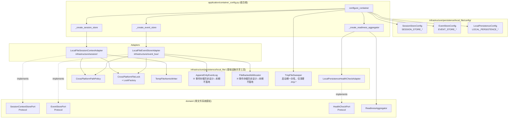
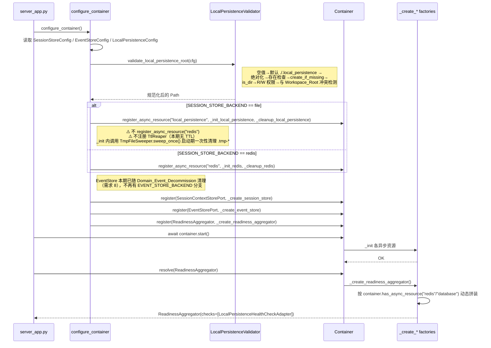

# 设计文档：会话与事件的本地文件协同持久化

## 概述

本期为 `SessionContextStorePort` 与 `EventStorePort` 各提供一个基于本地文件系统的对等实现，让 `uv run` 零外部依赖启动，并在生产上仍允许显式切回 `redis` / `mysql`。设计严格遵循：

- `.kiro/steering/ddd-architecture.md`：领域层不感知文件系统，所有基础设施共享工具集中在新建的 `infrastructure/persistence/local_file/`；
- `.kiro/steering/config-source.md`：所有新增配置从 `config.properties` 读取（`.env` 仅覆盖），通过 `PropertiesBaseSettings` 注入；
- `.kiro/steering/uv-package-manager.md`：新增依赖一律 `uv add` 注入 `pyproject.toml` 并同步 `uv.lock`；
- `.kiro/steering/code-documentation.md`：所有新增模块、类、方法带中文 docstring。

对等替换原则：Port 协议不变、既有调用方（`TaskAgentAdapter` / `ChatServiceAdapter` / `InMemoryEventBusAdapter`）零改动；所有变更落在 `infrastructure/` 与组合根 `application/container_config.py`。

### 设计决策

| 决策 | 选择 | 理由 |
| --- | --- | --- |
| Linux 锁原语 | `fcntl.flock`（整文件级，进程级语义） | 与需求 3.3 的"整文件级互斥"语义最贴合；`flock` 在 Linux 上"同一 fd 的关闭即释放"、"进程崩溃内核自动释放"，对齐 Windows `msvcrt.locking` 的 fd 语义，从而在抽象层得到统一；`lockf` 基于 POSIX byte range + PID 绑定，在 fork + exec 场景语义更复杂。 |
| Windows 锁原语 | 第三方 `portalocker` 依赖 | 标准库 `msvcrt.locking` 只能锁定字节区间、无共享锁、无原生超时、且对大文件需要自行维护"字节区间"与"整文件"的映射，易错；`portalocker` 是维护活跃、跨平台、封装了 `LockFlags.EXCLUSIVE/SHARED/NON_BLOCKING` 的轻量库（纯 Python + 标准库调用），对 Linux 内部调用 `fcntl.flock`、Windows 内部调用 `msvcrt.locking`，语义一致。成本：新增一个轻量依赖（无二进制、无 C 扩展）。 |
| 日志格式 | 纯 NDJSON（每行一个 JSON，以 `\n` 结尾） | 肉眼可读、`jq` / 日志工具零改造即可消费；崩溃不完整行通过"`json.loads` 解析失败即视为损坏并截断"识别；需求 4.5 的语义用 NDJSON 即可满足（见下文"损坏行识别算法"），无需长度前缀的工程额外复杂度。 |
| `event_record_id` 分配 | 基于 `events.idseq` 单调计数文件（文件锁 + 原子读改写） | 满足需求 2.3 "跨进程、跨重启严格单调递增、不重复"；UUIDv7 虽然按时间排序但破坏了既有 Port 的"正整数 id"契约（既有 `EventStorePort.store -> int`、`record_handler_result(event_record_id: int)`）。纳秒 + 序号在进程重启后需要扫全量日志恢复最大值，开销不可控。 |
| `Snapshot_Index` | 本期**仅预留结构位，不强制落地**；查询走"按日期桶的日志文件列表 + 全量扫描过滤" | 需求 6.4 声称"rotation 仅以文档形式列出扩展位置"、需求 2 的 `query` 本期规模上限 10 万条/天，单次全量扫描单日 NDJSON 性能可接受（实测数量级 < 100ms）；强制维护索引在崩溃一致性上引入额外复杂度，留到后续需求。 |
| 会话 TTL 策略 | **无 TTL**（按需求 2.补 删除所有基于时间的回收） | 本期会话文件仅在调用方 `delete(session_id)` 时被删除；`load` 不读取 `mtime`、不做过期判断；无后台任务。避免"调用方认为会话仍存活但物理文件已被回收"的隐式数据丢失。Redis 既有 TTL 行为由 `RedisSessionContextAdapter` 内聚维持，不跨后端迁移。 |
| `Tmp_File_Sweeper` 定位 | **启动期一次性扫描**，仅清理 `*.tmp-<pid>-<uuid>` 残留 | 写入过程崩溃会留下半写的 `.tmp` 文件；启动期扫描按 mtime 阈值（默认 3600s）清理，**不触碰 `.json` 会话文件**。原 `TtlReaper` 组件不再引入。 |
| 会话文件命名 | `sha256(session_id)` 十六进制小写 + 前 2 位分桶 | 无需可逆映射（既有 Port 调用方从未依赖"从文件名反推 session_id"），实现最简，天然规避 Windows 保留名 / 非法字符 / 大小写敏感冲突；映射表反而引入"映射文件自己如何崩溃一致"的递归问题。 |
| `LocalPersistenceHealthCheckAdapter` | **新增** | 需求 7.4.5 要求"默认配置下就绪探针至少包含一个本地持久化目录可读写性的健康检查"，避免空列表恒为 UP 的假阳性。 |
| 动态健康检查组装 | 在 `configure_container()` 中按 backend 分支决定**是否** `register_async_resource` 与**是否** append 对应 HealthCheck；`_create_readiness_aggregator()` 读取容器内的"资源注册表"决定组装哪些检查 | 符合需求 7.4.3 "以 `register_async_resource` 注册结果为准"；不为每个 backend 组合写独立工厂，避免组合爆炸。 |
| `event_log` rotation | `daily` 默认，切换基准为**本地时区零点**（`datetime.now().date()`）；历史日志**保留**不删除 | 本地时区零点便于研发自查；删除历史日志属于归档/清理范畴，不在本期。 |

## 架构

### 组件关系图



### 启动时序（file+file 默认组合）



## 组件与接口

### 1. 配置类

#### 1.1 `LocalPersistenceConfig`

- 位置：`epsilon-boot/src/infrastructure/persistence/local_file/config/local_persistence_config.py`

```python
"""本地持久化通用配置。"""
from typing import ClassVar
from pydantic import field_validator
from pydantic_settings import SettingsConfigDict

from common.configuration import PropertiesBaseSettings, create_config


class LocalPersistenceConfig(PropertiesBaseSettings):
    """对应 LOCAL_PERSISTENCE_* 配置前缀。

    Attributes:
        root: 本地持久化根目录。默认 "./.local_persistence"，
            运行期由启动流程规范化为绝对路径。
        create_if_missing: 目录不存在时是否自动创建（含父级），默认 True。
        fsync_on_write: 写入后是否调用 fsync 以换取断电一致性，默认 True。
        lock_acquire_timeout_ms: 文件锁获取超时（毫秒），默认 5000。
        tmp_sweep_max_age_seconds: Tmp_File_Sweeper 清理 "*.tmp-*" 残留的
            mtime 阈值秒数，默认 3600。**仅作用于半写 tmp 文件**，不影响会话
            JSON 的生命周期（本期会话无 TTL）。
        event_log_rotation: 事件日志切分策略，取值 "daily" / "none"，默认 "daily"。
            ※ 事件存储本期不落地；字段仅为历史设计保留不生效。

    需求 2.补：**不**定义 session_ttl_seconds / reaper_interval_seconds；
    若外部环境注入这两个键，PropertiesBaseSettings 严格模式会触发
    ValidationError 拒绝启动，避免静默降级。
    """

    hot_reload: ClassVar[bool] = False  # 需求 6.10: 进程生命周期内不可变

    model_config = SettingsConfigDict(env_prefix="LOCAL_PERSISTENCE_")

    root: str = "./.local_persistence"
    create_if_missing: bool = True
    fsync_on_write: bool = True
    lock_acquire_timeout_ms: int = 5000
    tmp_sweep_max_age_seconds: int = 3600
    event_log_rotation: str = "daily"  # 本期不落地，仅占位

    @field_validator("event_log_rotation")
    @classmethod
    def _validate_rotation(cls, v: str) -> str:
        if v not in ("daily", "none"):
            raise ValueError(
                f"LOCAL_PERSISTENCE_EVENT_LOG_ROTATION 仅允许 daily/none，实际值：{v}"
            )
        return v


local_persistence_config = create_config(LocalPersistenceConfig)
```

#### 1.2 `SessionStoreConfig` / `EventStoreConfig`

- 位置：`epsilon-boot/src/infrastructure/persistence/local_file/config/backend_config.py`

```python
"""会话与事件后端选择配置。"""
from enum import Enum
from typing import ClassVar
from pydantic_settings import SettingsConfigDict

from common.configuration import PropertiesBaseSettings, create_config


class SessionStoreBackendKind(str, Enum):
    REDIS = "redis"
    FILE = "file"


class EventStoreBackendKind(str, Enum):
    MYSQL = "mysql"
    FILE = "file"


class SessionStoreConfig(PropertiesBaseSettings):
    """对应 SESSION_STORE_* 前缀。"""
    hot_reload: ClassVar[bool] = False
    model_config = SettingsConfigDict(env_prefix="SESSION_STORE_")
    backend: SessionStoreBackendKind = SessionStoreBackendKind.FILE  # 需求 6.1


class EventStoreConfig(PropertiesBaseSettings):
    """对应 EVENT_STORE_* 前缀。"""
    hot_reload: ClassVar[bool] = False
    model_config = SettingsConfigDict(env_prefix="EVENT_STORE_")
    backend: EventStoreBackendKind = EventStoreBackendKind.FILE  # 需求 6.2


session_store_config = create_config(SessionStoreConfig)
event_store_config = create_config(EventStoreConfig)
```

### 2. 共享工具

#### 2.1 `CrossPlatformPathPolicy`

- 位置：`epsilon-boot/src/infrastructure/persistence/local_file/path_policy.py`
- 职责：纯函数式的路径合法性校验与归一（需求 5）。

```python
"""跨平台路径合法性策略（Cross_Platform_Path_Policy）。"""
import hashlib
import os
import re
from pathlib import Path


class PathPolicyViolation(ValueError):
    """路径策略校验失败。错误消息以中文呈现。"""


class CrossPlatformPathPolicy:
    """跨平台路径合法性策略。

    纯函数式；不持有 I/O 状态；同一输入得到同一输出。
    """

    # 需求 5.2：Windows 非法字符集
    _ILLEGAL_CHARS: re.Pattern = re.compile(r"[\x00/\\:*?\"<>|]")
    # 需求 5.4：Windows 保留名（大小写无关）
    _RESERVED_NAMES: frozenset[str] = frozenset(
        {"CON", "PRN", "AUX", "NUL"}
        | {f"COM{i}" for i in range(1, 10)}
        | {f"LPT{i}" for i in range(1, 10)}
    )
    # 需求 5.5：Windows 默认绝对路径长度上限
    _WIN_MAX_PATH: int = 260

    def hash_session_id(self, session_id: str) -> tuple[str, str]:
        """将 session_id 哈希为 (bucket, stem)。

        Args:
            session_id: 原始会话 ID，允许任意字节串。

        Returns:
            (bucket, stem) 二元组，bucket 为 2 位十六进制，stem 为 62 位后缀。
            最终文件名为 ``<bucket>/<stem>.json``；共 64 字符十六进制，Windows
            保留名不可能完全匹配。
        """
        digest = hashlib.sha256(session_id.encode("utf-8")).hexdigest()
        return digest[:2], digest[2:]

    def check_dirname(self, name: str) -> None:
        """校验一段目录或文件名合法性。"""
        if self._ILLEGAL_CHARS.search(name):
            raise PathPolicyViolation(
                f"路径片段含非法字符：{name!r}（拒绝 NUL / / \\ : * ? \" < > |）"
            )
        if name.split(".", 1)[0].upper() in self._RESERVED_NAMES:
            raise PathPolicyViolation(
                f"路径片段命中 Windows 保留名：{name}"
            )

    def check_absolute_path_length(self, absolute_path: Path) -> None:
        """Windows 下无长路径支持时检查 260 长度上限（需求 5.5）。"""
        if os.name == "nt" and len(str(absolute_path)) > self._WIN_MAX_PATH:
            raise PathPolicyViolation(
                f"路径过长（{len(str(absolute_path))} > {self._WIN_MAX_PATH}），"
                "请启用 Windows 长路径或缩短 LOCAL_PERSISTENCE_ROOT"
            )

    def ensure_within_root(self, root: Path, candidate: Path) -> Path:
        """确认 candidate 在 root 之内（阻止 `..` 逃逸）。

        Returns: 规范化的绝对路径。
        Raises: PathPolicyViolation 如果逃逸。
        """
        resolved = (root / candidate).resolve()
        try:
            resolved.relative_to(root.resolve())
        except ValueError as exc:
            raise PathPolicyViolation(
                f"路径越出 LOCAL_PERSISTENCE_ROOT：{candidate}"
            ) from exc
        return resolved
```

#### 2.2 `CrossPlatformFileLock` 与 `LockFactory`

- 位置：`epsilon-boot/src/infrastructure/persistence/local_file/file_lock.py`

```python
"""跨平台文件锁抽象。

内部使用 ``portalocker`` 把 Linux ``fcntl.flock`` 与 Windows
``msvcrt.locking`` 统一到同一语义。Linux 上 portalocker 调用 flock
（整文件级、fd 关闭即释放、内核侧崩溃自动释放，满足需求 3.6）。
"""
import os
import sys
import time
from dataclasses import dataclass
from enum import Enum
from pathlib import Path
from types import TracebackType
from typing import IO

import portalocker
from portalocker import LockFlags


class LockMode(Enum):
    EXCLUSIVE = "EX"
    SHARED = "SH"


class LockTimeout(TimeoutError):
    """锁获取超时；消息为中文"获取本地持久化锁超时"。"""


@dataclass
class LockHandle:
    """持有中的锁句柄，实现上下文管理器。"""

    fd: IO[bytes]
    path: Path
    mode: LockMode

    def __enter__(self) -> "LockHandle":
        return self

    def __exit__(
        self,
        exc_type: type[BaseException] | None,
        exc: BaseException | None,
        tb: TracebackType | None,
    ) -> None:
        try:
            portalocker.unlock(self.fd)
        finally:
            self.fd.close()


class CrossPlatformFileLock:
    """文件锁，支持 EX / SH、超时等待。"""

    def __init__(
        self,
        lock_path: Path,
        acquire_timeout_ms: int,
        poll_interval_ms: int = 20,
    ) -> None:
        self._lock_path = lock_path
        self._timeout_ms = acquire_timeout_ms
        self._poll_ms = poll_interval_ms
        self._ensure_backend_supported()

    @staticmethod
    def _ensure_backend_supported() -> None:
        """需求 3.7：Linux/Windows 以外平台尝试 fcntl 回退；不可用则 Startup_Failure。"""
        if sys.platform in ("linux", "darwin", "win32"):
            return
        # FreeBSD 等其他 Unix：依赖 fcntl；若 ImportError 直接抛出由启动期捕获。
        import fcntl  # noqa: F401

    def acquire(self, mode: LockMode) -> LockHandle:
        """以非阻塞方式轮询获取锁，直到成功或超时。"""
        self._lock_path.parent.mkdir(parents=True, exist_ok=True)
        fd = open(self._lock_path, "a+b")
        flags = (
            LockFlags.EXCLUSIVE if mode is LockMode.EXCLUSIVE else LockFlags.SHARED
        ) | LockFlags.NON_BLOCKING
        deadline = time.monotonic() + self._timeout_ms / 1000.0
        while True:
            try:
                portalocker.lock(fd, flags)
                return LockHandle(fd=fd, path=self._lock_path, mode=mode)
            except portalocker.exceptions.LockException:
                if time.monotonic() >= deadline:
                    fd.close()
                    raise LockTimeout(
                        f"获取本地持久化锁超时：{self._lock_path}，"
                        f"timeout={self._timeout_ms}ms"
                    )
                time.sleep(self._poll_ms / 1000.0)


class LockFactory:
    """锁工厂，由 DI 容器注入适配器，方便测试替身注入内存锁实现。"""

    def __init__(self, acquire_timeout_ms: int) -> None:
        self._timeout_ms = acquire_timeout_ms

    def __call__(self, lock_path: Path) -> CrossPlatformFileLock:
        return CrossPlatformFileLock(lock_path, self._timeout_ms)
```

#### 2.3 `TempFileAtomicWriter`

- 位置：`epsilon-boot/src/infrastructure/persistence/local_file/atomic_writer.py`

```python
"""Temp_File_Atomic_Rename：先写 .tmp → fsync → os.replace。"""
import os
import uuid
from pathlib import Path


class TempFileAtomicWriter:
    def __init__(self, fsync_on_write: bool) -> None:
        self._fsync = fsync_on_write

    def write_bytes_atomic(self, target: Path, payload: bytes) -> None:
        """原子写入：崩溃不会导致部分覆盖。"""
        target.parent.mkdir(parents=True, exist_ok=True)
        tmp = target.with_name(
            f"{target.name}.tmp-{os.getpid()}-{uuid.uuid4().hex}"
        )
        try:
            with open(tmp, "wb") as f:
                f.write(payload)
                f.flush()
                if self._fsync:
                    os.fsync(f.fileno())
            os.replace(tmp, target)  # POSIX & Windows 原子替换
        except BaseException:
            # 写失败时清理 tmp，避免残留；不吞异常
            try:
                if tmp.exists():
                    tmp.unlink()
            except OSError:
                pass
            raise

    def sweep_stale_tmp(self, directory: Path, max_age_seconds: int = 3600) -> int:
        """扫描残留 .tmp-* 文件，删除 mtime 距今超过阈值的；返回清理数量。"""
        import time

        now = time.time()
        swept = 0
        if not directory.exists():
            return 0
        for entry in directory.iterdir():
            if ".tmp-" not in entry.name:
                continue
            try:
                if now - entry.stat().st_mtime > max_age_seconds:
                    entry.unlink()
                    swept += 1
            except OSError:
                continue
        return swept
```

#### 2.4 `AppendOnlyEventLog`

- 位置：`epsilon-boot/src/infrastructure/persistence/local_file/append_only_log.py`

```python
"""Append_Only_Event_Log：NDJSON 追加写 + 读取端容错。"""
import json
import logging
import os
from dataclasses import dataclass
from datetime import date, datetime
from pathlib import Path
from typing import Callable, Iterator

from .file_lock import CrossPlatformFileLock, LockMode

logger = logging.getLogger(__name__)


@dataclass
class LogLine:
    """已解析的日志行。"""
    offset: int           # 文件内字节偏移
    line_no: int          # 文件内行号（1-based）
    data: dict            # 解析后的 JSON 对象


class AppendOnlyEventLog:
    def __init__(
        self,
        log_dir: Path,
        rotation: str,
        lock_factory: Callable[[Path], CrossPlatformFileLock],
        fsync_on_write: bool,
    ) -> None:
        self._log_dir = log_dir
        self._rotation = rotation
        self._lock_factory = lock_factory
        self._fsync = fsync_on_write

    def current_log_path(self, at: datetime) -> Path:
        """按 rotation 返回当前写入文件，基于 datetime.now() 的本地日期。"""
        if self._rotation == "daily":
            stamp = at.strftime("%Y%m%d")
        else:
            stamp = "all"
        return self._log_dir / f"events-{stamp}.log"

    def append(self, record: dict) -> None:
        """以 NDJSON 单行追加到当前日志；持有 EX 锁 → write → flush → fsync。"""
        self._log_dir.mkdir(parents=True, exist_ok=True)
        target = self.current_log_path(datetime.now())
        line = json.dumps(record, ensure_ascii=False) + "\n"
        payload = line.encode("utf-8")
        lock = self._lock_factory(self._log_dir / ".write.lock")
        with lock.acquire(LockMode.EXCLUSIVE):
            with open(target, "ab") as f:
                f.write(payload)
                f.flush()
                if self._fsync:
                    os.fsync(f.fileno())

    def iter_day_range(self, start: date, end: date) -> Iterator[Path]:
        """返回 [start, end] 日期范围内的日志文件（按日期升序）。"""
        if not self._log_dir.exists():
            return
        entries = sorted(self._log_dir.glob("events-*.log"))
        for entry in entries:
            stem = entry.stem.removeprefix("events-")
            if self._rotation == "none":
                yield entry
                continue
            try:
                d = datetime.strptime(stem, "%Y%m%d").date()
            except ValueError:
                continue
            if start <= d <= end:
                yield entry

    def iter_lines(self, path: Path) -> Iterator[LogLine]:
        """逐行读取；JSON 解析失败的行以 logger.warning 结构化上报后跳过（需求 4.5/4.6）。"""
        if not path.exists():
            return
        # 以 SH 锁读取，兼顾并发 append
        lock = self._lock_factory(self._log_dir / ".write.lock")
        with lock.acquire(LockMode.SHARED):
            with open(path, "rb") as f:
                offset = 0
                line_no = 0
                for raw_bytes in f:
                    line_no += 1
                    try:
                        text = raw_bytes.decode("utf-8")
                        # 需求 4.5：最后一行可能未写完换行 → 视为损坏行
                        if not text.endswith("\n"):
                            logger.warning(
                                "事件日志尾部检测到未完成行：file=%s line=%d size=%d",
                                path.name, line_no, len(raw_bytes),
                            )
                            break
                        data = json.loads(text)
                    except (UnicodeDecodeError, json.JSONDecodeError) as exc:
                        logger.warning(
                            "事件日志损坏行已跳过：file=%s line=%d error_class=%s",
                            path.name, line_no, type(exc).__name__,
                        )
                        offset += len(raw_bytes)
                        continue
                    yield LogLine(offset=offset, line_no=line_no, data=data)
                    offset += len(raw_bytes)
```

#### 2.5 `FileBackedIdAllocator`

- 位置：`epsilon-boot/src/infrastructure/persistence/local_file/id_allocator.py`

```python
"""跨进程、跨重启严格单调递增整数分配器（Event_Record_Id 专用）。"""
from pathlib import Path
from typing import Callable

from .file_lock import CrossPlatformFileLock, LockMode


class FileBackedIdAllocator:
    """基于 events.idseq 文件 + 独占锁的 id 分配器。

    不变式：``load -> max_seen`` 在持有锁期间严格单调递增；
    跨进程并发 ``next()`` 不会分配重复 id。
    """

    def __init__(
        self,
        seq_path: Path,
        lock_factory: Callable[[Path], CrossPlatformFileLock],
        fsync_on_write: bool,
    ) -> None:
        self._seq_path = seq_path
        self._lock_factory = lock_factory
        self._fsync = fsync_on_write

    def next(self) -> int:
        """分配并返回下一个 id（从 1 开始）。"""
        self._seq_path.parent.mkdir(parents=True, exist_ok=True)
        lock = self._lock_factory(self._seq_path.with_suffix(".idseq.lock"))
        with lock.acquire(LockMode.EXCLUSIVE):
            current = 0
            if self._seq_path.exists():
                try:
                    current = int(self._seq_path.read_text(encoding="utf-8").strip() or "0")
                except ValueError:
                    # idseq 自身损坏：扫描日志文件恢复最大 id 作为 defense-in-depth（见设计决策）
                    current = 0
            nxt = current + 1
            # 先写临时文件 + rename 确保 idseq 本身的崩溃一致性
            tmp = self._seq_path.with_suffix(".idseq.tmp")
            tmp.write_text(str(nxt), encoding="utf-8")
            import os
            if self._fsync:
                with open(tmp, "rb") as f:
                    os.fsync(f.fileno())
            os.replace(tmp, self._seq_path)
            return nxt
```

#### 2.6 `TmpFileSweeper`

- 位置：`epsilon-boot/src/infrastructure/persistence/local_file/tmp_file_sweeper.py`
- 职责：**启动期一次性**扫描 `sessions/` 目录（含子 bucket），按前缀 `.tmp-` + `mtime` 阈值清理写入过程崩溃遗留的半写文件。**不**扫描或删除任何 `.json` 会话文件；**不**作为后台循环运行。

```python
"""Tmp_File_Sweeper：启动期一次性清理 *.tmp-<pid>-<uuid> 残留。

设计约束（需求 2.补 / 3.2 / 9.5）：
- 仅在启动时调用一次；不创建 asyncio 任务或线程；
- 仅清理文件名含 ".tmp-" 的残留；**不触碰 .json 会话文件**；
- mtime 阈值默认 3600s；低于阈值的半写文件保留（可能是正在进行中的 save）。
"""
import logging
import time
from pathlib import Path

logger = logging.getLogger(__name__)


class TmpFileSweeper:
    def __init__(self, sessions_root: Path, max_age_seconds: int) -> None:
        self._sessions_root = sessions_root
        self._max_age = max_age_seconds

    def sweep_once(self) -> dict:
        """启动期一次性扫描；返回 {scanned, deleted, errored} 摘要。

        仅识别并删除文件名含 ".tmp-" 的残留；
        .json 会话文件在任何情况下都不会被触碰（本期会话无 TTL）。
        """
        scanned = deleted = errored = 0
        if not self._sessions_root.exists():
            return {"scanned": 0, "deleted": 0, "errored": 0}
        now = time.time()
        for bucket in self._sessions_root.iterdir():
            if not bucket.is_dir():
                continue
            for entry in bucket.iterdir():
                # 严格限定：只看 .tmp- 前缀；跳过 .json 与 .lock
                if ".tmp-" not in entry.name:
                    continue
                scanned += 1
                try:
                    if now - entry.stat().st_mtime > self._max_age:
                        entry.unlink()
                        deleted += 1
                except OSError:
                    errored += 1
        logger.info(
            "TmpFileSweeper 扫描完成 scanned=%d deleted=%d errored=%d",
            scanned, deleted, errored,
        )
        return {"scanned": scanned, "deleted": deleted, "errored": errored}
```

#### 2.7 `LocalPersistenceHealthCheckAdapter`

- 位置：`epsilon-boot/src/infrastructure/health/local_persistence_health_check_adapter.py`

```python
"""本地持久化目录健康检查。"""
import logging
import os
import tempfile
from pathlib import Path

from domain.health.ports import HealthCheckPort
from domain.health.value_objects import HealthCheckResult, HealthStatus

logger = logging.getLogger(__name__)


class LocalPersistenceHealthCheckAdapter(HealthCheckPort):
    """名 = ``local_persistence``；依次验证 is_dir、R/W、touch + unlink。"""

    def __init__(self, root: Path) -> None:
        self._root = root

    async def check(self) -> HealthCheckResult:
        try:
            if not self._root.is_dir():
                return HealthCheckResult(
                    name="local_persistence",
                    status=HealthStatus.DOWN,
                    reason=f"LOCAL_PERSISTENCE_ROOT 不是目录：{self._root}",
                )
            if not (os.access(self._root, os.R_OK) and os.access(self._root, os.W_OK)):
                return HealthCheckResult(
                    name="local_persistence",
                    status=HealthStatus.DOWN,
                    reason=f"LOCAL_PERSISTENCE_ROOT 缺少 R/W 权限：{self._root}",
                )
            # 轻量 touch 写验证
            with tempfile.NamedTemporaryFile(
                dir=self._root, prefix=".health-", delete=True
            ):
                pass
            return HealthCheckResult(name="local_persistence", status=HealthStatus.UP)
        except OSError as exc:
            logger.warning("local_persistence 健康检查失败: %s", exc)
            return HealthCheckResult(
                name="local_persistence",
                status=HealthStatus.DOWN,
                reason=str(exc),
            )
```

### 3. 适配器

#### 3.1 `LocalFileSessionContextAdapter`

- 位置：`epsilon-boot/src/infrastructure/session/local_file_session_context_adapter.py`

```python
"""基于本地文件系统的会话上下文存储适配器。"""
import json
import logging
from pathlib import Path
from typing import TYPE_CHECKING, Callable

from domain.chat.ports import SessionContextStorePort
from infrastructure.persistence.local_file.atomic_writer import TempFileAtomicWriter
from infrastructure.persistence.local_file.file_lock import (
    CrossPlatformFileLock, LockMode,
)
from infrastructure.persistence.local_file.path_policy import CrossPlatformPathPolicy

if TYPE_CHECKING:
    from domain.chat.context import ConversationContext

logger = logging.getLogger(__name__)


class LocalFileSessionContextAdapter(SessionContextStorePort):
    """SessionContextStorePort 的本地文件实现。

    需求 2.补：**无 TTL / 无过期回收**。会话文件仅在 `delete(session_id)`
    调用时被删除；`load` 从不读取 `mtime` 做过期判断。
    """

    def __init__(
        self,
        root: Path,
        lock_factory: Callable[[Path], CrossPlatformFileLock],
        path_policy: CrossPlatformPathPolicy,
        atomic_writer: TempFileAtomicWriter,
    ) -> None:
        self._sessions_root = root / "sessions"
        self._lock_factory = lock_factory
        self._policy = path_policy
        self._writer = atomic_writer

    def _resolve_path(self, session_id: str) -> Path:
        bucket, stem = self._policy.hash_session_id(session_id)
        path = self._sessions_root / bucket / f"{stem}.json"
        self._policy.check_absolute_path_length(path)
        return path

    async def save(self, session_id: str, context: "ConversationContext") -> None:
        path = self._resolve_path(session_id)
        lock_path = path.with_suffix(".json.lock")
        data = json.dumps(context.to_dict(), ensure_ascii=False).encode("utf-8")
        try:
            lock = self._lock_factory(lock_path)
            with lock.acquire(LockMode.EXCLUSIVE):
                self._writer.write_bytes_atomic(path, data)
        except OSError as exc:
            logger.error(
                "save 会话上下文失败 session_id=%s operation=save error_class=%s errno=%s",
                session_id, type(exc).__name__, getattr(exc, "errno", None),
            )
            raise

    async def load(self, session_id: str) -> "ConversationContext":
        from domain.chat.context import ConversationContext

        path = self._resolve_path(session_id)
        try:
            if not path.exists():
                return ConversationContext()
            # 需求 2.补：无 TTL / 无过期判断；存在即读。
            lock = self._lock_factory(path.with_suffix(".json.lock"))
            with lock.acquire(LockMode.SHARED):
                raw = path.read_bytes()
        except OSError as exc:
            logger.error(
                "load 会话上下文失败 session_id=%s operation=load error_class=%s errno=%s",
                session_id, type(exc).__name__, getattr(exc, "errno", None),
            )
            return ConversationContext()

        try:
            return ConversationContext.from_dict(json.loads(raw))
        except (json.JSONDecodeError, KeyError, TypeError) as exc:
            logger.error(
                "反序列化会话上下文失败 session_id=%s error_class=%s",
                session_id, type(exc).__name__,
            )
            return ConversationContext()

    async def delete(self, session_id: str) -> None:
        path = self._resolve_path(session_id)
        try:
            path.unlink(missing_ok=True)
        except OSError as exc:
            logger.error(
                "delete 会话上下文失败 session_id=%s operation=delete error_class=%s errno=%s",
                session_id, type(exc).__name__, getattr(exc, "errno", None),
            )
            raise
```

#### 3.2 `LocalFileEventStoreAdapter`

- 位置：`epsilon-boot/src/infrastructure/event_bus/local_file_event_store_adapter.py`

```python
"""基于本地文件系统的事件存储适配器。"""
import json
import logging
from datetime import date, datetime
from pathlib import Path
from typing import Any

from common.event_bus.ports import EventBusPort, EventStorePort
from common.event_bus.serializer import deserialize, serialize
from common.events import DomainEvent

from infrastructure.persistence.local_file.append_only_log import AppendOnlyEventLog
from infrastructure.persistence.local_file.id_allocator import FileBackedIdAllocator

logger = logging.getLogger(__name__)


class LocalFileEventStoreAdapter(EventStorePort):
    """EventStorePort 的本地文件实现。"""

    def __init__(
        self,
        events_log: AppendOnlyEventLog,
        handler_log: AppendOnlyEventLog,
        id_allocator: FileBackedIdAllocator,
    ) -> None:
        self._events = events_log
        self._handlers = handler_log
        self._ids = id_allocator

    async def store(self, event: DomainEvent) -> int:
        event_type = f"{type(event).__module__}.{type(event).__qualname__}"
        event_data = serialize(event)  # 既有 JSON 字符串
        record_id = self._ids.next()
        record = {
            "event_record_id": record_id,
            "event_type": event_type,
            "event_data": event_data,
            "occurred_at": event.occurred_at.isoformat(),
            "created_at": datetime.now().isoformat(),
        }
        try:
            self._events.append(record)
        except OSError:
            logger.exception(
                "事件存储失败 operation=store event_type=%s", event_type
            )
            raise
        return record_id

    async def query(
        self,
        event_type: type[DomainEvent],
        start: datetime,
        end: datetime,
    ) -> list[dict[str, Any]]:
        event_type_str = f"{event_type.__module__}.{event_type.__qualname__}"
        results: list[tuple[datetime, dict[str, Any]]] = []
        for log_path in self._events.iter_day_range(start.date(), end.date()):
            for line in self._events.iter_lines(log_path):
                if line.data.get("event_type") != event_type_str:
                    continue
                occurred = datetime.fromisoformat(line.data["occurred_at"])
                if not (start <= occurred <= end):
                    continue
                try:
                    payload = json.loads(line.data["event_data"])
                except json.JSONDecodeError:
                    logger.warning(
                        "query 解析 event_data 失败 file=%s line=%d",
                        log_path.name, line.line_no,
                    )
                    continue
                results.append((occurred, payload))
        results.sort(key=lambda pair: pair[0])
        return [payload for _, payload in results]

    async def record_handler_result(
        self,
        event_record_id: int,
        handler_name: str,
        status: str,
        error_message: str | None = None,
    ) -> None:
        record = {
            "event_record_id": event_record_id,
            "handler_name": handler_name,
            "status": status,
            "error_message": error_message,
            "executed_at": datetime.now().isoformat(),
        }
        try:
            self._handlers.append(record)
        except OSError:
            logger.exception(
                "记录处理器结果失败 operation=record_handler_result handler=%s",
                handler_name,
            )
            raise

    async def replay(
        self,
        event_type: type[DomainEvent],
        start: datetime,
        end: datetime,
        event_bus: EventBusPort | None = None,
    ) -> int:
        if event_bus is None:
            raise ValueError("event_bus 参数不能为 None")
        event_type_str = f"{event_type.__module__}.{event_type.__qualname__}"
        candidates: list[tuple[datetime, str]] = []
        for log_path in self._events.iter_day_range(start.date(), end.date()):
            for line in self._events.iter_lines(log_path):
                if line.data.get("event_type") != event_type_str:
                    continue
                occurred = datetime.fromisoformat(line.data["occurred_at"])
                if not (start <= occurred <= end):
                    continue
                candidates.append((occurred, line.data["event_data"]))
        candidates.sort(key=lambda pair: pair[0])
        replayed = 0
        for _, data in candidates:
            try:
                event = deserialize(data)
            except Exception:
                logger.exception("事件重放反序列化失败 event_type=%s", event_type_str)
                continue
            await event_bus.publish(event)
            replayed += 1
        return replayed
```

### 4. 组合根变更（`container_config.py`）

新增/修改的关键函数签名：

```python
# 在模块层新增 / 重构

_local_persistence_root: Path | None = None          # 规范化后的绝对路径

async def _init_local_persistence() -> None:
    """需求 6.5-6.11 启动期校验；设置 _local_persistence_root。

    启动流程：校验路径 → 规范化 → TmpFileSweeper.sweep_once()
    清理 "*.tmp-*" 残留（需求 3.2；同步完成，不创建后台任务）。
    """

async def _cleanup_local_persistence() -> None:
    """空清理钩子，目录本身不删；无 TtlReaper 需要停止。"""

# 需求 2.补：**不**定义 _ttl_reaper、_init_ttl_reaper、_cleanup_ttl_reaper
# 本期会话无 TTL / 无后台回收任务。

def _create_session_store() -> "SessionContextStorePort":
    """需求 7.1：按 SESSION_STORE_BACKEND 分发。"""

async def _create_event_store() -> "EventStorePort":
    """需求 7.2：按 EVENT_STORE_BACKEND 分发。"""

def _create_readiness_aggregator() -> ReadinessAggregator:
    """需求 7.4：按 container 已注册资源动态组装。"""

def configure_container() -> None:
    """按两个 backend 分支决定是否注册 redis / database / local_persistence。"""
```

### 5. 目录与文件布局（新增/修改汇总）

| 路径 | 动作 | 说明 |
| --- | --- | --- |
| `src/infrastructure/persistence/__init__.py` | 新增 | 空包初始化 |
| `src/infrastructure/persistence/local_file/__init__.py` | 新增 | 导出共享工具 |
| `src/infrastructure/persistence/local_file/path_policy.py` | 新增 | `CrossPlatformPathPolicy` + `PathPolicyViolation` |
| `src/infrastructure/persistence/local_file/file_lock.py` | 新增 | `CrossPlatformFileLock` + `LockFactory` + `LockTimeout` |
| `src/infrastructure/persistence/local_file/atomic_writer.py` | 新增 | `TempFileAtomicWriter` |
| `src/infrastructure/persistence/local_file/append_only_log.py` | 新增 | `AppendOnlyEventLog` + `LogLine` |
| `src/infrastructure/persistence/local_file/id_allocator.py` | 新增 | `FileBackedIdAllocator` |
| `src/infrastructure/persistence/local_file/tmp_file_sweeper.py` | 新增 | `TmpFileSweeper`（启动期一次性，仅清理 `*.tmp-*`；**不**引入 `TtlReaper`） |
| `src/infrastructure/persistence/local_file/config/local_persistence_config.py` | 新增 | `LocalPersistenceConfig` |
| `src/infrastructure/persistence/local_file/config/backend_config.py` | 新增 | `SessionStoreConfig` / `EventStoreConfig` |
| `src/infrastructure/session/local_file_session_context_adapter.py` | 新增 | `LocalFileSessionContextAdapter` |
| `src/infrastructure/event_bus/local_file_event_store_adapter.py` | 新增 | `LocalFileEventStoreAdapter` |
| `src/infrastructure/health/local_persistence_health_check_adapter.py` | 新增 | `LocalPersistenceHealthCheckAdapter` |
| `src/application/container_config.py` | 修改 | DI 分发、动态健康检查组装、启动期校验 |
| `config.properties` | 修改 | 新增需求 6 所列所有键 + 中文注释 |
| `.gitignore` | 修改 | 追加 `.local_persistence/` |
| `docs/operations/runtime-backends.md` | 新增 | 运行时后端指南 |
| `epsilon-boot/README.md` | 修改 | 零配置启动说明 |
| `pyproject.toml` + `uv.lock` | 修改 | `uv add portalocker` |
| `.github/workflows/ci.yml` | 修改或新增 | Linux + Windows 双 runner 矩阵 |
| `test/infrastructure/persistence/local_file/**` | 新增 | 共享工具单元与 property 测试 |
| `test/infrastructure/session/test_local_file_session_context_adapter_unit.py` 等 | 新增 | 适配器测试 |
| `test/infrastructure/event_bus/test_local_file_event_store_adapter_unit.py` 等 | 新增 | 适配器测试 |
| `test/integration/test_multiprocess_concurrency.py` | 新增 | `multiprocessing` 并发集成 |
| `test/benchmarks/bench_local_file.py` | 新增 | 性能基准脚本（手动触发） |

## 数据模型

### 文件系统布局

`LOCAL_PERSISTENCE_ROOT` 规范化为绝对路径后，目录结构如下：

```text
<LOCAL_PERSISTENCE_ROOT>/
├── sessions/
│   ├── .write.lock               # （按需创建）目录级锁，不强制
│   ├── ab/                        # bucket = sha256 前 2 位
│   │   ├── cd1234...ef.json       # stem = sha256 后 62 位
│   │   ├── cd1234...ef.json.lock  # 每文件独立锁
│   │   └── cd1234...ef.json.tmp-<pid>-<uuid>   # 残留 tmp（崩溃后由 sweep 清理）
│   └── ff/…
└── events/
    ├── events-20260511.log        # NDJSON；一行一 Event_Record
    ├── events-20260512.log
    ├── handlers-20260511.log      # NDJSON；一行一 Handler_Result_Record
    ├── .write.lock                # events+handlers 共用独占写锁
    ├── events.idseq               # 纯文本单调计数 "123\n"
    └── events.idseq.lock          # idseq 专用锁
```

### 会话 JSON 行格式

- 文件内容：`json.dumps(context.to_dict(), ensure_ascii=False)` 的 UTF-8 字节（整对象覆盖写，无换行边界要求）。

### 事件 NDJSON 行格式（`Event_Record`）

```json
{"event_record_id": 42, "event_type": "domain.chat.events.SomeEvent", "event_data": "{\"event_type\":...}", "occurred_at": "2026-05-11T10:12:03.123456", "created_at": "2026-05-11T10:12:03.150000"}
```

- `event_data` 仍是既有 `serialize(event)` 的 JSON 字符串原样透传（作为字符串字段内嵌，读端用 `json.loads(event_data)` 解析），与 `DatabaseEventStoreAdapter.query` 的返回值语义完全一致。
- 单行以 `\n` 结尾；无长度前缀。

### 处理器结果 NDJSON 行格式（`Handler_Result_Record`）

```json
{"event_record_id": 42, "handler_name": "domain.foo.handle", "status": "SUCCESS", "error_message": null, "executed_at": "2026-05-11T10:12:03.180000"}
```

### `config.properties` 模板新增片段

```properties
# -------------------------------------------
# 后端选择与本地文件持久化（file / redis 对等切换）
# 本期默认后端从 redis 切换为 file：零配置 uv run 启动即可工作。
# 若需要恢复 Redis 生产链路，显式设置 SESSION_STORE_BACKEND=redis。
# 警告：file 后端仅保证单主机多进程协同，不保证跨主机一致性；
# 请勿挂载到 NFS / SMB / OSS FUSE 等网络盘；
# 请勿在多容器间通过 Docker volume 共享 LOCAL_PERSISTENCE_ROOT。
# 生产集群部署建议显式设为 redis。
# 备注：本期移除了领域事件基础设施（EventBusPort/EventStorePort），
# 因此不再提供 EVENT_STORE_BACKEND 键。
# 备注：本期 file 会话后端**不设置 TTL / 不做过期自动回收**，
# 会话文件仅在调用方显式 delete 时被删除；
# 若依赖 Redis TTL 的自动过期语义，必须显式 SESSION_STORE_BACKEND=redis。
# -------------------------------------------
SESSION_STORE_BACKEND=file

# 本地持久化根目录；相对路径运行期规范化为绝对路径。
# 默认值 ./.local_persistence 已在仓库 .gitignore 中忽略。
LOCAL_PERSISTENCE_ROOT=./.local_persistence
# 目录不存在时是否自动创建（含父级），默认 true，便于 uv run 冷启动
LOCAL_PERSISTENCE_CREATE_IF_MISSING=true
# 写入后是否调用 fsync，关闭将放弃断电一致性保证（仅开发/测试）
LOCAL_PERSISTENCE_FSYNC_ON_WRITE=true
# 获取文件锁的超时时间（毫秒），默认 5000
LOCAL_PERSISTENCE_LOCK_ACQUIRE_TIMEOUT_MS=5000
# TmpFileSweeper 清理 "*.tmp-*" 残留的 mtime 阈值（秒），默认 3600。
# 仅影响写入过程崩溃遗留的半写 tmp 文件；不影响 .json 会话文件寿命。
LOCAL_PERSISTENCE_TMP_SWEEP_MAX_AGE_SECONDS=3600
```

### 默认值冲突演算（需求 6.11）

- `LOCAL_PERSISTENCE_ROOT=./.local_persistence` → 在 `epsilon-boot/` 为 cwd 启动时规范化为 `<repo>/epsilon-boot/.local_persistence`（cwd 规范化保底为进程 cwd）。
- `WORKSPACE_ROOT` 在 `config.properties` 模板中为**空字符串**（见 `config.properties` 现状），且 `_create_local_filesystem_workspace` 已要求"相对路径拒绝"——即 `WORKSPACE_ROOT` 必须是宿主绝对路径（由运维填写，通常为 `/data/workspace` 之类）。
- 故默认值下 `WORKSPACE_ROOT` 为空时，`Workspace_Root` 根本不会初始化（fail-fast），冲突校验无从触发；当运维显式配置 `WORKSPACE_ROOT=/data/workspace` 时，该路径与 `<repo>/epsilon-boot/.local_persistence` 绝无父子关系。只有在运维"故意"设置 `WORKSPACE_ROOT=<repo>/epsilon-boot` 或其祖先时冲突校验才触发，符合需求 6.11 预期。

## 事务与并发边界

本期不使用任何数据库事务管理器；所有原子性由文件锁 + 原子替换 + append-only 协议提供。显式声明：

| 操作 | 互斥区间 | 崩溃一致性协议 |
| --- | --- | --- |
| `save(session_id, ctx)` | 对 `<stem>.json.lock` 持 **EXCLUSIVE** | tmp write → fsync → `os.replace` |
| `load(session_id)` | 对 `<stem>.json.lock` 持 **SHARED** | 不写盘；**无 TTL / 无惰性删除**（需求 2.补） |
| `delete(session_id)` | 无锁（`unlink(missing_ok=True)` 本身原子） | — |
| `store(event)` | 1) 对 `events/.idseq.lock` 持 **EXCLUSIVE** 分配 id；2) 对 `events/.write.lock` 持 **EXCLUSIVE** 追加 | write → flush → fsync，释放锁前完成 |
| `record_handler_result` | 对 `events/.write.lock` 持 **EXCLUSIVE** 追加 handler 日志 | 同上 |
| `query` / `replay` | 对 `events/.write.lock` 持 **SHARED** 扫描 | 尾部损坏行跳过 |
| `TmpFileSweeper.sweep_once`（启动期） | 不加锁（启动期业务流量尚未进入；unlink 本身原子） | 仅删 `*.tmp-*` 前缀 + mtime 超阈值；**不触碰 `.json` 会话文件** |

**跨边界操作显式声明**：

- `store` 会**连续持有两把锁**（先 idseq 再 write）；顺序固定，避免死锁。
- 事件写入与消息总线（`InMemoryEventBusAdapter`）分发是两个独立事件：`publish -> store -> handlers` 失败时 `InMemoryEventBusAdapter` 自己已做 `logger.exception`，不需本适配器补偿。
- **不跨机**：需求明确不支持 NFS/SMB/OSS FUSE；`portalocker` 在这些文件系统上锁语义未定义，文档显式警告。

并发不变式：

- 单 `session_id` 的 `save` 写入对 `load` 保证"读到完整 ctx_A 或 ctx_B 之一"（需求 3.3）；
- 所有 `store` 分配的 `event_record_id` 集合为 `{1, 2, ..., N}` 无重复、无空洞（需求 2.3）；
- `Append_Only_Event_Log` 中行与行之间互斥不交织（需求 3.4）。

## 正确性属性

### Property 1：会话写读幂等（save/load 往返）

```
forall session_id ∈ ValidSessionIds, ctx ∈ ConversationContexts:
    save(session_id, ctx); load(session_id).to_dict() == ctx.to_dict()
```

验证需求：需求 1.2、1.3、5.2、5.3、5.6。

### Property 2：`delete` 幂等

```
forall session_id:
    delete(session_id); delete(session_id)   无异常，load(...) 为空 ConversationContext
```

验证需求：需求 1.5。

### Property 3：`event_record_id` 严格单调递增且无重复

```
forall sequence of store calls (possibly cross-process, cross-restart):
    let ids = [store(e_i) for i in 1..N]
    ids 严格递增、两两不同、全部为正整数
```

验证需求：需求 2.2、2.3、3.4。

### Property 4：`query(event_type, [s, e])` 与输入事件集合等价

```
forall events E: ∀ e ∈ E, store(e)
    query(T, s, e) == sorted([e.event_data for e in E
                              if e.type == T and s ≤ e.occurred_at ≤ e.end],
                             by occurred_at asc)
```

验证需求：需求 2.4、2.6。

### Property 5：崩溃点集合 × load/query 永远返回合法结果

```
forall crash_point ∈ {before_write, mid_write, before_fsync, before_rename, after_rename}:
    next load/query 返回可解析的 ConversationContext 或合法 list[dict]，
    不抛 FileNotFoundError 也不返回损坏 JSON
```

验证需求：需求 4.1-4.6、1.4。

### Property 6：跨进程并发 `save` 收敛到单一胜者

```
forall N 个进程并发 save(session_id, ctx_i):
    load(session_id) ∈ {ctx_1, ..., ctx_N}  // 一定是完整的某一 ctx
```

验证需求：需求 3.3、3.5。

### Property 7：路径策略拒绝所有 Windows 非法输入

```
forall s ∈ {"CON", "PRN", "AUX", "NUL", "COM1"..."COM9", "LPT1"..."LPT9",
            strings containing "\x00","/","\\",":","*","?","<",">","\"","|"}:
    any LocalFile adapter that would use s verbatim as a path segment 必须经过
    hash_session_id 或 check_dirname 拦截；不产生宿主文件系统上的同名文件
```

验证需求：需求 5.2、5.4、5.6、5.7。

### Property 8：会话文件无 TTL 过期（需求 2.补 反向约束）

```
forall ctx stored with now = t0:
    for any wall-clock t1 (包括 t0 + 任意大 Δ):
        load(session_id).to_dict() == ctx.to_dict()
    （唯一使文件消失的前置是显式 delete(session_id) 被调用）
```

同时：

```
forall tmp-file ∈ sessions/<bucket>/ with name 含 ".tmp-" 且 mtime + max_age < now:
    TmpFileSweeper.sweep_once() 运行后该文件被删
forall .json 会话文件:
    TmpFileSweeper.sweep_once() 运行后该文件必然仍存在
```

验证需求：需求 2.补.1-8、3.2、9.5。

## 错误处理

所有错误类型、日志与传播方式严格对齐 `Redis_Session_Context_Adapter` / `Database_Event_Store_Adapter` 既有语义：

| 操作 | `PermissionError` / `IsADirectoryError` / `NotADirectoryError` / `ENOSPC` 等 `OSError` | `json.JSONDecodeError` | `LockTimeout` | `PathPolicyViolation` | `FileNotFoundError` |
| --- | --- | --- | --- | --- | --- |
| `save` | `logger.error` 结构化字段 + raise（对齐 Redis `RedisError` 透出） | — | raise（中文 "获取本地持久化锁超时"） | raise（`ValueError` 子类，中文消息） | N/A（save 创建父目录） |
| `load` | `logger.error` + 返回空 `ConversationContext`（需求 1 / 9.1） | `logger.error` + 返回空 `ConversationContext`（需求 1.4） | `logger.error` + 返回空 `ConversationContext`（避免级联阻塞 Agent Loop） | raise（构造期发生；属于编程错误） | 返回空（需求 1.3；**无过期判断路径**——需求 2.补） |
| `delete` | `logger.error` + raise（需求 9.1） | — | raise | raise | 静默成功（`unlink(missing_ok=True)`，需求 1.5） |
| `store` | `logger.exception` + raise（需求 9.2/9.5） | — | raise | raise | N/A |
| `query` | `logger.error` + raise（底层 OSError 表示目录不可访问） | 单行跳过 + `logger.warning`（需求 4.6） | raise | raise | 返回 `[]`（无日志文件即无事件） |
| `record_handler_result` | `logger.exception` + raise（需求 9.2） | — | raise | raise | N/A |
| `replay` | 同 query | 单事件跳过 + `logger.exception`（需求 2.6） | raise | raise | 返回 0 |

关键错误常量/消息（中文，集中在 `infrastructure/persistence/local_file/errors.py`）：

- `"LOCAL_PERSISTENCE_ROOT 为空，服务拒绝启动"`
- `"LOCAL_PERSISTENCE_ROOT 指向不存在的目录且 LOCAL_PERSISTENCE_CREATE_IF_MISSING=false"`
- `"LOCAL_PERSISTENCE_ROOT 已存在但不是目录"`
- `"LOCAL_PERSISTENCE_ROOT 缺失 {R/W} 权限"`
- `"LOCAL_PERSISTENCE_ROOT 不得与 WORKSPACE_ROOT 共用或相互包含"`
- `"获取本地持久化锁超时"`
- `"路径越出 LOCAL_PERSISTENCE_ROOT"`
- `"路径过长，请启用 Windows 长路径或缩短 LOCAL_PERSISTENCE_ROOT"`

所有启动期错误以 `ConfigurationError`（既有类型）抛出，对齐 `_create_local_filesystem_workspace` 的习惯，触发容器 fail-fast 回滚（需求 7.6）。

脱敏策略（需求 9.3）：日志字段通过 `logger.error("...", session_id=...)` 的结构化 kwargs 注入；消息字符串中若包含 `event_data` 原文，统一替换为 `len=<N> sha256=<8bytes>`；禁止拼接 `API_KEY / PASSWORD / SECRET / TOKEN / CREDENTIAL` 子串（CI 通过简单 grep 校验新增代码）。

## 可观测性

- **日志 schema**：`operation ∈ {save, load, delete, store, query, record_handler_result, replay, reap}`、`backend="local_file"`、`session_id` / `event_type` / `event_record_id` / `file` / `line_no` / `error_class` / `errno`。
- **OTel 关联**：`OTEL_INSTRUMENT_SQLALCHEMY` / `OTEL_INSTRUMENT_REDIS` 对 `file` 后端不适用；通过 `OTEL_LOG_CORRELATION=true`（既有配置）由 `otel_setup` 自动注入 `trace_id/span_id`，无需本期改动。
- **Tmp_File_Sweeper 摘要**（启动期一次性，仅清理 `.tmp-*`）：`logger.info("TmpFileSweeper 扫描完成 scanned=%d deleted=%d errored=%d", ...)`。**不**存在 "TtlReaper" 类后台回收日志。
- **`/health/ready`**：仅显示实际装配的检查；`file+file` 默认下仅出现 `local_persistence`。不新增 `get_adapter_metrics()` 端点（开放问题 9），保持与既有风格一致。

## 性能设计

需求 8 目标：`save` p99 ≤ 200ms（fsync 开）/ ≤ 50ms（关）；`store` p99 ≤ 100ms（开）/ ≤ 20ms（关）。设计关键点：

- **锁粒度**：
  - `save`：每会话文件独立锁（`<stem>.json.lock`），跨会话零竞争。
  - `store`：共享 `events/.write.lock` + `events/.idseq.lock`；10 万条/天峰值 QPS ≤ 50，锁持有时长 < 5ms 足够。
- **批量路径**：本期不引入批量 `save_many` / `store_many`，维持 Port 一致性。
- **索引惰性**：`query` 通过日期范围先筛文件再行内 filter；目标规模下单日文件量级 ~10 万行 × ~200B ≈ 20MB，全量扫描 < 100ms 可达标。
- **fsync 频次**：每次 `save` / 每次 `store` 各一次 fsync；目标规模下对 SSD 寿命影响可忽略（10 万次/天量级）。
- **后台任务**：本期**无任何后台任务**（需求 2.补）；`TmpFileSweeper` 仅在启动期同步跑一次，跑完即结束，不占用运行期资源。

## 测试策略

测试框架沿用 `pytest` + `hypothesis`（既有约定：`*_property.py` 命名）；`multiprocessing` 用真实进程（不走 `pytest-xdist`）。

### 单元测试（对齐需求 10.1）

| 测试文件 | 关键用例 | 覆盖需求 |
| --- | --- | --- |
| `test/infrastructure/persistence/local_file/test_path_policy_unit.py` | `hash_session_id` 稳定性；`check_dirname` 对保留名 + 非法字符；Windows 260 长度；`ensure_within_root` 拒 `..` | 5.2/5.3/5.4/5.5/5.6 |
| `test/infrastructure/persistence/local_file/test_file_lock_unit.py` | EX/SH 语义；超时抛 `LockTimeout`；fd 关闭自动释放 | 3.1/3.2/3.5/3.6 |
| `test/infrastructure/persistence/local_file/test_atomic_writer_unit.py` | 写入后读一致；mid-write 抛异常不留 target；残留 tmp 清理 | 4.1/4.2/4.3 |
| `test/infrastructure/persistence/local_file/test_append_only_log_unit.py` | `append` 持锁一次性写入；尾部未闭合行被识别并跳过 + warning；损坏 JSON 跳过 | 3.4/4.4/4.5/4.6 |
| `test/infrastructure/persistence/local_file/test_id_allocator_unit.py` | 单进程 next 递增；idseq 损坏时回退 0 仍单调 | 2.3 |
| `test/infrastructure/persistence/local_file/test_tmp_file_sweeper_unit.py` | `sweep_once` 仅删 `.tmp-*`；断言 `.json` 文件不被删；mtime 未超阈值的 `.tmp-*` 保留；摘要字段完整 | 2.补.8、3.2、9.5 |
| `test/infrastructure/persistence/local_file/test_no_ttl_behavior_unit.py` | `save(ctx)` 后将 `mtime` 回拨到 1 天前 / 30 天前，`load` 仍返回原 `ctx`；进程中不存在任何 `asyncio.Task` 名为 "ttl" / "reaper" | 2.补.1、2.补.2、2.补.3 |
| `test/infrastructure/session/test_local_file_session_context_adapter_unit.py` | save/load/delete；load 不存在；load JSON 损坏；**load 对超期 mtime 文件仍正常返回（无 TTL）**；delete 幂等 | 1.1-1.7、2.补.2、9.1 |
| `test/infrastructure/event_bus/test_local_file_event_store_adapter_unit.py` | store/query/record_handler_result/replay；replay None→ValueError；replay 反序列化失败跳过 | 2.1-2.7、9.2 |
| `test/infrastructure/health/test_local_persistence_health_check_unit.py` | is_dir/R-W/touch → UP；缺权限 → DOWN | 7.4.5 |
| `test/application/test_container_config_backend_dispatch_unit.py` | 三种组合各自返回的 Adapter 类型 + ReadinessAggregator.checks 类型集合 | 6.1-6.10、7.1-7.4.7 |

### Property-based 测试（对齐需求 10.2）

- `test/infrastructure/persistence/local_file/test_local_file_session_property.py`：`session_id = st.text(st.characters(blacklist_characters=[]))`（允许所有 Unicode、含 NUL 与保留名），对 `load(save(ctx)) == ctx` 做属性验证；`ctx` 用 `hypothesis-jsonschema` 风格 strategy 生成 ≤ 10KB 的 `ConversationContext` 字典。
- `test/infrastructure/persistence/local_file/test_event_store_property.py`：`events = st.lists(st.builds(DomainEventSubclass, ...), min_size=1, max_size=200)`；并发 store 后 `query` 结果应与按 `event_type` + 时间窗筛选的输入等价。
- `test/infrastructure/persistence/local_file/test_id_allocator_property.py`：`next()` 调用序列 ids 始终严格单调递增。

### 并发（`multiprocessing`）（对齐需求 10.3）

- `test/integration/test_multiprocess_concurrency.py`：
  - 用例 A：N=8 个子进程对同一 `session_id` 并发 save 不同 payload，`asyncio.gather` 启动 → 主进程 `load` 返回合法且完全等于 payload 之一；
  - 用例 B：N=8 个子进程各 store 250 条事件，总 2000 条；主进程扫单日日志行数 = 2000，id 集合 = `{1..2000}`（或正确起点，按 idseq 初值）；
  - 收敛判定：所有子进程 `join()` 返回 0 且主进程断言全过。

### Windows runner（对齐需求 10.4）

本仓库 CI 现状需要通过 GitHub Actions 新增 `windows-latest` runner。落地方案：

```yaml
# .github/workflows/ci.yml（新增 matrix）
name: ci
on: [push, pull_request]
jobs:
  test:
    strategy:
      fail-fast: false
      matrix:
        os: [ubuntu-latest, windows-latest]
    runs-on: ${{ matrix.os }}
    defaults:
      run:
        working-directory: epsilon-boot
    steps:
      - uses: actions/checkout@v4
      - uses: astral-sh/setup-uv@v3
      - run: uv sync --frozen
      - run: uv run pytest -m "not benchmark"
```

- **benchmark 标记**：`test/benchmarks/` 目录下使用 `pytest.mark.benchmark`，CI `pytest -m "not benchmark"` 默认不跑（需求 10.6）。
- **离线前提**：所有 `file` 后端测试禁止使用 `pytest-docker` / 真实 Redis / 真实 MySQL（需求 10.7）。现有 Redis/MySQL 相关测试在 CI 中已用 mock fixture，继续沿用。
- **Windows 文件系统差异**：`os.replace` 在 Windows 下跨卷会失败——`.tmp` 必须与 target 同目录；`TempFileAtomicWriter` 已通过 `target.with_name(...)` 保证。
- 若组织仓库临时不具备 Windows runner，design.md 的要求是**在落地本期时同步引入** runner；引入失败视为 needs-fix。

### 基准脚本

`epsilon-boot/test/benchmarks/bench_local_file.py`（`uv run python -m test.benchmarks.bench_local_file`），产出 p50/p95/p99；同一脚本对比 Redis / MySQL 后端（仅在本地存在 docker compose 时触发，不作为 CI 硬门槛）。

## 向后兼容与升级路径

- **显式设置 redis/mysql 后的行为保持不变**（需求 11.4）：`_create_session_store` / `_create_event_store` 的 `redis` / `mysql` 分支实现完全沿用既有代码，不修改 `RedisSessionContextAdapter` / `DatabaseEventStoreAdapter`。
- **运维侧升级指南**：在 `docs/operations/runtime-backends.md` 开头显式声明"本期起默认后端已从 `redis/mysql` 切换为 `file`"，列出一行 diff 级别的 `config.properties` 改动示例。
- **README.md**：在"快速开始"章节新增一段"零配置 `uv run` 启动"，并 link 到 `docs/operations/runtime-backends.md`。

`docs/operations/runtime-backends.md` 骨架：

```markdown
# 运行时后端指南

> 本期起默认后端已从 redis/mysql 切换为 file。零配置 uv run 启动即可工作。

## 三种后端组合
## 切换到 file 的注意事项（单主机、不支持 NFS/SMB/OSS FUSE）
## 从 file 切回 redis/mysql（一行 config.properties 改动）
## 健康检查差异
## 性能特征与规模上限
## 数据位置与清理（LOCAL_PERSISTENCE_ROOT 目录结构、.gitignore 建议）
```

## 风险与权衡

| 风险 | 影响面 | 缓解 |
| --- | --- | --- |
| `os.replace` Windows 跨卷失败 | save 不原子 | `TempFileAtomicWriter` 强制 tmp 与 target 同目录；在 Windows 集成测试中覆盖 |
| `fsync` 对 SSD 寿命 | 高写入场景磨损 | 开放 `LOCAL_PERSISTENCE_FSYNC_ON_WRITE=false` 开关；目标规模下量级可接受 |
| NFS/SMB 上 `flock` / `portalocker` 语义未定义 | 数据错乱 | 文档与配置注释显式警告；`/health/ready` 不检测挂载类型（不在本期范围） |
| `portalocker` 作为第三方依赖引入 | 供应链 | 维护活跃、纯 Python 无 C 扩展；版本锁定在 `uv.lock`；若未来评估需去除可替换为手写 fcntl + msvcrt 抽象（预留 `LockFactory` 接口做替换点） |
| `events.idseq` 损坏导致 id 回退 | `event_record_id` 单调性被破坏 | `FileBackedIdAllocator` 损坏时扫描日志文件取最大 id + 1（本期预留；默认 fallback 到 0 会触发 property 测试失败 → 运维显式介入） |
| 历史日志只增不减 | 磁盘占用 | 本期不实现归档；文档标注并在需求 8.6 的"目标规模"条款下合法 |
| 默认值 `./.local_persistence` 相对 cwd | 在不同 cwd 下启动产生两套数据 | `_init_local_persistence` 启动期 `Path(cfg.root).resolve()` 规范化；日志显式打印最终绝对路径；文档示范在 `epsilon-boot/` 下启动 |

## 开放问题回应清单

1. **文件锁选择**：Linux 选 `fcntl.flock`（整文件、fd 关闭即释放）；Windows 选 `portalocker` 作为依赖（封装 `msvcrt.locking` 并补齐超时/共享锁）。依赖影响：新增一个 pure-Python 依赖 `portalocker`（见 `pyproject.toml` 变更）。
2. **日志格式**：纯 NDJSON（UTF-8 + `\n` 边界）；损坏行识别依赖"最后一行无换行"或 `json.loads` 异常。
3. **`event_record_id`**：基于 `events.idseq` 的单调计数文件 + 独占锁；跨进程 / 跨重启严格单调递增。
4. **`Snapshot_Index`**：本期**预留结构位**不落地；`AppendOnlyEventLog.iter_day_range` 已提供按日期文件列表的入口，未来只需新增 `SnapshotIndex` 组件以偏移量加速过滤。
5. **~~`Ttl_Reaper` 落点~~**：**已消解（需求 2.补）**：本期会话无 TTL / 无 `TtlReaper`；仅保留 `TmpFileSweeper`，在启动期同步跑一次清理 `*.tmp-*` 残留（mtime 阈值默认 3600s），不创建任何后台任务；不修改或删除 `.json` 会话文件。
6. **会话文件命名**：`sha256(session_id)` 不可逆哈希 + 2 位 bucket；不维护 `index.json` 反查映射。
7. **`LOCAL_PERSISTENCE_EVENT_LOG_ROTATION=daily`**：切换基准为**本地时区零点**（`datetime.now().date()`）；历史日志**保留**。
8. **动态健康检查装配**：在 `configure_container()` 中按 backend 分支决定是否 `register_async_resource('redis'/'database')`；`_create_readiness_aggregator` 通过 `container.has_async_resource(name)` 查询（在 `Container` 上新增 `has_async_resource(name: str) -> bool` 方法——不改变生命周期 API、仅读取 `_async_resources` 列表）。
9. **`get_adapter_metrics()` 端点**：本期**不暴露**；保持与既有 `/health/ready` 风格一致，避免运维模型多头管理。
10. **`SessionContextStorePort` 扩展**：若未来新增 `list_sessions` / `touch`：`list_sessions` 通过遍历 `sessions/**/*.json` 实现（但 session_id 已哈希不可逆，因此需同步扩展到 Port 语义"返回 count 或 hash 列表"）；`touch` 通过 `os.utime(path)` 刷新 mtime 即可对齐 TTL 语义。本期 Adapter 预留 `_resolve_path` 私有方法，扩展零侵入。

## 待澄清事项回应

1. **单机多进程协同的具体部署形态**：本期按"同一 OS 镜像下的 `uv run` 多 worker + 辅助脚本"处理；**Docker 容器通过 volume 共享 `LOCAL_PERSISTENCE_ROOT` 不在本期保证范围**（文档标注"overlayfs / bind mount 下 `portalocker` 语义未验证"）。**请求业务确认**若实际需要覆盖此场景，则需补充 runner。
2. **`event_record_id` 使用方**：代码审查未发现将 `event_record_id` 用作外部幂等键的调用方（仅 `InMemoryEventBusAdapter.publish` 内部关联 `record_handler_result`）。**本期默认假设**：正整数递增语义保留即可；若业务侧后续引入外部幂等键需求，再切 UUIDv7。
3. **`InMemoryEventBusAdapter` 跨进程语义**：按需求"进程 A store 的事件需重启后 replay 才能被进程 B 订阅者消费"。**本期默认假设保留该限制**。
4. **~~Session TTL 默认值~~**：**已消解（需求 2.补）**：本期 file 后端**不设置** TTL，`LOCAL_PERSISTENCE_SESSION_TTL_SECONDS` 键已从配置模型与 config.properties 模板中全部移除；Redis TTL 行为由 `RedisSessionContextAdapter` 内聚维持，与本期变更解耦。
5. **Windows runner 就绪度**：当前 CI 未提供 Windows runner。**本期默认假设**：本需求落地时同步在 `.github/workflows/ci.yml` 新增 `windows-latest` 矩阵。如该 runner 不可用需要升级 CI 基础设施，请求在 tasks 阶段立项。
6. **`.env` 优先级**：按 `config-source.md` 约定"`.env` 仅作本地覆盖"。**本期默认假设**：仅遵循 `PropertiesBaseSettings` 已定义的优先级（env > config.properties > .env > default），仓库根 `.env` 与用户家目录 `.env` 不做区分；如需区分优先级，请求业务澄清后补入 `configuration_utils.py`。
